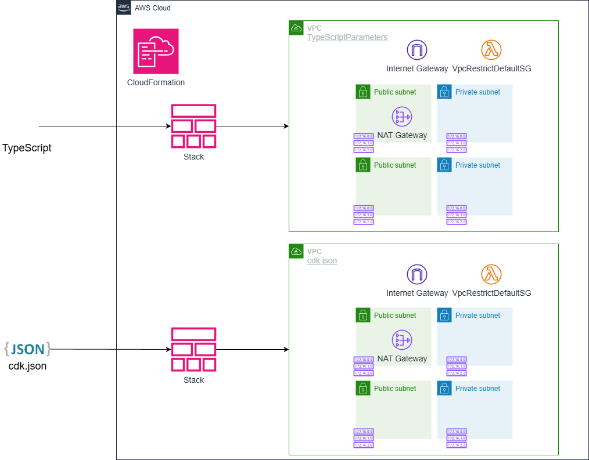

# CDK-PARAMETERS —— TypeScript vs cdk.json でパラメータを管理する2つの方法

*他の言語で読む:* [](./README.ja.md) [](./README.md)

## はじめに

このアーキテクチャでは、以下の実装を確認することができます。

- TypeScriptファイルでパラメータを定義する方法（型安全性重視）
- cdk.jsonでパラメータを定義する方法（柔軟性重視）
- 環境別パラメータの管理とベストプラクティス
- デプロイ時のパラメータ検証
- 各アプローチのメリット・デメリット
- 実務での使い分け方

### なぜパラメータ管理が重要なのか?

1. 環境の分離: 開発・ステージング・本番で異なる設定を使用
2. コードの再利用性: 同じコードを異なる設定で繰り返し使用
3. 設定の可視性: どのような値が使われているかを明確に
4. 変更の容易さ: コードを変更せずに設定だけを変更可能
5. 型安全性: TypeScriptの型システムを活用した安全な設定管理

## アーキテクチャ概要

構築する内容は次のとおりです。



2つのパラメータ管理アプローチを実装します。

### 1. TypeScriptパラメータ (CdkTSParametersStack)

- TypeScriptファイルでパラメータを定義
- 型安全性とIDEのサポート
- 環境ごとに独立したパラメータファイル
- コンパイル時の検証

### 2. cdk.jsonパラメータ (CdkJsonParametersStack)

- cdk.jsonのcontextセクションでパラメータを定義
- JSONベースの柔軟な設定
- CDK標準のアプローチ
- 動的な値の取得が容易

どちらのアプローチでも同じVPCリソースを作成しますが、パラメータの定義方法と型安全性が異なります。

## 前提条件

この演習を進めるには、以下が必要です。

- AWS CLI v2のインストールと設定
- Node.js 20+
- AWS CDK CLI（`npm install -g aws-cdk`）
- TypeScriptの基礎知識
- AWSアカウント（無料利用枠で実施可能）
- VPCの基本概念理解（[第3回VPC Basics](https://dev.to/aws-builders/aws-cdk-100-drill-exercises-003-vpc-basics-from-network-configuration-to-security-4ddd)を参照）

## プロジェクトディレクトリ構造

```text
cdk-parameters/
├── bin/
│   └── cdk-parameters.ts                # アプリケーションエントリーポイント
├── lib/
│   ├── stacks/
│   │   ├── cdk-ts-parameters-stack.ts   # TypeScriptパラメータ版スタック
│   │   └── cdk-json-parameters-stack.ts # cdk.jsonパラメータ版スタック
│   └── types/
│       ├── common.ts                     # 共通型定義
│       ├── vpc.ts                        # VPC型定義
│       └── index.ts                      # 型定義
├── parameters/
│   ├── environments.ts                   # 環境定義とパラメータインターフェース
│   ├── dev-params.ts                     # 開発環境パラメータ
│   ├── stg-params.ts                     # ステージング環境パラメータ
│   ├── prd-params.ts                     # 本番環境パラメータ
│   └── index.ts                          # パラメータのエクスポート
├── test/
│   ├── compliance/
│   │   └── cdk-nag.test.ts              # コンプライアンステスト
│   ├── snapshot/
│   │   └── snapshot.test.ts             # スナップショットテスト
│   └── unit/
│       ├── cdk-ts-parameters-stack.test.ts # ユニットテスト
│       └── cdk-json-parameters-stack.test.ts
├── cdk.json                              # CDK設定とJSONパラメータ
├── package.json
└── tsconfig.json
```

## パターン1: TypeScriptファイルでパラメータを定義する

### 型定義の作成

まず、パラメータの型を定義します。これにより、IDEの補完とコンパイル時の型チェックが可能になります。

```typescript
// lib/types/index.ts
import * as ec2 from 'aws-cdk-lib/aws-ec2';

export enum Environment {
  DEVELOPMENT = 'dev',
  STAGING = 'stg',
  PRODUCTION = 'prd',
  TEST = 'test',
}

export interface SubnetConfig {
  subnetType: ec2.SubnetType;
  name: string;
  cidrMask: number;
}

export interface VpcCreateConfig {
  vpcName?: string;
  cidr: string;
  maxAzs?: number;
  natCount?: number;
  enableDnsHostnames?: boolean;
  enableDnsSupport?: boolean;
  subnets?: SubnetConfig[];
}

export interface VpcConfig {
  existingVpcId?: string;
  createConfig?: VpcCreateConfig;
}
```

**ポイント:**

- `SubnetConfig`や`VpcCreateConfig`などの細かい型定義により、設定ミスを防止
- `enum`を使用した環境名の定義で、タイポを防止
- オプショナルプロパティ(`?`)により、デフォルト値の使用を可能に

### 環境別パラメータファイル

各環境ごとにパラメータファイルを作成します。

```typescript
// parameters/environments.ts
export interface EnvParams {
    accountId: string;
    vpcConfig: VpcConfig;
}

export const params: Record<Environment, EnvParams> = {} as Record<Environment, EnvParams>;
```

```typescript
// parameters/dev-params.ts
import * as ec2 from 'aws-cdk-lib/aws-ec2';
import * as types from 'lib/types';
import { params, EnvParams } from 'parameters/environments';

const devParams: EnvParams = {
    accountId: '111122223333',  // 開発環境のAWSアカウントID
    vpcConfig: {
        createConfig: {
            vpcName: 'DevVPC',
            cidr: '10.10.0.0/16',
            maxAzs: 2,              // 開発環境は2つのAZのみ
            natCount: 1,            // コスト削減のためNATは1つ
            enableDnsHostnames: true,
            enableDnsSupport: true,
            subnets: [
                {
                    subnetType: ec2.SubnetType.PUBLIC,
                    name: 'Public',
                    cidrMask: 24,
                },
                {
                    subnetType: ec2.SubnetType.PRIVATE_WITH_EGRESS,
                    name: 'Private',
                    cidrMask: 24,
                },
            ],
        },
    },
};

// グローバルparamsオブジェクトに登録
params[types.Environment.DEVELOPMENT] = devParams;
```

```typescript
// parameters/prd-params.ts
import * as ec2 from 'aws-cdk-lib/aws-ec2';
import * as types from 'lib/types';
import { params, EnvParams } from 'parameters/environments';

const prdParams: EnvParams = {
    accountId: '999988887777',  // 本番環境のAWSアカウントID
    vpcConfig: {
        createConfig: {
            vpcName: 'PrdVPC',
            cidr: '10.0.0.0/16',
            maxAzs: 3,              // 本番環境は3つのAZで冗長性確保
            natCount: 3,            // 各AZにNAT Gatewayを配置
            enableDnsHostnames: true,
            enableDnsSupport: true,
            subnets: [
                {
                    subnetType: ec2.SubnetType.PUBLIC,
                    name: 'Public',
                    cidrMask: 24,
                },
                {
                    subnetType: ec2.SubnetType.PRIVATE_WITH_EGRESS,
                    name: 'Private',
                    cidrMask: 24,
                },
            ],
        },
    },
};

params[types.Environment.PRODUCTION] = prdParams;
```

**ポイント:**

- 開発環境と本番環境で異なる設定（AZ数、NAT Gateway数）
- アカウントIDを含めることで、誤ったアカウントへのデプロイを防止
- 型安全性により、設定ミスをコンパイル時に検出

### パラメータを使用するスタック

```typescript
// lib/stacks/cdk-parameters-stack.ts
import * as cdk from 'aws-cdk-lib/core';
import { Construct } from 'constructs';
import { VpcConfig, Environment } from 'lib/types';
import * as ec2 from 'aws-cdk-lib/aws-ec2';
import { pascalCase } from 'change-case-commonjs';

export interface StackProps extends cdk.StackProps {
  project: string;
  environment: Environment;
  isAutoDeleteObject: boolean;
  vpcConfig: VpcConfig;
}

export class CdkTSParametersStack extends cdk.Stack {
  public readonly vpc: ec2.IVpc;
  
  constructor(scope: Construct, id: string, props: StackProps) {
    super(scope, id, props);

    // 既存VPCの参照
    if (props.vpcConfig.existingVpcId) {
      this.vpc = ec2.Vpc.fromLookup(this, 'VPC', {
        vpcId: props.vpcConfig.existingVpcId,
      });
      return;
    }

    // 新規VPCの作成
    if (props.vpcConfig.createConfig) {
      const createConfig = props.vpcConfig.createConfig;
      const vpcNameSuffix = createConfig.vpcName ?? 'vpc';
      
      this.vpc = new ec2.Vpc(this, 'VPC', {
        vpcName: `${pascalCase(props.project)}/${pascalCase(props.environment)}/${pascalCase(vpcNameSuffix)}`,
        ipAddresses: ec2.IpAddresses.cidr(createConfig.cidr),
        maxAzs: createConfig.maxAzs || cdk.Stack.of(this).availabilityZones.length,
        natGateways: createConfig.natCount || 1,
        subnetConfiguration: createConfig.subnets || [
          // デフォルトのサブネット設定
          {
            subnetType: ec2.SubnetType.PUBLIC,
            name: 'Public',
            cidrMask: 24,
          },
          {
            subnetType: ec2.SubnetType.PRIVATE_WITH_EGRESS,
            name: 'Private',
            cidrMask: 24,
          },
        ],
        enableDnsHostnames: createConfig.enableDnsHostnames ?? true,
        enableDnsSupport: createConfig.enableDnsSupport ?? true,
      });
    } else {
      throw new Error('VPC configuration is required to create the VPC.');
    }
  }
}
```

**ポイント:**

- `VpcConfig`インターフェースにより、型安全なパラメータ受け渡し
- 既存VPCの参照と新規作成の両方に対応
- デフォルト値の設定により、最小限のパラメータで動作

### エントリーポイントとデプロイ時検証

```typescript
// bin/cdk-parameters.ts
#!/usr/bin/env node
import * as cdk from 'aws-cdk-lib/core';
import { pascalCase } from "change-case-commonjs";
import { params } from "parameters/environments";
import { CdkParametersStage } from 'lib/stages/cdk-parameters-stage';
import { Environment } from 'lib/types/common';
import { validateDeployment } from '@common/helpers/validate-deployment';
import 'parameters';

const app = new cdk.App();

const pjName: string = app.node.tryGetContext("project");
const envName: Environment = 
app.node.tryGetContext("env") || Environment.DEVELOPMENT;

const defaultEnv = {
    account: process.env.CDK_DEFAULT_ACCOUNT,
    region: process.env.CDK_DEFAULT_REGION,
};

// パラメータの存在確認
if (!params[envName]) {
throw new Error(`No parameters found for environment: ${envName}`);
}

// デプロイ前の検証
validateDeployment(pjName, envName, params[envName].accountId);

const isAutoDeleteObject = true;
const isTerminationProtection = false;

new CdkParametersStage(app, `${pascalCase(envName)}`, {
    project: pjName,
    environment: envName,
    env: defaultEnv,
    terminationProtection: isTerminationProtection,
    isAutoDeleteObject: isAutoDeleteObject,
    params: params[envName],
});

cdk.Tags.of(app).add("Project", pjName);
cdk.Tags.of(app).add("Environment", envName);
```

**デプロイ時検証の実装:**

```typescript
// common/helpers/validate-deployment.ts
export function validateDeployment(
  pjName: string, 
  envName: string, 
  accountId?: string
): void {
  console.log(`Project Name: ${pjName}`);
  console.log(`Environment Name: ${envName}`);
  
  // アカウントIDの検証
  if (accountId) {
    const isSameAccount = accountId === process.env.CDK_DEFAULT_ACCOUNT;
    if (!isSameAccount) {
      const warningBox = [
        '',
        '╭────────────────────────────────────────────────────────────╮',
        '│ ❌ ACCOUNT MISMATCH WARNING                                │',
        '│                                                            │',
        '│  The provided account ID does not match the current        │',
        '│  CDK account.                                              │',
        '│                                                            │',
        `│  Expected: ${accountId}                                    │`,
        `│  Current:  ${process.env.CDK_DEFAULT_ACCOUNT}              │`,
        '│                                                            │',
        '╰────────────────────────────────────────────────────────────╯',
        '',
      ].join('\n');
      console.log(warningBox);
      throw new Error('Account ID mismatch. Deployment aborted.');
    }
  }

  // 本番環境へのデプロイ確認
  if (envName === 'prd') {
    const cautionBox = [
      '',
      '╭────────────────────────────────────────────────────────────╮',
      '│ 🚨 PRODUCTION DEPLOYMENT                                   │',
      '│                                                            │',
      '│  This is a production release.                             │',
      '│  Please review carefully before proceeding.                │',
      '│                                                            │',
      '╰────────────────────────────────────────────────────────────╯',
      '',
    ].join('\n');
    console.log(cautionBox);
    
    const readlineSync = require('readline-sync');
    const answer = readlineSync.question(
      'Are you sure you want to proceed? (yes/no): '
    );
    
    if (answer.toLowerCase() !== 'yes') {
      throw new Error('Deployment aborted by user.');
    }
    console.log('✓ Proceeding with deployment...');
  }
}
```

**ポイント:**

- アカウントIDの検証により、誤ったアカウントへのデプロイを防止
- 本番環境へのデプロイ前にユーザー確認を要求
- 視覚的に分かりやすいボックス表示

### デプロイ方法

```bash
# 開発環境へのデプロイ
npm run stage:deploy:all --project=myproject --env=dev

# 本番環境へのデプロイ（確認プロンプトあり）
npm run stage:deploy:all --project=myproject --env=prd
```

### TypeScriptアプローチのメリット・デメリット

**メリット:**

- 型安全性: コンパイル時に設定ミスを検出
- IDEサポート: 自動補完とリファクタリング
- 複雑なロジック: パラメータの計算や条件分岐が容易
- 再利用性: 共通の型定義を複数のスタックで使用
- バージョン管理: Gitでパラメータの変更履歴を追跡

**デメリット:**

- 変更時の再コンパイル: パラメータ変更のたびにビルドが必要
- 初期セットアップ: 型定義とファイル構造の準備が必要
- 学習コスト: TypeScriptの知識が必要

## パターン2: cdk.jsonでパラメータを定義する

### cdk.jsonでのパラメータ定義

```json
// cdk.json
{
  "app": "npx ts-node --prefer-ts-exts bin/cdk-parameters.ts",
  "context": {
    "dev": {
      "vpcConfig": {
        "createConfig": {
          "vpcName": "DevVPC",
          "cidr": "10.100.0.0/16",
          "maxAzs": 2,
          "natCount": 1,
          "enableDnsHostnames": true,
          "enableDnsSupport": true,
          "subnets": [
            {
              "subnetType": "PUBLIC",
              "name": "Public",
              "cidrMask": 24
            },
            {
              "subnetType": "PRIVATE_WITH_NAT",
              "name": "Private",
              "cidrMask": 24
            }
          ]
        }
      }
    },
    "stg": {
      "vpcConfig": {
        "createConfig": {
          "vpcName": "StgVPC",
          "cidr": "10.101.0.0/16",
          "maxAzs": 2,
          "natCount": 2
        }
      }
    },
    "prd": {
      "vpcConfig": {
        "createConfig": {
          "vpcName": "PrdVPC",
          "cidr": "10.0.0.0/16",
          "maxAzs": 3,
          "natCount": 3
        }
      }
    }
  }
}
```

**ポイント:**

- 環境ごとのパラメータをJSONで定義
- CDK標準の`context`セクションを使用
- 再コンパイル不要で設定変更が可能

### cdk.jsonパラメータを使用するスタック

```typescript
// lib/stacks/cdk-json-parameters-stack.ts
import * as cdk from 'aws-cdk-lib/core';
import { Construct } from 'constructs';
import { Environment } from 'lib/types';
import * as ec2 from 'aws-cdk-lib/aws-ec2';
import { pascalCase } from 'change-case-commonjs';

export interface StackProps extends cdk.StackProps {
  project: string;
  environment: Environment;
  isAutoDeleteObject: boolean;
}

export class CdkJsonParametersStack extends cdk.Stack {
  public readonly vpc: ec2.IVpc;
  
  constructor(scope: Construct, id: string, props: StackProps) {
    super(scope, id, props);

    // cdk.jsonからパラメータを取得
    const params = this.node.tryGetContext(props.environment) || {};
    const vpcConfig = params['vpcConfig'] || {};

    // 既存VPCの参照
    if (vpcConfig['existingVpcId']) {
      this.vpc = ec2.Vpc.fromLookup(this, "VPC", {
        vpcId: vpcConfig['existingVpcId'],
      });
      return;
    }

    // createConfigの存在確認
    if (!vpcConfig['createConfig']) {
      throw new Error(
        'VPC createConfig is required in JSON parameters to create the VPC.'
      );
    }
    
    const createConfig = vpcConfig['createConfig'];
    
    // サブネット設定のマッピング
    const subnets = createConfig['subnets'] || [
      {
        subnetType: 'PUBLIC',
        name: 'Public',
        cidrMask: 24,
      },
      {
        subnetType: 'PRIVATE_WITH_NAT',
        name: 'Private',
        cidrMask: 24,
      }
    ];
    
    // VPC作成
    const vpcNameSuffix = createConfig['vpcName'] ?? 'vpc';
    this.vpc = new ec2.Vpc(this, "VPC", {
      vpcName: `${pascalCase(props.project)}/${pascalCase(props.environment)}/${pascalCase(vpcNameSuffix)}`,
      ipAddresses: ec2.IpAddresses.cidr(
        createConfig['cidr'] || '10.1.0.0/16'
      ),
      maxAzs: createConfig['maxAzs'] || 3,
      natGateways: createConfig['natCount'] || 1,
      subnetConfiguration: subnets.map((subnet: any) => {
        // 文字列のsubnetTypeをec2.SubnetTypeに変換
        if (subnet['subnetType'] === 'PUBLIC') {
          return {
            subnetType: ec2.SubnetType.PUBLIC,
            name: subnet['name'] || 'Public',
            cidrMask: subnet['cidrMask'] || 24,
          };
        } else if (subnet['subnetType'] === 'PRIVATE_WITH_NAT') {
          return {
            subnetType: ec2.SubnetType.PRIVATE_WITH_EGRESS,
            name: subnet['name'] || 'Private',
            cidrMask: subnet['cidrMask'] || 24,
          };
        }
        return null;
      }).filter((config: any) => config !== null),
    });
  }
}
```

**ポイント:**

- `this.node.tryGetContext()`でcdk.jsonから値を取得
- 文字列型のパラメータをTypeScriptの型に変換
- デフォルト値の設定により、最小限のパラメータで動作
- 型チェックはランタイムで実行

### cdk.jsonアプローチのメリット・デメリット

**メリット:**

- 再コンパイル不要: パラメータ変更後すぐにデプロイ可能
- CDK標準: CDKの標準的なアプローチ
- 外部ツール連携: JSONパーサーで簡単に読み取り可能
- 学習コスト低: JSONの知識のみで使用可能
- 動的な値: ランタイムで値を取得・計算可能

**デメリット:**

- 型安全性なし: ランタイムまで設定ミスを検出できない
- IDEサポート限定: 自動補完やリファクタリングが効かない
- 複雑なロジック: 計算や条件分岐が難しい
- エラーハンドリング: ランタイムエラーのハンドリングが必要

## どちらのアプローチを選ぶべきか?

### アプローチの比較表

| 観点 | TypeScriptアプローチ | cdk.jsonアプローチ |
|------|---------------------|-------------------|
| **型安全性** | ✅ コンパイル時に型チェック | ❌ ランタイムまで検出できない |
| **IDEサポート** | ✅ 自動補完・リファクタリング可能 | ⚠️ 限定的 |
| **変更の容易さ** | ⚠️ 再コンパイルが必要 | ✅ 再コンパイル不要 |
| **複雑なロジック** | ✅ 計算・条件分岐が容易 | ❌ 難しい |
| **外部ツール連携** | ⚠️ ビルドが必要 | ✅ JSONパーサーで簡単 |
| **学習コスト** | ⚠️ TypeScriptの知識が必要 | ✅ JSONのみで可能 |
| **初期セットアップ** | ⚠️ 型定義・ファイル構造が必要 | ✅ シンプル |
| **バージョン管理** | 変更履歴が明確 | 変更履歴が明確 |
| **エラー検出** | ✅ コンパイル時 | ❌ ランタイム |
| **CDK標準** | ⚠️ カスタムアプローチ | ✅ CDK標準 |

### 推奨される使用ケース

#### TypeScriptアプローチを推奨

- 大規模プロジェクト（多くのパラメータと複雑な設定）
- 型安全性を重視する場合
- チーム開発（IDEサポートで開発効率向上）
- 複雑なロジック（パラメータの計算や条件分岐）
- 長期運用（メンテナンス性と可読性重視）

#### cdk.jsonアプローチを推奨

- 小規模プロジェクト（シンプルな設定）
- 迅速な変更が必要な場合
- CDK初心者（TypeScriptの知識が限定的）
- CI/CD統合（外部ツールからの設定変更）
- プロトタイピング（迅速な実験と検証）

### ハイブリッドアプローチ

実務では、両方のアプローチを組み合わせることも有効です。

- 基本設定: cdk.jsonで管理（環境名、リージョンなど）
- 複雑な設定: TypeScriptで管理（VPC構成、セキュリティグループなど）
- 機密情報: AWS Secrets Managerから取得

```typescript
// ハイブリッドアプローチの例
const envName = app.node.tryGetContext("env"); // cdk.jsonから
const params = await getParametersFromTypeScript(envName); // TypeScriptから
const secrets = await getSecretsFromSecretsManager(); // Secrets Managerから
```

## テストの実装

両方のアプローチに対して、同じテストパターンを適用できます。

### ユニットテスト

```typescript
// test/unit/cdk-parameters-stack.test.ts
describe("CdkTSParametersStack Fine-grained Assertions", () => {
  let stackTemplate: Template;

  beforeAll(() => {
    const app = new cdk.App();
    const stack = new CdkTSParametersStack(app, "CdkParameters", {
      project: "TestProject",
      environment: Environment.TEST,
      env: { account: '123456789012', region: 'ap-northeast-1' },
      isAutoDeleteObject: true,
      terminationProtection: false,
      vpcConfig: {
        createConfig: {
          vpcName: "TestVPC",
          cidr: "10.1.0.0/16",
          maxAzs: 2,
          natCount: 1,
          subnets: [
            { subnetType: ec2.SubnetType.PUBLIC, name: 'Public', cidrMask: 24 },
            { subnetType: ec2.SubnetType.PRIVATE_WITH_EGRESS, name: 'Private', cidrMask: 24 },
          ],
        },
      },
    });
    stackTemplate = Template.fromStack(stack);
  });

  test("should create 1 VPC", () => {
    stackTemplate.resourceCountIs("AWS::EC2::VPC", 1);
  });

  test("VPC should have correct CIDR block", () => {
    stackTemplate.hasResourceProperties("AWS::EC2::VPC", {
      CidrBlock: "10.1.0.0/16",
    });
  });
});
```

### スナップショットテスト

```typescript
// test/snapshot/snapshot.test.ts
describe("Stack Snapshot Tests", () => {
  const app = new cdk.App({ context: testContext });

  // すべてのスタックを先に作成
  const stack = new CdkTSParametersStack(app, "CdkParameters", {
    project: projectName,
    environment: envName,
    env: defaultEnv,
    isAutoDeleteObject: true,
    terminationProtection: false,
    vpcConfig: envParams.vpcConfig,
  });

  const jsonParameterStack = new CdkJsonParametersStack(
    app, "CdkJsonParameters", {
    project: projectName,
    environment: envName,
    env: defaultEnv,
    isAutoDeleteObject: true,
    terminationProtection: false,
  });

  // テンプレート取得は全スタック作成後
  const stackTemplate = Template.fromStack(stack);
  const jsonParameterStackTemplate = Template.fromStack(jsonParameterStack);

  test("Complete CloudFormation template snapshot", () => {
    expect(stackTemplate.toJSON()).toMatchSnapshot();
    expect(jsonParameterStackTemplate.toJSON()).toMatchSnapshot();
  });
});
```

**ポイント:**

- `Template.fromStack()`を呼ぶ前にすべてのスタックを作成
- 両方のアプローチで同じテストパターンを使用
- スナップショットテストで意図しない変更を検出

## デプロイとクリーンアップ

### デプロイ

```bash
# TypeScriptパラメータ版のデプロイ
npm run stage:deploy:all --project=myproject --env=dev

# cdk.jsonパラメータ版のデプロイ
npm run stage:deploy:all --project=myproject --env=dev
```

### クリーンアップ

```bash
# すべてのリソースを削除
npm run stage:destroy:all --project=myproject --env=dev
```

## まとめ

この演習では、CDKでパラメータを管理する2つの主要なアプローチを学びました。

### 学んだこと

1. TypeScriptアプローチ: 型安全性とIDEサポートによる開発効率
2. cdk.jsonアプローチ: 柔軟性と迅速な変更
3. デプロイ時検証: アカウントIDチェックと本番環境確認
4. テスト戦略: 両方のアプローチに適用可能なテストパターン
5. ベストプラクティス: プロジェクト規模に応じた使い分け

### ベストプラクティス

1. 型定義の活用: TypeScriptの型システムを最大限に活用
2. デフォルト値: 必須でないパラメータにデフォルト値を設定
3. 検証の実装: デプロイ前のパラメータ検証を実装
4. ドキュメント化: パラメータの意味と制約を明確に
5. テストの実施: パラメータの変更に対するテストを実装

## 参考リソース

- [AWS CDK Documentation - Context Values](https://docs.aws.amazon.com/cdk/v2/guide/context.html)
- [AWS CDK Best Practices](https://docs.aws.amazon.com/cdk/v2/guide/best-practices.html)
- [TypeScript Handbook](https://www.typescriptlang.org/docs/handbook/intro.html)
