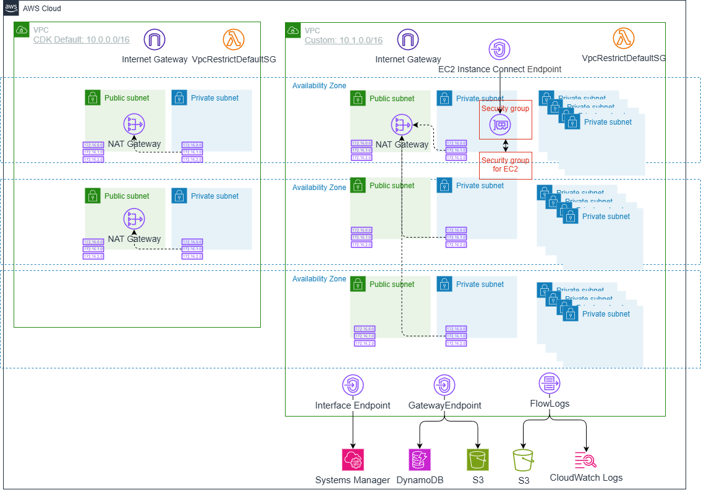

# VPC-BASICS

*他の言語で読む:* [](./README.ja.md) [](./README.md)


## はじめに

このアーキテクチャでは、以下の実装を確認することができます。

- CDKでVPCを作成する2つのアプローチ（デフォルトとカスタム）
- サブネット設計とCIDRブロックの計算
- パブリック/プライベートサブネットの違い
- NAT GatewayとInternet Gatewayの役割
- VPCフローログによる通信監視
- VPCエンドポイント（Gateway/Interface）の実装
- EC2 Instance Connect Endpointによる安全なSSHアクセス
- セキュリティグループの相互参照と循環依存の回避

## アーキテクチャ概要

構築する内容は次のとおりです。



以下の2つのパターンを実装します。

- デフォルトVPC: CDKのデフォルト設定で作成
- カスタムVPC: カスタム設定で作成

### 1. デフォルトVPC (CDKDefault)

- CDKのデフォルト設定で作成されるVPC
- 最小限のコードで完全な機能を持つVPC

### 2. カスタムVPC (CustomVPC)

- カスタム設定によるVPC作成
  - 最大3つのアベイラビリティゾーン（リージョンにより異なる）
  - 3種類のサブネット（Public、Internal、Private）
  - カスタムCIDRブロック
  - 単一NAT Gateway（コスト最適化）
- VPCフローログの実装
  - S3への全トラフィック記録
  - CloudWatch Logsへの拒否トラフィック記録
- VPCエンドポイント
  - Gateway Endpoints（S3、DynamoDB）
  - Interface Endpoints（Systems Manager）
- EC2 Instance Connect Endpoint
  - インターネット経由せずに安全なSSHアクセス
  - セキュリティグループの相互参照

## 前提条件

- AWS CLI v2のインストールと設定
- Node.js 20+
- AWS CDK CLI（`npm install -g aws-cdk`）
- TypeScriptの基礎知識
- AWSアカウント（無料利用枠で実施可能）
- VPCの基本概念理解（CIDR、サブネット、ルーティング）

## プロジェクトディレクトリ構造

```text
vpc-basics/
├── bin/
│   └── vpc-basics.ts                    # アプリケーションエントリーポイント
├── lib/
│   └── stacks/
│       ├── vpc-cdkdefault-stack.ts      # CDKデフォルトVPC作成スタック
│       └── vpc-basics-stack.ts          # カスタムVPCスタック定義
├── test/
│   ├── compliance/
│   │   └── cdk-nag.test.ts              # CDK Nagコンプライアンステスト
│   ├── snapshot/
│   │   └── snapshot.test.ts             # スナップショットテスト
│   └── unit/
│       ├── vpc-cdkdefault.test.ts       # ユニットテスト
│       └── vpc-basics.test.ts           # ユニットテスト
├── cdk.json
├── package.json
└── tsconfig.json
```

## パターン1: CDKデフォルトVPCを理解する

最もシンプルなVPC作成です。CDKがすべての設定を自動的に行います。

```typescript
import * as cdk from 'aws-cdk-lib';
import { Construct } from 'constructs';
import * as ec2 from 'aws-cdk-lib/aws-ec2';

export class VpcCDKDefaultStack extends cdk.Stack {
  constructor(scope: Construct, id: string, props?: cdk.StackProps) {
    super(scope, id, props);

    // CDKデフォルト設定でVPCを作成
    new ec2.Vpc(this, 'CDKDefault', {});
  }
}
```

### デフォルト構成の詳細

CDKが自動的に設定する内容:

- CIDRブロック: `10.0.0.0/16`（65,536個のIPアドレス）
- アベイラビリティゾーン: リージョンで利用可能なAZ（最大3つ）
- サブネット構成:
  - パブリックサブネット: 各AZに1つ
  - プライベートサブネット: 各AZに1つ
- NAT Gateway: 各AZに1つ（高可用性構成）
- Internet Gateway: 1つ
- ルートテーブル: 自動構成

生成されるリソース:

```text
CDKDefault VPC (10.0.0.0/16)
├── AZ-1
│   ├── Public Subnet (10.0.0.0/19)    - 8,192 IPs
│   ├── Private Subnet (10.0.96.0/19)  - 8,192 IPs
│   └── NAT Gateway
├── AZ-2
│   ├── Public Subnet (10.0.32.0/19)   - 8,192 IPs
│   ├── Private Subnet (10.0.128.0/19) - 8,192 IPs
│   └── NAT Gateway
├── AZ-3
│   ├── Public Subnet (10.0.64.0/19)   - 8,192 IPs
│   ├── Private Subnet (10.0.160.0/19) - 8,192 IPs
│   └── NAT Gateway
└── Internet Gateway
```

### デフォルトVPCのメリットとデメリット

メリット:

- 最小限のコード
- 本番環境で使える構成
- 高可用性（複数AZ、複数NAT Gateway）
- ベストプラクティスに準拠

デメリット:

- コストが高い（NAT Gatewayが複数）
- CIDR範囲のカスタマイズ不可
- サブネット数の調整不可

💡 開発環境では、コスト削減のためにカスタムVPCを使用することを推奨します。

## パターン2: カスタムVPCの作成

実際のプロジェクトでは、要件に合わせたVPCを作成します。

```typescript
import { pascalCase } from "change-case-commonjs";

const vpcName = [
  pascalCase(props.project),         // プロジェクト名
  pascalCase(props.environment),     // 環境識別子（dev/test/prod）
  'CustomVPC',                 // 用途
]
  .join('/');

const customVpc = new ec2.Vpc(this, 'CustomVPC', {
  vpcName,
  ipAddresses: ec2.IpAddresses.cidr('10.1.0.0/16'),
  maxAzs: 3,              // 最大3つのAZを使用
  natGateways: 1,         // NAT Gatewayは1つのみ（コスト最適化）
  subnetConfiguration: [
    {
      cidrMask: 26,       // 64 IPs per AZ (/26 = 2^(32-26) = 64)
      name: 'ExternalSubnet',
      subnetType: ec2.SubnetType.PUBLIC,
    },
    {
      cidrMask: 27,       // 32 IPs per AZ (/27 = 2^(32-27) = 32)
      name: 'ManagementSubnet',
      subnetType: ec2.SubnetType.PUBLIC,
    },
    {
      cidrMask: 22,       // 1024 IPs per AZ (/22 = 2^(32-22) = 1024)
      name: 'InternalSubnet',
      subnetType: ec2.SubnetType.PRIVATE_WITH_EGRESS,
    },
    {
      cidrMask: 22,       // 1024 IPs per AZ
      name: 'ApplicationSubnet',
      subnetType: ec2.SubnetType.PRIVATE_WITH_EGRESS,
    },
    {
      cidrMask: 24,       // 256 IPs per AZ (/24 = 2^(32-24) = 256)
      name: 'IsolatedSubnet',
      subnetType: ec2.SubnetType.PRIVATE_ISOLATED,
    },
    {
      cidrMask: 28,       // 16 IPs per AZ (/28 = 2^(32-28) = 16)
      name: 'TransitGatewaySubnet',
      subnetType: ec2.SubnetType.PRIVATE_ISOLATED,
    }
  ],
});
```

### CIDR計算の理解

CIDR（Classless Inter-Domain Routing）は、IPアドレスの範囲を定義します。

基本的な計算式は次のとおりです。

```text
利用可能なIPアドレス数 = 2^(32 - CIDR mask)

/16 = 2^(32-16) = 2^16 = 65,536 IPs
/22 = 2^(32-22) = 2^10 = 1,024 IPs
/24 = 2^(32-24) = 2^8  = 256 IPs
/26 = 2^(32-26) = 2^6  = 64 IPs
/27 = 2^(32-27) = 2^5  = 32 IPs
/28 = 2^(32-28) = 2^4  = 16 IPs
```

各サブネットで、AWSは5つのIPv4アドレスを予約しています。（ドキュメントは[こちら](https://docs.aws.amazon.com/vpc/latest/userguide/subnet-sizing.html)）

- `.0`: ネットワークアドレス
- `.1`: VPCルーター
- `.2`: DNS
- `.3`: 将来の使用のため予約
- `.255`: ブロードキャスト（VPCでは使用不可だが予約）

実際の利用可能IPhは、`計算値 - 5`となります。

### サブネットタイプの違い

| タイプ | 説明 | ルーティング | ユースケース |
|--------|------|--------------|--------------|
| `PUBLIC` | インターネットゲートウェイへのルート | IGW経由でインターネット | ロードバランサー、NAT Gateway、Bastion |
| `PRIVATE_WITH_EGRESS` | NAT Gatewayへのルート | NAT経由でアウトバウンドのみ | アプリケーションサーバー、VPCエンドポイント |
| `PRIVATE_ISOLATED` | インターネットへのルートなし | VPC内のみ | データベース、Transit Gatewayアタッチメント |

### サブネット構成の設計

```text
CustomVPC (10.1.0.0/16) - 65,536 IPs
├── AZ-1 (ap-northeast-1a)
│   ├── ExternalSubnet-1 (10.1.0.0/26)           - 64 IPs (59 利用可能)
│   ├── ManagementSubnet-1 (10.1.0.64/27)        - 32 IPs (27 利用可能)
│   ├── InternalSubnet-1 (10.1.0.128/22)         - 1,024 IPs (1,019 利用可能)
│   ├── ApplicationSubnet-1 (10.1.4.128/22)      - 1,024 IPs (1,019 利用可能)
│   ├── IsolatedSubnet-1 (10.1.8.128/24)         - 256 IPs (251 利用可能)
│   └── TransitGatewaySubnet-1 (10.1.9.0/28)     - 16 IPs (11 利用可能)
├── AZ-2 (ap-northeast-1c)
│   ├── ExternalSubnet-2 (10.1.0.96/26)          - 64 IPs (59 利用可能)
│   ├── ManagementSubnet-2 (10.1.0.160/27)       - 32 IPs (27 利用可能)
│   ├── InternalSubnet-2 (10.1.9.16/22)          - 1,024 IPs (1,019 利用可能)
│   ├── ApplicationSubnet-2 (10.1.13.16/22)      - 1,024 IPs (1,019 利用可能)
│   ├── IsolatedSubnet-2 (10.1.17.16/24)         - 256 IPs (251 利用可能)
│   └── TransitGatewaySubnet-2 (10.1.18.0/28)    - 16 IPs (11 利用可能)
├── AZ-3 (ap-northeast-1d)
│   ├── ExternalSubnet-3 (10.1.0.192/26)         - 64 IPs (59 利用可能)
│   ├── ManagementSubnet-3 (10.1.0.224/27)       - 32 IPs (27 利用可能)
│   ├── InternalSubnet-3 (10.1.17.32/22)         - 1,024 IPs (1,019 利用可能)
│   ├── ApplicationSubnet-3 (10.1.21.32/22)      - 1,024 IPs (1,019 利用可能)
│   ├── IsolatedSubnet-3 (10.1.25.32/24)         - 256 IPs (251 利用可能)
│   └── TransitGatewaySubnet-3 (10.1.26.32/28)   - 16 IPs (11 利用可能)
├── NAT Gateway (AZ-1のみ)
└── Internet Gateway
```

### なぜ6種類のサブネット?

サブネットは細かく分ければよいというわけではありませんが、サブネットの使い分けの例として6つを作成しました。
サブネットを細かく区切ると、サブネットごとに予約済みIPを無駄に消費してしまいますので、実際のプロジェクトでは、要件に応じてサブネット構成を調整してください。
基本的なプロジェクトにおいては、Public SubnetとPrivate Subnetの2種類で十分という場合が多いです。

1. ExternalSubnet (Public): インターネット向けロードバランサー、NAT Gatewayの配置用
2. ManagementSubnet (Public): Bastion Hostなど運用管理用
3. InternalSubnet (Private with Egress): VPCエンドポイント、内部ロードバランサーの配置用
4. ApplicationSubnet (Private with Egress): アプリケーションサーバー、ECSタスク、Lambda関数の配置用
5. IsolatedSubnet (Private Isolated): RDS、ElastiCache等のデータベース層
6. TransitGatewaySubnet (Private Isolated): Transit Gatewayアタッチメント専用（オンプレミス接続用）

## VPCフローログの実装

VPCフローログは、VPC内のネットワークトラフィックを記録します。

### S3へのフローログ

```typescript
import * as s3 from 'aws-cdk-lib/aws-s3';

// セキュアなS3バケットを作成
const flowLogBucket = new s3.Bucket(this, 'FlowLogBucket', {
  encryption: s3.BucketEncryption.S3_MANAGED,
  blockPublicAccess: s3.BlockPublicAccess.BLOCK_ALL,
  enforceSSL: true,  // HTTPS必須
  removalPolicy: cdk.RemovalPolicy.DESTROY,  // ⚠️ 開発環境用（本番ではRETAIN推奨）
  autoDeleteObjects: true,  // ⚠️ 開発環境用（本番ではremovalPolicyのRETAIN推奨）
});

// すべてのトラフィックをS3に記録
customVpc.addFlowLog('FlowLogToS3', {
  destination: ec2.FlowLogDestination.toS3(
    flowLogBucket,
    'vpcFlowLog/',
    {
      fileFormat: ec2.FlowLogFileFormat.PLAIN_TEXT,
      hiveCompatiblePartitions: true,  // Athenaクエリ用
      perHourPartition: true,
    }
  ),
  trafficType: ec2.FlowLogTrafficType.ALL,
});
```

生成されるログファイル構造:

```text
s3://bucket-name/vpcFlowLog/
└── AWSLogs/
    └── aws-account-id=123456789012/
        └── aws-service=vpcflowlogs/
            └── aws-region=ap-northeast-1/
                └── year=2024/
                    └── month=12/
                        └── day=20/
                            └── hour=12/
                                └── <AWSAccountID>_vpcflowlogs_<region>_xxxxx.log.gz
```

### CloudWatch Logsへのフローログ

```typescript
import * as logs from 'aws-cdk-lib/aws-logs';

// 拒否されたトラフィックのみをCloudWatch Logsに記録
customVpc.addFlowLog('FlowLog', {
  destination: ec2.FlowLogDestination.toCloudWatchLogs(
    new logs.LogGroup(this, 'FlowLogGroup', {
      retention: logs.RetentionDays.ONE_WEEK,
      removalPolicy: cdk.RemovalPolicy.DESTROY,
    })
  ),
  trafficType: ec2.FlowLogTrafficType.REJECT,  // 拒否のみ
});
```

### フローログの使い分け

| 送信先 | メリット | デメリット | ユースケース |
|--------|----------|-----------|--------------|
| S3 | - 長期保存に最適<br>- Athenaで分析可能<br>- コスト効率的 | - リアルタイム分析不可 | 監査、コンプライアンス、長期分析 |
| CloudWatch Logs | - リアルタイム監視<br>- メトリクスフィルター<br>- アラート設定可能 | - ストレージコストが高い | セキュリティ監視、即座の脅威検出 |

### フローログフォーマット

```text
version account-id interface-id srcaddr dstaddr srcport dstport protocol packets bytes start end action log-status
2 123456789012 eni-1234abcd 10.0.1.5 203.0.113.5 49152 80 6 10 5000 1670000000 1670000060 ACCEPT OK
```

各フィールドの主な項目は次のとおりです。詳しくは[ドキュメント](https://docs.aws.amazon.com/vpc/latest/userguide/flow-log-records.html#flow-logs-fields)を参照してください。

- `srcaddr/dstaddr`: 送信元/送信先IPアドレス
- `srcport/dstport`: 送信元/送信先ポート
- `protocol`: IPプロトコル番号（6=TCP、17=UDP）
- `action`: ACCEPT または REJECT

## VPCエンドポイント

VPCエンドポイントを使用すると、インターネットを経由せずにAWSサービスにアクセスできます。
また、Gatewayエンドポイント自体にはコストがかからず、NATゲートウェイの通信コストを削減できるため、該当するサービスと通信を行う場合は作成することを推奨します。

### Gateway Endpoints（S3とDynamoDB）

```typescript
const endpointSubnets = customVpc.selectSubnets({
    subnetGroupName: 'InternalSubnet',
});
// S3用Gateway Endpoint
customVpc.addGatewayEndpoint('S3Endpoint', {
  service: ec2.GatewayVpcEndpointAwsService.S3,
  subnets: [{ subnets: endpointSubnets.subnets }],
});

// DynamoDB用Gateway Endpoint
customVpc.addGatewayEndpoint('DynamoDbEndpoint', {
  service: ec2.GatewayVpcEndpointAwsService.DYNAMODB,
  subnets: [{ subnets: endpointSubnets.subnets }],
});
```

### Interface Endpoints（Systems Manager）

```typescript
// SSM用Interface Endpoint
customVpc.addInterfaceEndpoint('SSMEndpoint', {
  service: ec2.InterfaceVpcEndpointAwsService.SSM,
  subnets: {
    subnets: endpointSubnets.subnets,
  },
});

// SSM Messages用Interface Endpoint
customVpc.addInterfaceEndpoint('SSMMessagesEndpoint', {
  service: ec2.InterfaceVpcEndpointAwsService.SSM_MESSAGES,
  subnets: {
    subnets: endpointSubnets.subnets,
  },
});
```

### Gateway vs Interface Endpoints

| 特性 | Gateway Endpoint | Interface Endpoint |
|------|------------------|---------------------|
| サービス | S3、DynamoDB のみ | ほとんどのAWSサービス |
| 実装 | ルートテーブルエントリ | ENI（Elastic Network Interface） |
| 料金 | 無料 | 時間とデータ転送で課金 |
| DNS | 不要 | プライベートDNS使用可能 |
| セキュリティグループ | 使用不可 | 使用可能 |
| 可用性 | 高可用性（自動） | ENIごと（AZ単位） |

### なぜVPCエンドポイントを使うのか?

1. セキュリティ: トラフィックがインターネットを経由しない
2. パフォーマンス: 低レイテンシー
3. コスト削減: NAT Gatewayのデータ転送料金を削減
4. コンプライアンス: データをAWSネットワーク内に保持

## EC2 Instance Connect Endpoint

[EC2 Instance Connect Endpoint](https://docs.aws.amazon.com/AWSEC2/latest/UserGuide/connect-with-ec2-instance-connect-endpoint.html)を使用すると、パブリックIPアドレスやBastionホストなしで、プライベートサブネット内のEC2インスタンスにSSH接続できます。

なお、Instance Connect Endpointには以下の制約があります。詳しくは、[こちら](https://docs.aws.amazon.com/AWSEC2/latest/UserGuide/eice-quotas.html)のドキュメントを参照してください。

- AWS アカウント ごとの AWS リージョン あたりの EC2 Instance Connect エンドポイントの最大数: 5
- VPC あたりの EC2 Instance Connect エンドポイントの最大数: 1
- サブネットあたりの EC2 Instance Connect エンドポイントの最大数: 1
- EC2 Instance Connect エンドポイントあたりの同時接続の最大数: 20

```typescript
// Instance Connect用セキュリティグループ
const ec2InstanceConnectsg = new ec2.SecurityGroup(this, 'EC2InstanceConnectSG', {
  vpc: customVpc,
  description: 'Security group for EC2 Instance Connect Endpoint',
  allowAllOutbound: false,  // デフォルトのアウトバウンド拒否
});

// InternalSubnetの最初のサブネットを選択
const iceSubnet = endpointSubnets.subnets[0];

// Instance Connect Endpointを作成
new ec2.CfnInstanceConnectEndpoint(this, 'EC2InstanceConnectEndpoint', {
  subnetId: iceSubnet.subnetId,
  preserveClientIp: false,
  securityGroupIds: [ec2InstanceConnectsg.securityGroupId],
});

// EC2インスタンス用セキュリティグループ
const ec2sg = new ec2.SecurityGroup(this, 'EC2SG', {
  vpc: customVpc,
  description: 'Security group for EC2 instances',
  allowAllOutbound: true,
});
```

### セキュリティグループの相互参照と循環依存の回避

⚠️ 重要: `addIngressRule`や`addEgressRule`を使うと、2つのセキュリティグループ間で循環依存が発生します。
`cdk synth`では問題なく実行できますが、`cdk deploy`を行うとデプロイが失敗します。

間違った方法（循環依存が発生）:

```typescript
// ❌ これはエラーになります
ec2sg.addIngressRule(
  ec2InstanceConnectsg,
  ec2.Port.tcp(22),
  'Allow SSH from Instance Connect'
);

ec2InstanceConnectsg.addEgressRule(
  ec2sg,
  ec2.Port.tcp(22),
  'Allow SSH to EC2 instances'
);
// ❌  Dev-DrillexercisesVpcBasics failed: ValidationError: Circular dependency between resources: [EC2InstanceConnectSG697BC6D2, EC2InstanceConnectEndpoint, EC2SG244E8056]
```

正しい方法（CloudFormationリソースを直接使用）:

```typescript
// ✅ CfnSecurityGroupIngress/Egressを使用
// Ingress: Instance Connect SG -> EC2 SG
new ec2.CfnSecurityGroupIngress(this, 'AllowSSHFromInstanceConnect', {
  ipProtocol: 'tcp',
  fromPort: 22,
  toPort: 22,
  groupId: ec2sg.securityGroupId,
  sourceSecurityGroupId: ec2InstanceConnectsg.securityGroupId,
  description: 'Allow SSH from Instance Connect SG',
});

// Egress: Instance Connect SG -> EC2 SG
new ec2.CfnSecurityGroupEgress(this, 'AllowSSHToEC2SG', {
  ipProtocol: 'tcp',
  fromPort: 22,
  toPort: 22,
  groupId: ec2InstanceConnectsg.securityGroupId,
  destinationSecurityGroupId: ec2sg.securityGroupId,
  description: 'Allow SSH to EC2 SG',
});
```

### Instance Connect Endpointの使用方法

AWS CLIでInstance Connect Endpointを経由して、EC2インスタンスへの接続するには次のようにします。ドキュメントは[こちら](https://docs.aws.amazon.com/AWSEC2/latest/UserGuide/ec2-instance-connect-methods.html#connect-linux-inst-eic-cli-ssh)を参照してください。

```bash
# Instance Connect Endpointを経由してSSH接続
aws ec2-instance-connect ssh \
  --instance-id i-1234567890abcdef0 \
  --connection-type eice
```

### なぜInstance Connect Endpointを使うのか?

従来の方法との比較は次のとおりです。

| 方法 | パブリックIP | Bastionホスト | SSHキー管理 | 追加コスト |
|------|--------------|---------------|-------------|------------|
| EC2にパブリックIP付与 | 必要 | ✅不要 | 必要 | ✅なし |
| Bastionホスト | Bastionに必要 | 必要 | 必要 | EC2料金 |
| Instance Connect Endpoint | ✅不要 | ✅不要 | ✅不要 | あり |

メリット:

- インターネット露出なし
- SSHキー管理不要（IAM認証）
- Bastionホスト不要（コスト削減）
- すべての接続がCloudTrailでログ記録

## CloudFormation出力例

デプロイ後に生成されるCloudFormationテンプレートの主要部分:

```json
{
  "Resources": {
    "CustomVPC616E3387": {
      "Type": "AWS::EC2::VPC",
      "Properties": {
        "CidrBlock": "10.1.0.0/16",
        "EnableDnsHostnames": true,
        "EnableDnsSupport": true,
        "Tags": [
          {
            "Key": "Name",
            "Value": "Myproject/Dev/CustomVPC"
          }
        ]
      }
    },
    "CustomVPCS3Endpoint": {
      "Type": "AWS::EC2::VPCEndpoint",
      "Properties": {
        "ServiceName": "com.amazonaws.ap-northeast-1.s3",
        "VpcEndpointType": "Gateway",
        "RouteTableIds": [...]
      }
    },
    "CustomVPCSSMEndpoint": {
      "Type": "AWS::EC2::VPCEndpoint",
      "Properties": {
        "ServiceName": "com.amazonaws.ap-northeast-1.ssm",
        "VpcEndpointType": "Interface",
        "PrivateDnsEnabled": true,
        "SecurityGroupIds": [...],
        "SubnetIds": [...]
      }
    }
  }
}
```

## デプロイと検証

### デプロイ

```bash
# 差分を確認
cdk diff --project=myproject --env=dev

# デプロイ
cdk deploy "**" --project=myproject --env=dev
```

### 検証

1. VPCの確認

   ```bash
   # VPCをリスト
   aws ec2 describe-vpcs \
     --filters "Name=tag:Name,Values=*Myproject/Dev/CustomVPC*"
   
   # サブネットを確認
   aws ec2 describe-subnets \
     --filters "Name=vpc-id,Values=<vpc-id>"
   ```

2. VPCエンドポイントの確認

   ```bash
   # VPCエンドポイントをリスト
   aws ec2 describe-vpc-endpoints \
     --filters "Name=vpc-id,Values=<vpc-id>"
   ```

3. フローログの確認

   ```bash
   # S3バケット内のログを確認
   aws s3 ls s3://<bucket-name>/vpcFlowLog/ --recursive
   
   # CloudWatch Logsを確認
   aws logs describe-log-streams \
     --log-group-name <log-group-name>
   ```

4. セキュリティグループの確認

   ```bash
   # セキュリティグループをリスト
   aws ec2 describe-security-groups \
     --filters "Name=vpc-id,Values=<vpc-id>"
   ```

### クリーンアップ

```bash
# スタックを削除
cdk destroy "**" --project=myproject --env=dev

# 確認なしで強制削除
cdk destroy "**" --force --project=myproject --env=dev
```

💡 注意

- この例では開発環境用に`autoDeleteObjects: true`を設定しているため、スタック削除時にS3バケットも自動削除されます
- 本番環境では`removalPolicy: cdk.RemovalPolicy.RETAIN`を使用し、データの保護を検討してください

## ベストプラクティス

### ネットワーク設計

1. CIDR計画: 将来の拡張を考慮してCIDRブロックを設計
2. 複数AZ: 高可用性のために最低2つのAZを使用
   - `maxAzs`で最大数を指定できるが、実際の数はリージョンに依存
   - 東京リージョン(ap-northeast-1)では最大3つのAZが利用可能
3. サブネット分離: 異なる層（Web、App、DB）で異なるサブネットを使用
4. 予約IP: 各サブネットでAWSが予約する5つのIPを考慮

### セキュリティ

1. 最小権限: セキュリティグループは必要最小限のポートのみ開放
2. フローログ: すべてのVPCでフローログを有効化
3. VPCエンドポイント: インターネット経由を避けるために使用
4. プライベートサブネット: データベースは完全に分離されたサブネットに配置
5. NACLs: 必要に応じてネットワークACLで追加の層を提供

### コスト最適化

1. NAT Gateway数: 開発環境では1つのNAT Gatewayで十分
2. VPCエンドポイント: 使用頻度に基づいて選択
   - 高頻度: Interface Endpoint（時間単価でも価値あり）
   - 低頻度: NAT Gateway経由（従量課金）
3. フローログ: S3を使用して長期保存のコストを削減
4. リソースタグ: コスト追跡のためにすべてのリソースにタグ付け

### 運用

1. 命名規則: 一貫した命名パターンを使用

   ```text
   例: {project}-{environment}-{resource}-{account}-{region}
   ```

2. タグ戦略: Environment、Project、Owner、CostCenterタグを使用
3. 監視: CloudWatchでVPCメトリクスを監視
4. ドキュメント: ネットワーク図とCIDR割り当てを文書化

### テスト

1. スナップショットテスト: 変更差分を明確にする
2. ユニットテスト: リソースの存在と設定を検証
3. コンプライアンステスト: CDK Nagでセキュリティベストプラクティスを確認

## 料金見積もり

### 主要コンポーネントの料金例（東京リージョン）

CDKデフォルトVPCの場合:

| リソース | 数量 | 月額料金（概算） |
|---------|------|-----------------|
| VPC | 1 | $0（無料） |
| NAT Gateway | 3 | $133.92（$0.062/時間 × 24 × 30 × 3台） |
| NAT Gatewayデータ処理 | 100GB | $18.6（$0.062/GB × 3台） |
| VPC Gateway Endpoint | - | $0 |
| VPC Interface Endpoint | - | $0 |
| Endpointデータ処理 | - | $0 |
| 合計 | - | 約 $152.52/月 |

カスタムVPCの場合:

| リソース | 数量 | 月額料金（概算） |
|---------|------|-----------------|
| VPC | 1 | $0（無料） |
| NAT Gateway | 1 | $39.42（$0.062/時間 × 24 × 30） |
| NAT Gatewayデータ処理 | 100GB | $6.20（$0.062/GB） |
| VPC Gateway Endpoint | 2 | $0 |
| VPC Interface Endpoint | 2 | $15.12（$0.012/時間 × 2 × 24 × 30） |
| Endpointデータ処理 | 10GB | $0.12（$0.012/GB） |
| S3ストレージ（フローログ） | 50GB | $1.15（$0.023/GB） |
| CloudWatch Logs（7日保持） | 5GB | $0.35（$0.033/GB） |
| 合計 | - | 約 $62.36/月 |

💡 コスト削減のヒント

- 開発環境: NAT Gateway 1つで十分（本番では複数推奨）または、EC2インスタンスを利用したNATインスタンス
- フローログ: 開発環境では一時的に無効化可能
- VPCエンドポイント: 使用頻度に基づいて選択

## まとめ

このアーキテクチャでは、AWS CDKを通じてVPCの基礎を学びました。

### 学んだこと

1. VPCの基礎: CDKデフォルトとカスタムVPCの違い
2. サブネット設計: CIDR計算と3層サブネット構成
3. トラフィック管理: NAT Gateway、Internet Gateway、ルーティング
4. 可視性: VPCフローログによるネットワーク監視
5. VPCエンドポイント: GatewayとInterface Endpointsの使い分け
6. 安全なアクセス: Instance Connect Endpointの実装
7. セキュリティグループ: 相互参照と循環依存の回避
8. ベストプラクティス: セキュリティ、コスト、運用の観点

### 重要なポイント

- ネットワーク設計: 適切なCIDR計画が将来の拡張に重要
- セキュリティ層: ネットワークレベルでの分離と制御
- 可視性: フローログによる監視は必須
- コスト最適化: NAT Gateway数とVPCエンドポイントの選択
- 高可用性: 複数AZとフェイルオーバー設計

## 参考資料

- [Amazon VPC公式ドキュメント](https://docs.aws.amazon.com/vpc/)
- [VPCのベストプラクティス](https://docs.aws.amazon.com/vpc/latest/userguide/vpc-security-best-practices.html)
- [VPCフローログ](https://docs.aws.amazon.com/vpc/latest/userguide/flow-logs.html)
- [VPCエンドポイント](https://docs.aws.amazon.com/vpc/latest/privatelink/vpc-endpoints.html)
- [EC2 Instance Connect Endpoint](https://docs.aws.amazon.com/AWSEC2/latest/UserGuide/connect-with-ec2-instance-connect-endpoint.html)
