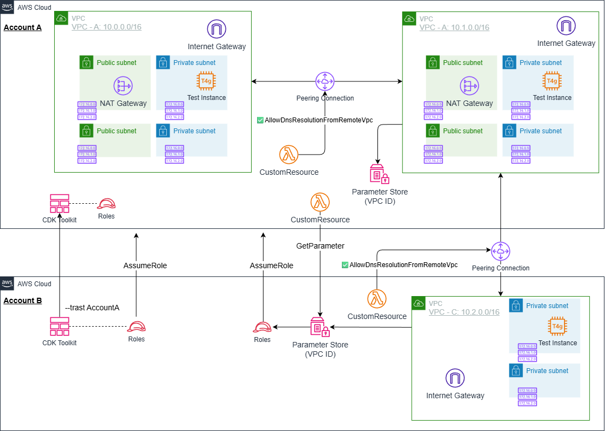
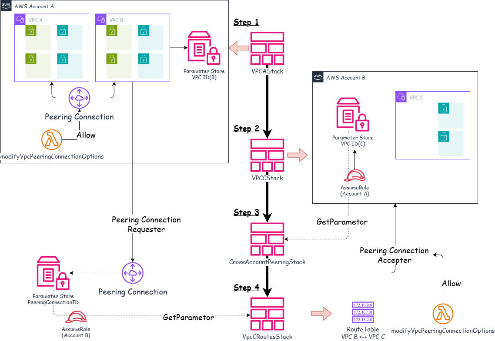
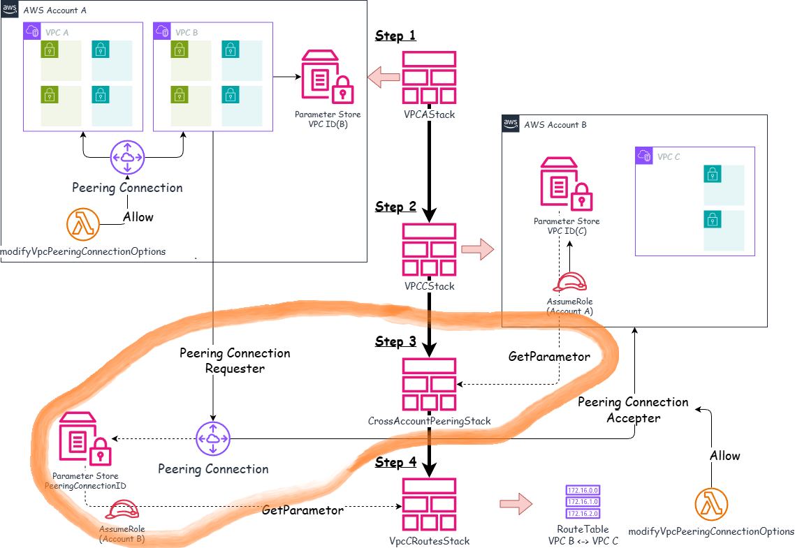
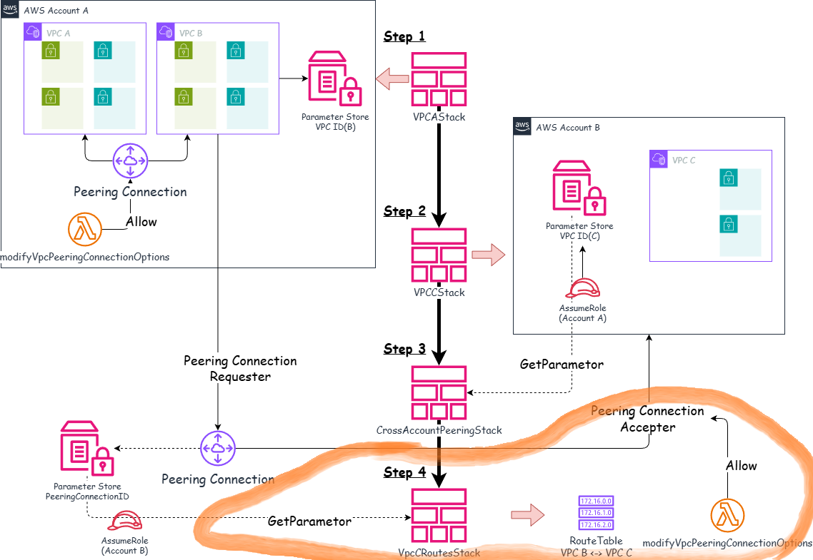
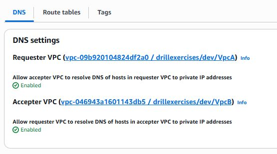
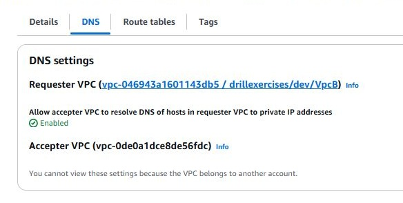

# VPC Peering Configuration Example

*Read this in other languages:* [](./README.ja.md) [](./README.md)

## Architecture Overview

This project is a reference implementation for building VPC Peering connections using AWS CDK.

This architecture demonstrates the following implementations:

- VPC Peering connection implementation (same account & cross-account)
- CDK cross-account stack reference limitations and solutions
- Value sharing using AWS Systems Manager Parameter Store
- Cross-account parameter reading via Custom Resources
- IAM Cross-Account Role design and implementation
- Automatic VPC Peering connection acceptance and route configuration
- Cross-account deployment best practices

### Why VPC Peering?

1. Multi-account strategy: Organizations are recommended to manage development, staging, and production environments in separate accounts
2. Secure communication: Private communication between VPCs without going through the internet
3. Cost efficiency: Simpler network configuration at lower cost compared to Transit Gateway
4. CDK complexity: Learn CDK limitations and workarounds for cross-account resource references
5. Practical necessity: Essential network configuration pattern in enterprise environments

## Architecture Overview

What we will build:



### Configuration Pattern

```text
Account A (111111111111):
├─ VPC A (10.0.0.0/16)
│  └─ Test Instance (Private Subnet)
├─ VPC B (10.1.0.0/16)
│  └─ Test Instance (Private Subnet)
└─ VPC A ↔ VPC B Peering (same account)

Account B (222222222222):
└─ VPC C (10.2.0.0/16)
   └─ Test Instance (Private Isolated Subnet)

Cross-account Peering:
VPC B (Account A) ↔ VPC C (Account B)
```

### Key Components

1. **VpcAStack (Account A)**
   - Create VPC A and VPC B
   - VPC Peering connection within same account
   - Save VPC B information to Parameter Store (readable by Account B)

2. **VpcCStack (Account B)**
   - Create VPC C
   - Save VPC C information to Parameter Store (readable by Account A)
   - Create ParameterStoreReadRole (for reading from Account A)

3. **CrossAccountPeeringStack (Account A)**
   - Retrieve VPC C information via Custom Resource
   - Create Peering connection between VPC B and VPC C
   - Save Peering connection ID to Parameter Store
   - Create PeeringIdReadRole (for reading from Account B)

4. **VpcCRoutesStack (Account B)**
   - Retrieve Peering connection ID via Custom Resource
   - Add routes to VPC B in VPC C's route tables



## Prerequisites

- AWS CLI v2 installed and configured
- Node.js 20+
- AWS CDK CLI (`npm install -g aws-cdk`)
- Basic TypeScript knowledge
- **Two AWS accounts** (for development, production, etc.)
- AWS CLI profile configuration for each account
- Understanding of VPC basic concepts (refer to [VPC Basics](https://github.com/ishiharatma/aws-cdk-reference-architectures/tree/main/infrastructure/cdk-workspaces/workspaces/vpc-basics))

## Project Directory Structure

```text
vpc-peering/
├── bin/
│   └── vpc-peering.ts                     # Application entry point
├── lib/
│   ├── stacks/
│   │   ├── vpc-a-stack.ts                 # Step1. VPC A/B + same account peering
│   │   ├── vpc-c-stack.ts                 # Step2. VPC C (Account B)
│   │   ├── cross-account-peering-stack.ts # Step3. Cross-account peering
│   │   └── vpc-c-routes-stack.ts          # Step4. VPC C route configuration
│   ├── stages/
│   │   └── vpc-peering-stage.ts           # Deployment orchestration
│   └── types/
│       └── vpc-peering-params.ts          # Parameter type definitions
├── parameters/
│   └── environments.ts                   # Environment-specific parameters
└── test/
    ├── compliance/
    │   └── cdk-nag.test.ts               # CDK Nag compliance test
    ├── snapshot/
    │   └── snapshot.test.ts              # Snapshot test
    └── unit/
        ├── vpc-a.test.ts                 # VPC Peering stack test
        ├── vpc-c.test.ts                 # VPC C stack test
        ├── vpc-c-routes-stack.test.ts    # VPC C route configuration stack test
        └── cross-account-peering.test.ts # Cross-account peering test
```

## Cross-Account Reference Challenges in CDK

This implementation requires cross-account value references. In this case, there are the following issues:

### Problem: CloudFormation Runtime Limitations

When referencing cross-account resources in CDK, it cannot execute due to the following limitations:

```typescript
// ❌ This does not work
const vpcCStack = new VpcCStack(this, 'VpcC', {
  env: { account: accountB }
});

const peeringStack = new CrossAccountPeeringStack(this, 'Peering', {
  env: { account: accountA },
  peerVpc: vpcCStack.vpc  // ❌ Cross-account reference not allowed
});
```

**Error message:**

```text
Stack "CrossAccountPeering" cannot consume a cross reference from stack "VpcC".
Cross stack references are only supported for stacks deployed to the same environment
```

### Why doesn't it work?

1. CloudFormation Export/Import limitations
   - CloudFormation Export/Import only works within the same account and same region
   - Cannot directly reference stack outputs between different accounts

2. How CDK stack references work
   - CDK internally uses CloudFormation Export/Import
   - This mechanism cannot be used for cross-account

3. Evaluation timing during deployment
   - `vpcCStack.vpc.vpcId` is evaluated at deployment time
   - Cannot retrieve values from resources deployed in Account B during Account A deployment

## Solutions

To solve cross-account references, the following methods can be considered.
Ultimately, we adopted the second method.

- 1. Static parameter passing via CDK Context or environment variable files
- 2. Passing via Parameter Store and AWS Custom Resources

### 1. Manual Parameter Passing via CDK Context or Environment Variable Files

**Implementation:**

```typescript
// Get parameter for VPC C ID created in Account B
const vpcCId = this.node.tryGetContext('vpcCId');

if (!vpcCId) {
  console.warn('vpcCId not provided. Run: cdk deploy --context vpcCId=vpc-xxx');
  return;
}

// Create VPC Peering
const peering = new ec2.CfnVPCPeeringConnection(this, 'Peering', {
  vpcId: localVpc.vpcId,
  peerVpcId: vpcCId,  // ✅ Works
  peerOwnerId: accountB,
});
```

**Deployment procedure:**

```bash
# 1. Create VPC C in Account B
cdk deploy --profile account-b VpcC

# 2. Manually retrieve VPC C ID
VPC_C_ID=$(aws ec2 describe-vpcs --profile account-b \
  --filters "Name=tag:Name,Values=VpcC" \
  --query 'Vpcs[0].VpcId' --output text)

# 3. Create Peering in Account A (pass VPC ID)
cdk deploy --profile account-a --context vpcCId=$VPC_C_ID CrossAccountPeering
```

**Issues:**

- ⚠️ Manual parameter retrieval required
- Difficult to automate in CI/CD pipelines
- Human error risk (copy & paste mistakes, etc.)
- Lack of scalability (management becomes complex as parameters increase)

### 2. Parameter Store and AWS Custom Resources

**Architecture:**

```text
Account B:
├─ VPC C
├─ SSM Parameter (/project/env/vpc-c/id)
└─ ParameterStoreReadRole <- Can be assumed by Account A

Account A:
├─ Custom Resource
│  ├─ assumeRole -> Account B's ParameterStoreReadRole
│  └─ getParameter -> Retrieve VPC C ID
└─ VPC Peering Connection (using retrieved VPC C ID)
```





**Implementation:**

1. Account B: Create Parameter Store + Read Role

```typescript
// VpcCStack (Account B)
const vpcCIdParam = new ssm.StringParameter(this, 'VpcIdParam', {
  stringValue: this.vpcC.vpc.vpcId,
  parameterName: `/project/env/vpc-c/id`,
});

// IAM role for reading from Account A
const readRole = new iam.Role(this, 'ParameterStoreReadRole', {
  assumedBy: new iam.AccountPrincipal(accountA),
  roleName: 'project-env-ParameterStoreReadRole',
});

vpcCIdParam.grantRead(readRole);
```

2. Account A: Read parameter with Custom Resource

```typescript
// CrossAccountPeeringStack (Account A)
import * as cr from 'aws-cdk-lib/custom-resources';

const readRoleArn = `arn:aws:iam::${accountB}:role/project-env-ParameterStoreReadRole`;

// Read Parameter Store from other account with Custom Resource
const getVpcCId = new cr.AwsCustomResource(this, 'GetVpcCId', {
  onUpdate: {
    service: 'SSM',
    action: 'getParameter',
    parameters: {
      Name: '/project/env/vpc-c/id',
    },
    region: 'ap-northeast-1',
    physicalResourceId: cr.PhysicalResourceId.of('VpcCIdLookup'),
    assumedRoleArn: readRoleArn,  // ✅ Assume Account B's Role
  },
  policy: cr.AwsCustomResourcePolicy.fromStatements([
    new iam.PolicyStatement({
      actions: ['sts:AssumeRole'],
      resources: [readRoleArn],
    }),
  ]),
});

const vpcCId = getVpcCId.getResponseField('Parameter.Value');

// Create VPC Peering
const peering = new ec2.CfnVPCPeeringConnection(this, 'Peering', {
  vpcId: localVpc.vpcId,
  peerVpcId: vpcCId,  // ✅ Use automatically retrieved value
  peerOwnerId: accountB,
});
```

**Benefits:**

- Fully automated: No manual parameter retrieval required
- CI/CD ready: Can be integrated into pipelines
- Secure: Strict access control with IAM roles
- Scalable: Supports multiple parameters
- Error detection: Errors are automatically detected at deployment time

**Drawbacks:**

- Lambda function is automatically created (slight cost increase)
- Implementation is somewhat complex
- Custom Resource lifecycle management required

## VPC Peering Within Same Account

The implementation of VPC Peering within the same account is as follows.

### VpcAStack Implementation

```typescript
// lib/stacks/vpc-peering-stack.ts

export class VpcAStack extends cdk.Stack {
  public readonly vpcA: VpcConstruct;
  public readonly vpcB: VpcConstruct;

  constructor(scope: Construct, id: string, props: VpcAStackProps) {
    super(scope, id, props);

    // Create VPC A
    this.vpcA = new VpcConstruct(this, 'VpcA', {
        // Specify parameters
    });

    // Create VPC B
    this.vpcB = new VpcConstruct(this, 'VpcB', {
        // Specify parameters
    });

    // VPC Peering connection
    const peering = new VpcPeering(this, 'VpcABPeering', {
      vpc: this.vpcA.vpc,
      peerVpc: this.vpcB.vpc,
    });
  }
}
```

### VPC Peering Construct

```typescript
// common/constructs/vpc/vpc-peering.ts
export class VpcPeering extends Construct {
  public readonly vpcPeeringConnection: ec2.CfnVPCPeeringConnection;
  public readonly localSecurityGroup: ec2.ISecurityGroup;
  public readonly peeringSecurityGroup: ec2.ISecurityGroup;

  constructor(scope: Construct, id: string, props: VpcPeeringProps) {
    super(scope, id);

    // CIDR overlap check
    if (props.vpc.vpcCidrBlock === props.peerVpc.vpcCidrBlock) {
      throw new Error(`VPC CIDR blocks overlap`);
    }

    // Create VPC Peering connection
    this.vpcPeeringConnection = new ec2.CfnVPCPeeringConnection(this, 'Connection', {
      vpcId: props.vpc.vpcId,
      peerVpcId: props.peerVpc.vpcId,
    });

    // Add routes (Local VPC -> Peer VPC)
    props.vpc.privateSubnets.forEach((subnet, index) => {
      new ec2.CfnRoute(this, `RouteToPeer${index}`, {
        routeTableId: subnet.routeTable.routeTableId,
        destinationCidrBlock: props.peerVpc.vpcCidrBlock,
        vpcPeeringConnectionId: this.vpcPeeringConnection.ref,
      });
    });

    // Add routes (Peer VPC -> Local VPC)
    props.peerVpc.privateSubnets.forEach((subnet, index) => {
      new ec2.CfnRoute(this, `RouteToLocal${index}`, {
        routeTableId: subnet.routeTable.routeTableId,
        destinationCidrBlock: props.vpc.vpcCidrBlock,
        vpcPeeringConnectionId: this.vpcPeeringConnection.ref,
      });
    });

    // Security groups (allow mutual communication)
    :

  }
}
```

## Cross-Account VPC Peering

### Implementation

```text
Step 3. Deploy to Account A: CrossAccountPeeringStack
   ├─ Retrieve VPC C information via Custom Resource
   ├─ Create VPC B <-> VPC C Peering
   ├─ Save Peering ID to Parameter Store
   └─ Create PeeringIdReadRole
```


```text
Step 4. Deploy to Account B: VpcCRoutesStack
   ├─ Retrieve Peering ID via Custom Resource
   └─ Update VPC C route tables
```


### VpcCStack (Account B)

```typescript
// lib/stacks/vpc-c-stack.ts

export class VpcCStack extends cdk.Stack {
  public readonly vpcC: VpcConstruct;

  constructor(scope: Construct, id: string, props: VpcCStackProps) {
    super(scope, id, props);

    // Create VPC C
    this.vpcC = new VpcConstruct(this, 'VpcC', {
        // Specify parameters
    });

    if (props.params.accountAId) {
      // Save VPC C information to Parameter Store
      const vpcCIdParam = new ssm.StringParameter(this, 'VpcIdParam', {
        stringValue: this.vpcC.vpc.vpcId,
        description: 'VPC C ID in Account B',
        parameterName: `/${props.project}/${props.environment}/vpc-c/id`,
      });

      const parameterReadRole = new iam.Role(this, 'ParameterStoreReadRole', {
        assumedBy: new iam.AccountPrincipal(props.params.accountAId),
        roleName: `${props.project}-${props.environment}-ParameterStoreReadRole`,
        description: `Role to allow Account ${props.params.accountAId} to read VPC C parameters from Parameter Store`,
      });
      // Grant read access to VPC C parameters
      vpcCIdParam.grantRead(parameterReadRole);

      // Peering acceptance role
      const peeringRole = new iam.Role(this, 'VpcPeeringRole', {
        assumedBy: new iam.AccountPrincipal(props.params.accountAId),
        roleName: props.peeringRoleName,
      });

      peeringRole.addToPolicy(new iam.PolicyStatement({
        actions: ['ec2:AcceptVpcPeeringConnection'],
        resources: ['*'],
      }));
    }
  }
}
```

### CrossAccountPeeringStack (Account A)

```typescript
// lib/stacks/cross-account-peering-stack.ts

export class CrossAccountPeeringStack extends cdk.Stack {
  public readonly peeringConnection: ec2.CfnVPCPeeringConnection;

  constructor(scope: Construct, id: string, props: CrossAccountPeeringStackProps) {
    super(scope, id, props);

    // Retrieve VPC C ID via Custom Resource
    const getVpcCId = new cr.AwsCustomResource(this, 'GetVpcCId', {
      onUpdate: {
        service: 'SSM',
        action: 'getParameter',
        parameters: {
          Name: parameterName,
        },
        region: region,
        physicalResourceId: cr.PhysicalResourceId.of('VpcCIdLookup'),
        assumedRoleArn: parameterReadRoleArn,
      },
      policy: cr.AwsCustomResourcePolicy.fromStatements([
        new iam.PolicyStatement({
          actions: ['sts:AssumeRole'],
          resources: [parameterReadRoleArn],
        }),
      ]),
    });
    const vpcCId = getVpcCId.getResponseField('Parameter.Value');

    // Create VPC Peering
    this.peeringConnection = new ec2.CfnVPCPeeringConnection(this, 'VpcBCPeering', {
      vpcId: props.requestorVpc.vpcId,
      peerVpcId: vpcCId,
      peerOwnerId: props.params.accountBId,
      peerRegion: props.params.regionB,
      peerRoleArn: `arn:aws:iam::${props.params.accountBId}:role/${props.peeringRoleName}`,
    });

    // Save Peering ID to Parameter Store
    const peeringIdParam = new ssm.StringParameter(this, 'PeeringConnectionIdParam', {
      stringValue: this.peeringConnectionId,
      description: 'VPC Peering Connection ID for VPC B <-> VPC C',
      parameterName: `/${props.project}/${props.environment}/peering/vpc-b-vpc-c/id`,
    });

    const peeringIdReadRole = new iam.Role(this, 'PeeringIdReadRole', {
      assumedBy: new iam.AccountPrincipal(props.params.accountBId),
      roleName: `${props.project}-${props.environment}-PeeringIdReadRole`,
      description: `Role to allow Account ${props.params.accountBId} to read Peering Connection ID from Parameter Store`,
    });
    peeringIdParam.grantRead(peeringIdReadRole);
  }
}
```

### VpcCRoutesStack (Account B)

```typescript
// lib/stacks/vpc-c-routes-stack.ts

export class VpcCRoutesStack extends cdk.Stack {
  constructor(scope: Construct, id: string, props: VpcCRoutesStackProps) {
    super(scope, id, props);

    // Account A role
    const parameterReadRoleArn = `arn:aws:iam::${props.params.accountAId}:role/${props.project}-${props.environment}-PeeringIdReadRole`;

    // Retrieve Peering ID via Custom Resource
    const getPeeringConnectionId = new cr.AwsCustomResource(this, 'GetPeeringConnectionId', {
      onUpdate: {
        service: 'SSM',
        action: 'getParameter',
        parameters: {
          Name: props.peeringIdParamName, // /${props.project}/${props.environment}/peering/vpc-b-vpc-c/id,
        },
        region: regionA,
        physicalResourceId: cr.PhysicalResourceId.of('PeeringConnectionIdLookup'),
        assumedRoleArn: parameterReadRoleArn,
      },
      policy: cr.AwsCustomResourcePolicy.fromStatements([
        new iam.PolicyStatement({
          actions: ['sts:AssumeRole'],
          resources: [parameterReadRoleArn],
        }),
      ]),
    });
    const peeringConnectionId = getPeeringConnectionId.getResponseField('Parameter.Value');

  }
}
```

## VPC Peering DNS Resolution Options Automation (Custom Resource Implementation Example)

### Why DNS Resolution Options are Needed

Just creating a VPC Peering connection doesn't enable resolution of private DNS names in the peer VPC. For example, if you want to access an EC2 instance in VPC B from VPC A using a private DNS name like `ip-10-1-0-10.ap-northeast-1.compute.internal`, you need to enable DNS resolution options.

Normally, this option is configured manually from the console or set using AWS CLI as follows (documentation is [here](https://docs.aws.amazon.com/vpc/latest/peering/vpc-peering-dns.html)):

```bash
aws ec2 modify-vpc-peering-connection-options \
  --vpc-peering-connection-id pcx-xxxxx \
  --requester-peering-connection-options AllowDnsResolutionFromRemoteVpc=true \
  --accepter-peering-connection-options AllowDnsResolutionFromRemoteVpc=true
```

In this implementation, we automate this configuration using AWS CDK's `AwsCustomResource`.

### For Same Account

For same account, specify both `RequesterPeeringConnectionOptions` and `AccepterPeeringConnectionOptions`.



```typescript
    // Enable DNS resolution over VPC Peering
    const onCreate: cr.AwsSdkCall = {
        service: 'EC2',
        action: 'modifyVpcPeeringConnectionOptions',
        parameters: {
            VpcPeeringConnectionId: this.peeringConnection.ref,
                RequesterPeeringConnectionOptions: {
                    AllowDnsResolutionFromRemoteVpc: true
                },
                AccepterPeeringConnectionOptions: {
                    AllowDnsResolutionFromRemoteVpc: true,
                }
        },
        region: props.env?.region,
        physicalResourceId: cr.PhysicalResourceId.of(`EnableVpcPeeringDnsResolution:${this.peeringConnection.ref}`),
    }
    const onUpdate = onCreate;
    const onDelete: cr.AwsSdkCall = {
        service: "EC2",
        action: "modifyVpcPeeringConnectionOptions",
        parameters: {
            VpcPeeringConnectionId: this.peeringConnection.ref,
            RequesterPeeringConnectionOptions: {
                AllowDnsResolutionFromRemoteVpc: false
            },
            AccepterPeeringConnectionOptions: {
                AllowDnsResolutionFromRemoteVpc: false,
            }
        },
    }
    new cr.AwsCustomResource(this, 'EnableVpcPeeringDnsResolution', {
        onUpdate,
        onCreate,
        onDelete,
        policy: cr.AwsCustomResourcePolicy.fromSdkCalls({resources: cr.AwsCustomResourcePolicy.ANY_RESOURCE}),
    });
```

### For Cross-Account

For cross-account VPC Peering, configure separately from Requester and Accepter side stacks.

※Duplicate parts from the same account case are omitted.

1. Requester side (Account A): CrossAccountPeeringStack



```typescript
        parameters: {
            VpcPeeringConnectionId: this.peeringConnection.ref,
            RequesterPeeringConnectionOptions: {
                AllowDnsResolutionFromRemoteVpc: true
            },
        },
```

2. Accepter side (Account B): VpcCRoutesStack


```typescript
        parameters: {
            VpcPeeringConnectionId: this.peeringConnection.ref,
            AccepterPeeringConnectionOptions: {
                AllowDnsResolutionFromRemoteVpc: true,
            }
        },
```

## Deployment and Cleanup

### 1. Environment Parameter Configuration

```typescript
// parameters/environments.ts

export const params: Record<Environment, EnvParams> = {
  [Environment.DEVELOPMENT]: {
    accountAId: '111111111111',  // Account A
    accountBId: '222222222222',  // Account B
    regionA: 'ap-northeast-1',
    regionB: 'ap-northeast-1',
    vpcAConfig: {
      createConfig: {
        cidr: '10.0.0.0/16',
        maxAzs: 2,
        natGateways: 1,
      },
    },
    vpcBConfig: {
      createConfig: {
        cidr: '10.1.0.0/16',
        maxAzs: 2,
        natGateways: 1,
      },
    },
    vpcCConfig: {
      createConfig: {
        cidr: '10.2.0.0/16',
        maxAzs: 2,
        natGateways: 0,
      },
    },
  },
};
```

### 2. Bootstrap

#### 1. Bootstrap Account A (pipeline account)

```bash
# Basic bootstrap to host pipeline in Account A
npx cdk bootstrap \
    --profile account-a-admin \
    --cloudformation-execution-policies arn:aws:iam::aws:policy/AdministratorAccess \
    aws://111111111111/ap-northeast-1
```

#### 2. Bootstrap Account B (target account)

```bash
# Bootstrap Account B and trust Account A
npx cdk bootstrap \
    --profile account-b-admin \
    --cloudformation-execution-policies arn:aws:iam::aws:policy/AdministratorAccess \
    --trust 111111111111 \
    aws://222222222222/ap-northeast-1
```

**Important points:**
- `--trust 111111111111`: Allows Account A to deploy to Account B
- This configuration allows Account A's bootstrap role to AssumeRole to Account B's resources

#### How `--trust` option works

##### 1. IAM Role Creation

When you bootstrap with the `--trust` option, the following IAM roles are created:

```json
{
  "Version": "2012-10-17",
  "Statement": [
    {
      "Effect": "Allow",
      "Principal": {
        "AWS": "arn:aws:iam::111111111111:root"
      },
      "Action": "sts:AssumeRole"
    }
  ]
}
```

This trust policy allows Account A's principals to:
- **CDKDeployRole**: Deploy CloudFormation stacks
- **CDKFilePublishingRole**: Upload file assets to S3
- **CDKImagePublishingRole**: Push Docker images to ECR

### 3. Deployment

```bash
CDK_CROSS_ACCOUNT_ID=222222222222 npm run stage:deploy:all -w workspaces/vpc-peering --project=myproject --env=dev
```

### 4. Connection Verification

Example connection verification from VPC A. In the example below, we connect to EC2, but you can also use CloudShell.

```bash
# Ping from VPC A instance to VPC B instance
aws ssm start-session --profile account-a \
  --target i-0xxxxxxxxxxxxx  # VPC A Instance ID

# Connectivity check to VPC B
ping 10.1.x.x  # VPC B Private IP

# Ping to VPC C (cross-account) -> Cannot connect from VPC A
ping 10.2.x.x  # VPC C Private IP
```

### 5. Cleanup

If you connected to VPC using CloudShell for connection verification, delete the CloudShell environment before cleanup. Stack deletion will fail.

```bash
# Delete all resources
CDK_CROSS_ACCOUNT_ID=222222222222 npm run stage:destroy:all -w workspaces/vpc-peering --project=myproject --env=dev
```

## Summary

This article explained the implementation of VPC Peering using AWS CDK, focusing on cross-account challenges and solutions.

### What We Learned

1. CDK cross-account limitations
   - CloudFormation Export/Import only works within the same account
   - Stack references do not work cross-account

2. Implementation patterns
   - Parameter Store: Store and share values
   - IAM Cross-Account Role: Secure access control
   - Custom Resource: Dynamic value retrieval at deployment time

## References

- [AWS VPC Peering Guide](https://docs.aws.amazon.com/vpc/latest/peering/what-is-vpc-peering.html)
- [AWS CDK Custom Resources](https://docs.aws.amazon.com/cdk/api/v2/docs/aws-cdk-lib.custom_resources-readme.html)
- [AWS Systems Manager Parameter Store](https://docs.aws.amazon.com/systems-manager/latest/userguide/systems-manager-parameter-store.html)
- [IAM Cross-Account Access](https://docs.aws.amazon.com/IAM/latest/UserGuide/id_roles_common-scenarios_aws-accounts.html)
