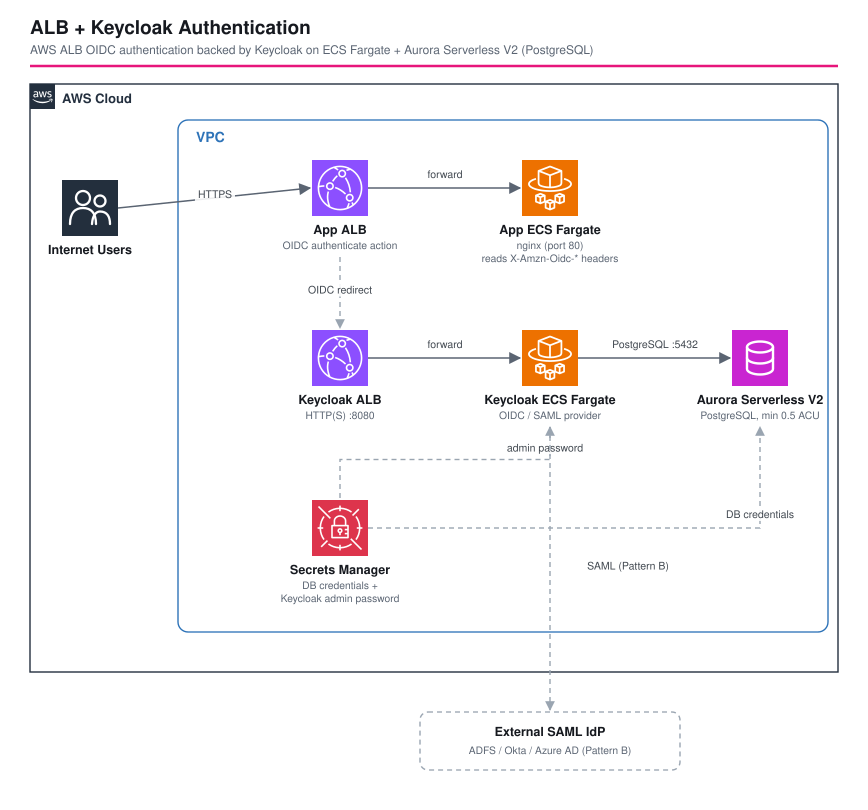

# ALB + Keycloak Authentication (ECS Fargate + Aurora Serverless V2)

*Read this in other languages:* [](./README.ja.md) [](./README.md)


## Overview

This workspace is a reference architecture that uses **Keycloak** for AWS ALB user authentication.

### Components

| Component | Role |
|---|---|
| ALB (Application Load Balancer) | Accepts user requests and performs OIDC authentication |
| Keycloak (ECS Fargate) | OIDC/SAML identity provider |
| Aurora Serverless V2 (PostgreSQL) | Persists Keycloak sessions and configuration |
| Secrets Manager | Manages DB credentials and the admin password |

---

## Architecture



### Pattern A — Direct Keycloak Authentication (OIDC)

```
                         ┌─────────────────────────────────────────────────┐
                         │ VPC                                              │
                         │                                                  │
 Internet ──► App ALB ──► App ECS (nginx)                                  │
             (OIDC Auth) │                                                  │
                │        │                                                  │
                │ OIDC   │                                                  │
                ▼        │                                                  │
          Keycloak ALB ──► Keycloak ECS ──► Aurora Serverless V2           │
                         │  (ECS Fargate)    (PostgreSQL)                   │
                         └─────────────────────────────────────────────────┘
```

**Authentication flow**:
1. The user accesses the App ALB
2. The ALB redirects to the Keycloak OIDC endpoint
3. The user logs in via Keycloak
4. Keycloak returns a token to the ALB
5. The ALB forwards the request to the backend (with `X-Amzn-Oidc-*` headers)

### Pattern B — SAML Federation (Keycloak as Broker)

```
 Internet ──► App ALB ──► App ECS
             (OIDC Auth)
                │
                │ OIDC
                ▼
          Keycloak (OIDC Provider)
                │
                │ SAML
                ▼
          External SAML IdP (ADFS / Okta / Azure AD, etc.)
```

Keycloak acts as both an OIDC Provider (from the ALB's perspective) and a SAML Service Provider (from the IdP's perspective).

---

## Stack Structure

```
AlbKeycloakAuthStage
├── {Project}Base      — VPC + Security Groups
├── {Project}Database  — Aurora Serverless V2
├── {Project}Keycloak  — Keycloak ECS Fargate + Keycloak ALB
└── {Project}App       — Backend ECS + App ALB
```

---

## Deployment Guide

### Prerequisites

```bash
cd infrastructure
npm install
```

### Step 1: Deploy the Infrastructure

```bash
cd workspaces/alb-keycloak-auth

# CDK bootstrap (first time only)
PROJECT=myproject ENV=dev npm run bootstrap

# Deploy
PROJECT=myproject ENV=dev npm run deploy:all
```

After deployment, the following are printed as Outputs:

| Output | Description |
|---|---|
| `KeycloakAlbDns` | DNS name of the Keycloak ALB |
| `AdminSecretArn` | Secret ARN of the Keycloak admin credentials |
| `AppAlbDns` | DNS name of the application ALB |
| `OidcClientSecretArn` | Secret ARN of the OIDC client secret |

### Step 2: Keycloak Setup (Pattern A)

Keycloak takes about 2–3 minutes to start.

```bash
export PROJECT=myproject
export ENV=dev
export KC_URL=http://$(aws cloudformation describe-stacks \
  --query "Stacks[?contains(StackName,'Keycloak')].Outputs[?OutputKey=='KeycloakAlbDns'].OutputValue" \
  --output text)
export REALM=myrealm
export APP_ALB_URL=https://your-app-domain.com  # App ALB URL

./scripts/keycloak-setup.sh
```

What this script does:
- Creates the Keycloak realm
- Creates the OIDC client for the ALB
- Stores the client secret in Secrets Manager

### Step 3: Enable OIDC Authentication

Edit `parameters/dev-params.ts`:

```typescript
oidcConfig: {
  enabled: true,  // change from false to true
  clientId: 'alb-client',
},
appDomainName: 'app.example.com',       // required (HTTPS is required)
appHostedZoneId: 'Z1234567890ABC',
```

Redeploy:

```bash
PROJECT=myproject ENV=dev npm run deploy:all
```

---

## Pattern B: SAML Federation Setup

After completing the Pattern A setup, run the following:

```bash
export SAML_IDP_ALIAS=corp-saml
export SAML_IDP_DISPLAY_NAME='Corporate SSO'
export SAML_IDP_METADATA_URL=https://your-idp.example.com/saml/metadata

./scripts/saml-setup.sh
```

Then share the following URL with your IdP administrator to register this as a Service Provider:

```
http://<Keycloak-ALB-DNS>/realms/myrealm/protocol/saml/descriptor
```

---

## Connectivity Tests

### 1. Keycloak Health Check

```bash
curl http://<Keycloak-ALB-DNS>/health/ready
# → {"status":"UP",...}
```

### 2. OIDC Discovery Check

```bash
curl http://<Keycloak-ALB-DNS>/realms/myrealm/.well-known/openid-configuration
```

### 3. App ALB Access (OIDC disabled)

```bash
curl http://<App-ALB-DNS>/
# → nginx default page
```

### 4. App ALB Access (OIDC enabled)

Accessing `https://<App-ALB-DNS>/` in a browser redirects to the Keycloak login screen.

### 5. Connect to the Keycloak Container via ECS Exec

```bash
# Get the cluster name and task ID
CLUSTER=myproject-dev-keycloak
TASK_ID=$(aws ecs list-tasks --cluster ${CLUSTER} --query 'taskArns[0]' --output text)

aws ecs execute-command \
  --cluster ${CLUSTER} \
  --task ${TASK_ID} \
  --container keycloak \
  --interactive \
  --command '/bin/bash'
```

### 6. Verify the Aurora Connection (from inside the Keycloak container)

```bash
# run inside the container
psql -h <aurora-endpoint> -U keycloak -d keycloakdb -c 'SELECT version();'
```

---

## Parameter Reference

| Parameter | Description | Default |
|---|---|---|
| `keycloakConfig.keycloakVersion` | Keycloak image version | `26.1` |
| `keycloakConfig.realmName` | Realm name to create | `myrealm` |
| `auroraConfig.serverlessV2MinCapacity` | Aurora minimum ACU | `0.5` |
| `oidcConfig.enabled` | Enable ALB OIDC authentication | `false` |
| `keycloakDomainName` | Keycloak custom domain (for HTTPS) | not set |
| `appDomainName` | App custom domain (required to enable OIDC) | not set |
| `samlConfig` | SAML IdP configuration | not set |

---

## Estimated Cost (ap-northeast-1, dev environment)

| Resource | Estimated Cost |
|---|---|
| ECS Fargate (Keycloak, 1 task, 1vCPU/2GB) | ~$35/month |
| ECS Fargate (App, 1 task, 0.25vCPU/0.5GB) | ~$5/month |
| Aurora Serverless V2 (min 0.5 ACU) | ~$15/month |
| ALB x2 | ~$35/month |
| NAT Instance | ~$10/month |
| **Total** | **~$100/month** |

> In development, you can reduce cost by stopping the NAT overnight with the NAT schedule feature.

---

## Security Considerations

- Use IP restrictions or a private ALB for the Keycloak admin console in production
- Strongly recommended: set `appDomainName` to enable HTTPS
- Aurora credentials are managed by Secrets Manager and injected into containers securely
- ECS Exec is enabled — recommend restricting it with an IAM policy after deployment

## 📄 License

This project is licensed under the MIT License - see the [LICENSE](../../../LICENSE) file for details.

## 👥 Contributing

Contributions are welcome! Please read [CONTRIBUTING.md](../../../docs/contribution/CONTRIBUTING.md) for details.
