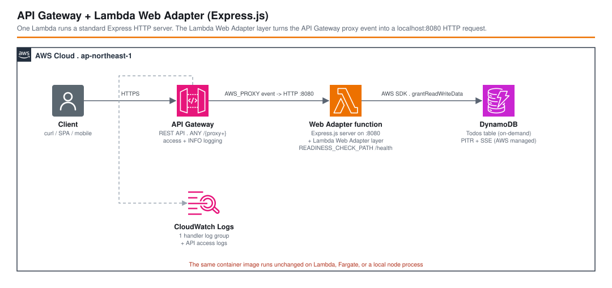

# API Gateway + Lambda Web Adapter (Express.js) - AWS CDK Reference Architecture

[](./README.ja.md)
[](./README.md)

> **Level: 300 (Intermediate)**

A Todos REST API served by **one** Lambda function that runs a **standard Express.js HTTP server**. The [AWS Lambda Web Adapter](https://github.com/awslabs/aws-lambda-web-adapter) layer sits in front of the runtime, turns each API Gateway proxy event into a real HTTP request against `http://localhost:8080`, and turns the HTTP response back into a Lambda result. The application code contains **no `handler(event, context)`** and no AWS Lambda types — it is the same `app` you would `docker run` on Fargate or `node` locally.

This is one of three companion workspaces that implement the **same API** three different ways so the API Gateway + Lambda integration styles can be compared directly:

| Workspace | Functions | Routing | One-line summary |
|-----------|-----------|---------|------------------|
| [`apigw-single-purpose-lambda`](../apigw-single-purpose-lambda/) | one per route | API Gateway | Maximum isolation: each route has its own function, role, and grant. |
| [`apigw-lambdalith`](../apigw-lambdalith/) | one | Hono, in-process | One function, one deploy unit, framework routing. |
| **`apigw-lambda-web-adapter`** (this) | one | Express, in-process | A standard Express server behind the Lambda Web Adapter layer. |

## 📑 Table of Contents

- [Architecture Overview](#-architecture-overview)
- [How the Lambda Web Adapter Works](#-how-the-lambda-web-adapter-works)
- [Design Decisions & Best Practices](#-design-decisions--best-practices)
- [Pattern Comparison](#-pattern-comparison)
- [Well-Architected Alignment](#-well-architected-alignment)
- [Cost Optimization](#-cost-optimization)
- [Security Considerations](#-security-considerations)
- [Prerequisites](#-prerequisites)
- [Deployment Guide](#-deployment-guide)
- [Usage](#usage)
- [Testing Strategy](#-testing-strategy)
- [Customization](#-customization)
- [Troubleshooting](#-troubleshooting)
- [Clean-up](#-clean-up)
- [References](#-references)

## 🏗️ Architecture Overview



### Key Components

- **Amazon API Gateway (REST API)** — a single greedy proxy resource `ANY /{proxy+}` (`LambdaRestApi` with `proxy: true`). No routing, validation, or per-method config; every request becomes an `AWS_PROXY` event.
- **AWS Lambda (`WebAdapterHandler`)** — one Node.js 22 / ARM64 function whose bundled code (`src/index.ts`) simply calls `app.listen(8080)`. The exported `handler` is a placeholder that is never invoked.
- **Lambda Web Adapter layer** — `arn:aws:lambda:<region>:753240598075:layer:LambdaAdapterLayerArm64:24`, referenced with `LayerVersion.fromLayerVersionArn`. Combined with `AWS_LAMBDA_EXEC_WRAPPER=/opt/bootstrap`, it replaces the normal Node handler loop with a loop that proxies events to the local HTTP server.
- **Express app (`src/app.ts`, `src/routes/todos.ts`)** — ordinary Express: `express.json()` body parsing, a `GET /health` readiness route, and a `/todos` router with the five CRUD handlers. No AWS-specific code.
- **Amazon DynamoDB (`TodosTable`)** — on-demand table, `todoId` partition key, SSE (AWS-managed key), point-in-time recovery on. One `grantReadWriteData` to the function role.
- **Observability** — dedicated function log group (one-week retention) + API Gateway access logs (JSON, standard fields) + `INFO` method logging on the stage.

### Environment variables that wire the adapter

| Variable | Value | Purpose |
|----------|-------|---------|
| `AWS_LAMBDA_EXEC_WRAPPER` | `/opt/bootstrap` | Tells the Lambda runtime to start via the adapter's wrapper script instead of the default Node bootstrap. |
| `PORT` | `8080` | Port the adapter forwards to; the Express app calls `app.listen(process.env.PORT)`. |
| `READINESS_CHECK_PATH` | `/health` | The adapter polls this path until it returns `2xx` before marking the sandbox ready, so the first real request never races app startup. |
| `TABLE_NAME` | *(ref)* | Passed to the DynamoDB SDK client in `src/utils/dynamodb.ts`. |

## 🔌 How the Lambda Web Adapter Works

```
API Gateway ──AWS_PROXY event──▶ Lambda sandbox
                                  ├─ /opt/bootstrap (adapter)  ◀─ AWS_LAMBDA_EXEC_WRAPPER
                                  │     1. on cold start: start `node src/index.js` → app.listen(8080)
                                  │     2. poll GET :8080/health until 2xx  (READINESS_CHECK_PATH)
                                  │     3. per invoke: event → HTTP request → :8080 → HTTP response → result
                                  └─ Express app on :8080
```

The adapter is a Lambda **Extension** written in Rust. It adds no measurable per-request latency (a loopback HTTP call) and a small one-time cold-start cost to boot the HTTP server and pass the readiness check.

## 🎯 Design Decisions & Best Practices

### 1. Run a real HTTP server instead of writing a Lambda handler

**Decision**: Package a normal Express app and let the Lambda Web Adapter bridge the event model, instead of `hono/aws-lambda` (see [`apigw-lambdalith`](../apigw-lambdalith/)) or a hand-written `handler(event)`.

**Rationale**:
- ✅ **Zero AWS coupling in application code** — no `@types/aws-lambda`, no `APIGatewayProxyEvent`. The same image runs on Lambda, App Runner, ECS/Fargate, or `node` on a laptop with **no build variants**.
- ✅ **Lift-and-shift** — an existing Express/Fastify/Koa/Next.js service moves to Lambda by adding a layer and three env vars, not by rewriting the entry point.
- ✅ **Familiar local development** — `npm start` is the actual production code path (a real server on a real port), not an emulator.
- ✅ Framework ecosystem (middleware, routers, error handlers) works unchanged.

**Trade-offs**:
- ❌ **Largest cold start of the three patterns** — the bundle is ~1 MB (Express + deps) and the adapter must boot the server and pass a readiness check before the first response. Mitigate with SnapStart (Node 22) or provisioned concurrency for latency-sensitive APIs.
- ❌ An extra moving part (the layer) whose version you must track; the layer ARN is Region- and architecture-specific.
- ❌ Coarse IAM and coarse deploy blast radius — same as the Lambdalith (one role, one deploy unit).
- ❌ Streaming responses need Lambda response streaming + a compatible adapter mode; a plain buffered integration caps at 6 MB.

### 2. Pin the layer ARN by Region and version

```typescript
const webAdapterLayer = lambda.LayerVersion.fromLayerVersionArn(
  this, 'LambdaWebAdapterLayer',
  `arn:aws:lambda:${cdk.Stack.of(this).region}:753240598075:layer:LambdaAdapterLayerArm64:24`,
);
```

**Rationale**:
- ✅ `753240598075` is the AWS-owned account that publishes the adapter in every commercial Region; interpolating `region` keeps the stack Region-portable.
- ✅ The version (`:24`) is pinned so a deploy is reproducible — a new adapter release does not silently change behavior.
- ⚠️ `Arm64` in the layer name **must** match `architecture: lambda.Architecture.ARM_64` on the function. Check the [releases page](https://github.com/awslabs/aws-lambda-web-adapter/releases) for the current version and the `X86_64` variant.

### 3. `READINESS_CHECK_PATH=/health`

**Decision**: Expose `GET /health` and point the adapter at it.

**Rationale**:
- ✅ The adapter holds the first invocation until the server answers `2xx`, so a cold start never returns a connection-refused error while Express is still binding the port.
- ✅ The same endpoint is a natural target for an ALB/App Runner health check if the image is later run as a container.

### 4. `LambdaRestApi` proxy + stage logging

Identical to the Lambdalith: one `ANY /{proxy+}`, `cloudWatchRole: true`, access logging (`jsonWithStandardFields`) and `INFO` method logging on the stage. Adding a route is an Express change with **no CloudFormation diff**.

### 5. Environment-specific parameters

Region/account come from `EnvParams` (`parameters/<env>-params.ts`). `isAutoDeleteObject` (dev only) drives the DynamoDB `RemovalPolicy`; `terminationProtection` is on for `prd`.

## 🔀 Pattern Comparison

| Aspect | Single-Purpose Lambda | Lambdalith (Hono) | **Lambda Web Adapter (this)** |
|--------|----------------------|-------------------|-------------------------------|
| Lambda functions | one per route (5) | one | **one** |
| Who routes | API Gateway | Hono, in-process | **Express, in-process** |
| Application ↔ AWS coupling | `APIGatewayProxyEvent` per handler | `hono/aws-lambda` entry file | **none — plain Express** |
| API Gateway shape | explicit resources + methods | `ANY /{proxy+}` | **`ANY /{proxy+}`** |
| IAM granularity | per-route | one role = union | **one role = union** |
| Cold-start weight | lightest (tiny bundles) | light (small bundle) | **heaviest (server + layer + readiness)** |
| Runs unchanged on Fargate / locally | no | adapter swap | **yes** |
| Extra infra moving parts | none | none | **the adapter layer (versioned, per-Region)** |
| Deploy blast radius | one function | whole API | **whole API** |
| Best fit | per-route scaling / security / ownership | small–medium API, one team | **porting an existing Node web app; multi-target deploys** |

## 🏛️ Well-Architected Alignment

| Pillar | Implementation |
|--------|---------------|
| **Operational Excellence** | One artifact / one deploy; the local `npm start` path is the production path; access + `INFO` logging on the stage; dedicated function log group with retention. |
| **Security** | Single least-privilege role scoped to one DynamoDB table; SSE + PITR; TLS-only endpoint; authN/Z and WAF are documented add-ons. |
| **Reliability** | Managed API Gateway + Lambda + DynamoDB, multi-AZ; PITR for restore; readiness check prevents cold-start request races; on-demand billing absorbs spikes. |
| **Performance Efficiency** | ARM64 / Graviton; adapter overhead is a loopback call; SnapStart / provisioned concurrency available if the cold start matters. |
| **Cost Optimization** | No idle compute; `PAY_PER_REQUEST` DynamoDB; one function's logs/metrics. |
| **Sustainability** | Graviton; scale-to-zero; no over-provisioned compute. |

## 💰 Cost Optimization

### Estimated Monthly Costs (ap-northeast-1 / Tokyo)

#### Light usage (~100,000 requests/month)
```
API Gateway REST API:  100,000 req x $4.25 / 1,000,000        = $0.43
Lambda requests:        100,000 req x $0.20 / 1,000,000        = $0.02
Lambda compute:         100,000 x 200 ms x 256 MB (arm64)      ≈ $0.02
DynamoDB on-demand:     ~300,000 RRU/WRU                        ≈ $0.10
CloudWatch Logs:        < 50 MB                                 ≈ $0.02
-------------------------------------------------------------------
Total:                                                          ~$0.59/month
```

#### Moderate usage (~5,000,000 requests/month)
```
API Gateway REST API:  5,000,000 req x $4.25 / 1,000,000       = $21.25
Lambda requests:        5,000,000 req x $0.20 / 1,000,000       = $1.00
Lambda compute:         5,000,000 x 200 ms x 256 MB (arm64)     ≈ $0.80
DynamoDB on-demand:     ~15M RRU/WRU                            ≈ $5.00
CloudWatch Logs:        ~2 GB                                   ≈ $1.50
-------------------------------------------------------------------
Total:                                                          ~$30.5/month
```

*(Pricing as of 2026, ap-northeast-1; excludes free-tier. Verify with the [AWS Pricing Calculator](https://calculator.aws/).)*

### Cost notes specific to this pattern

1. **The adapter itself is free** — it is a layer, not a metered service. Cost is identical to any other single-function API *except* for slightly longer billed duration on cold starts.
2. **Cold-start duration** — the larger bundle and readiness poll add tens of ms of billed time on cold invocations. At low volume this is noise; at high volume, provisioned concurrency trades a flat hourly fee for predictable latency.
3. **ARM64 / Graviton** and **`PAY_PER_REQUEST` DynamoDB** — same levers as the sibling patterns.

## 🔒 Security Considerations

### Implemented

- ✅ **Least-privilege IAM** — one custom statement: `grantReadWriteData` on `TodosTable`. `cdk-nag` flags the `table/index/*` resource and `AWSLambdaBasicExecutionRole`; both are suppressed with a reason in [`test/compliance/cdk-nag.test.ts`](test/compliance/cdk-nag.test.ts).
- ✅ **Encryption at rest** — DynamoDB SSE + point-in-time recovery.
- ✅ **TLS in transit** — HTTPS-only `execute-api` endpoint.
- ✅ **Access + execution logging** on the stage.
- ✅ **Trusted layer source** — the layer is published by the AWS-owned account `753240598075` and pinned to a specific version.

### Intentionally out of scope (add per environment)

Suppressed in the compliance test — do **not** copy those suppressions into a production API:

- **Authorization** (`AwsSolutions-APIG4` / `COG4`) — add an authorizer via `defaultMethodOptions` on `LambdaRestApi`, or verify a bearer token in Express middleware.
- **WAF** (`AwsSolutions-APIG3`) — associate a `wafv2.CfnWebACLAssociation` with the stage ARN.
- **Request validation** (`AwsSolutions-APIG2`) — with `proxy: true` there are no API Gateway models; validate in Express (e.g. `zod`, `express-validator`).

### CDK Nag

```bash
npm run test:compliance -w workspaces/apigw-lambda-web-adapter
```

## 📋 Prerequisites

- AWS account with permissions for API Gateway, Lambda, DynamoDB, IAM, CloudWatch Logs
- AWS CLI v2.x configured with a profile named `${PROJECT}-${ENV}` (e.g. `apigw-lambda-web-adapter-dev`)
- Node.js 20.x or later, AWS CDK 2.x
- **Docker is *not* required** — `NodejsFunction` bundles with a local `esbuild`; the adapter is pulled in as a layer at deploy time

## 🚀 Deployment Guide

```bash
cd infrastructure
npm install

export PROJECT=apigw-lambda-web-adapter
export ENV=dev

npm run bootstrap  -w workspaces/apigw-lambda-web-adapter   # first time only, per account/region
npm run synth      -w workspaces/apigw-lambda-web-adapter
npm run deploy:all -w workspaces/apigw-lambda-web-adapter
```

The stack outputs `ApiUrl` and `TodosTableName`.

> If you switch the function to `x86_64`, also change the layer name to `LambdaAdapterLayerX86_64` and check the current version on the [releases page](https://github.com/awslabs/aws-lambda-web-adapter/releases).

## Usage

```bash
API_URL="<ApiUrl output>"   # e.g. https://abc123.execute-api.ap-northeast-1.amazonaws.com/dev/

curl -s "${API_URL}health"                                   # {"status":"ok"}
curl -s -X POST "${API_URL}todos" -H 'content-type: application/json' -d '{"title":"buy milk"}' | jq .
curl -s "${API_URL}todos" | jq .
curl -s "${API_URL}todos/<todoId>" | jq .
curl -s -X PUT "${API_URL}todos/<todoId>" -H 'content-type: application/json' -d '{"title":"buy oat milk","completed":true}' | jq .
curl -s -i -X DELETE "${API_URL}todos/<todoId>"
```

### Run the same server locally

```bash
npm start -w workspaces/apigw-lambda-web-adapter   # express on http://localhost:8080
curl -s localhost:8080/todos | jq .
```

This is the **identical** code path that runs in Lambda — only the adapter in front of it differs.

## 🧪 Testing Strategy

```
test/
├── compliance/
│   └── cdk-nag.test.ts                        # AWS Solutions pack + documented suppressions
├── parameters/
│   └── test-params.ts                         # deterministic Environment.TEST params
├── snapshot/
│   └── snapshot.test.ts                       # full template + resource-count snapshots
└── unit/
    └── apigw-lambda-web-adapter-stack.test.ts # table, single function, adapter layer + env vars, proxy method, stage logging, outputs
```

```bash
npm test                -w workspaces/apigw-lambda-web-adapter   # all
npm run test:snapshot   -w workspaces/apigw-lambda-web-adapter
npm run test:unit       -w workspaces/apigw-lambda-web-adapter
npm run test:compliance -w workspaces/apigw-lambda-web-adapter
npm run test:snapshot   -w workspaces/apigw-lambda-web-adapter -- -u   # update snapshots after an intended change
```

The unit test asserts the function carries the adapter layer (`Layers` contains `…:layer:LambdaAdapterLayerArm64:…`) and the three wiring env vars.

## ⚙️ Customization

### Add a route

Pure Express, **no infrastructure change**:

```typescript
// src/routes/todos.ts
router.patch('/:todoId/complete', async (req, res, next) => {
  try {
    await docClient.send(new UpdateCommand({ /* … set completed = true … */ }));
    res.status(204).send();
  } catch (err) { next(err); }
});
```

### Reduce cold-start latency

```typescript
const webAdapterHandler = new lambdaNodejs.NodejsFunction(this, 'WebAdapterHandler', {
  // …
  snapStart: lambda.SnapStartConf.ON_PUBLISHED_VERSIONS, // Node 22 supports SnapStart
});
```
or add `provisionedConcurrentExecutions` on an alias.

### Run the same image on Fargate

Because the code is a plain server, `lib/` could instead build a `ContainerImage.fromAsset('.')` and an `ApplicationLoadBalancedFargateService` with **no application changes** — the adapter is simply omitted.

## 🔧 Troubleshooting

### Every request returns 502 immediately after deploy

The adapter could not reach the server. Check, in order:
1. `PORT` env var matches `app.listen()` (both `8080` here).
2. `AWS_LAMBDA_EXEC_WRAPPER=/opt/bootstrap` is set (it is, in the stack) — without it the layer is inert and the placeholder `handler` runs instead.
3. The layer ARN Region/architecture matches the function (`Arm64` ↔ `ARM_64`).
4. The function log group — an Express startup exception (e.g. bad import) shows up there.

### First request after idle is slow, then fast

Expected: that request paid the cold start (bundle load + `app.listen` + `/health` poll). Use SnapStart or provisioned concurrency if that tail latency matters.

### `cdk deploy` fails: "CloudWatch Logs role ARN must be set in account settings"

`cloudWatchRole: true` on the RestApi creates that role per-stack; keep it, or configure an account-level API Gateway CloudWatch role once per account/region.

### Snapshot test fails after an unrelated change

If only the `esbuild` asset hash moved, `npm run test:snapshot -- -u` and commit — the bundle changed. Investigate any change in resource **counts**.

## 🧹 Clean-up

```bash
npm run destroy:all -w workspaces/apigw-lambda-web-adapter
```

In `dev`, `isAutoDeleteObject: true` sets `RemovalPolicy.DESTROY` on the table. In `prd` it is retained.

## 📚 References

### AWS Documentation
- [AWS Lambda Web Adapter (awslabs)](https://github.com/awslabs/aws-lambda-web-adapter)
- [Run a web application on AWS Lambda](https://aws.amazon.com/blogs/compute/re-platforming-java-applications-using-the-updated-aws-lambda-web-adapter/)
- [Lambda proxy integration for REST APIs](https://docs.aws.amazon.com/apigateway/latest/developerguide/api-gateway-set-up-simple-proxy.html)
- [Improving startup performance with Lambda SnapStart](https://docs.aws.amazon.com/lambda/latest/dg/snapstart.html)

### AWS CDK
- [aws-apigateway module](https://docs.aws.amazon.com/cdk/api/v2/docs/aws-cdk-lib.aws_apigateway-readme.html)
- [aws-lambda-nodejs module](https://docs.aws.amazon.com/cdk/api/v2/docs/aws-cdk-lib.aws_lambda_nodejs-readme.html)

### Related Architectures
- [apigw-lambdalith](../apigw-lambdalith/) — the same API with in-process routing but a Lambda-native adapter (Hono), smaller cold start
- [apigw-single-purpose-lambda](../apigw-single-purpose-lambda/) — the same API with one function per route
- [apigw-s3-stub](../apigw-s3-stub/) — an API Gateway REST API with no Lambda at all

## 📄 License

This project is licensed under the MIT License — see the [LICENSE](../../LICENSE) file for details.

## 👥 Contributing

Contributions are welcome! Please read [CONTRIBUTING.md](../../CONTRIBUTING.md) for details.

## 🏆 About This Reference Architecture

**Target Level**: 300 (Intermediate)

---

**Note**: This is a reference implementation. Review and customize (authorization, WAF, request validation, cold-start strategy, per-environment parameters) before deploying to production.
