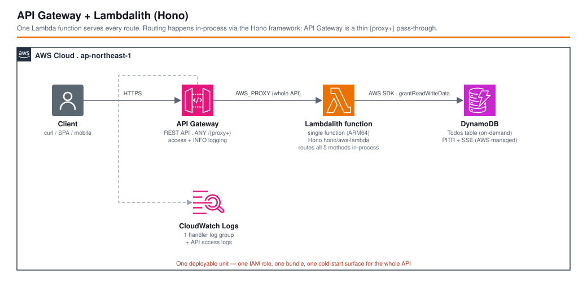

# API Gateway + Lambdalith (Hono) - AWS CDK Reference Architecture

[](./README.ja.md)
[](./README.md)

> **Level: 300 (Intermediate)**

A Todos REST API served by **one** Lambda function. API Gateway is a thin `{proxy+}` pass-through; all routing (`GET`/`POST /todos`, `GET`/`PUT`/`DELETE /todos/{todoId}`) happens **inside** the function using the [Hono](https://hono.dev/) web framework and its `hono/aws-lambda` adapter. The whole API is a single deployable unit.

This is one of three companion workspaces that implement the **same API** three different ways so the API Gateway + Lambda integration styles can be compared directly:

| Workspace | Functions | Routing | One-line summary |
|-----------|-----------|---------|------------------|
| [`apigw-single-purpose-lambda`](../apigw-single-purpose-lambda/) | one per route | API Gateway | Maximum isolation: each route has its own function, role, and grant. |
| **`apigw-lambdalith`** (this) | one | Hono, in-process | One function, one deploy unit, framework routing. |
| [`apigw-lambda-web-adapter`](../apigw-lambda-web-adapter/) | one | Express, in-process | A standard Express server behind the Lambda Web Adapter layer. |

## 📑 Table of Contents

- [Architecture Overview](#-architecture-overview)
- [Design Decisions & Best Practices](#-design-decisions--best-practices)
- [Pattern Comparison](#-pattern-comparison)
- [Well-Architected Alignment](#-well-architected-alignment)
- [Cost Optimization](#-cost-optimization)
- [Security Considerations](#-security-considerations)
- [Prerequisites](#-prerequisites)
- [Deployment Guide](#-deployment-guide)
- [Usage](#usage)
- [Testing Strategy](#-testing-strategy)
- [Customization](#-customization)
- [Troubleshooting](#-troubleshooting)
- [Clean-up](#-clean-up)
- [References](#-references)

## 🏗️ Architecture Overview



### Key Components

- **Amazon API Gateway (REST API)** — a single greedy proxy resource `ANY /{proxy+}` (plus `ANY /`) created by CDK's `LambdaRestApi` construct with `proxy: true`. API Gateway performs **no** routing, request validation, or per-method configuration; every request is forwarded verbatim to the function as an `AWS_PROXY` event.
- **AWS Lambda (`LambdalithHandler`)** — one Node.js 22 / ARM64 function. Its entry point (`src/lambda.ts`) is three lines: `export const handler = handle(app)`, where `app` is a Hono instance. `hono/aws-lambda` converts the API Gateway proxy event into a `Request`, runs Hono's router, and converts the `Response` back.
- **Hono router (`src/routes/todos.ts`)** — the actual API surface. `app.route('/todos', todosRouter)` mounts five handlers. This is ordinary framework code — the same `app` object runs under Node locally via `@hono/node-server` (`npm start`).
- **Amazon DynamoDB (`TodosTable`)** — on-demand (`PAY_PER_REQUEST`) table, `todoId` partition key, SSE with an AWS-managed key, point-in-time recovery on. One `grantReadWriteData` to the single function role.
- **Observability** — a dedicated CloudWatch log group for the function (explicit `logGroup`, one-week retention), plus API Gateway **access logging** (JSON, standard fields) and `INFO` method logging on the stage.

### Architecture Characteristics

| Characteristic | Value | Rationale |
|---------------|-------|-----------|
| Deploy unit | 1 function = 1 API | A change to any route redeploys the whole API; simple mental model, coarse blast radius. |
| Cold start | 1 surface, medium bundle | Hono is tiny (~14 kB gzipped) so the bundle is close to a bare handler; only one function to keep warm. |
| IAM scope | 1 role, union of all route permissions | The `list` path and the `delete` path share the same role — coarser than one-role-per-route. |
| Local dev | `npm start` runs the real router under Node | `@hono/node-server` serves the identical `app`; no SAM/emulator needed for route logic. |
| Portability | Lambda-specific adapter | Moving off Lambda means swapping `hono/aws-lambda` for another Hono adapter (Node, Bun, Workers…). |

## 🎯 Design Decisions & Best Practices

### 1. One function with in-process routing ("Lambdalith")

**Decision**: Serve every route from a single Lambda and let a framework route inside the process, instead of mapping each API Gateway method to its own function.

**Rationale**:
- ✅ One build, one artifact, one deployment, one set of alarms/dashboards
- ✅ Shared code (validation, serialization, middleware) is just a function call — no Lambda layers or shared-package plumbing
- ✅ Framework ergonomics: middleware, typed params, sub-routers, testable `app` object
- ✅ Fewer cold-start surfaces to keep warm; a burst that hits three routes warms one function, not three

**Trade-offs**:
- ❌ Coarse IAM — the single role is the union of every route's permissions (this API only needs DynamoDB, so the cost is low here; an API that also touched S3, SES, and SQS would grant all of it to every route)
- ❌ Coarse deploy blast radius — a bad deploy takes the whole API down, not one endpoint
- ❌ One set of function-level knobs (memory, timeout, reserved concurrency) for workloads that may differ per route
- ❌ Lambda-specific glue (`hono/aws-lambda`); see [Design Decision 3](#3-why-hono)

### 2. `LambdaRestApi` with `proxy: true`

**Decision**: Use `apigateway.LambdaRestApi({ handler, proxy: true })` rather than building resources/methods by hand.

```typescript
const api = new apigateway.LambdaRestApi(this, 'TodosApi', {
  handler: lambdalithHandler,
  proxy: true,
  cloudWatchRole: true,
  deployOptions: {
    stageName: environment,
    loggingLevel: apigateway.MethodLoggingLevel.INFO,
    metricsEnabled: true,
    accessLogDestination: new apigateway.LogGroupLogDestination(accessLogGroup),
    accessLogFormat: apigateway.AccessLogFormat.jsonWithStandardFields(),
  },
});
```

**Rationale**:
- ✅ The CloudFormation template stays tiny and stable regardless of how many routes the app grows — adding `PATCH /todos/{id}/complete` is a code change with **no infrastructure diff**
- ✅ No `addResource`/`addMethod` boilerplate to keep in sync with the router

**Trade-offs**:
- ❌ No per-method API Gateway features (request validators, method-level throttling, per-route authorizers, usage plans keyed to a route). If you need those, you are back to explicit methods — or you enforce them in the app.
- ❌ API Gateway metrics/logs are for the whole stage, not per logical route (the route shows up only in the access log's `path` field)

### 3. Why Hono

**Decision**: Route with [Hono](https://hono.dev/) via `hono/aws-lambda`.

**Rationale**:
- ✅ Very small dependency, no reflection/decorators, fast router — keeps the single bundle near the size of a bare handler so the Lambdalith cold start stays close to the single-purpose one
- ✅ First-class adapters for AWS Lambda, Node, Bun, Deno, Cloudflare Workers — the `app` is portable even though the *entry file* is not
- ✅ Web-standard `Request`/`Response` — the same handlers unit-test with `app.request('/todos')` and no AWS types

**Alternatives**: `@codegenie/serverless-express` / `aws-serverless-express` (wrap Express — that is the [`apigw-lambda-web-adapter`](../apigw-lambda-web-adapter/) approach, minus the layer), AWS Lambda Powertools event handler, `itty-router`, or a hand-rolled `switch` on `event.resource`/`event.httpMethod` for a tiny API.

### 4. Environment-specific parameters

Region/account come from `EnvParams` (`parameters/<env>-params.ts`), never from `cdk.json` context or CloudFormation parameters:

```typescript
// parameters/dev-params.ts
const devParams: EnvParams = {
  region: 'ap-northeast-1',
};
params[Environment.DEVELOPMENT] = devParams;
```

`isAutoDeleteObject` (true only for `dev`) drives the DynamoDB `RemovalPolicy`; `terminationProtection` is on for `prd`.

## 🔀 Pattern Comparison

| Aspect | Single-Purpose Lambda | **Lambdalith (this)** | Lambda Web Adapter |
|--------|----------------------|-----------------------|--------------------|
| Lambda functions | one per route (5) | **one** | one |
| Who routes | API Gateway (`addMethod`) | **Hono, in-process** | Express, in-process |
| API Gateway shape | explicit resources + methods | **`ANY /{proxy+}`** | `ANY /{proxy+}` |
| IAM granularity | per-route (read-only vs write-only) | **one role = union** | one role = union |
| CloudFormation size | grows with each route | **flat** | flat |
| Cold-start surfaces | N (small bundles) | **1 (small bundle)** | 1 (bundle + adapter layer) |
| Per-route memory/timeout | yes | **no** | no |
| Deploy blast radius | one function | **whole API** | whole API |
| Local dev of route logic | invoke handler / SAM | **`npm start` (node-server)** | `npm start` (real Express) |
| Runs outside Lambda | no | **adapter swap** | yes, unchanged (Fargate/local) |
| Best fit | routes with different scaling / security / ownership | **small–medium API, one team, fast iteration** | porting an existing Node web app, multi-target deploys |

## 🏛️ Well-Architected Alignment

| Pillar | Implementation |
|--------|---------------|
| **Operational Excellence** | One artifact and one deployment to reason about; access logs + `INFO` method logging on the stage; dedicated function log group with retention. |
| **Security** | Single least-privilege role scoped to one DynamoDB table; SSE + PITR on the table; TLS-only API Gateway endpoint; authN/Z and WAF are documented add-ons (see [Security Considerations](#-security-considerations)). |
| **Reliability** | Fully managed API Gateway + Lambda + DynamoDB, multi-AZ by default; PITR enables point-in-time restore; on-demand billing absorbs spikes with no capacity planning. |
| **Performance Efficiency** | ARM64 (Graviton) runtime; Hono's small footprint keeps the single-function cold start low; one warm function serves every route. |
| **Cost Optimization** | No idle compute; `PAY_PER_REQUEST` DynamoDB; one function's worth of logs/metrics instead of five. |
| **Sustainability** | Graviton; no over-provisioned compute; a single scale-to-zero function. |

## 💰 Cost Optimization

### Estimated Monthly Costs (ap-northeast-1 / Tokyo)

#### Light usage (personal/dev, ~100,000 requests/month)
```
API Gateway REST API:  100,000 req x $4.25 / 1,000,000        = $0.43
Lambda requests:        100,000 req x $0.20 / 1,000,000        = $0.02
Lambda compute:         100,000 x 150 ms x 256 MB (arm64)      ≈ $0.01
DynamoDB on-demand:     ~300,000 RRU/WRU                        ≈ $0.10
CloudWatch Logs:        < 50 MB                                 ≈ $0.02
-------------------------------------------------------------------
Total:                                                          ~$0.58/month
```

#### Moderate usage (~5,000,000 requests/month)
```
API Gateway REST API:  5,000,000 req x $4.25 / 1,000,000       = $21.25
Lambda requests:        5,000,000 req x $0.20 / 1,000,000       = $1.00
Lambda compute:         5,000,000 x 150 ms x 256 MB (arm64)     ≈ $0.60
DynamoDB on-demand:     ~15M RRU/WRU                            ≈ $5.00
CloudWatch Logs:        ~2 GB                                   ≈ $1.50
-------------------------------------------------------------------
Total:                                                          ~$30/month
```

*(Pricing as of 2026, ap-northeast-1; excludes free-tier. Verify with the [AWS Pricing Calculator](https://calculator.aws/).)*

### Cost notes specific to this pattern

1. **One function's worth of fixed overhead** — one log group, one set of CloudWatch metrics, one (optional) provisioned-concurrency bill instead of five. For a low-traffic API this is the cheapest of the three patterns to *operate*.
2. **ARM64 / Graviton** — ~20% cheaper per GB-second than x86 for the same code.
3. **`PAY_PER_REQUEST` DynamoDB** — no cost when idle; switch to provisioned + autoscaling only once traffic is steady and predictable.

## 🔒 Security Considerations

### Implemented

- ✅ **Least-privilege IAM** — the function role has exactly one custom statement: `grantReadWriteData` on `TodosTable`. (`cdk-nag` flags the `table/index/*` resource that `grant*Data` always adds and the `AWSLambdaBasicExecutionRole` managed policy; both are suppressed with a reason in [`test/compliance/cdk-nag.test.ts`](test/compliance/cdk-nag.test.ts).)
- ✅ **Encryption at rest** — DynamoDB SSE (AWS-managed key) + point-in-time recovery.
- ✅ **TLS in transit** — the API Gateway `execute-api` endpoint is HTTPS-only.
- ✅ **Access logging** — JSON access logs with standard fields, plus `INFO` execution logging, on the stage.

### Intentionally out of scope (add per environment)

This reference isolates the *integration style*, so the following are **not** wired in and are suppressed in the compliance test — do not copy those suppressions into a production API:

- **Authorization** (`AwsSolutions-APIG4` / `COG4`) — add an authorizer to the proxy method:
  ```typescript
  const authorizer = new apigateway.CognitoUserPoolsAuthorizer(this, 'Auth', { cognitoUserPools: [pool] });
  const api = new apigateway.LambdaRestApi(this, 'TodosApi', {
    handler, proxy: true,
    defaultMethodOptions: { authorizer, authorizationType: apigateway.AuthorizationType.COGNITO },
  });
  ```
  or verify a JWT inside Hono middleware (`hono/jwt`).
- **WAF** (`AwsSolutions-APIG3`) — associate a `wafv2.CfnWebACLAssociation` with the stage ARN.
- **Request validation** (`AwsSolutions-APIG2`) — with `proxy: true` there are no API Gateway models; validate in a Hono middleware (e.g. `@hono/zod-validator`).

### CDK Nag

```bash
npm run test:compliance -w workspaces/apigw-lambdalith
```

## 📋 Prerequisites

- AWS account with permissions for API Gateway, Lambda, DynamoDB, IAM, CloudWatch Logs
- AWS CLI v2.x configured with a profile named `${PROJECT}-${ENV}` (e.g. `apigw-lambdalith-dev`)
- Node.js 20.x or later, AWS CDK 2.x
- **Docker is *not* required** — `NodejsFunction` bundles with a local `esbuild`

## 🚀 Deployment Guide

```bash
cd infrastructure
npm install
```

`PROJECT`/`ENV` feed both the CDK context (`-c project=… -c env=…`) and the expected AWS CLI profile name (`${PROJECT}-${ENV}`).

```bash
export PROJECT=apigw-lambdalith
export ENV=dev

npm run bootstrap  -w workspaces/apigw-lambdalith   # first time only, per account/region
npm run synth      -w workspaces/apigw-lambdalith
npm run deploy:all -w workspaces/apigw-lambdalith
```

The stack outputs `ApiUrl` and `TodosTableName`.

## Usage

```bash
API_URL="<ApiUrl output>"   # e.g. https://abc123.execute-api.ap-northeast-1.amazonaws.com/dev/

# Create
curl -s -X POST "${API_URL}todos" -H 'content-type: application/json' \
  -d '{"title":"buy milk"}' | jq .

# List
curl -s "${API_URL}todos" | jq .

# Get one
curl -s "${API_URL}todos/<todoId>" | jq .

# Update
curl -s -X PUT "${API_URL}todos/<todoId>" -H 'content-type: application/json' \
  -d '{"title":"buy oat milk","completed":true}' | jq .

# Delete
curl -s -i -X DELETE "${API_URL}todos/<todoId>"
```

### Run the same router locally

```bash
npm start -w workspaces/apigw-lambdalith   # @hono/node-server on http://localhost:3000
curl -s localhost:3000/todos | jq .
```

## 🧪 Testing Strategy

```
test/
├── compliance/
│   └── cdk-nag.test.ts                 # AWS Solutions pack + documented suppressions
├── parameters/
│   └── test-params.ts                  # deterministic Environment.TEST params
├── snapshot/
│   └── snapshot.test.ts                # full template + resource-count snapshots
└── unit/
    └── apigw-lambdalith-stack.test.ts  # table, single function, proxy method, IAM, stage logging, outputs
```

```bash
npm test              -w workspaces/apigw-lambdalith   # all
npm run test:snapshot -w workspaces/apigw-lambdalith
npm run test:unit     -w workspaces/apigw-lambdalith
npm run test:compliance -w workspaces/apigw-lambdalith
npm run test:snapshot -w workspaces/apigw-lambdalith -- -u   # update snapshots after an intended change
```

The snapshot embeds the `esbuild` bundle hash, so it changes when `src/**` changes — that is intentional (it proves the artifact changed).

## ⚙️ Customization

### Add a route

Pure application code, **no infrastructure change**:

```typescript
// src/routes/todos.ts
todos.patch('/:todoId/complete', async (c) => {
  const todoId = c.req.param('todoId');
  await docClient.send(new UpdateCommand({ /* … set completed = true … */ }));
  return c.body(null, 204);
});
```

### Give the function more memory / a longer timeout

```typescript
const lambdalithHandler = new lambdaNodejs.NodejsFunction(this, 'LambdalithHandler', {
  memorySize: 512,
  timeout: cdk.Duration.seconds(15),
  // …
});
```

### Add a second environment

Create `parameters/prd-params.ts`, register it under `Environment.PRODUCTION`, then deploy with `ENV=prd`.

## 🔧 Troubleshooting

### `{"message":"Missing Authentication Token"}` on a valid-looking path

That is API Gateway's response for a path that matches **no** resource. With `proxy: true` the only resources are `/` and `/{proxy+}`, so this almost always means a trailing-slash / stage-prefix mistake in the URL — the API base already ends in `/dev/`, so call `${API_URL}todos`, not `${API_URL}/todos`.

### 502 Bad Gateway

The function threw or returned a shape API Gateway can't parse. Check the function log group; a common cause is a Hono adapter version mismatch or returning a raw object instead of `c.json(...)`.

### `cdk deploy` fails: "CloudWatch Logs role ARN must be set in account settings"

`cloudWatchRole: true` on the RestApi creates that role per-stack, which is why it is set here. If you removed it, either put it back or configure an account-level API Gateway CloudWatch role once per account/region.

### Snapshot test fails after an unrelated change

If only the asset hash moved, run `npm run test:snapshot -- -u` and commit — the bundle genuinely changed. If resource **counts** moved unexpectedly, inspect the diff.

## 🧹 Clean-up

```bash
npm run destroy:all -w workspaces/apigw-lambdalith
```

In `dev`, `isAutoDeleteObject: true` sets `RemovalPolicy.DESTROY` on the DynamoDB table so it is removed with the stack. In `prd` the table is retained.

## 📚 References

### AWS Documentation
- [Set up a proxy integration with a proxy resource](https://docs.aws.amazon.com/apigateway/latest/developerguide/api-gateway-set-up-simple-proxy.html)
- [AWS Lambda function handler in Node.js](https://docs.aws.amazon.com/lambda/latest/dg/nodejs-handler.html)
- [DynamoDB on-demand capacity mode](https://docs.aws.amazon.com/amazondynamodb/latest/developerguide/HowItWorks.ReadWriteCapacityMode.html#HowItWorks.OnDemand)

### Frameworks
- [Hono](https://hono.dev/) · [Hono AWS Lambda adapter](https://hono.dev/docs/getting-started/aws-lambda)

### AWS CDK
- [aws-apigateway module](https://docs.aws.amazon.com/cdk/api/v2/docs/aws-cdk-lib.aws_apigateway-readme.html)
- [aws-lambda-nodejs module](https://docs.aws.amazon.com/cdk/api/v2/docs/aws-cdk-lib.aws_lambda_nodejs-readme.html)

### Related Architectures
- [apigw-single-purpose-lambda](../apigw-single-purpose-lambda/) — the same API with one function per route
- [apigw-lambda-web-adapter](../apigw-lambda-web-adapter/) — the same API as an Express server behind the Lambda Web Adapter
- [apigw-s3-stub](../apigw-s3-stub/) — an API Gateway REST API with **no** Lambda at all (direct S3 service integration)

## 📄 License

This project is licensed under the MIT License — see the [LICENSE](../../LICENSE) file for details.

## 👥 Contributing

Contributions are welcome! Please read [CONTRIBUTING.md](../../CONTRIBUTING.md) for details.

## 🏆 About This Reference Architecture

**Target Level**: 300 (Intermediate)

---

**Note**: This is a reference implementation. Review and customize (authorization, WAF, request validation, per-environment parameters) before deploying to production.
