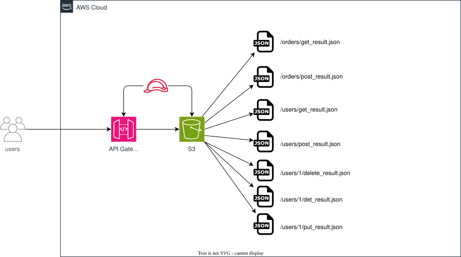

# API Gateway + S3 スタブAPI - AWS CDK リファレンスアーキテクチャ

[](./README.ja.md)
[](./README.md)

> **レベル: 200 (中級)**

Amazon API Gateway の REST API を **AWS サービス統合** で直接 Amazon S3 に接続するだけで作る、モック/スタブ HTTP API です。リクエストパスに Lambda 関数は一切登場しません。各 HTTP メソッドは S3 に置いた定型 JSON ファイルを `s3:GetObject` で読み取るだけなので、API を拡張するにはバケットに新しいファイルを置くだけで済み、再デプロイは不要です。フロントエンド開発やコントラクトテスト、バックエンドがまだ用意できていないデモなど、軽量な擬似バックエンドとして利用できます。

[「API Gateway + S3でとりあえず動くAPIスタブを作ってみた」](https://zenn.dev/issy/articles/zenn-apigw-s3-stub-tried-it) で紹介されているパターンを元にしています。

## 📑 目次

- [アーキテクチャ概要](#-アーキテクチャ概要)
- [設計判断とベストプラクティス](#-設計判断とベストプラクティス)
- [コスト最適化](#-コスト最適化)
- [セキュリティに関する考慮事項](#-セキュリティに関する考慮事項)
- [前提条件](#-前提条件)
- [デプロイガイド](#-デプロイガイド)
- [使用方法](#使用方法)
- [テスト戦略](#-テスト戦略)
- [カスタマイズ](#-カスタマイズ)
- [トラブルシューティング](#-トラブルシューティング)
- [クリーンアップ](#-クリーンアップ)
- [参考資料](#-参考資料)

## 🏗️ アーキテクチャ概要



### 主要コンポーネント

- **Amazon API Gateway (REST API)** -- `/{resource}` と `/{resource}/{item}` の2階層のリソースを公開します。コレクションに対する `GET`/`POST`、アイテムに対する `GET`/`PUT`/`DELETE` はすべて **AWS サービス統合(非プロキシ)** で構成されており、`AWS_PROXY` でも `HTTP_PROXY` でもありません。統合先のバックエンド HTTP メソッドは常に `GET` -- 呼び出し側の HTTP メソッドは「どのファイルを読むか」だけを決めます。
- **Amazon S3 (`StubBucket`)** -- 定型の JSON レスポンスを保持します。オブジェクトキーは `<resource>/<method>_result.json`(コレクション)または `<resource>/<item>/<method>_result.json`(アイテム)という形式で、例えば `users/get_result.json`、`users/1/put_result.json` のようになります。
- **IAM ロール (`ApiGatewayS3Role`)** -- API Gateway がバケット内オブジェクトへの `s3:GetObject` と、バケット自体への `s3:ListBucket` を呼び出すために引き受けるロールで、それ以外の権限は一切付与していません。`ListBucket` は、スタブファイルが存在しない場合に正しく `404` を返すために必要です([設計判断2](#2-http-メソッドから-s3-キーへのパスオーバーライドによるマッピング)を参照)-- これが無いと S3 は「存在しない」を `403 AccessDenied` として隠蔽してしまいます。
- **S3 BucketDeployment** -- デプロイ時にサンプルリソース(`users`、`orders`)をいくつか投入し、デプロイ直後から動作確認できるようにします。`prune: false` としているため、後から手動(コンソール/CLI)で追加したスタブファイルは再デプロイ時も消えません。
- **API キー + 使用量プラン** -- すべてのメソッドで `x-api-key` を必須にし、環境ごとの `throttle` パラメータ(デフォルトは 10 req/s、バースト 20)でスロットリングします。

### アーキテクチャの特性

| 特性 | 値 | 根拠 |
|---|---|---|
| 可用性 | リージョナル、AWS マネージド | API Gateway と S3 はどちらもマルチ AZ の耐久性を備えたリージョナルなマネージドサービスであり、運用するインフラがありません。 |
| スケーラビリティ | S3/API Gateway のサービス上限までスケール | リクエストパスにコンピュート(Lambda/EC2)が無いため、同時実行数のボトルネックを見積もる必要がありません。 |
| セキュリティ | API キー + 最小権限 IAM | 統合ロールはこの1つのバケットに対する `s3:GetObject`/`s3:ListBucket` のみが可能で、バケットはパブリックアクセスをすべてブロックしています。 |
| コスト | リクエスト課金、待機時はほぼゼロ | アイドル状態のコンピュートコストが無く、ストレージも数KBの JSON のみです。 |

## 🎯 設計判断とベストプラクティス

### 1. Lambda ではなく AWS サービス統合を使う

**決定事項**: S3 から読み取った本文を返す Lambda 関数を挟むのではなく、API Gateway のネイティブな `AWS`(非プロキシ)統合タイプで直接 `s3:GetObject` を呼び出す。

**根拠**:
- ✅ 書く・テストする・デプロイする・パッチを当てるコンピュートがゼロ -- 「バックエンド」は JSON ファイルそのもの
- ✅ コールドスタートが発生しない -- レイテンシは API Gateway と S3 の分だけ
- ✅ API の拡張(新しいリソース、新しいサンプル)はファイルのアップロードだけで済み、コード変更や再デプロイが不要
- ✅ スケールを気にする対象が無い -- 同時実行数の上限を考慮する必要がない

**トレードオフ**:
- ❌ リクエストロジックが無い(パスパラメータの有無以上のバリデーション、条件分岐したレスポンス、計算フィールドなど)-- あくまで*静的*なスタブであり、振る舞いを持つモックサーバーではない
- ❌ 異なるレスポンスごとに個別のオブジェクトが必要で、VTL のレスポンステンプレートでできる範囲を超えたテンプレート化はできない
- ❌ `AWS` タイプの統合をデバッグするのは Lambda コードのデバッグほど馴染みがなく、主なツールは CloudWatch の実行ログになる

### 2. HTTP メソッドから S3 キーへのパスオーバーライドによるマッピング

**決定事項**: 各メソッドの統合パスは `<bucket>/{resource}/get_result.json` のようなリテラルなテンプレートとし、`{resource}`/`{item}` はリクエストのパスパラメータから `integration.request.path.*` マッピングで埋め込みます。S3 側の HTTP メソッドは呼び出し側の動詞に関わらず**常に `GET`**(`integrationHttpMethod: 'GET'`)-- 動詞はS3に渡されるのではなく*ファイル名*に焼き込まれます。

```typescript
const integration = new apigateway.AwsIntegration({
  service: 's3',
  integrationHttpMethod: 'GET',
  path: `${stubBucket.bucketName}/{resource}/get_result.json`,
  options: {
    credentialsRole: apiGatewayS3Role,
    requestParameters: {
      'integration.request.path.resource': 'method.request.path.resource',
    },
    integrationResponses: [
      { statusCode: '200' },
      { statusCode: '403', selectionPattern: '403' },
      { statusCode: '404', selectionPattern: '404' },
    ],
  },
});
```

**根拠**:
- ✅ あるリソースに新しい HTTP メソッドを追加するには、新しいファイルを指す `addMethod()` 呼び出しを1つ書くだけ -- ルーティングロジックは CDK 側に、レスポンスデータは S3 側に留まる
- ✅ `selectionPattern: '404'` により、スタブファイルが存在しない場合に S3 の XML エラー本文付き `200` ではなく、正しい `404` として表面化する

**実際のデプロイに `test-api.sh` を実行して見つかった落とし穴**: 存在しないスタブファイルへのリクエストが、最初はきれいな `404` ではなく `200` に生の S3 `AccessDenied` XML 本文が付いた形で返ってきました。原因は API Gateway ではなく S3 側の仕様です。バケットへの `s3:ListBucket` が無いと、S3は「オブジェクトが存在しない」のか「バケットが見えない」のかを呼び出し側に区別させないため、オブジェクトの実在有無に関わらず `403 AccessDenied` を返します([S3 のアクセス制御のトラブルシューティング](https://docs.aws.amazon.com/AmazonS3/latest/userguide/access-control-troubleshooting.html)参照)。`integrationResponses` には `200`(デフォルト)と `404` のエントリしか無かったため、この `403` はどちらの `selectionPattern` にもマッチせず、デフォルトの `200` にフォールスルーしていました。対処は2つ必要です。`apiGatewayS3Role` にバケットスコープの `s3:ListBucket` ステートメントを付与して(オブジェクトへの `s3:GetObject` だけでなく)S3 が本物の `404` を返せるようにすることと、`integrationResponses`/`methodResponses` に明示的な `403` エントリを追加して、実際の権限エラーが `200` のキャッチオールに黙って一致してしまわないようにすることです。

**環境ごとの設定例**: スロットリングは [`parameters/dev-params.ts`](parameters/dev-params.ts) の `EnvParams.throttle` で環境ごとに調整できます。

```typescript
const devParams: EnvParams = {
  region: process.env.CDK_DEFAULT_REGION || 'ap-northeast-1',
  throttle: { rateLimit: 10, burstLimit: 20 },
};
```

### 3. IAM/Cognito ではなく API キーによる認可

**決定事項**: すべてのメソッドで `apiKeyRequired: true` を設定し、`UsagePlan` に紐づける。IAM(SigV4)や Cognito/Lambda オーソライザーは使用しません。

**根拠**:
- ✅ 「とりあえず curl で叩ける」というスタブ API を有用にしている開発体験を保てる -- 偽物のエンドポイントを叩くためだけに SigV4 署名やユーザープールを用意する必要がない
- ✅ それでも共有の開発/CI用スタブとして十分な、リクエストのスロットリングとキーごとの利用状況追跡が得られる
- ❌ API キーは実際の認証機構では**ない**(呼び出し元をスロットリング/課金のために識別するだけで、認可のためではない)-- このパターンを実データを扱う API に転用してはいけません

**Well-Architected との整合性**:

| 柱 | 実装内容 |
|---|---|
| **運用上の優秀性** | API ステージにアクセスログ(JSON、標準フィールド)を有効化。ランタイムエラーを監視/パッチする対象のコンピュートが無い。 |
| **セキュリティ** | 最小権限の IAM ロール(このバケットのみに対する `s3:GetObject` + `s3:ListBucket`)、TLS 必須のバケット、パブリックアクセスのブロック、API キー + 使用量プランによるスロットリング。 |
| **信頼性** | すべてフルマネージドサービス(API Gateway、S3)で構成されており、このスタック自体が単一障害点を持ち込むことはない。 |
| **パフォーマンス効率** | 直接のサービス統合により Lambda のコールドスタートを回避。S3 の読み取りレイテンシは通常1桁ミリ秒。 |
| **コスト最適化** | アイドル状態のコンピュートが無く、リクエスト数と数KBの S3 ストレージのみに課金される。 |
| **持続可能性** | リクエストの合間にアイドル状態で待機する過剰なコンピュートが存在しない。 |

## 💰 コスト最適化

### 月額費用の見積もり (ap-northeast-1 / 東京)

#### 軽量な利用 (個人利用/開発、~10,000 リクエスト/月)
```
API Gateway REST API:  10,000 req x $4.25 / 1,000,000       = $0.04
S3 GET リクエスト:      10,000 req x $0.00037 / 1,000        = $0.004
S3 ストレージ:          JSON 1MB未満                          ≈ $0.00
CloudWatch Logs:       アクセスログ 10MB未満                  ≈ $0.00
-------------------------------------------------------------------
合計:                                                        ~$0.05/月
```

#### チーム/CI での共有利用 (~1,000,000 リクエスト/月)
```
API Gateway REST API:  1,000,000 req x $4.25 / 1,000,000    = $4.25
S3 GET リクエスト:      1,000,000 req x $0.00037 / 1,000     = $0.37
S3 ストレージ:          JSON 1MB未満                           ≈ $0.00
CloudWatch Logs:       アクセスログ ~200MB x $0.76/GB         = $0.15
-------------------------------------------------------------------
合計:                                                        ~$4.77/月
```

*(2026年時点、ap-northeast-1 の料金。無料利用枠は含みません。最新の料金は [AWS Pricing Calculator](https://calculator.aws/) で確認してください。)*

### コスト最適化戦略

1. **リクエストパスに Lambda を挟まない**
   - Lambda の呼び出しごとの料金や、プロビジョニング済み同時実行のコストをまるごと不要にします -- リクエストパスは API Gateway → S3 のみです。

2. **API アクセスログ用ロググループの `RetentionDays.ONE_MONTH`**
   - 短命な開発/テストサイクルで使われることが多いツールにおいて、CloudWatch Logs のストレージが際限なく増え続けるのを防ぎます。

3. **`BucketDeployment` の `prune: false`**
   - 変更が無い場合にシード用データを毎回再アップロードするコストを避けます(CDK 自体はハッシュを比較しますが、手動で追加した無関係なオブジェクトをデプロイがスキャン・削除してしまうリスクがありません)。

## 🔒 セキュリティに関する考慮事項

### ネットワーク・データセキュリティ

1. **最小権限の IAM ロール**
   - `ApiGatewayS3Role` は、この1つのバケットに対する2つのアクションのみに限定されています。`StubBucket/*` への `s3:GetObject` と、バケット自体への `s3:ListBucket`(スタブファイルが存在しない場合に S3 が `403 AccessDenied` として隠蔽せず正しい `404` を返すために必要 -- [設計判断2](#2-http-メソッドから-s3-キーへのパスオーバーライドによるマッピング)を参照)です。`PutObject`・`DeleteObject` やその他のバケットレベルの操作は一切付与していません。

2. **S3 バケットの堅牢化**
   - `blockPublicAccess: BLOCK_ALL`、`enforceSSL: true`、デフォルトで SSE-S3 暗号化。

3. **API キー + 使用量プランによるスロットリング**
   - すべてのメソッドで `x-api-key` を必須とし、スロットリング(デフォルト 10 req/s、バースト 20)を適用することで、公開されたスタブエンドポイントの悪用を制限します。

### 実装済みのセキュリティベストプラクティス

- ✅ S3 へのパブリックアクセスなし -- バケットは API Gateway の統合ロール経由でしかアクセスできない
- ✅ S3 バケットで TLS を強制(`enforceSSL: true`)
- ✅ 監査のため API Gateway のアクセスログ(JSON、標準フィールド)を有効化
- ✅ リクエストバリデーションを有効化(`validateRequestParameters: true`)し、不正なリクエストは統合に到達する前に API Gateway で拒否

### このスタックが意図的にやっていないこと

これはローカルでのプロトタイピング向けのモック/スタブ API であり、本番のデータ API ではありません。

- メソッドに IAM/Cognito 認可を付けていない([設計判断3](#3-iamcognito-ではなく-api-キーによる認可)を参照)
- WAF を関連付けていない(`cloudfront-vpc-origin` ワークスペースで別途デモしています)

どちらも [`test/compliance/cdk-nag.test.ts`](test/compliance/cdk-nag.test.ts) に理由付きで抑制(suppress)を記載しています -- 実ユーザーデータを扱うアーキテクチャにこれらの抑制をそのままコピーしないでください。

### CDK Nag によるコンプライアンス確認

```bash
npm run test:compliance -w workspaces/apigw-s3-stub
```

## 📋 前提条件

- 適切な権限を持つ AWS アカウント
- AWS CLI v2.x のインストールと設定
- Node.js 20.x 以降
- AWS CDK 2.x
- Git

### 必要な IAM 権限

デプロイを実行するユーザー/ロールには、以下の作成・管理権限が必要です。

- API Gateway(REST API、リソース、メソッド、デプロイ、API キー、使用量プラン)
- S3(バケット、バケットポリシー、オブジェクト)
- IAM(ロール、API Gateway S3 ロール用のインラインポリシー)
- CloudWatch Logs(API アクセスログ用ロググループ)
- Lambda(`BucketDeployment` がサンプルファイルを投入するために使う CDK 管理のカスタムリソース)

## 🚀 デプロイガイド

### 1. クローンとセットアップ

```bash
cd infrastructure
npm install
```

### 2. 環境パラメータの設定

リージョンやスロットリングの上限を変更したい場合は [`parameters/dev-params.ts`](parameters/dev-params.ts) を編集します。

```typescript
const devParams: EnvParams = {
  region: process.env.CDK_DEFAULT_REGION || 'ap-northeast-1',
  throttle: { rateLimit: 10, burstLimit: 20 },
};
```

### 3. デプロイ

`PROJECT`/`ENV` は CDK コンテキスト(`-c project=... -c env=...`)と、このワークスペースの npm スクリプトに組み込まれた AWS CLI プロファイル名(`${PROJECT}-${ENV}`、例: `apigw-s3-stub-dev`)の両方に使われます。

```bash
export PROJECT=apigw-s3-stub
export ENV=dev

npm run bootstrap -w workspaces/apigw-s3-stub   # 初回のみ、アカウント/リージョンごとに実行
npm run synth -w workspaces/apigw-s3-stub
npm run deploy:all -w workspaces/apigw-s3-stub
```

### 4. デプロイの確認

スタックは `ApiUrl`、`StubBucketName`、`ApiKeyId` を出力します。API キーの実際の値は CloudFormation では平文で出力されないため、以下で取得します。

```bash
aws apigateway get-api-key --api-key <ApiKeyId> --include-value --query value --output text
```

または、この3つの出力値を自分で解決して全メソッド(コレクション/アイテムのGET/POST/PUT/DELETE、存在しないスタブファイルに対する404、APIキー欠如時の403)に加え、S3経由でAPIを拡張するデモまで一括で実行する [`test-api.sh`](test-api.sh) を使うこともできます。

```bash
./test-api.sh --project $PROJECT --env $ENV
```

## 使用方法

```bash
API_URL="<ApiUrl の出力値>"
API_KEY="$(aws apigateway get-api-key --api-key <ApiKeyId> --include-value --query value --output text)"

# GET /users -> users/get_result.json を読む
curl -s -H "x-api-key: $API_KEY" "${API_URL}users" | jq .

# POST /users -> users/post_result.json を読む
curl -s -X POST -H "x-api-key: $API_KEY" "${API_URL}users" | jq .

# GET /users/1 -> users/1/get_result.json を読む
curl -s -H "x-api-key: $API_KEY" "${API_URL}users/1" | jq .

# PUT /users/1 -> users/1/put_result.json を読む
curl -s -X PUT -H "x-api-key: $API_KEY" "${API_URL}users/1" | jq .

# DELETE /users/1 -> users/1/delete_result.json を読む
curl -s -X DELETE -H "x-api-key: $API_KEY" "${API_URL}users/1" | jq .
```

### 新しいスタブでAPIを拡張する

再デプロイは不要です -- `StubBucketName` に想定されるキーでオブジェクトを追加するだけです。

```bash
echo '{"id":"42","name":"New Widget"}' \
  | aws s3 cp - "s3://<StubBucketName>/widgets/get_result.json" --content-type application/json

curl -s -H "x-api-key: $API_KEY" "${API_URL}widgets" | jq .
```

## 🧪 テスト戦略

### テスト構成

```
test/
├── compliance/
│   └── cdk-nag.test.ts     # AWS Solutions の cdk-nag チェックと理由付きの抑制
├── snapshot/
│   └── snapshot.test.ts    # テンプレート全体のスナップショット + リソース数のスナップショット
└── unit/
    └── apigw-s3-stub.test.ts  # バケット、IAMロール、統合、メソッド、使用量プラン、出力
```

### 1. スナップショットテスト

**目的**: リファクタリング時に意図しない CloudFormation テンプレートの変更を検知する。

```bash
npm run test:snapshot -w workspaces/apigw-s3-stub
```

### 2. ユニットテスト

**目的**: このパターンを成立させている具体的なリソースと設定をアサートする。

**テストカテゴリ** (10テスト):
- ✅ コアリソース(S3バケットの堅牢化、REST API、IAMロール/ポリシー、BucketDeployment) (4テスト)
- ✅ AWS サービス統合(非プロキシの `AWS` タイプ、GET/POST/PUT/DELETE のルーティング、`apiKeyRequired`) (3テスト)
- ✅ 使用量プランとスロットリング(API キー/使用量プランのリソース、ステージのアクセスログ) (2テスト)
- ✅ 出力(`ApiUrl`、`StubBucketName`、`ApiKeyId`) (1テスト)

```bash
npm run test:unit -w workspaces/apigw-s3-stub
```

### 3. コンプライアンステスト

```bash
npm run test:compliance -w workspaces/apigw-s3-stub
```

## ⚙️ カスタマイズ

### 既存のリソース階層に新しい HTTP メソッドを追加する

```typescript
addStubMethod(resource, 'PATCH', '{resource}/patch_result.json', ['resource']);
```

対応するファイルを `BucketDeployment` でシードするか、デプロイ後に直接 S3 にアップロードしてください。

### 環境ごとのスロットリングを変更する

```typescript
// parameters/dev-params.ts
const devParams: EnvParams = {
  region: process.env.CDK_DEFAULT_REGION || 'ap-northeast-1',
  throttle: { rateLimit: 50, burstLimit: 100 },
};
```

### CORS のオリジンを制限する

デフォルトでは `defaultCorsPreflightOptions` がすべてのオリジンを許可しており(`apigateway.Cors.ALL_ORIGINS`)、ローカルでのフロントエンド開発には便利です。チームで共有するデプロイでは制限してください。

```typescript
defaultCorsPreflightOptions: {
  allowOrigins: ['https://your-frontend.example.com'],
  allowMethods: apigateway.Cors.ALL_METHODS,
},
```

## 🔧 トラブルシューティング

### 問題: すべてのリクエストで `403 Forbidden` が返る

**症状**: パスに関わらずすべてのリクエストが `{"message":"Forbidden"}` で失敗する。

**対処法**:
1. `x-api-key` ヘッダーが設定されており、`aws apigateway get-api-key --include-value` で取得した値と一致しているか確認する。
2. デプロイステージが使用量プランに含まれているか確認する(`UsagePlanKey`/`addApiStage` はこのスタックで既に設定済みですが、カスタマイズした場合は確認してください)。

### 問題: 想定していたパスで `404` が返る

**症状**: `{"message":"No stub file found for this path/method"}`。

**対処法**:
1. `<resource>/<method>_result.json` または `<resource>/<item>/<method>_result.json` という想定どおりのキーにオブジェクトが存在するか確認する。
2. バケットの中身を一覧表示する: `aws s3 ls s3://<StubBucketName>/ --recursive`。
3. `ApiGatewayS3Role`(このスタックのまま変更していなければ既に許可されています)がオブジェクトへの `s3:GetObject` を許可されているか確認する。

### 問題: 存在しないスタブファイルが、きれいな `404` ではなく `200` + S3 の生の XML `AccessDenied` エラーになる

**症状**: 対応するスタブファイルが無いパスに `GET` すると、フレンドリーな `404` の JSON メッセージではなく、HTTP `200` に `<Error><Code>AccessDenied</Code>...` という XML 本文が付いて返ってくる。

**原因**: S3 は、呼び出し側がバケットへの `s3:ListBucket` を持っていない場合、存在しないキーへの `GetObject` に対して `404 NoSuchKey` ではなく `403 AccessDenied` を返します -- これは、呼び出し側が「オブジェクトが存在しない」のか「そもそもバケットが見えない」のかを区別できないようにするための意図的な S3 の仕様です([S3 のアクセス制御のトラブルシューティング](https://docs.aws.amazon.com/AmazonS3/latest/userguide/access-control-troubleshooting.html)参照)。`ApiGatewayS3Role` には既に `s3:ListBucket` が付与されているため、このスタックをそのままデプロイした場合はこの問題に遭遇しません -- ただし、このパターンをコピーしてロールを `s3:GetObject` のみに削ってしまうと、まさにこの症状が再現します。

**対処法**:
1. 統合ロールに(オブジェクトへの `s3:GetObject` だけでなく)バケットへの `s3:ListBucket` を付与する。
2. メソッドの `integrationResponses`/`methodResponses` に `403` と `404` の両方のエントリが含まれているか確認する(`selectionPattern: '403'`/`'404'`。このスタックでは全メソッドに設定済み)-- `403` のエントリが無いと、AccessDenied のレスポンスがデフォルトの `200` にフォールスルーし、生の S3 XML 本文が漏れてしまいます。
3. `loggingLevel: INFO`(既に有効)を確認し、API の CloudWatch Logs の実行ログで S3 が実際に返しているステータスコードを調べる。
4. `test-api.sh` はまさにこのパス(`GET /users/999`、`GET /no-such-resource`)を検証しており、この問題を最初に検出したのもこのスクリプトです -- IAM を変更した後は必ず実行してください。

## 🧹 クリーンアップ

```bash
npm run destroy:all -w workspaces/apigw-s3-stub
```

このリファレンスアーキテクチャでは([`bin/apigw-s3-stub.ts`](bin/apigw-s3-stub.ts) で設定された)`isAutoDeleteObject: true` により `StubBucket` が自動的に空にされるため、バケットが空でないことによる `cdk destroy` の失敗を回避できます。

## 📚 参考資料

### AWS ドキュメント
- [Set up an AWS service integration for a REST API in API Gateway](https://docs.aws.amazon.com/apigateway/latest/developerguide/getting-started-aws-integration.html)
- [Amazon API Gateway API request and response data mapping reference](https://docs.aws.amazon.com/apigateway/latest/developerguide/api-gateway-mapping-template-reference.html)
- [Amazon S3 GetObject API](https://docs.aws.amazon.com/AmazonS3/latest/API/API_GetObject.html)

### AWS Well-Architected
- [AWS Well-Architected Framework](https://aws.amazon.com/architecture/well-architected/)

### AWS CDK
- [aws-apigateway module](https://docs.aws.amazon.com/cdk/api/v2/docs/aws-cdk-lib.aws_apigateway-readme.html)
- [aws-s3-deployment module](https://docs.aws.amazon.com/cdk/api/v2/docs/aws-cdk-lib.aws_s3_deployment-readme.html)

### 関連アーキテクチャ
- [sns-basic](../sns-basic/) -- こちらは `LambdaIntegration` で SNS の HTTPS サブスクリプション確認を受ける、別の API Gateway の例です
- [cloudfront-vpc-origin](../cloudfront-vpc-origin/) -- API Gateway をオリジンとするディストリビューションへの WAF の関連付けを示しています

### 元記事
- [「API Gateway + S3でとりあえず動くAPIスタブを作ってみた」(Zenn)](https://zenn.dev/issy/articles/zenn-apigw-s3-stub-tried-it) -- このリファレンスアーキテクチャの元になったパターン

## 📄 ライセンス

このプロジェクトは MIT ライセンスの下で提供されています。詳細は [LICENSE](../../LICENSE) ファイルを参照してください。

## 👥 コントリビューション

コントリビューションを歓迎します。詳細は [CONTRIBUTING.md](../../CONTRIBUTING.md) を参照してください。

## 🏆 このリファレンスアーキテクチャについて

このリファレンスアーキテクチャは、本番運用に耐えるインフラを構築するための AWS CDK のベストプラクティスを示すものです。

**対象レベル**: 200 (中級)

---

**注記**: これはリファレンス実装です。本番環境にデプロイする前に、必ずご自身の要件と組織のポリシーに沿ってレビュー・カスタマイズしてください。特にこのパターンはモック/スタブ用途向けに設計されており、実際の本番データを扱う用途を想定していません。
