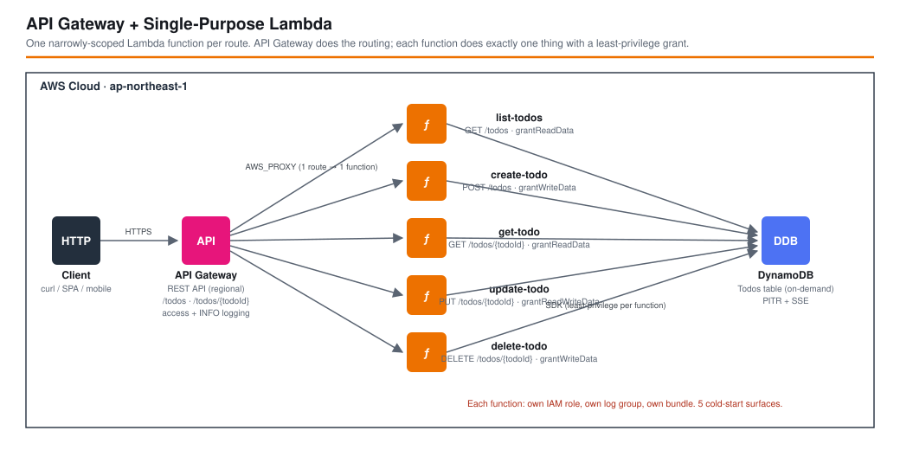

# API Gateway + Single-Purpose Lambda - AWS CDK Reference Architecture

[](./README.ja.md)
[](./README.md)

> **Level: 300 (Intermediate)**

A Todos REST API where **every API Gateway method is backed by its own Lambda function**. API Gateway does the routing (`addResource`/`addMethod`); each function does exactly one thing — `list`, `create`, `get`, `update`, or `delete` — with its own IAM role, its own log group, its own bundle, and a **least-privilege** DynamoDB grant (read-only for `GET`, write-only for `POST`/`DELETE`).

This is one of three companion workspaces that implement the **same API** three different ways so the API Gateway + Lambda integration styles can be compared directly:

| Workspace | Functions | Routing | One-line summary |
|-----------|-----------|---------|------------------|
| **`apigw-single-purpose-lambda`** (this) | one per route | API Gateway | Maximum isolation: each route has its own function, role, and grant. |
| [`apigw-lambdalith`](../apigw-lambdalith/) | one | Hono, in-process | One function, one deploy unit, framework routing. |
| [`apigw-lambda-web-adapter`](../apigw-lambda-web-adapter/) | one | Express, in-process | A standard Express server behind the Lambda Web Adapter layer. |

## 📑 Table of Contents

- [Architecture Overview](#-architecture-overview)
- [Design Decisions & Best Practices](#-design-decisions--best-practices)
- [Pattern Comparison](#-pattern-comparison)
- [Well-Architected Alignment](#-well-architected-alignment)
- [Cost Optimization](#-cost-optimization)
- [Security Considerations](#-security-considerations)
- [Prerequisites](#-prerequisites)
- [Deployment Guide](#-deployment-guide)
- [Usage](#usage)
- [Testing Strategy](#-testing-strategy)
- [Customization](#-customization)
- [Troubleshooting](#-troubleshooting)
- [Clean-up](#-clean-up)
- [References](#-references)

## 🏗️ Architecture Overview



### Key Components

- **Amazon API Gateway (REST API)** — explicit resources and methods built with `RestApi` + `addResource`/`addMethod`:
  - `/todos` → `GET` (list), `POST` (create)
  - `/todos/{todoId}` → `GET` (get), `PUT` (update), `DELETE` (delete)
  - Each method is a `LambdaIntegration` (`AWS_PROXY`) to a **different** function.
- **Five AWS Lambda functions** — `list-todos`, `create-todo`, `get-todo`, `update-todo`, `delete-todo`. All Node.js 22 / ARM64, each built from its own `src/handlers/<name>.ts` entry, each with a **dedicated CloudWatch log group** (one-week retention) created by a small `makeHandler` factory in the stack.
- **Amazon DynamoDB (`TodosTable`)** — on-demand (`PAY_PER_REQUEST`), `todoId` partition key, SSE (AWS-managed key), point-in-time recovery on.
- **Per-function least-privilege grants**:
  | Function | Grant | Effective DynamoDB actions |
  |----------|-------|----------------------------|
  | `list-todos` | `grantReadData` | `Scan`, `Query`, `GetItem`, … (no writes) |
  | `get-todo` | `grantReadData` | read-only |
  | `create-todo` | `grantWriteData` | `PutItem`, `UpdateItem`, `DeleteItem`, `BatchWrite…` (no reads) |
  | `delete-todo` | `grantWriteData` | write-only |
  | `update-todo` | `grantReadWriteData` | read + write (it does a conditional update) |
- **Observability** — five function log groups + one API Gateway access-log group; access logs (JSON, standard fields) and `INFO` method logging on the stage.

### Architecture Characteristics

| Characteristic | Value | Rationale |
|---------------|-------|-----------|
| Deploy unit | one function per route | A change to `update-todo` redeploys only that function; the other four are untouched. |
| Cold start | five small surfaces | Each bundle is ~2 kB (one command + the shared DynamoDB client); a route is only ever "cold" independently of the others. |
| IAM scope | one role per function, least privilege | `list-todos` literally cannot call `PutItem`; `create-todo` literally cannot `Scan`. |
| Per-route tuning | independent memory / timeout / reserved concurrency | A slow `list` can get 512 MB without paying for it on `delete`. |
| CloudFormation size | grows ~6 resources per route | Method + Integration + Function + Role + Policy + LogGroup each time. |

## 🎯 Design Decisions & Best Practices

### 1. One function per route

**Decision**: Map each method to its own Lambda instead of routing inside a single function (contrast [`apigw-lambdalith`](../apigw-lambdalith/)).

**Rationale**:
- ✅ **Least privilege is natural** — the `list` role has no write permission, the `create` role has no read permission. There is nothing to "remember" to scope down.
- ✅ **Independent everything** — memory, timeout, reserved/provisioned concurrency, env vars, runtime, and *deploys* are per route. A hot `GET /todos` can be tuned and scaled without touching `DELETE`.
- ✅ **Small blast radius** — a bad deploy or a poison payload affects one endpoint; the rest of the API keeps serving.
- ✅ **Tiny cold starts** — each artifact bundles exactly one DynamoDB command, so a cold `get-todo` initialises almost nothing.
- ✅ **Clear ownership** — in a large org, `team-a/create-todo` and `team-b/list-todos` can be owned, alarmed, and released separately.

**Trade-offs**:
- ❌ **More infrastructure** — ~6 CloudFormation resources per route (method, integration, function, role, policy, log group). This template has ~35 resources vs ~15 for the Lambdalith.
- ❌ **Shared code needs real packaging** — the DynamoDB client helper is duplicated per bundle here; anything larger wants a Lambda layer or an internal npm package.
- ❌ **More dashboards/alarms** — five functions' worth of metrics; you likely want a composite alarm.
- ❌ **Routing lives in CDK** — adding `PATCH /todos/{id}/complete` is an infrastructure change (`addMethod` + a new function), not just application code.

### 2. Least-privilege grants per function

```typescript
const listTodosHandler = makeHandler('ListTodos', 'list-todos', 'list-todos');
todosTable.grantReadData(listTodosHandler);      // read-only

const createTodoHandler = makeHandler('CreateTodo', 'create-todo', 'create-todo');
todosTable.grantWriteData(createTodoHandler);    // write-only

const updateTodoHandler = makeHandler('UpdateTodo', 'update-todo', 'update-todo');
todosTable.grantReadWriteData(updateTodoHandler); // needs both
```

**Rationale**:
- ✅ A compromised `list-todos` cannot mutate or delete data; a compromised `create-todo` cannot exfiltrate the table via `Scan`.
- ✅ The intent is visible in the stack and enforced by a unit test that asserts at least one role has `Scan` without `PutItem` and at least one has `PutItem` without `GetItem`/`Scan`.

`cdk-nag` still flags the `table/index/*` resource that every `grant*Data` adds and the `AWSLambdaBasicExecutionRole` managed policy; both are suppressed with a documented reason in [`test/compliance/cdk-nag.test.ts`](test/compliance/cdk-nag.test.ts).

### 3. A `makeHandler` factory so each function gets its own log group

```typescript
const makeHandler = (idPrefix: string, entryFile: string, name: string) =>
  new lambdaNodejs.NodejsFunction(this, `${idPrefix}Handler`, {
    ...commonProps,
    entry: `src/handlers/${entryFile}.ts`,
    handler: 'handler',
    functionName: `${project}-${environment}-${name}`,
    logGroup: new logs.LogGroup(this, `${idPrefix}LogGroup`, {
      retention: logs.RetentionDays.ONE_WEEK,
      removalPolicy,
    }),
  });
```

**Rationale**:
- ✅ Keeps the five declarations to two lines each while still giving every function an **explicit** log group with a retention policy (the deprecated `logRetention` prop would instead create a custom-resource Lambda per function).
- ✅ `removalPolicy` follows `isAutoDeleteObject`, so `dev` log groups are cleaned up with the stack.

### 4. Explicit `RestApi` + methods (not `LambdaRestApi` proxy)

**Decision**: Build resources/methods by hand so each maps to a distinct integration.

**Rationale**:
- ✅ Per-method API Gateway features are available if needed later: request validators, method-level throttling, per-route authorizers, per-route usage plans.
- ✅ The API contract is visible in the CDK code, method by method.

**Trade-off**: adding a route touches infrastructure (see Decision 1).

### 5. Environment-specific parameters

Region/account come from `EnvParams` (`parameters/<env>-params.ts`). `isAutoDeleteObject` (dev only) drives the DynamoDB and log-group `RemovalPolicy`; `terminationProtection` is on for `prd`.

## 🔀 Pattern Comparison

| Aspect | **Single-Purpose Lambda (this)** | Lambdalith (Hono) | Lambda Web Adapter |
|--------|----------------------------------|-------------------|--------------------|
| Lambda functions | **one per route (5)** | one | one |
| Who routes | **API Gateway (`addMethod`)** | Hono, in-process | Express, in-process |
| API Gateway shape | **explicit resources + methods** | `ANY /{proxy+}` | `ANY /{proxy+}` |
| IAM granularity | **per-route (read-only vs write-only)** | one role = union | one role = union |
| Per-route memory / timeout / concurrency | **yes** | no | no |
| Deploy blast radius | **one function** | whole API | whole API |
| CloudFormation size | **grows per route (~35 resources)** | flat (~15) | flat (~16) |
| Cold-start surfaces | **5 (tiny bundles)** | 1 (small) | 1 (server + layer) |
| Shared code | **duplicated per bundle / layer** | just a function call | just a function call |
| Runs outside Lambda | **no** | adapter swap | yes, unchanged |
| Best fit | **routes with different scaling / security / ownership; large teams** | small–medium API, one team, fast iteration | porting an existing Node web app; multi-target deploys |

## 🏛️ Well-Architected Alignment

| Pillar | Implementation |
|--------|---------------|
| **Operational Excellence** | Independent per-route deploys; per-function log groups with retention; access + `INFO` method logging on the stage. |
| **Security** | One IAM role per function, each read-only *or* write-only where possible; SSE + PITR on the table; TLS-only endpoint; authN/Z and WAF are documented add-ons. |
| **Reliability** | Managed API Gateway + Lambda + DynamoDB, multi-AZ; a fault in one function does not take down other routes; PITR for restore; on-demand billing absorbs spikes. |
| **Performance Efficiency** | ARM64 / Graviton; single-purpose bundles keep cold starts minimal; per-route memory sizing. |
| **Cost Optimization** | No idle compute; `PAY_PER_REQUEST` DynamoDB; pay only for the routes that are actually called. |
| **Sustainability** | Graviton; scale-to-zero per route; no over-provisioned compute. |

## 💰 Cost Optimization

### Estimated Monthly Costs (ap-northeast-1 / Tokyo)

#### Light usage (~100,000 requests/month, spread across routes)
```
API Gateway REST API:  100,000 req x $4.25 / 1,000,000        = $0.43
Lambda requests:        100,000 req x $0.20 / 1,000,000        = $0.02
Lambda compute:         100,000 x 120 ms x 256 MB (arm64)      ≈ $0.01
DynamoDB on-demand:     ~300,000 RRU/WRU                        ≈ $0.10
CloudWatch Logs:        6 log groups, < 60 MB total            ≈ $0.03
-------------------------------------------------------------------
Total:                                                          ~$0.59/month
```

#### Moderate usage (~5,000,000 requests/month)
```
API Gateway REST API:  5,000,000 req x $4.25 / 1,000,000       = $21.25
Lambda requests:        5,000,000 req x $0.20 / 1,000,000       = $1.00
Lambda compute:         5,000,000 x 120 ms x 256 MB (arm64)     ≈ $0.50
DynamoDB on-demand:     ~15M RRU/WRU                            ≈ $5.00
CloudWatch Logs:        ~2 GB across 6 groups                   ≈ $1.50
-------------------------------------------------------------------
Total:                                                          ~$30/month
```

*(Pricing as of 2026, ap-northeast-1; excludes free-tier. Verify with the [AWS Pricing Calculator](https://calculator.aws/).)*

### Cost notes specific to this pattern

1. **Request cost is identical** to the other two patterns — API Gateway and Lambda bill per request regardless of how many functions there are.
2. **Slightly more fixed overhead** — five log groups and five functions' worth of CloudWatch metrics. Immaterial in dollars; it does mean more to look at.
3. **Right-size per route** — set a smaller `memorySize` on `delete-todo` and a larger one only where profiling shows it helps; the Lambdalith cannot do this.
4. **ARM64 / Graviton** and **`PAY_PER_REQUEST` DynamoDB** — same levers as the siblings.

## 🔒 Security Considerations

### Implemented

- ✅ **Least-privilege IAM, per function** — read routes get `grantReadData`, write routes get `grantWriteData`, only `update-todo` gets both. Enforced by a unit test.
- ✅ **Encryption at rest** — DynamoDB SSE + point-in-time recovery.
- ✅ **TLS in transit** — HTTPS-only `execute-api` endpoint.
- ✅ **Per-function log isolation** — one log group each, with retention.
- ✅ **Access + execution logging** on the stage.

### Intentionally out of scope (add per environment)

Suppressed in the compliance test — do **not** copy those suppressions into a production API:

- **Authorization** (`AwsSolutions-APIG4` / `COG4`) — attach an authorizer per method, or one default authorizer via `RestApi`'s `defaultMethodOptions`:
  ```typescript
  const auth = new apigateway.TokenAuthorizer(this, 'Auth', { handler: authFn });
  todosResource.addMethod('GET', integration, { authorizer: auth });
  ```
- **WAF** (`AwsSolutions-APIG3`) — associate a `wafv2.CfnWebACLAssociation` with the stage ARN.
- **Request validation** (`AwsSolutions-APIG2`) — here you *can* add API Gateway models + a `RequestValidator` per method (an advantage of explicit methods), or validate in each handler.

### CDK Nag

```bash
npm run test:compliance -w workspaces/apigw-single-purpose-lambda
```

## 📋 Prerequisites

- AWS account with permissions for API Gateway, Lambda, DynamoDB, IAM, CloudWatch Logs
- AWS CLI v2.x configured with a profile named `${PROJECT}-${ENV}` (e.g. `apigw-single-purpose-lambda-dev`)
- Node.js 20.x or later, AWS CDK 2.x
- **Docker is *not* required** — `NodejsFunction` bundles with a local `esbuild`

## 🚀 Deployment Guide

```bash
cd infrastructure
npm install

export PROJECT=apigw-single-purpose-lambda
export ENV=dev

npm run bootstrap  -w workspaces/apigw-single-purpose-lambda   # first time only, per account/region
npm run synth      -w workspaces/apigw-single-purpose-lambda
npm run deploy:all -w workspaces/apigw-single-purpose-lambda
```

The stack outputs `ApiUrl` and `TodosTableName`.

## Usage

```bash
API_URL="<ApiUrl output>"   # e.g. https://abc123.execute-api.ap-northeast-1.amazonaws.com/dev/

# POST /todos            -> create-todo
curl -s -X POST "${API_URL}todos" -H 'content-type: application/json' -d '{"title":"buy milk"}' | jq .
# GET  /todos            -> list-todos
curl -s "${API_URL}todos" | jq .
# GET  /todos/{todoId}   -> get-todo
curl -s "${API_URL}todos/<todoId>" | jq .
# PUT  /todos/{todoId}   -> update-todo
curl -s -X PUT "${API_URL}todos/<todoId>" -H 'content-type: application/json' -d '{"title":"buy oat milk","completed":true}' | jq .
# DELETE /todos/{todoId} -> delete-todo
curl -s -i -X DELETE "${API_URL}todos/<todoId>"
```

Each call is served by a **different** function — check the five log groups (`/aws/lambda/…` or the CDK-named groups) to see exactly one of them light up per request.

## 🧪 Testing Strategy

```
test/
├── compliance/
│   └── cdk-nag.test.ts                          # AWS Solutions pack + documented suppressions
├── parameters/
│   └── test-params.ts                           # deterministic Environment.TEST params
├── snapshot/
│   └── snapshot.test.ts                         # full template + resource-count snapshots
└── unit/
    └── apigw-single-purpose-lambda-stack.test.ts # 5 functions, 6 log groups, per-route grants, 5 methods, stage logging, outputs
```

```bash
npm test                -w workspaces/apigw-single-purpose-lambda   # all
npm run test:snapshot   -w workspaces/apigw-single-purpose-lambda
npm run test:unit       -w workspaces/apigw-single-purpose-lambda
npm run test:compliance -w workspaces/apigw-single-purpose-lambda
npm run test:snapshot   -w workspaces/apigw-single-purpose-lambda -- -u   # update snapshots after an intended change
```

Notable unit assertions: exactly `5` `AWS::Lambda::Function`, exactly `6` `AWS::Logs::LogGroup`, the five HTTP verbs `['DELETE','GET','GET','POST','PUT']`, and that the IAM policies include one read-only (`Scan` without `PutItem`) and one write-only (`PutItem` without `GetItem`/`Scan`) role.

## ⚙️ Customization

### Add a route (infrastructure + code)

```typescript
// lib/stacks/apigw-single-purpose-lambda-stack.ts
const completeTodoHandler = makeHandler('CompleteTodo', 'complete-todo', 'complete-todo');
todosTable.grantWriteData(completeTodoHandler);
todoResource.addResource('complete').addMethod('POST', new apigateway.LambdaIntegration(completeTodoHandler));
```
then add `src/handlers/complete-todo.ts`.

### Tune one route

```typescript
const listTodosHandler = new lambdaNodejs.NodejsFunction(this, 'ListTodosHandler', {
  ...commonProps,
  entry: 'src/handlers/list-todos.ts',
  handler: 'handler',
  functionName: `${project}-${environment}-list-todos`,
  memorySize: 512,                                   // only this route
  reservedConcurrentExecutions: 50,
  logGroup: new logs.LogGroup(this, 'ListTodosLogGroup', { retention: logs.RetentionDays.ONE_WEEK, removalPolicy }),
});
```

### Share code without duplication

Move `src/handlers/utils/` into a Lambda layer (`lambda.LayerVersion`) or an internal workspace package and add it to `commonProps.layers` / `bundling.externalModules`.

## 🔧 Troubleshooting

### One route returns 500, the others are fine

That is the pattern working as intended — the fault is isolated. Open **that function's** log group; the other four are irrelevant.

### `AccessDeniedException` from `create-todo` when it tries to read

`create-todo` has `grantWriteData` only — by design. If a handler genuinely needs both, switch it to `grantReadWriteData` (as `update-todo` does) and note why.

### `{"message":"Missing Authentication Token"}`

The path matched no method. Unlike the proxy patterns, only the explicitly declared routes exist — check the verb and path against the five methods above (and remember the base URL already ends in `/dev/`).

### `cdk deploy` fails: "CloudWatch Logs role ARN must be set in account settings"

`cloudWatchRole: true` on the `RestApi` creates that role per-stack; keep it, or configure an account-level API Gateway CloudWatch role once per account/region.

### Snapshot test fails after an unrelated change

If only `esbuild` asset hashes moved, `npm run test:snapshot -- -u` and commit. If resource **counts** changed, confirm you meant to add/remove a route.

## 🧹 Clean-up

```bash
npm run destroy:all -w workspaces/apigw-single-purpose-lambda
```

In `dev`, `isAutoDeleteObject: true` sets `RemovalPolicy.DESTROY` on the table and the six log groups. In `prd` the table is retained.

## 📚 References

### AWS Documentation
- [Set up Lambda proxy integrations in API Gateway](https://docs.aws.amazon.com/apigateway/latest/developerguide/set-up-lambda-proxy-integrations.html)
- [Best practices for organizing larger serverless applications](https://aws.amazon.com/blogs/compute/best-practices-for-organizing-larger-serverless-applications/) — single-purpose vs. Lambdalith
- [Granting a function access to DynamoDB (`grant*Data`)](https://docs.aws.amazon.com/cdk/api/v2/docs/aws-cdk-lib.aws_dynamodb.Table.html#grantwbrreadwbrdatagrantee)

### AWS CDK
- [aws-apigateway module](https://docs.aws.amazon.com/cdk/api/v2/docs/aws-cdk-lib.aws_apigateway-readme.html)
- [aws-lambda-nodejs module](https://docs.aws.amazon.com/cdk/api/v2/docs/aws-cdk-lib.aws_lambda_nodejs-readme.html)

### Related Architectures
- [apigw-lambdalith](../apigw-lambdalith/) — the same API served by one function with in-process routing
- [apigw-lambda-web-adapter](../apigw-lambda-web-adapter/) — the same API as an Express server behind the Lambda Web Adapter
- [apigw-s3-stub](../apigw-s3-stub/) — an API Gateway REST API with no Lambda at all

## 📄 License

This project is licensed under the MIT License — see the [LICENSE](../../LICENSE) file for details.

## 👥 Contributing

Contributions are welcome! Please read [CONTRIBUTING.md](../../CONTRIBUTING.md) for details.

## 🏆 About This Reference Architecture

**Target Level**: 300 (Intermediate)

---

**Note**: This is a reference implementation. Review and customize (authorization, WAF, request validation, per-route sizing, per-environment parameters) before deploying to production.
