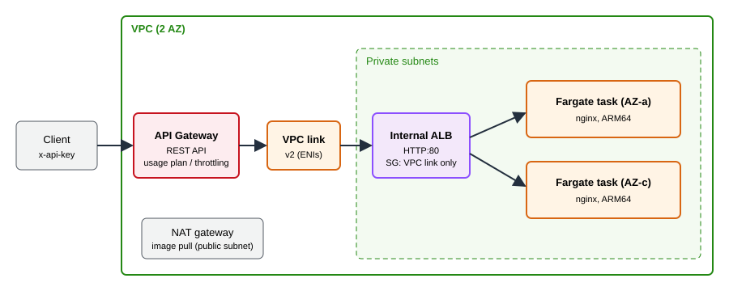

# API Gateway + VPC Link + Private ALB (ECS Fargate) - AWS CDK Reference Architecture

[](./README.ja.md)
[](./README.md)


How to publish a service that lives in a private subnet **only through API Gateway**: a REST API with an API key, a usage plan and throttling, connected through a **VPC link (v2)** straight to the listener of an **internal Application Load Balancer** that fronts ECS Fargate tasks. The ALB has no public address, so the API key and the throttling cannot be bypassed.

```text
client --(x-api-key)--> REST API --VPC link v2--> internal ALB --> Fargate tasks (private subnets)
```

## 📑 Table of Contents

- [Architecture Overview](#️-architecture-overview)
- [Design Decisions & Best Practices](#-design-decisions--best-practices)
- [Well-Architected Alignment](#️-well-architected-alignment)
- [Cost Optimization](#-cost-optimization)
- [Security Considerations](#-security-considerations)
- [Prerequisites](#-prerequisites)
- [Deployment Guide](#-deployment-guide)
- [Operational Check Script](#-operational-check-script)
- [Testing Strategy](#-testing-strategy)
- [Customization](#️-customization)
- [Troubleshooting](#-troubleshooting)
- [Clean-up](#-clean-up)
- [References](#-references)

## 🏗️ Architecture Overview



### Key Components

- **VPC** — 2 AZs, public subnets that hold only the NAT gateway, private subnets for everything else, default security group restricted, rejected-traffic flow logs to CloudWatch Logs.
- **ECS Fargate service** — 2 ARM64 tasks (stock nginx from ECR Public) in private subnets, no public IP, deployment circuit breaker with rollback. The entrypoint writes `{"service":"backend","task":"<hostname>"}` so you can see which task answered.
- **Internal ALB** — `internal` scheme, HTTP:80 listener, invalid header fields dropped. Its security group accepts port 80 **only from the VPC link's security group**; the tasks accept port 80 only from the ALB.
- **VPC link (v2)** — `AWS::ApiGatewayV2::VpcLink` with ENIs in the private subnets and its own security group (egress to the ALB only).
- **REST API** — `ANY /` and `ANY /{proxy+}` as `HTTP_PROXY` integrations over the VPC link, `apiKeyRequired`, one usage plan (rate, burst, daily quota), stage throttling and JSON access logs.
- **`test-api.sh`** — an end-to-end check that exercises every property above against the deployed stack.

## 🎯 Design Decisions & Best Practices

### 1. API Gateway as the only door

The ALB is `internal` and its security group has a single ingress rule: the VPC link's security group. There is no path around the API key and the usage plan, and nothing to forget to lock down later. A public ALB with an "allow API Gateway" rule cannot give that guarantee, because API Gateway has no fixed source addresses.

### 2. VPC link v2 reaches the ALB directly

The classic REST API VPC link (`AWS::ApiGateway::VpcLink`) accepts only a Network Load Balancer, so an ALB backend needed an NLB in front of it. VPC link v2 (`AWS::ApiGatewayV2::VpcLink`, the same resource HTTP APIs use) lets a REST API integration target an ALB without the extra hop. The REST API CDK L2 (`apigateway.VpcLink`) does not model this yet, so the stack sets three properties on the L1 method through `addPropertyOverride`:

| Property | Value |
|---|---|
| `Integration.ConnectionType` | `VPC_LINK` |
| `Integration.ConnectionId` | the v2 VPC link ID |
| `Integration.IntegrationTarget` | the **ALB ARN** (not the listener ARN) |

The integration URI stays a normal `http://<alb-dns>/{proxy}` URL: it supplies the path and the `Host` header, while `IntegrationTarget` decides where the traffic goes.

### 3. A usage plan needs an API key, and the key is not authentication

`apiKeyRequired` plus a usage plan gives per-client throttling and quotas. An API key identifies a caller for metering; it is not a strong credential. For end-user authorization add an authorizer (see [`cognito-apigw-auth`](../cognito-apigw-auth/)).

### 4. Throttling at two levels

Stage-level throttling caps the whole API; the usage plan caps each key. Both come from `EnvParams`, so dev can be strict and production generous without touching the stack.

### 5. HTTP inside the VPC

The ALB listener is plain HTTP because the hop between the VPC link and the ALB never leaves the VPC and a certificate needs a domain. If your policy requires encryption in transit everywhere, add an ACM certificate (private CA or a public name) and an HTTPS listener, and point the integration at `https://`.

### 6. Environment-specific parameters

`parameters/<env>-params.ts` sets the CIDR, NAT gateway count, task count and the usage plan limits.

## 🏛️ Well-Architected Alignment

| Pillar | How this architecture addresses it |
|---|---|
| Operational Excellence | CloudFormation-managed, `test-api.sh` proves the path end to end, access logs for the API, awslogs for the tasks, Container Insights |
| Security | Internal ALB, security-group-to-security-group rules, no public IPs on tasks, API key + usage plan, flow logs for rejected traffic |
| Reliability | 2 AZs, 2 tasks, ALB health checks, circuit breaker with rollback, `minHealthyPercent: 100` |
| Performance Efficiency | ARM64 Fargate, no NLB hop, regional endpoint |
| Cost Optimization | One NAT gateway in dev, small tasks, ARM64, one-week log retention (see below) |
| Sustainability | Graviton (ARM64) tasks, right-sized 0.25 vCPU / 0.5 GiB |

## 💰 Cost Optimization

Approximate monthly cost in `ap-northeast-1` if left running (verify against the pricing pages):

| Item | Approx. |
|---|---|
| NAT gateway (1) | about 45 USD plus data processing |
| Application Load Balancer | about 18 USD plus LCUs |
| Fargate, 2 × (0.25 vCPU, 0.5 GiB, ARM64) | about 18 USD |
| API Gateway REST API | per million requests; negligible for testing |
| VPC link, logs, flow logs | small |

A verification run of about 15 minutes costs a few cents. The NAT gateway exists only so the tasks can pull the public nginx image; with an image in your own ECR repository, VPC endpoints for ECR, S3 and CloudWatch Logs replace it.

## 🔒 Security Considerations

### Implemented

- Internal ALB; ALB, VPC link and task security groups chain to each other, with no CIDR-based ingress.
- Tasks in private subnets without public IPs; VPC default security group restricted.
- Every method requires an API key; usage plan and stage throttling.
- API access logs, rejected-traffic VPC flow logs.

### CDK Nag suppressions (with reasons)

| Rule | Reason |
|---|---|
| AwsSolutions-IAM4 / IAM5 | Managed policies and log/image wildcards that ECS and API Gateway logging require |
| AwsSolutions-ELB2 | Internal ALB reachable only from the VPC link; an access-log bucket is out of scope |
| AwsSolutions-ECS2 | The container environment holds no secrets or environment-specific values |
| AwsSolutions-APIG2 | Pure proxy: the backend validates its own input |
| AwsSolutions-APIG3 | A WAFv2 Web ACL has a fixed monthly cost; key, usage plan and throttling bound abuse here |
| AwsSolutions-APIG4 / COG4 | Callers are identified by API key; add an authorizer for end users |

### Out of scope (add per environment)

AWS WAF on the stage, an authorizer (Cognito or Lambda), HTTPS between the VPC link and the ALB, a custom domain name.

## 📋 Prerequisites

- Node.js 24+, AWS CDK v2, an AWS account with CDK bootstrapped
- `aws`, `curl`, `jq` for `test-api.sh`

## 🚀 Deployment Guide

```bash
export PROJECT=<project> ENV=dev
npm install
npm run stage:deploy:all -w workspaces/apigw-vpclink-private-alb   # about 4 minutes
```

The outputs are the API URL, the API key ID and the (internal) ALB DNS name.

## 🧪 Operational Check Script

`./test-api.sh --project <project> --env <env>` reads the stack outputs, fetches the API key and asserts:

1. no API key returns `403`
2. an API key returns `200` from a Fargate task through the VPC link
3. an unknown path is forwarded and answered `404` by the backend
4. both tasks serve requests
5. the ALB scheme is `internal` and it does not answer from outside the VPC
6. a burst of 60 parallel requests produces `429` responses

Verified on 2026-10-03 in `ap-northeast-1`: all assertions passed.

## 🧪 Testing Strategy

```bash
npm test -w workspaces/apigw-vpclink-private-alb
```

- **Snapshot**: full template and resource counts.
- **Unit**: internal ALB, security-group chain with no CIDR ingress, tasks without public IPs, VPC link placement, every method integrates through the VPC link with the ALB ARN, API key on every method, usage plan and stage throttling.
- **Compliance**: CDK Nag `AwsSolutionsChecks` with the reasons above.

## ⚙️ Customization

| Parameter | Meaning |
|---|---|
| `vpcCidr`, `natGateways` | Network size; one NAT gateway per AZ for production |
| `desiredCount` | Number of tasks |
| `apiRateLimit`, `apiBurstLimit`, `apiDailyQuota` | Stage and usage plan limits |

To use your own application, replace the container image and the health check path in the stack.

## 🔧 Troubleshooting

### `... is not a valid ALB or NLB arn`

`IntegrationTarget` was given the listener ARN. Pass the load balancer ARN.

### `403 Forbidden` with an API key

The key is not attached to the usage plan, or the usage plan has no stage. Both come from the stack; check `aws apigateway get-usage-plan-keys`. `403` also comes back when the daily quota is used up.

### `504` from the API

The VPC link cannot reach the ALB: check that the VPC link's security group has egress to the ALB's and the ALB's has ingress from it. The integration timeout is 10 seconds.

### `test-api.sh` throttling check does not see a `429`

Run it again. Throttling is a token bucket per stage and per key, so a slow machine may not exceed the burst.

## 🧹 Clean-up

```bash
npm run stage:destroy:all -w workspaces/apigw-vpclink-private-alb
```

## 📚 References

- [Private integrations for REST APIs in API Gateway](https://docs.aws.amazon.com/apigateway/latest/developerguide/set-up-private-integration.html)
- [Usage plans and API keys for REST APIs](https://docs.aws.amazon.com/apigateway/latest/developerguide/api-gateway-api-usage-plans.html)
- [AWS::ApiGateway::Method Integration](https://docs.aws.amazon.com/AWSCloudFormation/latest/TemplateReference/aws-properties-apigateway-method-integration.html)
