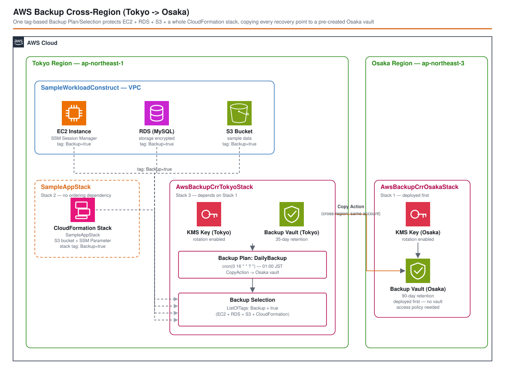

# AWS Backup Cross-Region (Tokyo → Osaka) - AWS CDK Reference Architecture

*Read this in other languages:* [](./README.ja.md) [](./README.md)

> **Level: 300 (Advanced)**

A single AWS Backup Plan, protecting a sample **EC2 instance, RDS database, S3 bucket, and an entire CloudFormation stack** in Tokyo (`ap-northeast-1`) with one tag-based Backup Selection — no separate selection per resource type — and copying every recovery point to a pre-created secondary vault in Osaka (`ap-northeast-3`) for regional disaster recovery.

## 📑 Table of Contents

- [Architecture Overview](#-architecture-overview)
- [Design Decisions & Best Practices](#-design-decisions--best-practices)
- [Cost Optimization](#-cost-optimization)
- [Security Considerations](#-security-considerations)
- [Prerequisites](#-prerequisites)
- [Deployment Guide](#-deployment-guide)
- [Testing Strategy](#-testing-strategy)
- [Customization](#-customization)
- [Troubleshooting](#-troubleshooting)
- [References](#-references)

## 🏗️ Architecture Overview



```text
Stack 1 — AwsBackupCrrOsakaStack (ap-northeast-3, deployed first)
  KMS key + Backup Vault "<project>-<env>-backup-osaka"
    (receives copied recovery points; no vault access policy needed — same account)

Stack 2 — SampleAppStack (ap-northeast-1)
  S3 bucket + SSM Parameter, tagged Backup=true
    stands in for "someone else's CloudFormation stack" — AWS Backup can protect the
    whole stack as a single AWS::CloudFormation::Stack recovery point

Stack 3 — AwsBackupCrrTokyoStack (ap-northeast-1, depends on Stack 1)
  SampleWorkloadConstruct: VPC + EC2 instance + RDS (MySQL) + S3 bucket, all tagged Backup=true
  KMS key + Backup Vault "<project>-<env>-backup-tokyo"
  Backup Plan "DailyBackup" rule (cron, 01:00 JST, 35-day retention)
    CopyAction → Osaka vault ARN (built deterministically), 90-day retention
  Backup Selection: ListOfTags [Backup = true]  (role: AWSBackupServiceRolePolicyForBackup/Restores)
    ─┬─ matches EC2 instance (SampleWorkloadConstruct)
     ├─ matches RDS instance (SampleWorkloadConstruct)
     ├─ matches S3 bucket    (SampleWorkloadConstruct)
     └─ matches CloudFormation stack (SampleAppStack) ─── one plan, four resource types
```

### Key Components

- **`AwsBackupCrrOsakaStack`** – pre-creates the secondary Backup Vault in Osaka with its own KMS key, deployed *before* the Tokyo stack so it already exists when the first copy job runs.
- **`SampleAppStack`** – a minimal, otherwise-unrelated stack (S3 bucket + SSM Parameter) tagged the same way as the Tokyo workload, to demonstrate that AWS Backup can protect a *whole CloudFormation stack* as a single recovery point.
- **`SampleWorkloadConstruct`** (`lib/constructs/`) – a small VPC + EC2 + RDS + S3 "application" in Tokyo, every resource tagged `Backup=true`.
- **`AwsBackupCrrTokyoStack`** – creates the primary vault, the Backup Plan (daily rule + cross-region copy action), the IAM role AWS Backup assumes, and the single tag-based Backup Selection that covers everything above.

### Architecture Characteristics

| Characteristic | Value | Rationale |
|---|---|---|
| Availability | Recovery points survive a full Tokyo regional outage | Every recovery point is copied to Osaka on the same daily schedule |
| Scalability | Adding a new backed-up resource requires zero Backup code changes | Tag-based selection automatically picks up any new EC2/RDS/S3/CloudFormation resource tagged `Backup=true` |
| Security | Both vaults are KMS-encrypted with key rotation enabled; IAM role scoped to AWS Backup's own managed policies | See [Security Considerations](#-security-considerations) |
| Cost | Pay for backup storage in both regions plus cross-region copy transfer | See [Cost Optimization](#-cost-optimization) |

## 🎯 Design Decisions & Best Practices

### 1. One tag-based Backup Selection instead of one selection per resource type

**Decision**: `AwsBackupCrrTokyoStack` declares exactly one `BackupSelection`, using `backup.BackupResource.fromTag(backupTagKey, backupTagValue)` — no separate selection for EC2, RDS, S3, or CloudFormation.

**Rationale**:
- ✅ AWS Backup's tag-based selection is resource-type agnostic: it automatically discovers *every* supported resource type in the account/region carrying the matching tag. One selection genuinely covers all four resource types used here.
- ✅ Onboarding a new resource to the backup plan is a one-line change (`Tags.of(resource).add('Backup', 'true')`) — no CDK changes to the Backup Plan/Selection are ever required.
- ✅ Demonstrates the pattern's core value proposition: a single, central Backup Plan spanning otherwise-unrelated stacks (`SampleAppStack` and `AwsBackupCrrTokyoStack`) and resource types.

**Trade-offs**:
- ❌ Tag-based selection is coarse — anything in the region carrying `Backup=true` is included, even a resource added for an unrelated reason. Resource-ARN-based selections trade that flexibility for precision.
- ❌ Forgetting to tag a resource silently excludes it from backups — there is no CDK-time guard against an untagged resource that should have been covered.

### 2. Deterministic destination vault ARN instead of a cross-region CDK reference

**Decision**: `AwsBackupCrrTokyoStack` builds the Osaka vault's ARN with `this.formatArn({ region: 'ap-northeast-3', ... })` and imports it via `BackupVault.fromBackupVaultArn`, rather than passing `AwsBackupCrrOsakaStack`'s vault construct/output across the stage.

**Rationale**:
- ✅ CloudFormation exports/`Fn::ImportValue` cannot cross regions, so the Osaka vault's `CfnOutput` cannot be `Ref`'d directly from the Tokyo stack — the ARN has to be reconstructed from known, deterministic parts (account, region, vault name) instead.
- ✅ Matches the approach already used by the [ECR Cross-Region Replication](../ecr-cross-region-replication/) pattern in this repository, keeping cross-region wiring conventions consistent across the reference architectures.
- ✅ `AwsBackupCrossRegionStage` still enforces deployment order (`tokyoStack.addDependency(osakaStack)`), so the referenced vault is guaranteed to exist by the time the first copy job runs.

**Trade-offs**:
- ❌ The vault name is a convention shared between the stage and both stacks (`${project}-${environment}-backup-osaka`) rather than a type-checked reference — a manual rename in one place without the other would silently break the copy action at deploy time (CloudFormation would reject the unresolvable vault ARN).

### 3. Independent retention per vault (35 days primary / 90 days secondary)

**Decision**: The primary (Tokyo) vault expires recovery points after 35 days; the copy in the secondary (Osaka) vault is retained for 90 days — configured independently via `primaryRetentionDays` / `copyRetentionDays`.

**Rationale**:
- ✅ Demonstrates that a copy's lifecycle does not have to mirror the source's — a common real-world requirement (e.g., compliance mandates longer retention only in the DR region, or the DR region intentionally keeps a deeper history for slower-to-detect incidents).
- ✅ Cost and retention policy stay independently tunable per region without touching the other vault.

**Trade-offs**:
- ❌ Longer retention in Osaka means the secondary vault accumulates more recovery points (and more storage cost) than the primary over time — see [Cost Optimization](#-cost-optimization).

### 4. Pre-create the secondary vault instead of letting the copy action auto-create it

**Decision**: `AwsBackupCrrOsakaStack` explicitly creates the Osaka vault with its own KMS key, deployed before `AwsBackupCrrTokyoStack`.

**Rationale**:
- ✅ A vault auto-created by a copy action uses AWS Backup's default (AWS-owned) encryption key, not a customer-managed KMS key — pre-creating it is what lets the replica have its own rotating CMK.
- ✅ Same-account cross-region copy needs **no vault access (resource-based) policy** on the destination vault — that is only required for cross-*account* copies. This keeps the Osaka stack minimal.

**Trade-offs**:
- ❌ Three stacks (and a deployment-order dependency) to manage instead of one.

### Well-Architected Framework Alignment

| Pillar | Implementation |
|---|---|
| **Operational Excellence** | Both vault stacks emit `CfnOutput`s (`VaultArnOutput`) for verification; a single tag makes onboarding a new resource to the backup plan a one-line change |
| **Security** | Both vaults are KMS-encrypted with key rotation; the AWS Backup IAM role uses only AWS's own managed service-role policies (no custom wildcard permissions); RDS storage is encrypted |
| **Reliability** | Daily backups copied cross-region protect against a full Tokyo regional outage; `tokyoStack.addDependency(osakaStack)` removes the race between vault creation and the first copy job |
| **Performance Efficiency** | AWS Backup orchestration, scheduling, and cross-region copy are fully managed — no custom polling or orchestration compute |
| **Cost Optimization** | Independent per-vault retention (35d primary / 90d secondary) bounds each region's storage growth separately; see [Cost Optimization](#-cost-optimization) |
| **Sustainability** | No idle compute beyond the sample workload itself (EC2/RDS exist only to have something to back up); AWS Backup's scheduling runs on managed infrastructure |

## 💰 Cost Optimization

### Estimated Monthly Costs (ap-northeast-1 / ap-northeast-3, this reference architecture's sample workload)

```text
Primary (Tokyo) vault storage
  EC2 (EBS 8GB snapshot, 35-day retention):                  ~$0.40
  RDS (20GB backup storage, 35-day retention):                ~$1.90
  S3 (minimal demo data, 35-day retention):                   ~$0.05
  CloudFormation stack recovery points (template-only):       ~$0.00
Secondary (Osaka) vault storage
  Same resources, 90-day retention (~2.6x the recovery points): ~$6.10
Cross-region copy data transfer (incremental, illustrative):  ~$0.50-1.00
Sample workload compute/storage itself (t3.micro EC2 + RDS, NAT Gateway): ~$45-55
-------------------------------------------
Total (Dev, demo usage, incl. sample workload):               ~$55-65/month
Total (AWS Backup vaults/copy only):                          ~$9-10/month
```

*Figures are approximate and illustrative only — AWS Backup storage/copy pricing varies by region and resource type, and changes over time. Always confirm current pricing with the [AWS Pricing Calculator](https://calculator.aws/). The sample EC2/RDS/NAT Gateway workload dominates this demo's total cost — in a real deployment, AWS Backup is added on top of workloads you already run, so its incremental cost is only the backup-storage and copy lines above.*

### Cost Optimization Strategies

1. **Shorter retention in the region you query less often** — this pattern already keeps Tokyo (the operationally "live" vault, likely queried for routine restores) leaner (35 days) than Osaka (90 days, the DR region where deeper history matters more than restore latency).
2. **Tag-based selection avoids over-backing-up** — only resources explicitly tagged `Backup=true` are covered; nothing in the account is backed up "by accident" the way an account-wide/service-wide backup policy might.
3. **`moveToColdStorageAfter`** (not enabled in this reference, but available on `BackupPlanRule`) can move older recovery points to cold storage for further savings on long-retention vaults like Osaka's — evaluate for your own retention profile.

## 🔒 Security Considerations

### Network Security

The sample EC2 instance and RDS database live in private subnets with a security group scoped to VPC-internal traffic only; the EC2 instance is reachable exclusively via SSM Session Manager (no SSH ingress rule). AWS Backup itself communicates over the AWS API, not customer VPC networking — there is no additional inbound network surface introduced by the backup configuration itself.

### Security Best Practices Implemented

- ✅ Both Backup Vaults are encrypted with a dedicated, rotating KMS key (not the AWS-owned default key).
- ✅ The AWS Backup IAM role uses only AWS's own managed policies (`AWSBackupServiceRolePolicyForBackup`, `AWSBackupServiceRolePolicyForRestores`) — no custom wildcard permissions were added.
- ✅ RDS storage is encrypted at rest (`storageEncrypted: true`); credentials use a Secrets Manager-generated password, never a hardcoded one.
- ✅ The EC2 instance requires IMDSv2, uses an encrypted EBS volume, and is reachable only via SSM Session Manager.
- ✅ VPC Flow Logs are enabled to CloudWatch Logs for the sample workload's VPC.
- ✅ Same-account cross-region copy needs no vault access (resource-based) policy — the smaller the policy surface, the smaller the review surface.

### CDK Nag Compliance

All three stacks pass `cdk-nag`'s `AwsSolutionsChecks` with documented suppressions for the sample workload only (not the backup configuration itself) — deletion protection intentionally disabled so the stacks stay destroyable, single-AZ RDS to minimize demo cost, the default MySQL port, and the AWS-managed Backup service-role policies that have no customer-manageable equivalent. See `test/compliance/cdk-nag.test.ts` for the exact rationale behind each.

```bash
npm run test:compliance -w workspaces/aws-backup-cross-region
```

## 📋 Prerequisites

- AWS Account with appropriate permissions
- AWS CLI v2.x installed and configured
- Node.js 20.x or later
- AWS CDK 2.x (`aws-cdk-lib` ^2.265, bundled in this workspace)
- Git

### Required IAM Permissions

The deploying user/role needs permissions to create/manage:
- AWS Backup (vaults, backup plans, backup selections) in both `ap-northeast-1` and `ap-northeast-3`
- EC2 (VPC, instance, security groups), RDS, S3, SSM Parameter Store, KMS, and IAM (role/policy attachment) in `ap-northeast-1`
- CloudFormation (stack deployment) in both regions

## 🚀 Deployment Guide

### 1. Clone and Setup

```bash
cd infrastructure
npm install
```

### 2. Configure Environment Parameters

Edit `parameters/dev-params.ts` if you want a different destination region, backup tag, schedule, or retention values — the defaults back up daily at 01:00 JST, retaining 35 days in Tokyo and 90 days in Osaka.

### 3. Deploy

```bash
export PROJECT_NAME=backup-crr-demo
export ENV=dev
npm run bootstrap -w workspaces/aws-backup-cross-region   # first time only, per account/region
npm run deploy:all -w workspaces/aws-backup-cross-region
```

CDK deploys `AwsBackupCrrOsakaStack` before `AwsBackupCrrTokyoStack` (see [Design Decision 4](#4-pre-create-the-secondary-vault-instead-of-letting-the-copy-action-auto-create-it)); `SampleAppStack` has no ordering dependency on either.

### 4. Verify Deployment

```bash
# Confirm both vaults exist:
aws backup describe-backup-vault --region ap-northeast-1 --backup-vault-name backup-crr-demo-dev-backup-tokyo
aws backup describe-backup-vault --region ap-northeast-3 --backup-vault-name backup-crr-demo-dev-backup-osaka

# Confirm the tag-based selection resolved to the expected resources:
aws backup list-backup-selections --region ap-northeast-1 --backup-plan-id <plan-id-from-Plan-output>

# After the first scheduled run (or an on-demand backup job), confirm recovery points exist in both vaults:
aws backup list-recovery-points-by-backup-vault --region ap-northeast-1 --backup-vault-name backup-crr-demo-dev-backup-tokyo
aws backup list-recovery-points-by-backup-vault --region ap-northeast-3 --backup-vault-name backup-crr-demo-dev-backup-osaka
```

## 🧪 Testing Strategy

### Test Structure

```text
test/
├── snapshot/          # Full CloudFormation template + resource-count snapshots (all 3 stacks)
│   └── snapshot.test.ts
├── unit/               # Fine-grained resource/property/relationship assertions, one file per stack
│   ├── aws-backup-crr-osaka-stack.test.ts
│   ├── aws-backup-crr-tokyo-stack.test.ts
│   └── sample-app-stack.test.ts
└── compliance/         # cdk-nag AwsSolutions checks, one stack per test.each case
    └── cdk-nag.test.ts
```

### 1. Snapshot Tests

**Purpose**: Catch unintended CloudFormation template changes during refactoring.

```bash
npm run test:snapshot -w workspaces/aws-backup-cross-region
npm run test:snapshot:update -w workspaces/aws-backup-cross-region   # after an intentional change
```

### 2. Unit Tests

**Purpose**: Verify each stack produces the expected resources, properties and relationships.

**Test Categories**:
- ✅ Osaka stack: exactly one KMS-encrypted (rotating) vault with the deterministic shared name, exposed as a stack output, no vault access policy
- ✅ Tokyo stack: exactly one primary vault, one backup plan whose daily rule copies into the deterministic Osaka vault ARN with independent retention, one tag-based backup selection scoped to the configured tag, and the sample EC2/RDS/S3 resources all tagged and present
- ✅ SampleApp stack: exactly one S3 bucket and one SSM parameter, no EC2/RDS/Backup resources of its own, and the stack itself carries the backup tag (so it is discoverable as a CloudFormation-stack recovery point)

### 3. Compliance Tests

```bash
npm run test:compliance -w workspaces/aws-backup-cross-region
```

### Run Everything

```bash
npm run build -w workspaces/aws-backup-cross-region
npm test -w workspaces/aws-backup-cross-region
npm run lint -w workspaces/aws-backup-cross-region
```

## ⚙️ Customization

### Change the destination region

```typescript
// parameters/dev-params.ts
awsBackupCrr: {
    destinationRegion: 'us-west-2',   // any other AWS Backup-supported region
    // ...
},
```

### Change the backup schedule or retention

```typescript
// parameters/dev-params.ts
awsBackupCrr: {
    scheduleExpression: 'cron(0 18 * * ? *)',  // 03:00 JST instead of 01:00 JST
    primaryRetentionDays: 14,
    copyRetentionDays: 365,                     // e.g. a compliance-driven long retention in the DR region
    // ...
},
```

### Cover a different set of resources

Change the tag key/value, then tag whatever resources you want protected — no other code changes are required:

```typescript
// parameters/dev-params.ts
awsBackupCrr: {
    backupTagKey: 'DataClassification',
    backupTagValue: 'critical',
    // ...
},
```

```typescript
// anywhere else in your CDK app
cdk.Tags.of(myResource).add('DataClassification', 'critical');
```

## 🔧 Troubleshooting

### Issue: `cdk deploy` fails creating the Tokyo backup plan's copy action

**Symptoms**: `AWS::Backup::BackupPlan` creation/update fails referencing the Osaka vault ARN.

**Solutions**:
1. Confirm `AwsBackupCrrOsakaStack` was deployed successfully first — `AwsBackupCrossRegionStage` declares `tokyoStack.addDependency(osakaStack)`, but a partially failed/rolled-back Osaka deployment can still leave the vault missing.
2. Confirm the vault name matches between stacks: both `AwsBackupCrrOsakaStack.vaultName` and the ARN built in `AwsBackupCrrTokyoStack` derive from the same `${project}-${environment}-backup-osaka` convention (see [Design Decision 2](#2-deterministic-destination-vault-arn-instead-of-a-cross-region-cdk-reference)) — a mismatched `PROJECT_NAME`/`ENV` between deployments will break this.

### Issue: A resource I tagged isn't showing up in backups

**Symptoms**: `aws backup list-recovery-points-by-backup-vault` doesn't include a resource you expect.

**Solutions**:
1. Confirm the tag key/value exactly match `backupTagKey`/`backupTagValue` in `parameters/dev-params.ts` (case-sensitive).
2. Confirm the resource is in the *same region* as the Backup Plan (`ap-northeast-1`) — a Backup Selection only discovers resources in its own region.
3. Confirm the resource type is one AWS Backup supports — see the [AWS Backup feature availability by resource](https://docs.aws.amazon.com/aws-backup/latest/devguide/backup-feature-availability.html) table.
4. The first backup only runs on the next scheduled window (`scheduleExpression`) — trigger an on-demand backup job (`aws backup start-backup-job`) to verify sooner.

### Issue: No recovery points appear in the Osaka vault

**Symptoms**: Tokyo vault has recovery points, but Osaka's `list-recovery-points-by-backup-vault` is empty.

**Solutions**:
1. Copy jobs run *after* the primary backup job completes, not in parallel — check `aws backup list-copy-jobs --region ap-northeast-1` for its status.
2. Confirm the IAM role passed to the Backup Selection (`AWSBackupServiceRolePolicyForBackup`) is still attached — removing it manually outside CDK breaks copy jobs silently until the next `cdk deploy`.

## 📚 References

### AWS Documentation
- [AWS Backup Developer Guide](https://docs.aws.amazon.com/aws-backup/latest/devguide/whatisbackup.html)
- [Creating a backup plan](https://docs.aws.amazon.com/aws-backup/latest/devguide/creating-a-backup-plan.html)
- [Backup copy jobs (cross-Region)](https://docs.aws.amazon.com/aws-backup/latest/devguide/copy-backups.html)
- [AWS Backup feature availability by resource](https://docs.aws.amazon.com/aws-backup/latest/devguide/backup-feature-availability.html)
- [Protecting an AWS CloudFormation stack](https://docs.aws.amazon.com/aws-backup/latest/devguide/cfn-stacks.html)

### AWS Well-Architected
- [AWS Well-Architected Framework](https://aws.amazon.com/architecture/well-architected/)
- [Reliability Pillar — Backup and disaster recovery](https://docs.aws.amazon.com/wellarchitected/latest/reliability-pillar/backup-and-restore.html)

### AWS CDK
- [aws-cdk-lib.aws_backup module](https://docs.aws.amazon.com/cdk/api/v2/docs/aws-cdk-lib.aws_backup-readme.html)
- [CDK Best Practices](https://docs.aws.amazon.com/cdk/v2/guide/best-practices.html)

### Related Architectures
- [ecr-cross-region-replication](../ecr-cross-region-replication/) – the same Tokyo→Osaka cross-region convention (deterministic naming, deploy-destination-first), applied to ECR image replication instead of backup/restore
- [ecs-fargate-alb](../ecs-fargate-alb/) / [ec2-advanced](../ec2-advanced/) – compute patterns this pattern's sample EC2/RDS workload could be swapped for

## 📄 License

This project is licensed under the MIT License - see the [LICENSE](../../LICENSE) file for details.

## 👥 Contributing

Contributions are welcome! Please read [CONTRIBUTING.md](../../CONTRIBUTING.md) for details.

## 🏆 About This Reference Architecture

This reference architecture demonstrates AWS CDK best practices for building production-ready infrastructure.

**Target Level**: 300 (Advanced)

---

**Note**: This is a reference implementation. Always review and customize according to your specific requirements and organizational policies before deploying to production.
