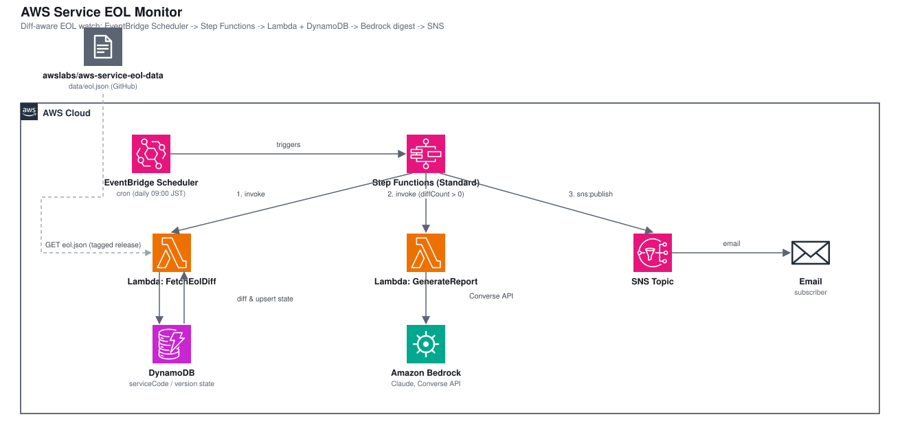

# AWS Service EOL Monitor — Serverless EOL Watch with a Bedrock Digest

*Read this in other languages:* [](./README.ja.md) [](./README.md)


## Introduction

This project watches [`awslabs/aws-service-eol-data`](https://github.com/awslabs/aws-service-eol-data) — a machine-readable JSON dataset of AWS service/version end-of-life (EOL) dates (EKS, RDS engines, Lambda runtimes, ElastiCache, OpenSearch, and more) — for changes, and turns any change into a prioritized digest sent by email. It is a serverless pipeline built from EventBridge Scheduler, Step Functions, Lambda, DynamoDB, Amazon Bedrock, and SNS.

This architecture demonstrates:

- A scheduled Step Functions (Standard) workflow that fetches the dataset, diffs it against state stored in DynamoDB, and only continues when something actually changed
- A diff model (`NEW`, `STATUS_CHANGED`, `UPCOMING_EOL`) that reports each change once instead of re-notifying everything on every run
- Amazon Bedrock (`ConverseCommand`) turning the structured diff into a prioritized, readable digest in Japanese or English
- Delivery through Step Functions' native `SnsPublish` task, with no extra Lambda for notification
- Environment-specific parameters (`parameters/dev-params.ts`) for the dataset URL, threshold, schedule, model, locale, and recipients
- Deploy-verified end to end on 2026-09-27; see [Deploy verification](#-deploy-verification)

> The dataset's own README states it is **"NOT AN OFFICIAL AWS API. This is a community-maintained dataset provided on a best-effort basis"** with **"no guarantee of completeness, accuracy, or timeliness of updates."** Every entry's `sourceUrl` links to the official AWS documentation for independent verification — that page, not this dataset or the digest, is the source of truth for any decision.

## 📑 Table of Contents

- [Architecture Overview](#️-architecture-overview)
- [Design Decisions & Best Practices](#-design-decisions--best-practices)
- [Cost Optimization](#-cost-optimization)
- [Security Considerations](#-security-considerations)
- [Prerequisites](#-prerequisites)
- [Deployment Guide](#-deployment-guide)
- [Testing Strategy](#-testing-strategy)
- [Customization](#️-customization)
- [Deploy verification](#-deploy-verification)
- [Troubleshooting](#-troubleshooting)
- [References](#-references)

## 🏗️ Architecture Overview



### Key Components

| Component | Role |
|---|---|
| **Data stack** — DynamoDB table (`TableV2`) | Diff state store. On-demand billing, PITR enabled. `PK serviceCode` / `SK version` with `status`, `standardSupportEnd`, `notifiedUpcoming`, `lastCheckedAt`. |
| `FetchEolDiffFunction` (Node.js 22, arm64) | Fetches `eol.json` with plain `fetch()`, scans the state table, computes the diff, and upserts the new state. 30 s timeout, 256 MB. |
| `GenerateReportFunction` (Node.js 22, arm64) | Calls Bedrock's `ConverseCommand` with the diff and a locale-aware prompt; returns `{ subject, body }`. 60 s timeout, 256 MB. |
| Step Functions state machine (Standard, JSONPath) | `FetchEolDiff` → `HasDiff` (Choice on `diffCount > 0`) → `GenerateReport` → `PublishReport`; `NoChangesDetected` ends the no-diff branch. Logs `ALL` with X-Ray tracing. |
| EventBridge Scheduler schedule | cron expression plus IANA time zone that starts the state machine. |
| SNS topic | One email subscription per `notification.emails` entry. |

### Data Flow

1. EventBridge Scheduler starts the state machine on the cron schedule.
2. `FetchEolDiff` downloads `eol.json`, compares every `(serviceCode, version)` pair with the DynamoDB state, and writes the new state.
3. `HasDiff` ends the execution when `diffCount` is 0; otherwise `GenerateReport` asks Bedrock for a prioritized Markdown digest.
4. `PublishReport` publishes the digest to the SNS topic, which emails the subscribers.

### Architecture Characteristics

| Characteristic | Value | Rationale |
|---|---|---|
| Availability | Regional, fully managed services | No servers or VPC to operate; a failed run is visible in the Step Functions execution history and the next scheduled run starts from the stored state |
| Scalability | Sized for one dataset fetch per schedule tick | The dataset has ~13 services today; the Lambda and DynamoDB limits are far above that |
| Security | IAM least privilege, no secrets, no VPC | Only public data is read; see [Security Considerations](#-security-considerations) |
| Cost | Pay-per-use; Bedrock only on runs with a diff | See [Cost Optimization](#-cost-optimization) |

## 🎯 Design Decisions & Best Practices

### 1. Diff against stored state instead of re-notifying everything

**Decision**: A DynamoDB table remembers the last-seen status of every `(serviceCode, version)` pair, so each run reports only what is actually new.

**Rationale**:
- ✅ A "fetch and re-notify everything on every run" design trains readers to ignore the digest
- ✅ `UPCOMING_EOL` is flagged once per version (`notifiedUpcoming`), so a date sitting inside the window does not page on every run
- ✅ The Choice state skips Bedrock and SNS entirely on a no-diff run

**Trade-offs**:
- ❌ State must be stored and kept consistent (PITR is enabled on the table)
- ❌ The first run reports every tracked version as `NEW` — expected, and only once

| Diff type | Fires when |
| --- | --- |
| `NEW` | A version is tracked for the first time |
| `STATUS_CHANGED` | `status` transitions, e.g. `STANDARD_SUPPORT` → `DEPRECATED` |
| `UPCOMING_EOL` | `standardSupportEnd` newly falls inside `collector.upcomingThresholdDays` and has not already been flagged |

### 2. Bedrock for the digest, with the diff as the only source of facts

**Decision**: A Lambda formats nothing itself; it passes the diff JSON to Bedrock and asks for a prioritized narrative (urgent vs. informational, in the requested language).

**Rationale**:
- ✅ Turns structured EOL facts into something non-experts can act on without hand-writing that prioritization logic
- ✅ The prompt passes the diff JSON as the only source of facts and explicitly instructs the model not to invent migration steps (`src/lambda/generate-report/index.ts`)

**Trade-offs**:
- ❌ A fixed-template email with zero LLM calls is cheaper and fully deterministic, and is the right choice for many teams
- ❌ A model ID is just a string at synth time; a wrong ID is only found by a real Bedrock call (see [Deploy verification](#-deploy-verification))

### 3. Native `SnsPublish` task instead of a notification Lambda

**Decision**: The state machine publishes to SNS with the native Step Functions integration.

**Rationale**:
- ✅ One fewer function to build, secure, and monitor
- ✅ The state machine role gets only `sns:Publish` on this topic (`topic.grantPublish`)

### 4. Parameter-driven configuration, with the dataset URL pinned for production

**Decision**: Everything environment-specific lives in `parameters/dev-params.ts` (`EnvParams`).

| Key | Meaning |
| --- | --- |
| `collector.datasetUrl` | Raw URL of the dataset's `data/eol.json`. Pinned to `main` in the sample — pin to a tag/commit for production so an upstream schema change cannot silently break the parser. |
| `collector.upcomingThresholdDays` | A version's `standardSupportEnd` inside this many days counts as `UPCOMING_EOL`. |
| `schedule.scheduleExpression` / `scheduleTimeZone` | EventBridge Scheduler cron + IANA time zone. |
| `report.bedrockModelId` | Bedrock model ID or cross-region inference profile ID (must be enabled for the account/region). |
| `report.locale` | `'ja'` or `'en'` — controls both the Bedrock prompt and the SNS subject line. |
| `notification.emails` | SNS email subscribers. Replace the placeholder before deploying. |

### 5. IAM for Bedrock covers both foundation-model and inference-profile ARNs

**Decision**: `bedrock:InvokeModel` is granted on `foundation-model/*` and on this account's `inference-profile/*`.

**Rationale**: A cross-region inference profile routes to foundation models in multiple Regions, so both ARN shapes must be grantable.

### 6. Well-Architected Framework Alignment

| Pillar | Implementation |
|--------|---------------|
| **Operational Excellence** | State machine logs at level `ALL` plus X-Ray tracing; one-month retention log groups for each Lambda and the state machine |
| **Security** | Least-privilege grants (table read/write, `sns:Publish` on one topic, scoped `bedrock:InvokeModel`); no secrets, no VPC; the prompt restricts the model to the supplied diff |
| **Reliability** | Fully managed services; the state table (PITR on) makes each run idempotent with respect to what was already reported |
| **Performance Efficiency** | arm64 Lambdas; Bedrock is only called when there is a diff |
| **Cost Optimization** | Pay-per-use services; the dominant cost (Bedrock tokens) is incurred only on runs with a diff |
| **Sustainability** | Serverless, event-driven execution with no idle compute |

## 💰 Cost Optimization

### Estimated Monthly Costs (ap-northeast-1, one scheduled run per day)

```text
Lambda (2 short invocations/run):        within the free tier at this cadence
Step Functions (Standard, few transitions/run): within the free tier at this cadence
EventBridge Scheduler (1 schedule):      within the free tier at this cadence
DynamoDB (on-demand, ~125 items):        negligible
SNS (email):                             within the free tier at this cadence
Bedrock (Converse, runs with a diff):    dominant cost
```

Bedrock is billed per input/output token and only on runs that found a diff. A worked example, with assumptions you should replace:

```text
Per digest run = input_tokens × input_price + output_tokens × output_price
               = 3,000 × $3 / 1M  +  1,500 × $15 / 1M
               ≈ $0.009 + $0.0225 = ~$0.03
Worst case (a diff on every daily run): 30 × ~$0.03 = ~$0.95 / month
```

The token counts are illustrative assumptions, and $3 / $15 per million tokens is the Claude Sonnet list price; check the current price of the inference profile you configure (`report.bedrockModelId`). The first run reports every tracked version as `NEW`, so its prompt is larger than a typical run. No pre-built estimate is linked here; build one in the [AWS Pricing Calculator](https://calculator.aws/#/estimate) for your model, Region, and schedule.

### Cost Optimization Strategies

1. **Run less often** — `schedule.scheduleExpression`: a weekly cron cuts the worst-case Bedrock cost to about one seventh of the daily figure.
2. **Skip Bedrock on no-diff runs** — already built in: the `HasDiff` Choice ends the execution before `GenerateReport`.
3. **Use a smaller model** — `report.bedrockModelId`: the digest is a short summarization task; a smaller Claude model lowers the per-token price.
4. **Replace the LLM with a template** — if deterministic output is enough, format the diff in a Lambda and drop Bedrock entirely.

## 🔒 Security Considerations

### Network Security

1. **No VPC, no inbound traffic** — the Lambdas make outbound HTTPS calls only (the dataset on `raw.githubusercontent.com`, Bedrock, DynamoDB).
2. **Untrusted input is treated as data** — the dataset is community-maintained; the prompt passes the diff JSON as the only source of facts and instructs the model not to invent migration steps.

### Security Best Practices Implemented

- ✅ `FetchEolDiffFunction` has read/write access to the one state table only (`grantReadWriteData`)
- ✅ `GenerateReportFunction` can only call `bedrock:InvokeModel` on foundation models and this account's inference profiles
- ✅ The state machine role can only publish to the one SNS topic
- ✅ No credentials or API keys are stored; Bedrock is accessed with the Lambda execution role
- ✅ DynamoDB point-in-time recovery enabled; log groups with one-month retention
- ✅ Step Functions execution data is logged (`includeExecutionData: true`) — the data is public EOL information, but review this setting before adding any sensitive field

### CDK Nag Compliance

This workspace has no `test/compliance` suite yet; add one following the other workspaces' `cdk-nag.test.ts` before using it as a production baseline.

## 📋 Prerequisites

- AWS account with permission to deploy CloudFormation, Lambda, Step Functions, DynamoDB, SNS, EventBridge Scheduler, and IAM resources
- AWS CLI v2 configured with a profile named `<project>-<env>`
- Node.js 20 or later, AWS CDK 2.x
- Amazon Bedrock model access for the model/profile in `report.bedrockModelId`, in the target Region (Bedrock console → Model access)
- An email address that can confirm the SNS subscription

## 🚀 Deployment Guide

### 1. Setup

```sh
# from infrastructure/workspaces/aws-eol-monitor
npm install
```

### 2. Configure Environment Parameters

Edit `parameters/dev-params.ts`:

1. A real `notification.emails` address.
2. A `bedrockModelId` your account has model access to.
3. `collector.datasetUrl` pinned to a [tagged release](https://github.com/awslabs/aws-service-eol-data/tags) instead of `main`, per the dataset's own recommendation.

### 3. Deploy

```sh
PROJECT=myproj ENV=dev npm run bootstrap   # once per account/region
PROJECT=myproj ENV=dev npm run deploy:all
```

Confirm the SNS email subscription from the confirmation email after the first deploy — no digest is delivered until you do.

### 4. Verify Deployment

The schedule fires automatically. To test on demand, start an execution of the `<project>-<env>-eol-monitor` state machine from the Step Functions console (no input required), or:

```sh
aws stepfunctions start-execution --state-machine-arn <state-machine-arn>
```

The first run reports every currently tracked version as `NEW`; this is expected and happens once.

### Clean-up

```sh
PROJECT=myproj ENV=dev npm run destroy:all
```

The DynamoDB table's `RemovalPolicy` follows `isAutoDeleteObject` (destroy in non-production environments, retain otherwise) — check the stack before destroying in an environment where `ENV=prd`.

## 🧪 Testing Strategy

### Test Structure

```text
test/
├── parameters/        # test parameters
└── unit/              # fine-grained assertions on both stacks
    └── aws-eol-monitor.test.ts
```

### Unit Tests

**Purpose**: Assert the resource shape of both stacks (6 tests).

- ✅ Data stack: a single DynamoDB table with PITR enabled and the expected key schema (1 test)
- ✅ Application stack: two Lambda functions; an SNS topic with an email subscription; a Standard state machine; an EventBridge Scheduler schedule targeting it; the Bedrock `InvokeModel` grant (5 tests)

```bash
npm test -w workspaces/aws-eol-monitor
```

Snapshot, compliance (`cdk-nag`), and integration suites do not exist for this workspace yet.

## ⚙️ Customization

### Switch the digest language

```typescript
report: { bedrockModelId: 'jp.anthropic.claude-sonnet-4-6', locale: 'en' }, // 'ja' | 'en'
```

### Change the schedule or the "upcoming" window

```typescript
schedule: { scheduleExpression: 'cron(0 9 ? * MON *)', scheduleTimeZone: cdk.TimeZone.ASIA_TOKYO }, // weekly
collector: { upcomingThresholdDays: 90, /* ... */ },
```

### Add Slack/Teams delivery

Subscribe AWS Chatbot to the SNS topic, the same way the `budgets-cost-anomaly-detection` workspace does.

### Add a production parameter set

Only a `dev` parameter set exists. Add `parameters/prd-params.ts`, register it in `parameters/index.ts`, and pin `collector.datasetUrl` to a tag.

## ✅ Deploy verification

Deployed to a real account (`ap-northeast-1`) and run end to end on 2026-09-27, then torn down. What was checked:

- `cdk deploy '**'` created both stacks cleanly (Data: the DynamoDB table; Application: both Lambdas, the Standard state machine, the SNS topic, the EventBridge Scheduler schedule).
- The state machine was started manually (`aws stepfunctions start-execution`, no input) and its execution history showed all three tasks run in order and succeed: `FetchEolDiff` → `HasDiff` (took the "has diff" branch, since a first run reports every tracked version as `NEW`) → `GenerateReport` → `PublishReport`.
- `GenerateReport`'s CloudWatch Logs confirmed a real ~22 s Bedrock `ConverseCommand` call with no errors.
- `PublishReport` (Step Functions' native SNS integration) returned a real `MessageId` with HTTP 200 from `sns:Publish`.
- The DynamoDB state table held 125 items after the run (one per tracked `(serviceCode, version)` pair), confirming the diff/state-write logic.
- **Bug found and fixed by this deploy**: `report.bedrockModelId` in `parameters/dev-params.ts` was `apac.anthropic.claude-sonnet-4-5-20250929-v1:0`. This inference profile ID does not exist (confirmed via `aws bedrock list-inference-profiles`, and a direct `bedrock-runtime converse` call against it fails). `cdk synth` and the unit tests cannot catch this class of bug because the model ID is just a string; only a real Bedrock call surfaces it. It is now `jp.anthropic.claude-sonnet-4-6`, listed and confirmed callable in this account/Region.
- Email delivery was **not** verified: `notification.emails` was left at its placeholder (`dev-team@example.com`), so no confirmation link exists to accept. The successful `sns:Publish` confirms the pipeline reaches SNS; replace the placeholder with a real, confirmable address before relying on it.
- Not covered: the `STATUS_CHANGED` and `UPCOMING_EOL` diff types (the live dataset only produced `NEW` entries on this run), the EventBridge Scheduler actually firing on its cron (only a manual `start-execution` was used), and the `NoChangesDetected` branch.

## 🔧 Troubleshooting

### Issue: `GenerateReport` fails calling Bedrock

**Symptoms**: The execution fails at `GenerateReport` with a validation or access error.

**Solutions**:
1. Confirm the ID in `report.bedrockModelId` exists in this Region and that model access is enabled for it.
2. For an inference profile, the account must be able to call it; check the ID against the list.

```bash
aws bedrock list-inference-profiles --region ap-northeast-1
aws bedrock-runtime converse --model-id <bedrockModelId> \
  --messages '[{"role":"user","content":[{"text":"ping"}]}]' --region ap-northeast-1
```

### Issue: The digest never arrives

**Symptoms**: `PublishReport` succeeds but no email is received.

**Solutions**:
1. Confirm the subscription from the confirmation email — an unconfirmed subscription receives nothing.
2. Replace the placeholder `notification.emails` entry with a real address.

### Issue: The first run reports every version as `NEW`

**Symptoms**: A very large first digest.

**Solutions**: Expected. The state table is empty on the first run; later runs report only changes.

### Issue: The parser breaks after an upstream change

**Symptoms**: `FetchEolDiff` fails after the dataset's schema changes.

**Solutions**: Pin `collector.datasetUrl` to a tagged release instead of `main`.

## 📚 References

### AWS Documentation

- [AWS Step Functions](https://docs.aws.amazon.com/step-functions/latest/dg/welcome.html)
- [Amazon EventBridge Scheduler](https://docs.aws.amazon.com/scheduler/latest/UserGuide/what-is-scheduler.html)
- [Amazon Bedrock Converse API](https://docs.aws.amazon.com/bedrock/latest/userguide/conversation-inference.html)
- [Amazon Bedrock inference profiles](https://docs.aws.amazon.com/bedrock/latest/userguide/inference-profiles.html)
- [Amazon SNS](https://docs.aws.amazon.com/sns/latest/dg/welcome.html)

### AWS Well-Architected

- [AWS Well-Architected Framework](https://docs.aws.amazon.com/wellarchitected/latest/framework/welcome.html)

### AWS CDK

- [AWS CDK API Reference](https://docs.aws.amazon.com/cdk/api/v2/)

### Data Source

- [`awslabs/aws-service-eol-data`](https://github.com/awslabs/aws-service-eol-data) — the community-maintained EOL dataset this pipeline reads

### Related Architectures

- [`budgets-cost-anomaly-detection`](../budgets-cost-anomaly-detection/) — the AWS Chatbot (Slack/Teams) delivery pattern referenced above

## 📄 License

This project is licensed under the Apache License, Version 2.0 - see the [LICENSE](../../../LICENSE) file for details.

## 👥 Contributing

Contributions are welcome! See the [Contribution Guide](../../../docs/contribution/CONTRIBUTING.md).

## 🏆 About This Reference Architecture

This reference architecture demonstrates AWS CDK best practices for building a scheduled, serverless change-detection and notification pipeline.

**Target Level**: 200 (Intermediate)

---

**Note**: This is a reference implementation. Always review and customize according to your specific requirements and organizational policies before deploying to production.
