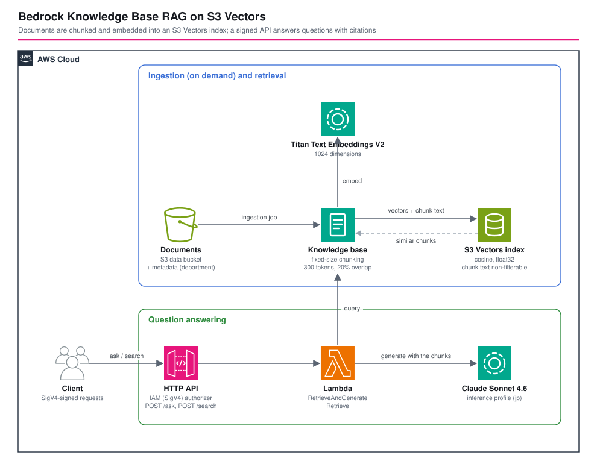

# Amazon S3 Vectors を使う Bedrock Knowledge Base RAG - AWS CDK リファレンスアーキテクチャ

[](./README.ja.md)
[](./README.md)


**Amazon Bedrock Knowledge Bases** と、ベクトルストアの **Amazon S3 Vectors** で作る、**RAG(検索拡張生成)** の質問応答 API です。S3 のドキュメントを取り込みジョブがチャンク分割して埋め込みにし、SigV4 署名付きの HTTP API が **引用** 付きで回答します。**メタデータによる絞り込み**、セッション ID による **会話の継続**、そしてモデルに渡す内容を確認して調整するための **検索だけのエンドポイント** も備えます。埋め込みのパイプラインを自分で作る [`dynamodb-vector-search-semantic-api`](../dynamodb-vector-search-semantic-api/) の、マネージド版にあたります。

| エンドポイント | 動作 |
|---|---|
| `POST /ask` | `RetrieveAndGenerate`。最適なチャンクを検索し、Claude にそれだけを根拠に回答させ、回答、引用したチャンク、`sessionId` を返す |
| `POST /search` | `Retrieve`。生成せずに、スコアとメタデータ付きでチャンクを返す |

リクエストボディ: `{"question": "...", "filter": "finance", "sessionId": "...", "maxResults": 4}`(必須は `question` だけ)。

## 📑 目次

- [アーキテクチャ概要](#️-アーキテクチャ概要)
- [設計判断とベストプラクティス](#-設計判断とベストプラクティス)
- [Well-Architected との対応](#️-well-architected-との対応)
- [コスト最適化](#-コスト最適化)
- [セキュリティ上の考慮事項](#-セキュリティ上の考慮事項)
- [前提条件](#-前提条件)
- [デプロイ手順](#-デプロイ手順)
- [動作確認スクリプト](#-動作確認スクリプト)
- [テスト戦略](#-テスト戦略)
- [カスタマイズ](#️-カスタマイズ)
- [トラブルシューティング](#-トラブルシューティング)
- [クリーンアップ](#-クリーンアップ)
- [参考資料](#-参考資料)

## 🏗️ アーキテクチャ概要



### 主要コンポーネント

- **データバケット**: ソースドキュメント用の、プライベートで TLS 必須の S3 バケットです。`sample-docs/` には架空の会社の短い規程6つがあり、それぞれに `department` を設定する `.metadata.json` が付きます。
- **S3 Vectors のバケットとインデックス**: float32、コサイン、1024次元。Bedrock がベクトルごとに書き込む2つのキー(`AMAZON_BEDROCK_TEXT`、`AMAZON_BEDROCK_METADATA`)は **フィルタ不可** と宣言します。
- **ナレッジベース**: Titan Text Embeddings V2(1024次元)、`S3_VECTORS` のストレージ、このアカウントのナレッジベースに限って Bedrock が引き受けられるサービスロール。
- **データソース**: データバケット、固定サイズのチャンク分割(既定は300トークン、重複20%)、開発環境ではデータソースの削除時にインデックスしたデータも削除。
- **HTTP API と Lambda**(Node.js 24、ARM64): 両ルートに IAM 認可、ステージのスロットリング、アクセスログ。関数は入力を検証し、ナレッジベースを呼んで、レスポンスを整えます。
- **`test-rag.sh`**: サンプルドキュメントを取り込み、署名付きの API で質問します。

## 🎯 設計判断とベストプラクティス

### 1. ベクトルストアに S3 Vectors を使う

OpenSearch Serverless には最小容量のコレクションが必要で、使っていない間も課金されます。S3 Vectors はストレージ、リクエスト、検索したデータ量に課金されるので、誰も質問しない間はほとんど費用がかかりません。代償として、機能は少なく(ハイブリッドのキーワード検索なし、絞り込みの記述は小さい、メタデータのサイズ制限あり)、メモリ上のインデックスより検索のレイテンシが大きくなります。社内ドキュメントのナレッジベースに毎分数回質問する程度なら、よい取引です。

### 2. チャンクのテキストはフィルタ不可にしておく。さもないと長いチャンクが失敗する

S3 Vectors は、ベクトルごとの **フィルタ可能な** メタデータを 2 KB に制限しています。Bedrock はチャンクのテキストと自身のメタデータを `AMAZON_BEDROCK_TEXT` と `AMAZON_BEDROCK_METADATA` に保存します。これらがフィルタ可能として数えられると、2 KB を超えるチャンクで取り込みが壊れます。このインデックスは両方を `nonFilterableMetadataKeys` に宣言しています。自分のドキュメントのメタデータ(ここでは `department`)はフィルタ可能なままです。

### 3. メタデータによる絞り込みは、UI の機能ではなく、自分で強制するアクセス制御

各ドキュメントは `department` を持ちます。API は `filter` を検索の `equals` フィルタに変換するので、絞り込んだ質問は他の部門のチャンクを見ません。確認スクリプトは、財務の質問を `filter=infrastructure` で投げ、`/search` からインフラのチャンクだけが返り、財務の回答が作られないことを確認します。ただし、このフィルタは **呼び出し元が指定します**。API を呼べる人は、省略もできます。部門間でドキュメントを読ませたくない場合は、リクエストボディから受け取るのではなく、呼び出し元の身元(たとえば Cognito のグループクレームや IAM プリンシパル)からフィルタを決めてください。

### 4. 引用と、検索だけのエンドポイント

`/ask` は、回答の根拠にしたチャンクを S3 のソース付きで返します。`/search` は、生成せずにスコア付きでチャンクを返します。回答がおかしいときは、まず `/search` を呼びます。正しいチャンクが結果になければ、原因はチャンク分割、埋め込み、絞り込みです。あれば、原因はプロンプトかモデルです。

### 5. ドキュメントを根拠に答えるよう指示し、答えられないときはそう言わせる

ドキュメントにない質問(「来客用 Wi-Fi のパスワードは?」)は、「回答が見つかりませんでした…検索結果に情報が含まれていません」と断られます。これはナレッジベースの既定のプロンプトの動作で、確認スクリプトが検証しています。もっと厳密にするなら、コンテキストのグラウンディングチェックを持つ Bedrock Guardrail を加えてください。

### 6. セッション ID で会話を続ける

`/ask` は `sessionId` を返します。これを送り返すと、「では30万円なら?」という追加の質問の「それ」が、前の回の返金のことだと解決されます。セッションは Bedrock が持ち、API 自体はステートレスのままです。

### 7. API のロールは読めるが、管理はできない

関数は `Retrieve`、`RetrieveAndGenerate`、そして1つの生成モデルとその推論プロファイルの呼び出しだけができます。取り込みの開始、ナレッジベースの変更、S3 へのアクセスはできず、テストがそれを確認しています。取り込みは運用者の操作です(`test-rag.sh` か `aws bedrock-agent start-ingestion-job`)。

### 8. モデルには、リージョンをまたぐ推論プロファイルを使う

生成モデルは、日本国内で振り分ける `jp.` の推論プロファイル経由で呼びます。呼び出しの権限は、プロファイルと、振り分け先のすべてのリージョンにある元の基盤モデルを対象にします。

### 9. チャンク分割はパラメータだが、サンプルは小さすぎて違いが見えない

`chunking.maxTokens` と `overlapPercentage` で、ドキュメントの分け方を制御します。サンプルのドキュメントはすべて300トークンより短いので、それぞれ1チャンクになります(ベクトルは合計6つ)。チャンク分割の効果が見えるのは、実際のドキュメントを使ったときです。小さいチャンクは検索が精密になりベクトルが増え、大きいチャンクは文脈を多く持ちます。自分の質問で `/search` を使って測ってください。

### 10. 環境別パラメータ

`parameters/<env>-params.ts` で、埋め込みモデルとその次元、生成に使う推論プロファイル、チャンク分割、検索するチャンク数、絞り込みに使う属性、スロットリングを設定します。

## 🏛️ Well-Architected との対応

| 柱 | この構成での対応 |
|---|---|
| 運用上の優秀性 | `test-rag.sh` が取り込みと回答の質を通しで確認、`/search` で検索を検査可能に、CloudFormation 管理 |
| セキュリティ | IAM(SigV4)認可、最小権限の関数ロール、このアカウントとそのナレッジベースに限定したサービスロール、プライベートで TLS 必須のバケット、入力の検証 |
| 信頼性 | マネージドの取り込み、ベクトルストア、モデル。入力の上限(質問の長さ、結果数)、スロットリングしたステージ |
| パフォーマンス効率 | 検索は約0.5秒、回答は約1.8秒を実測。結果数とチャンクサイズはパラメータ |
| コスト最適化 | 常時動くベクトルクラスターなし。リクエストとトークンの従量課金(下記) |
| 持続可能性 | 使っていない間は費用も消費もないサーバーレスの構成要素 |

## 💰 コスト最適化

`ap-northeast-1` の概算です(料金ページで確認してください)。

| 項目 | 目安 |
|---|---|
| S3 Vectors | ストレージ、書き込み、検索の料金。数千ベクトルなら数セント |
| Titan Text Embeddings V2 | 取り込み時と検索時の入力トークンの従量課金。サンプルなら1セント未満 |
| Claude Sonnet 4.6 | `/ask` ごとの入力と出力のトークン。このコンテキストの大きさなら、100回の質問で数セント |
| HTTP API、Lambda、ログ | リクエスト単位。検証では無視できる額 |

約30分の検証は数セントでした。常時動く構成要素がないのが、このワークロードで OpenSearch Serverless ではなく S3 Vectors を選ぶ理由です。

## 🔒 セキュリティ上の考慮事項

### 実装済み

- 両ルートで IAM(SigV4)認可が必須で、署名のないリクエストは 403 で拒否されます。
- 関数のロールは、検索、回答、1つの生成モデルの呼び出しだけができます。取り込み、S3、ナレッジベースの変更はできません。
- サービスロールは、このアカウントとそのナレッジベースに限って `bedrock.amazonaws.com` が引き受けられ、データバケットは `aws:ResourceAccount` の条件付きで読みます。
- 入力を検証します。質問の長さ、結果数、単純な値のフィルタ、文字列のセッション ID。
- データバケットはプライベートで TLS 必須、暗号化済み。ステージはスロットリングします。

### CDK Nag の抑制(理由付き)

| ルール | 理由 |
|---|---|
| AwsSolutions-S1 | データバケットはリファレンスのソースドキュメントを置くだけで、サーバーアクセスログには別のバケットが要る |
| AwsSolutions-IAM4 | Lambda のログ出力と S3 の自動削除プロバイダーの、AWS マネージドポリシー |
| AwsSolutions-IAM5 | `bedrock:RetrieveAndGenerate` にはリソースレベルの指定がない。オブジェクトのワイルドカードはバケットのドキュメント、モデルのワイルドカードは推論プロファイルが振り分けるリージョン |
| AwsSolutions-L1 | 作成時点でサポートされる最新の Node.js。自動削除プロバイダーは CDK が管理する |
| AwsSolutions-APIG1 / APIG4 | アクセスログと IAM 認可は設定済みで、ルールが HTTP API v2 の形式を認識しない |

### スコープ外(環境ごとに追加)

呼び出し元の身元からのフィルタ決定(設計判断3を参照)、Bedrock Guardrail、WAF、独自ドメイン、お客様管理の CMK によるベクトルバケットの暗号化、ドキュメントが変わる場合の定期的な取り込み。

## 📋 前提条件

- Node.js 24 以上、AWS CDK v2、CDK ブートストラップ済みの AWS アカウント
- リージョンで Titan Text Embeddings V2 と生成モデルのモデルアクセスがあること(推論プロファイル ID での `aws bedrock-runtime converse` が簡単な確認方法です)
- そのリージョンで Amazon S3 Vectors が使えること
- `test-rag.sh` 用の `aws`、`curl`(`--aws-sigv4` のため 7.75 以上)、`jq`

## 🚀 デプロイ手順

```bash
export PROJECT=<project> ENV=dev
npm install
npm run stage:deploy:all -w workspaces/bedrock-kb-rag-s3-vectors   # 約2分
./workspaces/bedrock-kb-rag-s3-vectors/test-rag.sh --project $PROJECT --env $ENV   # サンプルを取り込んで質問する
```

ドキュメントはスタックの一部ではありません。`test-rag.sh`(または自分のパイプライン)がアップロードして、取り込みジョブを開始します。

## 🧪 動作確認スクリプト

`./test-rag.sh --project <project> --env <env>` は、`sample-docs/` を同期して取り込みジョブを実行し(6ドキュメントをスキャンしてインデックス、失敗0)、署名付きの API で次を確認します。

1. 答えがちょうど1つのドキュメントに書かれている6つの質問で、回答がその事実を含み、引用にそのドキュメントが入っている
2. ドキュメントにない質問が断られる
3. `filter=infrastructure` で `/search` がインフラのチャンクだけを返し、そのフィルタで財務の質問に答えない
4. `/search` が正しいドキュメントを1位にして、スコアを返す
5. セッション ID を付けた追加の質問で、前の回の「それ」が解決される
6. 空の質問と引用符を含むフィルタが 400 で拒否され、署名のないリクエストが拒否される

2026-10-10 に `ap-northeast-1` で検証し、すべて成功しました。実測は、1リクエストあたり `/search` が約0.5秒、`/ask` が約1.8秒です。

## 🧪 テスト戦略

```bash
npm test -w workspaces/bedrock-kb-rag-s3-vectors
```

- **スナップショット**: テンプレート全体とリソース数。
- **ユニット**: S3 Vectors のインデックス(種類、次元、距離、フィルタ不可のキー)、インデックスとナレッジベースの次元の一致、パラメータからのチャンク分割、環境ごとのデータ削除ポリシー、サービスロールの信頼と権限、API の IAM 認可とスロットリング、関数ロールの権限(と持たない権限)、偽の Bedrock クライアントに対するリクエスト処理(検証、フィルタ、セッション、引用、検索のみ)。
- **コンプライアンス**: 上記の理由付きの CDK Nag `AwsSolutionsChecks`。

## ⚙️ カスタマイズ

| パラメータ | 意味 |
|---|---|
| `embeddingModelId`、`vectorDimension` | 埋め込みモデルとその出力の大きさ。変えるときは新しいインデックスが必要 |
| `generationInferenceProfileId`、`generationFoundationModelId` | 回答に使うモデル |
| `chunking.maxTokens`、`chunking.overlapPercentage` | チャンクの大きさと重複 |
| `numberOfResults` | 質問ごとに検索するチャンク数 |
| `filterAttribute` | API が絞り込みに使えるメタデータの属性 |
| `apiRateLimit`、`apiBurstLimit` | ステージのスロットリング |

自分のドキュメントを使うには、データバケットに置き(絞り込みに使う属性には `.metadata.json` を付けて)、取り込みジョブを開始します。

## 🔧 トラブルシューティング

### 長いチャンクで取り込みが失敗する

チャンクのテキストや Bedrock のメタデータがフィルタ可能として数えられています。インデックスで `AMAZON_BEDROCK_TEXT` と `AMAZON_BEDROCK_METADATA` をフィルタ不可と宣言してください(このスタックはそうしています)。

### `/ask` が 502 を返す

関数が元のエラーをログに出しています。よくある原因は、このアカウントで推論プロファイルのモデルアクセスがないこと(プロファイル ID での `converse` で分かります)、または取り込みがまだ実行されていないことです。

### 生成モデルで `AccessDeniedException`

モデルが有効と表示されていても、アカウントでは使えないことがあります。デプロイの前に `aws bedrock-runtime converse` で試し、動くものを `generationInferenceProfileId` に設定してください。

### 回答が絞り込みを無視する

絞り込みは、取り込んだドキュメントの `.metadata.json` にある属性にしか効きません。メタデータを追加や変更したら、取り込みをやり直してください。

### `curl: option --aws-sigv4: is unknown`

curl 7.75 以降を使うか、`awscurl` や AWS SDK で署名してください。

## 🧹 クリーンアップ

```bash
npm run stage:destroy:all -w workspaces/bedrock-kb-rag-s3-vectors
```

開発環境では、データソースの削除と一緒にベクトルも削除され、データバケットは自動で空になります。

## 📚 参考資料

- [Amazon S3 Vectors](https://docs.aws.amazon.com/AmazonS3/latest/userguide/s3-vectors.html)
- [Use S3 Vectors with Amazon Bedrock Knowledge Bases](https://docs.aws.amazon.com/AmazonS3/latest/userguide/s3-vectors-bedrock-kb.html)
- [Retrieve data and generate AI responses with Amazon Bedrock Knowledge Bases](https://docs.aws.amazon.com/bedrock/latest/userguide/kb-test-config.html)
- [Include metadata in a data source to improve knowledge base queries](https://docs.aws.amazon.com/bedrock/latest/userguide/kb-metadata.html)
- [How content chunking works for knowledge bases](https://docs.aws.amazon.com/bedrock/latest/userguide/kb-chunking.html)
