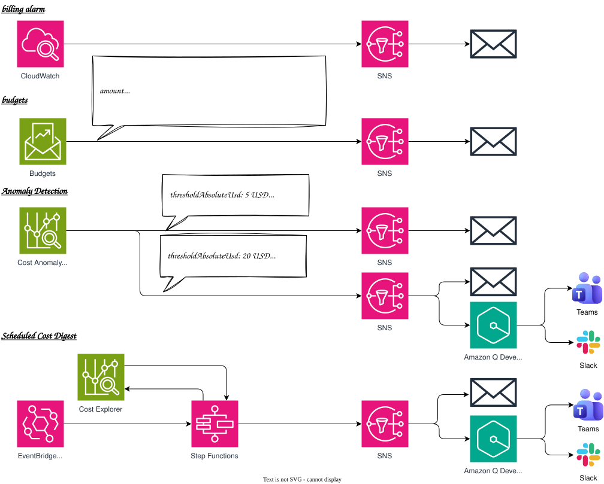

# Budgets & Cost Anomaly Detection — Five FinOps Alerting Patterns

*Read this in other languages:* [](./README.ja.md) [](./README.md)


## Introduction

This project is a reference implementation that uses the AWS CDK to alert on AWS cost, covering five FinOps alerting patterns as five separate CDK stacks — from the classic CloudWatch billing alarm to a scheduled, chat-native cost digest built on Step Functions:

- **Pattern A** — AWS Budgets cost thresholds → SNS → Email (Stack 1)
- **Pattern B** — AWS Cost Anomaly Detection → SNS → Email (Stack 2)
- **Pattern C** — Budgets + Anomaly Detection unified on one SNS topic, optionally delivered to Slack via AWS Chatbot (Stack 3)
- **Pattern D** — The classic CloudWatch `EstimatedCharges` billing alarm → SNS → Email (Stack 4)
- **Pattern E** — A scheduled Step Functions cost digest, posted to Slack and/or Microsoft Teams via AWS Chatbot (Stack 5)

### Why Five Patterns?

| Feature | A (Budgets) | B (Anomaly Detection) | C (Unified) | D (Billing Alarm) | E (Cost Digest) |
| ------- | ----------- | ---------------------- | ------------ | -------------------- | ------------------- |
| Trigger | Reactive — a **known threshold** you define | Reactive — spend that **deviates from its own baseline** (ML) | Both, reactive | Reactive — a single cumulative-spend threshold | Proactive — a schedule (no threshold needed to fire) |
| Good for | "Don't let this account exceed $X/month" | "Something unusual is happening, even if under budget" | One alert channel for both reactive signals | The oldest, zero-Cost-Explorer-dependency safety net | "Just tell me what we spent this week, service by service" |
| Setup complexity | Low | Low | Medium (shared topic policy) | Low (but forced to us-east-1) | High (Step Functions + Scheduler + Chatbot) |
| Delivery | SNS + Email | SNS + Email | SNS + Email + optional Slack | SNS + Email | SNS + Email + optional Slack/Teams |

## Architecture Overview



### Pattern A — AWS Budgets (Stack 1)

```text
CfnBudget (account-wide, monthly)  ─┐
CfnBudget (service-filtered)       ─┴─→ SNS Topic (budgets.amazonaws.com may publish) → Email
```

Two budgets share the same notification rules and SNS topic:

| Budget | Purpose |
| ------ | ------- |
| **Monthly Cost Budget** | Account-wide monthly `COST` budget |
| **Service Cost Budget** | Same limit, scoped with `costFilters.Service` to demonstrate per-service budgeting |

Each budget notifies on a configurable list of `{ type: 'ACTUAL' \| 'FORECASTED', thresholdPercent }` rules — by default: forecasted ≥ 100%, actual ≥ 80%, actual ≥ 100% (see [Implementation Highlights](#1-dynamic-budget-notification-rules) below).

### Pattern B — AWS Cost Anomaly Detection (Stack 2)

```text
CfnAnomalyMonitor (DIMENSIONAL, SERVICE)
  → CfnAnomalySubscription (frequency: IMMEDIATE)
  → SNS Topic (costalerts.amazonaws.com may publish)
```

The anomaly subscription only fires when an anomaly's impact exceeds **both** a percentage-of-expected-spend threshold **and** an absolute-dollar threshold (AND-combined `thresholdExpression`).

> **Frequency must be `IMMEDIATE` for SNS delivery.** AWS Cost Anomaly Detection only supports SNS subscribers on `IMMEDIATE` subscriptions; `DAILY`/`WEEKLY` frequencies are email-only. If you also want a daily digest by email, add a second `CfnAnomalySubscription` (frequency `DAILY`, `EMAIL` subscribers) pointed at the same monitor.

### Pattern C — Unified Alerting with Optional Slack (Stack 3)

```text
CfnBudget                                              ─┐
CfnAnomalySubscription (attached to Stack 2's monitor) ─┴─→ SNS Topic (both service principals) → Email
                                                                                                  └→ AWS Chatbot → Slack (optional)
```

One shared SNS topic receives both signals. If `params.notification.slack` is configured, a `SafeSlackChannelConfiguration` fans the same topic out to a Slack channel; otherwise the topic still delivers by email exactly like Stacks 1/2.

> **Stack 3 depends on Stack 2 for its anomaly monitor — it does not create its own.** AWS caps AWS-managed Cost Anomaly Detection monitors per account:
>
> > "You can create one AWS services managed monitor plus one additional AWS managed monitor (linked account, cost allocation tag, or cost category) per management account."
> > "AWS managed monitors for linked accounts, cost allocation tags, and cost categories can only be created in management accounts."
> > — [Extending AWS managed monitors in AWS Cost Anomaly Detection](https://aws.amazon.com/blogs/aws-cloud-financial-management/extending-aws-managed-monitors-in-cost-anomaly-detection/) (AWS Cloud Financial Management Blog)
>
> Stack 2 already creates the account's one `SERVICE`-dimension monitor. If Stack 3 created a second `SERVICE` monitor of its own, it would fail to deploy with `HandlerErrorCode: AlreadyExists` once Stack 2 exists (confirmed by deploying this exact reference architecture). Switching to a different dimension (e.g. `LINKED_ACCOUNT`) doesn't avoid this cleanly either — those AWS-managed monitors can only be created in an AWS Organizations *management* account, which most sandbox/dev accounts aren't. Instead, Stack 3 takes Stack 2's monitor ARN as a prop (`anomalyMonitorArn`) and attaches an *additional* `CfnAnomalySubscription` to it — one monitor can have multiple subscriptions, so this is a fully supported shape, not a workaround. The Stage instantiates Stack 2 before Stack 3 and wires `anomalyStack.monitorArn` in, which CDK turns into a real CloudFormation cross-stack export/import.
>
> **Deploying both Stack 2 and Stack 3 means every qualifying anomaly is reported twice** — once via Stack 2's subscription (→ email) and once via Stack 3's (→ email + optional Slack) — because both subscriptions watch the same underlying monitor. `params.anomalyDetection.unifiedEscalation` sets a *stricter* threshold for Stack 3's subscription (see `parameters/dev-params.ts`), so it only pages the unified/Slack channel for larger anomalies than Stack 2's base subscription — this demonstrates that one monitor can feed multiple subscriptions at different severities, but it doesn't eliminate the duplication for anomalies that clear *both* thresholds. In a real deployment, run Stack 2 **or** Stack 3 for anomaly detection, not both.

### Pattern D — Classic CloudWatch Billing Alarm (Stack 4)

```text
CloudWatch Alarm (AWS/Billing EstimatedCharges) → SNS Topic (cloudwatch.amazonaws.com may publish) → Email
```

The oldest AWS cost-alerting mechanism, included for completeness and as a zero-Cost-Explorer-dependency fallback. Two account-level prerequisites this stack **cannot** configure for you:

1. **"Receive Billing Alerts"** must be enabled once, manually, under Billing preferences — there's no CloudFormation/CDK resource for this account setting, and without it no `EstimatedCharges` data is published at all.
2. The `AWS/Billing` metric is **only ever published in us-east-1**, regardless of your default region — this stack's `env.region` is pinned to `us-east-1` in the Stage, independent of the other four stacks.

### Pattern E — Scheduled Cost Digest to Slack / Microsoft Teams (Stack 5)

```text
EventBridge Scheduler (cron)
  → Step Functions (Standard, JSONata)
      1. GetCostAndUsage   – Cost Explorer SDK integration; groups the trailing
         N days of spend by service and computes the top-5 breakdown + total
         entirely in JSONata (no Lambda involved)
      2. PublishCostDigest – Formats a markdown message (tone driven by an
         "angry threshold") and publishes it to SNS
  → SNS Topic → AWS Chatbot → Slack and/or Microsoft Teams (either or both)
```

Unlike Patterns A–D, this is a **proactive push** on a schedule rather than a **reactive pull** triggered by crossing a threshold — "tell me what we spent" instead of "tell me if we spent too much." Adapted from a hand-authored CloudFormation template originally targeting Microsoft Teams; this CDK version supports Slack, Teams, or both, selected purely by which of `params.notification.{slack,teams}` are configured.

---

## Prerequisites

- AWS CLI v2 installed and configured
- Node.js 20+
- AWS CDK CLI (`npm install -g aws-cdk`)
- Basic TypeScript knowledge
- An AWS account with [AWS Budgets](https://docs.aws.amazon.com/cost-management/latest/userguide/budgets-managing-costs.html) and [Cost Anomaly Detection](https://docs.aws.amazon.com/cost-management/latest/userguide/manage-ad.html) enabled (Cost Explorer must have been activated at least once)
- (Stack 4) "Receive Billing Alerts" enabled once under Billing preferences (Account Settings) — see [Pattern D](#pattern-d--classic-cloudwatch-billing-alarm-stack-4) above
- (Optional, Stacks 3/5 Slack delivery) A Slack workspace already authorized with [AWS Chatbot](https://docs.aws.amazon.com/chatbot/latest/adminguide/setting-up.html)
- (Optional, Stack 5 Teams delivery) A Microsoft Teams team already authorized with [AWS Chatbot](https://docs.aws.amazon.com/chatbot/latest/adminguide/teams-setup.html)

## Project Directory Structure

```text
budgets-cost-anomaly-detection/
├── bin/
│   └── budgets-cost-anomaly-detection.ts                     # Application entry point
├── lib/
│   ├── stacks/
│   │   ├── budgets-cost-anomaly-detection-budget-stack.ts       # Stack 1 – Pattern A
│   │   ├── budgets-cost-anomaly-detection-anomaly-stack.ts      # Stack 2 – Pattern B
│   │   ├── budgets-cost-anomaly-detection-unified-stack.ts      # Stack 3 – Pattern C
│   │   ├── budgets-cost-anomaly-detection-billing-alarm-stack.ts # Stack 4 – Pattern D
│   │   └── budgets-cost-anomaly-detection-cost-digest-stack.ts  # Stack 5 – Pattern E
│   ├── stages/
│   │   └── budgets-cost-anomaly-detection-stage.ts              # Deployment orchestration
│   └── types/
│       ├── index.ts                              # Type exports
│       ├── budget-params.ts                       # Budget params (re-exports common BudgetNotificationRule)
│       ├── anomaly-params.ts                      # Cost Anomaly Detection types
│       ├── notification-params.ts                 # Email/Slack/Teams notification types
│       ├── billing-alarm-params.ts                # Billing alarm threshold type
│       └── cost-digest-params.ts                  # Cost digest schedule/threshold type
├── parameters/
│   ├── environments.ts                            # EnvParams interface + registry
│   ├── dev-params.ts                               # Development environment parameters
│   └── prd-params.ts                               # Production environment parameters
├── test/
│   ├── compliance/
│   │   └── cdk-nag.test.ts                        # CDK Nag AwsSolutions compliance tests
│   ├── snapshot/
│   │   └── snapshot.test.ts                        # CloudFormation template snapshot tests
│   └── unit/
│       └── budgets-cost-anomaly-detection.test.ts  # Fine-grained assertion tests
```

This pattern also introduces seven reusable constructs under `infrastructure/common/constructs/cost/` (shared across the whole repo, not just this workspace) — see [Reusable Cost Constructs](#5-reusable-cost-constructs-commonconstructscost) below:

```text
common/
├── types/
│   └── cost.ts                          # BudgetNotificationRule + defaults
└── constructs/cost/
    ├── cost-alert-topic.ts              # SNS topic pre-wired for Budgets/CE/CloudWatch publish
    ├── budget.ts                        # CfnBudget wrapper driven by BudgetNotificationRule[]
    ├── anomaly-detection.ts             # CfnAnomalyMonitor + CfnAnomalySubscription wrapper
    ├── billing-alarm.ts                 # AWS/Billing EstimatedCharges alarm wrapper
    ├── safe-slack-channel.ts            # SlackChannelConfiguration with a safe guardrail default
    ├── safe-teams-channel.ts            # CfnMicrosoftTeamsChannelConfiguration + minimal role/guardrail
    └── cost-digest.ts                   # Scheduler + JSONata Step Functions cost digest + Chatbot delivery
```

---

## Implementation Highlights

### 1. Dynamic Budget Notification Rules

Rather than hard-coding "80%, 100%, forecasted 100%" in the stack, notification rules are a plain array in the environment parameters, so any environment can add or remove thresholds (e.g. a runaway-cost escalation at 200%) without touching stack code:

```typescript
// common/types/cost.ts
export interface BudgetNotificationRule {
    readonly type: 'ACTUAL' | 'FORECASTED';
    readonly thresholdPercent: number;
}

// parameters/dev-params.ts
budget: {
    amount: 10,
    notifications: [
        { type: 'FORECASTED', thresholdPercent: 100 },
        { type: 'ACTUAL', thresholdPercent: 80 },
        { type: 'ACTUAL', thresholdPercent: 100 },
        { type: 'ACTUAL', thresholdPercent: 200 }, // runaway-cost escalation
    ],
},
```

```typescript
// common/constructs/cost/budget.ts
const notificationRules = props.notifications ?? defaultBudgetNotifications;
const notificationsWithSubscribers = notificationRules.map((rule) => ({
    notification: {
        notificationType: rule.type,
        comparisonOperator: 'GREATER_THAN',
        threshold: rule.thresholdPercent,
        thresholdType: 'PERCENTAGE',
    },
    subscribers,
}));
```

### 2. SNS Topic Policies Are Not Optional

AWS Budgets and Cost Anomaly Detection publish to SNS as a **service principal**, not via IAM role assumption; CloudWatch Alarm actions need the same kind of explicit grant. Without it, notifications fail silently — the budget/subscription/alarm looks correctly configured, but nothing ever arrives. The shared `CostAlertTopic` construct centralizes all three grants behind boolean flags:

```typescript
// common/constructs/cost/cost-alert-topic.ts (simplified)
if (props.allowBudgetsPublish) {
    topic.addToResourcePolicy(new iam.PolicyStatement({
        principals: [new iam.ServicePrincipal('budgets.amazonaws.com')],
        actions: ['sns:Publish'],
        conditions: {
            StringEquals: { 'aws:SourceAccount': account },
            ArnLike: { 'aws:SourceArn': `arn:${partition}:budgets::${account}:*` },
        },
    }));
}
if (props.allowCostAnomalyDetectionPublish) { /* costalerts.amazonaws.com, SourceAccount only */ }
if (props.allowCloudWatchAlarmPublish) { topic.grantPublish(new iam.ServicePrincipal('cloudwatch.amazonaws.com')); }
```

Note that Cost Anomaly Detection's statement only needs the `aws:SourceAccount` condition — AWS's own example doesn't scope a `SourceArn` for that service — and that CloudWatch's `cloudwatch-actions.SnsAction` does **not** auto-grant publish the way you might expect from other alarm actions, so Pattern D requires the explicit `allowCloudWatchAlarmPublish` flag.

> **Do not add a customer-managed KMS key to these topics.** AWS's troubleshooting documentation for Budgets and Cost Anomaly Detection explicitly lists topic encryption as a common cause of silently dropped notifications, since the service principals would also need `kms:GenerateDataKey*`/`kms:Decrypt` grants on the key policy. These topics keep the default (unencrypted-at-rest) SNS configuration and enforce `enforceSSL: true` for in-transit protection instead (see the `cdk-nag` suppressions in `test/compliance/cdk-nag.test.ts` for the documented rationale).

### 3. Cost Anomaly Detection's `thresholdExpression`

`CfnAnomalySubscription.thresholdExpression` is typed as a plain `string` in `aws-cdk-lib` — CDK does not model the Cost Explorer `Expression` grammar, so you build and `JSON.stringify()` it yourself:

```typescript
thresholdExpression: JSON.stringify({
    And: [
        {
            Dimensions: {
                Key: 'ANOMALY_TOTAL_IMPACT_PERCENTAGE',
                MatchOptions: ['GREATER_THAN_OR_EQUAL'],
                Values: [String(thresholdPercentage)],
            },
        },
        {
            Dimensions: {
                Key: 'ANOMALY_TOTAL_IMPACT_ABSOLUTE',
                MatchOptions: ['GREATER_THAN_OR_EQUAL'],
                Values: [String(thresholdAbsoluteUsd)],
            },
        },
    ],
}),
```

### 4. AWS Chatbot's Guardrail Policy Default Is `AdministratorAccess` (Slack *and* Teams)

Both `SlackChannelConfigurationProps.guardrailPolicies` and `CfnMicrosoftTeamsChannelConfigurationProps.guardrailPolicies` default to the AWS-managed `AdministratorAccess` policy when left unset. An **empty array is not a safe substitute** — CDK synth drops empty list properties from the rendered CloudFormation template entirely, which leaves the property unset at the API level and lets that `AdministratorAccess` default apply anyway.

`SafeSlackChannelConfiguration` and `SafeMicrosoftTeamsChannelConfiguration` (`common/constructs/cost/`) close this gap once, for every stack that needs chat delivery, by substituting `ReadOnlyAccess` whenever the caller doesn't explicitly supply guardrails:

```typescript
guardrailPolicies:
    props.guardrailPolicies && props.guardrailPolicies.length > 0
        ? props.guardrailPolicies
        : [iam.ManagedPolicy.fromAwsManagedPolicyName('ReadOnlyAccess')],
```

Microsoft Teams has no CDK L2 construct at all — `SafeMicrosoftTeamsChannelConfiguration` also builds the minimal "notifications-only" IAM role (`cloudwatch:Describe*`/`Get*`/`List*` only) that AWS's own sample Chatbot policy uses, so callers don't have to reconstruct it by hand.

### 5. Reusable Cost Constructs (`common/constructs/cost/`)

The pieces above are genuinely repo-wide (not specific to this workspace), so they live under `infrastructure/common/constructs/cost/` instead of this workspace's `lib/stacks/`:

| Construct | Wraps | Used by |
| --------- | ----- | ------- |
| `CostAlertTopic` | SNS `Topic` + conditional resource policies (Budgets/CE/CloudWatch) + email subscriptions | Stacks 1, 2, 3, 4 |
| `CostBudget` | `CfnBudget`, driven by `BudgetNotificationRule[]` | Stack 1 (×2), Stack 3 |
| `CostAnomalyDetection` | `CfnAnomalyMonitor` + `CfnAnomalySubscription` (+ `thresholdExpression` builder) | Stack 2, Stack 3 |
| `BillingAlarm` | The `AWS/Billing EstimatedCharges` CloudWatch alarm | Stack 4 |
| `SafeSlackChannelConfiguration` | `chatbot.SlackChannelConfiguration` with a safe guardrail default | Stack 3, Stack 5 |
| `SafeMicrosoftTeamsChannelConfiguration` | `chatbot.CfnMicrosoftTeamsChannelConfiguration` + minimal role + safe guardrail default | Stack 5 |
| `CostDigest` | The whole Stack 5 pattern: EventBridge Scheduler → JSONata Step Functions (`GetCostAndUsage` → `PublishCostDigest`) → SNS → optional Slack/Teams | Not yet wired in — see note below |

`CostDigest` bundles Stack 5's entire pattern (scheduler, state machine, topic, optional Chatbot delivery) behind a handful of primitive props (`project`, `environment`, schedule/threshold/locale, `emails`, optional `slack`/`teams`) so other workspaces can reuse it without depending on this workspace's `EnvParams` types. **Stack 5 in this workspace still uses its own inline implementation** (not yet refactored to call `CostDigest`) — the construct was added as a standalone, reusable building block first; the two implementations are functionally identical (same resource shapes, same locale-aware message builders) but are maintained as separate code for now.

### 6. The Cost Digest's JSONata State Machine (Stack 5)

The state machine has exactly two states, both expressed as raw ASL via `sfn.CustomState` (there's no typed CDK task for the Cost Explorer or SNS AWS-SDK integrations), chained with plain `.next()` — `Next`/`End` are added automatically by CDK's state-graph synthesis, not written by hand:

```typescript
const getCostAndUsage = new sfn.CustomState(this, 'GetCostAndUsage', {
    stateJson: {
        Type: 'Task',
        Resource: 'arn:aws:states:::aws-sdk:costexplorer:getCostAndUsage',
        Arguments: { /* Granularity, Metrics, TimePeriod (JSONata), GroupBy, Filter */ },
        Assign: { AngryThreshold: angryThresholdUsd, AccountId: cdk.Aws.ACCOUNT_ID, /* ... */ },
        Output: { Start: '', CostSum: '', CostSorted: '' },
    },
});
const publishCostDigest = new sfn.CustomState(this, 'PublishCostDigest', {
    stateJson: {
        Type: 'Task',
        Resource: 'arn:aws:states:::sns:publish',
        Arguments: { Message: { /* title/description, JSONata-templated */ }, TopicArn: topic.topicArn },
    },
});
getCostAndUsage.next(publishCostDigest);

new sfn.StateMachine(this, 'CostDigestStateMachine', {
    definitionBody: sfn.DefinitionBody.fromChainable(getCostAndUsage),
    queryLanguage: sfn.QueryLanguage.JSONATA,
    tracingEnabled: true,
    logs: { destination: logGroup, level: sfn.LogLevel.ALL, includeExecutionData: true },
});
```

> **A JS-string escaping gotcha worth knowing.** The description message concatenates JSONata string literals like `"\n"` to force line breaks in the rendered chat message. Writing that as a plain `\n` in a TypeScript template literal lets *JavaScript* interpret the escape immediately — producing a real newline character in the JS string, which then round-trips through JSON serialization back into the two characters `\n`, so it happens to still work. The regex `\s*` inside `$replace(/^(AWS|Amazon)\s*/, "")` is the case that actually breaks silently if you're not careful: `\s` is **not** a recognized JavaScript string escape, so a bare `\s` in a template literal has its backslash silently dropped by the JS engine, becoming just `s` — turning the regex into `s*` and quietly breaking the service-name cleanup. Written as `\\s`, the JS string keeps a literal backslash, which survives the JSON round-trip and reaches JSONata's regex parser correctly. Both stray escapes were caught by inspecting the actual synthesized `cdk synth` output before writing tests, not by reading the JSONata spec alone.

The title/description JSONata expressions are generated by two small locale-aware builder functions (`buildCostDigestTitleExpression`/`buildCostDigestDescriptionExpression`) rather than being inlined once — `params.costDigest.locale` (`'ja' | 'en'`, defaulting to `'ja'`) picks which language the digest message is rendered in:

```typescript
// parameters/dev-params.ts
costDigest: {
    // ...
    locale: 'ja', // switch to 'en' for an English-language digest message
},
```

`EventBridge Scheduler`'s `StepFunctionsStartExecution` target (`aws-scheduler-targets`) auto-creates and grants the scheduler's own execution role — no manual `states:StartExecution` IAM statement needed, unlike the CloudFormation template this was adapted from.

---

## Key Components and Design Points

| Component | Design Point |
| --------- | ------------ |
| **SNS Topics** | `enforceSSL: true`; no CMK (see rationale above); one topic per stack, built via `CostAlertTopic` |
| **CfnBudget** | `budgetType: COST`, `timeUnit: MONTHLY`; notification rules driven by `BudgetNotificationRule[]` parameters |
| **CfnAnomalyMonitor** | `monitorType: DIMENSIONAL`, `monitorDimension: SERVICE` by default (per-service anomaly detection); created once, by Stack 2 only — AWS allows just one `SERVICE` monitor per account |
| **CfnAnomalySubscription** | `frequency: IMMEDIATE` (required for SNS delivery); `thresholdExpression` AND-combines a percentage and an absolute-dollar threshold; Stack 3 attaches a second subscription to Stack 2's monitor instead of creating a new one |
| **SlackChannelConfiguration (Stacks 3, 5, optional)** | Created only when `params.notification.slack` is set; guardrails pinned to `ReadOnlyAccess` via `SafeSlackChannelConfiguration`, never left to the `AdministratorAccess` default |
| **MicrosoftTeamsChannelConfiguration (Stack 5, optional)** | Created only when `params.notification.teams` is set; minimal notifications-only role + `ReadOnlyAccess` guardrail via `SafeMicrosoftTeamsChannelConfiguration` |
| **CloudWatch Billing Alarm (Stack 4)** | `AWS/Billing EstimatedCharges`, `Maximum` over 6h, forced to `us-east-1` |
| **Step Functions (Stack 5)** | `QueryLanguage.JSONATA`, `tracingEnabled: true`, full (`ALL`) execution logging to CloudWatch Logs |
| **EventBridge Scheduler (Stack 5)** | Cron expression + time zone from `params.costDigest`; targets the state machine via `StepFunctionsStartExecution` |
| **Digest message locale (Stack 5)** | `params.costDigest.locale` (`'ja' \| 'en'`, default `'ja'`) selects between two builder functions that generate the JSONata title/description |
| **Email subscribers** | Up to 10 per AWS Budgets notification (AWS service limit); unlimited via SNS/Cost Anomaly Detection/CloudWatch |

---

## Deployment & Verification

```bash
export PROJECT=myproject
export ENV=dev

# Bootstrap (first time only)
npm run bootstrap -w workspaces/budgets-cost-anomaly-detection

# Review the generated CloudFormation templates
npm run synth -w workspaces/budgets-cost-anomaly-detection

# Deploy all five stacks
npm run deploy:all -w workspaces/budgets-cost-anomaly-detection
```

Before deploying, edit `parameters/dev-params.ts` (or `prd-params.ts`) and replace the placeholder `notification.emails` addresses — SNS/Budgets email subscriptions require the recipient to confirm the subscription email before notifications start flowing. To enable Slack/Teams delivery, uncomment and fill in `notification.slack.{workspaceId,channelId}` and/or `notification.teams.{teamId,tenantId,channelId}`.

### Verify Pattern A (Budgets)

Budget notifications are evaluated against actual billing data (typically refreshed a few times a day), so there's no immediate way to trigger one in a sandbox account. Instead, confirm the wiring:

```bash
aws budgets describe-budgets --account-id <account-id>
aws budgets describe-notifications-for-budget --account-id <account-id> --budget-name <project>-<env>-monthly-cost
```

### Verify Pattern B (Cost Anomaly Detection)

```bash
aws ce get-anomaly-monitors
aws ce get-anomaly-subscriptions
```

Anomalies typically take **24+ hours** of billing history for the ML model to establish a baseline before it starts detecting.

### Verify Pattern C (Unified + Slack)

Stack 3 depends on Stack 2's anomaly monitor (see [Pattern C](#pattern-c--unified-alerting-with-optional-slack-stack-3) above), so `npm run deploy:all` — or `cdk deploy --all`, which resolves the dependency automatically — is the easiest path. If deploying stacks individually, deploy Stack 2 before Stack 3.

```bash
aws sns list-subscriptions-by-topic --topic-arn <finops-alert-topic-arn>
```

If Slack is configured, post a test notification by publishing directly to the topic:

```bash
aws sns publish --topic-arn <finops-alert-topic-arn> --message "Test FinOps alert"
```

### Verify Pattern D (Billing Alarm)

Confirm the alarm and its data (remember: this stack only exists in us-east-1):

```bash
aws cloudwatch describe-alarms --alarm-names <project>-<env>-estimated-charges --region us-east-1
aws cloudwatch get-metric-statistics --namespace AWS/Billing --metric-name EstimatedCharges \
  --dimensions Name=Currency,Value=USD --start-time $(date -u -d '1 day ago' +%Y-%m-%dT%H:%M:%S) \
  --end-time $(date -u +%Y-%m-%dT%H:%M:%S) --period 21600 --statistics Maximum --region us-east-1
```

If this returns no datapoints, "Receive Billing Alerts" likely isn't enabled yet (see Prerequisites).

### Verify Pattern E (Cost Digest)

Trigger a run on demand instead of waiting for the schedule:

```bash
aws stepfunctions start-execution --state-machine-arn <cost-digest-state-machine-arn>
```

Then check delivery:

```bash
aws sns list-subscriptions-by-topic --topic-arn <cost-digest-topic-arn>
```

---

## Running Tests

```bash
# Unit tests (fine-grained CDK assertions)
npm run test:unit -w budgets-cost-anomaly-detection

# Snapshot tests
npm run test:snapshot -w budgets-cost-anomaly-detection

# CDK Nag compliance (AwsSolutions pack)
npm run test:compliance -w budgets-cost-anomaly-detection
```

---

## Best Practices Summary

| Component | Recommended | Avoid |
| --------- | ----------- | ----- |
| SNS topic policy | Explicit `ServicePrincipal` statement scoped with `SourceAccount`/`SourceArn` conditions (via `CostAlertTopic`) | Assuming Budgets/CE/CloudWatch can publish without a resource policy |
| SNS encryption | Default SNS-managed (no CMK) + `enforceSSL: true` | Customer-managed KMS key (documented cross-service publish failures) |
| Anomaly SNS delivery | `frequency: IMMEDIATE` | `DAILY`/`WEEKLY` with an SNS subscriber (unsupported combination) |
| Budget thresholds | Data-driven `BudgetNotificationRule[]` per environment | Hard-coded notification blocks in stack code |
| AWS Chatbot guardrails (Slack and Teams) | Explicit minimal managed policy (e.g. `ReadOnlyAccess`), via `SafeSlackChannelConfiguration`/`SafeMicrosoftTeamsChannelConfiguration` | Leaving `guardrailPolicies` unset or `[]` (both resolve to `AdministratorAccess`) |
| Billing alarm region | Deploy to `us-east-1` explicitly, independent of the app's default region | Assuming the stack's default region works |
| Step Functions on shared infra | Enable `ALL` execution logging + X-Ray tracing (`cdk-nag` AwsSolutions-SF1 flags missing logging) | Leaving logging off "because it's just a demo" |
| Reusable cost wiring | Extract to `common/constructs/cost/` once a pattern repeats across stacks | Copy-pasting the same SNS topic-policy/guardrail logic into every new stack |

---

## Cost Estimation

<details>
<summary>💰 Monthly Estimate (Tokyo Region, us-east-1 for Stack 4)</summary>

| Service | Pattern | Monthly Cost |
| ------- | ------- | ------------ |
| AWS Budgets | A, C | First 2 budgets free; ~$0.02/day per budget beyond that |
| AWS Cost Anomaly Detection | B, C | No additional charge |
| Amazon SNS | All | First 1M requests free tier; negligible at alert volumes |
| AWS Chatbot | C, E (optional) | No additional charge |
| CloudWatch Alarm (billing) | D | ~$0.10/alarm/month |
| Step Functions (Standard) | E | First 4,000 state transitions/month free; ~2 transitions/run at a daily schedule is negligible |
| EventBridge Scheduler | E | First 14M invocations/month free |
| CloudWatch Logs (Step Functions) | E | ~$0.50/GB ingested; negligible at one short execution/day |

Total: Effectively **$0–2/month** for typical alerting volumes; the two included Budgets in Stacks 1 and 3 fit within the free tier, and Stack 5's Step Functions/Scheduler usage is far below the respective free tiers at a daily cadence.

</details>

---

## Summary

What we learned from this pattern:

1. **Pattern A (Budgets)**: Best for known, fixed cost ceilings; requires an explicit SNS topic policy or notifications silently fail; notification thresholds are naturally data-driven.
2. **Pattern B (Anomaly Detection)**: Best for catching unexpected spend even under budget; SNS delivery requires `IMMEDIATE` frequency, and the anomaly `thresholdExpression` is a hand-built JSON string, not a typed CDK property.
3. **Pattern C (Unified)**: A single alert channel is more operationally practical than managing separate topics per signal — but it can't have its own anomaly monitor once Stack 2 exists (AWS caps AWS-managed monitors to one per dimension per account), so it attaches an additional subscription to Stack 2's monitor instead, via a real cross-stack reference.
4. **Pattern D (Billing Alarm)**: The simplest possible safety net, but with two account-level catches that CDK cannot express: enabling "Receive Billing Alerts" once, manually, and the hard `us-east-1` region requirement.
5. **Pattern E (Cost Digest)**: A proactive, scheduled digest complements the four reactive/threshold patterns well; building it directly in ASL/JSONata via `sfn.CustomState` avoids a Lambda entirely, but demands care with string-escaping across the JS → JSON → JSONata boundary.
6. **AWS Chatbot's `AdministratorAccess` guardrail default** applies to both Slack and Microsoft Teams configurations, and an empty array does not disable it (CDK drops empty lists from synth output) — always pin an explicit, minimal guardrail policy.
7. Wiring that repeats across stacks (topic policies, guardrail safety, Budget/Anomaly resource shapes) earns its own `common/constructs/cost/` construct once, rather than being copy-pasted per stack.

---

## References

- [AWS Budgets User Guide](https://docs.aws.amazon.com/cost-management/latest/userguide/budgets-managing-costs.html)
- [Creating an Amazon SNS topic for budget notifications](https://docs.aws.amazon.com/cost-management/latest/userguide/budgets-sns-policy.html)
- [AWS Cost Anomaly Detection](https://docs.aws.amazon.com/cost-management/latest/userguide/manage-ad.html)
- [Creating an Amazon SNS topic for Cost Anomaly Detection](https://docs.aws.amazon.com/cost-management/latest/userguide/ad-SNS.html)
- [AWS::CE::AnomalySubscription — CloudFormation Reference](https://docs.aws.amazon.com/AWSCloudFormation/latest/UserGuide/aws-resource-ce-anomalysubscription.html)
- [Extending AWS managed monitors in AWS Cost Anomaly Detection](https://aws.amazon.com/blogs/aws-cloud-financial-management/extending-aws-managed-monitors-in-cost-anomaly-detection/) (source for the "one SERVICE monitor per account" limit behind Stack 3's design)
- [Creating a Billing Alarm to Monitor Your Estimated AWS Charges](https://docs.aws.amazon.com/AmazonCloudWatch/latest/monitoring/monitor_estimated_charges_with_cloudwatch.html)
- [Setting Up AWS Chatbot with Slack](https://docs.aws.amazon.com/chatbot/latest/adminguide/setting-up.html)
- [Setting Up AWS Chatbot with Microsoft Teams](https://docs.aws.amazon.com/chatbot/latest/adminguide/teams-setup.html)
- [AWS Step Functions Variables and JSONata](https://docs.aws.amazon.com/step-functions/latest/dg/transforming-data.html)
- [Amazon EventBridge Scheduler](https://docs.aws.amazon.com/scheduler/latest/UserGuide/what-is-scheduler.html)
- [CDK Nag AwsSolutions Rules](https://github.com/cdklabs/cdk-nag/blob/main/RULES.md)
