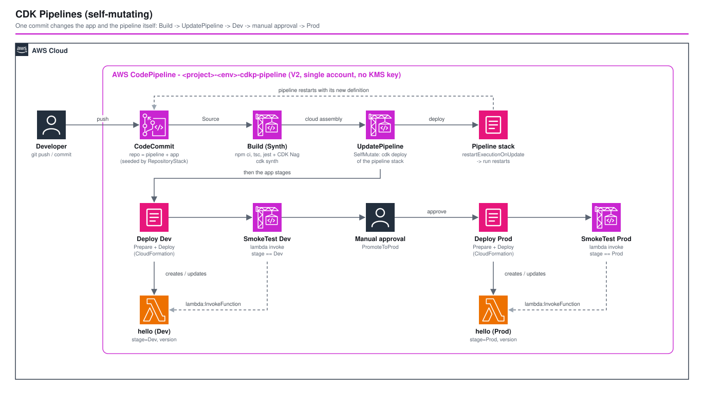

# CDK Pipelines (Self-Mutating) - AWS CDK Reference Architecture

[](./README.ja.md)
[](./README.md)

> **Level: 300 (Intermediate)**

A **self-mutating CDK Pipeline** built with `aws-cdk-lib/pipelines`: the pipeline's own definition lives in the repository it builds from, so a commit that changes the pipeline (add a stage, add a step) is picked up by the pipeline itself — nobody runs `cdk deploy` on the pipeline again after the first time.

```
Source (CodeCommit) → Build (npm ci · tsc · jest + CDK Nag · cdk synth) → UpdatePipeline (self-mutation)
  → Dev  (CloudFormation deploy → smoke test)
  → Prod (manual approval → CloudFormation deploy → smoke test)
```

This is the counterpart of [`cicd-codecommit-cross-account`](../cicd-codecommit-cross-account/), which wires CodePipeline/CodeBuild by hand. Here the `CodePipeline` construct generates the stages, IAM roles and CloudFormation actions from a `Stage` definition — the trade-off is compared [below](#1-cdk-pipelines-vs-hand-wired-codepipeline).

## 📑 Table of Contents

- [Architecture Overview](#-architecture-overview)
- [Design Decisions & Best Practices](#-design-decisions--best-practices)
- [Well-Architected Alignment](#-well-architected-alignment)
- [Cost Optimization](#-cost-optimization)
- [Security Considerations](#-security-considerations)
- [Prerequisites](#-prerequisites)
- [Deployment Guide](#-deployment-guide)
- [Operational Check Script](#-operational-check-script)
- [Testing Strategy](#-testing-strategy)
- [Customization](#-customization)
- [Troubleshooting](#-troubleshooting)
- [Clean-up](#-clean-up)
- [References](#-references)

## 🏗️ Architecture Overview



### Repository layout

```
cdk-pipelines-self-mutating/
├── bin/ lib/ parameters/ test/     # workspace root: RepositoryStack only (repo seeded with app/)
├── app/                            # ← a complete, standalone CDK app = the repository's initial commit
│   ├── bin/app.ts                  #   entry point (PipelineStack; needs -c project -c env)
│   ├── lib/pipeline-stack.ts       #   the pipeline definition (this is what self-mutates)
│   ├── lib/app-stage.ts, hello-stack.ts   # the sample application deployed per stage
│   ├── lib/config.ts               #   APP_VERSION / ENABLE_SECURITY_CHECK (flipped by the check script)
│   ├── test/                       #   tests that also gate the pipeline's Build stage
│   └── package.json + package-lock.json   # `npm ci` in CodeBuild
└── test-pipeline.sh                # end-to-end check (release + self-mutation)
```

### Key Components

- **`RepositoryStack`** (workspace root) — a CodeCommit repository whose **initial commit is the contents of `app/`**. It exists because CDK Pipelines needs a source before the pipeline does, and the pipeline definition itself lives in that source. Deploy it once; afterwards developers own the repository.
- **`PipelineStack`** (`app/`) — deployed once by hand (`cdk deploy` in `app/`), then updates itself:
  - a V2 `codepipeline.Pipeline` (`restartExecutionOnUpdate: true`, `crossAccountKeys: false`) with a private, TLS-only, SSE-S3 artifact bucket
  - `pipelines.CodePipeline` with `selfMutation: true` and a `ShellStep` synth (`npm ci` → `npm run build` → `npm test` → `cdk synth -c project=… -c env=…`)
  - **Dev** stage: CloudFormation deploy, then a `CodeBuildStep` smoke test that invokes the deployed function (`envFromCfnOutputs` supplies its name; its role may only `lambda:InvokeFunction` that one function)
  - **Prod** stage: `ManualApprovalStep`, deploy, smoke test
  - one shared CloudWatch log group for all build projects (7-day retention)
- **Sample application** (`HelloStack`) — one inline-code Lambda returning `{ stage, version }`, so a deployment and its promotion are observable. Replace it with your own stacks.

### Architecture Characteristics

| Characteristic | Value | Rationale |
|---|---|---|
| Pipeline ownership | the pipeline updates itself | one manual `cdk deploy`, then everything is a commit |
| Environments | Dev → (approval) → Prod | promotion gate is a pipeline step, not a person running a command |
| Quality gate | `tsc` + unit tests + CDK Nag run before anything deploys | a commit that breaks a test never reaches `UpdatePipeline` or Dev |
| Accounts | single account (Dev and Prod are separate stacks) | verifiable in one account; see [Customization](#-customization) for multi-account |
| Assets stage | absent | CDK Pipelines adds an `Assets` stage only when a stack has file/Docker assets (the Lambda here is inline) |

## 🎯 Design Decisions & Best Practices

### 1. CDK Pipelines vs hand-wired CodePipeline

| | CDK Pipelines (this) | Hand-wired CodePipeline ([`cicd-codecommit-cross-account`](../cicd-codecommit-cross-account/)) |
|---|---|---|
| Stages / actions | generated from `Stage` objects | written one by one |
| Deploying CDK apps | first-class: `Prepare`/`Deploy` actions, assets, bootstrap roles | you script `cdk deploy` in CodeBuild |
| Self-update | built in (`UpdatePipeline`) | you build it |
| Non-CDK steps (Docker build, custom tests) | `ShellStep` / `CodeBuildStep` | native |
| Fine control over each action / IAM | limited (drop to `codePipeline` L2 or escape hatches) | full |

Use CDK Pipelines when the thing being delivered is a CDK app. Use hand-wired CodePipeline when you need exact control over each action or the delivery is not CDK.

### 2. The pipeline lives in the repository it builds

`app/lib/pipeline-stack.ts` is part of the repository the pipeline watches. A commit that changes it makes `UpdatePipeline` run `cdk deploy` on the pipeline stack, and `restartExecutionOnUpdate` restarts the run with the new definition. This is proven end to end by [`test-pipeline.sh`](#-operational-check-script): one commit flips `ENABLE_SECURITY_CHECK`, and the pipeline **gains a `SecurityCheck` action in Dev on its own**.

### 3. Bake `project` / `env` into the synth command

`cdk synth -c project=… -c env=…` is generated from the props the stack was first deployed with, so self-mutation keeps them — no context in `cdk.json`, no drift between the laptop deploy and the pipeline.

### 4. A separate repository stack, and a two-step bootstrap

Order matters: **(1)** `RepositoryStack` (creates and seeds the repo) → **(2)** `cdk deploy` in `app/` (creates the pipeline; it starts immediately) → afterwards only `git push`. `Code` on `AWS::CodeCommit::Repository` is initial-commit-only: changing `app/` and redeploying `RepositoryStack` does **not** push commits to an existing repository.

### 5. Tests gate the pipeline (and this is not hypothetical)

`npm test` runs in the Build stage, so a failing test stops the run **before** self-mutation or deployment. During verification, the commit that flipped `ENABLE_SECURITY_CHECK` first failed the Build stage: a unit test asserted "no `SecurityCheck` action" and the flag change legitimately broke it. The fix was to assert that the action exists *exactly when the flag is set*. Keep tests that describe pipeline structure in terms of `lib/config.ts`, not constants.

### 6. Smoke test as a pipeline step with least privilege

`CodeBuildStep` + `envFromCfnOutputs` resolves the function name from the deployed stack's output at run time, and `rolePolicyStatements` grants that step `lambda:InvokeFunction` on that one function ARN only. A failed smoke test stops the run before the approval, so Prod is never offered a broken Dev.

### 7. No cross-account KMS key in a single account

`crossAccountKeys: false` avoids a KMS key (~$1/month) and its key policy. Turn it on when Dev/Prod are different accounts (see Customization).

### 8. Own the artifact bucket

Passing a `codepipeline.Pipeline` (`codePipeline:`) lets the stack own the artifact bucket (private, TLS-only, SSE-S3, `autoDeleteObjects` outside production) instead of getting a retained default bucket that blocks `cdk destroy`.

### 9. Environment-specific parameters

Naming and the pipeline's knobs live in `app/lib/naming.ts` and `app/lib/config.ts` because they must exist inside the repository content; `parameters/<env>-params.ts` (`EnvParams`) covers the workspace-root stack.

## 🏛️ Well-Architected Alignment

| Pillar | Implementation |
|---|---|
| **Operational Excellence** | Infrastructure and delivery as code; self-updating pipeline; build logs in CloudWatch; `test-pipeline.sh` proves release + self-mutation |
| **Security** | Manual approval before Prod; least-privilege smoke-test role; private TLS-only encrypted artifact bucket; CDK bootstrap roles for deployment; CDK Nag on every stack |
| **Reliability** | Tests and smoke tests gate promotion; CloudFormation rollback on failed deploys; restart-on-update avoids running a stale definition |
| **Performance Efficiency** | `SMALL` CodeBuild compute, no Docker-in-Docker, Dev/Prod deploy from one synthesized cloud assembly |
| **Cost Optimization** | V2 pipeline billed per action-minute; no KMS key; short log retention; nothing runs between commits |
| **Sustainability** | On-demand build capacity only; no idle build fleet |

## 💰 Cost Optimization

### Estimated cost per release and per month (ap-northeast-1; estimates, excludes free tier)

```
Per release (one commit that passes through Dev and Prod):
  CodeBuild (SMALL Linux): Synth ~2 min + SelfMutate ~1 min + 2 smoke tests ~1 min  ≈ 4-5 min x ~$0.005/min  ≈ $0.02-0.03
  CodePipeline V2:         ~10 action-minutes x $0.002                              ≈ $0.02
  Lambda / logs / S3:      negligible
  -------------------------------------------------------------------------------
  ≈ $0.05 per release

Per month (30 releases): ≈ $1.5;  idle pipeline: ≈ $0
```

Verify current rates on the CodePipeline / CodeBuild pricing pages (V1 pipelines are billed per active pipeline instead).

### Cost levers

1. **No cross-account KMS key** in a single-account setup (`crossAccountKeys: false`).
2. **Keep `npm test` fast** — build minutes dominate the cost.
3. **`SMALL` compute** is enough for synth/tests of an app this size.
4. **Short log retention** on the shared build log group.

## 🔒 Security Considerations

### Implemented

- ✅ **Manual approval** gates Prod
- ✅ **Least-privilege smoke test** (`lambda:InvokeFunction` on one ARN)
- ✅ **Artifact bucket**: private (Block Public Access), TLS-only, SSE-S3
- ✅ **Deploys use CDK bootstrap roles** (the pipeline assumes `cdk-*` roles; it does not hold broad permissions itself)
- ✅ **CDK Nag** (`AwsSolutions`) on the pipeline and application stacks, run in the Build stage

### CDK Nag suppressions (with reasons)

| Rule | Why suppressed |
|---|---|
| `AwsSolutions-IAM5` | CDK Pipelines generates wildcard grants it needs (artifact objects, log streams, report groups, `sts:AssumeRole` on `cdk-*` bootstrap roles) |
| `AwsSolutions-IAM4` | default CodeBuild/CodePipeline policies come from the construct |
| `AwsSolutions-CB4` | build output is only the cloud assembly in an SSE-S3 bucket; no CMK needed here |
| `AwsSolutions-S1` | access logging on a short-lived artifact bucket adds a bucket for no audit value |

### Out of scope (add per environment)

- **Who may approve**: restrict `codepipeline:PutApprovalResult` to an approver role/group; add SNS notification on the approval step.
- **Branch protection / PR review** on the CodeCommit repository (approval rule templates).
- **Cross-account** deployment (see Customization).

## 📋 Prerequisites

- AWS account bootstrapped for CDK (`cdk bootstrap`); AWS CLI v2 with a profile named `${PROJECT}-${ENV}`; Node.js 20+; `jq` for the check script
- **AWS CodeCommit available in your account** (it was closed to new customers from 2024-07-25 and reopened on 2025-11-24)
- Nothing else: CodeBuild pulls `aws/codebuild/standard:7.0` with Node.js 22

## 🚀 Deployment Guide

```bash
cd infrastructure
npm install
export PROJECT=<project> ENV=dev

# 1. Repository (seeded with app/)
npm run bootstrap        -w workspaces/cdk-pipelines-self-mutating   # first time only
npm run stage:deploy:all -w workspaces/cdk-pipelines-self-mutating

# 2. The pipeline itself — the only manual deploy; it starts running immediately
cd workspaces/cdk-pipelines-self-mutating/app
npm ci
npx cdk deploy -c project=$PROJECT -c env=$ENV --profile $PROJECT-$ENV
```

Watch the run in the CodePipeline console (or `./test-pipeline.sh`). It builds, self-mutates, deploys Dev, smoke-tests it, and **waits for approval**:

```bash
aws codepipeline put-approval-result --pipeline-name $PROJECT-$ENV-cdkp-pipeline --stage-name Prod \
  --action-name PromoteToProd --result summary=ok,status=Approved --token <token from get-pipeline-state>
```

To work on the app as a developer: `git clone codecommit::ap-northeast-1://$PROJECT-$ENV-cdkp-app` (needs `git-remote-codecommit`), edit, `git push`.

## 🧪 Operational Check Script

Deploying the pipeline stack proves nothing about whether the pipeline works. [`test-pipeline.sh`](./test-pipeline.sh) drives it through a real release and a self-mutation:

```bash
./test-pipeline.sh --project <project> --env dev              # verify
./test-pipeline.sh --project <project> --env dev --cleanup    # verify, then delete every stack
./test-pipeline.sh --project <project> --env dev --destroy-only
```

1. waits for the first run: build → self-mutate → Dev → **stops at the approval**
2. asserts Dev is live (`stage=Dev, version=1.0.0`) and **Prod does not exist yet**
3. approves and asserts Prod is live
4. pushes **one commit through the CodeCommit API** (no git client) that sets `APP_VERSION=1.1.0` **and** `ENABLE_SECURITY_CHECK=true`, then asserts: the pipeline **re-defined itself** (Dev gained a `SecurityCheck` action), the waiting run was built from the new commit, Dev runs 1.1.0 while Prod still runs 1.0.0, and after approval Prod runs 1.1.0

Requires `aws` and `jq`. `--cleanup` deletes the application stacks the pipeline created (Prod, Dev), the pipeline stack and the repository stack.

## 🧪 Testing Strategy

```bash
npm test -w workspaces/cdk-pipelines-self-mutating   # workspace-root tests + app/ tests (24)
```

| Where | Type | Covers |
|---|---|---|
| `test/` | Unit / Snapshot / CDK Nag | `RepositoryStack` (name, seed, removal policy, outputs; asset hash normalised) |
| `app/test/` | Unit | `PipelineStack`: V2 + restart-on-update, no KMS key, stage order, source repo/branch, `UpdatePipeline`, approval before Prod, smoke-test IAM scope, bucket hardening, baked-in synth command; `HelloStack`/`AppStage` |
| `app/test/` | CDK Nag | pipeline and application stacks — **also runs in the pipeline's Build stage** |

The `app/` tests are what stand between a commit and a deployment.

## ⚙️ Customization

- **More stages**: `pipeline.addStage(new AppStage(this, 'Stg', …), { pre: [new pipelines.ManualApprovalStep(…)] })`.
- **Waves** for parallel regions/accounts: `pipeline.addWave('Prod', { post: [...] })` then `wave.addStage(...)`.
- **Multi-account**: create Dev/Prod stages with distinct `env: { account, region }`, set `crossAccountKeys: true`, and bootstrap each target with `cdk bootstrap --trust <pipeline account> --cloudformation-execution-policies …`. The pipeline account also needs the CodeCommit source role (see `cicd-codecommit-cross-account`).
- **GitHub instead of CodeCommit**: `CodePipelineSource.connection('owner/repo', 'main', { connectionArn })` (the CodeStar connection must be authorised once in the console).
- **Docker builds / assets**: an `Assets` stage appears automatically; set `dockerEnabledForSynth` if synth needs Docker.
- **Real approval workflow**: `ManualApprovalStep` accepts a `comment`; notify an SNS topic from the pipeline and restrict who may approve.

## 🔧 Troubleshooting

### The Build stage fails and nothing deploys
Open the build log group (`…-BuildLogGroup…`). Type errors and unit/Nag failures stop the run by design. Reproduce locally in `app/`: `npm ci && npm run build && npm test`.

### First run: `Source` fails / repository not found
The pipeline stack was deployed before the repository stack. Deploy `RepositoryStack` first (repository name must equal `<project>-<env>-cdkp-app`).

### I changed `app/` but the repository did not change
`Code` on the repository is an initial commit only. Push to the repository with git, or delete and recreate the repository stack for a fresh seed.

### `UpdatePipeline` fails on the very first run
The pipeline stack's `-c project= -c env=` must match the first deploy. Redeploy from `app/` with the same context.

### The run does not restart after self-mutation
`restartExecutionOnUpdate` must be `true` on the underlying `codepipeline.Pipeline` (it is set here). Without it the run continues with the old definition.

### `cdk deploy` in `app/` fails with "no credentials" after a while
The bundled CDK cannot refresh an expired SSO token; export short-lived credentials (`aws configure export-credentials --format env`) or `aws sso login` again.

### `cdk destroy` leaves stacks behind
The pipeline created the Dev/Prod stacks; deleting the pipeline stack does not delete them. Use `./test-pipeline.sh --destroy-only`.

## 🧹 Clean-up

```bash
./test-pipeline.sh --project $PROJECT --env $ENV --destroy-only
```

Deletes, in order: Prod and Dev application stacks, the pipeline stack (artifact bucket emptied automatically outside production), the repository stack.

## 📚 References

### AWS Documentation
- [Continuous integration and delivery (CI/CD) using CDK Pipelines](https://docs.aws.amazon.com/cdk/v2/guide/cdk_pipeline.html)
- [`aws-cdk-lib/pipelines` module](https://docs.aws.amazon.com/cdk/api/v2/docs/aws-cdk-lib.pipelines-readme.html)
- [CodePipeline pipeline types (V1 vs V2) and pricing](https://docs.aws.amazon.com/codepipeline/latest/userguide/pipeline-types.html)
- [CDK bootstrapping and `--trust`](https://docs.aws.amazon.com/cdk/v2/guide/bootstrapping.html)

### Related Architectures
- [cicd-codecommit-cross-account](../cicd-codecommit-cross-account/) — hand-wired CodePipeline/CodeBuild across accounts
- [cicd-cloudfront-s3](../cicd-cloudfront-s3/) — a CI/CD pipeline for static-site delivery
- [ecspresso-bedrock-review](../ecspresso-bedrock-review/) — a CI/CD-driven ECS deployment

## 📄 License

This project is licensed under the MIT License — see the [LICENSE](../../LICENSE) file for details.

## 👥 Contributing

Contributions are welcome! Please read [CONTRIBUTING.md](../../CONTRIBUTING.md) for details.

## 🏆 About This Reference Architecture

**Target Level**: 300 (Intermediate)

---

**Note**: This is a reference implementation deployed in a single account. Add multi-account stages, approver controls, branch protection and notifications before using it for production delivery.
