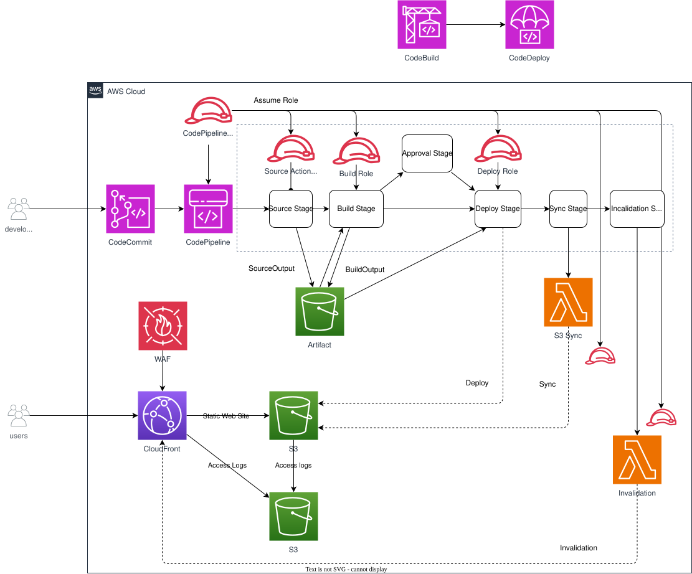

# CICD-CloudFront-S3 — CloudFront/S3静的サイト向けCodePipelineデプロイパイプライン

*他の言語で読む:* [](./README.ja.md) [](./README.md)


## はじめに

これは、CodeCommitリポジトリから静的サイトをビルドし、既存のS3バケット/CloudFrontディストリビューション(隣接する[`cloudfront-s3-static-website`](../cloudfront-s3-static-website/)ワークスペースなど)へデプロイする**CI/CDパイプライン**のリファレンス実装です。AWS CodePipeline、CodeBuild、そして専用の2つのLambda関数を使用します。

このアーキテクチャは以下を示します:

- 手書きのIAMポリシーを持たないCodeCommit → CodeBuild → CodePipelineパイプライン — 各アクションの権限はすべてCDK自身のアクション単位の自動付与に由来
- 「変更されたファイルのアップロード」と「ビルドに存在しなくなったファイルの削除」を、単一の`aws s3 sync --delete`ではなく2つの独立したパイプラインステップに分離
- CodePipelineの**継続トークン(continuation token)**パターンを使い、同期的なLambda呼び出しをブロックすることなくCloudFront無効化のステータスをポーリングする非同期Lambda
- 環境ごとにオプトインできる手動承認ゲートとパイプライン結果通知。いずれも単一のオプションパラメータで制御
- ドキュメント化されたリソース単位の抑制ルールによるCDK Nag(`AwsSolutionsChecks`)準拠

### なぜこのパターンなのか?

| 特徴 | メリット |
| ---- | -------- |
| カスタムのpipeline/build用IAMロールなし | `CodeCommitSourceAction`、`CodeBuildAction`、`S3DeployAction`、`LambdaInvokeAction`などの各アクションが、パイプラインステージにバインドされる際に、必要な権限だけをリソース単位でスコープして自身に付与する — レビューすべきIAMの範囲が減り、「付与されている権限」と「実際に使われている権限」の乖離が生じない |
| アップロードとクリーンアップをステージとして分離 | `S3DeployAction`が変更ファイルをアップロードし、専用のLambdaが不要になったオブジェクトを削除する。各ステップの責務が1つに絞られ、どちらか一方の実装を後で差し替えても他方に影響しない |
| 環境単位でゲート可能な承認 | 環境パラメータで`approvalTopicArn`を設定するだけで、手動承認ステージとSNSパイプライン通知が自動的に組み込まれる — 環境ごとのコード分岐は不要 |
| 最初からCDK Nag対応 | `test/compliance/cdk-nag.test.ts`で`AwsSolutionsChecks`を実行。残存するワイルドカード/マネージドポリシーの指摘はすべて、具体的なリソースパスに対して根拠を明記した上で抑制 |

## アーキテクチャ概要



### 主要コンポーネント

| コンポーネント | 設計のポイント |
| -------------- | -------------- |
| CodeCommitリポジトリ(インポート) | `parameters/*-params.ts`経由でリポジトリ名/ブランチを参照するのみで、このスタックでは作成しない |
| CodePipeline | カスタムの`role`を指定せず、CDKがパイプラインロールを自動生成し、ステージ追加時に各アクションの権限を自動付与 |
| CodeBuildプロジェクト | 静的サイトをビルドするのみで**デプロイは行わない** — デプロイはbuildspecではなく後続のパイプラインステージが担当 |
| `S3DeployAction`(Deployステージ) | ビルド成果物をデプロイ先バケットへアップロード/上書き |
| S3同期Lambda(Syncステージ) | 最新のビルド成果物に存在しなくなったオブジェクトをデプロイ先バケットから削除 |
| CloudFront無効化Lambda(InvalidateCacheステージ) | CloudFrontの無効化(invalidation)を作成し、CodePipelineの継続トークンパターンで完了までポーリング |
| 手動承認ステージ(任意) | `envParams.approvalTopicArn`が設定されている場合のみ作成 |
| CodeStarNotificationsルール(任意) | `envParams.approvalTopicArn`が設定されている場合のみ作成 — `AWS::CodeStarNotifications::NotificationRule`はターゲットが最低1つ必要なため、空のターゲットリストで作成されることはない |

### データフロー

```text
CodeCommit(ブランチへのpush)
    │  EventBridgeルールがパイプラインを起動
    ▼
CodePipeline
  ├─ Source              : CodeCommitSourceAction → SourceOutputアーティファクト
  ├─ Build               : CodeBuildAction(buildspec.yml) → BuildOutputアーティファクト
  ├─ Approval(任意)      : ManualApprovalAction、envParams.approvalTopicArnへ通知
  ├─ Deploy              : S3DeployAction → BuildOutputをデプロイ先バケットへアップロード
  ├─ Sync                : Lambda → BuildOutputに存在しないデプロイ先バケットのオブジェクトを削除
  └─ InvalidateCache     : Lambda → CloudFront CreateInvalidation、継続トークンでポーリング
```

### アーキテクチャ特性

| 特性 | 値 | 理由 |
|------|---|------|
| 可用性 | シングルリージョン、高可用性は不要 | CI/CDのコントロールプレーンであり、パイプライン実行の失敗は再実行すればよく、サイト自体がダウンするわけではない |
| スケーラビリティ | フルマネージド(CodePipeline/CodeBuild/Lambda) | スケーリングすべきサーバーがなく、ビルド量が増えた場合の制約はCodeBuildの同時実行数のみ |
| セキュリティ | CDKの自動付与による最小権限、CDK Nagでチェック済み | スタック内に手書きのワイルドカードIAMステートメントは残っていない |
| コスト | 従量課金 | アイドル状態のコンピュートがなく、コストは時間ではなくパイプライン実行回数に比例 |

## 設計上の決定とベストプラクティス

### 1. パイプラインロールを手書きせず、CDKにアクション単位でIAM権限を付与させる

**決定内容**: このスタックは、パイプラインやCodeBuildプロジェクト用にカスタムIAMロールを作成しない。

**根拠**:
- ✅ 各L2アクションコンストラクト(`CodeCommitSourceAction`、`CodeBuildAction`、`S3DeployAction`、`LambdaInvokeAction`)は、パイプラインステージにバインドされる際、特定のリソースARNにスコープされた必要最小限の権限のみを自身に付与する
- ✅ 「手書きのポリシーが実際に使われている範囲より広い」という種類のドリフトを丸ごと排除できる(このリファレンス実装は元々、パイプラインロールに未使用の`codedeploy:*`と`codestar-notifications:*`のワイルドカード権限を持っていたが、パイプライン内のどのアクションもこれらを一度も使用していなかった)
- ✅ PRでレビューすべきIAMポリシーの行数が減る

**トレードオフ**:
- ❌ 後から無関係な追加権限を付与したい場合、生成されるロールの形を細かく制御しにくい(必要になった時点で`pipeline.role`に的を絞った`addToRolePolicy`を追加すればよい)

### 2. 「アップロード」と「クリーンアップ」を単一の`aws s3 sync --delete`ではなく分離

**決定内容**: DeployステージのS3DeployActionはアップロード/上書きのみを行い、専用のSync Lambdaステージが後から不要になったオブジェクトを削除する。

**根拠**:
- ✅ `S3DeployAction`はマネージドなCodePipelineアクションであり、「ビルド成果物をアップロードする」という一般的なユースケースにカスタムコードが不要
- ✅ 削除ロジック(新しいビルド内容とバケット内の既存内容との差分)を1つのLambdaに閉じ込めることで、独立してテスト・差し替えしやすくなる
- ✅ アップロード中に部分的な失敗が起きても、削除は後続の別ステージでのみ実行されるため、まだ有効なオブジェクトを誤って削除するリスクがない

**トレードオフ**:
- ❌ CodeBuildのbuildspec内で`aws s3 sync --delete`を1回呼ぶのに比べ、パイプラインステージが1つ増える分だけ可動部分が増える

### 3. 単一パラメータによる環境単位の承認・通知ゲート

**決定内容**: `EnvParams.approvalTopicArn`(任意)のみがスイッチとなる。未設定の場合、Approvalステージも`AWS::CodeStarNotifications::NotificationRule`も一切作成されない。

**根拠**:
- ✅ 基盤となるCloudFormationリソースの`NotificationRule`はターゲットを最低1つ必要とする。トピック未設定時に`targets: []`のまま常に作成すると、デプロイ時に失敗する。そのため、このコンストラクトは`if (props.envParams.approvalTopicArn)`でラップされている
- ✅ 開発/テスト環境は手動ゲートを完全にスキップでき、`approvalTopicArn`を設定した環境(本番など)のみが追加ステージを持つ

**環境別設定**:
```typescript
// parameters/prod-params.ts
export const prodParams: EnvParams = {
  // ...
  approvalTopicArn: 'arn:aws:sns:ap-northeast-1:123456789012:prod-pipeline-approvals',
};
```

### 4. CodePipeline継続トークンパターンによる非同期CloudFront無効化

**決定内容**: 無効化用Lambdaは、CloudFrontの無効化完了を同期的に待たない。無効化を作成し、`InvalidationId`を含む`continuationToken`を返却し、CodePipelineがステータスが`Completed`になるまで同じLambdaを再起動する。

**根拠**:
- ✅ 長時間ポーリングし続けるLambda呼び出しを回避できる(CloudFrontの無効化は完了まで数分かかることがある)
- ✅ 各ポーリングは短時間の新規Lambda呼び出しであり、ポーリング途中でLambdaのタイムアウトに達するリスクがない

### 5. Well-Architected Framework整合性

| 柱 | 実装内容 |
|----|---------|
| **運用上の優秀性** | SNSによるパイプライン結果通知(オプトイン)、両Lambda関数のCloudWatch Logs(1週間保持、JSON構造化ログ) |
| **セキュリティ** | 手書きのワイルドカードIAMなし。`AwsSolutionsChecks`(CDK Nag)をCIで実行し、残存するワイルドカードはすべて具体的なリソースパスで根拠を明記して文書化 |
| **信頼性** | マネージドなCodePipeline/CodeBuild/Lambdaでパッチ適用や障害の心配があるサーバーが存在しない。無効化ステータスは仮定せずポーリングで確認 |
| **パフォーマンス効率** | 全体がサーバーレス。CodeBuildの`BUILD_GENERAL1_SMALL`で静的サイトのビルドには十分 |
| **コスト最適化** | パイプライン/ビルド/Lambdaはすべて従量課金。アイドルコンピュートなし。ログ保持は1週間、`RemovalPolicy.DESTROY` |
| **持続可能性** | アイドル状態のインフラなし(NAT Gatewayなし、常時稼働のコンピュートなし) |

## コスト最適化

### 推定月額コスト (ap-northeast-1、月間約20回のパイプライン実行)

```
CodePipeline (V2料金)                        : ~$0.02/回 × 20回        ≈ $0.40
CodeBuild (BUILD_GENERAL1_SMALL, 約3分/ビルド) × 20回                  ≈ $0.30
Lambda (Sync + Invalidate、軽量な呼び出し)                             ≈ $0.05
S3アーティファクトバケット(数MB)                                       < $0.05
CloudWatch Logs(3ロググループ、1週間保持)                              < $0.05
SNS(approvalTopicArn設定時のみ)                                        < $0.05
------------------------------------------------------------------------------
合計                                                                   約$1/月
```

> コストはアイドル時間ではなくパイプライン実行回数に比例します。デプロイの合間に稼働し続けるコンピュートは存在しません。

### コスト最適化戦略

1. **CodeBuildの`BUILD_GENERAL1_SMALL`コンピュートタイプ**
   - 静的サイトのビルドには十分。ビルドがCPU/メモリのボトルネックになった場合のみアップグレードする
2. **`RemovalPolicy.DESTROY`を伴う1週間のCloudWatch Logs保持**
   - 頻繁に実行されるパイプラインでログストレージが際限なく増加するのを防ぐ
3. **カスタムIAMロールを使わない**
   - 直接的なコスト削減にはならないが、手書きポリシーに伴うメンテナンス負荷を排除できる

## セキュリティの考慮事項

### 実装されているセキュリティベストプラクティス

- ✅ 手書きのワイルドカード(`Resource: '*'`)IAMステートメントなし — pipeline/build/Lambdaロール上のすべての権限は、CDK自身のアクション単位の自動付与、またはリソース単位のスコープをサポートしないAWS API(`lambda:ListFunctions`、`codepipeline:PutJobSuccessResult`など)が要求する最小限のいずれか
- ✅ `NotificationRule`と手動承認ステージは明示的に設定された場合のみ作成され、無効/空のCloudFormationリソースを回避
- ✅ アーティファクトバケットの削除ポリシー(`DESTROY` vs `RETAIN`)は`isAutoDeleteObject`で制御され、本番スタックはスタック削除時にアーティファクトを保持するよう設定できる

### CDK Nag準拠

`test/compliance/cdk-nag.test.ts`は、合成されたスタックに対して`AwsSolutionsChecks`を実行します。残存する指摘はすべて`NagSuppressions.addResourceSuppressionsByPath`で特定のリソースにスコープし、理由を明記した上で抑制しています。例:

- `AwsSolutions-IAM4`(AWSマネージドポリシー): 両Lambda実行ロールの`AWSLambdaBasicExecutionRole`(CloudWatch Logs書き込み用)
- `AwsSolutions-IAM5`(ワイルドカード): CodePipelineアクションロール上の、CDK自身が自動付与する`bucket/*`オブジェクトレベルアクセスと`lambda:ListFunctions`(いずれもより狭いスコープをサポートしない)
- `AwsSolutions-CB4`: CodeBuildプロジェクトはカスタマー管理KMSキーではなくデフォルトのAWS管理暗号化キーを使用

```bash
npm test -w workspaces/cicd-cloudfront-s3 -- test/compliance
```

## 前提条件

- 適切な権限を持つAWSアカウント
- AWS CLI v2.x インストール済みおよび設定済み
- Node.js 20.x以降
- AWS CDK 2.x
- Git
- 既存のCodeCommitリポジトリ([`parameters/dev-params.ts`](./parameters/dev-params.ts)に想定される`repositoryName`/`repositoryBranch`)
- デプロイ先の既存S3バケット/CloudFrontディストリビューション(例: [`cloudfront-s3-static-website`](../cloudfront-s3-static-website/)ワークスペース)

### 必要なIAM権限

デプロイするユーザー/ロールには以下の作成・管理権限が必要です:
- CodePipeline、CodeBuild
- Lambda、IAM(上記用のロール/ポリシー)
- S3(アーティファクトバケット)
- CodeStarNotifications、SNS(`approvalTopicArn`設定時のみ)

## デプロイガイド

### 1. クローンとセットアップ

```bash
git clone <this-repository>
cd infrastructure
npm install
```

### 2. 環境パラメータの設定

[`parameters/dev-params.ts`](./parameters/dev-params.ts)を編集(または新しい`*-params.ts`を追加して[`parameters/index.ts`](./parameters/index.ts)に登録):

```typescript
const devParams: EnvParams = {
  region: process.env.CDK_DEFAULT_REGION || 'ap-northeast-1',
  repositoryName: 'my-repo',
  repositoryBranch: 'main',
  deploymentTargetBucketName: 'my-deployment-bucket',
  cloudfrontDistributionId: 'EXXXXXXXXXXXXX',
  // approvalTopicArn: 'arn:aws:sns:...', // 任意 — Approvalステージ+通知を有効化
};
```

### 3. デプロイ

```bash
export PROJECT_NAME=your-project
export ENV=dev

npm run bootstrap   # 初回のみ
npm run diff -- --project=$PROJECT_NAME --env=$ENV
npm run deploy:all -- --project=$PROJECT_NAME --env=$ENV
```

### 4. デプロイの確認

```bash
# 設定したブランチにpushしてパイプラインを起動し、ステータスを確認:
aws codepipeline get-pipeline-state --name <project>-<env>-pipeline
```

## テスト戦略

### テスト構造

```
test/
├── compliance/
│   └── cdk-nag.test.ts     # リソース単位の抑制付きAwsSolutionsChecks
├── snapshot/
│   └── snapshot.test.ts    # 完全なテンプレート+リソース数のスナップショット
└── unit/
    └── cicd-cloudfront-s3.test.ts   # リソース/挙動のアサーション
```

### 1. スナップショットテスト

**目的**: リファクタ時に合成されたCloudFormationテンプレートへの意図しない変更を検出する。

```bash
npm run test:snapshot -w workspaces/cicd-cloudfront-s3
```

### 2. ユニットテスト

**目的**: テンプレート全体ではなく、特定のリソース・挙動をアサートする。

**テストカテゴリ** (14テスト):
- ✅ コアリソース数(パイプライン、ビルドプロジェクト、Lambda関数、アーティファクトバケット)
- ✅ Lambdaランタイム(Python 3.14)
- ✅ `approvalTopicArn`設定有無それぞれでのパイプラインステージ順序
- ✅ `NotificationRule`の条件付き作成
- ✅ `codedeploy:*`ワイルドカードIAMステートメントの再混入を防ぐリグレッションガード
- ✅ アーティファクトバケットの削除ポリシー(`DESTROY` vs `RETAIN`)

```bash
npm test -w workspaces/cicd-cloudfront-s3 -- test/unit
```

### CI/CD統合

```bash
npm test -w workspaces/cicd-cloudfront-s3
```

## カスタマイズ

### ビルドステップの追加

[`lib/stacks/cicd-cloudfront-s3-stack.ts`](./lib/stacks/cicd-cloudfront-s3-stack.ts)内の`buildSpec`(または参照先の`buildspec.yml`)を編集する — Buildステージは`BuildOutput`アーティファクトを生成するのみでデプロイは行わない。

### Approvalステージの有効化

```typescript
// parameters/prod-params.ts
approvalTopicArn: 'arn:aws:sns:ap-northeast-1:123456789012:prod-pipeline-approvals',
```

## トラブルシューティング

### 問題: 循環依存エラーでスタックの合成に失敗する

**症状**: `Template is undeployable, these resources have a dependency cycle: ... -> PipelineXXXX -> PipelineXXXX`

**解決策**:
1. いずれかのパイプラインステージのアクション設定が、そのパイプライン自身のステージであるアクションの*内部から*、`pipeline.pipelineName`(または`Pipeline`コンストラクトへの他の`Ref`/`Fn::GetAtt`)を参照していないか確認する
2. トークンの代わりに、`Pipeline`コンストラクト作成前に計算済みのプレーンな文字列を使う — これが、InvalidateCache Lambdaの`userParameters`で`pipeline.pipelineName`ではなく、ローカルの`const pipelineName`を再利用している理由

### 問題: アーティファクトバケットが`InvalidBucketNameValue`でデプロイに失敗する

**症状**: `Bucket name must only contain lowercase characters...`

**解決策**:
1. `props.project`が他の場所で小文字であることに依存していないか確認する — バケット名はプロジェクト名の大文字小文字にかかわらずS3バケット名が小文字である必要があるため、明示的に`.toLowerCase()`されている

## 参考資料

### AWSドキュメント
- [AWS CodePipeline ユーザーガイド](https://docs.aws.amazon.com/codepipeline/latest/userguide/welcome.html)
- [AWS CodeCommit ユーザーガイド](https://docs.aws.amazon.com/codecommit/latest/userguide/welcome.html)
- [AWS CodeBuild ユーザーガイド](https://docs.aws.amazon.com/codebuild/latest/userguide/welcome.html)

### AWS Well-Architected
- [AWS Well-Architected Framework](https://aws.amazon.com/jp/architecture/well-architected/)

### AWS CDK
- [aws-codepipeline-actions モジュール](https://docs.aws.amazon.com/cdk/api/v2/docs/aws-cdk-lib.aws_codepipeline_actions-readme.html)
- [CDK Nag](https://github.com/cdklabs/cdk-nag)

### 関連アーキテクチャ
- [`cloudfront-s3-static-website`](../cloudfront-s3-static-website/) — このパイプラインがデプロイ先とするCloudFront/S3静的サイト

## 📄 ライセンス

このプロジェクトはMITライセンスの下でライセンスされています - 詳細は [LICENSE](../../../LICENSE) ファイルを参照してください。

## 👥 コントリビューション

コントリビューションを歓迎します! 詳細は [CONTRIBUTING.md](../../../docs/contribution/CONTRIBUTING.md) をご覧ください。

## 🏆 このリファレンスアーキテクチャについて

このリファレンスアーキテクチャは、本番環境対応のCI/CDインフラストラクチャを構築するためのAWS CDKベストプラクティスを示しています。

**対象レベル**: 300(上級)

---

**注意**: これはリファレンス実装です。本番環境にデプロイする前に、必ず特定の要件および組織のポリシーに従ってレビューおよびカスタマイズしてください。
