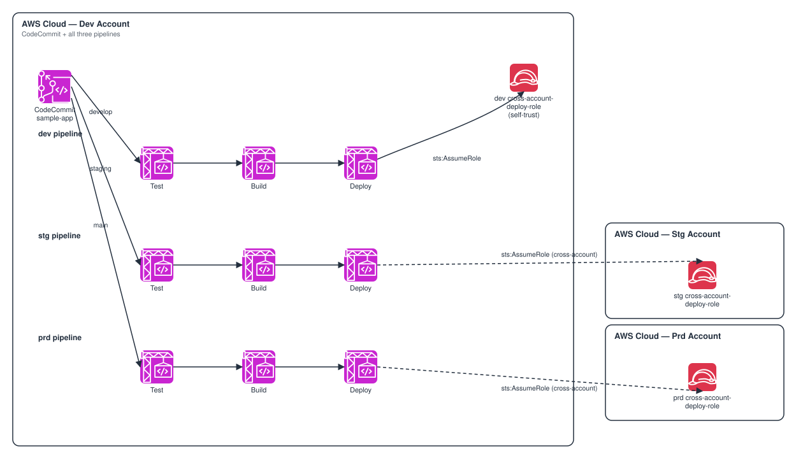

# CICD-CodeCommit-Cross-Account — Cross-Account CI/CD Pipeline from a Single CodeCommit Repository

*Read this in other languages:* [](./README.ja.md) [](./README.md)


## Introduction

This is a reference implementation of a **cross-account CI/CD pipeline** built
entirely with AWS CodePipeline and CodeBuild, sourced from a single AWS
CodeCommit repository in a dev account and deploying into three separate AWS
accounts (dev / stg / prd).

This architecture demonstrates:

- A single CodeCommit repository, created in the dev account, with three
  long-lived branches (`develop` / `staging` / `main`) auto-created from the
  same initial commit
- Three independent CodePipelines — one per branch — each running
  `Source → Test → Build → (optional Approve) → Deploy`, driven by
  `buildspec-test.yml` / `buildspec-build.yml` / `buildspec-deploy.yml`
  checked into the repository itself
- The cross-account hop implemented as a plain `sts:AssumeRole` inside the
  Deploy stage's CodeBuild project — no CDK Pipelines, no cross-account
  bootstrap trust required
- A fixed-name IAM role per environment, created by a **separate stack
  deployed directly into each target account**, trusting only that
  environment's Deploy CodeBuild role by ARN
- `dev-params` / `stg-params` / `prd-params` for per-environment
  configuration and a `shared-params` for values that don't vary by
  environment — except the CodeCommit account ID, which is intentionally
  read from an environment variable instead of being hard-coded, since this
  is a public repository

### Why this pattern?

| Feature | Benefit |
| ------- | ------- |
| Pipelines stay in the dev account | Only the Deploy CodeBuild project crosses accounts (via `AssumeRole`); CodeCommit, CodePipeline, and the Test/Build projects are all same-account, which keeps IAM and networking simple |
| Fixed-name IAM roles | The Deploy CodeBuild role (dev account) and the CrossAccountDeployRole (target account) are both named deterministically, so the trust relationship between them can be expressed as a plain ARN string — no cross-stack references across accounts needed |
| One stack per target account | `CrossAccountRoleStack` is deployed once per account (dev/stg/prd), each time against that account's own CLI profile — the same code path handles the dev (self-trust) and stg/prd (true cross-account) cases identically |
| Auto-created branches | `develop`/`staging` are created from `main`'s initial commit via a Custom Resource, so a single `cdk deploy` leaves all three branches ready to receive pushes |

## Architecture Overview



### Key Components

| Component | Design Points |
| --------- | ------------- |
| CodeCommit repository (dev account) | Created by this stack, seeded with `sample-app/` on `main`; `develop`/`staging` are created from that same commit via `AwsCustomResource` |
| 3x CodePipeline (dev account) | `<project>-dev-pipeline`, `<project>-stg-pipeline`, `<project>-prd-pipeline`, each sourced from its matching branch |
| Test / Build CodeBuild projects | Run `buildspec-test.yml` / `buildspec-build.yml` from the repository — same-account, no special IAM |
| Deploy CodeBuild project | Runs `buildspec-deploy.yml`; its IAM role has a fixed name (`<project>-<env>-deploy-build-role`) and is granted `sts:AssumeRole` on that environment's cross-account role |
| CrossAccountRoleStack (dev/stg/prd accounts) | Deployed separately into each target account; creates `<project>-<env>-cross-account-deploy-role`, trusting only the matching Deploy CodeBuild role's ARN |

### Data Flow

```text
Dev account
├── CodeCommit repo (develop / staging / main branches)
│
├── <project>-dev-pipeline   (Source: develop) ─┐
├── <project>-stg-pipeline   (Source: staging)  ├─ Source → Test → Build → [Approve] → Deploy
└── <project>-prd-pipeline   (Source: main)     ┘
                                                    │
                                    Deploy CodeBuild role (fixed name, dev account)
                                                    │  sts:AssumeRole
                     ┌──────────────────────────────┼──────────────────────────────┐
                     ▼                              ▼                              ▼
         dev account (self-trust)          stg account                    prd account
   <project>-dev-cross-account-      <project>-stg-cross-account-  <project>-prd-cross-account-
        deploy-role                       deploy-role                    deploy-role
```

### Architecture Characteristics

| Characteristic | Value | Rationale |
|---------------|-------|-----------|
| Availability | Single-region, no HA required | A CI/CD control plane; a failed pipeline run is retried, it doesn't take an application down |
| Scalability | Fully managed (CodePipeline/CodeBuild) | No servers to scale; CodeBuild concurrency is the only limit that matters at higher build volume |
| Security | Cross-account access via short-lived `AssumeRole` credentials only | No long-lived cross-account credentials are ever stored |
| Cost | Pay-per-use | No idle compute; cost scales with pipeline executions, not with time |

## Design Decisions & Best Practices

### 1. Pipelines live in the dev account; only Deploy crosses accounts

**Decision**: CodeCommit and all three CodePipelines are created by a single
`PipelineStack`, deployed only into the dev account (`ENV=dev`). Only the
Deploy stage's CodeBuild project performs a genuine cross-account hop.

**Rationale**:
- ✅ Avoids CDK Pipelines' cross-account bootstrap trust setup
  (`cdk bootstrap --trust <pipeline-account>`) entirely — a plain
  `sts:AssumeRole` needs nothing beyond the target account's own IAM role
- ✅ CodeCommit repository events, CodePipeline executions, and CodeBuild
  logs all stay observable from a single account
- ✅ The Deploy buildspec (`sample-app/buildspec-deploy.yml`) is identical
  for all three environments — it always assumes `CROSS_ACCOUNT_ROLE_ARN`,
  even for dev, where that role happens to live in the same account

**Trade-offs**:
- ❌ The dev account becomes a single point of administration for the CI/CD
  control plane itself — losing access to it means losing the ability to
  deploy to any environment

### 2. Fixed-name IAM roles instead of cross-stack references

**Decision**: The Deploy CodeBuild role (`<project>-<env>-deploy-build-role`)
and the target account's `CrossAccountDeployRole`
(`<project>-<env>-cross-account-deploy-role`) both have deterministic names
computed the same way in both stacks.

**Rationale**:
- ✅ CDK cross-stack references (`Fn::ImportValue`, SSM parameter lookups)
  don't work across AWS accounts without extra plumbing; a fixed-name
  `iam.ArnPrincipal` sidesteps that entirely
- ✅ `CrossAccountRoleStack` deploys independently of `PipelineStack` — the
  target account only needs to know the dev account ID (`CODECOMMIT_ACCOUNT_ID`)
  and the naming convention, not any CloudFormation output

**Trade-offs**:
- ❌ Renaming `<project>` or the naming convention itself requires
  redeploying both sides in lockstep

### 3. `shared-params` for common values, except the one that's sensitive

**Decision**: `parameters/shared-params.ts` holds values common to every
environment. The CodeCommit account ID conceptually belongs there too — it's
always the dev account, regardless of which environment's pipeline is
running — but since this is a **public repository**, it's read from the
`CODECOMMIT_ACCOUNT_ID` environment variable instead of being hard-coded.

```typescript
// parameters/shared-params.ts
export const sharedParams: SharedParams = {
  repositoryName: 'sample-app',
  codecommitAccountId: process.env.CODECOMMIT_ACCOUNT_ID,
};
```

### 4. Auto-created `develop`/`staging` branches

**Decision**: `codecommit.Code.fromDirectory()` only seeds a single branch
(`main`) at repository-creation time. Two `AwsCustomResource` calls
(`GetBranch` then `CreateBranch` x2) create `develop` and `staging` from
that same initial commit.

**Rationale**:
- ✅ A single `cdk deploy` (`ENV=dev`) leaves the repository fully ready —
  no manual `git push origin HEAD:develop` step required before the
  pipelines can be exercised
- ⚠️ The custom resource depends on the repository's IAM ARN, not the
  `Repository` construct itself — `Repository.onCommit()` (used internally
  by the pipelines' `CodeCommitSourceAction`) adds its EventBridge rule as a
  *child* of the `Repository` construct, so a construct-level dependency on
  `repository` would transitively pull in that rule too, which targets the
  pipeline, which depends on the branch-creation resource — a cycle. See the
  comment in `lib/stacks/pipeline-stack.ts`.

### 5. Well-Architected Framework Alignment

| Pillar | Implementation |
|--------|---------------|
| **Operational Excellence** | Structured CodeBuild logs (1-month retention) per environment and stage |
| **Security** | No long-lived cross-account credentials; `AssumeRole` sessions capped at 1 hour; `AwsSolutionsChecks` (CDK Nag) with documented, resource-scoped suppressions |
| **Reliability** | Managed CodePipeline/CodeBuild — no servers to patch or fail |
| **Performance Efficiency** | `BUILD_GENERAL1_SMALL` CodeBuild compute is sufficient for a sample pipeline |
| **Cost Optimization** | Pay-per-use pipeline/build; no idle compute |

## Prerequisites

- Three AWS accounts (dev / stg / prd), each with its own CLI profile
- AWS CLI v2.x installed and configured with a profile per account
- Node.js 20.x or later
- AWS CDK 2.x
- Git

### Required IAM Permissions

The deploying user/role needs permissions to create/manage:
- In the dev account: CodeCommit, CodePipeline, CodeBuild, IAM, S3 (artifact buckets)
- In the stg/prd accounts: IAM (the cross-account deploy role only)

## Deployment Guide

### 1. Set the account IDs and CodeCommit account ID

```bash
export CODECOMMIT_ACCOUNT_ID=111111111111   # dev account — where CodeCommit lives
export DEV_ACCOUNT_ID=111111111111
export STG_ACCOUNT_ID=222222222222
export PRD_ACCOUNT_ID=333333333333
export PROJECT=myproject
```

### 2. Deploy to the dev account first

This creates the CodeCommit repository, all three branches, all three
pipelines, **and** the dev account's own (self-trust) cross-account role.

```bash
export ENV=dev
npm run bootstrap    # first time only, against the dev profile
npm run stage:deploy:all -- --project=$PROJECT --env=dev
```

### 3. Deploy the cross-account role into stg and prd

Run against **each account's own CLI profile** — `CODECOMMIT_ACCOUNT_ID`
must still point at the dev account so the trust policy is correct.

```bash
export ENV=stg
npm run bootstrap
npm run stage:deploy:all -- --project=$PROJECT --env=stg

export ENV=prd
npm run bootstrap
npm run stage:deploy:all -- --project=$PROJECT --env=prd
```

### 4. Exercise the pipelines

```bash
# repositoryName defaults to "sample-app" (parameters/shared-params.ts)
git clone codecommit::ap-northeast-1://sample-app
cd sample-app
git checkout develop
git commit --allow-empty -m "trigger dev pipeline"
git push origin develop     # triggers <project>-dev-pipeline
```

Push to `staging` / `main` to trigger the stg / prd pipelines respectively.

### 5. Verify

```bash
aws codepipeline get-pipeline-state --name <project>-dev-pipeline --profile <dev-profile>
```

The Deploy stage's CodeBuild logs show `aws sts get-caller-identity` running
under the target account's assumed-role credentials — proof the
cross-account hop actually happened.

## Testing Strategy

```
test/
├── compliance/
│   └── cdk-nag.test.ts             # AwsSolutionsChecks with resource-scoped suppressions
├── snapshot/
│   └── snapshot.test.ts            # Full template snapshots for both stacks
└── unit/
    ├── pipeline-stack.test.ts      # Repository/pipeline/role resource assertions
    └── cross-account-role-stack.test.ts  # Trust-policy assertions
```

```bash
npm test -w workspaces/cicd-codecommit-cross-account
```

## Security Considerations

- ✅ No long-lived cross-account IAM users/keys — only short-lived
  `sts:AssumeRole` sessions (max 1 hour)
- ✅ Each `CrossAccountDeployRole` trusts exactly one principal: the ARN of
  that same environment's Deploy CodeBuild role, by name
- ✅ `AwsSolutionsChecks` (CDK Nag) runs in `test/compliance/`; every
  remaining wildcard/managed-policy finding is suppressed with a written
  reason (see `lib/stacks/pipeline-stack.ts` and
  `lib/stacks/cross-account-role-stack.ts`)

## Customization

### Replacing the sample deploy step

Edit `sample-app/buildspec-deploy.yml` — the `echo` / `aws sts
get-caller-identity` lines are placeholders. Replace them with real
deployment commands (`cdk deploy`, `aws s3 sync`, `aws ecs update-service`,
...) run under the assumed role's credentials.

### Enabling manual approval

```typescript
// parameters/prd-params.ts
requireManualApproval: true,
approvalTopicArn: 'arn:aws:sns:ap-northeast-1:333333333333:cicd-x-account-prd-approvals',
```

## Troubleshooting

### Issue: `AccessDenied` on `sts:AssumeRole` in the Deploy stage

**Symptoms**: The Deploy CodeBuild log shows `AccessDenied` calling
`sts:AssumeRole`.

**Solutions**:
1. Confirm `CrossAccountRoleStack` was deployed into the target account
   (`ENV=stg`/`ENV=prd` against that account's own profile)
2. Confirm `CODECOMMIT_ACCOUNT_ID` was the same value in both the dev
   deployment and the target account's deployment — the trust policy is
   built from it

### Issue: Pipeline doesn't start on push

**Symptoms**: Pushing to `develop`/`staging`/`main` doesn't trigger the
matching pipeline.

**Solutions**:
1. Confirm the branch actually exists in CodeCommit (`develop`/`staging`
   are created by a Custom Resource during the dev deployment — check its
   CloudFormation event log if they're missing)
2. `CodeCommitSourceAction` uses the default EventBridge trigger — confirm
   the corresponding `AWS::Events::Rule` exists and targets the pipeline

## References

### AWS Documentation
- [AWS CodePipeline User Guide](https://docs.aws.amazon.com/codepipeline/latest/userguide/welcome.html)
- [AWS CodeCommit User Guide](https://docs.aws.amazon.com/codecommit/latest/userguide/welcome.html)
- [AWS CodeBuild User Guide](https://docs.aws.amazon.com/codebuild/latest/userguide/welcome.html)
- [IAM cross-account roles](https://docs.aws.amazon.com/IAM/latest/UserGuide/id_roles_common-scenarios_aws-accounts.html)

### AWS CDK
- [aws-codepipeline-actions module](https://docs.aws.amazon.com/cdk/api/v2/docs/aws-cdk-lib.aws_codepipeline_actions-readme.html)
- [CDK Nag](https://github.com/cdklabs/cdk-nag)

### Related Architectures
- [`cicd-cloudfront-s3`](../cicd-cloudfront-s3/) — a same-account CodeCommit → CodePipeline reference for comparison

## 📄 License

This project is licensed under the MIT License - see the [LICENSE](../../../LICENSE) file for details.

## 👥 Contributing

Contributions are welcome! Please read [CONTRIBUTING.md](../../../docs/contribution/CONTRIBUTING.md) for details.

## 🏆 About This Reference Architecture

This reference architecture demonstrates AWS CDK best practices for building
production-ready, cross-account CI/CD infrastructure.

**Target Level**: 300 (Advanced)

---

**Note**: This is a reference implementation. Always review and customize
according to your specific requirements and organizational policies before
deploying to production.
