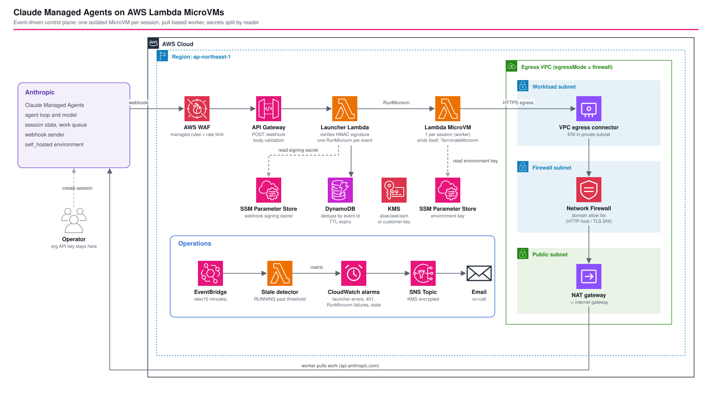

# Claude Managed Agents on AWS Lambda MicroVMs — Self-Hosted Sandboxes with an Event-Driven Control Plane

*Read this in other languages:* [](./README.ja.md) [](./README.md)


## Introduction

This reference implementation runs the tool-execution side of [Claude Managed Agents](https://platform.claude.com/docs/en/managed-agents/self-hosted-sandboxes) inside your own AWS account. Anthropic hosts the agent loop, the model, the session state and the work queue. Each session's tool calls run in a dedicated [AWS Lambda MicroVM](https://docs.aws.amazon.com/lambda/latest/dg/microvms-integrations-claude-managed-agents.html) that a webhook-driven launcher starts and that ends itself when the session is over.

It is a CDK (TypeScript) port of the AWS sample [sample-lambda-microvm-claude-managed-agents](https://github.com/aws-samples/sample-lambda-microvm-claude-managed-agents), which is written in SAM, with the production gaps closed: an outbound path restricted by domain, an optional customer managed KMS key, alarms, stale MicroVM detection, and a budget.

This architecture demonstrates:

- A single inbound path: one webhook (`session.status_run_started`), verified by HMAC signature inside the launcher, deduplicated by event ID, and answered with a non-2xx status on failure so Anthropic retries
- Secrets split by reader: the launcher reads only the webhook signing secret, the MicroVM reads only the environment key, and the organization API key never reaches AWS compute
- One MicroVM per session with three layers of lifetime control: the worker terminates itself, the idle policy reclaims it, and `maximumDurationInSeconds` caps it
- An egress mode switch: the AWS-managed `INTERNET_EGRESS` connector, or a VPC egress connector through AWS Network Firewall with a domain allow list
- An ingress mode switch: `ALL_INGRESS` as in the sample, or `NO_INGRESS` for a worker that only makes outbound calls
- Operations built in: alarms for rejected webhooks, `RunMicrovm` failures, quota and throttling errors, and MicroVMs that outlive the expected session length

## 📑 Table of Contents

- [Architecture Overview](#️-architecture-overview)
- [Design Decisions & Best Practices](#-design-decisions--best-practices)
- [Cost Optimization](#-cost-optimization)
- [Security Considerations](#-security-considerations)
- [Prerequisites](#-prerequisites)
- [Deployment Guide](#-deployment-guide)
- [Testing Strategy](#-testing-strategy)
- [Customization](#️-customization)
- [Deploy verification](#-deploy-verification)
- [Troubleshooting](#-troubleshooting)
- [Clean-up](#-clean-up)
- [References](#-references)

## 🏗️ Architecture Overview



The incoming side is one webhook. Everything after that is pull-based: the worker inside the MicroVM fetches work from Anthropic, so Anthropic never connects to the MicroVM.

```
Anthropic ──webhook──▶ WAF ─▶ API Gateway ─▶ Launcher Lambda ──RunMicrovm──▶ MicroVM (one per session)
                                              ├─ SSM: signing secret                ├─ SSM: environment key
                                              └─ DynamoDB: event-ID dedupe          ├─ pulls work from Anthropic (HTTPS)
                                                                                    └─ TerminateMicrovm on itself when done
```

### Key Components

- **WAF + API Gateway (REST)**: `POST /webhook` with body-schema validation, AWS managed rule groups (common, known bad inputs, IP reputation) and a per-IP rate limit. This is request hygiene, not authentication.
- **Launcher Lambda** (`src/launcher/index.ts`, Node.js 22, arm64): verifies the Standard Webhooks signature against the raw body, ignores every event except `session.status_run_started`, writes the event ID to DynamoDB with a conditional put, and calls `RunMicrovm`. The run hook payload contains only the session ID, the environment ID and the **name** of the environment-key parameter.
- **MicroVM image** (`AWS::Lambda::MicrovmImage`): built by the service from `src/microvm-image/` (Dockerfile plus the Node.js worker). The worker answers the lifecycle hooks, replies 200 to `/run` at once, reads the environment key with its own role, polls the work queue for exactly its session and handles the tool calls.
- **Execution role**: read access to one SecureString, log write, and `lambda:TerminateMicrovm`.
- **SSM Parameter Store SecureStrings**: the environment key and the webhook signing secret. CloudFormation cannot create SecureStrings, so `scripts/put-secrets.sh` writes them after the first deploy.
- **DynamoDB**: idempotency table, partition key `id`, TTL on `expiration`.
- **Stale detector** (EventBridge every 10 minutes → Lambda): lists the image's MicroVMs and publishes `RunningMicrovms` and `StaleMicrovms` metrics.
- **Alarms → SNS (KMS encrypted) → e-mail**, and an optional monthly AWS Budget.
- **Egress VPC** (only with `egressMode: 'firewall'`): VPC with a workload, a firewall and a public subnet, Network Firewall with a domain allow list, a NAT gateway, and an `AWS::Lambda::NetworkConnector` of type VPC egress.

### Architecture Characteristics

| Characteristic | Value | Rationale |
|---------------|-------|-----------|
| Availability | Regional managed services; one AZ for the optional egress VPC | The control plane has no server to fail over. The egress VPC is a single-AZ reference; production needs a firewall endpoint and a NAT gateway per AZ |
| Scalability | One MicroVM per session; concurrency is bounded by the account's MicroVM memory quota | Sessions are independent, so scale is a quota question. `RunMicrovm` is rate limited, and a non-2xx response makes Anthropic retry |
| Security | Signature-verified webhook, secrets split by reader, no organization API key on AWS | The launcher can start MicroVMs but cannot read the environment key; the MicroVM can read the key but cannot start MicroVMs |
| Cost | Billed while a MicroVM runs; the base cost is WAF, API Gateway and the alarms | A finished session terminates its own MicroVM |

## 🎯 Design Decisions & Best Practices

### 1. Webhook in, pull out

**Decision**: Anthropic delivers one webhook to the launcher, and the worker pulls work from Anthropic over outbound HTTPS.

**Rationale**:
- ✅ No inbound port on the MicroVM, so `ingressMode: 'none'` is possible
- ✅ The launcher stays small: verify, dedupe, start
- ✅ Retries are Anthropic's job: any non-2xx response redelivers the event

**Trade-offs**:
- ❌ The idle policy judges idleness by traffic to the MicroVM endpoint, and a pull-based worker has none (see decision 4)
- ❌ A MicroVM that cannot reach the Anthropic API exits at once, which is easy to cause by an egress allow list that is too narrow

### 2. Secrets split by reader

**Decision**: The launcher is granted `ssm:GetParameter` on the signing secret only, and the MicroVM execution role on the environment key only. The run hook payload carries the parameter **name**, never the value.

**Rationale**:
- ✅ A compromised launcher cannot impersonate the worker; a compromised MicroVM cannot forge webhooks
- ✅ `kms:Decrypt` is bounded by `kms:ViaService` and by the `PARAMETER_ARN` encryption context, so each role decrypts exactly one parameter even though the default `alias/aws/ssm` key ARN is not known at synthesis time

**Trade-offs**:
- ❌ The values are written outside CloudFormation (`scripts/put-secrets.sh`)

### 3. Idempotency on the webhook event ID

**Decision**: A conditional `PutItem` on the event ID before `RunMicrovm`, and the same ID as `clientToken`. If `RunMicrovm` fails, the record is deleted and the launcher answers 502.

**Rationale**:
- ✅ Retried and concurrent deliveries start exactly one MicroVM
- ✅ Deleting the record on failure lets the retry succeed instead of being swallowed as a duplicate

**Trade-offs**:
- ❌ One more table to run; the TTL equals the maximum MicroVM lifetime

### 4. Three-layer lifetime control

**Decision**: The worker calls `TerminateMicrovm` on itself when the session ends; `idlePolicy` is the fallback; `maximumDurationInSeconds` (default 4 hours, `microvm.maxLifetimeSeconds`) bounds everything.

**Rationale**:
- ✅ The main path releases compute at once
- ✅ Each fallback covers a different failure: a worker that crashed before terminating, and a session that never ends
- ✅ The stale detector turns a missed self-termination into an alarm

**Trade-offs**:
- ❌ The AWS documentation recommends `maxIdleDurationSeconds: 120` with `suspendedDurationSeconds: 0`. Idleness is judged by endpoint traffic, so a worker with no inbound traffic may be suspended and then terminated in the middle of a long tool call. The default here is 600 seconds and is a parameter. Confirm the behavior with a session that runs a tool for longer than the idle time before shortening it

### 5. Egress mode: managed connector or inspected VPC path

**Decision**: `network.egressMode` is `internet` (AWS-managed `INTERNET_EGRESS`, same as the sample) or `firewall`.

**Rationale**:
- ✅ `firewall` limits the MicroVM to the domains in `network.allowedDomains` (HTTP host and TLS SNI), so an agent that runs arbitrary tool code cannot reach arbitrary destinations
- ✅ The workload subnet has no internet route of its own: its default route goes to the firewall endpoint, the firewall subnet routes to the NAT gateway, and the public subnet routes the workload subnet CIDR back through the firewall so both directions of a flow see the same stateful engine
- ✅ The connector's security group allows TCP 443 outbound and nothing inbound

**Trade-offs**:
- ❌ A Network Firewall endpoint and a NAT gateway bill every hour (see [Cost Optimization](#-cost-optimization))
- ❌ The default allow list includes `.amazonaws.com` so the worker can reach SSM and `TerminateMicrovm`. Narrowing it to the exact endpoints, or adding VPC endpoints, is the next hardening step
- ❌ One AZ

### 6. Ingress mode

**Decision**: `network.ingressMode` is `all` (`ALL_INGRESS`, same as the sample) or `none` (`NO_INGRESS`).

**Rationale**:
- ✅ The worker never needs an inbound connection, so `none` removes the MicroVM endpoint as an attack surface

**Trade-offs**:
- ❌ Whether lifecycle hooks are still delivered with `NO_INGRESS` is a point to confirm on the first deploy (see [Deploy verification](#-deploy-verification))

### 7. Customer managed key (optional)

**Decision**: `secrets.useCustomerManagedKey: true` creates a key with rotation and an alias, and the IAM statements target that key instead of `*`. `put-secrets.sh` passes `--key-id` with the alias.

**Rationale**:
- ✅ The key policy becomes a second control over who can read the secrets, and decryption shows up in CloudTrail under a key you own

**Trade-offs**:
- ❌ $1 per key per month

### 8. Differences from the AWS sample

| Item | AWS sample (SAM + Python) | This pattern (CDK + TypeScript) |
| --- | --- | --- |
| Launcher | Python with Powertools | Node.js 22; the Anthropic TypeScript SDK verifies the signature; SDKs bundled |
| Idempotency | Powertools Idempotency | Conditional `PutItem`, record removed when `RunMicrovm` fails; `clientToken` set |
| Image build | `build-image.sh` and the CLI | `AWS::Lambda::MicrovmImage` in the stack, built from a CDK asset |
| Egress | `INTERNET_EGRESS` only | Switch to a VPC connector with Network Firewall |
| Ingress | `ALL_INGRESS` only | Switch to `NO_INGRESS` |
| Idle policy | 300 s idle, 60 s suspended | Parameters, 600 s idle, 0 s suspended |
| Maximum lifetime | 28,800 s | 14,400 s, a parameter |
| KMS | `alias/aws/ssm` | Optional customer managed key |
| Alarms, stale detection, budget | None | Included |
| WAF | Includes the SQL injection rule group | Common, known bad inputs, IP reputation and a rate limit |

The worker (`src/microvm-image/worker/worker.mjs`) and the Dockerfile are taken from the sample unchanged, so the behavior of the two can be compared.

### 9. Well-Architected Framework Alignment

| Pillar | Implementation |
|--------|---------------|
| **Operational Excellence** | Everything is CDK; alarms for rejected webhooks, launch failures, capacity errors and stale MicroVMs go to SNS; `scripts/e2e-check.sh` checks the control plane without touching Anthropic |
| **Security** | Signature verification on the raw body, secrets split by reader with `kms:Decrypt` bounded to one parameter, WAF, optional domain allow list and `NO_INGRESS`, optional customer managed key, CDK Nag `AwsSolutionsChecks` in both egress modes |
| **Reliability** | Idempotent launches, a record that is released when the launch fails, Anthropic's redelivery, three lifetime limits, a stale detector |
| **Performance Efficiency** | A snapshot-based MicroVM starts in seconds; the launcher is a 512 MB arm64 function; concurrency scales with the MicroVM quota |
| **Cost Optimization** | Pay only while a MicroVM runs, self-termination, a lifetime cap, a monthly budget, and a firewall that is off unless enabled |
| **Sustainability** | arm64 for the launcher and the worker image, no idle fleet |

## 💰 Cost Optimization

Unit prices differ by Region. Verify them on the AWS pricing pages before estimating a real workload. MicroVM compute below uses the US East (N. Virginia) list price: $0.0000276944 per vCPU-second plus $0.0000036667 per GiB-second.

| Item | Cost shape |
| --- | --- |
| MicroVM (1 vCPU, 2 GiB baseline) | About $0.126 per running hour. A 20-minute session is about $0.04 |
| API Gateway, Lambda, DynamoDB | Per request and on demand. A webhook arrives once per session, so these are cents per month |
| WAF | Web ACL and rules are billed per month plus per request |
| CloudWatch | Alarms (5) and log storage |
| KMS (optional) | $1 per key per month |
| Network Firewall (`firewall` mode) | About $0.4 per hour per endpoint plus a per-GB charge: roughly $290 per month if left running |
| NAT gateway (`firewall` mode) | About $0.06 per hour plus a per-GB charge: roughly $45 per month |

The egress VPC dominates the bill when it is on. `internet` mode has no hourly network cost. A second AZ roughly doubles the firewall and NAT charges.

Cost levers:

- `microvm.maxLifetimeSeconds` and `microvm.idlePolicy` bound the cost of a stuck session
- `operations.monthlyBudgetUsd` sends a notification at 80% and 100% (requires `operations.alarmEmail` and the `Project` cost allocation tag to be activated in Billing)
- `network.egressMode: 'internet'` for development, `firewall` where the allow list is a requirement

## 🔒 Security Considerations

### Network Security

1. **Inbound**: one public endpoint, `POST /webhook`, behind WAF. A request without a valid signature gets 401 and never reaches `RunMicrovm`. A body that does not match the schema gets 400 from API Gateway.
2. **Outbound**: `internet` allows any destination (sample behavior). `firewall` allows only `network.allowedDomains` over HTTP host and TLS SNI, and the connector's security group allows TCP 443 only.
3. **MicroVM ingress**: `NO_INGRESS` removes the per-MicroVM endpoint from reach.

### Security Best Practices Implemented

- ✅ Organization API key stays on the operator's machine (`scripts/create-session.mjs` is the only user)
- ✅ The launcher never reads the environment key; the MicroVM never reads the signing secret
- ✅ `kms:Decrypt` bounded by `kms:ViaService` and the `PARAMETER_ARN` encryption context
- ✅ Timestamp-checked signature verification (the SDK rejects stale deliveries)
- ✅ DynamoDB, SNS and the alarm topic key are encrypted; SNS requires TLS
- ✅ `lambda:PassNetworkConnector` limited to AWS-managed connectors and the one customer connector
- ✅ Every Lambda log group has a retention period
- ✅ Termination of the MicroVM is granted on `*` because MicroVM IDs do not exist before the run; the action is the only permission in that statement

### CDK Nag Compliance

```bash
npm run test:compliance -w claude-managed-agents-lambda-microvms
```

Both egress modes run through `AwsSolutionsChecks`. The suppressions (managed Lambda execution policies, run-time MicroVM IDs, HMAC instead of an authorizer, account-level API Gateway logging role) each carry a reason in `test/compliance/cdk-nag.test.ts`.

## 📋 Prerequisites

- AWS account in a Region where Lambda MicroVMs is available, and an AWS CLI that includes the `lambda-microvms` service model (`aws lambda-microvms help` works)
- Node.js 22 or later, AWS CDK 2.x, Git
- Claude Console: an agent (`agent_...`), a `self_hosted` environment (`env_...`), an environment key for it, and a webhook registration that returns a signing secret (`whsec_...`)
- Deployer permissions: CloudFormation, IAM, Lambda (including MicroVM images and network connectors), API Gateway, WAFv2, DynamoDB, SSM, KMS, CloudWatch, SNS, EventBridge, S3 (CDK assets), Budgets, and for `firewall` mode EC2 and Network Firewall

## 🚀 Deployment Guide

### 1. Clone and Setup

```bash
git clone https://github.com/ishiharatma/aws-cdk-reference-architectures.git
cd aws-cdk-reference-architectures/infrastructure
npm install
cd workspaces/claude-managed-agents-lambda-microvms
```

### 2. Configure Environment Parameters

Edit [parameters/dev-params.ts](parameters/dev-params.ts), or use the environment variables it reads: `ANTHROPIC_ENVIRONMENT_ID`, `EGRESS_MODE` (`internet` or `firewall`), `INGRESS_MODE` (`all` or `none`) and `ALARM_EMAIL`.

```bash
export ANTHROPIC_ENVIRONMENT_ID=env_...
export ALARM_EMAIL=you@example.com   # optional
```

### 3. Deploy the control plane and the image

```bash
export PROJECT=<project>  ENV=dev
npm run bootstrap
npm run stage:deploy:all
```

The `AWS::Lambda::MicrovmImage` resource builds the image during the deployment. The build log is in the `MicrovmLogGroupName` output.

### 4. Register the webhook and store the secrets

1. In the Claude Console, issue an environment key for the `self_hosted` environment.
2. Register the `WebhookUrl` stack output as a webhook that subscribes to `session.status_run_started`, and copy the signing secret.
3. Write both secrets (the script reads them from environment variables so they stay out of the shell history):

```bash
ENV_KEY=<environment-key> SIGNING_SECRET=whsec_... \
  ./scripts/put-secrets.sh <project>-dev-claude-managed-agents --profile <profile>
```

### 5. Verify

```bash
./scripts/e2e-check.sh <project>-dev-claude-managed-agents --profile <profile>
```

It checks that an unsigned webhook gets 401, that a malformed body gets 400, that the image is `CREATED`, and lists the worker MicroVMs. Then, from the operator machine only:

```bash
ANTHROPIC_API_KEY=sk-ant-... ANTHROPIC_ENVIRONMENT_ID=env_... AGENT_ID=agent_... \
  node scripts/create-session.mjs "List the files in the working directory"
aws lambda-microvms list-microvms --image-identifier <MicrovmImageArn output> --profile <profile>
aws logs tail <MicrovmLogGroupName output> --follow --profile <profile>
```

A `RUNNING` MicroVM appears within seconds of the session starting, runs the tool calls, and disappears when the session completes.

## 🧪 Testing Strategy

### Test Structure

```
test/
├── helpers.ts          # builds the stack with test parameters and overrides
├── parameters/         # static test parameters (deterministic snapshots)
├── snapshot/           # full template and resource counts, both egress modes
├── unit/               # stack.test.ts: resources, IAM split, routing, alarms; launcher.test.ts: launcher logic
└── compliance/         # CDK Nag AwsSolutionsChecks, both egress modes
```

### 1. Snapshot Tests

**Purpose**: detect template changes and resource-count drift (that is, cost drift) in `internet` and `firewall` modes. Asset hashes are normalized.

```bash
npm run test:snapshot
npm run test:snapshot:update   # after an intended change
```

### 2. Unit Tests

**Purpose**: the properties that carry the design.

**Test Categories**:
- ✅ MicroVM image hooks and port
- ✅ Secrets split by reader, `kms:Decrypt` conditions, customer managed key variant
- ✅ Launcher environment: connectors, idle policy, lifetime, parameter name instead of value
- ✅ Launcher logic with real Standard Webhooks signatures: unsigned, wrong secret and stale timestamp get 401; other events are ignored; a duplicate delivery starts nothing; a failed `RunMicrovm` releases the dedupe record and returns 502
- ✅ Webhook API: body validator, WAF association, rate limit
- ✅ Firewall mode: connector, rule group targets, route table targets, connector security group
- ✅ Alarms, metric filters, stale detector schedule, budget and optional settings

```bash
npm run test:unit
```

### 3. Compliance Tests

```bash
npm run test:compliance
```

## ⚙️ Customization

### Restrict the outbound domains

```typescript
network: {
  egressMode: 'firewall',
  ingressMode: 'none',
  allowedDomains: ['api.anthropic.com', 'ssm.ap-northeast-1.amazonaws.com', 'registry.npmjs.org'],
},
```

Add every destination a tool needs. A destination that is missing shows up as a `blocked` entry in the firewall alert log (the `FirewallAlertLogGroup` output).

### Session length and idle behavior

```typescript
microvm: {
  maxLifetimeSeconds: 7200,
  idlePolicy: { maxIdleDurationSeconds: 1800, suspendedDurationSeconds: 0, autoResumeEnabled: false },
},
```

### Customer managed key

```typescript
secrets: { useCustomerManagedKey: true },
```

### Tools for the agent

Add them to `src/microvm-image/Dockerfile` (arm64 builds, pinned versions) and redeploy. The image is rebuilt from the asset hash.

## ✅ Deploy verification

Deploy-verified on 2026-10-09 in `ap-northeast-1` (stack creation 264 s in `internet` mode, about 11 minutes with the egress VPC, whose network connector takes about 4 minutes). The stack was destroyed afterwards.

Confirmed:

- The image build reaches `CREATED` on the first deploy with the Dockerfile and worker unchanged from the sample
- An unsigned webhook returns 401 and a malformed body returns 400 (`scripts/e2e-check.sh`)
- A webhook signed with the stored signing secret starts a MicroVM through `RunMicrovm`. The `/run` hook is delivered, the worker reads the environment key with the execution role, reaches the Anthropic API, and terminates itself (`TERMINATED`)
- `ingressMode: 'none'` (`NO_INGRESS`) still delivers the `/run` hook
- In `firewall` mode the worker reaches SSM and the Anthropic API through the VPC connector and Network Firewall (the flow log shows the MicroVM ENI to ports 443). After `api.anthropic.com` is removed from the allow list, the worker's requests time out and the alert log records `blocked`, `not matching any TLS allowlisted FQDNs`, `api.anthropic.com`. A rule group change takes one to two minutes to apply

Not confirmed:

- A full session with a real environment key, signing secret and agent (the test used dummy secrets, so Anthropic answered `Invalid bearer token`)
- A tool call longer than `maxIdleDurationSeconds` under the idle policy

Defect found and fixed by the real deployment: the return route in the public subnet used the VPC CIDR as its destination, which already exists as the local route (`The route identified by ... already exists`). It now uses the workload subnet CIDR. Details are in `docs/knowledge/lambda-microvms.md`.

## 🔧 Troubleshooting

| Symptom | Cause and fix |
| --- | --- |
| Webhook returns 401 | The signing secret in SSM differs from the Console. Run `put-secrets.sh` again, and wait up to 5 minutes for the launcher's cache or redeploy |
| Webhook returns 400 | The body does not match the event schema (`type`, `id`, `created_at`, `data.type`, `data.id`) |
| Webhook returns 502 | `RunMicrovm` failed. See the launcher log and the `RunMicrovmFailed` alarm. Common causes: no `lambda:RunMicrovm`, `lambda:PassNetworkConnector` or `iam:PassRole`, a wrong image ARN, a quota |
| No MicroVM starts | The webhook is not subscribed to `session.status_run_started`, or Anthropic disabled the endpoint after repeated failures |
| MicroVM ends at once | The `/run` hook timed out (`runTimeoutInSeconds`), or the worker could not reach the Anthropic API (egress) |
| Image build fails | Read the build log group. A failed build with no log stream means the build role cannot write to the log group |
| Image build fails in `ARCHIVE_DOCKERFILE_NOT_FOUND` | The Dockerfile is not at the root of the asset |
| `put-secrets.sh` fails with `AccessDenied` on KMS | With a customer managed key, the caller needs `kms:Encrypt` on it |
| A MicroVM stays `RUNNING` | The `StaleMicrovms` alarm fires. Terminate it with `aws lambda-microvms terminate-microvm` and read the worker log |

## 🧹 Clean-up

```bash
npm run stage:destroy:all
```

Terminate any `RUNNING` MicroVMs first. The two SecureString parameters are not part of the stack; delete them with `aws ssm delete-parameter`. A customer managed key enters a 7-day pending-deletion period. Delete the webhook registration and the environment key in the Claude Console.

## 📚 References

- [Using Lambda MicroVMs as a sandbox for Claude Managed Agents](https://docs.aws.amazon.com/lambda/latest/dg/microvms-integrations-claude-managed-agents.html)
- [Running and using MicroVMs](https://docs.aws.amazon.com/lambda/latest/dg/microvms-launching.html)
- [Networking (Lambda MicroVMs)](https://docs.aws.amazon.com/lambda/latest/dg/microvms-networking.html)
- [MicroVM images](https://docs.aws.amazon.com/lambda/latest/dg/microvms-images.html)
- [Running self-hosted AI agent sandboxes with AWS Lambda MicroVMs (AWS Compute Blog)](https://aws.amazon.com/blogs/compute/running-self-hosted-ai-agent-sandboxes-with-aws-lambda-microvms/)
- [Claude Managed Agents: Self-hosted sandboxes](https://platform.claude.com/docs/en/managed-agents/self-hosted-sandboxes)
- [sample-lambda-microvm-claude-managed-agents (aws-samples)](https://github.com/aws-samples/sample-lambda-microvm-claude-managed-agents)
- [AWS Network Firewall: domain list rule groups](https://docs.aws.amazon.com/network-firewall/latest/developerguide/stateful-rule-groups-domain-names.html)
