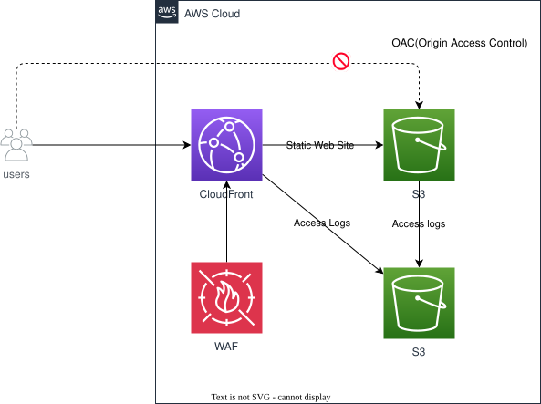

# CloudFront S3 Static Website — Private S3 Origin with OAC, Cross-Region WAF, and Security Headers

*Read this in other languages:* [](./README.ja.md) [](./README.md)


## Introduction

This is a reference implementation of a static website served over HTTPS through **Amazon CloudFront**, backed by a fully private S3 bucket reachable only via **Origin Access Control (OAC)**. It is the HTTPS/CDN evolution of the simpler [`s3-static-web-site`](../s3-static-web-site/) pattern in this repository.

This architecture demonstrates:

- A private S3 bucket (no website hosting, no public access) served through CloudFront via Origin Access Control
- A `ResponseHeadersPolicy` that adds a Content-Security-Policy and other security headers, and hides the `Server` response header
- SPA-friendly routing: `403`/`404` responses from S3 are rewritten to `index.html` with a `200`, while real `5xx` origin/edge failures keep their original status code and are shown a dedicated error page
- An optional WAFv2 Web ACL, deployed as its own **cross-region (`us-east-1`)** stack because CloudFront-scoped Web ACLs can only be created there, with an IP allow-list evaluated either before or after AWS's managed rule groups
- Direct WAF-to-S3 log delivery with `redactedFields` masking `authorization`/`cookie` headers
- Two-letter country allow-list geo restriction and TLS 1.3 (2025) as the minimum viewer protocol

### Why this pattern?

| Feature | Benefit |
| ------- | ------- |
| Private bucket + OAC | Unlike S3 website hosting, the bucket itself is never publicly reachable — only the CloudFront distribution's OAC identity can read it, and S3 Block Public Access stays fully enabled |
| Cross-region WAF stack | The Web ACL, and the IP-set/logging resources it needs, are isolated into a stack forced into `us-east-1`, with its ARN handed to the main stack via `crossRegionReferences: true` — the pattern to reuse whenever a CLOUDFRONT-scoped WAFv2 resource is needed alongside a distribution deployed elsewhere |
| SPA-friendly error mapping, without hiding real failures | `403`/`404` (missing object / no public access) are rewritten to the SPA's `index.html`; `500`–`504` (real origin/edge errors) keep their status code and get a distinct friendly page instead of a raw error body |
| `approvalTopicArn`-style single-flag toggles | `enableWaf` and `geoRestrictionCountries` are each a single optional parameter — omit them and the corresponding resource/restriction simply isn't created |

## Architecture Overview



### Key Components

| Component | Design Points |
| --------- | -------------- |
| `WebsiteBucket` | `createAccountRegionalBucket` (not the website-hosting variant) — fully private, `blockPublicAccess: BLOCK_ALL`, `enforceSSL: true`; readable only by the distribution via OAC |
| `AccessLogBucket` | Receives both S3 server access logs and CloudFront access logs; `accessControl: LOG_DELIVERY_WRITE` + `objectOwnership: BUCKET_OWNER_PREFERRED`, both required for CloudFront's log delivery service (`awslogsdelivery`) to write into it |
| `ResponseHeadersPolicy` | CSP (`default-src 'self'`, no inline scripts/styles), `X-Frame-Options: DENY`, `Referrer-Policy: no-referrer`, HSTS (1 year, includeSubDomains, preload), `X-Content-Type-Options`, and an empty `Server` header override |
| `WebsiteDistribution` | `PriceClass.PRICE_CLASS_100`, `TLS_V1_3_2025` minimum protocol, `S3BucketOrigin.withOriginAccessControl`, `CACHING_OPTIMIZED` cache policy, optional `webAclId` and `geoRestriction` |
| `CloudfrontWafStack` (us-east-1) | Optional (`enableWaf`); WAFv2 Web ACL with 5 AWS managed rule groups plus before/after-rules IP allow-lists; direct-to-S3 log delivery |
| `WafLogBucket` (in `CloudfrontWafStack`) | Bucket name forced to start with the mandatory `aws-waf-logs-` prefix; receives WAF logs with `authorization`/`cookie` headers redacted |

## Data Flow

```text
Viewer
  │  HTTPS (TLS 1.3 minimum), optionally geo-restricted
  ▼
CloudFront Distribution
  ├─ WAFv2 Web ACL (optional, us-east-1): managed rule groups + IP allow-list → default action: block
  ├─ ResponseHeadersPolicy: CSP + security headers applied to every response
  ├─ Default behavior ("/*")
  │     └─ S3 Origin (OAC) ───────────────────► WebsiteBucket (private)
  │
  └─ Error handling
        ├─ 403 / 404  → /index.html, HTTP 200 (SPA client-side routing), 5-minute TTL
        └─ 500-504    → /error.html, original status code preserved, 1-minute TTL
```

## Implementation Highlights

### 1. A fully private origin, reachable only through OAC

`WebsiteBucket` uses the same `createAccountRegionalBucket` helper as every other non-website bucket in this repository — `enforceSSL: true`, `blockPublicAccess: BLOCK_ALL`, no website hosting configuration at all. The only reader is the CloudFront distribution itself, via `S3BucketOrigin.withOriginAccessControl`, which provisions the OAC and the bucket policy statement scoped to the distribution's ARN automatically.

```typescript
const distribution = new cloudfront.Distribution(this, 'WebsiteDistribution', {
  defaultBehavior: {
    origin: cloudfrontOrigins.S3BucketOrigin.withOriginAccessControl(websiteBucket),
    viewerProtocolPolicy: cloudfront.ViewerProtocolPolicy.REDIRECT_TO_HTTPS,
    // ...
  },
});
```

Contrast this with [`s3-static-web-site`](../s3-static-web-site/), where the bucket is configured for website hosting and is (conditionally) public — the two workspaces intentionally show both ends of the "who can read this bucket" spectrum.

### 2. Response headers policy: CSP, HSTS, and hiding the `Server` header

Every response gets a strict `Content-Security-Policy` (`default-src 'self'`, no `'unsafe-inline'`), `X-Frame-Options: DENY`, `Referrer-Policy: no-referrer`, a one-year HSTS header with `preload`, and the `Server` response header explicitly overridden to an empty value:

```typescript
customHeadersBehavior: {
  customHeaders: [
    { header: 'server', value: '', override: true }, // Hide server information for security reasons
  ],
},
```

### 3. SPA-friendly error mapping that still surfaces real failures

`403`/`404` from S3 (a missing object, or OAC rejecting a request that isn't actually from CloudFront) are rewritten to `index.html` with a `200`, which is what makes client-side routing (React Router, etc.) work when a user deep-links to a path that doesn't exist as an S3 object. Genuine `5xx` errors are treated differently — they keep their original status code and are shown `error.html` instead of a raw CloudFront error page, so operators/monitoring still see the real failure:

```typescript
errorResponses: [
  { httpStatus: 403, responseHttpStatus: 200, responsePagePath: '/index.html', ttl: cdk.Duration.minutes(5) },
  { httpStatus: 404, responseHttpStatus: 200, responsePagePath: '/index.html', ttl: cdk.Duration.minutes(5) },
  // 5xx are real origin/edge failures (not SPA routing), so keep the original status code
  // and just replace the body with a friendly page instead of leaking origin error details.
  ...[500, 502, 503, 504].map((httpStatus) => ({
    httpStatus, responseHttpStatus: httpStatus, responsePagePath: '/error.html', ttl: cdk.Duration.minutes(1),
  })),
],
```

### 4. WAFv2 forced into `us-east-1`, wired back via `crossRegionReferences`

A Web ACL with `scope: 'CLOUDFRONT'` (and any IP sets it references) can only be created in `us-east-1`, regardless of which region the distribution or the rest of the app is deployed to. `CloudfrontWafStack` is therefore its own stack, always deployed with `env: { region: 'us-east-1' }`, and its `webAclArn` output is passed to the main stack across regions using `crossRegionReferences: true` on both stacks:

```typescript
const wafStack = new CloudfrontWafStack(this, pascalCase(`${props.project}Waf`), {
  env: { account: props.params.accountId, region: 'us-east-1' },
  crossRegionReferences: true,
  enableWaf: props.params.enableWaf,
  allowedIpsAfterRules: props.allowedIps,
});

const mainStack = new CloudfrontS3StaticWebsiteStack(this, pascalCase(`${props.project}Main`), {
  webAclArn: wafStack.webAclArn,
  crossRegionReferences: true,
});
mainStack.addDependency(wafStack);
```

When `enableWaf` is `false` (or omitted), `CloudfrontWafStack` still deploys (so its outputs remain resolvable) but creates no Web ACL at all, and `webAclArn` resolves to an empty string, leaving the distribution without a `webAclId`.

### 5. IP allow-listing before *or* after the managed rule groups

The Web ACL's `defaultAction` is `block`, so an explicit `Allow` rule is required for any traffic to get through at all. Two independent allow-list rules are supported:

- **`AllowSpecificIPsBeforeRules`** (priority 1, only created if configured): bypasses the managed rule groups entirely — useful for trusted internal IPs that shouldn't be evaluated against the Common/KnownBadInputs/AdminProtection/IpReputation/AnonymousIp managed rule sets.
- **`AllowSpecificIPsAfterRules`** (priority 100, always created): evaluated *after* the managed rule groups. If neither `allowedIpsAfterRules` nor `allowedIpv6sAfterRules` is set, this rule defaults to allowing the entire IPv4 **and** IPv6 address space (as two `/1` CIDR blocks each, since WAF rejects a `/0` CIDR) — i.e. "no restriction, but still run the managed rules."

```typescript
addresses: props.allowedIpsAfterRules
  ? props.allowedIpsAfterRules.map(ip => `${ip}/32`)
  : ['0.0.0.0/1', '128.0.0.0/1'], // full IPv4 range, split because WAF rejects /0
```

### 6. WAF logs delivered straight to S3, with sensitive headers redacted

WAF's direct-to-S3 log delivery requires the destination bucket name to start with `aws-waf-logs-` and a specific bucket policy shape granting `delivery.logs.amazonaws.com` scoped `PutObject`/`GetBucketAcl` access. The `authorization` and `cookie` headers are masked before they ever reach the log:

```typescript
redactedFields: [
  { singleHeader: { Name: 'authorization' } },
  { singleHeader: { Name: 'cookie' } },
],
```

## Deployment Guide

### 1. Clone and Setup

```bash
git clone <this-repository>
cd infrastructure
npm install
```

### 2. Configure Environment Parameters

Edit [`parameters/dev-params.ts`](./parameters/dev-params.ts):

```typescript
const devParams: EnvParams = {
  region: process.env.CDK_DEFAULT_REGION || 'ap-northeast-1',
  enableWaf: true,                        // omit/false to skip the Web ACL entirely
  geoRestrictionCountries: ['JP'],        // omit/empty to allow all countries
};
```

### 3. Deploy

```bash
export PROJECT=your-project
export ENV=dev

npm run bootstrap   # first time only
npm run diff
npm run stage:deploy:all
```

### WAF allowed IPs (v4/v6)

This workspace's CloudFront distribution has a WAFv2 Web ACL attached. By default, only the global IP of the machine running `cdk deploy` is added to the post-managed-rules allowlist (`bin/cloudfront-s3-static-website.ts` auto-detects it via `curl`). IPv6 is attempted via `curl -6` and silently skipped when unavailable (e.g. devcontainers/CI without IPv6 egress), in which case only the IPv4 address is allowed.

To allow specific IPs instead of auto-detection (e.g. the IP of the machine where you actually open the browser), set the `ALLOWED_IPS` / `ALLOWED_IPV6S` environment variables (comma-separated for multiple values). When set, the auto-detection `curl` call is skipped entirely.

```bash
ALLOWED_IPS=203.0.113.10,203.0.113.20 \
ALLOWED_IPV6S=2001:db8::1 \
npm run stage:deploy:all
```

If neither is set nor auto-detected, the WAF IP restriction falls back to "allow all" (still subject to the managed rule groups).

### 4. Verify Deployment

```bash
aws cloudformation describe-stacks \
  --stack-name <ProjectName>Main \
  --query 'Stacks[0].Outputs'
```

```bash
curl https://<WebsiteDistributionDomainName-from-output>/
```

## Usage

Open `WebsiteDistributionUrl` (from the stack outputs) in a browser. If `enableWaf: true` and your IP isn't allow-listed, or your country isn't in `geoRestrictionCountries`, CloudFront/WAF will reject the request before it reaches the origin.

## Testing

```bash
npm test -w workspaces/cloudfront-s3-static-website              # all tests
npm run test:unit -w workspaces/cloudfront-s3-static-website      # unit tests
npm run test:snapshot -w workspaces/cloudfront-s3-static-website  # snapshot tests
npm run test:compliance -w workspaces/cloudfront-s3-static-website # cdk-nag checks
```

- [`test/unit/cloudfront-waf-stack.test.ts`](./test/unit/cloudfront-waf-stack.test.ts) has fine-grained assertions on the Web ACL, its rule priorities/actions, the before/after-rules allow-list behavior, and WAF log delivery (bucket naming, redaction, policy ordering).
- [`test/compliance/cdk-nag.test.ts`](./test/compliance/cdk-nag.test.ts) runs `AwsSolutionsChecks` against both `CloudfrontWafStack` and `CloudfrontS3StaticWebsiteStack`, with resource-scoped suppressions (e.g. `AwsSolutions-CFR4` — the default CloudFront certificate is pinned to TLSv1 regardless of `minimumProtocolVersion`, since no custom domain/ACM certificate is configured here).
- `test/unit/cloudfront-s3-static-website.test.ts` is still the unfilled project template and does not currently assert against `CloudfrontS3StaticWebsiteStack`; the snapshot and compliance tests above are what actually exercise it today.

## Customization

### Restricting to fewer/more countries

```typescript
// parameters/dev-params.ts
geoRestrictionCountries: ['JP', 'US'],
```

### Disabling WAF entirely

```typescript
// parameters/dev-params.ts
enableWaf: false,
```

### Allowing traffic in before the managed rules run

```typescript
// lib/stages/cloudfront-s3-static-website-stage.ts
allowedIpsBeforeRules: props.allowedIps, // currently commented out in the stage
```

### Adding a custom domain

This stack currently serves traffic from the CloudFront default domain (`*.cloudfront.net`), which is also why `AwsSolutions-CFR4` is suppressed rather than fixed. To add a custom domain, supply an ACM certificate (in `us-east-1`) and a `domainNames`/`certificate` pair to the `Distribution` construct, then add a Route 53 alias record.

## Cost Optimization

### Estimated Monthly Costs (ap-northeast-1, low traffic)

```
CloudFront (low request volume, minimal data transfer)    ≈ $1-2
AWS WAF (Web ACL + 6 rules, low request volume)            ≈ $8.00
S3 (2 buckets, a few MB of content + access/WAF logs)      < $0.10
-------------------------------------------------------------------
Total (with WAF enabled)                                   ≈ $9-10/month
Total (enableWaf: false)                                   ≈ $1-2/month
```

> WAF is billed per Web ACL, per rule, and per request evaluated — it is the dominant cost at low traffic. Set `enableWaf: false` for a pure-demo deployment where the IP/geo restriction isn't needed.

## Security Considerations

- ✅ `WebsiteBucket` is never publicly reachable — `blockPublicAccess: BLOCK_ALL` plus OAC means only the specific CloudFront distribution can read it
- ✅ TLS 1.3 (2025) is the minimum protocol version accepted from viewers
- ✅ Strict CSP and security headers (HSTS, `X-Frame-Options: DENY`, `X-Content-Type-Options`) applied via `ResponseHeadersPolicy` to every response, regardless of origin behavior
- ✅ Optional WAFv2 Web ACL with AWS managed rule groups (Common, KnownBadInputs, AdminProtection, IP Reputation, Anonymous IP) evaluated ahead of the IP allow-list
- ✅ WAF logs redact `authorization`/`cookie` headers before they reach the log bucket
- ⚠️ No custom domain/ACM certificate is configured, so `AwsSolutions-CFR4` is suppressed rather than fixed — the distribution's default certificate is pinned to TLSv1 for SNI-less clients regardless of `minimumProtocolVersion`. Attach a custom domain with an ACM certificate to close this gap in production.
- ⚠️ Geo restriction is not enabled by default (`AwsSolutions-CFR1` is suppressed) — set `geoRestrictionCountries` if the site should not be reachable from every country.

## Troubleshooting

### Issue: Deploy fails with a cross-region reference error

**Symptoms**: An error referencing `crossRegionReferences` or an unresolved token from `CloudfrontWafStack`.

**Solutions**:
1. Confirm `crossRegionReferences: true` is set on **both** `CloudfrontWafStack` and `CloudfrontS3StaticWebsiteStack` (see [`lib/stages/cloudfront-s3-static-website-stage.ts`](./lib/stages/cloudfront-s3-static-website-stage.ts))
2. Cross-region references require the CDK bootstrap stack to support them — re-run `npm run bootstrap` if the target account/region was bootstrapped with an older CDK version

### Issue: `WebACL` creation fails with "The scope is not valid"

**Symptoms**: `CloudfrontWafStack` fails to deploy with this WAFv2 error.

**Solutions**:
1. Confirm the stack's `env.region` is `us-east-1` — a `scope: 'CLOUDFRONT'` Web ACL can only be created there, independent of where the CloudFront distribution or the rest of the app lives

### Issue: Site returns `403` from WAF instead of loading

**Symptoms**: The browser gets a generic `403 Forbidden` before ever reaching CloudFront's own error pages.

**Solutions**:
1. Check whether your current IP is in the after-rules allow-list — see [WAF allowed IPs](#waf-allowed-ips-v4v6) above
2. Check whether your request originates from a country not in `geoRestrictionCountries`

## Clean-up

```bash
export PROJECT=your-project
export ENV=dev
npm run stage:destroy:all
```

> CloudFront distribution deletion takes time (the distribution must be disabled and fully propagated before it can be deleted), so `cdk destroy` may take several minutes to complete.

## References

### AWS Documentation
- [Restricting access to an Amazon S3 origin with OAC](https://docs.aws.amazon.com/AmazonCloudFront/latest/DeveloperGuide/private-content-restricting-access-to-s3.html)
- [Adding a response headers policy](https://docs.aws.amazon.com/AmazonCloudFront/latest/DeveloperGuide/response-headers-policies.html)
- [AWS WAF developer guide](https://docs.aws.amazon.com/waf/latest/developerguide/waf-chapter.html)
- [Restricting the geographic distribution of content](https://docs.aws.amazon.com/AmazonCloudFront/latest/DeveloperGuide/georestrictions.html)

### AWS CDK
- [aws-cloudfront-origins module](https://docs.aws.amazon.com/cdk/api/v2/docs/aws-cdk-lib.aws_cloudfront_origins-readme.html)
- [Working with cross-region references in the CDK](https://docs.aws.amazon.com/cdk/v2/guide/environments.html)
- [CDK Nag](https://github.com/cdklabs/cdk-nag)

### Related Architectures
- [`s3-static-web-site`](../s3-static-web-site/) — the plain S3 website-hosting version of this same site, without CloudFront/WAF
- [`cicd-cloudfront-s3`](../cicd-cloudfront-s3/) — a CI/CD pipeline that deploys content into this workspace's bucket/distribution
- [`cloudfront-vpc-origin`](../cloudfront-vpc-origin/) — a more advanced CloudFront pattern that adds a VPC Origin to an internal ALB alongside an S3 origin

## 📄 License

This project is licensed under the MIT License - see the [LICENSE](../../../LICENSE) file for details.

## 👥 Contributing

Contributions are welcome! Please read [CONTRIBUTING.md](../../../docs/contribution/CONTRIBUTING.md) for details.

## 🏆 About This Reference Architecture

This reference architecture demonstrates AWS CDK best practices for serving a static site through CloudFront with a fully private S3 origin, cross-region WAF resources, and defense-in-depth security headers.

**Target Level**: 200 (Intermediate)

---

**Note**: This is a reference implementation. Always review and customize according to your specific requirements and organizational policies before deploying to production.
