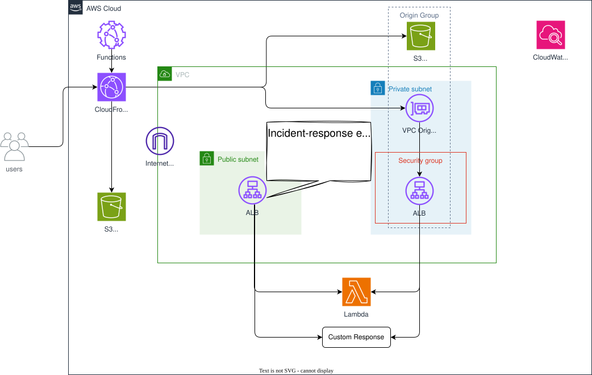

# CloudFront VPC Origin — CloudFront in Front of S3 Static Hosting and an ALB (with an Incident-Response Escape Hatch)

*Read this in other languages:* [](./README.ja.md) [](./README.md)


## Introduction

This project is a reference implementation that puts a single Amazon CloudFront distribution in front of two different kinds of origins: a private S3 bucket serving a static website, and a **private, internal** Application Load Balancer that CloudFront reaches through a **VPC Origin**.

This architecture demonstrates the following implementations:

- Serving a static website from a private S3 bucket through CloudFront using Origin Access Control (OAC)
- Connecting CloudFront directly to an internal (non-internet-facing) ALB via a VPC Origin, with no public IP and no NAT Gateway required
- Automatic failover from the ALB to a static fallback page using a CloudFront Origin Group
- Path-based routing on the ALB itself (fixed response, custom HTML response, Lambda-backed response)
- Restricting delivery to an explicit allow-list of countries with CloudFront geo restriction
- Optional viewer IP allow-listing at the edge with a CloudFront Function, with denied requests logged to CloudWatch Logs through CloudFront standard logging (v2)
- TLS 1.3 (2025) as the minimum viewer protocol

## Architecture Overview



### Key Design Benefits

| Feature | Benefit |
| ------- | ------- |
| VPC Origin | CloudFront reaches a private ALB directly — no public IP and no NAT Gateway needed for inbound traffic |
| Origin Group failover | Visitors see a friendly static page instead of a raw 502/503 when the ALB is unhealthy or unreachable |
| Edge IP allow-listing | Requests from disallowed IPs are rejected at the edge, before they ever reach the ALB or S3 |
| Geo restriction | Content is only served to an explicit allow-list of countries |
| OAC-secured S3 origins | Both the website and error buckets stay fully private; only CloudFront can read them |

## Prerequisites

- AWS CLI v2 installed and configured
- Node.js 20 or later
- AWS CDK CLI (`npm install -g aws-cdk`)
- Basic knowledge of TypeScript
- AWS account (this stack creates an ALB and a VPC, which are billed hourly — see [Cost Estimation](#cost-estimation))

## Project Directory Structure

```text
cloudfront-vpc-origin/
├── bin/
│   └── cloudfront-vpc-origin.ts             # Application entry point
├── lib/
│   └── stacks/
│          ├── cloudfront-vpc-origin-stack.ts    # VPC, ALB, S3 buckets, CloudFront
│          ├── cloudfront-log-delivery-stack.ts  # us-east-1: CloudFront Function log delivery
│          └── cloudfront-monitoring-stack.ts    # us-east-1: 5xx error rate alarm + SNS topic
├── parameters/
│   ├── environments.ts                 # Environment parameter type
│   ├── dev-params.ts                   # Development environment parameters
│   └── index.ts                        # Parameter exports
├── test/
│   ├── compliance/
│   │      └── cdk-nag.test.ts          # cdk-nag compliance checks
│   ├── snapshot/
│   │      └── snapshot.test.ts         # Snapshot test
│   └── unit/
│          ├── cloudfront-vpc-origin.test.ts # Fine-grained assertions
│          └── cloudfront-monitoring.test.ts # Alarm / SNS assertions
├── cdk.json
├── package.json
└── tsconfig.json
```

> Static site content served by this stack lives outside this workspace: `frontend/static-web` (the default page) and `frontend/error-website` (the fallback page shown when the ALB origin cannot be reached).

## Data Flow

```text
Viewer
  │  HTTPS (TLS 1.3 minimum, geo-restricted to JP/US/GB/CA/AU/NZ/IE)
  ▼
CloudFront Distribution
  ├─ CloudFront Function (optional): denies viewers whose IP is not allow-listed
  │
  ├─ Default behavior ("/*")
  │     └─ S3 Origin (OAC) ─────────────────► WebsiteBucket (private)
  │
  └─ Behavior ("/alb/*")
        └─ Origin Group
              ├─ Primary:  VPC Origin ──────► Internal ALB (private subnet)
              │                                 ├─ "/" (default)     → fixed text response
              │                                 ├─ "/alb/custom*"    → fixed HTML response
              │                                 └─ "/alb/lambda*"    → Lambda function target
              └─ Fallback (403/404/500/502/503/504): S3 Origin (OAC) ─► ErrorBucket (private)
```

The ALB's security group only accepts inbound traffic on port 80 from the AWS-managed CloudFront prefix list, so the ALB cannot be reached directly — even though CloudFront itself is reachable from the internet. This holds in both of the ALB's two modes (see [Incident-Response Escape Hatch](#6-incident-response-escape-hatch-publicalbfailover) below): normally the ALB is internal and reachable only through the VPC Origin; with `publicAlbFailover.enabled: true` it becomes internet-facing, but the security group still only admits the CloudFront prefix list, so it is still never reachable directly by clients.

## Key Components and Design Points

| Component | Design Points |
| --------- | ------------- |
| VPC | Multi-AZ, public + private-isolated subnets (shared `VpcConstruct`) |
| ALB | Internal by default (`internetFacing: false`) in private-isolated subnets; internet-facing in public subnets when `publicAlbFailover.enabled: true` |
| ALB Security Group | Inbound port 80 restricted to the CloudFront managed prefix list only, in both ALB modes |
| ALB Listener | Default fixed response, `/alb/custom*` fixed HTML response, `/alb/lambda*` routed to a Lambda target |
| WebsiteBucket / ErrorBucket | Private S3 buckets, `enforceSSL: true`, content deployed via `BucketDeployment`, read only by CloudFront through OAC |
| CloudFront Distribution | TLS 1.3 (2025) minimum, IPv6 disabled, geo restriction allow-list, dedicated access-log bucket |
| CloudFront Origin Group (`/alb/*`) | Normally VPC Origin (primary) → S3 error page (fallback); with `publicAlbFailover.enabled: true`, a plain public HTTP origin (primary) → VPC Origin (fallback) — the VPC Origin registration is never deleted |
| CloudFront Function | Optional viewer IP allow-list, evaluated at `viewer-request` |
| Standard logging (v2) | Delivers denied-request log data from the CloudFront Function to a CloudWatch Logs log group |
| CloudfrontMonitoringStack (us-east-1) | CloudWatch alarm on the distribution's 5xx error rate, notifying an SNS topic |

## Implementation Highlights

### 1. An ALB reachable only from CloudFront

The ALB is internal and its security group only opens port 80 to the AWS-managed CloudFront prefix list — nothing else can reach it, even inside the VPC's public subnet:

```typescript
const albSecurityGroup = new ec2.SecurityGroup(this, 'AlbSecurityGroup', {
  vpc: this.vpc.vpc,
  allowAllOutbound: true,
});

albSecurityGroup.addIngressRule(
  ec2.Peer.prefixList(props.cloudfrontManagedPrefixList),
  ec2.Port.tcp(80),
  'Allow inbound HTTP traffic from CloudFront managed prefix list'
);

const alb = new elbv2.ApplicationLoadBalancer(this, 'Alb', {
  vpc: this.vpc.vpc,
  internetFacing: false,
  securityGroup: albSecurityGroup,
  vpcSubnets: { subnetType: ec2.SubnetType.PRIVATE_ISOLATED },
});
```

> **Note**: The managed prefix list ID (`cloudfrontManagedPrefixList`) is region-specific. Look it up before deploying:
>
> ```bash
> aws ec2 describe-managed-prefix-lists \
>   --filters "Name=prefix-list-name,Values=com.amazonaws.global.cloudfront.origin-facing"
> ```

### 2. Path-based routing on the ALB listener

Three listener actions demonstrate different response types behind the same ALB:

```typescript
listener.addAction('DefaultAction', {
  action: elbv2.ListenerAction.fixedResponse(200, {
    contentType: 'text/plain',
    messageBody: 'CloudFront with VPC Origin and ALB!',
  }),
});

listener.addAction('CustomPageAction', {
  action: elbv2.ListenerAction.fixedResponse(200, {
    contentType: 'text/html',
    messageBody: '<html><body><h1>Custom Page</h1></body></html>',
  }),
  conditions: [elbv2.ListenerCondition.pathPatterns(['/alb/custom*'])],
  priority: 10,
});

listener.addTargets('LambdaTarget', {
  targets: [new elbv2_targets.LambdaTarget(albLambdaFunction)],
  conditions: [elbv2.ListenerCondition.pathPatterns(['/alb/lambda*'])],
  priority: 20,
});
```

### 3. VPC Origin and Origin Group failover to a static error page

CloudFront reaches the internal ALB through a **VPC Origin** — no public IP, no NAT Gateway. If the ALB is unavailable, CloudFront automatically fails over to a static page in the `ErrorBucket`:

```typescript
const originGroup = new cloudfront_origins.OriginGroup({
  primaryOrigin: cloudfront_origins.VpcOrigin.withApplicationLoadBalancer(alb, {
    httpPort: 80,
  }),
  fallbackOrigin: cloudfront_origins.S3BucketOrigin.withOriginAccessControl(errorBucket),
  fallbackStatusCodes: [403, 404, 500, 502, 503, 504],
});

distribution.addBehavior('/alb/*', originGroup, {
  viewerProtocolPolicy: cloudfront.ViewerProtocolPolicy.REDIRECT_TO_HTTPS,
});
```

### 4. CloudFront distribution defaults

The default behavior serves the static site straight from S3 via OAC, with a modern TLS policy and an explicit country allow-list:

```typescript
const distribution = new cloudfront.Distribution(this, 'Distribution', {
  minimumProtocolVersion: cloudfront.SecurityPolicyProtocol.TLS_V1_3_2025,
  enableIpv6: false,
  enableLogging: true,
  geoRestriction: cloudfront.GeoRestriction.allowlist('JP', 'US', 'GB', 'CA', 'AU', 'NZ', 'IE'),
  defaultBehavior: {
    origin: cloudfront_origins.S3BucketOrigin.withOriginAccessControl(websiteBucket),
    viewerProtocolPolicy: cloudfront.ViewerProtocolPolicy.REDIRECT_TO_HTTPS,
  },
  logBucket: cloudFrontLogBucket,
  logFilePrefix: `${props.project}-${props.environment}/cloudfront-logs/`,
  logIncludesCookies: true,
});
```

> **Note**: CloudFront's legacy standard access logging (`logBucket`) writes via the S3 "log delivery" canned ACL. The log bucket must therefore set `objectOwnership: OBJECT_WRITER` and `accessControl: LOG_DELIVERY_WRITE` — the default (ACLs disabled / bucket-owner-enforced) bucket rejects those writes.

### 5. Optional viewer IP allow-listing with a CloudFront Function

When `allowedIps` is provided, a CloudFront Function runs on every viewer request and denies IPs that are not on the list. `bin/cloudfront-vpc-origin.ts` calls a helper that auto-detects the deploying operator's current global IP, so a fresh `cdk deploy` allow-lists whoever is running it:

```typescript
allowedIps: [getMyGlobalIp()],
```

```typescript
function handler(event) {
  var request = event.request;
  var allowedIps = ['203.0.113.10']; // baked in at synth time
  if (!allowedIps.includes(request.clientIp)) {
    cf.logCustomData(JSON.stringify({ clientIp: request.clientIp, allowedIps: allowedIps }));
    return { statusCode: 403, statusDescription: 'Forbidden', body: 'Access denied' };
  }
  return request;
}
```

When no `allowedIps` are configured, no CloudFront Function is created at all — the distribution is open to every viewer (subject to the geo restriction).

Denied-request data (`cf.logCustomData`) is delivered to a dedicated CloudWatch Logs log group via CloudFront **standard logging v2**, so you can investigate who was blocked and why:

```typescript
const logDeliverySource = new logs.CfnDeliverySource(this, 'CloudFrontLogDeliverySource', {
  logType: 'ACCESS_LOGS',
  resourceArn: distribution.distributionArn,
});
const logDeliveryDestination = new logs.CfnDeliveryDestination(this, 'CloudFrontLogDeliveryDestination', {
  destinationResourceArn: denyAccessLogGroup.logGroupArn,
});
new logs.CfnDelivery(this, 'CloudFrontLogDelivery', {
  deliverySourceName: logDeliverySource.name,
  deliveryDestinationArn: logDeliveryDestination.attrArn,
  recordFields: ['date', 'time', 'c-ip', 'cs-method', 'cs-uri-stem', 'sc-status', 'cache-behavior-path-pattern', 'viewer-request-log-data'],
});
```

### 6. Incident-Response Escape Hatch (`publicAlbFailover`)

On 2026-07-16, AWS CloudFront had a multi-hour outage in which customers using **VPC Origins** saw a spike in 5xx errors — the VPC Origin connectivity layer itself was degraded, independent of anything in a customer's own stack. AWS's own guidance during the incident was that customers who could, should temporarily switch away from VPC Origin connectivity, then revert once the issue was resolved.

This stack builds that switch in as a parameter, `publicAlbFailover`, rather than requiring a manual CloudFormation change under pressure during an incident:

```typescript
// Always registered, regardless of publicAlbFailover, so it's ready to route back to instantly.
const vpcOriginAlb = cloudfront_origins.VpcOrigin.withApplicationLoadBalancer(alb, { httpPort: 80, /* ... */ });

// Reaches the same ALB as a plain public HTTP origin instead.
const publicAlbOrigin = new cloudfront_origins.HttpOrigin(alb.loadBalancerDnsName, {
  httpPort: 80,
  protocolPolicy: cloudfront.OriginProtocolPolicy.HTTP_ONLY,
});

const originGroup = new cloudfront_origins.OriginGroup({
  primaryOrigin: publicAlbFailoverEnabled ? publicAlbOrigin : vpcOriginAlb,
  fallbackOrigin: publicAlbFailoverEnabled ? vpcOriginAlb : errorPageOrigin,
  fallbackStatusCodes: [403, 404, 500, 502, 503, 504],
});
```

Key design points:

- **Traffic still only ever flows through CloudFront.** Enabling this makes the ALB internet-facing (required for CloudFront to reach it as a plain HTTP origin, instead of over VPC Origin connectivity), but its security group still only admits the CloudFront managed prefix list — never the open internet. Clients keep using the same CloudFront URL throughout; nothing changes on the client side.
- **The VPC Origin registration is never deleted.** It stays bound to the distribution (as the origin group's fallback while the escape hatch is enabled), so reverting is just flipping `enabled` back to `false` and redeploying — no need to wait for a new VPC Origin to be created.
- **`cloudfrontManagedPrefixList` becomes required** once `publicAlbFailover.enabled: true` — the stack throws at synth time otherwise, since without it there'd be no way to restrict the now-internet-facing ALB to CloudFront-only traffic.
- **Trade-off**: while enabled, the friendly static-page fallback (`ErrorBucket`) is temporarily not part of the origin group, since an origin group only supports two members. This is an acceptable trade during a short, incident-driven window.

To use it during an incident:

```typescript
// parameters/dev-params.ts
publicAlbFailover: {
    enabled: true, // was false
},
```

```bash
npm run deploy:all
```

Revert (`enabled: false`, redeploy) once AWS resolves the underlying issue.

### 7. 5xx Error Rate Alarm (`CloudfrontMonitoringStack`)

A separate stack, always deployed to `us-east-1` (CloudFront's request/error metrics are only published there, and a CloudWatch Alarm can only evaluate a metric in its own region — regardless of which region the main stack itself is in), watches the distribution's overall `5xxErrorRate` metric and notifies an SNS topic if it stays at or above 5% for three consecutive 5-minute periods:

```typescript
const alarm = new cloudwatch.Alarm(this, 'CloudFront5xxErrorRateAlarm', {
  metric: new cloudwatch.Metric({
    namespace: 'AWS/CloudFront',
    metricName: '5xxErrorRate',
    dimensionsMap: { DistributionId: props.distributionId },
    period: cdk.Duration.minutes(5),
    statistic: cloudwatch.Stats.AVERAGE,
  }),
  threshold: 5,
  evaluationPeriods: 3,
  datapointsToAlarm: 3,
  comparisonOperator: cloudwatch.ComparisonOperator.GREATER_THAN_OR_EQUAL_TO_THRESHOLD,
  treatMissingData: cloudwatch.TreatMissingData.NOT_BREACHING,
});
```

Set `alarmEmail` in `parameters/dev-params.ts` to get notified by email; the SNS topic is created either way (its ARN is a stack output), so it can also be wired into ChatBot, PagerDuty, etc. This is the same signal — a distribution-wide 5xx spike — that AWS itself called out during the 2026-07-16 incident, so it's what would actually prompt an operator to consider enabling `publicAlbFailover`.

## Deployment Guide

### Step 1: Configure Environment Parameters

Edit `parameters/dev-params.ts`:

```typescript
const devParams: EnvParams = {
  region: 'ap-northeast-1',
  vpcConfig: { /* VPC settings */ },
  cloudfrontManagedPrefixList: 'pl-xxxxxxxx', // CloudFront origin-facing managed prefix list for your region
  publicAlbFailover: { enabled: false },       // incident-response escape hatch — see below
  alarmEmail: 'ops-team@example.com',          // optional — 5xx error rate alarm notifications
};
```

### Step 2: Bootstrap and Deploy

The npm scripts read the target project/environment from the `PROJECT` and `ENV` environment variables and select the AWS CLI profile `${PROJECT}-${ENV}`:

```bash
export PROJECT=your-project
export ENV=dev

npm run bootstrap   # first time only
npm run diff
npm run deploy:all
```

### Step 3: Access the Distribution

The stack outputs the distribution's domain name and URL:

```bash
aws cloudformation describe-stacks \
  --stack-name YourProjectDev \
  --query 'Stacks[0].Outputs[?OutputKey==`CloudFrontURL`].OutputValue' \
  --output text
```

```bash
# Served by S3 (static-web/index.html)
curl https://<distribution-domain>/

# Served by the ALB behind the origin group
curl https://<distribution-domain>/alb/
curl https://<distribution-domain>/alb/custom
curl https://<distribution-domain>/alb/lambda
```

If your viewer IP is not in `allowedIps`, these requests return `403 Forbidden` from the CloudFront Function instead.

## Testing

```bash
npm test -w workspaces/cloudfront-vpc-origin              # all tests
npm run test:unit -w workspaces/cloudfront-vpc-origin      # unit tests
npm run test:snapshot -w workspaces/cloudfront-vpc-origin   # snapshot tests
npm run test:compliance -w workspaces/cloudfront-vpc-origin # cdk-nag checks
```

## Customization

### Restricting to Fewer Countries

```typescript
geoRestriction: cloudfront.GeoRestriction.allowlist('JP'),
```

### Allowing Multiple Viewer IPs

```typescript
allowedIps: ['203.0.113.10', '198.51.100.0/24'],
```

### Adding a Custom Domain

This stack currently serves traffic from the CloudFront default domain (`*.cloudfront.net`). To add a custom domain, supply an ACM certificate (in `us-east-1`) and a `domainNames` / `certificate` pair to the `Distribution` construct, then add a Route 53 alias record pointing at the distribution.

### Enabling the Incident-Response Escape Hatch

See [Incident-Response Escape Hatch](#6-incident-response-escape-hatch-publicalbfailover) above. In short: flip `publicAlbFailover.enabled` to `true` in `parameters/dev-params.ts` and redeploy; flip it back once resolved.

```typescript
publicAlbFailover: { enabled: true },
```

## Cost Estimation

<details>
<summary>💰 Rough Monthly Estimate (Tokyo Region, low traffic)</summary>

| Service | Usage | Monthly Cost |
| ------- | ----- | ------------ |
| Application Load Balancer | Always on | ~$16.00 |
| CloudFront | Low request volume, minimal data transfer | ~$1–2 |
| S3 (3 buckets) | A few MB of static content + access logs | < $0.10 |
| Lambda | Occasional invocations behind `/alb/lambda*` | Free tier |
| CloudWatch Logs | Denied-request logging (only if `allowedIps` set) | < $0.10 |
| CloudWatch Alarm + SNS | One alarm, occasional notifications | < $0.10 |

**Estimated total: ~$18–20/month**

</details>

> The ALB is billed hourly regardless of traffic. If you only need this stack for a short exercise, remember to run [Clean-up](#clean-up) afterward.

## Security Considerations

- ✅ Both S3 origin buckets (`WebsiteBucket`, `ErrorBucket`) are fully private and block public access; only CloudFront can read them via Origin Access Control
- ✅ `enforceSSL: true` on every S3 bucket denies any non-HTTPS access
- ✅ The ALB's security group only accepts traffic from the CloudFront-managed prefix list — even when `publicAlbFailover.enabled: true` makes it internet-facing, it is still never directly reachable by clients
- ✅ TLS 1.3 (2025) is the minimum protocol version accepted from viewers
- ✅ Geo restriction limits which countries can reach the distribution at all
- ✅ Optional CloudFront Function adds a second, viewer-IP-based layer of access control at the edge

## Troubleshooting

### Requests return 403 unexpectedly

**Possible causes**: your current IP is not in `allowedIps`, or the request originates from a country not in the geo restriction allow-list.

```bash
# Inspect denied requests (only if allowedIps is configured)
aws logs tail /aws/cloudfront/<project>-<env>-deny-access --follow
```

### `/alb/*` serves the fallback error page instead of the ALB response

**Possible causes**: the ALB's security group does not allow the CloudFront managed prefix list, the prefix list ID in `dev-params.ts` does not match your region, or the ALB target/listener is unhealthy.

```bash
aws elbv2 describe-target-health --target-group-arn <TG-ARN>
```

### Deployment fails with a missing AWS profile error

The npm scripts expect an AWS CLI profile named `${PROJECT}-${ENV}` (e.g. `your-project-dev`). Create it with `aws configure --profile your-project-dev` before deploying.

### CloudFront is returning a spike of 5xx errors, and it isn't the ALB or origin group's fault

**Possible cause**: a CloudFront-side incident affecting VPC Origin connectivity itself (like the 2026-07-16 AWS CloudFront VPC Origins outage) — not something in this stack. Check the [AWS Health Dashboard](https://health.aws.amazon.com/health/status) first.

```bash
# If you have alarmEmail configured, you'll also get this from CloudfrontMonitoringStack's SNS topic
aws cloudwatch describe-alarms --alarm-names <project>-<env>-cloudfront-5xx-error-rate --region us-east-1
```

If AWS confirms a VPC Origin connectivity issue, enable the [incident-response escape hatch](#6-incident-response-escape-hatch-publicalbfailover) (`publicAlbFailover.enabled: true`) to route `/alb/*` around it while keeping the VPC Origin registered for a quick revert.

## Clean-up

```bash
export PROJECT=your-project
export ENV=dev
npm run destroy:all
```

> CloudFront distribution deletion takes time (the distribution must be disabled and fully propagated before it can be deleted), so `cdk destroy` may take 15–30 minutes to complete.

## Summary

Key learnings from this pattern:

1. **VPC Origins**: CloudFront can reach a fully private ALB with no public IP and no NAT Gateway
2. **Origin Groups**: Automatic failover from a dynamic origin (ALB) to a static one (S3) on server errors
3. **Origin Access Control**: Keeping S3 origins private while still serving them through CloudFront
4. **Defense in depth at the edge**: geo restriction and CloudFront Functions add access control before traffic ever reaches your origins
5. **Standard logging v2**: Delivering CloudFront Function log data straight to CloudWatch Logs for investigation
6. **Incident-response by parameter, not by hand**: a `publicAlbFailover` flag routes around a degraded VPC Origin connectivity layer without ever deleting the VPC Origin registration itself
7. **CloudFront metrics live in us-east-1**: alarming on distribution-level metrics (like `5xxErrorRate`) requires the alarm itself to be deployed there, regardless of where the distribution's origins are

## References

- [Amazon CloudFront VPC origins](https://docs.aws.amazon.com/AmazonCloudFront/latest/DeveloperGuide/vpc-origins.html)
- [Using origin groups for failover](https://docs.aws.amazon.com/AmazonCloudFront/latest/DeveloperGuide/high_availability_origin_failover.html)
- [Restricting access with Origin Access Control (OAC)](https://docs.aws.amazon.com/AmazonCloudFront/latest/DeveloperGuide/private-content-restricting-access-to-s3.html)
- [CloudFront Functions](https://docs.aws.amazon.com/AmazonCloudFront/latest/DeveloperGuide/cloudfront-functions.html)
- [CloudFront standard logging v2](https://docs.aws.amazon.com/AmazonCloudFront/latest/DeveloperGuide/standard-logging.html)
- [Restricting the geographic distribution of content](https://docs.aws.amazon.com/AmazonCloudFront/latest/DeveloperGuide/georestrictions.html)
- [Monitoring CloudFront distributions with CloudWatch metrics](https://docs.aws.amazon.com/AmazonCloudFront/latest/DeveloperGuide/monitoring-using-cloudwatch.html)
- [AWS Health Dashboard](https://health.aws.amazon.com/health/status) — check here first for CloudFront-side incidents
