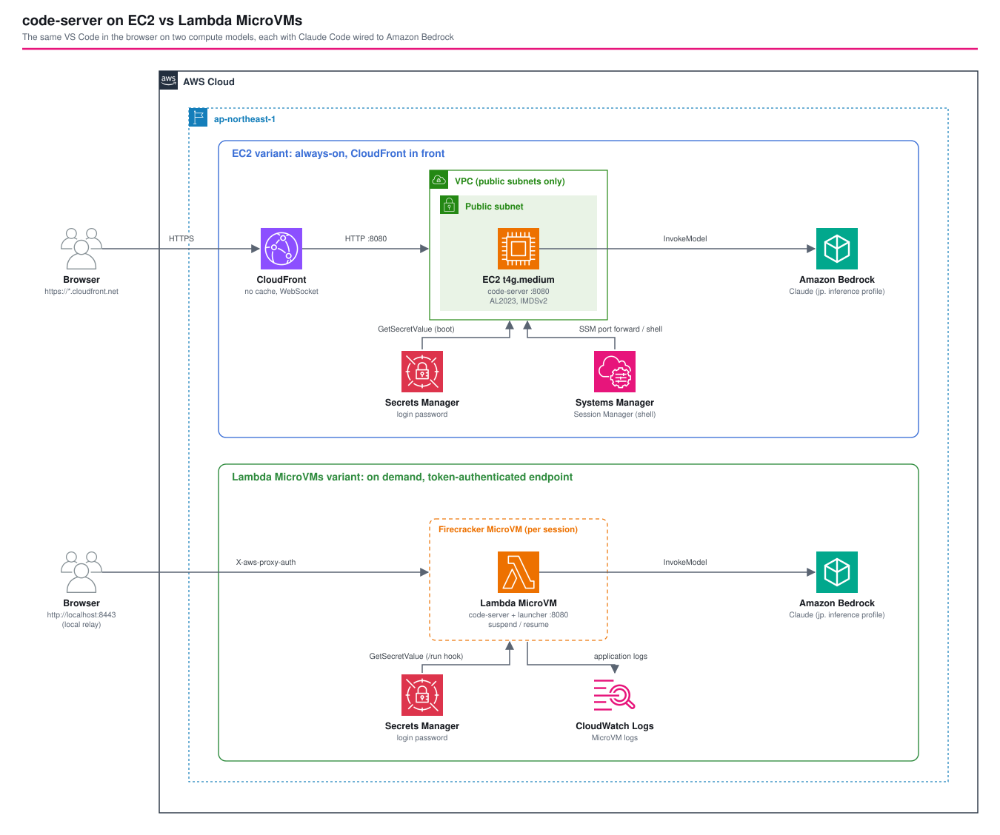

# code-server on EC2 vs AWS Lambda MicroVMs — The Same Browser IDE on Two Compute Models, with Claude Code on Amazon Bedrock

*Read this in other languages:* [](./README.ja.md) [](./README.md)


## Introduction

This reference implementation runs [code-server](https://github.com/coder/code-server) (VS Code in the browser) on two compute models and puts them side by side: an always-on EC2 instance behind CloudFront, which is the layout of the AWS sample [sample-code-server-on-aws](https://github.com/aws-samples/sample-code-server-on-aws), and an on-demand [AWS Lambda MicroVM](https://aws.amazon.com/lambda/lambda-microvms/) that is launched when needed, suspended when idle, and resumed by the next request. Both variants ship with the Claude Code CLI and the VS Code extension configured for Amazon Bedrock.

This architecture demonstrates:

- The same product on two billing models: an instance that bills every hour, and a MicroVM that bills only while it runs
- A browser-reachable endpoint for each model: CloudFront with an origin-facing security group on the EC2 side, and a token-authenticated MicroVM endpoint plus a small local relay on the MicroVMs side
- A launcher inside the MicroVM that answers the platform lifecycle hooks, starts code-server from the `/run` hook with a password fetched per MicroVM, and reverse-proxies HTTP and WebSocket traffic
- Claude Code reaching Amazon Bedrock through the instance role or the MicroVM execution role, with no API key anywhere
- A measured comparison: MicroVM start in 3 to 16 seconds, first request after suspend in 0.65 seconds, EC2 stack creation in about 5.5 minutes
- Deploy-verified end to end on 2026-10-08; see [Deploy verification](#-deploy-verification) for the defects the real deployment found and fixed

## 📑 Table of Contents

- [Architecture Overview](#️-architecture-overview)
- [Design Decisions & Best Practices](#-design-decisions--best-practices)
- [Cost Optimization](#-cost-optimization)
- [Security Considerations](#-security-considerations)
- [Prerequisites](#-prerequisites)
- [Deployment Guide](#-deployment-guide)
- [Usage](#usage)
- [Testing Strategy](#-testing-strategy)
- [Customization](#️-customization)
- [Deploy verification](#-deploy-verification)
- [Troubleshooting](#-troubleshooting)
- [Clean-up](#-clean-up)
- [References](#-references)

## 🏗️ Architecture Overview



The workspace holds one CDK app with two independent stacks. Deploy either one alone.

| | EC2 variant | Lambda MicroVMs variant |
| --- | --- | --- |
| Compute | One `t4g.medium` instance, always on | One MicroVM per session, launched on demand |
| Entry point | CloudFront distribution (HTTPS) | MicroVM endpoint (HTTPS, JWE token in `X-aws-proxy-auth`) |
| Browser access | Open the CloudFront URL | `scripts/microvm-session.sh connect` starts a local relay on `localhost:8443` |
| Login | code-server password from Secrets Manager | The same, on top of the endpoint token |
| Shell access | SSM Session Manager | The code-server terminal |
| Idle behavior | Keeps running and billing | Suspends after 15 idle minutes, resumes on the next request |
| State on stop | Persists on the EBS volume | Kept while suspended, lost on terminate |
| Start time | Minutes (instance boot plus UserData) | 3 to 16 seconds measured |

### Key Components

**EC2 stack** (`lib/stacks/code-server-ec2-stack.ts`)

- **VPC**: two public subnets and no NAT Gateway
- **EC2 instance**: Amazon Linux 2023 on arm64, IMDSv2 required, encrypted gp3 root volume, code-server installed by UserData and run as a systemd service
- **Security group**: one inbound rule, TCP 8080 from the CloudFront origin-facing managed prefix list
- **CloudFront**: caching disabled, all viewer headers forwarded, HTTPS redirect, HTTP/1.1 WebSocket upgrade passed through
- **Secrets Manager**: a generated 24-character login password, read by the instance role at boot
- **Instance role**: `AmazonSSMManagedInstanceCore`, secret read, and `bedrock:InvokeModel*` on the configured models

**MicroVMs stack** (`lib/stacks/code-server-microvms-stack.ts`)

- **MicroVM image** (`AWS::Lambda::MicrovmImage`): built from `src/microvm-image/` (Dockerfile, launcher, Claude Code CLI and extension), arm64, 2 GiB minimum memory, `run`, `terminate`, `ready` and `validate` hooks enabled on port 8080
- **Launcher** (`src/microvm-image/server/index.mjs`): serves the lifecycle hooks, starts code-server from `/run`, reverse-proxies everything else including WebSocket upgrades
- **Build role and execution role**: the build role reads the asset bucket and writes logs; the execution role reads the password secret, writes logs, and invokes Bedrock
- **Secrets Manager**: a generated login password
- **Log group**: image build logs and, through `--logging`, the runtime logs of each MicroVM
- **Operations scripts** (`scripts/`): `microvm-session.sh` (start, connect, status, stop) and `relay.mjs` (local relay)

There is no VPC and no NAT Gateway on the MicroVMs side. The AWS-managed `INTERNET_EGRESS` network connector gives the MicroVM outbound internet access for extensions, package registries and Bedrock.

### Request flow

```
EC2 variant
  Browser ──HTTPS──▶ CloudFront ──HTTP :8080──▶ EC2 (code-server)
                                                  ├─ GetSecretValue (password, at boot)
                                                  └─ InvokeModel (Claude Code → Bedrock)

MicroVMs variant
  Browser ──HTTP──▶ localhost:8443 (relay.mjs) ──HTTPS + X-aws-proxy-auth──▶ MicroVM endpoint
                                                                               └─ launcher :8080 ──▶ code-server :8081
  /run hook ─▶ GetSecretValue (password) ─▶ spawn code-server ─▶ traffic is admitted
```

### Why a local relay

Every MicroVM endpoint requires a JWE token in the `X-aws-proxy-auth` header, and a browser cannot attach a custom header to a page navigation or to a WebSocket handshake. `scripts/relay.mjs` listens on `127.0.0.1`, injects a fresh token (re-issued every 25 minutes through the AWS CLI) and forwards HTTP and WebSocket traffic. It also rewrites `Host` and `Origin` to the endpoint so code-server's own origin check accepts the handshake, and drops the `Domain` attribute from `Set-Cookie` so the browser keeps the session cookie on `localhost`.

## 🎯 Design Decisions & Best Practices

### 1. One workspace, two stacks

The two variants serve the same product, so comparing them is the point of the pattern. Each stack deploys and destroys on its own (`cdk deploy '**/Ec2'`, `cdk deploy '**/Microvms'`), which keeps the fixed cost of the EC2 variant out of a MicroVMs-only evaluation.

### 2. EC2 sits in a public subnet only so CloudFront can reach it

CloudFront needs a DNS name it can resolve from the internet. The instance gets a public IPv4 address, and its security group admits nothing except the CloudFront origin-facing prefix list, so the instance is not reachable directly (a request to port 8080 on its public DNS name times out). This avoids a NAT Gateway, which would cost more per month than the instance. The trade-off is that the origin leg is plain HTTP inside the AWS network. A CloudFront VPC origin to a private instance removes the public address and needs an egress path (NAT or VPC endpoints) for the UserData downloads.

### 3. code-server starts from the `/run` hook, not at image build

The platform snapshots memory and disk after `/ready` returns 200, and every MicroVM resumes from that snapshot. If code-server started at build time, its password would be part of the snapshot and shared by every MicroVM. Starting it from `/run` lets each MicroVM read the secret with its own execution role. `/run` takes about two seconds, and the endpoint admits no traffic until the hook returns 200.

### 4. A launcher process fronts code-server

The platform calls its hooks on one port under `/aws/lambda-microvms/runtime/v1/<hook>`, and code-server cannot answer them. The launcher owns port 8080, answers the hooks and proxies everything else to code-server on loopback port 8081. WebSocket upgrades are replayed to code-server and then piped as raw bytes, which VS Code needs for the terminal, the extension host and the file watcher. The launcher is not named `PORT` for a reason: code-server reads `$PORT` and would bind to it.

### 5. Access to the MicroVM needs a token, and the password stays

The endpoint token proves the caller may reach the MicroVM at all. The code-server password protects the IDE itself, so someone holding a leaked token still cannot open the workspace. Both are short-lived or per-environment secrets that never enter the template or the image.

### 6. Suspend instead of terminate while idle

`idlePolicy` suspends the MicroVM after 15 minutes without traffic and `autoResumeEnabled` brings it back on the next request. A suspended MicroVM keeps its memory and disk state, so open editors and the terminal survive, and it bills only snapshot storage. The first request after a suspend returned in 0.65 seconds in this deployment. `suspendedDurationSeconds` (one hour by default in the script) bounds how long an abandoned session lingers before the platform terminates it, and `maximumDurationInSeconds` bounds the whole lifetime (8 hours at most).

### 7. Claude Code uses Bedrock with role credentials

`parameters/dev-params.ts` has a `bedrock` block (`enabled`, `modelId`, `smallFastModelId`). When enabled, the instance role or execution role gets `bedrock:InvokeModel` and `InvokeModelWithResponseStream` on the two inference profiles and on the matching foundation models. Cross-region inference profiles route to foundation models in other Regions, so only the Region segment of the foundation-model ARN is a wildcard. The CLI and the extension read `~/.claude/settings.json`, which holds `CLAUDE_CODE_USE_BEDROCK=1`, the Region and the model IDs. Verify a model with `aws bedrock-runtime converse` before putting it in the parameters; a model can be listed as available and still return `AccessDeniedException` for an account.

### 8. Well-Architected Framework Alignment

| Pillar | How this pattern addresses it |
| --- | --- |
| Operational Excellence | Two stacks deploy and destroy independently; `microvm-session.sh` wraps start, connect, status and stop; MicroVM runtime logs go to CloudWatch Logs |
| Security | No inbound path to the instance except CloudFront; IMDSv2; encrypted volume; generated passwords in Secrets Manager; token-authenticated MicroVM endpoint; Bedrock access scoped to named models; no long-lived keys |
| Reliability | systemd restarts code-server on the instance; the MicroVM keeps state across suspend and resume; both variants are single-instance and carry no failover |
| Performance Efficiency | MicroVM resumes in under a second; arm64 on both sides; CloudFront passes WebSocket traffic with caching off |
| Cost Optimization | The MicroVM bills only while running; the EC2 variant avoids a NAT Gateway; `bedrock.enabled` and instance size are parameters |
| Sustainability | Suspend and terminate release compute when no one is typing; Graviton instances and MicroVMs |

## 💰 Cost Optimization

Unit prices differ by Region. Verify them on the AWS pricing pages before estimating a real workload. The figures below use US East (N. Virginia) list prices to compare the shape of the two models.

| Item | EC2 variant | MicroVMs variant |
| --- | --- | --- |
| Compute | `t4g.medium` (2 vCPU, 4 GiB): $0.0336 per hour, about $24.5 per 730-hour month | 1 vCPU and 2 GiB baseline, arm64: $0.0000276944 per vCPU-second plus $0.0000036667 per GiB-second, about $0.126 per running hour |
| Storage | gp3 30 GiB: $0.08 per GiB-month, $2.4 | Snapshot storage $0.08 per GB-month while suspended |
| Public IPv4 | $0.005 per hour, about $3.65 per month | None |
| NAT Gateway | None | None |
| Secrets Manager | $0.40 per secret per month | $0.40 per secret per month |
| CloudFront | Free tier covers a personal workload | None |

Break-even for compute alone: $24.5 ÷ $0.126 per hour is about 195 running hours per month, or roughly 27% of the month. Below that the MicroVM is cheaper, and a developer who codes a few hours a day sits well below it. Above it the always-on instance wins. Bedrock token charges are the same on both sides.

Cost levers:

- `--idle-seconds` on `microvm-session.sh start` sets how soon an idle MicroVM suspends
- `suspendedDurationSeconds` caps snapshot storage time
- `ec2.instanceType` and `ec2.volumeSizeGiB` size the instance
- Stop the instance outside working hours (an EventBridge schedule) if the EC2 variant must stay; a stopped instance still bills its volume and public IPv4 address

## 🔒 Security Considerations

### Implemented

- Instance security group: inbound TCP 8080 only from the CloudFront origin-facing prefix list
- IMDSv2 required, encrypted gp3 root volume, no SSH key and no port 22
- code-server password generated by Secrets Manager, read at boot (EC2) or in the `/run` hook (MicroVM), never present in the template, the user data or the image
- MicroVM endpoint token: JWE, scoped to one MicroVM and its ports, 30-minute lifetime in the relay
- Relay bound to `127.0.0.1`
- Bedrock permissions limited to two inference profiles and their foundation models
- MicroVM build role and execution role separated; the build role cannot read the password

### Intentionally out of scope (add per environment)

- AWS WAF in front of CloudFront (a CloudFront web ACL lives in us-east-1)
- A custom domain and certificate, which also moves the minimum TLS version beyond the default certificate
- A CloudFront VPC origin to remove the instance's public address
- CloudFront access logs and VPC flow logs
- Per-user MicroVMs behind an authenticated control plane (see [`lambda-microvms-codex-appserver`](../lambda-microvms-codex-appserver/README.md))

### CDK Nag

`test/compliance/cdk-nag.test.ts` runs the AwsSolutions pack on both stacks. Suppressions are listed with a reason each: flow logs, detailed monitoring and termination protection for a demo instance, CloudFront geo restriction, WAF, logging and the default certificate, the HTTP-only origin, secret rotation, the SSM managed policy, and the Region wildcard of the Bedrock foundation-model ARN.

## 📋 Prerequisites

- Node.js 20 or later and the repository dependencies (`npm ci` in `infrastructure/`)
- AWS CLI v2 with a profile for the target account
- `jq`, `curl` and `node` on the machine that runs `microvm-session.sh`
- The Lambda MicroVMs preview enabled in the account and Region, and the AWS-managed base image visible: `aws lambda-microvms list-managed-microvm-images`
- Amazon Bedrock model access for the models in `bedrock` (verify with `aws bedrock-runtime converse`)
- CDK bootstrap in the target account and Region

## 🚀 Deployment Guide

```sh
cd infrastructure

# Deploy either stack, or both
PROJECT=<project> ENV=dev npm run synth -w workspaces/code-server-ec2-vs-lambda-microvms
cd workspaces/code-server-ec2-vs-lambda-microvms
PROJECT=<project> ENV=dev npx cdk deploy '**/Ec2' --require-approval never
PROJECT=<project> ENV=dev npx cdk deploy '**/Microvms' --require-approval never
```

Run the two deploys one after another. Two CDK processes synthesizing into the same `cdk.out` collide.

The Region comes from `CDK_DEFAULT_REGION` or `parameters/dev-params.ts`. The base image ARN in `microvm` is Region-specific.

## Usage

### EC2 variant

```sh
# URL and password secret name come from the stack outputs
aws cloudformation describe-stacks --stack-name <project>-dev-code-server-ec2 \
  --query 'Stacks[0].Outputs' --output table
aws secretsmanager get-secret-value --secret-id <PasswordSecretName> --query SecretString --output text
```

Open the `CodeServerUrl` output and sign in with the password. For a shell on the instance, use `aws ssm start-session --target <InstanceId>`. The instance runs UserData for several minutes after the stack finishes, and the URL answers once code-server is up.

### Lambda MicroVMs variant

```sh
cd infrastructure/workspaces/code-server-ec2-vs-lambda-microvms

# 1. Launch a MicroVM and wait until code-server answers (prints the elapsed seconds)
#    The stack name defaults to ${PROJECT}-${ENV:-dev}-code-server-microvms; override with --stack
export PROJECT=<project>
./scripts/microvm-session.sh start --profile <profile>

# 2. Open a local relay, then browse to http://localhost:8443
./scripts/microvm-session.sh connect --profile <profile>

# 3. Password
aws secretsmanager get-secret-value --secret-id <project>-dev-code-server-microvms-password \
  --query SecretString --output text

# 4. Inspect or stop
./scripts/microvm-session.sh status --profile <profile>
./scripts/microvm-session.sh stop --profile <profile>
```

`start` accepts `--idle-seconds` (default 900) and `--max-seconds` (default 14400, at most 28800). The relay re-issues the endpoint token on its own; keep its terminal open while you work. When the MicroVM suspends, the next request through the relay resumes it.

### Claude Code

Open the Claude Code panel in code-server or run `claude` in the terminal. Both read `~/.claude/settings.json`, which selects Amazon Bedrock and the models from `parameters/dev-params.ts`.

## 🧪 Testing Strategy

```sh
npm run test:unit -w workspaces/code-server-ec2-vs-lambda-microvms        # resource property assertions
npm run test:snapshot -w workspaces/code-server-ec2-vs-lambda-microvms    # whole-template regression safety net
npm run test:compliance -w workspaces/code-server-ec2-vs-lambda-microvms  # cdk-nag AwsSolutions pack
```

- Unit tests assert no NAT Gateway, IMDSv2, the CloudFront prefix-list rule, the CloudFront cache and request policies, that the password is generated and not embedded, and, for the MicroVMs stack, the absence of any VPC or instance, the image architecture, memory and hooks, and the execution role's secret read.
- Snapshot tests cover the full template and the resource counts of both stacks.
- Compliance tests run CDK Nag on both stacks.

`cdk synth` also validates the template against the `AWS::Lambda::MicrovmImage` CloudFormation schema.

## ⚙️ Customization

### Turn Claude Code off or change the model

```typescript
bedrock: {
  enabled: false, // drop the CLI, the extension and the Bedrock permissions
  modelId: 'jp.anthropic.claude-sonnet-4-6',
  smallFastModelId: 'jp.anthropic.claude-haiku-4-5-20251001-v1:0',
},
```

### Change instance size or code-server version

```typescript
ec2: { instanceType: 't4g.large', volumeSizeGiB: 60, codeServerVersion: '4.141.0' },
microvm: { baseImageArn: '...', baseImageVersion: '1', minimumMemoryInMiB: 4096 },
```

### Add tools to the MicroVM image

Add packages to `src/microvm-image/Dockerfile`. The image builds with network access, so `apt-get`, `npm` and `curl` work. A change to the image creates a new image version, and a MicroVM launched afterwards uses it.

## ✅ Deploy verification

Deployed to a development account in ap-northeast-1 on 2026-10-08 and exercised from the outside.

| Check | Result |
| --- | --- |
| EC2 stack creation | 331 seconds, almost all of it the CloudFront distribution |
| EC2 variant: login, workbench, WebSocket upgrade | 200, 200, 101 through CloudFront |
| EC2 variant: direct request to the instance on 8080 | Times out, blocked by the security group |
| MicroVMs image build | About 190 seconds for the first build, about 210 seconds for later versions |
| MicroVM start to healthy | 3, 11 and 16 seconds across three launches |
| MicroVMs variant: login, workbench, WebSocket upgrade through the relay | 200, 200, 101 |
| First request after `suspend-microvm` | 200 in 0.65 seconds, state back to `RUNNING` |
| Claude Code on EC2 | `claude -p` answered through Bedrock (`BEDROCK_OK`) |
| Claude Code in the MicroVM | The `/run` hook smoke check answered through Bedrock with the execution role |
| Model access | `jp.anthropic.claude-sonnet-4-6` and `jp.anthropic.claude-haiku-4-5` answered; the `sonnet-5-5`, `opus-5-5` and `haiku-5-5` profiles returned `AccessDeniedException` in this account |

Defects found by the real deployment and fixed:

1. **code-server bound to the wrong port.** The launcher used a `PORT` environment variable, and code-server reads `$PORT` ahead of `--bind-addr`. It bound 8080, collided with the launcher, and the `/run` hook returned 500, which terminated the MicroVM with `Run lifecycle hook returned HTTP status 500`. The launcher now reads `LAUNCHER_PORT`.
2. **The session cookie was rejected by the browser.** code-server sets `Domain=<MicroVM endpoint>` on its session cookie, which a browser on `localhost` discards, so every request after login redirected back to the login page. The relay removes the `Domain` attribute.
3. **`AWS_REGION` is a reserved image environment variable name.** Setting it on `AWS::Lambda::MicrovmImage` failed the update with `Environment variable key 'AWS_REGION' is reserved` and rolled the stack back. The launcher derives the Region from the secret ARN.
4. **No runtime logs by default.** A MicroVM that failed in `/run` left nothing in CloudWatch until `--logging` pointed at a log group the execution role can write to. `start` now passes the image log group and the stack grants the write.

Also observed: a MicroVM ends with `MicroVM exceeded maximum lifetime` when `maximumDurationInSeconds` passes, whether it was running or suspended. The relay then returns 502 `MICROVM_CONNECT_FAILED`.

## 🔧 Troubleshooting

### `microvm-session.sh start` times out waiting for `/healthz`

Check the MicroVM state and the reason:

```sh
aws lambda-microvms get-microvm --microvm-identifier <id> --query '{state:state,reason:stateReason}'
```

`Run lifecycle hook returned HTTP status 500` means the launcher could not start code-server. Read the log stream in the image log group (`/lambda-microvms/<project>-<env>-code-server-image`, stream `<date>[<image version>]<microvm id>`).

### The browser keeps returning to the login page (MicroVMs variant)

The session cookie is not being stored. Use the relay from this repository, which removes the cookie's `Domain` attribute, and open the exact `http://localhost:<port>` the relay prints.

### The relay returns 502 with `x-aws-proxy-error: MICROVM_CONNECT_FAILED`

The MicroVM is gone (terminated, or past its maximum lifetime). Run `microvm-session.sh start` again and then `connect`.

### The relay stops authenticating after about an hour

The relay re-issues the token with the AWS CLI. If the shell's credentials expired (for example an SSO session), refresh them and restart `connect`.

### EC2 variant: the CloudFront URL returns 502 right after deployment

CloudFront is ready before the instance finishes UserData. Wait a few minutes. To follow progress, run `aws ssm start-session` and read `/var/log/cloud-init-output.log`.

### Claude Code asks you to sign in

Choose the Amazon Bedrock option, or confirm `~/.claude/settings.json` contains `CLAUDE_CODE_USE_BEDROCK`. On a MicroVM, look for a `[bedrock-check]` line in the MicroVM's log stream to see whether the execution role can invoke the model.

### `AccessDeniedException` from Bedrock

The model is not enabled for the account, or `modelId` is not in the role's policy. Test with `aws bedrock-runtime converse --model-id <id>` and set `bedrock.modelId` to a profile that answers.

## 🧹 Clean-up

```sh
# End any running MicroVM first; cdk destroy does not terminate MicroVMs
./scripts/microvm-session.sh stop --profile <profile>

cd infrastructure/workspaces/code-server-ec2-vs-lambda-microvms
PROJECT=<project> ENV=dev npx cdk destroy '**/Microvms' --force
PROJECT=<project> ENV=dev npx cdk destroy '**/Ec2' --force
```

## 📚 References

### AWS Documentation

- [AWS Lambda MicroVMs](https://aws.amazon.com/lambda/lambda-microvms/)
- [Running and using MicroVMs (lifecycle hooks, authentication, WebSocket)](https://docs.aws.amazon.com/lambda/latest/dg/microvms-launching.html)
- [Lambda MicroVMs networking (ingress and egress connectors)](https://docs.aws.amazon.com/lambda/latest/dg/microvms-networking.html)
- [AWS Lambda pricing](https://aws.amazon.com/lambda/pricing/)
- [CloudFront managed prefix list for origin-facing IP addresses](https://docs.aws.amazon.com/AmazonCloudFront/latest/DeveloperGuide/LocationsOfEdgeServers.html)
- [Amazon Bedrock inference profiles](https://docs.aws.amazon.com/bedrock/latest/userguide/inference-profiles.html)
- [Claude Code on Amazon Bedrock](https://docs.claude.com/en/docs/claude-code/amazon-bedrock)

### code-server

- [code-server](https://github.com/coder/code-server)
- [AWS sample: code-server on EC2 with CloudFront](https://github.com/aws-samples/sample-code-server-on-aws)

### Related Architectures

- [`lambda-microvms-codex-appserver`](../lambda-microvms-codex-appserver/README.md) — a per-session MicroVM behind a Cognito-authenticated control plane
- [`cloudfront-vpc-origin`](../cloudfront-vpc-origin/README.md) — CloudFront in front of a private origin

## 📄 License

This project is licensed under the Apache License, Version 2.0 - see the [LICENSE](../../../LICENSE) file for details.

## 👥 Contributing

Contributions are welcome! See the [Contribution Guide](../../../docs/contribution/CONTRIBUTING.md).

## 🏆 About This Reference Architecture

This reference architecture compares an always-on and an on-demand compute model for the same browser IDE, and shows how to connect a token-authenticated MicroVM endpoint to a browser.

**Target Level**: 300 (Advanced)

---

**Note**: This is a reference implementation. Always review and customize according to your specific requirements and organizational policies before deploying to production.
