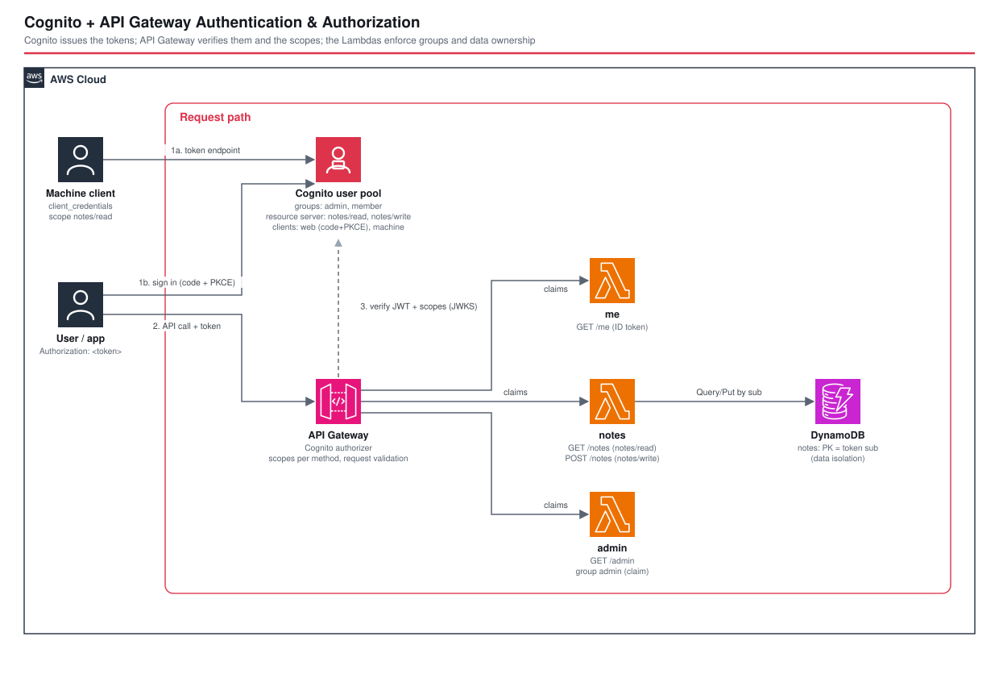

# Cognito + API Gateway Authentication & Authorization - AWS CDK Reference Architecture

[](./README.ja.md)
[](./README.md)

> **Level: 300 (Intermediate)**

How to protect a REST API with **Amazon Cognito**: a user pool that authenticates people (and machines), an API Gateway **Cognito authorizer** that verifies tokens and OAuth **scopes**, and Lambda functions that enforce what only they can — **group membership** and **per-user data ownership**. It is the managed-service counterpart to [`alb-keycloak-auth`](../alb-keycloak-auth/) (self-hosted Keycloak behind an ALB).

| Endpoint | Who may call | Token | Enforced by |
|---|---|---|---|
| `GET /me` | any signed-in user | **ID token** | authorizer |
| `GET /notes` | scope `notes/read` (users, machines) | **access token** | authorizer (scope) |
| `POST /notes` | scope `notes/write` (users) | **access token** | authorizer (scope) |
| `GET /admin` | group `admin` | **ID token** | Lambda (`cognito:groups` claim) |

## 📑 Table of Contents

- [Architecture Overview](#-architecture-overview)
- [Design Decisions & Best Practices](#-design-decisions--best-practices)
- [Well-Architected Alignment](#-well-architected-alignment)
- [Cost Optimization](#-cost-optimization)
- [Security Considerations](#-security-considerations)
- [Prerequisites](#-prerequisites)
- [Deployment Guide](#-deployment-guide)
- [Operational Check Script](#-operational-check-script)
- [Testing Strategy](#-testing-strategy)
- [Customization](#-customization)
- [Troubleshooting](#-troubleshooting)
- [Clean-up](#-clean-up)
- [References](#-references)

## 🏗️ Architecture Overview



### Key Components

- **Cognito user pool** — admin-created users only (`selfSignUpEnabled: false`), e-mail sign-in, 12+ character passwords, **optional TOTP-only MFA** (no SMS), e-mail-only recovery, deletion protection outside dev. Two groups: `admin`, `member`.
- **Resource server `notes`** — defines the scopes `notes/read` and `notes/write`.
- **Web client** (public, no secret) — authorization code + **PKCE** against the hosted UI; SRP always on, `USER_PASSWORD_AUTH` only when `enablePasswordAuthFlow` is true (dev); `preventUserExistenceErrors`, token revocation, 60-minute access/ID tokens, 30-day refresh token.
- **Machine client** (with secret) — `client_credentials`, `notes/read` only.
- **Hosted domain** — serves `/login` and `/oauth2/token`.
- **API Gateway (REST)** — `CognitoUserPoolsAuthorizer`, scopes per method, one request validator + JSON-schema model for `POST /notes`, stage throttling, access logs.
- **Lambda ×3** (Node.js 24 / ARM64) — `me`, `admin`, `notes`; only `notes` can reach DynamoDB (`PutItem`, `Query`).
- **DynamoDB `notes`** — partition key = the token's `sub`, so a caller can only ever touch their own partition.

## 🎯 Design Decisions & Best Practices

### 1. Two layers of authorization, each where it is cheapest to enforce

The authorizer rejects bad tokens and missing scopes **before Lambda runs** (no invocation cost). Group membership and data ownership need application context, so the function enforces them — but only on **claims the authorizer already verified**; the function never parses or validates a JWT itself.

### 2. ID token vs access token — the classic 401

With **no** `authorizationScopes` the authorizer expects an **ID token**; with scopes it expects an **access token** (scopes exist only there). Sending the other kind returns `401 Unauthorized`. Endpoints for "who is this user" (`/me`, `/admin`) use the ID token; resource endpoints (`/notes`) use the access token. The check script asserts all four combinations.

### 3. Custom scopes only appear in tokens issued by an OAuth flow

An access token obtained with `InitiateAuth` (`USER_PASSWORD_AUTH` / SRP) carries only `aws.cognito.signin.user.admin` — **not** `notes/read` / `notes/write`. Calling a scoped method with it returns 401. User tokens with custom scopes must come from the **authorization code flow** (hosted UI), which the check script drives with `curl` (login form + CSRF token + PKCE). Machine tokens from `client_credentials` do carry the scopes they were granted.

### 4. Insufficient scope is `401`, not `403`

A valid access token that lacks the method's scope (a machine token calling `POST /notes`) is refused by the REST API Cognito authorizer with **401**. `403` in this API means "authenticated, but not allowed" and comes from the Lambda (`/admin` for a non-admin).

### 5. Groups: read them from the ID token in the function

The authorizer does not check groups. `cognito:groups` reaches a REST API Lambda proxy as a **flattened string** (`admin`, or `[admin member]`), not an array — `groupsOf()` parses both shapes (unit-tested).

### 6. Data isolation by construction

`notes` reads `sub` from the verified claims and uses it as the partition key for every read and write. There is no user-supplied identifier to tamper with. (For a machine token `sub` is the client, so machines get their own partition.) Note that **`sub` is a DynamoDB reserved word**: `KeyConditionExpression: 'sub = :sub'` fails with a `ValidationException`, so the query aliases it (`#sub`). Unit tests could not catch this; the end-to-end run did (a 502 from `/notes`).

### 7. Web client: public + PKCE + SRP

A browser/mobile app cannot keep a secret, so the web client has none and uses code + PKCE. `USER_PASSWORD_AUTH` sends the password to Cognito directly and is enabled only through `EnvParams.enablePasswordAuthFlow` for scripted tests — keep it off in production.

### 8. Machine-to-machine with a separate client

Services get their own client with `client_credentials` and the **minimum scope** (`notes/read`). Never reuse a user-facing client for machines.

### 9. Short-lived tokens, revocable refresh

60-minute access/ID tokens; 30-day refresh token with `enableTokenRevocation`, so signing a user out can invalidate it.

### 10. Environment-specific parameters

`enablePasswordAuthFlow`, `callbackUrls`, `logoutUrls`, `apiRateLimit`, `apiBurstLimit` in `parameters/<env>-params.ts`.

## 🏛️ Well-Architected Alignment

| Pillar | Implementation |
|---|---|
| **Operational Excellence** | Per-function log groups + access logs; `test-auth.sh` proves who is let in and who is kept out; snapshot/unit/Nag tests |
| **Security** | Managed identity provider; authorizer before compute; scopes + groups + ownership; PKCE; optional TOTP MFA; strong password policy; no user-existence leaks; least-privilege IAM (one function reaches DynamoDB, Put/Query only) |
| **Reliability** | Managed, multi-AZ services; refresh tokens keep sessions alive; PITR on the table |
| **Performance Efficiency** | Rejection at the authorizer avoids Lambda invocations; ARM64 |
| **Cost Optimization** | Scale-to-zero compute; on-demand DynamoDB; Cognito billed per active user |
| **Sustainability** | Managed services, no idle servers (compare Keycloak on ECS + Aurora) |

## 💰 Cost Optimization

Cognito bills per **monthly active user (MAU)** with a free tier, and machine-to-machine token requests are billed separately — check the [Cognito pricing page](https://aws.amazon.com/cognito/pricing/) for your feature plan and region. Everything else scales to zero:

```
API Gateway REST:   100,000 req x $4.25 / 1M          ≈ $0.43
Lambda (3 fns):     100,000 invocations, 256 MB arm64  ≈ $0.10
DynamoDB on-demand: ~50,000 requests                    ≈ $0.05
CloudWatch Logs:    < 1 GB                              ≈ $0.50
---------------------------------------------------------------
≈ $1.1 / month (ap-northeast-1, estimate, excluding Cognito)
```

Compared with self-hosting Keycloak ([`alb-keycloak-auth`](../alb-keycloak-auth/)): no ALB, no Fargate tasks, no Aurora, no patching — at the price of less customisation.

## 🔒 Security Considerations

### Implemented
- ✅ Tokens verified by API Gateway before Lambda; scopes per method
- ✅ Group and ownership checks on verified claims only
- ✅ Authorization code + PKCE for interactive clients; no client secret in public clients
- ✅ Admin-created users, strong password policy, optional TOTP MFA, `preventUserExistenceErrors`
- ✅ Encryption at rest (DynamoDB SSE, PITR); TLS-only endpoints

### CDK Nag suppressions (with reasons)

| Rule | Why |
|---|---|
| `AwsSolutions-COG2` | MFA is `OPTIONAL` so scripted sign-in works; make it `REQUIRED` for real users |
| `AwsSolutions-COG3` / `COG8` | threat protection needs the Plus feature plan (per-MAU charge) — out of scope |
| `AwsSolutions-APIG3` | a WAFv2 Web ACL has a fixed monthly cost; stage throttling + authorizer bound abuse |
| `AwsSolutions-IAM4` | AWS-recommended logging managed policies |

### Out of scope (add per environment)
- Enforce MFA, add the Plus plan, a custom domain + managed login branding, federation (SAML/OIDC), a WAF, and account-recovery rules for your user base.
- Set `enablePasswordAuthFlow: false` outside dev.

## 📋 Prerequisites

- AWS account bootstrapped for CDK; AWS CLI v2 with a profile named `${PROJECT}-${ENV}`; Node.js 20+; `jq`, `curl`, `openssl` for the check script

## 🚀 Deployment Guide

```bash
cd infrastructure
npm install
export PROJECT=<project> ENV=dev

npm run bootstrap        -w workspaces/cognito-apigw-auth   # first time only
npm run synth            -w workspaces/cognito-apigw-auth
npm run stage:deploy:all -w workspaces/cognito-apigw-auth
```

Outputs: `ApiUrl`, `UserPoolId`, `WebClientId`, `MachineClientId`, `TokenEndpoint`, `NotesTableName`. Create a user and add them to a group:

```bash
aws cognito-idp admin-create-user --user-pool-id <UserPoolId> --username you@example.com \
  --user-attributes Name=email,Value=you@example.com Name=email_verified,Value=true
aws cognito-idp admin-add-user-to-group --user-pool-id <UserPoolId> --username you@example.com --group-name admin
```

## 🧪 Operational Check Script

[`test-auth.sh`](./test-auth.sh) signs real users in and calls the real API with real tokens:

```bash
./test-auth.sh --project <project> --env dev            # verify (creates and deletes 3 users)
./test-auth.sh --project <project> --env dev --destroy  # ... then delete the stack
```

It asserts (22 checks): no/garbage token → 401; ID token on `/me` → 200 with the right e-mail; **access token on `/me` → 401**; **ID token on `/notes` → 401**; **access token from `InitiateAuth` on `/notes` → 401**; an OAuth-flow access token carries `notes/read`+`notes/write` and can `POST`/`GET /notes`; **user B never sees user A's notes**; invalid body → 400; member on `/admin` → 403, admin → 200; **machine token**: `GET /notes` 200, `POST /notes` 401, `GET /me` 401; refresh token yields a working access token.

## 🧪 Testing Strategy

```bash
npm test -w workspaces/cognito-apigw-auth   # 27 tests
```

| Type | Covers |
|---|---|
| Snapshot (2) | template + resource counts (Lambda asset hashes normalised) |
| Unit (23) | user pool policy/MFA, groups, resource server, both clients, domain, authorizer + scopes per method, validator/model, throttling, table keys, IAM action sets, `groupsOf` / `admin` / `me` handlers |
| Compliance (2) | CDK Nag `AwsSolutions` |
| Operational | `test-auth.sh` against a deployed stack |

## ⚙️ Customization

- **Add a scope**: add a `ResourceServerScope`, grant it to a client, and reference `<identifier>/<scope>` in `authorizationScopes`.
- **Social / enterprise login**: add an identity provider (`UserPoolIdentityProviderGoogle`, `…Oidc`, `…Saml`) and list it in `supportedIdentityProviders`.
- **HTTP API instead of REST**: use `HttpJwtAuthorizer` — it validates JWTs natively (no separate authorizer resource) and reads scopes from the access token.
- **Enforce MFA**: `mfa: cognito.Mfa.REQUIRED`.
- **Pre-token-generation trigger**: add custom claims or override groups.

## 🔧 Troubleshooting

### `401 Unauthorized` with a token that looks valid
Wrong token type. Methods without scopes need the **ID token**; methods with scopes need an **access token**, and it must contain the scope (tokens from `InitiateAuth` do not). Decode the token (`cut -d. -f2 | base64 -d`) and check `token_use` and `scope`.

### `/notes` returns `502`
The function threw. Check its log group; a `KeyConditionExpression` on `sub` needs `#sub` (reserved word).

### The hosted-UI sign-in returns `redirect_mismatch`
`redirect_uri` must exactly match an entry of `callbackUrls`.

### `/admin` returns 403 for a user I added to `admin`
Groups are baked into the token at sign-in — sign in again to get a new ID token.

### `InitiateAuth` says `USER_PASSWORD_AUTH flow not enabled`
Set `enablePasswordAuthFlow: true` (dev only) and redeploy.

### `cdk deploy` fails with "no credentials" after a while
The bundled CDK cannot refresh an expired SSO token; export short-lived credentials (`aws configure export-credentials --format env`) or `aws sso login`.

## 🧹 Clean-up

```bash
npm run stage:destroy:all -w workspaces/cognito-apigw-auth   # or: ./test-auth.sh ... --destroy
```

Outside production the user pool, table and log groups are removed (`RemovalPolicy.DESTROY`, no deletion protection).

## 📚 References

### AWS Documentation
- [Controlling access to a REST API with Amazon Cognito user pools](https://docs.aws.amazon.com/apigateway/latest/developerguide/apigateway-integrate-with-cognito.html)
- [Amazon Cognito app clients and OAuth 2.0 scopes / resource servers](https://docs.aws.amazon.com/cognito/latest/developerguide/cognito-user-pools-define-resource-servers.html)
- [Using tokens with user pools](https://docs.aws.amazon.com/cognito/latest/developerguide/amazon-cognito-user-pools-using-tokens-with-identity-providers.html)
- [DynamoDB reserved words](https://docs.aws.amazon.com/amazondynamodb/latest/developerguide/ReservedWords.html)

### Related Architectures
- [alb-keycloak-auth](../alb-keycloak-auth/) — the self-hosted alternative (Keycloak on ECS + Aurora behind an ALB)
- [apigw-single-purpose-lambda](../apigw-single-purpose-lambda/) — the same API Gateway + DynamoDB shape without authentication
- [dynamodb-vector-search-semantic-api](../dynamodb-vector-search-semantic-api/) — API-key protected API

## 📄 License

This project is licensed under the MIT License — see the [LICENSE](../../LICENSE) file for details.

## 👥 Contributing

Contributions are welcome! Please read [CONTRIBUTING.md](../../CONTRIBUTING.md) for details.

## 🏆 About This Reference Architecture

**Target Level**: 300 (Intermediate)

---

**Note**: This is a reference implementation. Enforce MFA, add a WAF and threat protection, and turn off the password auth flow before production use.
