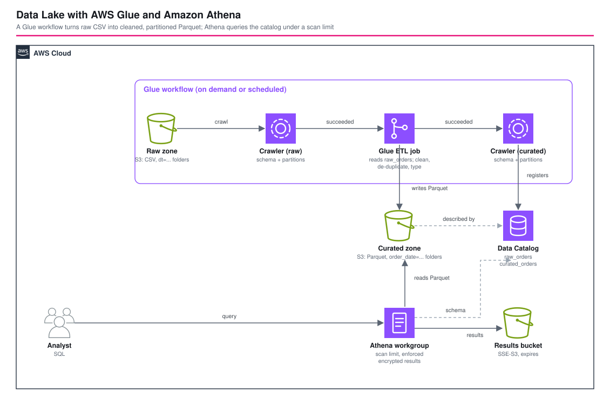

# AWS Glue と Amazon Athena によるデータレイク - AWS CDK リファレンスアーキテクチャ

[](./README.ja.md)
[](./README.md)


AWS のデータレイクと、それを育てる ETL の基本形です。CSV の **raw ゾーン**、データをカタログ化して **整形・重複排除・型付けしたパーティション付きの Parquet** に変換する **Glue ワークフロー**(クローラー、Spark ジョブ、クローラー)、**curated ゾーン**、そして **Amazon Athena** で構成します。Athena のワークグループは、クエリがスキャンできるデータ量に上限を設け、暗号化した結果の保存を強制します。着目点は ETL の自動化です(パーティションプロジェクションでログをその場でクエリする [`waf-log-reporting`](../waf-log-reporting/) とは対照的です)。Parquet とパーティションで何が得られるかを、数値で示します。

## 📑 目次

- [アーキテクチャ概要](#️-アーキテクチャ概要)
- [設計判断とベストプラクティス](#-設計判断とベストプラクティス)
- [Well-Architected との対応](#️-well-architected-との対応)
- [コスト最適化](#-コスト最適化)
- [セキュリティ上の考慮事項](#-セキュリティ上の考慮事項)
- [前提条件](#-前提条件)
- [デプロイ手順](#-デプロイ手順)
- [動作確認スクリプト](#-動作確認スクリプト)
- [テスト戦略](#-テスト戦略)
- [カスタマイズ](#️-カスタマイズ)
- [トラブルシューティング](#-トラブルシューティング)
- [クリーンアップ](#-クリーンアップ)
- [参考資料](#-参考資料)

## 🏗️ アーキテクチャ概要



### 主要コンポーネント

- **3つのバケット**: raw(CSV、`orders/dt=YYYY-MM-DD/`)、curated(Parquet、`orders/order_date=YYYY-MM-DD/`)、Athena の結果。すべてプライベート、TLS 必須、暗号化済みで、期限切れにするのは結果のバケットだけです。
- **Glue データベースと2つのクローラー**: 各ゾーンに1つずつ、テーブルのプレフィックスは `raw_` と `curated_`。テーブルはその場で更新し、削除されたオブジェクトはログに残すだけで、パーティションはテーブルのスキーマを引き継ぎます。
- **Glue ETL ジョブ**(`glue-jobs/orders_to_parquet.py`、Spark、Glue 5.0、G.1X × 2): カタログの `raw_orders` を読み、列に型を付け、注文 ID がない行、タイムスタンプがない行、数量や金額が0以下の行を除き、注文 ID ごとに1行(最新のタイムスタンプが勝つ)にして、`order_date` を導出し、それで分けた Parquet を書きます。
- **Glue ワークフロー**: `raw をクロール` → `変換` → `curated をクロール`。各ステップは直前のステップの成功を条件にしたトリガーです。オンデマンドで起動し、cron を設定すればスケジュールでも起動します。
- **Athena ワークグループ**: SSE-S3 付きで強制した結果の場所、クエリごとのスキャン量の上限、CloudWatch メトリクス、名前付きクエリ1つ。
- **`test-datalake.sh`** と **`sample-data/generate_orders.py`**: 重複、注文 ID の欠落、マイナスの金額を含む3日分の注文を生成し、ワークフローを実行して結果を確認します。

## 🎯 設計判断とベストプラクティス

### 1. raw と curated は別のゾーンで、権限も別にする

Glue のロールは、raw バケットを読むだけで、curated バケットは読み書きできます。raw ゾーンは届いたものの記録であり、パイプラインの何もそれを変更できません。curated ゾーンはいつでも raw から作り直せます。ロールに raw バケットへの書き込み権限がないことをテストが確認しています。

### 2. Parquet とパーティションの効果は、主張ではなく実測で示す

3日分の注文に対する同じ `SELECT sum(amount)` の結果です。

| 対象 | スキャンしたデータ量 |
|---|---|
| raw の CSV | 3,673,905 バイト |
| curated の Parquet | 267,615 バイト(7%) |
| curated の Parquet、1日分(`order_date = '2026-10-02'`) | 89,157 バイト |

Parquet は列指向なので `amount` だけが読まれ、パーティションの条件は3つのフォルダではなく1つだけを読みます。Athena はスキャンしたデータ量で課金されるので、これは費用の比率でもあります。データセットは小さいですが、比率はそのまま当てはまります。

### 3. ETL が整形し、その結果を確認で証明する

生成した raw データは3日分で60,600行あり、そのうち747行は重複したエクスポートで、さらに注文 ID が欠けた行とマイナスの金額の行を含みます。curated テーブルには、有効で重複のない59,770件の注文がちょうど入り、注文 ID の重複も、空の ID も、0以下の金額もありません。誰も検証していない「整形」ジョブは負債です。

### 4. 再実行しても安全: 動的パーティション上書き

ジョブは `spark.sql.sources.partitionOverwriteMode=dynamic` を設定して `overwrite` で書くので、入力にあるパーティションだけを置き換えます。4日目を足してワークフローを再実行すると、パーティションは4つ、行数は79,692(59,770 + 新しい1日分)になり、以前の日は重複しませんでした。動的モードがないと、`overwrite` は出力先のすべてのパーティションを削除します。

### 5. クローラーはパーティションキーを `string` にする

`order_date` は `string` のパーティションキーになるので、`WHERE order_date = DATE '2026-10-02'` は `TYPE_MISMATCH: Cannot apply operator: varchar = date` で失敗します。文字列(`'2026-10-02'`)で比較してください。失敗したクエリはスキャン量が0バイトと表示されるので、統計から結論を出す前にクエリの状態を確認します。名前付きクエリと確認スクリプトは文字列を使い、スクリプトは `DATE` の形式が失敗することも確認します。

### 6. 3つのスケジュールではなく、ワークフロー

独立してスケジュールした3つの部品は競合します。クローラーが終わる前にジョブが動いてしまうからです。条件付きトリガーは、直前のステップが成功してから次を始め、ワークフローの1回の実行は、起動、監視、再実行できる1つの単位になります。2つのクローラーと2ワーカーのジョブで、1回の実行は約4.5分でした。

### 7. ワークグループが、アナリストが覚えていられないことを強制する

`enforceWorkGroupConfiguration` により、別のバケットを `OutputLocation` に指定して始めたクエリも、ワークグループの場所に暗号化して書き込まれます。`bytesScannedCutoffPerQuery` は、上限(ここでは100 MB。最小は10 MB)を超えてスキャンするクエリを取り消します。このデータセットではスキャン量の上限に達しないため、確認スクリプトではこの上限の動作は試していません。

### 8. 費用が最も大きいのはクローラーの実行なので、スケジュールは任意にする

クローラーは1回の実行ごとに最小10分で課金され、Spark ジョブより高くなります。そのため `workflowSchedule` は既定で未設定です。オンデマンドで実行するか、データが実際に届く頻度でだけスケジュールしてください。レイアウトが決まっているデータなら、自分でパーティションを追加する(`ALTER TABLE ADD PARTITION`、または `waf-log-reporting` のパーティションプロジェクション)ことで、クローラーを避けられます。

### 9. このパターンが扱わないこと

きめ細かいアクセス制御(Lake Formation の列・行の権限)、スキーマ進化の方針、ジョブ内のフィルタ以上のデータ品質ルール、ストリーミングの経路です。Lake Formation が自然な次の一歩です。

### 10. 環境別パラメータ

`parameters/<env>-params.ts` で、Glue のバージョン、ワーカーの種類と数、任意のワークフローのスケジュール、Athena のスキャン量の上限、結果とログの保持期間を設定します。

## 🏛️ Well-Architected との対応

| 柱 | この構成での対応 |
|---|---|
| 運用上の優秀性 | ワークフローの1回の実行が運用の単位。`test-datalake.sh` はデプロイだけでなくデータを検証する。CloudFormation 管理 |
| セキュリティ | プライベートで TLS 必須の暗号化バケット、raw ゾーンに書けない Glue ロール、暗号化を強制した Athena の結果、パブリックアクセスなし |
| 信頼性 | 条件付きのワークフローのステップ、不正な入力を隠すようなジョブの再試行なし、冪等な再実行、curated を作り直せる raw ゾーン |
| パフォーマンス効率 | 列指向の Parquet とパーティションで、同じクエリのスキャン量は7% |
| コスト最適化 | クエリごとのスキャン量の上限、期限切れになる結果、任意のスケジュール、実測したスキャン量の削減 |
| 持続可能性 | 質問あたりにスキャンして保存するデータが少ない。従量課金のサービスで、ワークフローの実行の合間は何も動かない |

## 💰 コスト最適化

`ap-northeast-1` の概算です(料金ページで確認してください)。

| 項目 | 目安 |
|---|---|
| Glue クローラー | DPU 時間あたりの課金で、1回の実行ごとに最小10分。1回あたり数セントで、ワークフロー1回につき2回実行 |
| Glue の Spark ジョブ | DPU 時間あたりの課金で最小1分。2ワーカーで数分、数セント |
| Athena | スキャンした TB あたり。サンプルのクエリは数キロバイトから数メガバイトをスキャン |
| S3 | 数メガバイト分のストレージとリクエスト。結果は期限切れになる |

上記の単価からすると、確認スクリプトの1回の実行(ワークフロー2回とクエリ十数回)は数十セントです。ワークフローの実行の合間は何も動かないので、デプロイしたままにしても、スケジュールしなければ S3 のストレージだけです。

## 🔒 セキュリティ上の考慮事項

### 実装済み

- すべてのバケット: パブリックアクセスのブロック、SSE-S3、TLS 必須。Athena の結果は期限切れになります。
- Glue のロールは、raw ゾーンを読み、curated ゾーンにだけ書き、Glue とログ用に AWS マネージドの `AWSGlueServiceRole` を持ちます。
- Athena のワークグループは、設定(場所と暗号化)とクエリごとのスキャン量の上限を強制します。
- ジョブのログには、件数だけを出し、データの値は出しません。

### CDK Nag の抑制(理由付き)

| ルール | 理由 |
|---|---|
| AwsSolutions-S1 | ゾーンのバケットはリファレンスのデータセットを置くだけで、サーバーアクセスログには別のバケットが要る |
| AwsSolutions-IAM4 / IAM5 | `AWSGlueServiceRole` は文書化されたマネージドポリシー。ロールはゾーンのバケットのオブジェクト(`bucket/*`)を読み書きする |
| AwsSolutions-L1 | 自動削除プロバイダーのランタイムは CDK が管理する |
| AwsSolutions-GL1 | Glue のセキュリティ設定は付けない。オブジェクトは S3 の既定の暗号化で、ログにはデータの値がない |
| AwsSolutions-GL3 | ジョブのブックマークは使わない。ジョブは入力のパーティションを書き直すので冪等 |
| AwsSolutions-ATH1 | 結果は SSE-S3 で暗号化して強制している。SSE-KMS は、すべてのアナリストが必要とするキーを増やす |

### スコープ外(環境ごとに追加)

Lake Formation の権限、ゾーン用のお客様管理の KMS キー、Glue のセキュリティ設定、プライベートなデプロイ用の VPC エンドポイント、失敗したワークフローの実行の監視。

## 📋 前提条件

- Node.js 24 以上、AWS CDK v2、CDK ブートストラップ済みの AWS アカウント
- アカウントの Lake Formation の設定が IAM のみのアクセスを許可していること(既定の `IAM_ALLOWED_PRINCIPALS`)。そうでない場合は、Glue のロールとアナリストに Lake Formation の権限を付与してください
- `test-datalake.sh` 用の `aws`、`jq`、`python3`

## 🚀 デプロイ手順

```bash
export PROJECT=<project> ENV=dev
npm install
npm run stage:deploy:all -w workspaces/data-lake-glue-athena   # 約1分
./workspaces/data-lake-glue-athena/test-datalake.sh --project $PROJECT --env $ENV   # 約10分
```

ワークフローを自分で実行するには、`s3://<raw-bucket>/orders/dt=YYYY-MM-DD/` に CSV を置き、`aws glue start-workflow-run --name <project>-<env>-lake-workflow` を実行します。

## 🧪 動作確認スクリプト

`./test-datalake.sh --project <project> --env <env>`(すでにデータがあるレイクを消去するには `--reset` を付けます。このデモ用スタックでのみ使ってください)は次を行います。

1. 3日分の注文を生成してアップロードする
2. ワークフローを実行し、失敗したアクションなしで完了することを確認する
3. カタログを確認する。`raw_orders` はヘッダーを列名として読んだ CSV、`curated_orders` は型付きの列を持つ Parquet、パーティションは raw が3つ、curated が3つ
4. データを確認する。60,600行の raw から59,770行の curated、注文 ID の重複なし、空の ID なし、0以下の金額なし
5. スキャン量(CSV、Parquet、1パーティション)を比べ、パーティションで絞った結果をその日の期待する行数と照らす
6. `DATE` のリテラルと文字列のパーティションキーの比較が失敗することを確認する
7. 別の結果の場所を求めるクエリが上書きされ、結果が暗号化されることを確認する
8. 4日目を追加してワークフローを再実行し、パーティションが4つ、79,692行で、以前の日が重複していないことを確認する

2026-10-10 に `ap-northeast-1` で検証し、すべて成功しました。ワークフローの1回の実行は 270 秒と 279 秒でした。

## 🧪 テスト戦略

```bash
npm test -w workspaces/data-lake-glue-athena
```

- **スナップショット**: テンプレート全体とリソース数。
- **ユニット**: 3つのプライベートなバケットとオブジェクトが期限切れになる場所、データベース、クローラーとそのポリシー、ジョブのバージョンと容量と引数、Glue ロールの書き込み範囲、3ステップのワークフローと任意のスケジュール、Athena のワークグループ、文字列型の名前付きクエリ、本番でのバケットの保持。
- **コンプライアンス**: 上記の理由付きの CDK Nag `AwsSolutionsChecks`。

## ⚙️ カスタマイズ

| パラメータ | 意味 |
|---|---|
| `glueVersion`、`glueWorkerType`、`glueNumberOfWorkers` | ETL ジョブの容量 |
| `workflowSchedule` | ワークフローをスケジュールで動かす cron 式。未設定ならオンデマンド |
| `athenaBytesScannedCutoff` | 1回のクエリがスキャンできる最大量(10 MB 以上) |
| `athenaResultsExpirationDays`、`logRetentionDays` | 保持期間 |

自分のデータには、スクリプト(`glue-jobs/orders_to_parquet.py`)とクローラーの対象を変えます。ワークフローとワークグループはそのままです。

## 🔧 トラブルシューティング

### `TYPE_MISMATCH: Cannot apply operator: varchar = date`

パーティションキーが `string` です。`'2026-10-02'` で比較するか、`CAST(order_date AS date)` を使ってください(後者はパーティションの絞り込みが効かなくなります)。

### ワークフローは完了したが、curated テーブルに新しいパーティションがない

curated のクローラーは、ジョブが成功した後にだけ動きます。ジョブの実行ログ(`/aws-glue/jobs/`)とクローラーの実行を確認してください。新しいフォルダが見つからないクローラーは、パーティションを追加しません。

### 再実行で行が重複した

ジョブは `partitionOverwriteMode=dynamic` で書く必要があります。それがないと、`overwrite` が出力先全体を置き換えるか、`append` が同じ行を再び追加します。

### Athena のスキャン量が0バイト

クエリが失敗している可能性があります。統計だけでなく、クエリの状態とその理由を確認してください。

### Glue がデータベースを作れない

アカウントの Lake Formation の設定が、明示的な権限を要求しています。デプロイするロールと Glue のロールに Lake Formation の権限を付与するか、既定の IAM のみのアクセスを使ってください。

## 🧹 クリーンアップ

```bash
npm run stage:destroy:all -w workspaces/data-lake-glue-athena
```

開発環境では、バケットは自動で空になります。

## 📚 参考資料

- [AWS Glue workflows](https://docs.aws.amazon.com/glue/latest/dg/workflows_overview.html)
- [Using crawlers to populate the Data Catalog](https://docs.aws.amazon.com/glue/latest/dg/add-crawler.html)
- [Top 10 performance tuning tips for Amazon Athena](https://aws.amazon.com/blogs/big-data/top-10-performance-tuning-tips-for-amazon-athena/)
- [Using workgroups to control query access and costs](https://docs.aws.amazon.com/athena/latest/ug/manage-queries-control-costs-with-workgroups.html)
