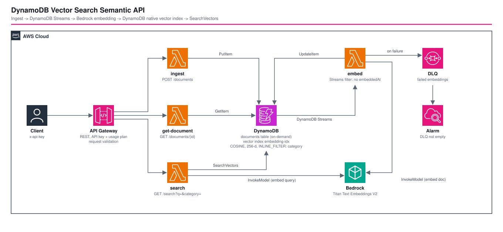

# DynamoDB Vector Search Semantic API - AWS CDK Reference Architecture

[](./README.ja.md)
[](./README.md)

> **Level: 300 (Intermediate)**

A semantic (meaning-based) search API built on **Amazon DynamoDB native vector search** — no OpenSearch, no separate vector database. Documents are stored in one on-demand DynamoDB table; **DynamoDB Streams → Lambda → Amazon Bedrock (Titan Text Embeddings V2)** writes each document's embedding back to the same item; a **vector index declared on the table** answers `SearchVectors` queries such as *"my function is slow the first time it runs after sitting idle"* → **"Reducing Lambda cold starts"**, even though the two share no keywords (and Japanese queries find English documents).

The vector index is declared with the `VectorIndexes` property of `AWS::DynamoDB::Table`. `aws-cdk-lib` has no L2 support for it yet, so the stack applies it to the underlying `CfnTable` with `addPropertyOverride`.

## 📑 Table of Contents

- [Architecture Overview](#-architecture-overview)
- [Design Decisions & Best Practices](#-design-decisions--best-practices)
- [Well-Architected Alignment](#-well-architected-alignment)
- [Cost Optimization](#-cost-optimization)
- [Security Considerations](#-security-considerations)
- [Prerequisites](#-prerequisites)
- [Deployment Guide](#-deployment-guide)
- [Usage](#usage)
- [Operational Check Script](#-operational-check-script)
- [Testing Strategy](#-testing-strategy)
- [Customization](#-customization)
- [Troubleshooting](#-troubleshooting)
- [Clean-up](#-clean-up)
- [References](#-references)

## 🏗️ Architecture Overview



### Key Components

- **Amazon DynamoDB (`documents` table)** — on-demand (vector indexes require it), `docId` partition key, SSE, point-in-time recovery, stream `NEW_IMAGE`. Carries the vector index:

  | Vector index setting | Value | Why |
  |---|---|---|
  | `IndexName` | `embedding-idx` | referenced by the search Lambda and its IAM policy |
  | `VectorAttribute` | `embedding` | list of float32 numbers written by the embed Lambda |
  | `Dimensions` | `256` (parameter) | Titan V2 supports 256/512/1024; smaller = cheaper storage/search, slightly less recall |
  | `DistanceFunction` | `COSINE` | the score is a distance: 0 identical … 2 opposite |
  | `SearchSchema` | `category` = `INLINE_FILTER` | filter is evaluated *inside* the vector search |
  | `Projection` | `INCLUDE title, category` | only what the API returns; `body` is deliberately not projected |

- **AWS Lambda ×4 (Node.js 24 / ARM64, one log group each)**
  | Function | Trigger | Does | IAM (least privilege) |
  |---|---|---|---|
  | `ingest` | `POST /documents` | validates + `PutItem` (no embedding yet), returns `202` | `dynamodb:PutItem` |
  | `get-document` | `GET /documents/{docId}` | returns `embeddingStatus: pending \| ready` (never the raw vector) | `dynamodb:GetItem` |
  | `embed` | DynamoDB Streams | Titan V2 → `UpdateItem SET embedding, embeddedAt` | `dynamodb:UpdateItem`, `bedrock:InvokeModel` on the model ARN, stream read |
  | `search` | `GET /search?q=&k=&category=` | embeds the query, calls `SearchVectors` | `dynamodb:SearchVectors` on the **index ARN**, `bedrock:InvokeModel` on the model ARN |

- **Amazon Bedrock — Titan Text Embeddings V2** (`amazon.titan-embed-text-v2:0`, `normalize: true`).
- **Event source mapping** — `TRIM_HORIZON`, batch 5, `ReportBatchItemFailures`, bisect on error, 3 retries, **SQS DLQ** + **CloudWatch alarm** (`≥ 1` message).
- **Amazon API Gateway (REST)** — API key required on every method + usage plan (rate / burst / daily quota), one request validator (body model + required query parameter), access logs.

### Architecture Characteristics

| Characteristic | Value | Rationale |
|---|---|---|
| Write path | asynchronous embedding | Bedrock latency/throttling never fails or slows ingestion; `202` + `embeddingStatus` polling |
| Search path | 1 Bedrock call + 1 `SearchVectors` | the vector index lives in the table — no second datastore to sync |
| Consistency | eventually consistent | a document is searchable shortly *after* `embeddingStatus` becomes `ready`; the check script retries |
| Failure handling | per-record retry → DLQ | one poisoned record does not block the shard |

## 🎯 Design Decisions & Best Practices

### 1. Why DynamoDB native vector search (and when not to)

| Option | Pros | Cons |
|---|---|---|
| **DynamoDB vector index (this)** | one table = source of truth + index; no sync pipeline to a second store; on-demand; inline filters; IAM/PITR/streams you already run | on-demand tables only; index definition is part of the table (dimensions fixed per index); newer feature with a small CDK/CFn surface |
| OpenSearch Serverless / Aurora pgvector | richer query features (hybrid lexical + vector, aggregations, SQL joins) | a second system to operate and keep in sync; base cost (OCU / instance) |
| Amazon S3 Vectors | very low cost for large, cold vector sets | separate store; not a transactional table |

Choose DynamoDB when your data already lives in DynamoDB and you need "find similar items" with simple attribute filters. Choose OpenSearch/pgvector when you need hybrid search, complex ranking or joins.

### 2. Embed asynchronously from DynamoDB Streams

`POST /documents` only writes the item. Embedding happens in a stream-driven Lambda, so ingestion stays fast and Bedrock throttling turns into retries/DLQ instead of user-facing errors. The trade-off is a short window where a document exists but is not searchable — surfaced explicitly as `embeddingStatus`.

### 3. Loop safety: filter on a **scalar leaf**, not on the vector

The embed Lambda's own `UpdateItem` produces another stream record. The event source mapping filter passes only records **without `embeddedAt`**:

```typescript
lambda.FilterCriteria.filter({
  eventName: lambda.FilterRule.or('INSERT', 'MODIFY'),
  dynamodb: { NewImage: { embeddedAt: { S: lambda.FilterRule.notExists() } } },
});
```

Filtering `embedding` (a list, i.e. a non-leaf `{"L": [...]}`) with `exists: false` **matches every record** — Lambda's `exists` operator only works on leaf nodes — so every document was embedded twice until the filter was moved to the scalar `embeddedAt` (verified from the function's logs: 20 embeds + 10 skips → 10 + 0 for 10 documents). The handler's early return and the conditional `UpdateItem` remain as a second line of defence. To **re-embed** an item (e.g. after changing model), `REMOVE embeddedAt`.

### 4. `INLINE_FILTER` keeps top-k exact under a filter

`category` is in the index `SearchSchema` as `INLINE_FILTER`, so `SearchConditionExpression: '#c = :c'` runs inside the vector search. Post-filtering the top-k would return fewer than *k* hits (the check script asserts that `category=database` with `k=5` returns exactly the 2 database documents). Every `SearchSchema` attribute must also be declared in `AttributeDefinitions`, otherwise `CreateTable` fails with *"One element in SearchSchema is not defined in attribute definitions"*.

### 5. CDK escape hatch for `VectorIndexes`

```typescript
const cfnTable = table.node.defaultChild as dynamodb.CfnTable;
cfnTable.addPropertyOverride('AttributeDefinitions', [
  { AttributeName: 'docId', AttributeType: 'S' },
  { AttributeName: 'category', AttributeType: 'S' },
]);
cfnTable.addPropertyOverride('VectorIndexes', [{ IndexName: 'embedding-idx', /* … */ }]);
```

The CloudFormation registry schema does not list `VectorIndexes`, but the property is accepted and creates an `ACTIVE` index (verified). The unit tests pin the emitted properties so a future L2 migration is a safe refactor.

### 6. Same model, dimensions and normalization for index and query

The search Lambda embeds the query with exactly the parameters the embed Lambda used (`EMBEDDING_MODEL_ID`, `EMBEDDING_DIMENSIONS`, `normalize: true`, all from the same `EnvParams`). Vectors from different models/dimensions are not comparable; changing them means a new index and re-embedding.

### 7. Write the vector with `UpdateItem`

In our tests (256 dimensions), an item created by a single `PutItem` that already contained the vector was **not searchable** (`SearchVectors` did not return it even for its own vector), while the same vector added with `UpdateItem` was found at distance ≈ 0. This pipeline always creates the item first and adds the vector with `UpdateItem`, which sidesteps the issue. Details and how it was verified: [docs/knowledge/dynamodb-vector-search.md](../../../docs/knowledge/dynamodb-vector-search.md). If you bulk-load pre-computed vectors, verify with a self-query first.

### 8. Least privilege, per function

Each function has only the actions it needs; `SearchVectors` is granted on the **index ARN** only; `bedrock:InvokeModel` only on the one foundation-model ARN. Unit tests assert the exact action sets.

### 9. Bundle the AWS SDK

`NodejsFunction` bundles `@aws-sdk/client-dynamodb` / `client-bedrock-runtime` (`externalModules: []`) so the deployed code uses the SDK version it was built and tested with — the SDK baked into the Lambda runtime is not pinned and may predate the `SearchVectors` API.

### 10. Environment-specific parameters

`parameters/<env>-params.ts` (`EnvParams`): `embeddingModelId`, `embeddingDimensions`, `apiRateLimit`, `apiBurstLimit`, `apiDailyQuota`.

## 🏛️ Well-Architected Alignment

| Pillar | Implementation |
|---|---|
| **Operational Excellence** | Per-function log groups + API access logs; DLQ alarm; `test-semantic-search.sh` proves the async pipeline end to end; snapshot + unit + CDK Nag tests |
| **Security** | Per-function least-privilege IAM (index-level `SearchVectors`, model-level `InvokeModel`); SSE + PITR; API key + usage plan; request validation; encrypted DLQ with TLS enforced |
| **Reliability** | Managed serverless services; stream retries with bisect + DLQ; idempotent conditional write-back; PITR |
| **Performance Efficiency** | ARM64; 256-d vectors; inline filter avoids over-fetching; `k` capped at 20 |
| **Cost Optimization** | Scale-to-zero compute; on-demand DynamoDB; usage-plan quota caps Bedrock spend; body not projected into the index |
| **Sustainability** | Graviton; no always-on search cluster |

## 💰 Cost Optimization

### Estimated monthly cost (ap-northeast-1 / Tokyo, on-demand, excludes free tier)

Scenario: **10,000 documents ingested + 100,000 searches per month** (dev / small production).

```
API Gateway REST:        110,000 req x $4.25 / 1M                     ≈ $0.47
Lambda (4 functions):    ~110,000 invocations, 256 MB arm64, ~300 ms   ≈ $0.10
Bedrock Titan V2:        10,000 docs x ~150 tokens + 100,000 queries x ~20 tokens
                         = 3.5M tokens x $0.00002 / 1K                 ≈ $0.07
DynamoDB base table:     ~10k writes x 2 (put + update) + reads        ≈ $0.05
CloudWatch Logs:         < 1 GB                                         ≈ $0.50
-------------------------------------------------------------------
Total (excluding DynamoDB vector index charges):                        ≈ $1.2 / month
```

**Not included:** DynamoDB vector index storage and vector read/write charges. They are metered as `VectorWriteRequestBytes` / `VectorSearchRequestBytes` (measured here: **1,061 bytes** written per 256-d vector, **6,914 bytes** for a top-5 search on a tiny table). Check the [DynamoDB pricing page](https://aws.amazon.com/dynamodb/pricing/on-demand/) for the vector rates and multiply by the bytes reported by `--return-consumed-capacity INDEXES` on your own traffic.

*(Pricing as of 2026; verify with the [AWS Pricing Calculator](https://calculator.aws/).)*

### Cost levers

1. **Dimensions** — 256 vs 1024 is 4× less vector storage/bytes per operation; validate recall on your own data before choosing.
2. **Projection** — every projected attribute increases vector-index size and write cost; project only what the API returns.
3. **Usage plan quota** — `apiDailyQuota` bounds Bedrock spend if an API key leaks.
4. **Cache query embeddings** for repeated queries to skip the Bedrock call.

## 🔒 Security Considerations

### Implemented

- ✅ **Least-privilege IAM per function**; `SearchVectors` on the index ARN, `InvokeModel` on one model ARN (enforced by unit tests)
- ✅ **Encryption at rest** — DynamoDB SSE (AWS managed key), SQS-managed SSE on the DLQ; PITR
- ✅ **TLS** — HTTPS-only API endpoint; DLQ policy enforces TLS
- ✅ **Input validation** — API Gateway model + required `q`; handlers re-validate lengths, `k` range and the `category` pattern
- ✅ **Abuse/spend control** — API key + usage plan throttle and daily quota

### Intentionally out of scope (add per environment)

Suppressed in the compliance test — do **not** copy these suppressions into a production API:

- **Authorization** (`AwsSolutions-APIG4` / `COG4`): an API key is a spend cap, not user authentication. Add a Cognito / IAM authorizer for real users.
- **WAF** (`AwsSolutions-APIG3`): associate a WAFv2 Web ACL (fixed monthly cost).
- **Data classification**: documents and queries are sent to Bedrock. Do not index data you may not process with Titan in this Region.

### CDK Nag

```bash
npm run test:compliance -w workspaces/dynamodb-vector-search-semantic-api
```

## 📋 Prerequisites

- AWS account; AWS CLI v2 with a profile named `${PROJECT}-${ENV}`; Node.js 20+; `jq` and `curl` for the check script
- **Amazon Bedrock: Titan Text Embeddings V2 (`amazon.titan-embed-text-v2:0`) available in the target Region** (`aws bedrock list-foundation-models`), and the DynamoDB vector search feature available in that Region
- The AWS SDK version installed by `npm install` must include `SearchVectorsCommand` (the workspace pins `^3.1140.0`)
- Docker is **not** required (`NodejsFunction` bundles with local `esbuild`)

## 🚀 Deployment Guide

```bash
cd infrastructure
npm install

export PROJECT=<project>
export ENV=dev

npm run bootstrap        -w workspaces/dynamodb-vector-search-semantic-api   # first time only
npm run synth            -w workspaces/dynamodb-vector-search-semantic-api
npm run validate         -w workspaces/dynamodb-vector-search-semantic-api
npm run stage:deploy:all -w workspaces/dynamodb-vector-search-semantic-api
```

Outputs: `ApiUrl`, `ApiKeyId`, `TableName`, `VectorIndexName`, `EmbedDlqUrl`.

## Usage

```bash
API_URL="<ApiUrl output>"     # e.g. https://abc123.execute-api.ap-northeast-1.amazonaws.com/dev/
API_KEY=$(aws apigateway get-api-key --api-key <ApiKeyId output> --include-value --query value --output text)

# 1. Add a document (returns 202 immediately; embedding happens asynchronously)
curl -s -X POST "${API_URL}documents" -H "x-api-key: $API_KEY" -H 'content-type: application/json' \
  -d '{"title":"Reducing Lambda cold starts","body":"Use provisioned concurrency and smaller packages...","category":"serverless"}'

# 2. Wait until embeddingStatus is "ready"
curl -s "${API_URL}documents/<docId>" -H "x-api-key: $API_KEY"

# 3. Search by meaning (optionally filter by category, k = 1..20)
curl -s -G "${API_URL}search" -H "x-api-key: $API_KEY" \
  --data-urlencode "q=my function is slow the first time it runs after sitting idle" \
  --data-urlencode "category=serverless" | jq .
```

Each result has `distance` (COSINE: 0 = identical) and `similarity = 1 - distance`. Use the scores for **ranking**; pick any cut-off empirically on your own data.

## 🧪 Operational Check Script

A clean `cdk deploy` does not prove this pattern works: embedding is asynchronous and the vector index is eventually consistent. [`test-semantic-search.sh`](./test-semantic-search.sh) runs a real round trip:

```bash
./test-semantic-search.sh --project <project> --env dev            # seed 10 documents and assert
./test-semantic-search.sh --project <project> --env dev --cleanup  # ... then delete them
```

It (1) seeds 10 documents, (2) waits for the Streams → Bedrock → `UpdateItem` pipeline, (3) asserts the top hit of four queries that share no keywords with their target (one in Japanese), (4) asserts the `category` inline filter, (5) removes `embeddedAt` and asserts the item is re-embedded, and (6) checks `400` (validation) and `403` (no API key). Requires `aws`, `curl`, `jq`.

## 🧪 Testing Strategy

```bash
npm test                  -w workspaces/dynamodb-vector-search-semantic-api   # all (19 tests)
npm run test:unit         -w workspaces/dynamodb-vector-search-semantic-api
npm run test:snapshot     -w workspaces/dynamodb-vector-search-semantic-api
npm run test:compliance   -w workspaces/dynamodb-vector-search-semantic-api   # CDK Nag AwsSolutions
```

| Type | Covers |
|---|---|
| Snapshot (2) | full template + resource counts (Lambda asset hashes are normalised) |
| Unit (15) | table/vector-index properties, `AttributeDefinitions`, exact IAM action sets, stream filter pattern, DLQ + alarm, API key/validators/usage plan, outputs |
| Compliance (2) | CDK Nag `AwsSolutions` — no unsuppressed warnings/errors |
| Operational | `test-semantic-search.sh` against a deployed stack |

## ⚙️ Customization

- **Change model / dimensions**: edit `embeddingModelId` / `embeddingDimensions` in the params file. The vector index definition changes with them, so plan a new index (or table) and re-embed (`REMOVE embeddedAt` on every item).
- **More filters**: add attributes to `SearchSchema` as `INLINE_FILTER` (and to `AttributeDefinitions`); project them if the API should return them.
- **Different distance**: `EUCLIDEAN` / `DOT_PRODUCT` (DOT_PRODUCT returns *higher = closer* — update the `similarity` mapping in `search.ts`).
- **Add authentication**: replace `apiKeyRequired` with a Cognito/IAM authorizer (keep the usage plan).

## 🔧 Troubleshooting

### `GET /search` returns `count: 0` right after adding documents
The embedding is asynchronous. Poll `GET /documents/{docId}` until `embeddingStatus` is `ready`; the index is eventually consistent, so allow a few more seconds.

### Documents stay `pending`
Check the `embed` function log group and the DLQ (`EmbedDlqUrl`). Typical causes: Bedrock throttling (retried, then DLQ), the model not available in the Region, or missing `bedrock:InvokeModel`.

### `Search vector contains invalid values … 32-bit floating-point number`
`SearchVector` must be a **list of `{N: "…"}`**, not `{L: [...]}` (and values must fit float32). Use `Math.fround`.

### `AccessDeniedException` on `SearchVectors`
The action is `dynamodb:SearchVectors` and the resource is the **index ARN** (`table/<name>/index/embedding-idx`), not the table ARN.

### A document is embedded twice
The event source filter must target the scalar `embeddedAt`, not the list-typed `embedding` (see Design Decision 3).

### A vector I loaded with `PutItem` is never returned
See Design Decision 7: add the vector with `UpdateItem`.

### `cdk deploy` fails with "no credentials" after a while
The bundled CDK cannot refresh an expired SSO token; export short-lived credentials (`aws configure export-credentials --format env`) or re-run `aws sso login`.

### Snapshot test fails after an unrelated change
Lambda asset hashes are normalised; if the diff is real, run `npm run test:snapshot:update` and review it.

## 🧹 Clean-up

```bash
npm run stage:destroy:all -w workspaces/dynamodb-vector-search-semantic-api
```

In `dev`, `isAutoDeleteObject` is true (`RemovalPolicy.DESTROY` on the table, DLQ and log groups); in `prd` they are retained. Delete seeded test documents with `./test-semantic-search.sh --cleanup`.

## 📚 References

### AWS Documentation
- [Vector search in Amazon DynamoDB](https://docs.aws.amazon.com/amazondynamodb/latest/developerguide/) — `CreateTable --vector-indexes`, `SearchVectors`
- [Amazon Titan Text Embeddings V2](https://docs.aws.amazon.com/bedrock/latest/userguide/titan-embedding-models.html)
- [Lambda event filtering (DynamoDB Streams)](https://docs.aws.amazon.com/lambda/latest/dg/with-ddb-filtering.html) — `exists` works on leaf nodes only
- [Reporting batch item failures](https://docs.aws.amazon.com/lambda/latest/dg/services-ddb-batchfailurereporting.html)

### Related Architectures
- [apigw-single-purpose-lambda](../apigw-single-purpose-lambda/) — one Lambda per route, same API Gateway + DynamoDB shape
- [sqs-lambda-firehose](../sqs-lambda-firehose/) — event-driven Lambda pipeline with DLQ
- [ecspresso-bedrock-review](../ecspresso-bedrock-review/) — another Bedrock-integrated workspace

## 📄 License

This project is licensed under the MIT License — see the [LICENSE](../../LICENSE) file for details.

## 👥 Contributing

Contributions are welcome! Please read [CONTRIBUTING.md](../../CONTRIBUTING.md) for details.

## 🏆 About This Reference Architecture

**Target Level**: 300 (Intermediate)

---

**Note**: This is a reference implementation. Add authentication, WAF, data-classification controls and load-tested capacity settings before production use.
