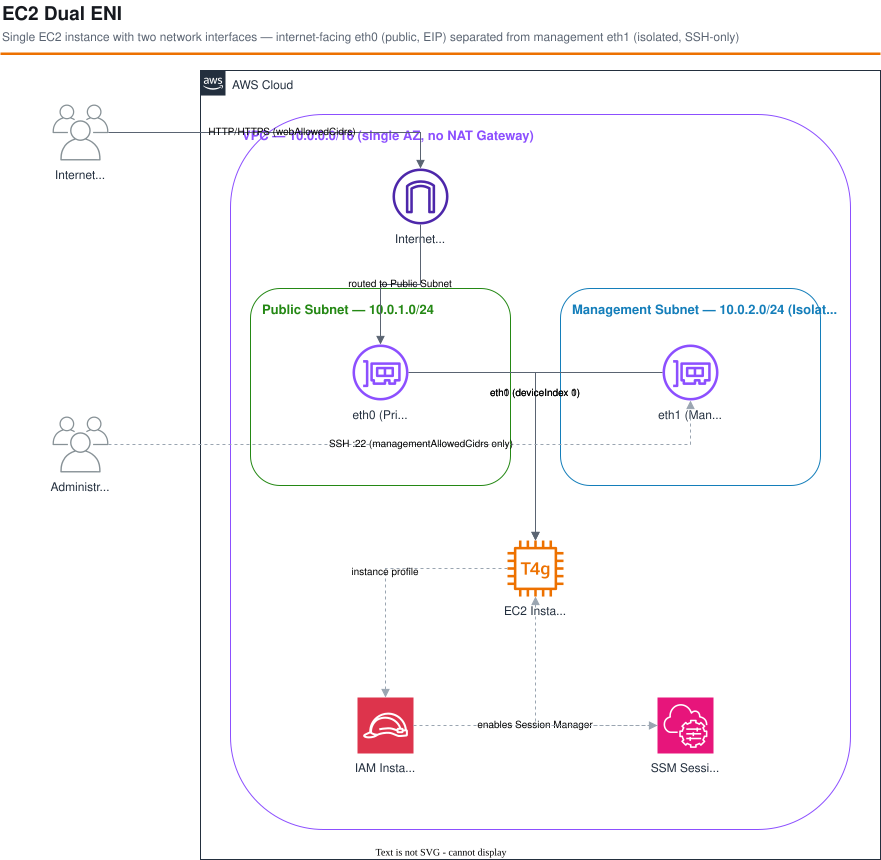

# EC2 Dual ENI Pattern<!-- omit in toc -->

*Read this in other languages:* [](./README.ja.md) [](./README.md)


## Table of Contents<!-- omit in toc -->

- [Overview](#overview)
- [Architecture](#architecture)
- [Network Design](#network-design)
- [Security Design](#security-design)
- [Project Structure](#project-structure)
- [Deployment](#deployment)
- [Verification](#verification)
- [Comparison with Modern Best Practices](#comparison-with-modern-best-practices)
- [Cleanup](#cleanup)

## Overview

This workspace implements the pattern of attaching two network interfaces (ENIs) to a single EC2 instance.

- **eth0 (Primary ENI)**: For internet-facing web traffic. An Elastic IP (EIP) is assigned, and HTTP/HTTPS is open to all internet addresses.
- **eth1 (Secondary ENI)**: For management traffic. SSH (port 22) is allowed only from specific CIDR ranges.

This pattern frequently appears in AWS certification exams (e.g., ANS-C01) and is provided as a **learning and exam-preparation reference**.

> **Note**: In modern AWS best practices, SSM Session Manager eliminates the need for SSH key management and a dedicated management ENI. See [Comparison with Modern Best Practices](#comparison-with-modern-best-practices).

## Architecture



```
Internet
   │
   │ HTTP/HTTPS (0.0.0.0/0)
   ▼
┌──────────────────────────────────────────────┐
│  VPC (10.0.0.0/16)                          │
│                                              │
│  Public Subnet (10.0.1.0/24)                │
│  ┌────────────────────────────────────────┐  │
│  │ EC2 Instance                           │  │
│  │ ┌─────────────────────────────────┐   │  │
│  │ │ eth0 ←── Web SG (HTTP/HTTPS)   │   │  │
│  │ │  └── EIP: 203.x.x.x            │   │  │
│  │ └─────────────────────────────────┘   │  │
│  └────────────────────────────────────────┘  │
│                                              │
│  Management Subnet (10.0.2.0/24) [Isolated] │
│  ┌────────────────────────────────────────┐  │
│  │ eth1 ←── Management SG (SSH only)     │  │
│  │  └── Private IP: 10.0.2.x             │  │
│  └────────────────────────────────────────┘  │
└──────────────────────────────────────────────┘
        ▲
        │ SSH (port 22) — specified CIDRs only
   Admin Host
```

## Network Design

| ENI | Subnet | Security Group | Traffic |
|-----|--------|----------------|---------|
| eth0 | Public (10.0.1.0/24) | Web SG | HTTP(80)/HTTPS(443) from 0.0.0.0/0 |
| eth1 | Management (10.0.2.0/24) [Isolated] | Management SG | SSH(22) from specified CIDRs only |

- eth0 is assigned an Elastic IP (EIP) to expose the web server with a fixed public IP.
- eth1 is placed in an isolated subnet (no internet gateway) and restricted to SSH management.
- Both ENIs must be in the same AZ (CDK controls this with `maxAzs: 1`).

## Security Design

| Item | Configuration |
|------|--------------|
| IMDSv2 | Required (HttpTokens: required) |
| EBS Volume | Encryption enabled (gp3) |
| SSM Session Manager | Enabled via IAM role (SSH alternative) |
| Management SSH | Allowed from specified CIDRs only |
| Web Traffic | HTTP/HTTPS only (via eth0) |

## Project Structure

```
ec2-dual-eni/
├── bin/ec2-dual-eni.ts          # App entry point
├── lib/
│   ├── constructs/
│   │   └── ec2-dual-eni.ts      # Dual ENI Construct
│   ├── stacks/
│   │   └── ec2-dual-eni-stack.ts
│   └── stages/
│       └── ec2-dual-eni-stage.ts
├── parameters/
│   ├── environments.ts          # EnvParams type definition
│   ├── dev-params.ts            # Development environment parameters
│   └── index.ts
├── src/
│   └── nginx-userdata.ts        # Dual ENI info demo page
└── test/
    ├── unit/                    # Unit tests
    ├── snapshot/                # Snapshot tests
    └── compliance/              # cdk-nag checks
```

## Deployment

### Environment Variables

| Variable | Default | Description |
|----------|---------|-------------|
| `WEB_ALLOWED_CIDRS` | Deployer's global IP | CIDRs (comma-separated) allowed to reach eth0 (HTTP/HTTPS) |
| `MANAGEMENT_ALLOWED_CIDRS` | Deployer's global IP | CIDRs (comma-separated) allowed to SSH into eth1 |

> **Important — Web access restriction**
>
> The intended architecture opens eth0 to all internet (`0.0.0.0/0`), but to prevent
> accidentally exposing the EC2 instance when running the sample as-is,
> **the default restricts web access to the deployer's own IP only**.
>
> To open to all internet as the pattern intends, explicitly set `WEB_ALLOWED_CIDRS=0.0.0.0/0`.

```bash
# Deploy with default (own IP only)
PROJECT=myproject ENV=dev npm run deploy:all

# Open to all internet (as the pattern intends)
WEB_ALLOWED_CIDRS=0.0.0.0/0 \
MANAGEMENT_ALLOWED_CIDRS=203.0.113.0/24 \
PROJECT=myproject ENV=dev npm run deploy:all
```

## Verification

After deployment, CloudFormation Outputs will show:

- `WebUrl`: Access the web server at `http://<EIP>`
- `ElasticIP`: The EIP assigned to eth0
- `ManagementPrivateIP`: Private IP of eth1

Opening `http://<EIP>` in a browser displays instance metadata and IP information for both ENIs:

```
┌─────────────────────────────────────┐
│  🖥 EC2 Dual ENI Demo               │
│                                     │
│  Instance Info                      │
│  Hostname: ip-10-0-1-xxx.ec2...     │
│  Instance ID: i-0abc123def456789    │
│  AZ: ap-northeast-1a                │
│                                     │
│  Network Interfaces                 │
│  eth0 [Internet-facing]             │
│    Public IP (EIP): 203.x.x.x      │
│    Private IP: 10.0.1.x             │
│    ✅ HTTP/HTTPS open to 0.0.0.0/0  │
│                                     │
│  eth1 [Management]                  │
│    Private IP: 10.0.2.x             │
│    🔒 SSH restricted to CIDR only   │
└─────────────────────────────────────┘
```

## Comparison with Modern Best Practices

| Aspect | This Pattern (Dual ENI) | Modern Approach |
|--------|------------------------|-----------------|
| Management access | SSH via eth1 (key management required) | SSM Session Manager (no keys needed) |
| Network isolation | SG separation per ENI | VPC endpoints + private subnets |
| Public IP | EIP (static) | CloudFront / ALB |
| Certification relevance | Frequent in ANS-C01 | — |

For production workloads, migrating to SSM Session Manager is strongly recommended.

## Cleanup

```bash
PROJECT=myproject ENV=dev npm run destroy:all
```

> **Note**: The EIP is automatically released when the stack is deleted. ENIs are deleted by CloudFormation as part of stack teardown.
