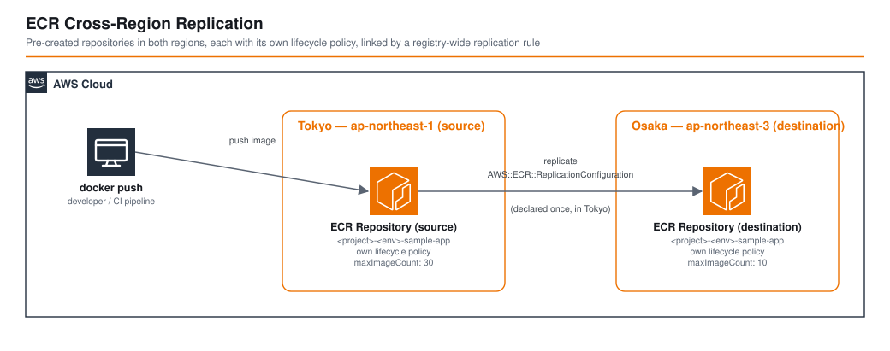

# ECR Cross-Region Replication - AWS CDK リファレンスアーキテクチャ

*他の言語で読む(Read this in other languages):* [](./README.ja.md) [](./README.md)

> **レベル: 300 (上級)**

東京リージョン（`ap-northeast-1`）から大阪リージョン（`ap-northeast-3`）への Amazon ECR クロスリージョンレプリケーション（CRR）です。CRR はデフォルトでは、最初にレプリケーションされたプッシュ時にレプリケーション先リポジトリを自動作成しますが、自動作成されたリポジトリには**ライフサイクルポリシーが設定されません**。そのため、放置するとレプリケーション先にイメージが際限なく蓄積してしまいます。このパターンでは、両方のリポジトリをそれぞれ独立したライフサイクルポリシー付きで事前作成し、その上で東京側にレジストリ全体のレプリケーション設定を有効化することで、この落とし穴を回避します。

## 📑 目次

- [アーキテクチャ概要](#-アーキテクチャ概要)
- [設計判断とベストプラクティス](#-設計判断とベストプラクティス)
- [コスト最適化](#-コスト最適化)
- [セキュリティ考慮事項](#-セキュリティ考慮事項)
- [前提条件](#-前提条件)
- [デプロイガイド](#-デプロイガイド)
- [テスト戦略](#-テスト戦略)
- [カスタマイズ](#-カスタマイズ)
- [トラブルシューティング](#-トラブルシューティング)
- [参考資料](#-参考資料)

## 🏗️ アーキテクチャ概要



```text
スタック1 — EcrCrrOsakaStack（ap-northeast-3、先にデプロイ）
  ECRリポジトリ "<project>-<env>-<suffix>"
    ライフサイクルポリシー: よりリーンな保持設定（独自のmaxImageCount/untagged/any-tagルール）

スタック2 — EcrCrrTokyoStack（ap-northeast-1、スタック1に依存）
  ECRリポジトリ "<project>-<env>-<suffix>"
    ライフサイクルポリシー: 独立した保持設定（独自のmaxImageCount/untagged/any-tagルール）
  AWS::ECR::ReplicationConfiguration（レジストリ全体、アカウント/リージョンごとに1つ）
    ルール: レプリケーション先リージョン = ap-northeast-3
            repositoryFilter = PREFIX_MATCH "<project>-<env>-<suffix>"

docker push  ──►  東京のリポジトリ  ──[非同期レプリケーション]──►  大阪のリポジトリ
                                                                    （既に存在し、独自ポリシーを維持）
```

### 主要コンポーネント

- **`EcrCrrOsakaStack`** – 大阪にレプリケーション先のECRリポジトリを独自のライフサイクルポリシー付きで作成します。東京スタックより先にデプロイすることで、レプリケーション（または手動プッシュ）の対象になる前に必ず存在している状態にします。
- **`EcrCrrTokyoStack`** – 東京にソースのECRリポジトリを作成し、`PREFIX_MATCH` フィルタでこのリポジトリ名にスコープした単一の `ecr.CfnReplicationConfiguration` を追加します。
- **`EcrConstruct`**（共通、`@common/constructs/ecr.ts`） – スタックごと・リージョンごとに2回再利用しており、独立した `EcrConfig` パラメータで駆動しながらも、両リポジトリが同じ実績あるライフサイクルルール構造（`latest`タグの保持、環境タグの数量上限、untagged/any-tagの経過日数による失効）を持ちます。
- **`test-replication.sh`** – テストイメージを東京にプッシュし、大阪に出現するまでポーリングし、両リポジトリのライフサイクルポリシーを並べて表示することで、独立して設定されていることを実証します。

### アーキテクチャ特性

| 特性 | 値 | 根拠 |
|---|---|---|
| 可用性 | 単一障害点なし。レプリケーションはマネージドな非同期ECR機能 | Amazon ECR は両リージョンともリージョンのマネージドサービスであり、可用性を維持するための独自インフラが不要 |
| スケーラビリティ | イメージのプッシュ量とサイズに応じてスケール | レプリケーションのスループットとストレージはすべてECRが管理 |
| セキュリティ | 両リポジトリともAES-256による保管時暗号化、IAMスコープ、パブリックリポジトリなし | [セキュリティ考慮事項](#-セキュリティ考慮事項)を参照 |
| コスト | 両リージョンのストレージ料金 + レプリケーションされたイメージレイヤーごとの1回限りのリージョン間転送料金 | [コスト最適化](#-コスト最適化)を参照 |

## 🎯 設計判断とベストプラクティス

### 1. CRRによる自動作成に任せず、レプリケーション先リポジトリを事前作成

**決定**: `EcrCrrOsakaStack` は、`AWS::ECR::ReplicationConfiguration` が最初のレプリケーションプッシュ時にリポジトリを自動作成するのに任せるのではなく、独自の `EcrConfig` で大阪のリポジトリを明示的に作成します。

**根拠**:
- ✅ 自動作成されたレプリカリポジトリには**ライフサイクルポリシーが設定されません**。何も失効せず、ストレージコストは増え続けるだけです。事前に作成しておくことで、存在した瞬間から独立した実際の保持ポリシーを持たせられます
- ✅ レプリカの運用面の設定（ライフサイクル、scan-on-push、タグの可変性）がソースと一致する必要はないことを示せます。この例では、大阪はあえてより保持期間の短い設定（`maxImageCount: 10` vs. 東京の`30`）を使い、scan-on-pushも無効化しており、両者が独立して設定されていることを証明します
- ✅ このリポジトリ全体で他の箇所でも使われている `EcrConstruct` をそのまま再利用しており、このパターンのためだけにECRリポジトリを定義する別のやり方を持ち込みません

**トレードオフ**:
- ❌ CRR単体なら東京側だけで済むところ、管理すべきスタック（およびデプロイ）が2つに増えます
- ❌ 2つの `EcrConfig` は `repositoryNameSuffix` を一致させる必要があります。一致していないと、レプリケーションされたイメージは大阪が事前作成したリポジトリではなく、*別の*自動作成されたリポジトリに静かに着地してしまいます（設計判断2を参照）

### 2. クロスリージョンのCDK参照ではなく、決定的なリポジトリ命名

**決定**: 両スタックとも、大阪のリポジトリ名/ARNを `CfnOutput` / `Fn::ImportValue` / `crossRegionReferences` で東京スタックに渡すのではなく、それぞれの `EcrConfig` から独立して同一のリポジトリ名 — `${project}-${environment}-${repositoryNameSuffix}` — を導出します。

**根拠**:
- ✅ `AWS::ECR::ReplicationConfiguration` はリポジトリを ARN やCDK参照ではなく**名前**（`repositoryFilters` / `PREFIX_MATCH`）でマッチングします。実際に必要なのは単純な決定的文字列だけです
- ✅ クロスリージョンのCloudFormation export/importは、デプロイ順序への強い結合を生み、後片付けも複雑にします（exportされた値は、他のスタックがimportしている間は削除できません）。共有の命名規則にすることで、この結合を完全に回避できます
- ✅ `EcrCrrTokyoStack` は、2つのサフィックスが食い違った場合に明示的なガード（`sourceRepositoryNameSuffix !== destinationRepositoryNameSuffix`）でsynth時に即座に失敗するため、「規約による同名」というアプローチが静かに壊れることはありません

**トレードオフ**:
- ❌ `parameters/*.ts` を編集する担当者が、2つのパラメータブロック（`sourceEcrConfig`、`destinationEcrConfig`）の `repositoryNameSuffix` を手動で一致させる必要があります。型システムではなく実行時ガードのみがこれを保証します

### 3. `PREFIX_MATCH` でスコープした、レジストリ全体で1つのレプリケーションルール

**決定**: `EcrCrrTokyoStack` は、`ecr.CfnReplicationConfiguration` をちょうど1つだけ宣言し、そのルールの `repositoryFilters` をこのスタック自身のリポジトリ名に制限します。

**根拠**:
- ✅ `AWS::ECR::ReplicationConfiguration` は**アカウント/リージョンごとのシングルトン**です。CloudFormation（およびECR自体）は1つしか許可しません。どこか別の場所で2つ目を宣言すれば、同じアカウントの東京リージョンで競合します。フィルタなしのレジストリ全体設定ではなくルールのフィルタをスコープすることで、このスタックは同じアカウント/リージョン内の無関係な他のECRリポジトリと共存でき、それらまで誤ってレプリケーションすることがありません
- ✅ 正確なリポジトリ名での `PREFIX_MATCH` は、意図的にワイルドカードのプレフィックスにはしていません。このパターンが作成した1つのリポジトリにしか決してマッチしないため、アカウント内の他のECR利用が増えても誤ってレプリケーションが始まることはありません

**トレードオフ**:
- ❌ このリソースはシングルトンであるため、独自の `CfnReplicationConfiguration` を宣言する別の独立デプロイのスタックと同じアカウント/リージョンで安全に組み合わせることはできません（衝突します）。実際に複数リポジトリを扱う構成では、すべてのレプリケーションルールを1つのこのリソース内のルールとしてモデル化すべきです

### 4. 大阪を東京より先にデプロイ

**決定**: `EcrCrossRegionReplicationStage` は `EcrCrrOsakaStack` を先にインスタンス化し、`tokyoStack.addDependency(osakaStack)` を追加することで、CloudFormationが常に大阪を東京より先にデプロイ/更新するようにしています。

**根拠**:
- ✅ 東京側のレプリケーションルール（または `test-replication.sh` による手動プッシュ）が大阪へイメージの送信を開始する前に、独自のライフサイクルポリシーが既に付いたレプリケーション先リポジトリが大阪に存在していることを保証し、CRRが先にそれを自動作成してしまうかもしれない競合状態の窓を閉じます
- ✅ `EcrCrrOsakaStack` 自身の設計意図（設計判断1）と一致します。事前作成が「ライフサイクルポリシーなし」問題を防げるのは、最初のレプリケーションイメージが到着する*前に*確実に完了している場合だけです

**トレードオフ**:
- ❌ 東京が大阪の完了を待つため、両スタックを並行デプロイする場合に比べ、初回デプロイがわずかに遅くなります

### Well-Architected フレームワークとの整合性

| Pillar | 実装内容 |
|---|---|
| **運用上の優秀性** | `EcrConstruct` が両リージョンで `CfnOutput`（`RepositoryUri`、`RepositoryName`）を出力。`test-replication.sh` により、レプリケーションの検証と両ライフサイクルポリシーの比較をエンドツーエンドでスクリプト実行可能 |
| **セキュリティ** | 両リポジトリともAES-256による保管時暗号化を使用。ソースリポジトリはscan-on-pushを有効化。IAMは各スタックが実際に作成するものにスコープ |
| **信頼性** | 明示的なスタック依存関係（大阪を東京より先に）により、リポジトリ作成とレプリケーションの間の競合を排除。synth時のガードにより、リポジトリ名の不一致がレプリケーションイメージを静かに誤誘導することを防止 |
| **パフォーマンス効率** | クロスリージョンレプリケーションは完全マネージドな非同期ECR機能であり、本番運用でも独自のコンピュートやポーリングインフラは不要 |
| **コスト最適化** | リージョンごとに独立したライフサイクルポリシー（大阪はよりリーンな保持設定）により、各リージョンのストレージ増加を個別に抑制。詳細は[コスト最適化](#-コスト最適化)を参照 |
| **持続可能性** | このパターンにはどこにもアイドルコンピュートがなく、2つのECRリポジトリと1つのレプリケーションルールのみで、いずれも完全マネージド |

## 💰 コスト最適化

### 月額コスト試算（ap-northeast-1 / ap-northeast-3、軽量デモ利用）

```text
東京（ソース）ECRストレージ（<500 MB、無料枠内）:          無料枠
大阪（レプリケーション先）ECRストレージ（<500 MB）:        無料枠
プッシュ時の基本イメージスキャン（東京のみ）:               無料
リージョン間データ転送（テストプッシュ数回、<100 MB）:      $0.01未満
-------------------------------------------
合計（Dev、デモ利用）:                                      月$1未満
```

### より大規模な場合の月額コスト試算（例示: 新規イメージレイヤーを月間5GBプッシュ、各リージョン独自のライフサイクルポリシーによる古いイメージ削除後、東京に20GB、大阪に10GBが残る想定）

```text
東京ECRストレージ（20GB保持、@ ~$0.10/GB-月）:              ~$2.00
大阪ECRストレージ（10GB保持、@ ~$0.10/GB-月）:              ~$1.00
リージョン間レプリケーションのデータ転送（月間新規5GB）:    ~$0.10〜$0.45
-------------------------------------------
合計（月間新規プッシュ~5GB、定常状態）:                     月$3〜4
```

*これらの数値はあくまで概算・例示です。ECRストレージおよびリージョン間データ転送の料金はリージョンの組み合わせによって異なり、時期によっても変動します。必ず[AWS Pricing Calculator](https://calculator.aws/)で最新の料金をご確認ください。正確な料金に関わらず成り立つポイントは、*新規にプッシュされた*イメージレイヤーのみがリージョンをまたいで転送される（ECRのレプリケーションは定期フルシンクではなく差分転送）ため、レプリケーションの増分コストはリポジトリ全体のサイズではなくプッシュ量にスケールするという点です。*

### コスト最適化戦略

1. **レプリカ側で独立したよりリーンなライフサイクルポリシーを設定** — このパターンの核心そのものです。大阪の `maxImageCount: 10` / `untaggedDurationDays: 7` は、東京の `maxImageCount: 30` / `untaggedDurationDays: 14` よりもはるかに積極的に削除します。DR/セカンダリリージョンのレプリカは、通常ソースと同じ深さの履歴を必要としないためです
2. **正確なリポジトリ名にスコープした `PREFIX_MATCH`** — 同じアカウント/リージョンに後から追加されるかもしれない無関係な他のリポジトリを誤ってレプリケーションしてしまうことを防ぎます
3. **Enhanced スキャン（Amazon Inspectorベース、イメージごとに課金）ではなく Basic（無料）イメージスキャン** — このリファレンスパターンには十分です。より深いCVEカバレッジが実際に必要な場合のみEnhanced スキャンに切り替えてください

## 🔒 セキュリティ考慮事項

### ネットワークセキュリティ

Amazon ECR は AWS API（および HTTPS 経由の Docker/OCI レジストリ API）でアクセスするリージョンのマネージドサービスです。このパターンにはVPC常駐リソースが一切なく、保護すべきインバウンドのネットワーク境界もありません。クロスリージョンのレプリケーショントラフィックはAWSのバックボーン内に留まります。

### 実装済みのセキュリティベストプラクティス

- ✅ 両リポジトリとも `RepositoryEncryption.AES_256` による保管時暗号化を使用
- ✅ どちらのリポジトリもパブリックではありません。いずれも標準のプライベートECRリポジトリで、明示的なIAM権限を持つプリンシパルのみがアクセス可能です
- ✅ ソースリポジトリは `imageScanOnPush: true` に設定されており、プッシュされたすべてのイメージが誰かがプルする前にスキャンされます
- ✅ 両リポジトリとも `emptyOnDelete: true` と `RemovalPolicy.DESTROY` を設定しており、このリファレンスパターンのスタックはデモ/テスト目的で完全に削除可能です（`EcrConstruct` のインラインコメントで、本番環境には**推奨されない**旨が明記されています。本番利用では `RemovalPolicy.RETAIN` に切り替えてください）
- ✅ レプリケーションルールの `repositoryFilters` は、このパターンのリポジトリ名にのみレプリケーションをスコープしているため、明示的なコード変更なしにアカウント内の他のリポジトリまでレプリケーション対象が広がることはありません

### CDK Nag Compliance

両スタックとも、ドキュメント化されたサプレッション1件のみで `cdk-nag` の `AwsSolutionsChecks` に準拠しています: `AwsSolutions-ECR1`（プッシュ時のイメージスキャン）。このパターンは、ライフサイクル/スキャン設定がリージョンごとに独立して設定されることを示すため、東京（`true`）と大阪（`false`）で*意図的に*scan-on-pushを異なる値に設定しています。正確な理由は `test/compliance/cdk-nag.test.ts` を参照してください。

```bash
npm run test:compliance -w workspaces/ecr-cross-region-replication
```

## 📋 前提条件

- 適切な権限を持つAWSアカウント
- AWS CLI v2.x のインストールと設定
- Node.js 20.x以降
- AWS CDK 2.x（`aws-cdk-lib` ^2.186、このワークスペースに同梱）
- Git
- Docker（`test-replication.sh` の実行時のみ必要。テストイメージのプッシュに使用）
- `jq`（`test-replication.sh` の実行時のみ必要）

### 必要なIAM権限

デプロイを実行するユーザー/ロールには、以下を作成・管理する権限が必要です:
- ECR（リポジトリ、ライフサイクルポリシー、レプリケーション設定）を `ap-northeast-1` と `ap-northeast-3` の両方で
- CloudFormation（スタックデプロイ）

## 🚀 デプロイガイド

### 1. クローンとセットアップ

```bash
cd infrastructure
npm install
```

### 2. 環境パラメータの設定

異なるリポジトリ名・リージョン・ライフサイクル値を使いたい場合は `parameters/dev-params.ts` を編集してください。デフォルトでは、東京にソースリポジトリ（`maxImageCount: 30`）、大阪にレプリケーション先リポジトリ（`maxImageCount: 10`）を、共通の `sample-app` サフィックスでデプロイします。

### 3. デプロイ

```bash
export PROJECT_NAME=ecr-crr-demo
export ENV=dev
npm run bootstrap -w workspaces/ecr-cross-region-replication   # アカウント/リージョンごとに初回のみ
npm run deploy:all -w workspaces/ecr-cross-region-replication
```

CDKは `EcrCrrOsakaStack` を `EcrCrrTokyoStack` より先にデプロイします（[設計判断4](#4-大阪を東京より先にデプロイ)を参照）。

### 4. デプロイの確認

```bash
# 両リポジトリが存在し、それぞれ独自のライフサイクルポリシーを持つことを確認:
aws ecr describe-repositories --region ap-northeast-1 --repository-names ecr-crr-demo-dev-sample-app
aws ecr describe-repositories --region ap-northeast-3 --repository-names ecr-crr-demo-dev-sample-app

# エンドツーエンド: テストイメージを東京にプッシュし、大阪へのレプリケーションを待ち、
# 両リージョンのライフサイクルポリシーを並べて表示:
./test-replication.sh --project ecr-crr-demo --env dev
```

## 🧪 テスト戦略

### テスト構成

```text
test/
├── snapshot/          # 両スタックのCloudFormationテンプレート全体+リソース数スナップショット
│   └── snapshot.test.ts
├── unit/               # スタックごとの詳細なリソース/プロパティ/関係性の検証
│   ├── ecr-crr-tokyo-stack.test.ts
│   └── ecr-crr-osaka-stack.test.ts
└── compliance/         # cdk-nag AwsSolutionsチェック（test.eachでスタックごとに実行）
    └── cdk-nag.test.ts
```

### 1. スナップショットテスト

**目的**: リファクタリング時のCloudFormationテンプレートの意図しない変更を検知する。

```bash
npm run test:snapshot -w workspaces/ecr-cross-region-replication
npm run test:snapshot:update -w workspaces/ecr-cross-region-replication   # 意図した変更の後
```

### 2. ユニットテスト

**目的**: 各スタックが期待通りのリソース・プロパティ・関係性を生成することを検証する。

**テストカテゴリ**:
- ✅ 東京スタック: 決定的な名前を持つソースリポジトリが正確に1つ、正しいレプリケーション先リージョンと `PREFIX_MATCH` フィルタを持つ `AWS::ECR::ReplicationConfiguration` が正確に1つ、レプリケーション設定がリポジトリに依存していること、`ScanOnPush: true`、ソース/レプリケーション先の `repositoryNameSuffix` が食い違った場合のsynth時エラー
- ✅ 大阪スタック: 東京と同じ決定的な名前を持つレプリケーション先リポジトリが正確に1つ、レプリケーション設定はゼロ、よりリーンなライフサイクルポリシー（untaggedイメージの短い保持期間）、`ScanOnPush: false`、`destinationEcrConfig` が未指定の場合の `sourceEcrConfig` へのフォールバック

### 3. コンプライアンステスト

```bash
npm run test:compliance -w workspaces/ecr-cross-region-replication
```

### すべて実行

```bash
npm run build -w workspaces/ecr-cross-region-replication
npm test -w workspaces/ecr-cross-region-replication
npm run lint -w workspaces/ecr-cross-region-replication
```

## ⚙️ カスタマイズ

### レプリケーション先リージョンを変更

```typescript
// parameters/dev-params.ts
ecrCrr: {
    destinationRegion: 'us-west-2',   // ECRがサポートする任意の他リージョン
    // ...
},
```

### レプリケーション先リポジトリに異なる保持ポリシーを設定

```typescript
// parameters/dev-params.ts
ecrCrr: {
    destinationEcrConfig: {
        createConfig: {
            repositoryNameSuffix: 'sample-app',   // sourceEcrConfigのサフィックスと一致させる必要あり
            maxImageCount: 5,
            untaggedDurationDays: 3,
            anytagDurationDays: 30,
            isImageScanOnPush: false,
        },
    },
    // ...
},
```

### レプリケーション先の個別設定を省略する

`destinationEcrConfig` を完全に省略すると、`EcrCrrOsakaStack` は `sourceEcrConfig` の再利用にフォールバックします。この場合、両リポジトリは（独立ではなく）同一のライフサイクルポリシーを持ちます:

```typescript
// parameters/dev-params.ts
ecrCrr: {
    sourceEcrConfig: { /* ... */ },
    // destinationEcrConfig を省略 — 大阪は sourceEcrConfig を再利用
    destinationRegion: 'ap-northeast-3',
},
```

## 🔧 トラブルシューティング

### 問題: レプリケーションされたイメージが想定外の自動作成リポジトリに着地する

**症状**: 大阪で `aws ecr describe-repositories` を実行すると、作成した覚えのないリポジトリが表示され、ライフサイクルポリシーが設定されていない。

**解決策**:
1. `sourceEcrConfig.createConfig.repositoryNameSuffix` と `destinationEcrConfig.createConfig.repositoryNameSuffix` が一致しているか確認してください。`EcrCrrTokyoStack` は両者が食い違っているとsynth時に例外を送出するため、これが発生するのは異なるパラメータのバージョンからスタックがデプロイされた場合のみのはずです
2. `EcrCrrOsakaStack` が、東京へのイメージプッシュより*前に*デプロイされ、リポジトリが実際に存在していることを確認してください

### 問題: `test-replication.sh` がレプリケーション待機でタイムアウトする

**症状**: `Error: image did not replicate to ap-northeast-3 within 300s`

**解決策**:
1. レプリケーションは非同期かつベストエフォートで、秒単位ではなく分単位かかることがあります。`--timeout` をより長くして再実行してください
2. レプリケーション設定が存在し、正しいリージョンを対象にしているか確認: `aws ecr describe-registry --region ap-northeast-1`
3. 大阪にレプリケーション先リポジトリが存在するか確認してください（前の問題を参照）。CRRはリポジトリが存在して初めてそこへレプリケーションでき、存在しない場合はデフォルト設定の同名リポジトリを自動作成してしまいます

### 問題: `cdk deploy` がレプリケーション設定の競合で失敗する

**症状**: アカウント/リージョン内に既に存在するため `AWS::ECR::ReplicationConfiguration` の作成が失敗する。

**解決策**:
1. `AWS::ECR::ReplicationConfiguration` はアカウント/リージョンごとのシングルトンです（[設計判断3](#3-prefix_matchでスコープした、レジストリ全体で1つのレプリケーションルール)を参照）。`aws ecr describe-registry --region ap-northeast-1` で既存のものを確認し、2つ目を宣言する代わりにそれをインポート/改修するか、既存設定の `rules` 配列にこのパターンのルールを追加してください

## 📚 参考資料

### AWS ドキュメント
- [Amazon ECR private repository cross-Region replication](https://docs.aws.amazon.com/AmazonECR/latest/userguide/replication.html)
- [Amazon ECR lifecycle policies](https://docs.aws.amazon.com/AmazonECR/latest/userguide/LifecyclePolicies.html)
- [Amazon ECR image scanning](https://docs.aws.amazon.com/AmazonECR/latest/userguide/image-scanning.html)

### AWS Well-Architected
- [AWS Well-Architected Framework](https://aws.amazon.com/architecture/well-architected/)

### AWS CDK
- [aws-cdk-lib.aws_ecr module](https://docs.aws.amazon.com/cdk/api/v2/docs/aws-cdk-lib.aws_ecr-readme.html)
- [CfnReplicationConfiguration](https://docs.aws.amazon.com/cdk/api/v2/docs/aws-cdk-lib.aws_ecr.CfnReplicationConfiguration.html)
- [CDK Best Practices](https://docs.aws.amazon.com/cdk/v2/guide/best-practices.html)

### 関連アーキテクチャ
- [ecs-fargate-alb](../ecs-fargate-alb/) – 共通の `EcrConstruct` を使用する別のアーキテクチャ。単一リージョンのECSデプロイパイプラインの文脈で参照可能

## 📄 ライセンス

このプロジェクトはMITライセンスの下で公開されています。詳細は [LICENSE](../../LICENSE) ファイルを参照してください。

## 👥 コントリビューション

コントリビューションを歓迎します。詳細は [CONTRIBUTING.md](../../CONTRIBUTING.md) を参照してください。

## 🏆 このリファレンスアーキテクチャについて

このリファレンスアーキテクチャは、本番運用可能なインフラを構築するためのAWS CDKベストプラクティスを示すものです。

**対象レベル**: 300（上級）

---

**注記**: これはリファレンス実装です。本番環境へのデプロイ前に、必ず組織の要件・ポリシーに応じてレビュー・カスタマイズしてください。
