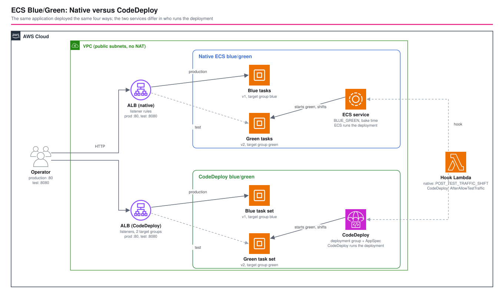

# ECS Blue/Green: Native versus CodeDeploy - AWS CDK Reference Architecture

[](./README.ja.md)
[](./README.md)


Amazon ECS can now do blue/green deployments by itself (**native**, since 2025), as an alternative to the older route through **AWS CodeDeploy**. This pattern deploys the same application both ways, side by side, and runs the same four deployments through each: a good release, a release whose lifecycle hook fails, a rollback during the bake period, and a release whose container never starts. A probe sends five requests per second to production the whole time. You get the differences as measurements, not as a feature table.

| | Native ECS blue/green | CodeDeploy blue/green |
|---|---|---|
| Who runs it | The ECS service itself (`deploymentStrategy: BLUE_GREEN`) | A CodeDeploy application and deployment group; the service uses the `CODE_DEPLOY` controller |
| What starts a deployment | Updating the service's task definition | `create-deployment` with an AppSpec |
| Lifecycle hooks | Lambda functions on named stages (`POST_TEST_TRAFFIC_SHIFT`, ...) | Lambda functions named in the AppSpec (`AfterAllowTestTraffic`, ...) |
| Keeping the old version | `bakeTime` | `terminationWaitTime` |
| Automatic rollback | On a failed hook | On a failed deployment and on a CloudWatch alarm |
| Extra things to manage | None | The application, the deployment group, a service role, the AppSpec |

## 📑 Table of Contents

- [Architecture Overview](#️-architecture-overview)
- [Design Decisions & Best Practices](#-design-decisions--best-practices)
- [Well-Architected Alignment](#️-well-architected-alignment)
- [Cost Optimization](#-cost-optimization)
- [Security Considerations](#-security-considerations)
- [Prerequisites](#-prerequisites)
- [Deployment Guide](#-deployment-guide)
- [Operational Check Script](#-operational-check-script)
- [Testing Strategy](#-testing-strategy)
- [Customization](#️-customization)
- [Troubleshooting](#-troubleshooting)
- [Clean-up](#-clean-up)
- [References](#-references)

## 🏗️ Architecture Overview



### Key Components

- **VPC** — two AZs, public subnets only, no NAT gateway; the tasks get public IPs to pull the image and answer the load balancer.
- **Two ECS services** (Fargate, ARM64, 2 tasks each) running the same nginx application. The task answers `{"version", "service", "task"}`; a new version is a task definition revision with another `VERSION`.
- **Two internet-facing ALBs**, one per service, each with a production listener on `:80` and a test listener on `:8080`. Both accept the operator's IP only.
- **Native service** — the production and test listeners route through **listener rules**; the service lists the alternate target group, both rules and a Lambda lifecycle hook (`POST_TEST_TRAFFIC_SHIFT`), with a 2-minute bake time.
- **CodeDeploy service** — the listeners forward to the blue and green target groups; the deployment group lists both, the test listener, all-at-once traffic shifting, a 2-minute termination wait, automatic rollback on failure and on a 5xx alarm.
- **Hook Lambda** — waits 25 seconds (a window in which the new version answers on the test listener while production still serves the old one), then passes or fails according to an SSM parameter (one per flavor). It understands both hook protocols.
- **`test-deployments.sh`** — runs the four scenarios through both flavors in parallel and compares them.

## 🎯 Design Decisions & Best Practices

### 1. Same application, same ALB layout, so only the mechanism differs

Both services run the same task shape behind the same listener layout (production `:80`, test `:8080`), with the same hook and the same 2-minute grace period for the old version. Anything that differs in the measurements comes from who runs the deployment.

### 2. The test listener lets you look at green before production does

During a deployment the green tasks answer on `:8080` while `:80` still serves blue. The script checks this on both flavors: the test listener returned `v2` while production still returned `v1`. That is the window for smoke tests, and it is where the lifecycle hook runs (`POST_TEST_TRAFFIC_SHIFT` natively, `AfterAllowTestTraffic` in CodeDeploy).

### 3. A good release: the numbers

| | Native | CodeDeploy |
|---|---|---|
| Production serves the new version after | 171 s | 168 s |
| Deployment ends after | 316 s | 277 s |
| Requests during the whole run | 5,811, 0 HTTP errors | 4,327, 0 HTTP errors |

Most of the time before the switch is starting the green tasks, waiting for healthy targets and the 25-second hook; both took about the same. The deployment then stays open for the bake time (native) or termination wait (CodeDeploy), which is why "ended" is later than "switched". The probe saw no HTTP error response at any point, including the traffic shift and the rollbacks. It did see a few requests with no response at all (a 2-second curl timeout) in both runs, at about one a minute, also while nothing was being deployed and never within 2 seconds of a version change: that is the client, not the deployment.

### 4. A hook that fails rolls back, and production never notices

With the verdict set to `fail`, the hook answers failure after its delay and the deployment rolls back with production untouched:

| | Native | CodeDeploy |
|---|---|---|
| Time until it gives up | 260 s | 155 s |
| Production afterwards | v2 | v2 |
| Reported as | `ROLLBACK_SUCCESSFUL`: "rolled back because POST_TEST_TRAFFIC_SHIFT lifecycle hook(s) failed. Lifecycle hook target ... returned FAILED status" | `Failed`, then CodeDeploy's own rollback deployment |

Native ECS tells you which hook failed in the deployment's status reason. In CodeDeploy a failed deployment starts a second, rollback deployment, which you see as a separate deployment ID.

### 5. Rolling back after production has switched

While the old version is still kept (bake time, termination wait), a rollback returns production to it without starting any task:

| | Native | CodeDeploy |
|---|---|---|
| Rollback command | `aws ecs stop-service-deployment --stop-type ROLLBACK` | `aws deploy stop-deployment --auto-rollback-enabled` |
| Production back on the old version after | 20 s | 14 s |

After the bake time or the termination wait, blue is gone and a rollback is a new deployment of the old version (minutes). The wait is the price of an instant rollback: you pay for the old tasks meanwhile.

### 6. Neither gave up on a container that never starts

A release whose container exits immediately did not fail by itself within 7 minutes on either flavor: ECS keeps trying to start the tasks. Production stayed on the old version throughout, so users were safe, but the deployment was stuck until it was stopped (the script stops it with a rollback after 7 minutes). A timeout, an alarm or a circuit breaker is needed to make that automatic. CodeDeploy can roll back on a CloudWatch alarm, which this stack has for 5xx responses; neither the alarm nor a deployment circuit breaker was exercised against this failure, so a real pipeline should add and test its own.

### 7. Pick by what you need to manage

| Choose | When |
|---|---|
| Native ECS blue/green | You want one less service to run and permissions to scope; hooks in Lambda are enough; deployment is "update the task definition" |
| CodeDeploy | You already use CodeDeploy pipelines, you need its deployment configurations (canary or linear shifting with alarms, an AppSpec in the pipeline) or its console history across compute types |

Native ECS also offers linear and canary strategies; this pattern compares the all-at-once blue/green on both sides for a fair comparison.

### 8. Environment-specific parameters

`parameters/<env>-params.ts` sets the CIDR, the task count, the image, the bake time, the termination wait and the hook delay.

## 🏛️ Well-Architected Alignment

| Pillar | How this architecture addresses it |
|---|---|
| Operational Excellence | `test-deployments.sh` rehearses success, failed validation, rollback and a broken release on both flavors; deployments are observable through `describe-service-deployments` and `get-deployment` |
| Security | Load balancers admit the operator's IP only; tasks accept the ALB only; least-privilege hook role; no secrets |
| Reliability | Production keeps serving the old version while the new one is validated; rollback in seconds during the bake; a failed hook never reaches users |
| Performance Efficiency | ARM64 Fargate tasks; traffic moves only after the new tasks are healthy |
| Cost Optimization | No NAT gateway; short bake times; both flavors are removed when not in use (see below) |
| Sustainability | Small tasks and a short-lived stack |

## 💰 Cost Optimization

Approximate costs in `ap-northeast-1` (verify against the pricing pages):

| Item | Approx. |
|---|---|
| Two ALBs | about 0.045 USD per hour plus capacity units |
| Fargate, 4 ARM64 tasks (0.25 vCPU, 0.5 GiB); up to 8 during a deployment | about 0.1 USD per hour |
| Public IPv4 addresses (tasks and ALBs) | about 0.005 USD per hour each |
| CodeDeploy for ECS | no charge |

Roughly 0.2 to 0.3 USD per hour. The whole verification (about 45 minutes) cost well under 1 USD; destroy the stack when you are done. Blue/green doubles the running tasks during a deployment and for the bake time; that is the cost of the safety.

## 🔒 Security Considerations

### Implemented

- Both ALBs accept the operator's IP (detected, or `ALLOWED_IPS` / `ALLOWED_IPV6S`) on ports 80 and 8080 only; tasks accept port 80 from the ALB's security group only.
- The hook function can read its two verdict parameters and report to CodeDeploy; it has no ECS permission.
- The CodeDeploy service role is the AWS-managed one plus permission to invoke the hook.
- The load balancers drop invalid header fields.

### CDK Nag suppressions (with reasons)

| Rule | Reason |
|---|---|
| AwsSolutions-IAM4 / IAM5 | AWS-documented managed policies for Lambda, CodeDeploy for ECS and the ECS task execution role; deployment roles need wildcards AWS defines without finer scope |
| AwsSolutions-ELB2 | Short-lived ALBs restricted to the operator; access logs need a bucket out of scope here |
| AwsSolutions-EC23 | The ingress is the operator IP, never `0.0.0.0/0`; the rule cannot read the CIDR from a parameter |
| AwsSolutions-ECS2 / ECS4 | The environment holds a version label and a flag; Container Insights is a per-metric charge |
| AwsSolutions-VPC7, L1, CdkNagValidationFailure | No traffic logs for a short-lived comparison; latest Node.js at authoring time; an intrinsic value a rule cannot evaluate |

### Out of scope (add per environment)

HTTPS on the listeners (needs a domain and certificate), WAF, private subnets with NAT or VPC endpoints, a pipeline that creates the task definition revisions, and canary or linear traffic shifting.

## 📋 Prerequisites

- Node.js 24+, AWS CDK v2, an AWS account with CDK bootstrapped
- `aws` (a recent v2 with `ecs describe-service-deployments`), `curl` and `jq` for `test-deployments.sh`
- The machine you test from must be the one whose IP the stack allows

## 🚀 Deployment Guide

```bash
export PROJECT=<project> ENV=dev
npm install
npm run stage:deploy:all -w workspaces/ecs-blue-green-native-vs-codedeploy   # about 7 minutes
./workspaces/ecs-blue-green-native-vs-codedeploy/test-deployments.sh --project $PROJECT --env $ENV   # about 45 minutes
```

If you deploy from a machine that is not the one you test from, set `ALLOWED_IPS=<ip>[,<ip>]` for the deployment.

## 🧪 Operational Check Script

`./test-deployments.sh --project <project> --env <env> [--only native|codedeploy]` starts from `v1`, probes production five times a second, and runs through each flavor (both in parallel):

1. **A good release (v2)** — the test listener shows `v2` while production still shows `v1`, production then switches, the deployment succeeds, and no request gets an HTTP error
2. **A failing hook (v3)** — the deployment rolls back automatically and production stays on `v2`
3. **A good release (v4) rolled back during the bake or wait** — production returns to `v2`; the time is measured
4. **A broken release (v5, the container exits)** — whether the platform gives up by itself is observed for 7 minutes, then the deployment is stopped and production must still be on `v2`

Verified on 2026-10-10 in `ap-northeast-1`: all checks passed on both flavors; the numbers are in the design decisions above.

## 🧪 Testing Strategy

```bash
npm test -w workspaces/ecs-blue-green-native-vs-codedeploy
```

- **Snapshot**: the full template and resource counts.
- **Unit**: the native strategy, bake time and alternate-target configuration, the lifecycle hook stage, the listener rules, the CodeDeploy controller and deployment group (all-at-once, termination wait, rollback events, test listener, alarm), the shared task shape and public-subnet layout, the operator-only ALB ingress (bare IP and CIDR), per-flavor verdict parameters, the hook role, and the BREAK switch of the sample container.
- **Compliance**: CDK Nag `AwsSolutionsChecks` with the reasons above.

## ⚙️ Customization

| Parameter | Meaning |
|---|---|
| `vpcCidr`, `desiredCount`, `containerImage` | Network, task count and sample image |
| `nativeBakeMinutes` | How long native ECS keeps blue after production switched |
| `codeDeployTerminationWaitMinutes` | How long CodeDeploy keeps blue |
| `hookDelaySeconds` | How long the sample hook waits (the window to inspect the test listener) |

To use CodeDeploy's other strategies, change `deploymentConfig` (for example `CANARY_10PERCENT_5MINUTES`); native ECS offers linear and canary through `deploymentStrategy`.

## 🔧 Troubleshooting

### The test listener answers `503`

On the CodeDeploy ALB the green target group is empty outside a deployment; that is expected. On the native ALB the test listener serves the same tasks as production until a deployment starts.

### A deployment seems stuck

A container that never becomes healthy keeps the deployment open (see design decision 6). Stop it: `aws ecs stop-service-deployment --service-deployment-arn <arn> --stop-type ROLLBACK`, or `aws deploy stop-deployment --deployment-id <id> --auto-rollback-enabled`.

### CodeDeploy refuses a new deployment

Only one deployment per deployment group runs at a time; wait for the previous one (and its rollback deployment) to finish.

### `curl` times out against the ALB

Your IP is not the one the stack allows. Redeploy with `ALLOWED_IPS`.

### Both hooks seem to share a verdict

Each flavor has its own SSM parameter (`/<project>/<env>/bluegreen/hook-verdict-native` and `...-codedeploy`); set the right one.

## 🧹 Clean-up

```bash
npm run stage:destroy:all -w workspaces/ecs-blue-green-native-vs-codedeploy
```

## 📚 References

- [Amazon ECS blue/green deployments](https://docs.aws.amazon.com/AmazonECS/latest/developerguide/deployment-type-blue-green.html)
- [Choosing between Amazon ECS blue/green native or AWS CodeDeploy in AWS CDK](https://aws.amazon.com/blogs/devops/choosing-between-amazon-ecs-blue-green-native-or-aws-codedeploy-in-aws-cdk/)
- [Lifecycle hooks for Amazon ECS service deployments](https://docs.aws.amazon.com/AmazonECS/latest/developerguide/deployment-lifecycle-hooks.html)
- [Deployments on an Amazon ECS compute platform (CodeDeploy)](https://docs.aws.amazon.com/codedeploy/latest/userguide/deployment-steps-ecs.html)
- [AppSpec "hooks" section for an Amazon ECS deployment](https://docs.aws.amazon.com/codedeploy/latest/userguide/reference-appspec-file-structure-hooks.html)
