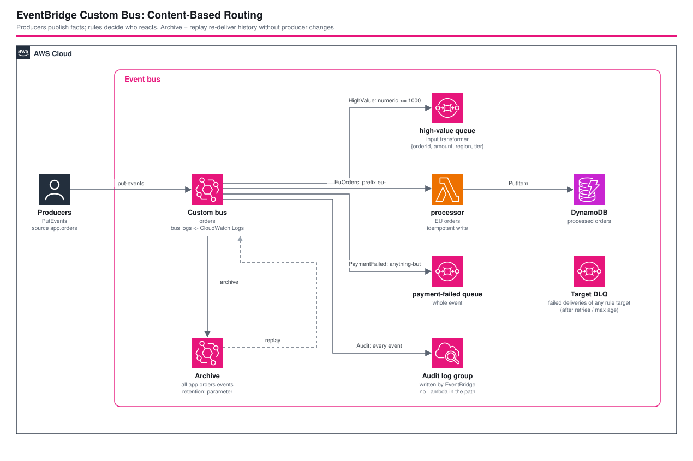

# EventBridge カスタムバス: コンテンツベースルーティング - AWS CDK リファレンスアーキテクチャ

[](./README.ja.md)
[](./README.md)

> **Level: 300 (Intermediate)**

注文ドメイン向けの **Amazon EventBridge カスタムイベントバス**です。プロデューサーは事実(`OrderPlaced`、`PaymentFailed` など)を発行し、**ルールが誰が反応するかを決めます**。数値・プレフィックス・`anything-but` のコンテンツベースのイベントパターン、4 種類のターゲット、回数と期間を制限したリトライ + デッドレターキュー、バスのログ、そして**リプレイできるアーカイブ**を備えます。コンシューマーの追加はルールの追加であり、プロデューサーの変更は不要です。

| ルール | パターン | ターゲット |
|---|---|---|
| `high-value` | `OrderPlaced` かつ `detail.amount >= 1000`(数値) | SQS(**入力トランスフォーマー**付き) |
| `eu-orders` | `OrderPlaced` かつ `detail.region` が `eu-` で始まる(プレフィックス) | Lambda → DynamoDB(冪等) |
| `payment-failed` | `PaymentFailed` かつ `detail.reason` が `user_cancelled` **でない**(anything-but) | SQS |
| `audit` | `app.orders` のすべてのイベント | CloudWatch Logs(EventBridge が直接書き込み、Lambda なし) |

## 📑 目次

- [アーキテクチャ概要](#-アーキテクチャ概要)
- [設計判断とベストプラクティス](#-設計判断とベストプラクティス)
- [Well-Architected との対応](#-well-architected-との対応)
- [コスト最適化](#-コスト最適化)
- [セキュリティ](#-セキュリティ)
- [前提条件](#-前提条件)
- [デプロイ手順](#-デプロイ手順)
- [動作確認スクリプト](#-動作確認スクリプト)
- [テスト戦略](#-テスト戦略)
- [カスタマイズ](#-カスタマイズ)
- [トラブルシューティング](#-トラブルシューティング)
- [クリーンアップ](#-クリーンアップ)
- [参考資料](#-参考資料)

## 🏗️ アーキテクチャ概要



### 主要コンポーネント

- **カスタムイベントバス** `orders` — `logConfig`(`INFO`、`FULL` の詳細)**と**、そのログを実際に書き出す CloudWatch Logs のデリバリー(`DeliverySource` → `DeliveryDestination` → `Delivery`)。
- **アーカイブ** — `app.orders` のすべてのイベント(保持期間はパラメータ)。リプレイの元になります。
- **4 つのルール**(上表)— いずれも `source: app.orders` でも絞り込みます。
- **ターゲット**共通の配信ポリシー — `maxEventAge` と `retryAttempts` はパラメータ。それでも失敗したものは **ターゲット DLQ**(SQS、SSE、TLS のみ、保持 14 日)へ送られ、CloudWatch アラームが付きます。
- **`processor` Lambda**(Node.js 24 / ARM64)— EU の注文を `orderId` + `eventId` をキーに DynamoDB へ書き込み。権限は `PutItem` のみ。
- **キュー** `high-value` と `payment-failed`(SSE-SQS、TLS のみ)。

## 🎯 設計判断とベストプラクティス

### 1. デフォルトバスではなくカスタムバス

デフォルトバスはアカウント全体の AWS サービスイベントを運びます。カスタムバスなら、ドメイン専用の**リソースポリシー、アーカイブ、ログ、影響範囲**を持て、無関係なイベントでルールが起動することもありません。

### 2. プロデューサーは事実を発行し、ルールが誰が反応するかを決める

`OrderPlaced` は「何が起きたか」を伝えるもので、「次に何をすべきか」ではありません。コンシューマーはルールで購読するので、新しいコンシューマー(EU の税務サービスや不正検知)にはルールとターゲットが必要なだけで、プロデューサーの変更は要りません。

### 3. すべてのルールでまず `source` を絞る

`source` を絞らないルールは、たまたま同じ detail-type を使う任意のプロデューサーに一致します。4 つのルールはすべて `source: ["app.orders"]` を固定し、確認スクリプトは `other.app` からの `OrderPlaced`(金額 9999)が**どこにも届かない**ことを実証します。

### 4. エッジで実際に仕事をするパターン

- **numeric** `[">=", 1000]` — Lambda なしで業務上の金額でルーティング。
- **prefix** `eu-` — リージョンで振り分け。
- **anything-but** — 顧客自身が原因のものを除く支払い失敗を通知。しきい値はパラメータで、ユニットテストが出力されるパターンを検証します。

すべてを配信してコードで捨てるより、バスで絞る方が安く、パターンは隠れた `if` ではなく見えるインフラになります。

### 5. 小さな契約を望むコンシューマーには入力トランスフォーマー

high-value キューが受け取るのは EventBridge のエンベロープではなく `{orderId, amount, region, tier}` です。コンシューマーは専用に作られたメッセージに依存でき、エンベロープの変更が漏れ込みません。汎用的に消費するルール(`payment-failed`、audit)はイベント全体を受け取ります。

### 6. 回数と期間を制限したリトライ、その先は DLQ

EventBridge は配信をバックオフ付きでリトライします。制限がなければ、恒久的に失敗するターゲットへ既定で最大 24 時間リトライし続けます。ここでは `retryAttempts` と `maxEventAge` を明示し、それでも失敗したものは**ターゲット DLQ**に入ってアラームが鳴ります。(この DLQ が受け取るのは、EventBridge が*配信できなかった*イベントです。Lambda ターゲットの関数*内部*のエラーは、この DLQ ではなく関数自身の非同期呼び出し設定で扱われます。)

### 7. 少なくとも 1 回の配信 = 冪等なコンシューマー

EventBridge は同じイベントを複数回配信することがあり、**リプレイ**は、コンシューマーがすでに見たイベントを意図的に再送します。processor は `orderId` + `eventId` をキーに単純な `PutItem`(read-modify-write なし)で書くので、同じイベントの再配信は同じ項目を上書きします。自分のコンシューマーはビジネスキーで冪等に設計してください。本リファレンスでは Lambda のルールへはリプレイしません(確認スクリプトのリプレイはキューのルールに限定しています)。

### 8. ログは 1 つではなく 2 つのリソースが必要

`logConfig` が決めるのは*何を*ログに出すかだけです。バス(デリバリーソース)とロググループ(デリバリー先)を結ぶ CloudWatch Logs の**デリバリー**が作られるまで、何も書き出されません。このスタックは両方を作成します。ロググループ名は `/aws/vendedlogs/events/event-bus/<bus>` の慣例に従います。

### 9. Lambda なしの監査

`audit` ルールはロググループを直接ターゲットにします。EventBridge がイベント全体を書き込むので、デプロイもパッチ適用も呼び出し課金もありません。

### 10. アーカイブとリプレイ

`app.orders` のすべてのイベントをアーカイブします。リプレイはアーカイブの期間を**バスへ**再送し、**特定のルールに限定**(`FilterArns`)できます。ここでは `high-value` のみなので、audit と Lambda には触れません。新しいコンシューマーの状態の再構築や、障害後の復旧に使います。確認スクリプトは、アーカイブにイベントが記録されるのを待ち、リプレイして、high-value キューが再び受信することを検証します。

### 11. 環境別パラメータ

`parameters/<env>-params.ts` の `highValueThreshold`、`archiveRetentionDays`、`targetMaxEventAgeMinutes`、`targetRetryAttempts`。

## 🏛️ Well-Architected との対応

| 柱 | 実装 |
|---|---|
| **運用上の優秀性** | バスログと監査ロググループ、DLQ アラーム、`test-eventbus.sh` がルーティング・除外・リプレイを実証、スナップショット/ユニット/Nag テスト |
| **セキュリティ** | source を固定したルール、最小権限(processor は `PutItem` のみ、EventBridge → ターゲットの権限はターゲットごとに生成)、キュー/テーブルは SSE、キューは TLS のみ |
| **信頼性** | 制限付きリトライ + DLQ + アラーム、冪等なコンシューマー、復旧のためのアーカイブとリプレイ |
| **パフォーマンス効率** | バスでのフィルタリング、Lambda なしの監査、ARM64 |
| **コスト最適化** | イベント単位の課金、ポーリングなし、フィルタリングで無駄な呼び出しを回避 |
| **持続可能性** | サーバーレスでイベント駆動、イベントの間は何も動かない |

## 💰 コスト最適化

カスタムバスのイベントは 100 万イベント単位で課金されます(デフォルトバスの AWS サービスイベントは無料ですが、カスタムイベントとパートナーイベントは無料ではありません)。アーカイブの保存とリプレイは別課金で、SQS/Lambda/Logs への配信にイベント自体以外の EventBridge 料金はかかりません。リージョンごとの最新の単価は [EventBridge の料金ページ](https://aws.amazon.com/eventbridge/pricing/)で確認してください。

```
月 100 万イベント(カスタムバス)                 ≈ $1.00   (100万あたりの単価。リージョンごとに確認)
Lambda(EU 分 約30%)、128 MB arm64               ≈ $0.10
DynamoDB オンデマンド(書き込み約30万)           ≈ $0.40
SQS(2 キュー、約100万リクエスト)                ≈ $0.40
CloudWatch Logs(監査 + バスログ、約2 GB)        ≈ $1.00
アーカイブ(約1 GB、保持1日)                    ≈ 数セント
--------------------------------------------------------------
≈ 月 $3(概算)
```

レバー: 早い段階で絞る(呼び出されるターゲットが減る)、アーカイブの保持期間を短くする、入力トランスフォーマーでメッセージを小さくする、`INFO`/`FULL` のバスログはサンプリングや保持期間の短縮を行う(負荷の高い環境では `ERROR` レベル)。

## 🔒 セキュリティ

### 実装済み
- ✅ ルールは `source` を固定し、確認スクリプトが外部の source が何にも一致しないことを実証
- ✅ 最小権限 IAM: processor は `PutItem` のみ、各ターゲットの権限はそのターゲット専用に生成
- ✅ SSE-SQS、TLS のみのキューポリシー、DynamoDB の SSE + PITR
- ✅ 配信できなかったイベント用の DLQ + アラーム

### CDK Nag の抑制(理由付き)

| ルール | 理由 |
|---|---|
| `AwsSolutions-IAM4` / `IAM5` / `L1` | CloudWatch Logs ターゲットのヘルパーとそのログリソースポリシー用カスタムリソースは CDK ライブラリが生成する(マネージドポリシー、ストリームのワイルドカード、ライブラリ管理のランタイム) |
| `AwsSolutions-SQS3` | ターゲット DLQ 自体がデッドレターの宛先であり、作業用キューは終端のターゲット |

### 対象外(環境ごとに追加)
- クロスアカウントのプロデューサー向けの**バスのリソースポリシー**(`bus.grantPutEventsTo`、または組織に限定したポリシー)とバス単位の KMS キー(`kmsKey`)。
- `detail` の**スキーマレジストリ**による検出/検証。
- `PutEvents` と `StartReplay` を実行できる主体の制限(リプレイは実際のコンシューマーへ実際のイベントを再送します)。

## 📋 前提条件

- CDK の bootstrap 済みの AWS アカウント、`${PROJECT}-${ENV}` という名前のプロファイルを設定した AWS CLI v2、Node.js 20 以上、確認スクリプト用の `jq`

## 🚀 デプロイ手順

```bash
cd infrastructure
npm install
export PROJECT=<project> ENV=dev

npm run bootstrap        -w workspaces/eventbridge-custom-bus   # 初回のみ
npm run synth            -w workspaces/eventbridge-custom-bus
npm run stage:deploy:all -w workspaces/eventbridge-custom-bus
```

イベントを発行します。

```bash
aws events put-events --entries '[{"EventBusName":"<project>-<env>-ebus-orders","Source":"app.orders","DetailType":"OrderPlaced","Detail":"{\"orderId\":\"o-1\",\"amount\":1500,\"region\":\"eu-west-1\"}"}]'
```

## 🧪 動作確認スクリプト

このパターンの核心は一致判定で、`cdk deploy` が成功してもその証明にはなりません。[`test-eventbus.sh`](./test-eventbus.sh) は、統制した 7 つのイベントを発行し、それぞれの行き先を検証します。

```bash
./test-eventbus.sh --project <project> --env dev                # アーカイブのリプレイを含む全体(数分かかる)
./test-eventbus.sh --project <project> --env dev --skip-replay  # ルーティングのみ
./test-eventbus.sh --project <project> --env dev --destroy      # 検証後にスタックを削除
```

| イベント | 届く先 |
|---|---|
| E1 `OrderPlaced` 1500 us-east-1 | high-value キュー、audit |
| E2 `OrderPlaced` 50 eu-west-1 | Lambda/DynamoDB、audit |
| E3 `OrderPlaced` 2000 eu-central-1 | high-value キュー**と** Lambda、audit |
| E4 `PaymentFailed` card_declined | payment キュー、audit |
| E5 `OrderCancelled` 5000 | **audit のみ**(detail-type フィルタ) |
| E6 `OrderPlaced` 9999、source `other.app` | **どこにも届かない**(source フィルタ) |
| E7 `PaymentFailed` user_cancelled | **audit のみ**(anything-but) |

さらに、変換後のペイロードの形、DLQ が空であること、**アーカイブ**にイベントが記録されるのを待って、high-value ルールに限定してバスへ**リプレイ**し、キューが E1 と E3 を再び受信することを検証します。`aws` と `jq` が必要です。

## 🧪 テスト戦略

```bash
npm test -w workspaces/eventbridge-custom-bus   # 20 テスト
```

| 種類 | 対象 |
|---|---|
| スナップショット(2) | テンプレート + リソース数(Lambda アセットのハッシュは正規化) |
| ユニット(16) | バス + ログ + デリバリー、アーカイブ、各ルールの正確なイベントパターン、しきい値パラメータ、ターゲットのリトライ/期間/DLQ、入力トランスフォーマー、ログへの直接ターゲット、キューのハードニング、IAM アクションの集合、アラーム、出力 |
| コンプライアンス(2) | CDK Nag `AwsSolutions` |
| 運用確認 | デプロイ済みスタックに対する `test-eventbus.sh` |

## ⚙️ カスタマイズ

- **新しいコンシューマー**: パターンとターゲットを持つ `events.Rule` をバスに追加します。プロデューサーはそのままです。
- **他のターゲット**: Step Functions、SNS、Kinesis Firehose、API destination(認証とレート制限付きの HTTP)、別のバスやアカウント。
- **クロスアカウント**: 特定のアカウント/組織からの `events:PutEvents` を許可するバスのリソースポリシーを追加し、送信側はバスの ARN に対して送信します。
- **スキーマレジストリ**: バスで検出を有効にして実イベントからスキーマを推論し、コードバインディングを生成します。
- **バス単位の DLQ / KMS**: `EventBus` の `deadLetterQueue` と `kmsKey`。

## 🔧 トラブルシューティング

### ルールが「何もしない」
順に確認します。`PutEvents` のバス名、ルールがそのバス上で ENABLED であること、パターン(数値フィルタには `"1500"` ではなく JSON の**数値**が必要。`detail` はパースした JSON に対して照合されるので `Detail` は有効な JSON でなければならない)、そして一致と配信を記録するバスのロググループ `/aws/vendedlogs/events/event-bus/<bus>`。

### バスのログが出ない
`logConfig` だけでは何も書き出されません。CloudWatch Logs のデリバリー(ソース → 送信先 → デリバリー)が必要で、このスタックが作成します。

### イベントは一致したのにターゲットが受け取らない
ターゲット DLQ とルールの `FailedInvocations` メトリクスを確認します。SQS ではキューポリシーが、ルールの ARN からの `events.amazonaws.com` を許可している必要があります(ターゲットのヘルパーが生成)。

### 1 件の注文で Lambda が 2 回動いた
配信は少なくとも 1 回です。書き込みは `orderId` + `eventId` をキーにした単純な `PutItem` なので、同じイベントの再配信は同じ項目を上書きします。追加する副作用も冪等に保ってください。

### リプレイは完了したのに何も届かない
リプレイは `FilterArns` を尊重します。ルールの ARN が含まれていなければ、そのターゲットはスキップされます。また、リプレイの期間(開始/終了)がアーカイブ済みのイベントを含んでいるか確認してください。アーカイブはライブのバスより数分遅れることがあります。

### しばらくすると `cdk deploy` が "no credentials" で失敗する
同梱の CDK は期限切れの SSO トークンを更新できません。短期認証情報をエクスポート(`aws configure export-credentials --format env`)するか、`aws sso login` をやり直してください。

## 🧹 クリーンアップ

```bash
npm run stage:destroy:all -w workspaces/eventbridge-custom-bus   # または ./test-eventbus.sh ... --destroy
```

## 📚 参考資料

### AWS ドキュメント
- [Amazon EventBridge のイベントパターン(コンテンツフィルタリング)](https://docs.aws.amazon.com/eventbridge/latest/userguide/eb-event-patterns-content-based-filtering.html)
- [イベントのアーカイブとリプレイ](https://docs.aws.amazon.com/eventbridge/latest/userguide/eb-archive.html)
- [EventBridge のイベントバスログ](https://docs.aws.amazon.com/eventbridge/latest/userguide/eb-event-bus-logs.html)
- [ターゲットのデッドレターキューとリトライポリシー](https://docs.aws.amazon.com/eventbridge/latest/userguide/eb-rule-dlq.html)

### 関連アーキテクチャ
- [sqs-lambda-firehose](../sqs-lambda-firehose/) — キューベースのイベントパイプライン
- [sns-basic](../sns-basic/) — SNS による pub/sub ファンアウト
- [budgets-cost-anomaly-detection](../budgets-cost-anomaly-detection/) — EventBridge 駆動の通知

## 📄 ライセンス

このプロジェクトは MIT ライセンスです。詳細は [LICENSE](../../LICENSE) を参照してください。

## 👥 コントリビュート

コントリビュートを歓迎します。詳細は [CONTRIBUTING.md](../../CONTRIBUTING.md) を参照してください。

## 🏆 このリファレンスアーキテクチャについて

**対象レベル**: 300 (Intermediate)

---

**注意**: これはリファレンス実装です。本番利用の前に、バスのリソースポリシー、暗号化、ドメインに適したアクセス制御を追加してください。
