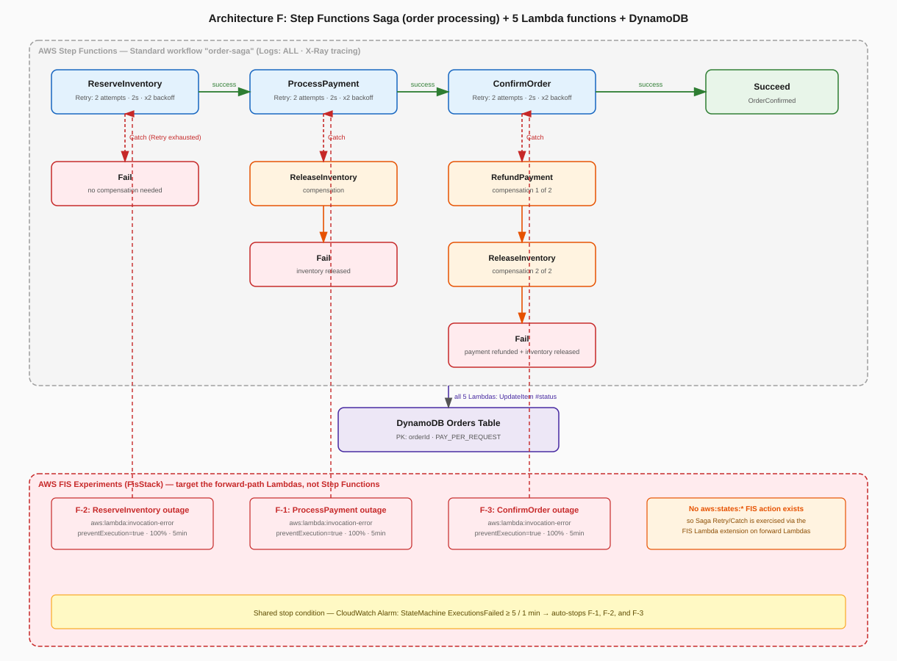

# FIS Chaos Engineering — Architecture F: Step Functions Saga (Order Processing) + Lambda + DynamoDB

*Read this in other languages:* [](./README.ja.md) [](./README.md)


## Introduction

This project is a reference implementation for AWS Fault Injection Simulator (FIS) chaos engineering on a **Step Functions Saga** — the distributed-transaction pattern used to keep an e-commerce order consistent across three independent steps (inventory, payment, order confirmation) without a two-phase commit. An AWS Step Functions Standard state machine drives 3 forward steps and, on failure, runs the matching compensating transaction(s) before ending the execution.

| Forward step | Lambda | Compensates for |
| ------------ | ------ | ---------------- |
| 1. Reserve inventory | `ReserveInventory` | — (nothing committed yet) |
| 2. Process payment | `ProcessPayment` | Compensated by `ReleaseInventory` |
| 3. Confirm order (final) | `ConfirmOrder` | Compensated by `RefundPayment` → `ReleaseInventory` (in that order) |

Three FIS experiment templates inject a complete outage of one forward-step Lambda at a time, so the Saga's Retry / Catch / compensation logic is exercised exactly the way it would be during a real production incident:

| Scenario | Fault Injected | Duration | What It Validates |
| -------- | --------------- | -------- | ------------------ |
| **F-1** ProcessPayment outage | `invocation-error`, `preventExecution=true`, 100% on `ProcessPayment` | 5 min | Retry exhaustion, then the `ReleaseInventory` compensating transaction |
| **F-2** ReserveInventory outage | Same action on `ReserveInventory` | 5 min | The fail-fast path — the Saga fails at its very first step, so no compensation runs |
| **F-3** ConfirmOrder outage | Same action on `ConfirmOrder` | 5 min | Two-stage compensation in the correct order — `RefundPayment`, then `ReleaseInventory` — after payment has already been taken |

All three experiments share a CloudWatch Alarm stop condition on the state machine's `ExecutionsFailed` metric, providing a safety net if failed Saga executions exceed the safety threshold.

> ### ⚠️ `aws:lambda:put-function-concurrent-executions` does not exist
> An earlier version of this workspace tried to zero out each forward Lambda's reserved concurrency via `aws:lambda:put-function-concurrent-executions`. **That action ID does not exist** — `aws fis list-actions` confirms Lambda-targeted FIS actions are limited to the `aws:lambda:function` family. CloudFormation failed FIS template creation outright with `Invalid actionId ... 404`. This was independently the same mistake made in [`fis-arch-d-sqs-lambda`](../fis-arch-d-sqs-lambda/)'s original design — the same intuitive-but-wrong action name, hit twice in unrelated architectures.

## Why the Lambda extension instead of targeting Step Functions directly

This is the central design decision of this workspace, so it is worth stating plainly:

**AWS FIS has no action that targets AWS Step Functions.** As of this writing, the [FIS actions reference](https://docs.aws.amazon.com/fis/latest/userguide/fis-actions-reference.html) contains no `aws:states:*` namespace — there is no way to ask FIS to fail a specific state, inject a delay into an execution, or otherwise act on a state machine as a resource. This rules out the most literal interpretation of "chaos-test a Saga."

Instead, this workspace attaches the AWS FIS Lambda extension (the same mechanism proven in [`fis-arch-b-apigw-lambda`](../fis-arch-b-apigw-lambda/) and [`fis-arch-d-sqs-lambda`](../fis-arch-d-sqs-lambda/)) as a layer to the three **forward-path** Lambdas only (`ReserveInventory`, `ProcessPayment`, `ConfirmOrder` — never the two compensation Lambdas, which are never FIS targets). FIS then injects `aws:lambda:invocation-error` with `preventExecution=true` at 100%: every invocation of the targeted function fails immediately, before any handler code runs. From inside a `tasks.LambdaInvoke` state, this is indistinguishable from the Lambda being completely down. Targeting the three forward Lambdas individually therefore gives an indirect, but faithful and fully-verified, way to drive the exact three failure points a Saga needs to prove itself against — **without modifying the state machine definition itself**. The experiment exercises the real, deployed ASL definition, not a stand-in for it.

## Architecture Overview

```
Step Functions Standard state machine — "order-saga"  (Logs: ALL · X-Ray tracing)

  ReserveInventory ──success──► ProcessPayment ──success──► ConfirmOrder ──success──► Succeed
  (Retry x2, 2s,x2)             (Retry x2, 2s,x2)            (Retry x2, 2s,x2)
        │ Catch                        │ Catch                      │ Catch
        ▼                              ▼                            ▼
      Fail                     ReleaseInventory              RefundPayment
  (no compensation                     │                            │
   — nothing reserved)                 ▼                            ▼
                                      Fail                   ReleaseInventory
                              (inventory released)                  │
                                                                     ▼
                                                                   Fail
                                                     (payment refunded + inventory released)

All 5 Lambdas (Python 3.13) write to one DynamoDB table:
  DynamoDB "Orders" table  (PK: orderId, PAY_PER_REQUEST) — each Lambda updates the item's `status` field

━━━━━━━━━━━━━━━━━━━━━━━━━━━━━━━━━━━━━━━━━━━━━━━━━━━━━━━━━━━━━━━━━━━━━━━━━━━━━━
FIS Experiment Templates (FisStack) — target the forward Lambdas via the FIS Lambda extension

F-1  aws:lambda:invocation-error ─► ProcessPayment Lambda
     preventExecution=true, 100%, 5m

F-2  aws:lambda:invocation-error ─► ReserveInventory Lambda
     preventExecution=true, 100%, 5m

F-3  aws:lambda:invocation-error ─► ConfirmOrder Lambda
     preventExecution=true, 100%, 5m

Shared stop condition: CloudWatch Alarm — StateMachine ExecutionsFailed >= 5 / 1 min
```



### Key Design Benefits

| Feature | Benefit |
| ------- | ------- |
| No VPC required | Fully serverless — Step Functions, Lambda, and DynamoDB only |
| Targets forward Lambdas, not the state machine | The ASL definition under test is never touched or mocked — FIS validates the real deployed Saga |
| 3 distinct failure points (F-1/F-2/F-3) | Each validates a structurally different branch of the Saga: no-compensation, single-compensation, and two-stage compensation |
| Retry before Catch on every forward task | Transient faults self-heal (2 attempts, 2s → 4s backoff) before the Saga gives up and compensates — matches real production Saga design |
| Shared stop condition | One CloudWatch Alarm (`ExecutionsFailed` ≥ 5/min) halts any of the three experiments automatically |
| Standard workflow + Logs ALL + X-Ray | Every state transition, including which Catch branch fired, is inspectable in CloudWatch Logs and the X-Ray trace map after an experiment |

## Prerequisites

- AWS CLI v2 installed and configured
- Node.js 20 or later
- AWS CDK CLI (`npm install -g aws-cdk`)
- Basic knowledge of TypeScript and Python
- AWS account with FIS service-linked role created (auto-created on first FIS use)

> **No VPC or NAT Gateway costs**: this architecture uses only serverless services. The dominant ongoing cost at rest is zero (DynamoDB PAY_PER_REQUEST, Lambda invocations, Step Functions per-transition pricing).

## Project Directory Structure

```text
fis-arch-f-stepfunctions-saga/
├── bin/
│   └── fis-arch-f-stepfunctions-saga.ts   # App entry point (Stage instantiation)
├── lambda/
│   ├── reserve-inventory/index.py          # Saga forward step 1
│   ├── process-payment/index.py            # Saga forward step 2
│   ├── confirm-order/index.py              # Saga forward step 3 (final)
│   ├── release-inventory/index.py          # Compensation for ProcessPayment / ConfirmOrder failure
│   └── refund-payment/index.py             # Compensation for ConfirmOrder failure
├── lib/
│   ├── stages/
│   │   └── fis-chaos-stage.ts              # Stage: BaseStack → AppStack → FisStack
│   └── stacks/
│       ├── base-stack.ts                   # DynamoDB orders table
│       ├── app-stack.ts                    # 5 Lambdas + Step Functions Saga state machine
│       └── fis-stack.ts                    # 3 FIS experiment templates + IAM + alarm
├── parameters/
│   ├── environments.ts                     # Environment parameter type
│   ├── dev-params.ts                       # Development environment parameters
│   └── index.ts                            # Parameter exports
├── test/
│   ├── compliance/
│   │   └── cdk-nag.test.ts                # cdk-nag AwsSolutions compliance checks
│   └── snapshot/
│       └── snapshot.test.ts               # CDK snapshot tests (13 test cases)
├── overview.drawio.svg                    # Architecture + state-transition diagram
├── cdk.json
├── package.json
└── tsconfig.json
```

## State Transition Diagram (detail)

```text
                              ┌─────────────────────┐
                     start ──►│  ReserveInventory    │  Retry: 2x / 2s / x2 backoff
                              └──────────┬───────────┘
                        success ◄────────┼────────► Catch (retries exhausted)
                              │                              │
                              ▼                              ▼
                  ┌─────────────────────┐          ┌───────────────────────┐
                  │   ProcessPayment    │          │  Fail: ReserveInventory │
                  │  Retry: 2x/2s/x2    │          │  Failed (no compensation │
                  └──────────┬──────────┘          │   — nothing reserved)   │
                success ◄────┼────► Catch           └───────────────────────┘
                     │                 │
                     ▼                 ▼
        ┌─────────────────────┐  ┌─────────────────────┐
        │    ConfirmOrder     │  │  ReleaseInventory    │  compensation
        │  Retry: 2x/2s/x2    │  │    (compensation)    │
        └──────────┬──────────┘  └──────────┬───────────┘
      success ◄─────┼──► Catch              ▼
           │                    │  ┌───────────────────────┐
           ▼                    │  │  Fail: ProcessPayment   │
   ┌───────────────┐            │  │  Failed (inventory       │
   │    Succeed    │            │  │  released)                │
   │ OrderConfirmed│            │  └───────────────────────┘
   └───────────────┘            ▼
                        ┌─────────────────────┐
                        │    RefundPayment     │  compensation 1 of 2
                        └──────────┬───────────┘
                                   ▼
                        ┌─────────────────────┐
                        │   ReleaseInventory    │  compensation 2 of 2
                        └──────────┬───────────┘
                                   ▼
                        ┌───────────────────────┐
                        │  Fail: ConfirmOrder     │
                        │  Failed (payment          │
                        │  refunded + inventory     │
                        │  released)                 │
                        └───────────────────────┘
```

## Key Components and Design Points

| Component | Design Points |
| --------- | -------------- |
| DynamoDB Table | PAY_PER_REQUEST billing; costs zero at rest; PITR disabled for minimal cost during experiments; PK `orderId` |
| 5 Lambda functions | Python 3.13, 128 MB, 10 s timeout — each is a mock implementation that only updates the order item's `status` field |
| Step Functions state machine | `STANDARD` type (execution history + exactly-once semantics matter for a Saga); `logs: sfn.LogLevel.ALL` to a CloudWatch Logs group; `tracingEnabled: true` for X-Ray |
| Retry policy | `IntervalSeconds=2, MaxAttempts=2, BackoffRate=2` on every forward task — a transient failure resolves itself in ≤ 6 s before Catch fires |
| Catch / compensation chains | `ReserveInventory` → Fail (no compensation); `ProcessPayment` → `ReleaseInventory` → Fail; `ConfirmOrder` → `RefundPayment` → `ReleaseInventory` → Fail |
| FIS extension layer | Attached only to the 3 forward-step Lambdas, resolved per-Region from the public SSM parameter `/aws/service/fis/lambda-extension/AWS-FIS-extension-x86_64/1.x.x` |
| FIS config bucket | `<project>-<env>-f-fis-config-<account>` — S3-managed encryption, all public access blocked, 1-day lifecycle expiry |
| FIS IAM Role | `s3:PutObject`/`s3:DeleteObject` on `<bucket>/FisConfigs/*`; `lambda:GetFunction` and `tag:GetResources` on `*`; `cloudwatch:DescribeAlarms` on the stop-condition alarm |
| CloudWatch Stop Alarm | `StateMachine.metricFailed() >= 5` over 1 minute — shared by all 3 templates |
| FIS Log Group | `/fis/{project}-{env}-f` — ONE_MONTH retention, auto-deleted on stack destroy |

## Implementation Highlights

### 1. Retry then Catch on every forward task

Every forward-path `tasks.LambdaInvoke` state gets the same retry policy before its Catch branch is even considered:

```typescript
// lib/stacks/app-stack.ts (excerpt)
const retryProps: sfn.RetryProps = {
    errors: [sfn.Errors.ALL],
    interval: cdk.Duration.seconds(2),
    maxAttempts: 2,
    backoffRate: 2,
};

const processPayment = new tasks.LambdaInvoke(this, 'ProcessPayment', {
    lambdaFunction: this.processPaymentFn,
    payloadResponseOnly: true,
});
processPayment.addRetry(retryProps);
processPayment.addCatch(releaseInventoryAfterPaymentFailure, {
    errors: [sfn.Errors.ALL],
    resultPath: '$.error',
});
processPayment.next(confirmOrder);
```

While the FIS Lambda extension is injecting `invocation-error` into `ProcessPayment` (scenario F-1), every attempt fails immediately without the handler running. Two attempts and roughly 6 seconds later, Retry gives up and Catch routes execution into the compensation chain below.

### 2. Two-stage compensation, wired in reverse order

`ConfirmOrder` is the final forward step — by the time it can fail, both inventory *and* payment have already been committed. Its Catch branch must undo both, in the reverse of the order they were applied:

```typescript
// lib/stacks/app-stack.ts (excerpt)
const releaseInventoryAfterConfirmFailure = new tasks.LambdaInvoke(
    this, 'ReleaseInventoryCompensation2', { lambdaFunction: this.releaseInventoryFn, payloadResponseOnly: true },
).next(orderFailedAfterFullCompensation);

const refundPaymentAfterConfirmFailure = new tasks.LambdaInvoke(
    this, 'RefundPaymentCompensation1', { lambdaFunction: this.refundPaymentFn, payloadResponseOnly: true },
).next(releaseInventoryAfterConfirmFailure);

confirmOrder.addCatch(refundPaymentAfterConfirmFailure, {
    errors: [sfn.Errors.ALL],
    resultPath: '$.error',
});
```

Because each compensating `LambdaInvoke` is its own state, the execution history (visible in the CloudWatch Logs / X-Ray trace after an F-3 experiment) shows the two compensations firing as two distinct, ordered state transitions — not a single opaque "rollback" step.

### 3. FIS targets the Lambda, never the state machine

```typescript
// lib/stacks/fis-stack.ts (excerpt — scenario F-1)
new fis.CfnExperimentTemplate(this, 'ScenarioF1ProcessPaymentOutage', {
    roleArn: fisRole.roleArn,
    stopConditions,
    targets: {
        ProcessPaymentFunction: {
            resourceType: 'aws:lambda:function',
            resourceArns: [props.processPaymentFn.functionArn],
            selectionMode: 'ALL',
        },
    },
    actions: {
        InjectPaymentOutage: {
            actionId: 'aws:lambda:invocation-error',
            parameters: { duration: 'PT5M', invocationPercentage: '100', preventExecution: 'true' },
            targets: { Functions: 'ProcessPaymentFunction' },
        },
    },
    logConfiguration: fisLogConfig,
});
```

The state machine ARN never appears in any FIS template — there is nothing in the FIS action catalogue that could reference it. See [Why the Lambda extension instead of targeting Step Functions directly](#why-the-lambda-extension-instead-of-targeting-step-functions-directly) above.

### 4. Shared stop condition on Saga-level failures, not Lambda-level errors

Unlike `fis-arch-b-apigw-lambda`, which alarms on Lambda error count, this workspace alarms on the *Saga's own* `ExecutionsFailed` metric — the signal that actually matters for a Saga is "did the end-to-end business transaction fail," not "did an individual Lambda invocation throw":

```typescript
// lib/stacks/fis-stack.ts (excerpt)
const sagaFailedAlarm = new cw.Alarm(this, 'SagaExecutionsFailedAlarm', {
    metric: props.stateMachine.metricFailed({
        period: cdk.Duration.minutes(1),
        statistic: 'Sum',
    }),
    threshold: 5,
    evaluationPeriods: 1,
    comparisonOperator: cw.ComparisonOperator.GREATER_THAN_OR_EQUAL_TO_THRESHOLD,
    treatMissingData: cw.TreatMissingData.NOT_BREACHING,
});
```

## Deployment Guide

### 1. Install dependencies

```bash
cd infrastructure
npm ci
```

### 2. Configure environment parameters

Edit `parameters/dev-params.ts` to set your region and optionally an alarm email:

```typescript
// parameters/dev-params.ts
export const devParams: EnvParams = {
    region: 'ap-northeast-1',
    // alarmEmail: 'ops@example.com',  // uncomment to receive alarm notifications
};
```

### 3. Bootstrap CDK (first time only)

```bash
PROJECT=fis-chaos-f ENV=dev npm run bootstrap
```

### 4. Deploy all stacks

```bash
PROJECT=fis-chaos-f ENV=dev npm run stage:deploy:all
```

This deploys the three stacks in dependency order:
1. `fis-chaos-f-dev-f-base` — DynamoDB orders table
2. `fis-chaos-f-dev-f-app` — 5 Lambdas + Step Functions state machine
3. `fis-chaos-f-dev-f-fis` — FIS templates + IAM + alarm

### 5. Start a Saga execution

After deployment, retrieve the state machine ARN from the `fis-chaos-f-dev-f-app` stack output and start a test execution:

```bash
aws stepfunctions start-execution \
  --state-machine-arn <StateMachineArn> \
  --input '{"orderId": "order-001"}'
```

Inspect the order's `status` field in DynamoDB to see how far the Saga progressed:

```bash
aws dynamodb get-item \
  --table-name fis-chaos-f-dev-orders \
  --key '{"orderId": {"S": "order-001"}}'
```

### 6. Run a FIS experiment

Navigate to the AWS FIS console, select one of the three experiment templates (`F-1`, `F-2`, or `F-3`), click **Start experiment**, then start a Saga execution (step 5). Watch the execution in the Step Functions console's Graph view — the Catch branch and compensating transaction(s) light up as the targeted Lambda's invocations fail.

### Observed results (ap-northeast-1)

| Scenario | Result |
| -------- | ------ |
| **F-1** | Every Saga execution triggered during the fault window failed with `error: "ProcessPaymentFailed"`. `get-execution-history` confirmed the state sequence `ReserveInventory (succeeded) → ProcessPayment (failed) → ReleaseInventoryCompensation → ExecutionFailed` — the single-stage compensation ran as designed |
| **F-2** | Every execution failed with `error: "ReserveInventoryFailed"`. Execution history showed `ReserveInventory (failed) → ExecutionFailed` — no compensation task appears at all, confirming the fail-fast, nothing-to-undo path |
| **F-3** | Every execution failed with `error: "ConfirmOrderFailed"`. Execution history showed `ReserveInventory (succeeded) → ProcessPayment (succeeded) → ConfirmOrder (failed) → RefundPaymentCompensation1 → ReleaseInventoryCompensation2 → ExecutionFailed` — the two-stage compensation ran in the correct order |

After each scenario, a fresh Saga execution against normal load returned to `SUCCEEDED` with all three forward steps completing — confirming clean recovery once the FIS Lambda extension's fault cleared.

## Testing

```bash
cd infrastructure
npm ci

# Run all tests for this workspace
npm run test --workspace=fis-arch-f-stepfunctions-saga

# Snapshot tests only (3 stacks)
npm run test:snapshot --workspace=fis-arch-f-stepfunctions-saga

# CDK Nag compliance checks
npm run test:compliance --workspace=fis-arch-f-stepfunctions-saga

# Update snapshots after intentional changes
npm run test:snapshot:update --workspace=fis-arch-f-stepfunctions-saga
```

### What the tests cover

| Test suite | File | Assertions |
| ---------- | ---- | ---------- |
| Snapshot | `test/snapshot/snapshot.test.ts` | Full CFn template snapshots for all 3 stacks; DynamoDB PAY_PER_REQUEST; 5 Lambda functions on Python 3.13; exactly 1 Standard state machine with X-Ray enabled; all 5 Saga states present in the ASL definition; exactly 3 FIS templates, all using a real `aws:lambda:invocation-error` action, all with stop conditions |
| CDK Nag | `test/compliance/cdk-nag.test.ts` | AwsSolutions pack — no unsuppressed warnings or errors |

## Cost Estimation

All services are serverless (pay-per-use), so the cost at rest is effectively **zero**.

| Service | Billing Model | Estimated cost during experiments |
| ------- | -------------- | ---------------------------------- |
| DynamoDB | PAY_PER_REQUEST | ~$0 at idle; <$0.01 for a few hundred test executions |
| Lambda | Per invocation + duration | <$0.01 for a 5-minute experiment at typical test volume |
| Step Functions | Standard, per state transition | ~$0.000025 per transition; <$0.01 for dozens of test executions |
| CloudWatch | Metrics + logs | ~$0.01/month for experiment + state machine logs |
| X-Ray | Per trace recorded | <$0.01 for a 5-minute experiment |
| **FIS** | **$0.10 per action-minute** | A 5-minute single-action experiment is ~$0.50; running F-1–F-3 once is ~$1.50 |
| **Total (one full 3-scenario cycle)** | | **≈ $1.50–2, dominated by FIS action-minutes** |

**Correction vs. earlier versions of this doc:** FIS is **not free** — it bills $0.10 per action-minute, same as every other FIS-based workspace in this series.

## Security Considerations

- **Lambda execution roles follow least privilege**: each of the 5 functions only has `dynamodb:GetItem` / `PutItem` / `UpdateItem` / `DeleteItem` on the specific orders table, granted via `table.grantReadWriteData()`.
- **FIS role follows least privilege**: `s3:PutObject`/`s3:DeleteObject` scoped to the FIS config bucket's `FisConfigs/*` prefix, `lambda:GetFunction` and `tag:GetResources` for target resolution, plus `cloudwatch:DescribeAlarms` on the one stop-condition alarm. No DynamoDB access. `ReleaseInventory` and `RefundPayment` — the compensating Lambdas — never carry the FIS extension layer and are never FIS targets, since they are not what a chaos scenario needs to make unreachable.
- **No VPC exposure**: there is no VPC, no public subnet, and no security group — the state machine and all 5 Lambdas are fully managed serverless resources reachable only via the AWS API/SDK.
- **State machine is not internet-facing**: this reference pattern is invoked via `start-execution` (CLI/SDK/console), not a public HTTP endpoint. For production, front it with an authenticated API (API Gateway + Cognito/IAM auth, or an authenticated event source).
- **Stop condition is mandatory**: all 3 FIS templates include the Saga `ExecutionsFailed` alarm stop condition, which limits maximum experiment blast radius across concurrent test executions.

## Troubleshooting

| Symptom | Likely cause | Resolution |
| ------- | ------------- | ---------- |
| `cdk deploy` fails with `No parameters found for environment` | Missing `dev-params.ts` export | Verify `parameters/index.ts` exports `devParams` under the `dev` key |
| FIS template create fails: `Invalid actionId ... 404` | An action ID that does not exist in the Region | Check `aws fis list-actions` — Lambda-targeted actions are limited to the `aws:lambda:function` family |
| Errors take ~1 minute to appear after starting an experiment | Expected — FIS Lambda extension slow-poll ramp-up | Wait ~60s; check CloudWatch Logs for `AWS FIS EXTENSION - found active faults` to confirm the fault is genuinely active |
| Saga execution status stays `RUNNING` past 5 minutes | Unexpected — state machine has a 5-minute execution timeout | Check the Step Functions Graph view for a stuck state; the timeout should force a `TimedOut` status |
| Execution fails at `ReserveInventory` with no compensation shown | Expected during F-2 — this is the fail-fast path by design | Verify the F-2 experiment is running and check CloudWatch Lambda metrics for `ReserveInventory` |
| FIS experiment stops immediately | Stop condition alarm is already in `ALARM` state | Reset the alarm first (`aws cloudwatch set-alarm-state --alarm-name ... --state-value OK`) |
| `Table not found` Lambda error | BaseStack not yet deployed | Deploy stacks in order: Base → App → FIS |

## Clean-up

```bash
PROJECT=fis-chaos-f ENV=dev npm run stage:destroy:all
```

All resources have `removalPolicy: DESTROY` (and `autoDeleteObjects` on the S3 config bucket), so the destroy command removes the DynamoDB table, all 5 Lambda functions, the Step Functions state machine, the FIS config bucket, FIS templates, and CloudWatch log groups completely.

## Summary

This workspace demonstrates FIS chaos engineering on a Step Functions Saga — the pattern that keeps a multi-step distributed transaction consistent through compensating actions instead of a two-phase commit. Because FIS has no action that can target Step Functions directly, the three experiments instead make each forward-path Lambda fail every invocation via `aws:lambda:invocation-error` (through the FIS Lambda extension), driving the *real*, deployed Retry/Catch/compensation logic exactly as a genuine outage would:

- **F-2** verifies the Saga fails fast and cleanly when its very first step cannot run — no compensation, no partial state.
- **F-1** verifies a single compensating transaction (`ReleaseInventory`) runs correctly when the middle step fails.
- **F-3** verifies a two-stage compensation (`RefundPayment` then `ReleaseInventory`, in that order) runs correctly when the final step fails after money has already moved.

The serverless architecture keeps experiment costs minimal (< $0.10 per run) and requires no VPC management, making it easy to iterate on Saga resilience scenarios.

## References

- [AWS FIS — Supported actions](https://docs.aws.amazon.com/fis/latest/userguide/fis-actions-reference.html)
- [Use the AWS FIS `aws:lambda:function` actions](https://docs.aws.amazon.com/fis/latest/userguide/use-lambda-actions.html)
- [AWS Step Functions — Error handling (Retry / Catch)](https://docs.aws.amazon.com/step-functions/latest/dg/concepts-error-handling.html)
- [Saga pattern (AWS Prescriptive Guidance)](https://docs.aws.amazon.com/prescriptive-guidance/latest/cloud-design-patterns/saga.html)
- [CDK aws-fis module (L1 constructs)](https://docs.aws.amazon.com/cdk/api/v2/docs/aws-cdk-lib.aws_fis-readme.html)
- [CDK aws-stepfunctions-tasks — LambdaInvoke](https://docs.aws.amazon.com/cdk/api/v2/docs/aws-cdk-lib.aws_stepfunctions_tasks.LambdaInvoke.html)
