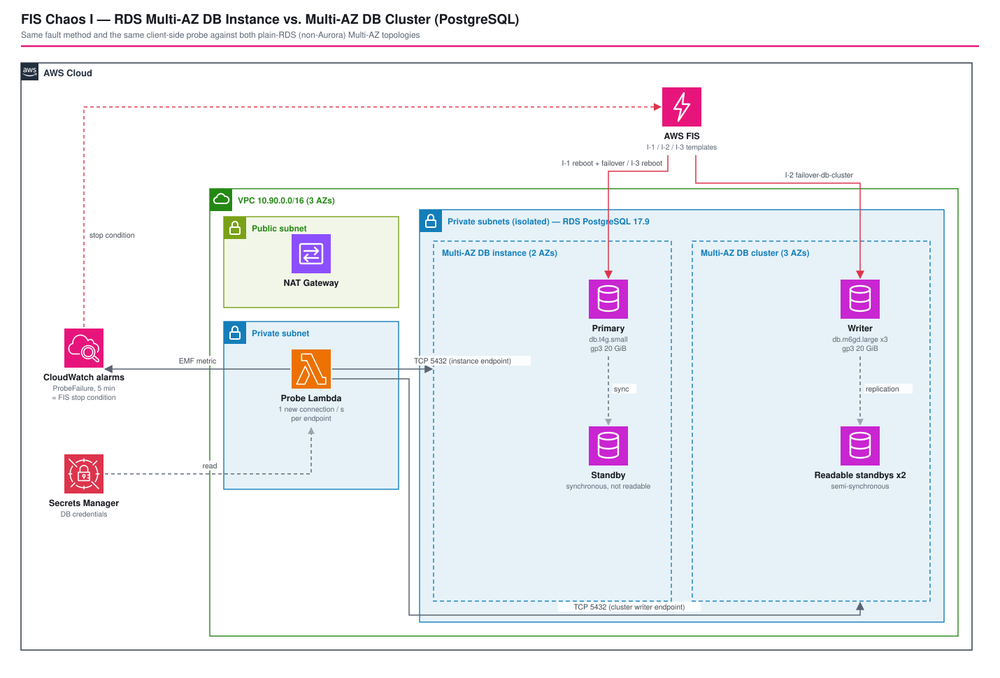

# FIS Chaos Engineering: RDS Multi-AZ DB Instance vs. Multi-AZ DB Cluster (PostgreSQL) — Measuring Failover from the Client Side

*Read this in other languages:* [](./README.ja.md) [](./README.md)


## Introduction

Architectures A and C cover failover of **Aurora**. This pattern covers the two Multi-AZ topologies of **plain RDS for PostgreSQL**, which behave very differently from Aurora and from each other, and measures the client-visible downtime of each with the same fault-injection method. A VPC probe Lambda opens a brand-new connection to both endpoints once per second and records every outage window and every change of the server IP behind the endpoint.

This architecture demonstrates:

- Both RDS Multi-AZ topologies side by side in one VPC, so the only variable is the topology
- The FIS actions that target each: `aws:rds:reboot-db-instances` with `forceFailover` for the instance, `aws:rds:failover-db-cluster` for the cluster
- A client-side probe (new connection per second, no pooling) that turns "failover takes about a minute" from a documentation claim into a measured number
- A no-failover reboot as a control group, so the failover is compared against something instead of assumed to be faster
- A non-Aurora Multi-AZ DB cluster defined with the L1 `CfnDBCluster`, and the four settings that failed a real deploy
- Deploy-verified on 2026-10-02; see [Deploy-Verified Results](#-deploy-verified-results)

| Topology | Layout | Standby readable? | Failover mechanism |
| -------- | ------ | :---------------: | ------------------ |
| **Multi-AZ DB instance** (non-cluster) | 1 primary + 1 synchronous standby, 2 AZs | No | The instance endpoint's DNS record flips to the standby |
| **Multi-AZ DB cluster** | 1 writer + 2 readable standbys, 3 AZs, semi-synchronous | Yes | A standby is promoted; the cluster writer endpoint follows |

| Scenario | Fault Injected | What It Validates |
| -------- | --------------- | ------------------ |
| **I-1** Multi-AZ instance forced failover | `aws:rds:reboot-db-instances`, `forceFailover=true` | Client-visible downtime of the instance topology |
| **I-2** Multi-AZ DB cluster failover | `aws:rds:failover-db-cluster` | Client-visible downtime of the cluster topology |
| **I-3** Multi-AZ instance reboot **without** failover | `aws:rds:reboot-db-instances`, `forceFailover=false` | Control group: the outage of a plain reboot when the standby is not used |

Each template has a CloudWatch Alarm stop condition built on the probe's `ProbeFailure` metric for the endpoint under test: at least 15 failed probes per minute for 5 consecutive minutes. A failover that has not recovered by then is not a normal failover.

## 📑 Table of Contents

- [Architecture Overview](#️-architecture-overview)
- [Design Decisions & Best Practices](#-design-decisions--best-practices)
- [Cost Optimization](#-cost-optimization)
- [Security Considerations](#-security-considerations)
- [Prerequisites](#-prerequisites)
- [Deployment Guide](#-deployment-guide)
- [Deploy-Verified Results](#-deploy-verified-results)
- [Testing Strategy](#-testing-strategy)
- [Customization](#️-customization)
- [Troubleshooting](#-troubleshooting)
- [References](#-references)

## 🏗️ Architecture Overview



### Key Components

| Component | Design Points |
| --------- | -------------- |
| VPC | 10.90.0.0/16, **3 AZs** (a Multi-AZ DB cluster needs three), public / private / isolated tiers, 1 NAT Gateway (the probe reads Secrets Manager) |
| Multi-AZ DB instance | PostgreSQL 17.9, `db.t4g.small`, `multiAz: true`, gp3 20 GiB, encrypted, credentials from Secrets Manager |
| Multi-AZ DB cluster | L1 `CfnDBCluster`, engine `postgres` 17.9, `dbClusterInstanceClass: db.m6gd.large` (this property selects the Multi-AZ DB cluster topology), gp3 20 GiB, encrypted; master password as a Secrets Manager dynamic reference |
| Probe Lambda | Node.js 24 (arm64) in the private subnets, 15 min timeout, `pg` bundled with esbuild; secret read at start |
| Stop conditions | Two alarms on `FisRdsProbe/ProbeFailure` (Sum, 1 min, ≥15, 5 of 5 datapoints; missing data counts as not breaching, so an idle probe never blocks a start) |
| FIS role | `rds:RebootDBInstance` on the instance ARN, `rds:FailoverDBCluster` on the cluster ARN, alarm read, log delivery |

### Project Directory Structure

```text
fis-arch-i-rds-multiaz/
├── bin/fis-arch-i-rds-multiaz.ts      # App entry point
├── lib/
│   ├── stages/fis-chaos-stage.ts      # Stage: BaseStack → ProbeStack → FisStack
│   └── stacks/
│       ├── base-stack.ts              # VPC + Multi-AZ DB instance + Multi-AZ DB cluster (L1)
│       ├── probe-stack.ts             # probe Lambda + stop-condition alarms + SNS
│       └── fis-stack.ts               # FIS role + 3 experiment templates
├── src/probe/index.ts                 # probe Lambda handler (pg client)
├── run-scenario.sh                    # operational check: probe + FIS run + outage report
├── parameters/                        # EnvParams (VPC, instance classes, alarm e-mail)
└── test/                              # snapshot, unit, cdk-nag compliance
```

### Architecture Characteristics

| Characteristic | Value | Rationale |
|---|---|---|
| Availability | Instance: 2 AZs. Cluster: 3 AZs | The two topologies under comparison |
| Scalability | Fixed small sizes | A measurement rig, not a production sizing |
| Security | Isolated subnets, SG admits only the probe, encrypted storage | See [Security Considerations](#-security-considerations) |
| Cost | Short-lived stack | Hourly-billed databases and NAT Gateway; destroy after the experiment window |

## 🎯 Design Decisions & Best Practices

### 1. Both topologies in one VPC, measured by the same client

**Decision**: Deploy the instance and the cluster side by side, inject faults with the same method, and measure both from the same probe.

**Rationale**:
- ✅ The only variable is the topology
- ✅ The probe sees what an application *without* a connection pool experiences: DNS, TCP, TLS, and authentication on every attempt

**Trade-offs**:
- ❌ Three `db.m6gd.large` cluster members dominate the cost, so the stack is meant to live for hours, not weeks

### 2. A probe that proves the failover happened

**Decision**: Each probe runs `SELECT pg_is_in_recovery(), inet_server_addr()` on a fresh connection.

**Rationale**:
- ✅ `pg_is_in_recovery()` makes a probe count as healthy only when the endpoint serves a writable primary
- ✅ A changed `inet_server_addr()` proves the node behind the endpoint really changed
- ✅ The probe also emits an EMF `ProbeFailure` metric, so the stop-condition alarms are built on what the client sees rather than on RDS-internal metrics

### 3. A no-failover control group

**Decision**: I-3 reboots the instance with `forceFailover=false`.

**Rationale**: It shows what the forced failover in I-1 actually changes, instead of assuming it is the faster path.

### 4. The Multi-AZ DB cluster has no L2 construct

**Decision**: Define it with `CfnDBCluster`. Four settings are easy to get wrong, and each one failed a real deploy (see [Troubleshooting](#-troubleshooting)).

```typescript
new rds.CfnDBCluster(this, 'MultiAzCluster', {
    engine: 'postgres',
    engineVersion: '17.9',
    port: 5432,                          // L1 defaults to 3306 even for postgres!
    dbClusterInstanceClass: 'db.m6gd.large',
    allocatedStorage: 20,
    storageType: 'gp3',                  // no `iops` below 400 GiB
    // ...
});
```

**FIS actions for both topologies**:

```typescript
// I-1 / I-3: Multi-AZ DB instance. Only forceFailover differs
actionId: 'aws:rds:reboot-db-instances', parameters: { forceFailover: 'true' }   // I-1
actionId: 'aws:rds:reboot-db-instances', parameters: { forceFailover: 'false' }  // I-3

// I-2: Multi-AZ DB cluster
actionId: 'aws:rds:failover-db-cluster', targets: { Clusters: 'MultiAzCluster' }
```

### 5. Stack boundaries that avoid dependency cycles

**Decision**: The DB security-group ingress rule that admits the probe is an L1 `CfnSecurityGroupIngress` owned by `ProbeStack`, and the SNS topic the alarms notify is also created in `ProbeStack`.

**Rationale**: An `addIngressRule()` call would put the rule in `BaseStack` and create a Base ↔ Probe cycle; keeping the topic next to the alarms means `FisStack` depends only on alarm ARNs.

### 6. Well-Architected Framework Alignment

| Pillar | Implementation |
| ------ | -------------- |
| **Operational Excellence** | `run-scenario.sh` makes the experiment repeatable and prints evidence; FIS logs go to CloudWatch Logs |
| **Security** | Isolated subnets, a security group admitting only the probe, encrypted storage, Secrets Manager credentials, a least-privilege FIS role |
| **Reliability** | Compares two Multi-AZ designs against the same fault; stop-condition alarms bound the blast radius |
| **Performance Efficiency** | Measures actual client-visible failover time instead of relying on documented figures |
| **Cost Optimization** | Short-lived stack; the smallest instance classes that support each topology |
| **Sustainability** | Resources exist only for the experiment window |

## 💰 Cost Optimization

### Cost drivers (billed per hour while the stack exists)

```text
RDS Multi-AZ DB cluster:  3 × db.m6gd.large × hours  + gp3 storage      (dominant)
RDS Multi-AZ instance:    2 nodes of db.t4g.small × hours + gp3 storage
NAT Gateway:              hours + data processed
FIS:                      $0.10 per action-minute (each scenario here runs for a few minutes)
Lambda / CloudWatch / SNS: negligible
```

Use the [AWS Pricing Calculator](https://calculator.aws/#/estimate) for the hourly total in your Region. The whole stack was created and destroyed within a few hours for this verification.

### Cost Optimization Strategies

1. **Destroy right after the experiment window.** All of the cost above is time-based.
2. **Run one scenario at a time.** Experiments are short; the databases are the cost, not the faults.
3. **Keep the instance classes small.** `db.t4g.small` for the instance and the smallest supported class for the cluster; failover behavior, not throughput, is under test.

## 🔒 Security Considerations

### Network Security

1. **Isolated subnets.** Both databases have no route to the internet and no public access.
2. **One allowed source.** The DB security group admits TCP 5432 only from the probe's security group.

### Security Best Practices Implemented

- ✅ Storage encryption on both databases
- ✅ Credentials in Secrets Manager; the cluster's master password is a CloudFormation dynamic reference, never rendered in the template
- ✅ A least-privilege FIS role: `rds:RebootDBInstance` and `rds:FailoverDBCluster` on the specific ARNs
- ✅ The probe connects with TLS but does not verify the server certificate (`rejectUnauthorized: false`), because it only measures reachability. Do not copy that into application code.

### Intentionally out of scope

- Secret rotation and deletion protection: the stack is a short-lived measurement rig that must be destroyable.

### CDK Nag Compliance

`test/compliance/cdk-nag.test.ts` runs `AwsSolutionsChecks` against all three stacks and documents each suppression (VPC flow logs, IAM database authentication, deletion protection, secret rotation, and the CDK-managed Lambda roles).

```bash
npm run test:compliance -w workspaces/fis-arch-i-rds-multiaz
```

## 📋 Prerequisites

- AWS CLI v2 and `jq`
- Node.js 20 or later, AWS CDK CLI
- An AWS account with the FIS service-linked role (created automatically on first use)

## 🚀 Deployment Guide

### 1. Deploy

```bash
cd infrastructure
PROJECT=<project> ENV=dev npm run stage:deploy:all -w workspaces/fis-arch-i-rds-multiaz
```

Creating the Multi-AZ DB cluster takes the longest; the Base stack is the slow one.

### 2. Run the scenarios

```bash
cd workspaces/fis-arch-i-rds-multiaz
./run-scenario.sh I-1 --project <project> --env dev --profile <profile>
./run-scenario.sh I-2 --project <project> --env dev --profile <profile>
./run-scenario.sh I-3 --project <project> --env dev --profile <profile>
```

`run-scenario.sh` starts the probe Lambda, waits 45 s for a healthy baseline, starts the FIS experiment, and prints the FIS result plus the probe's outage windows (about 7 minutes per scenario). Run one scenario at a time.

### 3. Clean up

```bash
cd infrastructure
PROJECT=<project> ENV=dev npm run stage:destroy:all -w workspaces/fis-arch-i-rds-multiaz
```

## ✅ Deploy-Verified Results

Verified on 2026-10-02 in `ap-northeast-1` (PostgreSQL 17.9). The probe opened a new connection to each endpoint once per second with a 1 s connect timeout; each scenario was run once on the final code (I-1 was additionally run once on an earlier deployment of the same stack and showed 13 s).

| Scenario | Endpoint | Outage seen by the probe | Server IP behind the endpoint | Error during outage |
| -------- | -------- | ------------------------ | ----------------------------- | ------------------- |
| I-1 forced failover | instance | **14 s** | 10.90.7.13 → 10.90.6.107 (changed) | connect timeout |
| I-2 cluster failover | cluster | **13 s** | 10.90.6.63 → 10.90.7.74 (changed) | `ECONNREFUSED` |
| I-3 reboot without failover | instance | **7 s** | 10.90.6.107 (unchanged) | `ECONNREFUSED` |

The untargeted endpoint had 0 failed probes in every run (cluster during I-1 and I-3, instance during I-2), so each fault stayed isolated to its target. No stop-condition alarm tripped.

What the numbers do and do not say:

- The IP change after I-1 and I-2 confirms that a real failover happened (the endpoint now resolves to the former standby); I-3 kept its IP, confirming the primary was rebooted in place.
- On these idle, small databases both failovers completed in about 13–14 s, well below the 60–120 s commonly cited for Multi-AZ DB instances. This is not a guarantee: failover time depends on instance size, write load, and crash-recovery work.
- The no-failover reboot (I-3) was *shorter* than the failover on this idle database. The forced failover is not automatically the faster path; its value is surviving a primary that does not come back, which this experiment does not exercise.
- Each scenario was run once, so differences of a few seconds are within run-to-run noise.

## 🧪 Testing Strategy

### Test Structure

```text
test/
├── compliance/        # cdk-nag AwsSolutionsChecks, per stack (6 tests)
├── snapshot/          # full template + resource counts, per stack (6 tests)
├── unit/              # fine-grained assertions (13 tests)
├── helpers/           # shared stack factory
└── parameters/        # test parameters
```

### 1. Snapshot Tests

**Purpose**: Detect unintended changes to the synthesized templates. Asset hashes are normalized so the bundled Lambda code does not churn the snapshots.

```bash
npm run test:snapshot -w workspaces/fis-arch-i-rds-multiaz
```

### 2. Unit Tests

**Purpose**: Assert the settings that make the comparison valid.

- ✅ The instance is plain PostgreSQL with `MultiAZ: true`; the cluster is non-Aurora and selected by `DBClusterInstanceClass`, with `Port: 5432`
- ✅ The cluster master password is a Secrets Manager dynamic reference
- ✅ The probe Lambda runs in the VPC with a 15 minute timeout; the alarms need 5 consecutive failing minutes and ignore missing data
- ✅ Three templates with the expected actions and `forceFailover` values, one alarm stop condition each, and a FIS role scoped to the instance and cluster ARNs

```bash
npm test -w workspaces/fis-arch-i-rds-multiaz
```

## ⚙️ Customization

### Change the instance classes

`dbInstanceClass` and `clusterInstanceClass` in `parameters/dev-params.ts`. A Multi-AZ DB cluster supports only a limited set of classes (`db.m5d`, `db.m6gd`, `db.r*d`); check `aws rds describe-orderable-db-instance-options` for `SupportsClusters`.

### Change the probe window or interval

```bash
PROBE_SECONDS=600 LEAD_SECONDS=60 ./run-scenario.sh I-2 --project <project> --env dev --profile <profile>
```

The probe Lambda also accepts `{"durationSeconds": ..., "intervalMs": ...}` directly.

### Add write load before a scenario

Failover time depends on write load and crash-recovery work. Start a write workload against the instance or cluster endpoint before `run-scenario.sh` to measure under load.

## 🔧 Troubleshooting

### Issue: The cluster probe always fails with `timeout expired`

**Symptoms**: Instance probes succeed, cluster probes never do.

**Solutions**: `CfnDBCluster` created the cluster on **port 3306**, the L1 default even for `postgres`. Set `port: 5432`. The port of a Multi-AZ DB cluster cannot be modified afterwards (`You can't modify the port for a Multi-AZ DB cluster`), so the stack must be recreated.

### Issue: `You can't specify IOPS or storage throughput for engine postgres and a storage size less than 400`

**Solutions**: Remove `iops`; the 3000 IOPS baseline applies to gp3 below 400 GiB.

### Issue: `Can't create a Multi-AZ DB cluster because there aren't enough Availability Zones`

**Solutions**: A cluster needs subnets in 3 AZs, so use `maxAzs: 3`. This also appeared once transiently with 3 AZs present; if the subnet group already spans 3 AZs, retry the deploy.

### Issue: `You can't create a db.t4g.micro Multi-AZ instance because there are not two Availability Zones with sufficient capacity`

**Solutions**: Regional capacity for that class with gp3 was short. Use `db.t4g.small`.

### Issue: The stack is stuck in `UPDATE_ROLLBACK_FAILED` after changing a non-modifiable property

**Solutions**: RDS rejected the in-place update. Delete the stacks and redeploy.

### Issue: A Base ↔ Probe or Probe ↔ Fis dependency cycle at synth

**Solutions**: A security-group rule or an alarm action was placed in the other stack. Own the rule or topic in the stack that owns the consumer (see Design Decision 5).

## 📚 References

### AWS Documentation

- [AWS Fault Injection Service actions for Amazon RDS](https://docs.aws.amazon.com/fis/latest/userguide/fis-actions-reference.html)
- [Multi-AZ DB instance deployments](https://docs.aws.amazon.com/AmazonRDS/latest/UserGuide/Concepts.MultiAZSingleStandby.html)
- [Multi-AZ DB cluster deployments](https://docs.aws.amazon.com/AmazonRDS/latest/UserGuide/multi-az-db-clusters-concepts.html)

### AWS Well-Architected

- [AWS Well-Architected Framework: Reliability Pillar](https://docs.aws.amazon.com/wellarchitected/latest/reliability-pillar/welcome.html)

### AWS CDK

- [aws-rds module](https://docs.aws.amazon.com/cdk/api/v2/docs/aws-cdk-lib.aws_rds-readme.html)
- [aws-fis module](https://docs.aws.amazon.com/cdk/api/v2/docs/aws-cdk-lib.aws_fis-readme.html)

### Related Architectures

- [`fis-arch-a-ecs-aurora`](../fis-arch-a-ecs-aurora/) and [`fis-arch-c-ec2-asg-rds`](../fis-arch-c-ec2-asg-rds/) (Aurora failover with the same FIS action family)

## 📄 License

This project is licensed under the Apache License, Version 2.0 - see the [LICENSE](../../../LICENSE) file for details.

## 👥 Contributing

Contributions are welcome! See the [Contribution Guide](../../../docs/contribution/CONTRIBUTING.md).

## 🏆 About This Reference Architecture

This reference architecture demonstrates AWS CDK best practices for measuring database failover with fault injection and a client-side probe.

**Target Level**: 300 (Advanced)

---

**Note**: This is a reference implementation. Always review and customize according to your specific requirements and organizational policies before deploying to production.
