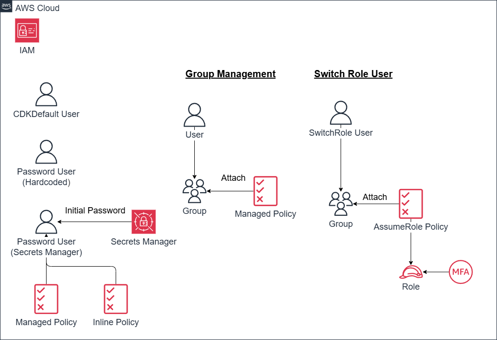

# IAM基礎 —— ユーザー、ロール、安全なパスワード管理

*他の言語で読む:* [](./README.ja.md) [](./README.md)


## アーキテクチャ概要

構築する内容は次のとおりです。



以下の4つのコンストラクトで5つの異なるパターンを実装します。

### コンストラクト1: 基本ユーザー (CDKDefaultUser)

- パターン1: 最小限のIAMユーザー構成

### コンストラクト2: パスワード管理ユーザー (IAMUserWithPassword)

- パターン2A: ハードコードされたパスワード(⚠️ 非推奨)
- パターン2B: Secrets Managerでの安全なパスワード管理(✅ 推奨)
- パターン3A: AWSマネージドポリシーの適用
- パターン3B: インラインポリシーの適用

### コンストラクト3: グループ管理ユーザー (IamUserGroup)

- パターン4: グループベースの権限管理

### コンストラクト4: スイッチロールユーザー (SwitchRoleUser)

- パターン5: MFA必須のロール引き受け

## 前提条件

- AWS CLI v2のインストールと設定
- Node.js 20+
- AWS CDK CLI（`npm install -g aws-cdk`）
- TypeScriptの基礎知識
- AWSアカウント（無料利用枠で実施可能）
- IAMの概念理解（ユーザー、ロール、ポリシー）

## プロジェクトディレクトリ構造

```text
iam-basics/
├── bin/
│   └── iam-basics.ts                      # アプリケーションエントリーポイント
├── lib/
│   ├── stacks/
│   │   └── iam-basics-stack.ts            # メインスタック定義
│   └── constructs/
│       ├── iam-user-with-password.ts      # パターン2-3を含む
│       ├── iam-user-with-group.ts         # パターン4
│       └── iam-user-with-switch-role.ts   # パターン5
├── test/
│   ├── compliance/
│   │   └── cdk-nag.test.ts                # テストコード（後の演習で解説）
│   ├── snapshot/
│   │   └── snapshot.test.ts               # テストコード（後の演習で解説）
│   └── unit/
│       └── iam-basics.test.ts             # テストコード（後の演習で解説）
├── cdk.json
├── package.json
└── tsconfig.json
```

## パターン1: CDKデフォルトユーザーを理解する

最もシンプルなIAMユーザー作成です。これだけのコードでIAMユーザーが作成できます。

```typescript
import * as cdk from 'aws-cdk-lib';
import { Construct } from 'constructs';
import * as iam from 'aws-cdk-lib/aws-iam';

export class IamBasicsStack extends cdk.Stack {
  constructor(scope: Construct, id: string, props?: cdk.StackProps) {
    super(scope, id, props);

    // 最小限のIAMユーザー構成
    const cdkDefaultUser = new iam.User(this, 'CDKDefaultUser', {});
  }
}
```

生成されるCloudFormation:

```json
{
  "Resources": {
    "CDKDefaultUserF7AAA71A": {
      "Type": "AWS::IAM::User",
      "Metadata": {
        "aws:cdk:path": "Dev/DrillexercisesIamBasics/CDKDefaultUser/Resource"
      }
    }
  }
}
```

### デフォルト構成の詳細

CDKが自動的に設定する項目を確認していきます。

- ユーザー名: AWSが自動生成
- パスワードなし: コンソールアクセスはデフォルトで無効
- ポリシーなし: 権限ゼロ（最小権限の原則）
- アクセスキーなし: プログラムアクセスは無効

明示的に権限を付与するまで、何もアクセスできません。

## パターン2A: ハードコードされたパスワードを持つユーザー（⚠️ 非推奨）

⚠️ このパターンは、本番環境で利用するとどうなるかを示すものです。
なお、`"PasswordResetRequired": true`がついていますが、権限がないのでパスワード変更ができません。
パスワード変更させるには、[パターン2B]で示す`IAMUserChangePassword`が必要です。
または、AWSアカウント全体でIAMユーザーに自身のパスワード変更を許可することもできます。（[AWSドキュメント参照](https://docs.aws.amazon.com/IAM/latest/UserGuide/id_credentials_passwords_enable-user-change.html#proc_letalluserschangepassword)）

```typescript
const userWithPassword = new iam.User(this, 'PasswordUser', {
  password: cdk.SecretValue.unsafePlainText('InitialPassword123!'),
  passwordResetRequired: true,
});
```

生成されるCloudFormation:

```json
{
  "UserWithPasswordPasswordUserA5E8EDB8": {
    "Type": "AWS::IAM::User",
    "Properties": {
      "LoginProfile": {
        "Password": "InitialPassword123!",
        "PasswordResetRequired": true
      },
    }
  }
} 
```

### これが危険な理由

1. ソースコード内のパスワード: バージョン管理で可視化される。環境変数で渡したとしても次の理由で露出します。
2. CloudFormationテンプレート: コンソールやログにパスワードが露出
3. 暗号化なし: 平文で保存される
4. 監査証跡: パスワード変更の追跡が困難

本番環境では決してこのパターンを使用しないでください。

## パターン2B: Secrets Managerを使ったユーザー（✅ 推奨）

これがIAMユーザーのパスワードを管理する安全な方法です。

```typescript
import * as secretsmanager from 'aws-cdk-lib/aws-secretsmanager';

const userName = 'SecretsPasswordUser';

// 自動生成パスワードでシークレットを作成
const userSecret = new secretsmanager.Secret(this, 'PasswordSecret', {
  generateSecretString: {
    secretStringTemplate: JSON.stringify({ username: userName }),
    generateStringKey: 'password',
    excludePunctuation: true,
    passwordLength: 16,
    requireEachIncludedType: true,
  },
});

// Secrets Managerからのパスワードでユーザーを作成
const user = new iam.User(this, 'SecretsPasswordUser', {
  userName: userName,
  password: userSecret.secretValueFromJson('password'),
  passwordResetRequired: true,
});
// change password policy
userWithSecretsManager.addManagedPolicy(
user.addManagedPolicy(
);

// ユーザーに自分のパスワードを読み取る権限を付与
userSecret.grantRead(user);

// 取得用のシークレットARNを出力
new cdk.CfnOutput(this, 'SecretArn', {
  value: userSecret.secretArn,
  description: 'パスワード取得: aws secretsmanager get-secret-value --secret-id <このARN>',
});
```

生成されるCloudFormation:

```json
{
  "UserWithPasswordPasswordSecrets430B0ABA": {
    "Type": "AWS::SecretsManager::Secret",
    "Properties": {
      "GenerateSecretString": {
        "ExcludePunctuation": true,
        "GenerateStringKey": "password",
        "SecretStringTemplate": "{\"username\":\"SecretsPasswordUser\"}"
      }
    }
  },
  "UserWithPasswordSecretsPasswordUserCFEF7855": {
    "Type": "AWS::IAM::User",
    "Properties": {
      "LoginProfile": {
        "Password": {
          "Fn::Join": [
            "",
            [
              "{{resolve:secretsmanager:",
              {"Ref": "UserWithPasswordPasswordSecrets430B0ABA"},
              ":SecretString:password::}}"
            ]
          ]
        },
        "PasswordResetRequired": true
      },
      "ManagedPolicyArns": [
      {
        "Fn::Join": [
        "",
        [
          "arn:",
          {
          "Ref": "AWS::Partition"
          },
          ":iam::aws:policy/IAMUserChangePassword"
        ]
        ]
      }
      ],
      "UserName": "SecretsPasswordUser"
    }
  },
  "UserWithPasswordSecretsPasswordUserDefaultPolicy6A5FC9BF": {
    "Type": "AWS::IAM::Policy",
    "Properties": {
      "PolicyDocument": {
        "Statement": [
          {
            "Action": [
              "secretsmanager:DescribeSecret",
              "secretsmanager:GetSecretValue"
            ],
            "Effect": "Allow",
            "Resource": {
              "Ref": "UserWithPasswordPasswordSecrets430B0ABA"
            }
          }
        ]
      },
      "Users": [
        {"Ref": "UserWithPasswordSecretsPasswordUserCFEF7855"}
      ]
    }
  }
}
```

### このパターンの主要機能

#### 1. CloudFormation動的参照

最も重要な部分はこれです。

```json
"Password": {
  "Fn::Join": [
    "",
    [
      "{{resolve:secretsmanager:",
      {"Ref": "SecretId"},
      ":SecretString:password::}}"
    ]
  ]
}
```

CloudFormationは`{{resolve:secretsmanager:...}}`を使用して、スタックデプロイ中に動的にパスワードを取得します。実際のパスワードはCloudFormationテンプレートに表示されません。

#### 2. 自動生成される安全なパスワード

```typescript
generateSecretString: {
  secretStringTemplate: JSON.stringify({ username: userName }),
  generateStringKey: 'password',
  excludePunctuation: true,        // 問題を引き起こす可能性のある特殊文字を避ける
  passwordLength: 16,              // 強力なパスワードの長さ
  requireEachIncludedType: true,   // 大文字、小文字、数字を含める
}
```

#### 3. 最小権限の原則

```typescript
userSecret.grantRead(user);
```

これにより、この特定のユーザーのみが自分のパスワードシークレットを読み取る権限を付与されます。生成されるポリシーには以下が含まれます。

- `secretsmanager:DescribeSecret`
- `secretsmanager:GetSecretValue`

### パスワードの取得

デプロイ後:

```bash
# スタック出力からシークレットARNを取得
SECRET_ARN=$(aws cloudformation describe-stacks \
  --stack-name YourStackName \
  --query 'Stacks[0].Outputs[?OutputKey==`SecretArn`].OutputValue' \
  --output text)

# パスワードを取得
aws secretsmanager get-secret-value --secret-id $SECRET_ARN \
  --query SecretString --output text | jq -r '.password'
```

## パターン3: マネージドポリシーとインラインポリシーの適用

このパターンは `IAMUserWithPassword` コンストラクト内で実装されています。
Secrets Managerでパスワード生成したユーザーに対して、2種類のポリシーを適用します。

### AWSマネージドポリシー

```typescript
userWithPassword.addManagedPolicy(
  iam.ManagedPolicy.fromAwsManagedPolicyName('ReadOnlyAccess')
);
```

生成されるCloudFormation:

```json
{
  "ManagedPolicyArns": [
    {
      "Fn::Join": [
        "",
        [
          "arn:",
          {"Ref": "AWS::Partition"},
          ":iam::aws:policy/ReadOnlyAccess"
        ]
      ]
    }
  ]
}
```

特徴:

- AWSが管理
- 新しいサービスで自動的に更新される
- 複数のユーザー/ロール/グループにアタッチ可能
- ARNで参照

### インラインポリシー

```typescript
userWithPassword.addToPolicy(
  new iam.PolicyStatement({
    actions: ['s3:ListAllMyBuckets'],
    resources: ['arn:aws:s3:::*'],
  })
);
```

生成されるCloudFormation:

```json
{
  "UserDefaultPolicy": {
    "Type": "AWS::IAM::Policy",
    "Properties": {
      "PolicyDocument": {
        "Statement": [
          {
            "Action": "s3:ListAllMyBuckets",
            "Effect": "Allow",
            "Resource": "arn:aws:s3:::*"
          }
        ]
      },
      "Users": [
        {"Ref": "User"}
      ]
    }
  }
}
```

特徴:

- カスタム権限
- ユーザー/ロールと密結合
- ユーザー/ロールが削除されると削除される
- テンプレート内で直接定義

### 使い分け

| ユースケース | マネージドポリシー | インラインポリシー |
|----------|---------------|---------------|
| 一般的なAWS権限 | ✅ | ❌ |
| アプリケーション固有のカスタム権限 | ❌ | ✅ |
| 複数のエンティティで共有 | ✅ | ❌ |
| 1回限りの特定権限 | ❌ | ✅ |
| 頻繁に変更される権限 | ❌ | ✅ |

## パターン4: グループベースの権限管理

グループを使用すると、複数のユーザーに対して一貫した権限を付与できます。
このパターンは `iam-user-with-group.ts` で実装されています。

```typescript
// グループを作成
const group = new iam.Group(this, 'IamGroup', {});

// ポリシーをグループにアタッチ
group.addManagedPolicy(iam.ManagedPolicy.fromAwsManagedPolicyName('ReadOnlyAccess'));

// ユーザーをグループに追加
user.addToGroup(group);
```

生成されるCloudFormation:

```json
{
  "UserGroupIamGroupAB148728": {
   "Type": "AWS::IAM::Group",
   "Properties": {
    "ManagedPolicyArns": [
     {
      "Fn::Join": [
       "",
       [
        "arn:",
        {
         "Ref": "AWS::Partition"
        },
        ":iam::aws:policy/ReadOnlyAccess"
       ]
      ]
     }
    ]
   },
  "UserGroupUser5985318E": {
   "Type": "AWS::IAM::User",
   "Properties": {
    "Groups": [
     {
      "Ref": "UserGroupIamGroupAB148728"
     }
    ],
   }
}
```

### グループベース管理のメリット

1. 一元管理: すべてのユーザーの権限を一度に更新
2. 一貫性: ロール内のすべてのユーザーが同一の権限を持つことを保証
3. スケーラビリティ: 新しいチームメンバーのオンボーディングが容易
4. 監査可能性: 明確な権限構造

## パターン5: MFA必須のスイッチロール(応用)

💡 注意: Level 100としては応用的なパターンです

このパターンは `iam-user-with-switch-role.ts` で実装されています。
このスイッチロールパターンは、Level 100としてはやや応用的ですが、以下の理由で含めています。

- IAMの基本的なベストプラクティスである
- 実際のAWS環境で頻繁に遭遇する
- CDKでは実装が簡潔に書ける

このパターンは、セキュリティのベストプラクティスを実装します。昇格された権限にはMFAを必須とします。

```typescript
const accountId = cdk.Stack.of(this).account;

// IAMユーザーを作成
const switchRoleUser = new iam.User(this, 'SwitchRoleUser', {
  userName: 'SwitchRoleUser',
  password: userSecret.secretValueFromJson('password'),
  passwordResetRequired: true,
});

// MFA必須のロールを作成
const readOnlyRole = new iam.Role(this, 'ReadOnlyRole', {
  assumedBy: new iam.PrincipalWithConditions(
    new iam.AccountPrincipal(accountId),
    {
      Bool: { 'aws:MultiFactorAuthPresent': 'true' },
    }
  ),
  maxSessionDuration: cdk.Duration.hours(4),
  managedPolicies: [
    iam.ManagedPolicy.fromAwsManagedPolicyName('ReadOnlyAccess'),
  ],
});

// ロールを引き受けることを許可するポリシーを作成
const assumeRolePolicy = new iam.Policy(this, 'AssumeRolePolicy', {
  statements: [
    new iam.PolicyStatement({
      actions: ['sts:AssumeRole'],
      resources: [readOnlyRole.roleArn],
    }),
  ],
});

// グループを作成してポリシーをアタッチ
const switchRoleGroup = new iam.Group(this, 'SwitchRoleGroup', {});
assumeRolePolicy.attachToGroup(switchRoleGroup);

// ユーザーをグループに追加
switchRoleUser.addToGroup(switchRoleGroup);
```

生成されるCloudFormation:

```json
{
  "SwitchRoleUserReadOnlyRole660C7C3B": {
    "Type": "AWS::IAM::Role",
    "Properties": {
      "AssumeRolePolicyDocument": {
        "Statement": [
          {
            "Action": "sts:AssumeRole",
            "Condition": {
              "Bool": {
                "aws:MultiFactorAuthPresent": "true"
              }
            },
            "Effect": "Allow",
            "Principal": {
              "AWS": "arn:aws:iam::123456789012:root"
            }
          }
        ]
      },
      "ManagedPolicyArns": [
        {
          "Fn::Join": [
            "",
            [
              "arn:",
              {"Ref": "AWS::Partition"},
              ":iam::aws:policy/ReadOnlyAccess"
            ]
          ]
        }
      ],
      "MaxSessionDuration": 14400
    }
  }
}
```

### MFA要件の理解

重要な部分は条件です。

```json
"Condition": {
  "Bool": {
    "aws:MultiFactorAuthPresent": "true"
  }
}
```

これは次のことを意味します。

- ユーザーはロールを引き受ける前にMFAで認証しなければならない
- MFAがないと、`AssumeRole` APIコールは失敗する

### スイッチロールの使い方

1. ユーザーのMFAを有効化

   ```bash
   aws iam create-virtual-mfa-device \
     --virtual-mfa-device-name SwitchRoleUser-MFA \
     --outfile QRCode.png \
     --bootstrap-method QRCodePNG
   
   aws iam enable-mfa-device \
     --user-name SwitchRoleUser \
     --serial-number arn:aws:iam::123456789012:mfa/SwitchRoleUser-MFA \
     --authentication-code1 123456 \
     --authentication-code2 789012
   ```

2. ロールを引き受ける

   ```bash
   aws sts assume-role \
     --role-arn arn:aws:iam::123456789012:role/ReadOnlyRole \
     --role-session-name ReadOnlySession \
     --serial-number arn:aws:iam::123456789012:mfa/SwitchRoleUser-MFA \
     --token-code 123456
   ```

3. AWSコンソールでの使用

   - SwitchRoleUserとしてログイン
   - アカウント名をクリック → ロールの切り替え
   - アカウントIDとロール名を入力
   - MFAコードの入力が求められる

### スイッチロールパターンのメリット

1. 職務の分離: 通常権限と昇格権限の分離
2. 監査証跡: 昇格権限が使用されたときの明確なログ
3. 時間制限: `maxSessionDuration`が自動期限切れを強制
4. MFA保護: 機密操作のための追加のセキュリティ層

## デプロイと検証

### デプロイ

```bash
# 差分を確認
cdk diff --project=sample --env=dev

# デプロイ
cdk deploy "**" --project=sample --env=dev
```

### 検証

1. IAMユーザーを確認

   ```bash
   # すべてのユーザーをリスト
   aws iam list-users
   
   # 特定のユーザーの詳細を取得
   aws iam get-user --user-name SecretsPasswordUser
   ```

2. アタッチされたポリシーを確認

   ```bash
   # ユーザーポリシーをリスト
   aws iam list-attached-user-policies --user-name PasswordUser
   
   # インラインポリシーをリスト
   aws iam list-user-policies --user-name PasswordUser
   ```

3. Secrets Managerを確認

   ```bash
   # シークレット値を取得
   aws secretsmanager get-secret-value \
     --secret-id <secret-arn> \
     --query SecretString \
     --output text
   ```

4. スイッチロールをテスト

   ```bash
   # MFAでロールを引き受ける
   aws sts assume-role \
     --role-arn <role-arn> \
     --role-session-name TestSession \
     --serial-number <mfa-device-arn> \
     --token-code <mfa-code>
   ```

### クリーンアップ

```bash
# スタックを削除
cdk destroy "**" --project=sample --env=dev

# 確認なしで強制削除
cdk destroy "**" --force --project=sample --env=dev
```

重要: IAMユーザーとロールはデフォルトで保持されます。削除したい場合は、手動で削除するか、適切な削除ポリシーを設定する必要があります。

## ベストプラクティス

### セキュリティ

1. パスワードをハードコードしない: 常にSecrets ManagerまたはParameter Storeを使用
2. MFAを有効化: 特に特権アカウントで有効化する
3. スイッチロールを使用: 通常権限と昇格権限を分離
4. 最小権限の原則: 必要な権限のみを付与
5. 定期的な監査: IAMポリシーとアクセスパターンを確認
6. パスワードポリシー: 強力なパスワード要件を強制
7. アクセスキーのローテーション: 定期的にアクセスキーをローテーション（または完全に避ける）

### パスワード管理

1. Secrets Managerを使用: すべてのパスワード保存に使用する
2. 自動生成: 強力なパスワードを自動作成させることができます
3. リセットを必須: 初回ログイン時にパスワード変更を強制します

### ポリシー管理

1. マネージドポリシーを優先: AWSが提供する一般的な権限でよい場合はこれを使用します
2. インラインポリシーを使用: 特定の1回限りの権限でのみ使用することを推奨します
3. グループベースの管理: ロールを個別に付与するのではなく、グループごとに付与することで管理を簡素化します。

### 運用

1. CloudTrailログ: すべてのIAMアクティビティを監視
2. 命名規則: 明確で一貫した名前を使用
3. 環境を分離: dev/test/prodで異なるIAM構成

## まとめ

この演習では、AWS CDKを通じてIAMの基礎を学びました。

### 学んだこと

1. IAMの基礎: ユーザー、グループ、ロール、ポリシー
2. 安全なパスワード: ハードコードされた値の代わりにSecrets Managerを使用
3. CloudFormation統合: `{{resolve:secretsmanager:...}}`による動的シークレット解決
4. ポリシータイプ: マネージドポリシーとインラインポリシー、使い分け
5. スイッチロール: MFA要件を持つロール引き受けの実装
6. ベストプラクティス: 最小権限、MFA、グループベース管理

### 重要なポイント

- セキュリティ第一: IAMはAWSセキュリティの基盤
- Secrets Manager: パスワード管理に不可欠
- MFA: 昇格権限に重要
- グループ: 権限管理を簡素化
- 監査: CloudTrailと定期的なレビューが不可欠

## 参考資料

- [AWS IAM公式ドキュメント](https://docs.aws.amazon.com/ja_jp/IAM/latest/UserGuide/)
- [IAMベストプラクティス](https://docs.aws.amazon.com/ja_jp/IAM/latest/UserGuide/best-practices.html)
- [AWS Secrets Manager](https://docs.aws.amazon.com/ja_jp/secretsmanager/)
- [IAMポリシーリファレンス](https://docs.aws.amazon.com/ja_jp/IAM/latest/UserGuide/reference_policies.html)
