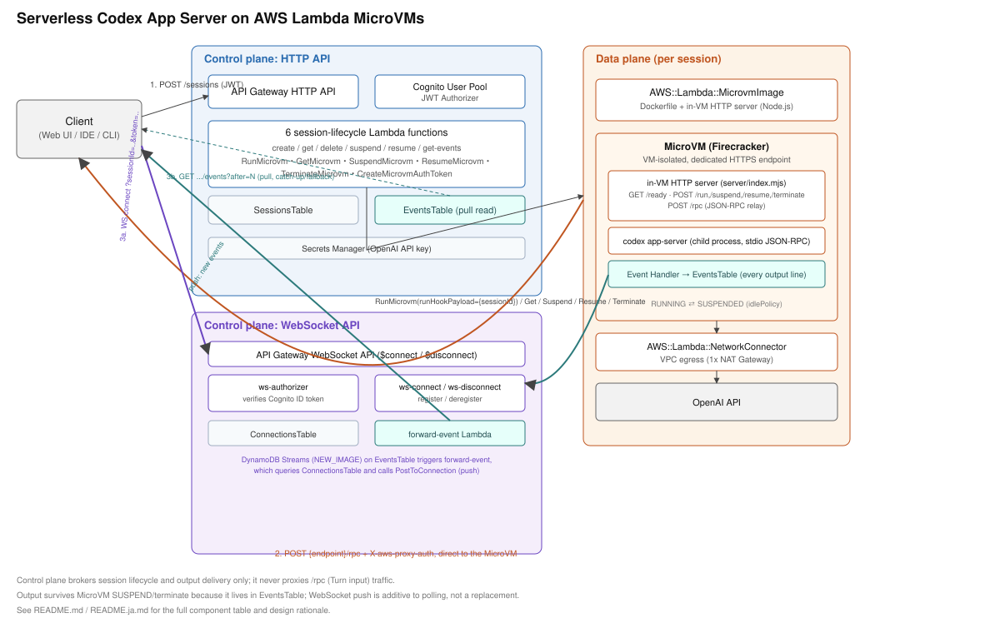

# Serverless Codex App Server on AWS Lambda MicroVMs - AWS CDK Reference Architecture

*Read this in other languages:* [](./README.ja.md) [](./README.md)

> **Source.** This reference implements the architecture described in
> ["Lambda MicroVMsで実現するServerlessなCodex App Server"](https://note.com/japan_d2/n/n618cb3439486)
> (Japan Digital Design, Inc. / Satoshi Toyama, 2026-09-15), adapted into an AWS CDK reference architecture.
> The source article uses polling for output delivery and notes it chose that for implementation simplicity
> over an SSE/WebSocket experience; this reference goes one step further than the source and adds a WebSocket
> push path alongside polling (see "Design Decisions" #2). Two other implementation details the article
> doesn't spell out at the API level were filled in independently from the AWS Lambda MicroVMs public API
> surface (`@aws-sdk/client-lambda-microvms`, the `AWS::Lambda::MicrovmImage`/`AWS::Lambda::NetworkConnector`
> CloudFormation schemas) and are called out where relevant below: the IAM service principal Lambda MicroVMs
> assumes for build/execution roles, and `codex app-server`'s exact stdio JSON-RPC framing/method names.
> Verify both against the current AWS Lambda MicroVMs Developer Guide and the
> [Codex CLI source](https://github.com/openai/codex) before production use.

## 📑 Table of Contents

- [Architecture Overview](#-architecture-overview)
- [Design Decisions & Best Practices](#-design-decisions--best-practices)
- [Well-Architected Alignment](#-well-architected-alignment)
- [Cost Optimization](#-cost-optimization)
- [Security Considerations](#-security-considerations)
- [Prerequisites](#-prerequisites)
- [Deployment Guide](#-deployment-guide)
- [Usage](#usage)
- [Testing Strategy](#-testing-strategy)
- [Customization](#️-customization)
- [Troubleshooting](#-troubleshooting)
- [Clean-up](#-clean-up)
- [References](#-references)

## 🏗️ Architecture Overview



A session **control plane** (an HTTP API with 7 Lambda functions, plus a WebSocket API with 3 more) brokers
the lifecycle of on-demand **data plane** sessions: each session is a VM-isolated
[AWS Lambda MicroVM](https://aws.amazon.com/lambda/lambda-microvms/) running
[`codex app-server`](https://github.com/openai/codex) (OpenAI Codex CLI's JSON-RPC agent protocol --
Thread/Turn/Item). As of this reference's authoring, Lambda MicroVMs has no built-in way to log into a running
MicroVM, execute a command, and stream the response back to a caller. So every MicroVM runs **its own HTTP
server** (`src/microvm-image/server/`) that plays that role: it answers the platform's lifecycle hook calls, it
relays JSON-RPC requests from clients to the `codex app-server` child process it manages, and an in-VM **Event
Handler** persists every line `codex app-server` emits to a DynamoDB **EventsTable** -- so a session's Thread
content stays readable even after its MicroVM is SUSPENDED or terminated. `EventsTable` writes also fan out to
any client connected over the **WebSocket API** in near-real-time via **DynamoDB Streams**, so output does not
have to be polled to be timely. The control plane itself never proxies app-server *input* traffic; it only
brokers session lifecycle and output delivery.

```
Client (Web UI / IDE / CLI)                                            ── control plane (HTTP) ──
   │  1. POST /sessions (Cognito JWT)
   ▼
API Gateway HTTP API ── JWT Authorizer (Cognito User Pool)
   │
   ▼
Control-plane Lambdas: create / get / delete / suspend / resume / get-events
   │  RunMicrovm / GetMicrovm / SuspendMicrovm / ResumeMicrovm /
   │  TerminateMicrovm / CreateMicrovmAuthToken                        ── data plane ──
   ▼
Lambda MicroVMs data plane
   │  launches a Firecracker microVM from the codex app-server image;
   │  POST /run (RunMicrovmRequest.runHookPayload = {sessionId}) primes it
   ▼
MicroVM (VM-isolated, dedicated HTTPS endpoint)
   in-VM HTTP server (server/index.mjs)
     ├─ lifecycle hooks: GET /ready · POST /run,/suspend,/resume,/terminate
     ├─ /rpc  ──stdio JSON-RPC──▶  codex app-server (child process)
     └─ Event Handler  ──────────▶  DynamoDB EventsTable (every output line)
   ── egress via AWS::Lambda::NetworkConnector → NAT Gateway → OpenAI API

   │  2. POST {endpoint}/rpc + X-aws-proxy-auth, direct to the MicroVM endpoint
   ▼
Client
   │  3a. WS connect wss://.../{stage}?sessionId=...&token=...          ── control plane (WebSocket) ──
   ▼                                                    ┌── DynamoDB Streams (NEW_IMAGE) ──┐
API Gateway WebSocket API                               │                                   ▼
   │ $connect (Lambda authorizer verifies Cognito ID token)     EventsTable ──────▶ forward-event Lambda
   ▼                                                                                        │
ws-connect Lambda ──▶ ConnectionsTable (sessionId → connectionId)  ◀───────────────────────┘
                                                                     PostToConnection (push new events)
   │  3b. GET /sessions/{id}/events?after=N  (fetch anything written before/around the WS connect)
   ▼                                                                    ── control plane (HTTP) ──
API Gateway → get-events Lambda ──▶ DynamoDB EventsTable (read-only; MicroVM state-independent)
```

### Key Components

| Component | Purpose |
|---|---|
| `AWS::Lambda::MicrovmImage` (`CfnMicrovmImage`) | Packages `src/microvm-image/` (Node.js + `@openai/codex` + the in-VM HTTP server) into a snapshotted MicroVM image. |
| `AWS::Lambda::NetworkConnector` + VPC (1 NAT Gateway) | The only way a MicroVM's `egressNetworkConnectors` can reach the internet (the OpenAI API); without it, `codex app-server` has no outbound network access at all. |
| **In-VM HTTP server** (`server/index.mjs`) | Answers the platform's lifecycle hooks over HTTP (`GET /ready`, `POST /run`/`/suspend`/`/resume`/`/terminate`) and relays `POST /rpc` requests to the `codex app-server` child process it spawns and manages (`server/codex-process.mjs`). |
| **Event Handler** (`server/event-handler.mjs`) | Subscribes to every line `codex app-server` writes to stdout and persists it to `EventsTable`, sequenced per session. |
| Secrets Manager secret | Holds the OpenAI API key. Only its ARN is baked into the image (`OPENAI_API_KEY_SECRET_ARN`); the in-VM server resolves the value at container-start time via the execution role (`server/secret.mjs`). |
| 7 HTTP control-plane Lambdas | `create-session` (RunMicrovm + CreateMicrovmAuthToken), `get-session` (GetMicrovm), `delete-session` (TerminateMicrovm), `suspend-session` (SuspendMicrovm), `resume-session` (ResumeMicrovm + a fresh auth token), `get-events` (polls `EventsTable`). |
| 3 WebSocket Lambdas | `ws-authorizer` (verifies the Cognito ID token on `$connect`), `ws-connect` (registers the connection against a session), `ws-disconnect` (deregisters it), `forward-event` (DynamoDB Streams-triggered; pushes new `EventsTable` items to connected clients). |
| DynamoDB `SessionsTable` | One item per session (`sessionId`, `ownerId`, `microvmId`, `endpoint`, `state`), TTL-expired automatically. |
| DynamoDB `EventsTable` | One item per `codex app-server` output line (`sessionId`, `sequence`, `event`), written by the in-VM Event Handler. Streams (`NEW_IMAGE`) trigger `forward-event`; read directly by `get-events`. Survives the MicroVM's own lifecycle. |
| DynamoDB `ConnectionsTable` | Which WebSocket connections are watching which session (`sessionId`, `connectionId`, `ownerId`), with a `ByConnectionId` GSI so `ws-disconnect` can look up a connection's session. |
| Cognito User Pool | Backs both the HTTP API's JWT authorizer and the WebSocket API's Lambda authorizer; `ownerId`/`sub` scopes every session, event, and connection record to its creator. |

### Thread creation, Turn execution, and output delivery

Extending the source article's sequence with a push path:

1. **Start a session** -- `POST /sessions` (control plane) launches a MicroVM from the pre-baked image
   (`RunMicrovm`), with `runHookPayload: {"sessionId": "..."}` delivered as the body of the image's `/run`
   hook so the in-VM Event Handler knows which `EventsTable` partition to write to. The response carries the
   MicroVM's own `endpoint` and a short-lived `X-aws-proxy-auth` token.
2. **Drive a Turn** -- the client `POST`s a JSON-RPC 2.0 request straight to `{endpoint}/rpc` (with the auth
   header). The in-VM server relays it to `codex app-server`'s stdin and, for requests carrying an `id`,
   returns the matching stdout response synchronously; every line -- responses and server-initiated
   notifications alike -- is also captured by the Event Handler.
3. **Receive output** -- rather than reading the MicroVM directly:
   - **Push (near-real-time):** the client opens a WebSocket connection
     (`wss://.../{stage}?sessionId=...&token=<Cognito ID token>`). `ws-authorizer` verifies the token,
     `ws-connect` registers the connection in `ConnectionsTable`, and from then on every `EventsTable` write
     for that session is pushed to it by `forward-event` (via DynamoDB Streams + `PostToConnection`) the
     moment it's written.
   - **Pull (catch-up and fallback):** `GET /sessions/{sessionId}/events?after={sequence}` (control plane)
     reads `EventsTable` directly. A client should call this once right after connecting the WebSocket (to
     pick up anything written just before the connection registered) and can fall back to polling it entirely
     if it doesn't want to hold a WebSocket connection open. Either path works whether the MicroVM is
     RUNNING, SUSPENDED, or already terminated, because both only ever read `EventsTable`.

### MicroVM lifecycle hooks

`cdk synth`'s CloudFormation Validate plugin confirms that `Hooks.MicrovmHooks.*` and
`Hooks.MicrovmImageHooks.*` on `AWS::Lambda::MicrovmImage` are `ENABLED`/`DISABLED` switches, not literal
script paths. Per the source article, enabling a hook makes the platform call it as an **HTTP request against
the container's `Hooks.port`**:

| Hook | HTTP call | When | What the in-VM server does |
|---|---|---|---|
| `ready` (image build) | `GET /ready` | Polled after the Dockerfile's container starts, before the Firecracker snapshot is taken | Returns 200 once `codex app-server` has been spawned and the Event Handler is wired up. |
| `validate` (image build) | `GET /validate` | Polled once after the snapshot is taken | Same check as `ready` -- confirms the snapshot itself resumes into a working state. |
| `run` | `POST /run` | MicroVM PENDING → RUNNING | Reads `runHookPayload`'s `sessionId` and binds the Event Handler to it. `codex app-server` and the HTTP server are already running (resumed from the snapshot), so this step is lightweight. |
| `suspend` / `resume` | `POST /suspend` / `POST /resume` | RUNNING ⇄ SUSPENDED | Log checkpoints only -- Firecracker's own memory+disk snapshot preserves the `codex app-server` process (and any in-flight Thread/Turn/Item state) automatically. |
| `terminate` | `POST /terminate` | Before the MicroVM is torn down | Best-effort graceful shutdown of `codex app-server`. |

## 🎯 Design Decisions & Best Practices

### 1. An in-VM HTTP server stands in for a missing "exec and stream" primitive

Lambda MicroVMs has no API to log into a running MicroVM and stream a command's output back. This reference
follows the source article's approach: the image itself runs an HTTP server that relays JSON-RPC to
`codex app-server` and captures its output, so external callers only ever need plain HTTPS.

### 2. Output delivery is push (WebSocket) with pull (polling) as the source of truth

The source article's demo used polling alone, for implementation simplicity. This reference keeps `EventsTable`
as the single source of truth (so a client can always poll `get-events` and get the right answer) but adds a
push path on top: a DynamoDB Streams trigger (`forward-event`) delivers each new item to connected WebSocket
clients as it's written. This is additive, not a replacement -- a client that never opens a WebSocket
connection still works purely by polling, and a client that does should still poll once after connecting to
cover the gap between session start and WebSocket registration.

### 3. WebSocket connection state is decoupled from the MicroVM's lifecycle

`ConnectionsTable` tracks *client* connections, entirely separate from the MicroVM's own RUNNING/SUSPENDED
state. A client's WebSocket session can stay open across a MicroVM being suspended and resumed (output simply
pauses until the next event is written); conversely, closing the WebSocket never affects the MicroVM.

### 4. A Cognito ID token cannot ride a WebSocket handshake's Authorization header

Browsers do not let application code set custom headers on a WebSocket handshake, so the ID token travels as
a `token` query string parameter instead, verified by a `WebSocketLambdaAuthorizer` (`ws-authorizer.ts`) using
[`aws-jwt-verify`](https://github.com/awslabs/aws-jwt-verify). This differs from the HTTP API's managed
`HttpUserPoolAuthorizer`, which WebSocket APIs cannot use.

### 5. The control plane never proxies app-server *input* traffic

`create-session` and `resume-session` return the MicroVM's own `endpoint` and a short-lived
`X-aws-proxy-auth` token (from `CreateMicrovmAuthToken`, scoped to a single port via `allowedPorts`). The
client sends JSON-RPC requests to that endpoint directly. This keeps the control-plane Lambdas' latency and
cost independent of Turn traffic volume; only the (much smaller) output-delivery path flows back through it.

### 6. `/rpc` is a generic relay, not a typed Thread/Turn REST API

The in-VM server's `/rpc` endpoint forwards a raw JSON-RPC 2.0 request body verbatim to `codex app-server`'s
stdin, rather than exposing fixed `/threads`/`/turns` REST routes with hardcoded method names. This reference
could not independently verify `codex app-server`'s exact method/parameter schema against the Codex CLI
source, so it deliberately stays protocol-agnostic at the HTTP boundary -- see the
[Codex CLI repository](https://github.com/openai/codex) for the actual `initialize`/thread/turn/item methods
to send.

### 7. Suspend beats terminate for cost

`idlePolicy` auto-suspends an idle MicroVM (billed only for Firecracker snapshot storage) rather than
terminating it. `POST /sessions/{id}/suspend` and `/resume` let a client that knows a session is temporarily
unneeded (a closed tab) trigger that transition immediately instead of waiting out the idle timeout.

### 8. The OpenAI API key never enters the image or Infrastructure-as-Code

`CfnMicrovmImage.environmentVariables` carries only `OPENAI_API_KEY_SECRET_ARN` (a fixed value for every
session). `server/secret.mjs` resolves the actual secret value from Secrets Manager at container-start time,
using the credentials the platform injects for the MicroVM's `executionRoleArn`.

### 9. Sessions, events, and connections are owner-scoped end to end

The Cognito subject (`sub`) becomes `ownerId` on every `SessionsTable` and `ConnectionsTable` item; HTTP
routes 404 and WebSocket `$connect` rejects a session that isn't the caller's own, rather than leaking another
user's MicroVM endpoint or output.

## 🏛️ Well-Architected Alignment

| Pillar | How this reference addresses it |
|---|---|
| Operational Excellence | CloudWatch access logs on the HTTP API stage and a dedicated CloudWatch log group per control-plane Lambda and per MicroVM image. |
| Security | VM-level isolation per session (Firecracker, no shared kernel), Cognito-backed authorization on every HTTP route and the WebSocket `$connect` route, owner-scoped session/event/connection records, least-privilege DynamoDB/Secrets Manager grants. |
| Reliability | Turn output in DynamoDB survives MicroVM SUSPEND/terminate independently, and WebSocket delivery degrades gracefully to polling if a connection drops; a single NAT Gateway is a deliberate cost/AZ-resilience tradeoff -- add a NAT Gateway per AZ for production. |
| Performance Efficiency | MicroVMs resume from a pre-initialized Firecracker snapshot (with `codex app-server` and the in-VM HTTP server already running) instead of booting cold; output reaches clients via push rather than fixed-interval polling. |
| Cost Optimization | `idlePolicy` auto-suspend, DynamoDB TTL for expired sessions/connections, PAY_PER_REQUEST billing throughout, WebSocket push avoids wasted polling requests once a Turn goes idle. |

## 💰 Cost Optimization

This reference introduces cost dimensions this repository's other patterns don't have (MicroVM run/suspend
time, a NAT Gateway, Cognito, a WebSocket API). **Do not treat any number here as a quote** -- always check the
AWS Pricing pages for Lambda MicroVMs, NAT Gateway, Cognito, API Gateway WebSocket APIs, and DynamoDB in your
Region before estimating a real workload's cost.

Rough cost *drivers*, in the order they matter for this architecture:

1. **MicroVM RUNNING time** -- billed while a session's MicroVM is actively running (the main driver for a
   busy Codex session).
2. **MicroVM SUSPENDED time** -- billed only for Firecracker snapshot storage; this is why `idlePolicy` and
   the explicit `/suspend` route matter for cost, not just latency. Because Turn output lives in
   `EventsTable`, suspending aggressively costs nothing in output availability.
3. **NAT Gateway** -- an hourly charge plus per-GB data processing for every byte `codex app-server` sends
   to/from the OpenAI API. A single NAT Gateway (this reference's default) is the cheapest viable setup;
   consider VPC endpoints for any AWS service traffic MicroVMs need beyond internet egress.
4. **Cognito** -- free tier covers a meaningful number of MAUs before per-MAU billing starts; the Plus
   feature plan (`AwsSolutions-COG8`, suppressed here) adds further per-MAU cost if enabled.
5. **WebSocket API connection-minutes + messages** -- billed per connection-minute plus per message; for a
   chatty Turn this replaces a stream of small polling requests with one open connection and one message per
   event, which is typically cheaper than aggressive polling but is a cost dimension polling alone doesn't
   have. `forward-event`'s DynamoDB Streams invocations are billed as ordinary Lambda invocations.
6. **API Gateway HTTP API + control-plane Lambdas** -- negligible relative to the above: the control plane
   only brokers session lifecycle and event-delivery calls, not Turn input traffic.
7. **DynamoDB** -- PAY_PER_REQUEST with a short TTL keeps this near-zero for typical session volumes; a
   chatty Turn writes one `EventsTable` item per `codex app-server` output line, so very high-frequency event
   streams are the one place this table's write cost (and the corresponding Streams-triggered `forward-event`
   invocations) is worth watching.

### Cost notes specific to this pattern

- Tune `controlPlane.idleTimeoutInMinutes` down for cost-sensitive environments; a shorter idle window
  suspends unused MicroVMs sooner at the cost of a resume round trip on the next request.
- `controlPlane.suspendedDurationInMinutes` bounds how long you pay for snapshot storage before the platform
  terminates an abandoned session outright -- keep it aligned with `sessionRecordTtlInDays`.
- A client that only needs occasional updates (not a live coding-agent UI) may be cheaper served by polling
  `get-events` alone and never opening a WebSocket connection at all -- the push path is there for
  responsiveness, not required for correctness.

## 🔒 Security Considerations

### Implemented

- VM-level isolation per session (Firecracker MicroVMs, no shared kernel between sessions).
- Cognito-backed authorization on every HTTP control-plane route (`HttpUserPoolAuthorizer`) and on the
  WebSocket API's `$connect` route (a `WebSocketLambdaAuthorizer` verifying the same user pool's ID tokens).
- Owner-scoped session, event, and connection records (`ownerId`/`sub` from the JWT).
- The OpenAI API key lives only in Secrets Manager; only its ARN is baked into the image.
- Least-privilege DynamoDB (`grantReadWriteData`/`grantWriteData`/`grantReadData`, each scoped to one table)
  and Secrets Manager (`grantRead`, scoped to the one secret) grants; `forward-event`'s
  `execute-api:ManageConnections` grant is scoped to the one WebSocket API stage.
- Outbound-only security group for the MicroVM egress path (no inbound rules).

### Intentionally out of scope (add per environment)

- WAFv2 Web ACL on the HTTP API (WAF does not support WebSocket APIs).
- Request body/schema validation beyond what the Lambda handlers check themselves.
- Cognito MFA and the Plus feature plan (advanced security features).
- VPC Flow Logs.
- Secrets Manager automatic rotation (not applicable to a third-party API key with no rotation Lambda; rotate
  manually).
- Authenticating the in-VM server's `/rpc` endpoint separately from the platform's own `X-aws-proxy-auth`
  gate: any caller holding a valid MicroVM auth token can reach `/rpc`, `/run`, `/suspend`, `/resume`, and
  `/terminate` alike, since they share one `Hooks.port`. Restrict this further per environment if the
  platform's own hook-invocation channel is not otherwise isolated from client traffic.

### Two items to verify before production use

1. **IAM trust policy.** `microvmServicePrincipal` in the stack uses `lambda.amazonaws.com` as a best guess
   for the principal Lambda MicroVMs assumes to build images and run MicroVMs. Confirm the actual required
   principal (and any `sts:ExternalId`/condition keys) in the AWS Lambda MicroVMs Developer Guide.
2. **`codex app-server`'s JSON-RPC framing and method names.** `server/codex-process.mjs` assumes
   newline-delimited JSON over stdio; `/rpc` forwards requests verbatim rather than assuming specific method
   names. Confirm both against the [Codex CLI source](https://github.com/openai/codex).

### CDK Nag

`test/compliance/cdk-nag.test.ts` runs the `AwsSolutionsChecks` pack and asserts zero unsuppressed
warnings/errors. Every suppression carries a reason tied to one of the "intentionally out of scope" items
above, plus `AwsSolutions-IAM5` for the `lambda-microvms:*` actions (their resource ARNs -- MicroVM and image
identifiers -- are minted at `RunMicrovm` time and cannot be scoped ahead of deployment).

## 📋 Prerequisites

- Node.js 20.x+, the AWS CDK CLI, and an AWS profile as described in the repository root README.
- **A real MicroVM base image ARN and version.** `parameters/dev-params.ts` ships placeholders
  (`baseImageArn: 'arn:aws:lambda-microvms:...:image/REPLACE_ME'`). Discover real values with:
  ```sh
  aws lambda-microvms list-managed-microvm-images
  ```
  and update `parameters/dev-params.ts` before deploying.
- Access to AWS Lambda MicroVMs in your target account/Region (a preview/limited-availability feature as of
  this reference's authoring -- confirm it is enabled for your account).
- An OpenAI API key to populate the `OpenAiApiKeySecret` (its ARN is a stack output) after the first deploy.

## 🚀 Deployment Guide

```sh
cd infrastructure
npm install

# 1. Edit parameters/dev-params.ts with real baseImageArn/baseImageVersion values.

# 2. Deploy
npm run deploy:all -w workspaces/lambda-microvms-codex-appserver --project=<project> --env=dev

# 3. Populate the OpenAI API key (ARN from the OpenAiApiKeySecretArn stack output)
aws secretsmanager put-secret-value \
  --secret-id <OpenAiApiKeySecretArn> \
  --secret-string 'sk-...'

# 4. Create a Cognito user to authenticate as (UserPoolId from the stack output)
aws cognito-idp admin-create-user --user-pool-id <UserPoolId> --username you@example.com
aws cognito-idp admin-set-user-password --user-pool-id <UserPoolId> --username you@example.com \
  --password '<a-strong-password>' --permanent
```

## Usage

```sh
# Authenticate against the User Pool Client (UserPoolClientId from the stack output) to get an ID token,
# then start a session:
curl -X POST "$API_URL/sessions" -H "Authorization: Bearer $ID_TOKEN"
# => { "sessionId": "...", "state": "PENDING", "endpoint": "https://...", "authToken": { "X-aws-proxy-auth": "..." } }

# Open a WebSocket connection to receive output as it's written (WebSocketUrl from the stack output):
wscat -c "$WEBSOCKET_URL?sessionId=$SESSION_ID&token=$ID_TOKEN"

# Send a JSON-RPC request straight to the MicroVM's own endpoint (see the Codex CLI docs for the actual
# initialize/thread/turn method names and parameters to use):
curl -X POST "$ENDPOINT/rpc" -H "X-aws-proxy-auth: $AUTH_TOKEN" \
  -H 'content-type: application/json' \
  -d '{"jsonrpc":"2.0","id":1,"method":"initialize","params":{}}'

# Output arrives on the WebSocket connection as it's written; catch up on anything written before it
# registered (or if you'd rather not hold a WebSocket connection open at all) by polling instead:
curl "$API_URL/sessions/$SESSION_ID/events?after=0" -H "Authorization: Bearer $ID_TOKEN"

# When done:
curl -X DELETE "$API_URL/sessions/$SESSION_ID" -H "Authorization: Bearer $ID_TOKEN"
```

## 🧪 Testing Strategy

```sh
npm run test:unit -w workspaces/lambda-microvms-codex-appserver        # resource property assertions
npm run test:snapshot -w workspaces/lambda-microvms-codex-appserver    # whole-template regression safety net
npm run test:compliance -w workspaces/lambda-microvms-codex-appserver  # cdk-nag AwsSolutions pack
```

`cdk synth` itself also validates the template against the `AWS::Lambda::MicrovmImage` /
`AWS::Lambda::NetworkConnector` CloudFormation schemas (the "CloudFormation Validate" plugin); watch its
output for `W3030` warnings after changing `hooks` or `cpuConfigurations`.

## ⚙️ Customization

### Drop the WebSocket path and poll only

If a client doesn't need near-real-time updates, it can call `GET /sessions/{id}/events` alone and never open
a WebSocket connection -- `EventsTable` is the source of truth either way, so this needs no server-side
change. To remove the WebSocket infrastructure entirely, delete the `WebSocketApi`/`WebSocketStage`, the
`ws-*`/`forward-event` Lambdas, `ConnectionsTable`, and the `stream` property on `EventsTable`.

### Scope MicroVM data-plane IAM actions further

If your account exposes a stable ARN pattern for MicroVM/image resources, replace the `resources: ['*']` in
`microvmDataPlanePolicy` (`lib/stacks/lambda-microvms-codex-appserver-stack.ts`) with that pattern and drop
the corresponding `AwsSolutions-IAM5` suppression.

### Add a NAT Gateway per AZ

Change `natGateways: 1` to `natGateways: 2` in the `Vpc` construct for production-grade AZ resilience (at
roughly double the NAT Gateway cost).

## 🔧 Troubleshooting

### `cdk deploy` fails validating `CfnMicrovmImage`

Check `baseImageArn`/`baseImageVersion` in `parameters/dev-params.ts` -- the placeholders will fail at deploy
time. Re-run `aws lambda-microvms list-managed-microvm-images` for current values.

### `RunMicrovm` succeeds but `POST {endpoint}/rpc` never responds

Check the MicroVM's CloudWatch log group (`MicrovmImageLogGroup`) for `[server]`/`[codex app-server]` log
lines. If the in-VM server never logs "listening", the container's `ENTRYPOINT` may be failing before
`server/index.mjs` binds its port -- check for an `npm install` failure baked into the image.

### `GET /sessions/{id}/events` always returns an empty list

Confirm `create-session` sent `runHookPayload` -- if the in-VM server's `/run` handler never received a
`sessionId`, the Event Handler drops every line rather than writing it unattributed (see
`server/event-handler.mjs`).

### WebSocket connection closes immediately with code 1008 (or `$connect` returns 401/404)

- 401-shaped rejection: `ws-authorizer` could not verify the `token` query parameter -- check it's a Cognito
  **ID** token (not an access token) for the same user pool/client the stack deployed.
- 404-shaped rejection: `ws-connect` could not find a session matching `sessionId` owned by that token's
  `sub` -- confirm `POST /sessions` was called with the same Cognito user first.

### WebSocket connects but no events ever arrive

Check `ForwardEventFunctionLogGroup` for `GoneException`/other `PostToConnection` errors. If nothing is
logged at all, confirm the `EventsTable` DynamoDB Streams-triggered `AWS::Lambda::EventSourceMapping` is
`Enabled` and that events are actually being written (see the previous item).

### `codex app-server` starts but immediately fails authentication

The `OPENAI_API_KEY_SECRET_ARN` environment variable resolves to a Secrets Manager secret whose value is
still the placeholder created at first deploy -- run the `put-secret-value` command from the Deployment Guide.

## 🧹 Clean-up

```sh
npm run destroy:all -w workspaces/lambda-microvms-codex-appserver --project=<project> --env=dev
```

Terminate any still-RUNNING/SUSPENDED sessions (`DELETE /sessions/{id}`) before destroying the stack --
`TerminateMicrovm` is not called automatically by `cdk destroy`.

## 📚 References

### Source article

- [Lambda MicroVMsで実現するServerlessなCodex App Server](https://note.com/japan_d2/n/n618cb3439486) (Japan Digital Design, Inc.)

### AWS Documentation

- [AWS Lambda MicroVMs](https://aws.amazon.com/lambda/lambda-microvms/)
- [Announcing Lambda MicroVMs (AWS Compute Blog)](https://aws.amazon.com/blogs/compute/announcing-lambda-microvms-serverless-compute-environments-with-vm-level-isolation-and-near-instant-startup/)
- [API Gateway WebSocket APIs](https://docs.aws.amazon.com/apigateway/latest/developerguide/apigateway-websocket-api.html)

### Codex

- [OpenAI Codex CLI (`codex app-server`)](https://github.com/openai/codex)

### Related Architectures

- [`apigw-lambda-web-adapter`](../apigw-lambda-web-adapter/README.md) -- the API Gateway + Lambda pattern this control plane's HTTP routing follows.

## 📄 License

This project is licensed under the Apache License, Version 2.0 - see the [LICENSE](../../../LICENSE) file for details.

## 👥 Contributing

Contributions are welcome! See the [Contribution Guide](../../../docs/contribution/CONTRIBUTING.md).
