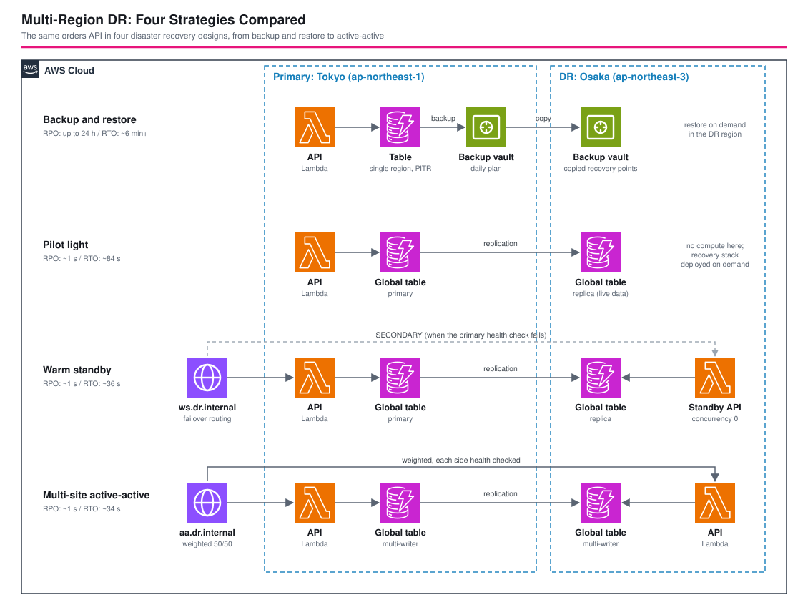

# マルチリージョン災害対策: 4つの方式を比較する - AWS CDK リファレンスアーキテクチャ

[](./README.ja.md)
[](./README.md)


AWS の災害対策4方式、**バックアップとリストア**、**パイロットライト**、**ウォームスタンバイ**、**マルチサイト active-active** を、同じ小さな注文 API を東京(プライマリ)と大阪(DR)に構築し、ドリルスクリプトで **実測** します。同じアプリケーション、同じデータで4つの設計を並べるので、復旧時間(RTO)、データ損失の範囲(RPO)、コストを、図ではなく同じスタックから読み取れます。

| 方式 | RPO | RTO(実測、ごく小さなデータ) | DR リージョンで平常時に動いているもの |
|---|---|---|---|
| バックアップとリストア | バックアップ間隔まで(ここでは24時間) | 約6分以上: リストア 256秒 + コンピュートのデプロイ 84秒(コピーが完了している場合) | バックアップ vault のみ |
| パイロットライト | 約1秒(0.2〜1.6秒) | 84秒: コンピュートのスタックをデプロイ | データ(グローバルテーブルのレプリカ) |
| ウォームスタンバイ | 約1秒 | 36秒: DNS フェイルオーバー 28秒 + スケールアップ | データと、ゼロにスケールした API |
| マルチサイト active-active | 約1秒 | 障害リージョンが DNS から外れるまで34秒。もう一方のリージョンはすでに稼働中 | データと、トラフィックを処理中の API |

## 📑 目次

- [アーキテクチャ概要](#️-アーキテクチャ概要)
- [設計判断とベストプラクティス](#-設計判断とベストプラクティス)
- [方式の選び方](#-方式の選び方)
- [Well-Architected との対応](#️-well-architected-との対応)
- [コスト最適化](#-コスト最適化)
- [セキュリティ上の考慮事項](#-セキュリティ上の考慮事項)
- [前提条件](#-前提条件)
- [デプロイ手順](#-デプロイ手順)
- [動作確認スクリプト](#-動作確認スクリプト)
- [テスト戦略](#-テスト戦略)
- [カスタマイズ](#️-カスタマイズ)
- [トラブルシューティング](#-トラブルシューティング)
- [クリーンアップ](#-クリーンアップ)
- [参考資料](#-参考資料)

## 🏗️ アーキテクチャ概要



### 主要コンポーネント

- **注文 API**: 方式とリージョンごとに1つの Lambda 関数(Node.js 24、ARM64)を関数 URL の背後に置きます。`POST /orders`、`GET /orders/{id}`、`GET /health`(`FAIL=true` の間は 503。ドリルがリージョンを「停止」させる方法です)。
- **バックアップとリストア**: シングルリージョンの DynamoDB テーブル(ポイントインタイムリカバリ有効)と、リカバリポイントを DR リージョンの vault に **コピー** する日次ルールを持つ AWS Backup プラン。DR リージョンにコンピュートはありません。
- **パイロットライト**: DR リージョンにレプリカを持つ DynamoDB **グローバルテーブル**。DR のコンピュートは別スタック(`DrRecoveryStack`)で、`-c includeRecoveryStack=true` のときだけ synth されます。復旧とはこのスタックをデプロイすることです。
- **ウォームスタンバイ**: グローバルテーブル、**予約済み同時実行数 0** で DR リージョンにデプロイした完全な API、Route 53 の **フェイルオーバー** レコード(PRIMARY にヘルスチェック、SECONDARY はスタンバイ)。
- **Active-active**: 両リージョンから書き込むグローバルテーブル、両方で稼働する API、各側にヘルスチェックを付けた **重み 50/50** の Route 53 レコード。
- **DNS とプローブ**: プライベートホストゾーン `dr.internal`、小さな VPC、その中で実際のクライアントと同じように名前解決する Lambda。
- **スタック**: `dr-secondary`(DR リージョン、最初にデプロイ)、`dr-primary`(プライマリリージョン、リージョン間参照で前者を利用)、`dr-recovery`(DR リージョン、必要なときだけ)。
- **`drill.sh`**: デプロイ済みのスタックに対して、各方式の RPO と RTO を測ります。

## 🎯 設計判断とベストプラクティス

### 1. 1つのアプリケーションに4つの DR 設計

方式の比較は、ワークロードを固定して初めて意味を持ちます。4つとも同じ API、同じテーブル構造なので、冒頭の表の差は DR の設計だけから生じます。

### 2. Lambda のウォームスタンバイは「デプロイ済みだがゼロにスケール」

ウォームスタンバイは、縮小したワークロードを動かしておく方式です。Lambda には縮小するものがないため、このスタックは **予約済み同時実行数を 0** にします。関数は存在し設定も済んでいますが、すべての呼び出しはスロットリングされます(関数 URL は HTTP 429 を返します)。復旧は `delete-function-concurrency` で、数秒で反映されます。ECS サービスを0から増やす、最小サイズの Auto Scaling グループを増やす、という操作と同じ形です。

### 3. パイロットライトが復旧するのはデータではなくコンピュート

パイロットライトは、データを常に最新に保ち(レプリカへ継続的に書き込まれます)、それ以外は何も動かしません。ドリルでは、コンピュートが存在する前から複製された注文が DR のテーブルにあり、復旧は コンピュートのスタックの `cdk deploy` です。コマンドからリクエストが処理されるまで **84秒** でした。この速さの代償はレプリカとして毎日払い、コンピュートの費用は災害の後にだけ払います。

### 4. グローバルテーブルの複製遅延は約1秒、競合は最後の書き込みが勝つ

DynamoDB グローバルテーブルは、ドリルの書き込みをすべて 0.2〜1.6 秒で他のリージョンに複製しました(プライマリでの書き込み完了から測定。項目を確認する CLI 呼び出しの時間を含みます)。これがグローバルテーブルを使う3方式の RPO です。同じ項目を2つのリージョンから同時に書くと最後の書き込みが勝つため、active-active では書き込みが競合しないキー設計や所有権のルールが必要です。

### 5. バックアップとリストア: 遅いのはバックアップではなくコピー

ごく小さなテーブルで、オンデマンドバックアップは197秒、リージョン間コピーはバックアップ開始から938秒後に完了し(コピーに約12分)、DR リージョンでのリストアは256秒でした。コピーが完了するまで復旧を始められないため、実効的な RPO は「バックアップ間隔 + コピー時間」で、RTO はテーブルが大きくなるほど伸びます。

### 6. DNS フェイルオーバーには下限がある: 検出 + TTL

ウォームスタンバイと active-active は、どちらも Route 53 のヘルスチェック(間隔10秒、2回失敗)と TTL 10秒に依存します。実測した DNS の切り替えは、フェイルオーバーで28秒、重み付きレコードから障害リージョンが外れるまでに34秒でした。この間、古い応答を持つクライアントや、active-active では新しい名前解決の約半分が、障害リージョンに到達します。

### 7. ドリルが扱っていないもの

フェイルバック(プライマリに戻して再同期すること)、実際のリージョン障害(ドリルはヘルスエンドポイントで障害を再現します)、DNS 名を使わないクライアントのフェイルオーバーです。実際の運用手順書には3つとも必要です。

### 8. 環境別パラメータ

`parameters/<env>-params.ts` で、リージョン、TTL、ヘルスチェックの間隔としきい値、ウォームスタンバイの同時実行数、バックアップのスケジュールと保持期間を設定します。

## 🧭 方式の選び方

| 問い | 目安 |
|---|---|
| 1日分のデータ損失と数時間の待ちを許容できるか | バックアップとリストア。最も安価で、他のすべての方式の土台です。 |
| 数分の停止は許容できるが、データ損失は許容できないか | パイロットライト。 |
| 約1分で自動復旧する必要があるか | ウォームスタンバイ。フェイルオーバーは DNS とスケールアップです。 |
| 両リージョンが常時稼働する必要があるか、障害を見せたくないか | Active-active。書き込みが競合しない設計が前提です。 |

ゼロにスケールしないコンピュート(ECS、EC2)では、ウォームスタンバイの平常時のコストは、動かし続けるスタンバイの容量です。これがウォームスタンバイとパイロットライトの主な料金差になります。

## 🏛️ Well-Architected との対応

| 柱 | この構成での対応 |
|---|---|
| 運用上の優秀性 | `drill.sh` が各方式を実測値にする、4方式とも CloudFormation 管理 |
| セキュリティ | 関数ごとに1つのテーブルへの最小権限、KMS で暗号化したバックアップ vault、分離サブネットの名前解決プローブ |
| 信頼性 | 日次バックアップから active-active までの4つの復旧設計、ヘルスチェック付き DNS、全テーブルでポイントインタイムリカバリ |
| パフォーマンス効率 | ARM64 の関数、active-active ではレプリカテーブルからローカルに読む |
| コスト最適化 | 各設計のコストを明示(下記)、平常時のコストは温めておく範囲に比例する |
| 持続可能性 | サーバーレスのコンピュート、スタンバイ容量は必要になるまでゼロ |

## 💰 コスト最適化

デモを起動し続けた場合の月額の目安です(利用量は含みません。料金ページで確認してください)。

| 項目 | 目安 |
|---|---|
| Route 53 ヘルスチェック(3つ、HTTPS、高速間隔) | 約7〜9 USD(ウォームスタンバイ1つ、active-active 2つ) |
| プライベートホストゾーン | 0.50 USD |
| 2つのバックアップ vault 用 KMS キー | 2 USD |
| DynamoDB(オンデマンド、ほぼ空のテーブル)と複製書き込み | 数セント |
| Lambda、ログ、AWS Backup のストレージとコピー | 数セント |

平常時のコストの順位は、バックアップとリストア < パイロットライト < ウォームスタンバイ < active-active です。デモの金額が小さいのは、Lambda と DynamoDB オンデマンドに平常時の確保容量がないためです。コンテナやインスタンスのコンピュートでは、同じ順位でスタンバイ容量が支配的になります。

## 🔒 セキュリティ上の考慮事項

### 実装済み

- 各関数は、自分のテーブルへの `PutItem` と `GetItem` だけを実行できます。
- バックアップ vault は専用の KMS キー(ローテーション有効)で暗号化し、リカバリポイントはアカウント内でコピーします。
- 名前解決プローブはインターネットに出られない分離サブネットで動きます。
- Route 53 のヘルスチェッカーはリクエストに署名できないため、関数 URL は公開です。固定のデモ API だけを返します。

### CDK Nag の抑制(理由付き)

| ルール | 理由 |
|---|---|
| AwsSolutions-IAM4 / IAM5 | Lambda と AWS Backup 向けの AWS 推奨マネージドポリシーと、その中の AWS 定義のワイルドカード |
| AwsSolutions-VPC7 | VPC はプライベートホストゾーンの関連付けのためだけにあり、記録すべき通信がない |
| AwsSolutions-L1 | ランタイムは作成時点でサポートされる最新の Node.js |
| AwsSolutions-DDB3 | 全テーブルでポイントインタイムリカバリは有効。ルールが `TableV2` の形式を認識しない |

### スコープ外(環境ごとに追加)

クロスアカウントのバックアップコピーと Vault Lock(`aws-backup-cross-region` を参照)、API の Authorizer、ヘルスチェックのアラームと運用手順書。

## 📋 前提条件

- Node.js 24 以上、AWS CDK v2
- **両方のリージョンで CDK ブートストラップ済み**(DR リージョンも)。`npm run bootstrap -w workspaces/multi-region-dr-strategies` は、アプリが使うすべてのリージョンをブートストラップします
- `drill.sh` 用の `aws`、`curl`、`jq`

## 🚀 デプロイ手順

```bash
export PROJECT=<project> ENV=dev
npm install
npm run bootstrap -w workspaces/multi-region-dr-strategies          # 両リージョン、初回のみ
npm run stage:deploy:all -w workspaces/multi-region-dr-strategies   # 約7分
```

## 🧪 動作確認スクリプト

```bash
./drill.sh --project <project> --env <env>                 # すべてのドリル
./drill.sh --project <project> --env <env> --only warm-standby
```

| ドリル | 内容 |
|---|---|
| `rpo` | プライマリに書き込み、DR のレプリカをポーリング。グローバルテーブルの方式ごとに3回 |
| `warm-standby` | プライマリのヘルスエンドポイントを停止し、DNS フェイルオーバーの時間を測り、スタンバイをスケールアップして、複製された注文が初めて読めるまでを測る |
| `active-active` | 両リージョンが応答に現れることを確認し、一方を停止して、すべての応答がもう一方を指すまでを測る |
| `pilot-light` | DR リージョンに復旧用スタックをデプロイし、複製された注文が返るまでを測って、再び削除する |
| `backup-restore` | オンデマンドバックアップを取り、DR の vault にコピーし、新しいテーブルにリストアして注文を確認し、テーブルを削除する |
| `cleanup` | 両方の vault のリカバリポイントを削除する(destroy の前に必要) |

2026-10-04 に `ap-northeast-1`(プライマリ)と `ap-northeast-3`(DR)で検証しました。すべてのドリルが成功し、冒頭の表の値が得られました。スクリプトは終了時に、ヘルスエンドポイントとスタンバイの同時実行数を元に戻します。

## 🧪 テスト戦略

```bash
npm test -w workspaces/multi-region-dr-strategies
```

- **スナップショット**: 復旧用スタックを含む全スタックのテンプレートと、スタックごとのリソース数。
- **ユニット**: スタックのリージョン、テーブルの種類、バックアップルールとコピーアクション、DR vault、スタンバイの同時実行数、フェイルオーバーと重み付きのレコード、平常時にパイロットライトのコンピュートがないこと、復旧用スタックの配置、最小権限のポリシー。
- **コンプライアンス**: 3つのスタックすべてに CDK Nag `AwsSolutionsChecks`。

## ⚙️ カスタマイズ

| パラメータ | 意味 |
|---|---|
| `primaryRegion`、`drRegion` | リージョンの組 |
| `recordTtl`、`healthCheckIntervalSeconds`、`healthCheckFailureThreshold` | DNS の切り替え時間と、料金や誤検知とのトレードオフ |
| `warmStandbyConcurrency` | 0 = ゼロにスケール。正の値なら、その分の容量が応答する |
| `backupScheduleCron`、`backupRetentionDays` | バックアップの RPO とストレージのコスト |

## 🔧 トラブルシューティング

### DR リージョンの `cdk deploy` がブートストラップスタックがないというエラーで失敗する

DR リージョンがブートストラップされていません。このワークスペースの `npm run bootstrap` を実行してください。両方のリージョンをブートストラップします。

### バックアップ vault の削除で destroy が失敗する

リカバリポイントがある vault は削除できません。先に `./drill.sh ... --only cleanup` を実行してください。

### スタンバイが `429` を返す

予約済み同時実行数 0 の意図した動作です。`aws lambda delete-function-concurrency --function-name <project>-<env>-dr-ws --region <dr-region>` でスケールアップしてください。

### バックアップのドリルが約20分かかる

遅いのはリージョン間コピーです(ごく小さなテーブルで約12分)。スクリプトがポーリングするので、そのまま待ってください。

## 🧹 クリーンアップ

```bash
./drill.sh --project <project> --env <env> --only cleanup
npm run stage:destroy:all -w workspaces/multi-region-dr-strategies
```

## 📚 参考資料

- [Disaster recovery options in the cloud (AWS Well-Architected Reliability Pillar)](https://docs.aws.amazon.com/whitepapers/latest/disaster-recovery-workloads-on-aws/disaster-recovery-options-in-the-cloud.html)
- [DynamoDB global tables](https://docs.aws.amazon.com/amazondynamodb/latest/developerguide/GlobalTables.html)
- [Creating backup copies across AWS Regions](https://docs.aws.amazon.com/aws-backup/latest/devguide/cross-region-backup.html)
- [Configuring DNS failover](https://docs.aws.amazon.com/Route53/latest/DeveloperGuide/dns-failover-configuring.html)
- [Configuring reserved concurrency for a function](https://docs.aws.amazon.com/lambda/latest/dg/configuration-concurrency.html)
