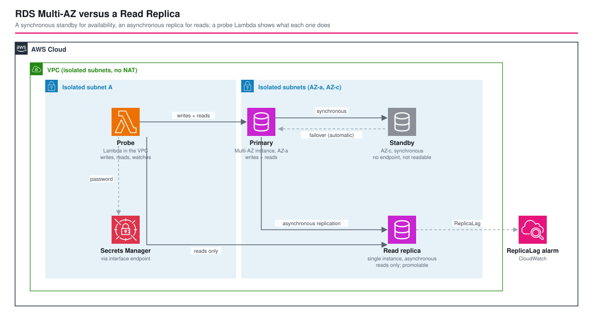

# RDS Multi-AZ versus a Read Replica - AWS CDK Reference Architecture

[](./README.ja.md)
[](./README.md)


The two things people confuse most about Amazon RDS, side by side on one database: a **Multi-AZ** primary, whose synchronous standby exists for **availability** and cannot be read, and a **read replica**, which is asynchronous, can be read, is not part of the failover and can be **promoted** into a database of its own. A probe Lambda inside the VPC talks to both and a check script shows the differences instead of asserting them: what each endpoint accepts, how far behind the replica is, what a failover does to each, and what promotion really means. It completes the Multi-AZ comparison of [`fis-arch-i-rds-multiaz`](../fis-arch-i-rds-multiaz/) (instance versus cluster).

| | Multi-AZ standby | Read replica |
|---|---|---|
| Purpose | Availability: automatic failover | Read scaling, and a manual disaster recovery option |
| Replication | Synchronous | Asynchronous |
| Readable | No (it has no endpoint) | Yes |
| Takes over on failure | Yes, automatically | No: it must be promoted by hand |
| After promotion | n/a | A separate database; it no longer follows the source |

## 📑 Table of Contents

- [Architecture Overview](#️-architecture-overview)
- [Design Decisions & Best Practices](#-design-decisions--best-practices)
- [Well-Architected Alignment](#️-well-architected-alignment)
- [Cost Optimization](#-cost-optimization)
- [Security Considerations](#-security-considerations)
- [Prerequisites](#-prerequisites)
- [Deployment Guide](#-deployment-guide)
- [Operational Check Script](#-operational-check-script)
- [Testing Strategy](#-testing-strategy)
- [Customization](#️-customization)
- [Troubleshooting](#-troubleshooting)
- [Clean-up](#-clean-up)
- [References](#-references)

## 🏗️ Architecture Overview



### Key Components

- **VPC** — two Availability Zones, isolated subnets only, no NAT gateway. The probe reaches Secrets Manager through an interface endpoint.
- **Primary** — an RDS for PostgreSQL 17 Multi-AZ DB instance (`db.t4g.micro`), encrypted, with automated backups (a read replica requires them).
- **Read replica** — a single-instance read replica of the primary, encrypted, in the same subnets. It is for reads, so it is not Multi-AZ.
- **Probe Lambda** (Node.js 24, ARM64, in the VPC) — actions `info`, `write`, `lag`, `watch`, `diverge` and `heartbeat`. The security groups let only the probe reach the databases.
- **Heartbeat rule** — one small write a minute (see design decision 5).
- **ReplicaLag alarm** — CloudWatch alarm on the replica's `ReplicaLag`.
- **`test-comparison.sh`** — runs the comparison, then a Multi-AZ failover, then the promotion.

## 🎯 Design Decisions & Best Practices

### 1. A Multi-AZ standby is not a replica you can use

The standby of a Multi-AZ instance is invisible: there is no endpoint, no connection, nothing to read. It holds a synchronous copy so that a failure costs you seconds and no data. If you need to read from a second copy, that is a read replica. Many designs that say "Multi-AZ for performance" want a replica.

### 2. A replica is asynchronous, which is fast but not zero

The probe writes a marker to the primary and times how long it takes to be readable on the replica. Over 30 writes: median 7 ms, p95 20 ms, maximum 21 ms (an earlier run had a 385 ms maximum). That is a healthy, idle replica; under write load or across Regions the number grows, and a replica can never promise "read your own write". Anything that must read what it just wrote reads from the primary.

### 3. A replica refuses writes

Writing to the replica fails with `cannot execute CREATE TABLE in a read-only transaction` (`pg_is_in_recovery()` is `true` on it and `false` on the primary). Point read-only traffic at the replica endpoint and everything else at the primary.

### 4. What a failover does to each

With a forced failover of the primary (`reboot-db-instance --force-failover`) and a connection opened every second to both endpoints:

| Endpoint | During the failover |
|---|---|
| Primary | Unreachable for 13 s in one window, then back; the instance moved from `ap-northeast-1a` to `ap-northeast-1c` (the standby took over) |
| Replica | Not affected: 330 of 330 probes succeeded |

After the failover the replica reconnected to the new primary on its own: 20 of 20 new writes became visible on it, median 5 ms. The replica is not part of the failover, but it survives one. Reading from the replica keeps working while writes recover.

### 5. `ReplicaLag` needs writes, or it lies

On PostgreSQL the `ReplicaLag` metric is the time since the last replayed transaction. On an **idle** primary it grows by 60 s every minute (the first run saw 91, 151, 211, 271 seconds, then 16 when a write arrived) even though nothing is behind. The stack therefore writes one heartbeat row a minute. That caps the metric between 0 and about 60 s (observed 21 to 51 s) even though the marker lag above is milliseconds. Two consequences: an alarm threshold below the heartbeat interval fires on a healthy replica, so the default is 120 s; and for a tighter alarm the heartbeat must be written more often than the threshold.

### 6. Promotion is a one-way door

Promoting the replica makes it a normal, writable database. A write to the primary 15 seconds after promotion did not reach it, and the instance no longer reports a source. Promotion is a disaster recovery or migration tool: you lose the data written to the primary after the last replicated transaction, you must repoint applications yourself, and the replica relationship is gone for good (you create a new replica to get one back). A Multi-AZ failover needs none of that.

### 7. Use both, for different reasons

| Need | Use |
|---|---|
| Survive an instance or AZ failure with no data loss and no action | Multi-AZ |
| Offload reads (reports, search, dashboards) | Read replica |
| Both | A Multi-AZ primary with one or more replicas, as here |
| Recover from a Region loss | A cross-Region replica you promote, or backups copied to another Region |
| Faster failover and readable standbys | A Multi-AZ DB cluster (see `fis-arch-i-rds-multiaz`) or Aurora |

### 8. A replica is a single instance on purpose

A Multi-AZ replica is possible, but this one is for reads. Its own availability is the primary's job; if the replica fails, reads go back to the primary or a new replica is created.

### 9. Environment-specific parameters

`parameters/<env>-params.ts` sets the VPC, the instance class, the allocated storage and the ReplicaLag alarm threshold.

## 🏛️ Well-Architected Alignment

| Pillar | How this architecture addresses it |
|---|---|
| Operational Excellence | `test-comparison.sh` measures behaviour instead of asserting it; a lag alarm; CloudFormation-managed |
| Security | Isolated subnets, security groups that admit the probe only, encrypted instances and secret, no public access |
| Reliability | A Multi-AZ primary for automatic failover; a replica that survives the failover and resumes replication |
| Performance Efficiency | Reads can be moved to the replica; measured replication delay in milliseconds |
| Cost Optimization | A replica costs one instance; Multi-AZ costs a second one; no NAT gateway (see below) |
| Sustainability | Smallest instance class, no idle NAT gateway |

## 💰 Cost Optimization

Approximate costs in `ap-northeast-1` (verify against the pricing pages):

| Item | Approx. |
|---|---|
| Multi-AZ primary (`db.t4g.micro`) | about twice a single instance per hour, plus storage |
| Read replica (`db.t4g.micro`) | about one single instance per hour, plus storage |
| Secrets Manager interface endpoint (2 AZ) | about 0.03 USD per hour |
| Heartbeat Lambda | 1,440 short invocations a day: cents per month |

Roughly 0.1 USD per hour for the databases. A full verification (deployment takes about 27 minutes, the check about 25) cost well under 1 USD; destroy the stack afterwards. A replica costs the same as the instance it copies, whether or not anyone reads from it.

## 🔒 Security Considerations

### Implemented

- Databases in isolated subnets with no internet route and `publiclyAccessible: false`.
- The database security group admits PostgreSQL from the probe's security group only; the probe may reach only the databases and the Secrets Manager endpoint.
- Storage encryption on both instances; the master password is a generated secret.
- Deletion protection and snapshots outside development.

### CDK Nag suppressions (with reasons)

| Rule | Reason |
|---|---|
| AwsSolutions-IAM4 / IAM5 | Lambda VPC access policies are AWS-managed and have no resource-level scope |
| AwsSolutions-RDS2 / RDS3 | Encryption is on; the replica is single-AZ by design |
| AwsSolutions-RDS6 | The probe uses the generated secret instead of IAM database authentication, to keep the reference small |
| AwsSolutions-RDS10 | Deletion protection is on outside development |
| AwsSolutions-RDS11 | The default port is kept in a network only the probe can reach |
| AwsSolutions-SMG4 | A short-lived comparison; rotation is shown in `secrets-rotation-aurora` |
| AwsSolutions-L1, VPC7, CdkNagValidationFailure | Latest Node.js at authoring time; no internet path to log; an intrinsic CIDR the rule cannot evaluate |

### Out of scope (add per environment)

A cross-Region replica, a replica with its own parameter group and Performance Insights, RDS Proxy, IAM database authentication and certificate verification in the client (the probe deliberately skips it).

## 📋 Prerequisites

- Node.js 24+, AWS CDK v2, an AWS account with CDK bootstrapped
- `aws` and `jq` for `test-comparison.sh`

## 🚀 Deployment Guide

```bash
export PROJECT=<project> ENV=dev
npm install
npm run stage:deploy:all -w workspaces/rds-multiaz-vs-read-replica   # about 27 minutes: a Multi-AZ instance, then the replica
./workspaces/rds-multiaz-vs-read-replica/test-comparison.sh --project $PROJECT --env $ENV   # about 25 minutes
```

## 🧪 Operational Check Script

`./test-comparison.sh --project <project> --env <env> [--no-promote]`:

1. the primary is Multi-AZ with a standby in a second AZ; the replica is a single-AZ read replica of the primary
2. `pg_is_in_recovery()` is false on the primary and true on the replica
3. the primary accepts a write and the replica refuses it
4. 30 markers written to the primary all appear on the replica; median, p95 and maximum are reported
5. the CloudWatch `ReplicaLag` stays bounded with the heartbeat running and the alarm is not in `ALARM`
6. a forced failover of the primary while connections are opened every second to both endpoints: the primary's outage window, the AZ change, the replica's availability, and replication resuming
7. promotion of the replica: no source any more, writable, and a later write to the primary does not reach it

Verified on 2026-10-10 in `ap-northeast-1`: all checks passed. The promotion cannot be undone, so use `--no-promote` to keep the replica, and destroy the stack afterwards.

## 🧪 Testing Strategy

```bash
npm test -w workspaces/rds-multiaz-vs-read-replica
```

- **Snapshot**: the full template and resource counts.
- **Unit**: a Multi-AZ primary with backups, a single-AZ encrypted read replica with no credentials of its own, the instance class and no public access, removal and deletion protection per environment, isolated subnets only, the Secrets Manager endpoint, PostgreSQL admitted from the probe only, the probe's environment, the heartbeat and the alarm threshold.
- **Compliance**: CDK Nag `AwsSolutionsChecks` with the reasons above.

## ⚙️ Customization

| Parameter | Meaning |
|---|---|
| `vpcConfig` | The VPC (two AZs, isolated subnets, Secrets Manager endpoint) |
| `dbInstanceClass`, `allocatedStorage` | Size of the primary and the replica |
| `replicaLagAlarmSeconds` | Alarm threshold; keep it well above the heartbeat interval |

To explore other cases, change `multiAz` on the replica, add a second replica, or create the replica in another Region.

## 🔧 Troubleshooting

### `ReplicaLag` climbs by 60 seconds every minute

The primary is idle. PostgreSQL has nothing to replay, so the metric measures time since the last transaction. Write regularly (the stack's heartbeat) or judge lag with a marker write, not with this metric alone.

### The ReplicaLag alarm fires on a healthy replica

The threshold is at or below the heartbeat interval. Raise it above 60 s or write the heartbeat more often.

### The replica cannot be created

The source needs automated backups (`backupRetention` of at least one day) and, for PostgreSQL, the same major engine version.

### Writes to the replica fail

That is correct: a read replica is read-only. Send writes to the primary endpoint.

### Stack deletion fails after a promotion

A promoted replica is an ordinary instance, so the stack can still delete it. If deletion protection is on (production), turn it off first.

## 🧹 Clean-up

```bash
npm run stage:destroy:all -w workspaces/rds-multiaz-vs-read-replica
```

## 📚 References

- [Multi-AZ DB instance deployments for Amazon RDS](https://docs.aws.amazon.com/AmazonRDS/latest/UserGuide/Concepts.MultiAZSingleStandby.html)
- [Working with DB instance read replicas](https://docs.aws.amazon.com/AmazonRDS/latest/UserGuide/USER_ReadRepl.html)
- [Promoting a read replica to be a standalone DB instance](https://docs.aws.amazon.com/AmazonRDS/latest/UserGuide/USER_ReadRepl.Promote.html)
- [Monitoring read replication](https://docs.aws.amazon.com/AmazonRDS/latest/UserGuide/USER_ReadRepl.Monitoring.html)
- [Failover process for Amazon RDS](https://docs.aws.amazon.com/AmazonRDS/latest/UserGuide/Concepts.MultiAZ.Failover.html)
