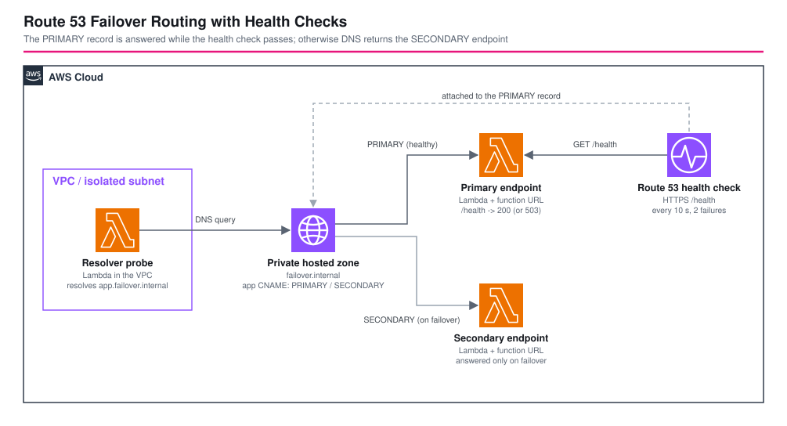

# Route 53 Failover Routing with Health Checks - AWS CDK Reference Architecture

[](./README.ja.md)
[](./README.md)


The basic shape of DNS failover on **Amazon Route 53**: a **PRIMARY** record that is answered while a **health check** passes, and a **SECONDARY** record that takes over when it fails. Two Lambda function URLs play the endpoints, so the pattern runs without a domain name or a load balancer. A check script breaks the primary, measures how long DNS takes to switch, and measures the way back.

## 📑 Table of Contents

- [Architecture Overview](#️-architecture-overview)
- [Design Decisions & Best Practices](#-design-decisions--best-practices)
- [Well-Architected Alignment](#️-well-architected-alignment)
- [Cost Optimization](#-cost-optimization)
- [Security Considerations](#-security-considerations)
- [Prerequisites](#-prerequisites)
- [Deployment Guide](#-deployment-guide)
- [Operational Check Script](#-operational-check-script)
- [Testing Strategy](#-testing-strategy)
- [Customization](#️-customization)
- [Troubleshooting](#-troubleshooting)
- [Clean-up](#-clean-up)
- [References](#-references)

## 🏗️ Architecture Overview



### Key Components

- **Two endpoints** — Lambda functions (Node.js 24, ARM64) with function URLs. `ROLE` names the endpoint; `/health` returns 200, or 503 while `FAIL=true`. The check script flips `FAIL` on the primary to simulate an outage without touching the stack.
- **Route 53 health check** — HTTPS on port 443, path `/health`, SNI on, every 10 seconds, unhealthy after 2 consecutive failures.
- **Private hosted zone `failover.internal`** — associated with a small VPC that has no NAT gateway or other billable resources.
- **Failover records** — `app.failover.internal` CNAME, TTL 10 s: `PRIMARY` (with the health check) and `SECONDARY` (no health check, answered only when the primary is unhealthy).
- **Resolver probe** — a Lambda in the VPC that resolves the record through the VPC resolver, the same path a real client takes.
- **`test-failover.sh`** — breaks the primary, waits for DNS to switch, restores it, and waits for DNS to switch back.

## 🎯 Design Decisions & Best Practices

### 1. Failover is a DNS answer, not a connection redirect

Route 53 changes which value it **returns**. Clients that already hold the old answer keep it until the TTL expires, and some resolvers and applications cache longer than the TTL. Total switch time is roughly: health check detection + record TTL + client caching.

| Component | This stack | Effect |
|---|---|---|
| Check interval | 10 s (fast) | detection speed |
| Failure threshold | 2 | detection speed vs false positives |
| Record TTL | 10 s | how long clients keep the old answer |

Measured switch time: see [Operational Check Script](#-operational-check-script).

### 2. Attach the health check to the PRIMARY record only

With a health check on the PRIMARY record, Route 53 answers SECONDARY when it is unhealthy. A health check on the SECONDARY as well helps when both could fail: with both unhealthy Route 53 returns the PRIMARY (fail open) rather than nothing.

### 3. Private hosted zone and `test-dns-answer`

`aws route53 test-dns-answer` rejects private hosted zones (`Cannot send DNS query to a Private Hosted Zone`). The resolver probe inside the VPC replaces it and tests the real resolution path. A public hosted zone would allow `test-dns-answer` but needs a domain you control for real clients.

### 4. The health check must reach a public endpoint

Route 53 health checkers run outside your VPC, so they need a publicly reachable endpoint. For a private endpoint, use a CloudWatch-alarm health check instead (the alarm watches a metric the endpoint publishes).

### 5. Function URLs are for the demo

The endpoints are public function URLs with `AuthType: NONE` because Route 53 cannot sign requests, and they serve a fixed JSON document. In production the endpoints are typically a load balancer, CloudFront or API Gateway.

### 6. Environment-specific parameters

`parameters/<env>-params.ts` sets the zone and record names, TTL, check interval (10 or 30 s) and failure threshold.

## 🏛️ Well-Architected Alignment

| Pillar | How this architecture addresses it |
|---|---|
| Operational Excellence | `test-failover.sh` measures failover and failback, function logs, CloudFormation-managed |
| Security | Endpoints serve a fixed document only; resolver probe runs in an isolated subnet; default security group restricted |
| Reliability | Health-checked primary and secondary, short TTL, automatic failback |
| Performance Efficiency | ARM64 functions, no load balancer or NAT in the path |
| Cost Optimization | Pay-per-use Lambda, no NAT, one health check (see below) |
| Sustainability | Serverless endpoints scale to zero |

## 💰 Cost Optimization

Approximate monthly cost if left running (verify against the Route 53 pricing page):

| Item | Approx. |
|---|---|
| Hosted zone (private) | 0.50 USD |
| Health check (HTTPS, fast interval) | about 2 to 3 USD |
| Lambda, logs | near zero for testing |

A verification run costs a few cents.

## 🔒 Security Considerations

### Implemented

- The public endpoints return a fixed JSON document and nothing else; `FAIL` and `ROLE` are environment variables, not request input.
- The resolver probe has no internet access (isolated subnet, no NAT).
- VPC default security group restricted; one-week log retention.

### CDK Nag suppressions (with reasons)

| Rule | Reason |
|---|---|
| AwsSolutions-IAM4 | AWSLambdaBasicExecutionRole and the VPC execution policy are the AWS-recommended policies for Lambda |
| AwsSolutions-VPC7 | The VPC only associates the private hosted zone and has no traffic to log |
| AwsSolutions-L1 | Runtime is the latest supported Node.js version at authoring time |

### Out of scope (add per environment)

Real endpoints behind a load balancer, CloudFront or API Gateway; alarms and notifications on health check status; a health check on the SECONDARY.

## 📋 Prerequisites

- Node.js 24+, AWS CDK v2, an AWS account with CDK bootstrapped
- `aws`, `curl`, `jq` for `test-failover.sh`

## 🚀 Deployment Guide

```bash
export PROJECT=<project> ENV=dev
npm install
npm run stage:deploy:all -w workspaces/route53-failover-health-check   # about 3-4 minutes
```

## 🧪 Operational Check Script

`./test-failover.sh --project <project> --env <env>` reads the stack outputs and:

1. waits until the record resolves (inside the VPC) to the primary
2. checks the primary answers `role=primary`
3. sets `FAIL=true` on the primary and checks `/health` returns 503
4. measures how long until the record resolves to the secondary, then checks the secondary answers `role=secondary`
5. restores the primary and measures how long until the record resolves to the primary again

Verified on 2026-10-03 in `ap-northeast-1` (interval 10 s, threshold 2, TTL 10 s): failover in **29 s**, failback in **18 s**. The script restores `FAIL=false` on exit.

## 🧪 Testing Strategy

```bash
npm test -w workspaces/route53-failover-health-check
```

- **Snapshot**: full template and resource counts.
- **Unit**: endpoints and function URLs, health check settings, PRIMARY/SECONDARY records, private hosted zone, resolver probe in the VPC, no NAT gateway.
- **Compliance**: CDK Nag `AwsSolutionsChecks` with the reasons above.

## ⚙️ Customization

| Parameter | Meaning |
|---|---|
| `zoneName`, `recordName` | Private zone and record name |
| `recordTtl` | Seconds clients may cache the answer |
| `healthCheckIntervalSeconds` | 10 (fast, costs more) or 30 |
| `healthCheckFailureThreshold` | Consecutive failures before failing over |

## 🔧 Troubleshooting

### `Cannot send DNS query to a Private Hosted Zone`

`test-dns-answer` does not support private zones. Resolve from inside the VPC (the resolver probe) instead.

### Failover takes longer than expected

Add the pieces: up to `interval × threshold` for detection, plus the TTL, plus client or resolver caching beyond the TTL.

### The primary record keeps being answered while the endpoint is down

The health check is not attached to the PRIMARY record, or the health check cannot reach the endpoint from the public internet at all (then it is unhealthy from the start). Check `aws route53 get-health-check-status`.

## 🧹 Clean-up

```bash
npm run stage:destroy:all -w workspaces/route53-failover-health-check
```

## 📚 References

- [Configuring DNS failover](https://docs.aws.amazon.com/Route53/latest/DeveloperGuide/dns-failover-configuring.html)
- [How Amazon Route 53 determines whether a health check is healthy](https://docs.aws.amazon.com/Route53/latest/DeveloperGuide/dns-failover-determining-health-of-endpoints.html)
- [Working with private hosted zones](https://docs.aws.amazon.com/Route53/latest/DeveloperGuide/hosted-zones-private.html)
