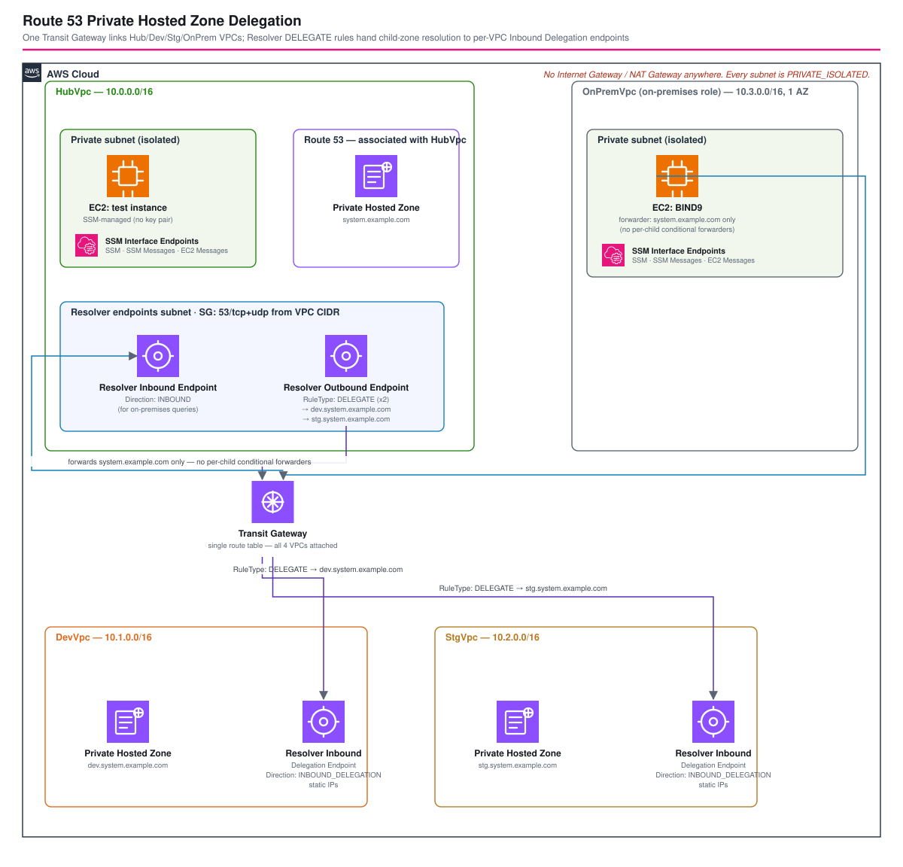
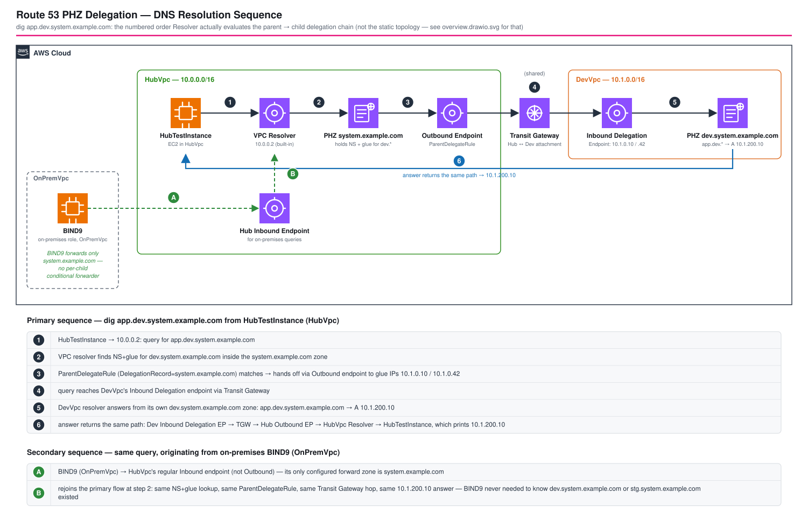

# Route 53 プライベートホストゾーン委任 - AWS CDK リファレンスアーキテクチャ

[](./README.ja.md)
[](./README.md)

> **レベル: 300（上級）**

親プライベートホストゾーン（`system.example.com`）が、2つのサブドメイン（`dev.system.example.com`、
`stg.system.example.com`）を別々のVPCへ委任する構成です。2025年6月に追加された **Route 53 Resolver DNS委任**
機能を使い、子VPC側の `INBOUND_DELEGATION` エンドポイントと、親側アウトバウンドエンドポイント上の
`DELEGATE` Resolverルール1本を、親ゾーン内の通常のNS＋グルーレコードで結び付けます。4つ目のオンプレミス相当VPC
は親ドメインのみをハブへ転送し（子ドメインごとのコンディショナルフォワーダーは不要）、4つのVPCすべてを
1つのTransit Gatewayで接続します。

## 📑 目次

- [アーキテクチャ概要](#アーキテクチャ概要)
- [設計判断とベストプラクティス](#設計判断とベストプラクティス)
- [コスト最適化](#コスト最適化)
- [セキュリティ考慮事項](#セキュリティ考慮事項)
- [前提条件](#前提条件)
- [デプロイガイド](#デプロイガイド)
- [テスト戦略](#テスト戦略)
- [カスタマイズ](#カスタマイズ)
- [トラブルシューティング](#トラブルシューティング)
- [参考資料](#参考資料)

## 🏗️ アーキテクチャ概要



```text
HubVpc 10.0.0.0/16
├─ Private（テストEC2、SSMエンドポイント）
├─ Resolver /27 x2 AZ
│   ├─ インバウンド ← オンプレミスからのクエリを受信
│   └─ アウトバウンド → DELEGATEルール（DelegationRecord=system.example.com）
├─ Tgw /28 x2 AZ
└─ PHZ system.example.com
      NS dev.system.* → ns-dev-{1,2}.system.*（グルー: DevVpc委任エンドポイントIP）
      NS stg.system.* → ns-stg-{1,2}.system.*（グルー: StgVpc委任エンドポイントIP）

      │
      ▼ Transit Gatewayが4つのVPCを1つの共有ルートテーブルに接続
      │

DevVpc 10.1.0.0/16
├─ Resolver /27 x2 AZ、Inbound-Delegationエンドポイント
├─ Tgw /28 x2 AZ
└─ PHZ dev.system.example.com
      （StgVpc 10.2.0.0/16も同じ構成: 独自のInbound-Delegationエンドポイント、
        Tgwサブネット、PHZ stg.system.example.comを持つ）

OnPremVpc 10.3.0.0/16 （「オンプレミス役」）
├─ Private（BIND9フォワーダー: system.example.com → HubVpcインバウンドエンドポイントIP）
└─ Tgw /28

インターネットゲートウェイ/NAT Gatewayはどこにもなし。全サブネットがPRIVATE_ISOLATED。
```

### DNS解決の順序

上記の図は静的なトポロジーを示すもので、クエリが実際に**どの順序**で解決されるかは分かりにくい。[`resolution-sequence.drawio.svg`](resolution-sequence.drawio.svg) はその順序をステップごとに示す。委任経路（HubTestInstance → HubVpcのリゾルバ → NS/グルーレコード参照 → `ParentDelegateRule` → Transit Gateway → DevVpcの委任エンドポイント）と、オンプレミスBIND9経路（HubVpcの通常インバウンドエンドポイントで同じ流れに合流する）の両方をカバーする。



### 主要コンポーネント

| コンポーネント | 役割 |
|-----------|------|
| **`ResolverEndpointConstruct`** (`@common/constructs/route53/resolver-endpoint`) | [`route53-resolver-endpoints`](../route53-resolver-endpoints/) と共有。ここではHubVpcの通常インバウンド/アウトバウンドエンドポイントと、DevVpc/StgVpcの `INBOUND_DELEGATION` エンドポイント（Do53のみ、静的IP）を作成。 |
| **`TransitGatewayConstruct`** (`@common/constructs/vpc/transit-gateway`) | 4つのVPCすべてを、1つの共有TGWルートテーブルに接続（[`transit-gateway`](../transit-gateway/) ワークスペースと同パターン）。 |
| **`VpcConstruct`** (`@common/constructs/vpc/vpc`) | 各VPCのサブネットグループを構築: `Private`（ワークロード+SSMエンドポイント、Hub/OnPremのみ）、`Resolver`（Hub/Dev/Stgのみ）、`Tgw`（4VPCすべて）。全サブネットが `PRIVATE_ISOLATED` で、インターネットゲートウェイもNAT Gatewayもなし。 |
| **SSM VPCインターフェースエンドポイント**（`SSM` / `SSM Messages` / `EC2 Messages`） | HubVpcに1セット、OnPremVpcに1セット。EC2インスタンスを持つのはこの2つのVPCのみ。インターネット経路が一切なくてもSession Managerで到達できる。 |
| **プライベートホストゾーン** | HubVpcの `system.example.com`、DevVpcの `dev.system.example.com`、StgVpcの `stg.system.example.com`。それぞれ自分のVPCのみに関連付け。 |
| **`DELEGATE` Resolverルール** | HubVpcのアウトバウンドエンドポイント上に1つの `CfnResolverRule`（`RuleType: DELEGATE`、`DelegationRecord` は*親*ゾーン名）を作成し、HubVpcに関連付け。これ1本で両子ゾーンをカバーする。 |
| **NS＋グルーレコード** | 親ゾーン内に、子ドメインごとのNSレコード（架空のネームサーバーホスト名2つを指す）と、それぞれをその子の委任エンドポイントの静的IPへ解決するAレコード（グルー）を配置。 |
| **BIND9フォワーダー** | OnPremVpcのAL2023 EC2。`system.example.com` のみをHubVpcの通常インバウンドエンドポイントへ転送する。`dev.`/`stg.` クエリは委任チェーンを介して透過的に解決される。 |

### アーキテクチャ特性

| 特性 | 値 | 根拠 |
|-----------------|-------|-----------|
| 接続方式 | ピアリングではなくTransit Gateway | VPCが4つのハブ&スポーク構成。2VPCのピアリングケースは [`route53-resolver-endpoints`](../route53-resolver-endpoints/) を参照。 |
| 委任の深さ | 1段（親→子） | AWSの `DELEGATE` ルール機構をエンドツーエンドで実演。さらに深いチェーン（子が孫を委任）への拡張は容易だが本構成には含まない。 |
| ゾーンの独立性 | 各PHZは正確に1つのVPCに関連付け | `dev`/`stg` の所有権を別アカウント/VPCに分けつつ、単一のDNS名前空間を維持する実際の組織構成を模している。 |
| セキュリティ | インターネット露出なし | 全サブネットが `PRIVATE_ISOLATED`。両EC2ともインターネットゲートウェイではなくインターフェースエンドポイント経由でSSMに到達。 |
| コスト | NAT Gatewayなし、代わりにSSMインターフェースエンドポイント | いずれにせよTransit GatewayアタッチメントとResolverエンドポイントの時間課金が支配的。SSMインターフェースエンドポイントはそれに上乗せされる、より小さく限定的なコスト。 |

## 🧭 設計判断とベストプラクティス

### 1. 親→子の経路には FORWARD ではなく DELEGATE ルール

**決定**: HubVpcのアウトバウンドエンドポイントには、静的な `TargetIps` を持つ `FORWARD` ルールではなく、
`RuleType: DELEGATE` を持つ `AWS::Route53Resolver::ResolverRule` を1本だけ配置する。

**理由**: `DELEGATE` は、ゾーンに既に存在するNS＋グルーレコードを介して転送先を解決する。これは公開DNSが
サブドメインを委任する際に昔から使ってきた仕組みそのものを、プライベートホストゾーンの階層に適用したもの。
対する `FORWARD` では子ごとに `TargetIps` をハードコードする必要があり、これはまさにこの機能全体が解消しようと
している「オンプレミス側のコンディショナルフォワーダー」問題そのものになってしまう。`FORWARD` が今も適切な
場面については、姉妹ワークスペース [`route53-resolver-endpoints`](../route53-resolver-endpoints/)（固定IPを持ち
自身のRoute 53ゾーンを持たない宛先の場合）を参照。

**`DelegationRecord` は「子ゾーン名」ではなく「親ゾーン名」を指定する**。これが本ワークスペース全体の中で
最も重要かつ、最も見落としやすい仕様である。`AWS::Route53Resolver::ResolverRule` の `DelegationRecord` は
「委任するサブドメイン名」ではなく、「このルールがNS応答を監視すべきゾーン名」を指定するプロパティである。
AWS公式の[Resolver delegation rules tutorial](https://docs.aws.amazon.com/Route53/latest/DeveloperGuide/outbound-delegation-tutorial.html)
はこれを「in-zone delegation」と呼んでいる（子ゾーンのNS＋グルーレコードが親ゾーン自身の中に存在するケースで、
まさに本ワークスペースの構成そのもの）。同チュートリアルの実例では、親ゾーン（`hr.example.com`）を指定した
**1本**の委任ルールだけで、2つの子ゾーン（`eu.hr.example.com`、`apac.hr.example.com`）への委任を透過的にカバー
している。子ゾーンごとに別ルールが必要になるのは「out-of-zone delegation」（子ゾーンのNS＋グルーレコードが
自アカウントの管理外の別ゾーンに存在するケース）のみである。本ワークスペースの初期バージョンはここを逆に
実装していた。子ゾーンごとに、その子ゾーン自身の名前を `DelegationRecord` に指定した `DELEGATE` ルールを
1本ずつ作成していた。これはデプロイもVPCへの関連付けもエラーなく成功するが、実際には何も解決しない
（`dig app.dev.system.example.com` はタイムアウトもエラーもなく空応答を返す。ルールがそもそもどのNS応答にも
マッチしないため）。`system.example.com` を指定した `ParentDelegateRule` こそが、両子ゾーンへのクエリを
実際にルーティングするものである。

### 2. 委任エンドポイントの静的IPをそのままグルーとして使う

**決定**: `DevInboundDelegationEndpoint` / `StgInboundDelegationEndpoint` は `useStaticIps: true` で作成し、
親ゾーンのグルー `A` レコードは `devInboundDelegationEndpoint.ipAddresses` / `stgInboundDelegationEndpoint.ipAddresses`
を直接参照する。

**理由**: グルーレコードは実在する既知のIPを指す必要がある。`ResolverEndpoint` はデプロイ後に割り当てられる
IPを `Fn::GetAtt` 属性として一切公開していない（`IpAddressCount` のみ）ため、デプロイ後に解決される参照を
グルーに使うことはできない。合成時にサブネットCIDRからIPを決定論的に計算する（`ResolverEndpointConstruct`
参照）ことで、初めてテンプレート内でグルーレコードを完結させられる。

### 3. HubVpcには双方向1本ではなく2本のエンドポイントを配置

**決定**: HubVpcには、通常の `INBOUND` エンドポイント（オンプレミス→Hubのクエリ用）と、`OUTBOUND` エンドポイント
（`DELEGATE` ルールを載せる、Hub→Dev/Stgのクエリ用）を別々に用意する。

**理由**: `AWS::Route53Resolver::ResolverEndpoint` の `Direction` はリソース1つにつき1つの値しか持てず、
「両方向」というオプションは存在しない。インバウンドクエリに応答しつつ子へアウトバウンドで委任もするハブは、
必然的に2つのエンドポイントリソースが必要になる。これは実際のハイブリッドDNSハブの構築方法そのものを反映
している。

### 4. オンプレミスのBIND9はフォワードゾーンをちょうど1つだけ設定する

**決定**: `bind9ForwarderUserData(parentZoneName, hubInboundEndpoint.ipAddresses)` は `system.example.com` の
`forward` ゾーンのみを設定し、BIND9の設定には `dev.system.example.com` や `stg.system.example.com` のエントリは
一切存在しない。

**理由**: これこそが2025年6月の機能追加の価値提案そのものを可視化したものである。委任エンドポイントが登場する
前は、オンプレミスのDNS管理者は「サブドメインごとの」コンディショナルフォワーディングルールを維持する必要が
あり、AWS側の所有権が変わるたびにそれも変更しなければならなかった。AWS側で `DELEGATE` ルールがルーティングを
担うようになったことで、オンプレミス側が知っておくべきドメインは常にただ1つで済み、Route 53 Resolverが自ら
委任チェーンを辿ってくれる。

### 5. 4組のVPCピアリングではなくTransit Gateway

**決定**: 4つのVPCすべてを、既存の `TransitGatewayConstruct` で1つのTransit Gatewayに接続する。

**理由**: 4つのVPCすべてが相互到達可能である必要がある場合、ピアリングでは最大6本（`N(N-1)/2`）の接続が
必要になるが、ハブ型トポロジーなら4本のアタッチメントで済む。この判断は [`transit-gateway`](../transit-gateway/)
ワークスペースのREADMEで説明したトレードオフと同じであり、本ワークスペースはピアリングが有利でなくなる
2VPCの閾値を超えているためこちらを採用している。

### 6. 全サブネットをプライベート化し、インターネットゲートウェイの代わりにSSMインターフェースエンドポイントを使用

**決定**: HubVpcもOnPremVpcも `Public` サブネットグループやインターネットゲートウェイを持たない。両VPCのEC2インスタンスは `Private`（`PRIVATE_ISOLATED`）サブネットグループに置き、それぞれ独自のSSM・SSM Messages・EC2 MessagesインターフェースエンドポイントをこのPrivateサブネットグループ内に配置することで、Session Managerが引き続き機能するようにしている。DevVpc/StgVpcはもともとワークロード用サブネットを持たないため影響を受けない。

**理由**: [`route53-resolver-endpoints`](../route53-resolver-endpoints/) ワークスペースのREADMEにある同一の決定（詳細な理由も含む）を参照。実際のオンプレミスDNSサーバーがインターネットに直接晒されることは通常なく、「ハブ」インスタンスもインターネットへの経路を必要としない。そちらで `@common/constructs/ec2/ec2-testinstance` に追加した `targetSubnetGroupName` を本ワークスペースでも再利用し、`SubnetType` だけに頼らず各インスタンスをそのVPCの `Private` グループに配置している（両VPCとも他にも `PRIVATE_ISOLATED` グループ、`Resolver` や `Tgw` を持つため）。

## 💰 コスト最適化

概算 **ap-northeast-1**、オンデマンド、24時間稼働想定。

| リソース | 数量 | 単価 | 月額目安 |
|----------|-----|------|----------|
| Transit Gatewayアタッチメント | 4 | $0.05 / アタッチメント時間 | ~$144 |
| Resolverエンドポイント（Hub in+out、Dev、Stg委任） | 4 | $0.125 / エンドポイント時間 | ~$365 |
| EC2 `t4g.nano`（テスト + BIND9） | 2 | $0.0042 / 時間（リージョン係数あり） | ~$6 |
| EBS gp3 8 GiB | 2 | $0.08 / GB月 | ~$1.3 |
| SSMインターフェースエンドポイント（SSM/SSM Messages/EC2 Messages、AZごと） | 9（HubVpcの2AZ×3 + OnPremVpcの1AZ×3） | ~$0.013 / エンドポイント・AZ時間 | ~$85 |
| **合計（アイドル時）** | | | **~$601 / 月** |

コスト削減の勘所:

- **エンドポイント時間課金とアタッチメント時間課金の両方が支配的**。これは両姉妹ワークスペースの構成を
  組み合わせて委任チェーン全体を実演しているため。検証が終わったら速やかに `cdk destroy` すること。
- NAT Gatewayは一切使用しない。HubVpcとOnPremVpcは代わりにSSMインターフェースエンドポイントを使う
  （[設計判断6](#6-全サブネットをプライベート化しインターネットゲートウェイの代わりにssmインターフェースエンドポイントを使用) 参照）。
- 委任の仕組みそのものだけを確認したい場合（Transit Gatewayの構成自体は不要な場合）、2つの子VPCの
  Resolverエンドポイントと Transit Gateway アタッチメントのコストが最低ライン。VPC数を減らすとピアリングが
  必要になる代わりに、実際のマルチアカウント構成が持つハブ&スポーク形状が失われる、というWell-Architectedな
  トレードオフになる。

## 🔒 セキュリティ考慮事項

| 制御 | 実装内容 |
|---------|----------------|
| **DNSトラフィックの範囲** | すべてのResolverエンドポイントのセキュリティグループは、特定のピアVPC CIDR1つに対してのみTCP/UDP 53を開放する（Hubインバウンド ← OnPrem、Hubアウトバウンド ← Dev/Stg、Dev/Stg委任インバウンド ← Hub）。`0.0.0.0/0` は使わず、ユニットテストで検証済み。 |
| **インターネット露出なし** | 全サブネットが `PRIVATE_ISOLATED`。インターネットゲートウェイ、NAT Gateway、パブリックIPを持つインスタンスは一切存在しない。ユニットテストで検証済み。 |
| **委任プロトコル制限** | `INBOUND_DELEGATION` エンドポイントは `ResolverEndpointConstruct` 内で `Protocols: ['Do53']` に固定。 |
| **ゾーンの独立性** | 各プライベートホストゾーンは正確に1つのVPCに関連付けられている。`dev.system.example.com` はStgVpcやOnPremVpcから直接解決できず、HubVpcを経由する委任チェーンでのみ解決される。 |
| **`DELEGATE` ルールは静的な認証情報/IPを持たない** | `FORWARD` と異なり、`DELEGATE` ルールの `TargetIps` は意図的に空。宛先はゾーン自身のNS/グルーレコード（スタックの他部分と一緒に管理される）から導出される。 |
| **インスタンスの堅牢化** | IMDSv2必須、EBS暗号化、長期的なSSH鍵の代わりにSSM Session Managerを使用。 |
| **最小権限IAM** | インスタンスには `AmazonSSMManagedInstanceCore` のみを付与。CDK Nag（`AwsSolutionsChecks`）をテストで実行し、すべての抑制はパスと理由付きでスコープしている。 |
| **デフォルトSG** | リポジトリ全体で `@aws-cdk/aws-ec2:restrictDefaultSecurityGroup` を有効化。 |

本番環境での強化ポイント: コスト都合でデフォルト無効にしているVPC Flow Logsを有効化する。侵害されたdev VPC
がDNS委任自体が公開する範囲を超えてstgへ到達できないよう、環境ごとに専用のTransit Gatewayルートテーブルを
検討する。

## ✅ 前提条件

- Node.js 20以降、リポジトリのセットアップ済み（`infrastructure/` で `npm install`）
- AWSアカウントと、名前付きプロファイル `${PROJECT}-${ENV}`（例: `route53-phz-delegation-dev`）
- デプロイ先アカウント/リージョンでのCDKブートストラップ: `npm run bootstrap -w workspaces/route53-phz-delegation`

## 🚀 デプロイガイド

```bash
export PROJECT=route53-phz-delegation
export ENV=dev

# 1. 合成
npm run synth -w workspaces/route53-phz-delegation

# 2. デプロイ
npm run deploy:all -w workspaces/route53-phz-delegation

# 3. 検証（テスト戦略を参照）後、削除
npm run destroy:all -w workspaces/route53-phz-delegation
```

## 🧪 テスト戦略

| 層 | ファイル | 検証内容 |
|-------|------|----------------|
| スナップショット | `test/snapshot/snapshot.test.ts` | テンプレート全体、およびリソース種別/数のスナップショット。 |
| ユニット | `test/unit/route53-phz-delegation-stack.test.ts` | 想定CIDRの4VPC、4VPCすべてをメッシュする1つのTransit Gateway、インターネットゲートウェイ/NAT Gateway/パブリックIPが一切存在しないこと、HubVpcとOnPremVpcのSSMインターフェースエンドポイント、3つのプライベートホストゾーン、4つのResolverエンドポイント（Hubインバウンド `INBOUND`、Hubアウトバウンド `OUTBOUND`、Dev/Stgの `INBOUND_DELEGATION` が `Protocols: [Do53]` と各2 IPを持つこと）、`TargetIps` を持たず親ゾーン名で `DelegationRecord` を指定した `DELEGATE` ルールが正確に1本であることとその関連付け、親ゾーン内の両子ゾーン向けNS＋グルー `A` レコード、DNSを `0.0.0.0/0` に開放するセキュリティグループが存在しないこと。 |
| コンプライアンス | `test/compliance/cdk-nag.test.ts` | `AwsSolutionsChecks` を実行し、スコープと理由を明記した抑制のみを許可。 |

```bash
npm test -w workspaces/route53-phz-delegation
npm run test:snapshot:update -w workspaces/route53-phz-delegation   # 意図した変更後に更新
```

### 手動でのDNS解決確認

```bash
# HubVpcのテストインスタンスにセッションを開く（IDはスタック出力から取得）
aws ssm start-session --target <HubTestInstance id> --profile route53-phz-delegation-dev

dig app.system.example.com +short      # → 10.0.200.10、HubVpc自身のゾーンで直接応答（委任なし）
dig app.dev.system.example.com +short  # → 10.1.200.10、親ゾーンのDELEGATEルール経由でDevVpcへ委任
dig app.stg.system.example.com +short  # → 10.2.200.10、同じルール経由でStgVpcへ委任

# OnPremVpcのBIND9ホストから、自分自身をリゾルバとして使用
# （system.example.com のみをフォワードゾーンとして設定しているが、dev./stg. も委任チェーン経由で解決される）
aws ssm start-session --target <OnPremDnsForwarder id> --profile route53-phz-delegation-dev
dig @127.0.0.1 app.dev.system.example.com +short
```

## ⚙️ カスタマイズ

| やりたいこと | 変更箇所 |
|------|--------|
| ゾーン名/ドメイン名を変更 | `parameters/dev-params.ts` の `parentZoneName` / `devZoneName` / `stgZoneName`。 |
| 3つ目の子環境を追加 | `DevVpc`/`StgVpc` と同じパターンで `PrdVpc` を追加: `Resolver` + `Tgw` サブネットグループ、プライベートホストゾーン、`INBOUND_DELEGATION` エンドポイント、親ゾーンへのNS/グルーレコードのペア。既存の `ParentDelegateRule` は親ゾーン名で指定されているため、新しい `DELEGATE` ルールは不要でそのままカバーされる。 |
| CIDRを変更 | `parameters/dev-params.ts` の `hubVpcConfig` / `devVpcConfig` / `stgVpcConfig` / `onPremVpcConfig`。 |
| エンドポイントコンストラクトを他で再利用 | `ResolverEndpointConstruct` は `vpc` / `subnets` / `direction` / `allowedCidrs` のみが必要で、本ワークスペースへの依存はない。 |

## 🔧 トラブルシューティング

| 症状 | 想定される原因 | 対処 |
|---------|--------------|-----|
| `dig app.dev.system.example.com` が応答を返さない（エラーもタイムアウトもなく空） | `DELEGATE` ルールの `DelegationRecord` が*子*ゾーン名になっている（正しくは*親*ゾーン名） | `DelegationRecord` にはNS＋グルーレコードが実際に存在するゾーン(ここでは `system.example.com`)を指定する必要がある。委任先の子ゾーン名ではない。[設計判断1](#1-親→子の経路には-forward-ではなく-delegate-ルール)を参照。`aws route53resolver get-resolver-rule --resolver-rule-id <id>` でデプロイ済みの値を確認できる。 |
| HubVpcのテストインスタンスから `dig app.dev.system.example.com` がタイムアウトする | `DELEGATE` ルールがまだ関連付けられていない、またはTransit Gatewayアタッチメントがまだ `pending` | `aws route53resolver list-resolver-rule-associations`、`aws ec2 describe-transit-gateway-attachments` を確認。 |
| BIND9が `system.example.com` は解決できるが `dev.system.example.com` は解決できない | HubVpcの通常インバウンドエンドポイントのSGがOnPremVpcのCIDRを許可していない、または `DELEGATE` ルール/グルーレコードが欠けている | `HubInboundEndpoint` のセキュリティグループと、合成済みテンプレート内の `DevNsRecord`/`DevNsGlueRecord*` を確認。 |
| CloudFormation ValidateがResolverエンドポイントの `Name` について警告を出す | `[a-zA-Z0-9\-_ ]` 以外の文字が含まれている | `ResolverEndpointConstruct` はスラッシュを既にサニタイズ済み。`project`/`environment` に他の記号を含めた場合は調整する。 |
| 変更後にCDK Nagのテストが失敗する | 新規リソースがルールに抵触 | `test/compliance/cdk-nag.test.ts` に**スコープと理由を明記した**抑制を追加する。既存の抑制を広げないこと。 |

## 📚 参考資料

- [Amazon Route 53 Resolver endpoints now support DNS delegation for private hosted zones（AWS What's New, 2025/06/24）](https://aws.amazon.com/about-aws/whats-new/2025/06/amazon-route-53-resolver-endpoints-dns-delegation-private-hosted-zones/)
- [AWS::Route53Resolver::ResolverEndpoint（CloudFormationリファレンス）](https://docs.aws.amazon.com/AWSCloudFormation/latest/UserGuide/aws-resource-route53resolver-resolverendpoint.html)
- [AWS::Route53Resolver::ResolverRule（CloudFormationリファレンス）](https://docs.aws.amazon.com/AWSCloudFormation/latest/UserGuide/aws-resource-route53resolver-resolverrule.html)
- [Resolver delegation rules tutorial](https://docs.aws.amazon.com/Route53/latest/DeveloperGuide/outbound-delegation-tutorial.html): 本ワークスペースの `DelegationRecord`（子ゾーンではなく親ゾーン）の根拠となった公式の実例。
- [VPCとネットワーク間でのDNSクエリの解決](https://docs.aws.amazon.com/Route53/latest/DeveloperGuide/resolver.html)
- 関連ワークスペース: [`route53-resolver-endpoints`](../route53-resolver-endpoints/): よりシンプルな2VPCのインバウンド/アウトバウンドエンドポイント構成。設定ドリブンな `INBOUND` / `INBOUND_DELEGATION` 切り替えも含む。
- 関連ワークスペース: [`transit-gateway`](../transit-gateway/): 本ワークスペースで再利用しているTransit Gatewayコンストラクト単体のドキュメント。
