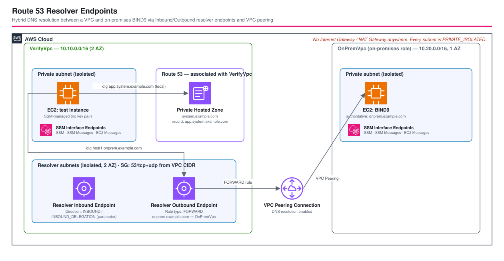

# Route 53 Resolver Inbound/Outbound Endpoints - AWS CDK Reference Architecture

[](./README.ja.md)
[](./README.md)

> **Level: 300 (Advanced)**

A hybrid-DNS reference architecture for **Amazon Route 53 Resolver** inbound and outbound endpoints. A
verification VPC owns the private hosted zone `system.example.com` and both endpoints; a second VPC stands in for
on-premises infrastructure with a self-managed BIND9 DNS server, reached over a plain VPC peering connection. The
inbound endpoint's category (`INBOUND` vs the June 2025 `INBOUND_DELEGATION`) is a parameter, not a code change.

## 📑 Table of Contents

- [Architecture Overview](#architecture-overview)
- [Design Decisions & Best Practices](#design-decisions--best-practices)
- [Cost Optimization](#cost-optimization)
- [Security Considerations](#security-considerations)
- [Prerequisites](#prerequisites)
- [Deployment Guide](#deployment-guide)
- [Testing Strategy](#testing-strategy)
- [Customization](#customization)
- [Troubleshooting](#troubleshooting)
- [References](#references)

## 🏗️ Architecture Overview



```text
VerifyVpc 10.10.0.0/16 (2 AZ)                     OnPremVpc 10.20.0.0/16 (1 AZ)
├─ Private /24 (test instance, SSM endpoints)      ├─ Private /24 (BIND9 EC2, SSM endpoints)
└─ Resolver /27 x2 AZ                              │    authoritative for
    ├─ Inbound endpoint  (INBOUND | INBOUND_DELEGATION)   onprem.example.com
    └─ Outbound endpoint (OUTBOUND)  ────────────┐  │
                                                   │  │
        VPC Peering (AllowDnsResolutionFromRemoteVpc) │
        ◄──────────────────────────────────────────┘

No Internet Gateway / NAT Gateway anywhere - every subnet is PRIVATE_ISOLATED.

PrivateHostedZone system.example.com  →  associated with VerifyVpc
  app.system.example.com  A  10.10.200.10                 (answered locally)

ResolverRule (FORWARD, domain=onprem.example.com)
  → outbound endpoint → BIND9 private IP                  (answered over peering)
```

### Key Components

| Component | Role |
|-----------|------|
| **`ResolverEndpointConstruct`** (`@common/constructs/route53/resolver-endpoint`) | Wraps `AWS::Route53Resolver::ResolverEndpoint` plus its security group. Handles the `INBOUND` / `OUTBOUND` / `INBOUND_DELEGATION` direction, forces `Protocols: [DO53]` for delegation, and can assign deterministic static IPs. Reusable by any workspace that needs Resolver endpoints. |
| **`VpcConstruct`** (`@common/constructs/vpc/vpc`) | Creates `VerifyVpc` (`Private` + dedicated `Resolver` isolated subnet group) and `OnPremVpc` (`Private` only) - every subnet is `PRIVATE_ISOLATED`, no Internet Gateway, no NAT Gateway. |
| **SSM interface endpoints** (`SSM` / `SSM Messages` / `EC2 Messages`) | One set per VPC, in the `Private` subnet group, so Session Manager reaches the test/BIND9 instances with no internet path at all. |
| **`VpcPeering`** (`@common/constructs/vpc/vpc-peering`) | Plain VPC peering connection with `AllowDnsResolutionFromRemoteVpc` enabled on both sides via a custom resource, plus routes on every subnet. |
| **`TestInstance`** (`@common/constructs/ec2/ec2-testinstance`) | Amazon Linux 2023 test instance in `VerifyVpc`, and (with a BIND9 user-data script) the on-premises-role DNS server in `OnPremVpc`. Both launched via `targetSubnetGroupName: 'Private'`. |
| **Private hosted zone** | `system.example.com`, associated with `VerifyVpc` only, with one demo `A` record (`app.system.example.com`). |
| **Resolver FORWARD rule** | Sends `onprem.example.com` queries out through the outbound endpoint to the BIND9 instance's private IP. |

### Architecture Characteristics

| Characteristic | Value | Rationale |
|-----------------|-------|-----------|
| Availability | 2-AZ Resolver endpoints | Route 53 Resolver requires ≥ 2 subnets per endpoint; two AZs is the minimum viable topology. |
| Connectivity | VPC peering, not Transit Gateway | Two VPCs, one relationship — peering has no hourly attachment cost. See the [`route53-phz-delegation`](../route53-phz-delegation/) workspace for the Transit Gateway case (4 VPCs). |
| Security | No internet exposure, DNS scoped to peer VPC CIDR | Every subnet is `PRIVATE_ISOLATED`; every Resolver/BIND9 security group opens TCP+UDP 53 to the specific peer CIDR, never `0.0.0.0/0`. |
| Cost | No NAT Gateway, but SSM interface endpoints instead | Test/BIND9 instances sit in fully private subnets; SSM access costs 3 interface-endpoint-hours per VPC instead of one NAT Gateway-hour per VPC. |

## 🧭 Design Decisions & Best Practices

### 1. Inbound endpoint category is a parameter, not a fork

**Decision**: `params.inboundEndpointType` (`'DEFAULT' | 'DELEGATION'`) maps directly to the Resolver endpoint's
`Direction` (`INBOUND` or `INBOUND_DELEGATION`) inside `ResolverEndpointConstruct`. No other resource changes.

**Why**: in June 2025 AWS added `INBOUND_DELEGATION` as a third `ResolverEndpoint` direction alongside `INBOUND`
and `OUTBOUND` ([What's New](https://aws.amazon.com/about-aws/whats-new/2025/06/amazon-route-53-resolver-endpoints-dns-delegation-private-hosted-zones/)).
A delegation inbound endpoint lets an external (on-premises) DNS server delegate a subdomain to a Route 53 private
hosted zone via ordinary NS records, instead of requiring the operator of the on-premises resolver to maintain a
conditional-forwarding rule per subdomain. The two directions are otherwise similar (both terminate inbound DNS
traffic on ENIs in your subnets), so this workspace treats it purely as configuration: flip the parameter and
`cdk diff` shows exactly one property change (plus the protocol restriction below).

**Trade-off**: `Direction` requires resource replacement on change (`Update requires: Replacement` in the
CloudFormation reference), so switching the parameter on a deployed stack replaces the endpoint (new IPs).

### 2. Delegation endpoints are Do53-only

**Decision**: `ResolverEndpointConstruct` forces `Protocols: ['DO53']` whenever `direction === 'INBOUND_DELEGATION'`.

**Why**: the CloudFormation reference for `AWS::Route53Resolver::ResolverEndpoint` states plainly: *"For a
delegation inbound endpoint you can use Do53 only."* DoH / DoH-FIPS are only valid for default inbound endpoints.
Hard-coding this in the construct means a caller cannot accidentally request an invalid combination.

### 3. Outbound endpoint uses a plain FORWARD rule, not delegation

**Decision**: the `onprem.example.com` → BIND9 path uses `RuleType: FORWARD` with an explicit `TargetIps`, not the
new `RuleType: DELEGATE`.

**Why**: `DELEGATE` rules resolve their target via NS + glue records already present in a Route 53-owned zone (see
the [`route53-phz-delegation`](../route53-phz-delegation/) workspace, which is entirely built around that
mechanism for Route 53-to-Route-53 delegation). Here, the destination is a conventional self-managed DNS server
with a known, static private IP — the textbook use case `FORWARD` was designed for, and it keeps this workspace
focused on demonstrating the *inbound* delegation toggle rather than mixing both delegation directions in one
stack.

### 4. VPC peering instead of Transit Gateway

**Decision**: the two VPCs are joined with `VpcPeering` (one `AWS::EC2::VPCPeeringConnection`), not a Transit
Gateway.

**Why**: this workspace only ever connects two VPCs, and two VPCs is exactly the case where peering's zero hourly
cost beats a Transit Gateway's per-attachment charge — a plain peering connection is the simpler and cheaper tool
for the job. TGW earns its keep once a third VPC needs the same connectivity, which is the scenario the
[`route53-phz-delegation`](../route53-phz-delegation/) workspace demonstrates instead.

### 5. `ResolverEndpointConstruct` lives in `@common`

It takes only `ec2.IVpc` + subnets + a direction and has no dependency on this workspace's parameters, so both
Route 53 Resolver workspaces in this repository share it from `infrastructure/common/constructs/route53/`.

### 6. Every subnet is private - SSM interface endpoints instead of an Internet Gateway

**Decision**: both VPCs have no `Public` subnet group and no Internet Gateway at all. The test instance and the
BIND9 instance sit in a `Private` (`PRIVATE_ISOLATED`) subnet group, and each VPC gets its own SSM, SSM Messages,
and EC2 Messages interface endpoints (in that same subnet group) so Session Manager still works.

**Why**: an earlier version of this workspace put both instances in a public subnet with an Internet Gateway,
reasoning that it was the cheapest way to give Session Manager outbound HTTPS access. That is true, but it is a
poor fit for the architecture being demonstrated: a real on-premises DNS server is never directly internet-facing,
and giving a "verification" instance a route to the internet at all is more exposure than a private hosted zone
demo needs. SSM interface endpoints remove that exposure entirely - the instances have no route to the internet in
either direction - at the cost of running three interface endpoints per VPC instead of zero.

**Trade-off**: SSM interface endpoints are billed hourly per endpoint (see [Cost Optimization](#cost-optimization)),
so this is more expensive than the public-subnet approach, though still cheaper than a NAT Gateway per VPC.
`dnf install` for BIND9 still works with no NAT/IGW because `VpcConstruct` already adds the S3 gateway endpoint
(free) by default, and the Amazon Linux package repos are served from S3.

**How to select a specific subnet group**: `TestInstance` originally only accepted a `targetSubnetType`, which is
ambiguous once a VPC has two `PRIVATE_ISOLATED` groups (`Private` for workloads, `Resolver` for endpoint ENIs).
It now also accepts `targetSubnetGroupName`, which takes precedence - a small, additive change to
`@common/constructs/ec2/ec2-testinstance`.

## 💰 Cost Optimization

Approximate **ap-northeast-1**, on-demand, running 24×7.

| Resource | Qty | Unit | ~Monthly |
|----------|-----|------|----------|
| Resolver endpoint (inbound + outbound) | 2 | $0.125 / endpoint-hour | ~$182 |
| Resolver endpoint ENIs | 4 | included in endpoint charge | $0 |
| DNS queries processed | — | $0.40 / million queries | negligible at demo volume |
| EC2 `t4g.nano` (test + BIND9) | 2 | $0.0042 / hr (× region factor) | ~$6 |
| EBS gp3 8 GiB | 2 | $0.08 / GB-month | ~$1.3 |
| SSM interface endpoints (SSM/SSM Messages/EC2 Messages, per AZ) | 9 (6 in VerifyVpc's 2 AZ + 3 in OnPremVpc's 1 AZ) | ~$0.013 / endpoint-AZ-hour | ~$85 |
| VPC Peering | 1 | $0 (no hourly charge) | $0 |
| **Total (idle)** | | | **~$275 / month** |

Cost levers:

- **Endpoint-hours dominate**, exactly like Transit Gateway attachment-hours in the sibling workspace — this is
  inherent to Resolver endpoints, not a configuration choice. `cdk destroy` as soon as the demo is done.
- No NAT Gateway anywhere; the test/BIND9 instances use SSM interface endpoints instead (see
  [Design Decision 6](#6-every-subnet-is-private---ssm-interface-endpoints-instead-of-an-internet-gateway)) - still
  cheaper than one NAT Gateway per VPC (~$0.062/hr × 2 ≈ ~$90/month), and with no internet route at all.
- VPC peering has no hourly charge, unlike Transit Gateway — see [Design Decision 4](#4-vpc-peering-instead-of-transit-gateway).
- If cost matters more than the private-subnet posture, drop the SSM interface endpoints and switch
  `targetSubnetGroupName: 'Private'` back to a `Public` subnet group + Internet Gateway - see the git history
  for the previous shape of this workspace.

## 🔒 Security Considerations

| Control | Implementation |
|---------|----------------|
| **DNS traffic scope** | Every Resolver endpoint and the BIND9 security group open TCP+UDP 53 to the specific peer VPC CIDR only — never `0.0.0.0/0`; a unit test asserts this. |
| **No internet exposure** | Every subnet is `PRIVATE_ISOLATED` — no Internet Gateway, no NAT Gateway, no public IP on any instance; a unit test asserts this. |
| **Delegation protocol restriction** | `INBOUND_DELEGATION` endpoints are hard-coded to `Protocols: ['DO53']` in `ResolverEndpointConstruct`. |
| **Instance hardening** | IMDSv2 required, EBS encrypted, SSM Session Manager instead of long-lived SSH keys, and now reachable with no internet path at all (SSM interface endpoints). |
| **Least-privilege IAM** | Instances get only `AmazonSSMManagedInstanceCore`. CDK Nag (`AwsSolutionsChecks`) runs in tests; every suppression is scoped to a path and carries a reason. |
| **Zone isolation** | `system.example.com` is a *private* hosted zone associated with `VerifyVpc` only — it is never resolvable outside the VPC/peering boundary. |
| **Default SG** | `@aws-cdk/aws-ec2:restrictDefaultSecurityGroup` is on repo-wide, so each VPC's default SG denies all traffic. |

Production hardening: enable VPC Flow Logs (off by default here for cost), and if the on-premises DNS server is a
real external endpoint, restrict the outbound endpoint's egress security group to that server's specific IP
instead of the whole peer VPC CIDR.

## ✅ Prerequisites

- Node.js 20+ and the repo bootstrapped (`npm install` at `infrastructure/`)
- An AWS account and a named profile `${PROJECT}-${ENV}` (e.g. `route53-resolver-endpoints-dev`)
- CDK bootstrapped in the target account/region: `npm run bootstrap -w workspaces/route53-resolver-endpoints`

## 🚀 Deployment Guide

```bash
export PROJECT=route53-resolver-endpoints
export ENV=dev

# 1. Synthesize
npm run synth -w workspaces/route53-resolver-endpoints

# 2. Deploy
npm run deploy:all -w workspaces/route53-resolver-endpoints

# 3. Verify (see Testing Strategy) then tear down
npm run destroy:all -w workspaces/route53-resolver-endpoints
```

To switch the inbound endpoint to delegation mode, set `inboundEndpointType: 'DELEGATION'` in
`parameters/dev-params.ts` and redeploy. The stack output `InboundEndpointDirection` confirms which mode is
active, and `InboundEndpoint/ResolverEndpointIps` (a CfnOutput on the construct) lists the two static IPs an
on-premises NS record would delegate to.

## 🧪 Testing Strategy

| Layer | File | What it checks |
|-------|------|----------------|
| Snapshot | `test/snapshot/snapshot.test.ts` | Full template + resource-type/count snapshot. |
| Unit | `test/unit/route53-resolver-endpoints-stack.test.ts` | 2 VPCs with the expected CIDRs; 1 peering connection with DNS resolution enabled; no Internet Gateway/NAT Gateway/public IP anywhere; the SSM interface endpoints in both VPCs; the private hosted zone + demo record; 2 Resolver endpoints (inbound/outbound) with 2 IPs each; the inbound endpoint switching to `INBOUND_DELEGATION` + `Protocols: [DO53]` when configured; the FORWARD rule + association; no security group opening DNS to `0.0.0.0/0`. |
| Compliance | `test/compliance/cdk-nag.test.ts` | `AwsSolutionsChecks` with only scoped, documented suppressions. |

```bash
npm test -w workspaces/route53-resolver-endpoints
npm run test:snapshot:update -w workspaces/route53-resolver-endpoints   # after an intentional change
```

### Manual DNS resolution check

```bash
# Open a session on the VerifyTestInstance (id from stack outputs)
aws ssm start-session --target <VerifyTestInstance id> --profile route53-resolver-endpoints-dev

# Resolved directly by the private hosted zone
dig app.system.example.com +short          # → 10.10.200.10

# Forwarded over the outbound endpoint + VPC peering to BIND9
dig host1.onprem.example.com +short        # → the BIND9 instance's private IP
```

Both should resolve within a few seconds of the stack reaching `CREATE_COMPLETE`.

## ⚙️ Customization

| Goal | Change |
|------|--------|
| Different zone/domain names | `privateHostedZoneName` / `onPremDomainName` in `parameters/dev-params.ts`. |
| Test delegation end-to-end | Set `inboundEndpointType: 'DELEGATION'`, then on a real on-premises resolver add an NS record for a subdomain pointing at the `InboundEndpoint` construct's static IPs (see the stack output). |
| More AZs for the Resolver endpoints | Raise `verifyVpcConfig.createConfig.maxAzs` (Resolver endpoints scale with subnet count, up to 20 IPs). |
| Different CIDRs | `verifyVpcConfig` / `onPremVpcConfig` in `parameters/dev-params.ts`. |
| Reuse the endpoint construct elsewhere | `ResolverEndpointConstruct` only needs `vpc`, `subnets`, `direction`, and `allowedCidrs` — no dependency on this workspace. |

## 🔧 Troubleshooting

| Symptom | Likely cause | Fix |
|---------|--------------|-----|
| `dig app.system.example.com` fails from the test instance | Private hosted zone not yet associated, or querying from the wrong VPC | Confirm the instance is in `VerifyVpc`; `aws route53 get-hosted-zone` to check VPC associations. |
| `dig host1.onprem.example.com` fails but the local record works | Peering not yet `active`, or BIND9 not started | `aws ec2 describe-vpc-peering-connections`; check `named` status via SSM on the BIND9 instance (`systemctl status named`). |
| CloudFormation Validate warning about the Resolver endpoint `Name` | Name contains characters outside `[a-zA-Z0-9\-_ ]` | `ResolverEndpointConstruct` already sanitizes slashes; if you changed `project`/`environment` to contain other punctuation, adjust the sanitization. |
| Switching `inboundEndpointType` fails to deploy | `Direction` requires replacement, and CloudFormation Validate/other resources may still reference the pre-change endpoint ARN | Deploy is still an in-place stack update from CDK's perspective (the endpoint resource is replaced); if it stalls, check for stale references in your own extensions. |
| CDK Nag test fails after an edit | New resource triggers a rule | Add a **scoped, documented** suppression in `test/compliance/cdk-nag.test.ts` — do not broaden existing ones. |

## 📚 References

- [Amazon Route 53 Resolver endpoints now support DNS delegation for private hosted zones (AWS What's New, 2025/06/24)](https://aws.amazon.com/about-aws/whats-new/2025/06/amazon-route-53-resolver-endpoints-dns-delegation-private-hosted-zones/)
- [AWS::Route53Resolver::ResolverEndpoint (CloudFormation reference)](https://docs.aws.amazon.com/AWSCloudFormation/latest/UserGuide/aws-resource-route53resolver-resolverendpoint.html)
- [AWS::Route53Resolver::ResolverRule (CloudFormation reference)](https://docs.aws.amazon.com/AWSCloudFormation/latest/UserGuide/aws-resource-route53resolver-resolverrule.html)
- [Resolving DNS queries between VPCs and your network](https://docs.aws.amazon.com/Route53/latest/DeveloperGuide/resolver.html)
- Related workspace: [`route53-phz-delegation`](../route53-phz-delegation/) — Route 53-to-Route-53 private hosted zone delegation (`RuleType: DELEGATE`) across a Transit Gateway.
