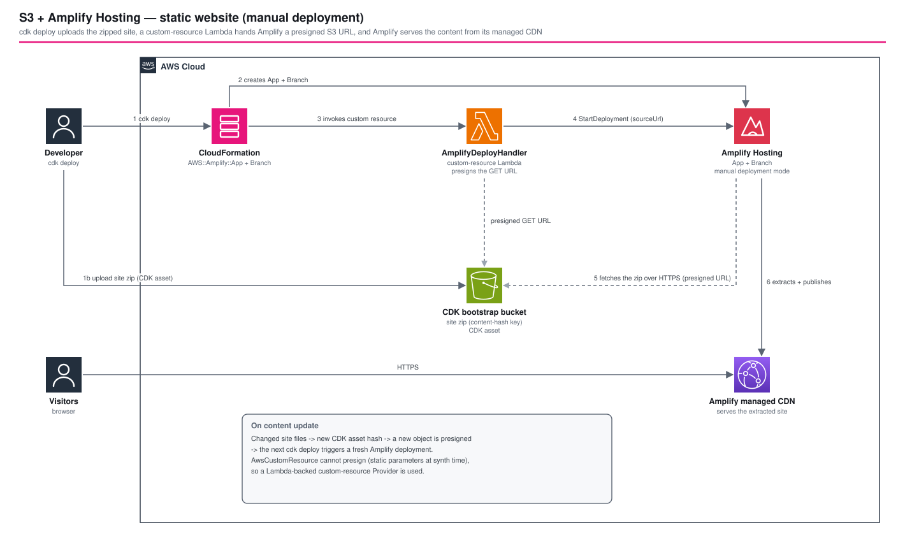

# S3 + Amplify 静的ウェブサイトホスティング: CDKアセットから手動デプロイする Amplify Hosting

*他の言語で読む:* [](./README.ja.md) [](./README.md)


## はじめに

静的ウェブサイトを **AWS Amplify Hosting** にホスティングするリファレンス実装です。Git リポジトリとは接続せず、**マニュアルデプロイモード**で動かします。サイトのソースは CDK アセットとしてまとめられ、CDK ブートストラップ用の S3 バケットに置かれます。そこから小さなカスタムリソース Lambda が、`StartDeployment` API で Amplify に渡します。

このアーキテクチャで確認できること:

- Git 接続なしで Amplify Hosting を使う方法。デプロイ元は CDK アセットの zip
- zip の S3 URL に署名し、`amplify:StartDeployment` を呼ぶ Lambda 製カスタムリソース。共有の CDK ブートストラップバケットにバケットポリシーを足す必要がなくなる
- 内容に基づくキーによる再デプロイ。`frontend/static-web/` を変更するとアセットのキーが変わり、次の `cdk deploy` で Amplify が再デプロイされる
- `iamServiceRole` を付けない Amplify アプリ。この構成では、Amplify が自分の権限で他の AWS サービスを呼ぶ場面がない
- 2026-09-27 に実機でデプロイ検証済み。実際のデプロイで見つかって直した不具合が2件ある。詳しくは[実機デプロイ検証](#-実機デプロイ検証)を参照

### なぜこのパターンか

| 比較項目 | CloudFront + S3 | **S3 + Amplify Hosting** |
|----------|----------------|--------------------------|
| CDN | 自分で構成する | Amplify が管理する |
| デプロイ | `BucketDeployment` | zip を S3 経由で渡す |
| カスタムドメイン | Route 53 と ACM が必要 | Amplify コンソールで設定できる |
| ブランチプレビュー | なし | プルリクエストプレビューに対応(このサンプルでは無効) |

## 📑 目次

- [アーキテクチャ概要](#️-アーキテクチャ概要)
- [設計判断とベストプラクティス](#-設計判断とベストプラクティス)
- [コスト最適化](#-コスト最適化)
- [セキュリティ考慮事項](#-セキュリティ考慮事項)
- [前提条件](#-前提条件)
- [デプロイ手順](#-デプロイ手順)
- [テスト戦略](#-テスト戦略)
- [カスタマイズ](#️-カスタマイズ)
- [実機デプロイ検証](#-実機デプロイ検証)
- [トラブルシューティング](#-トラブルシューティング)
- [CloudFront + S3 パターンとの使い分け](#cloudfront--s3-パターンとの使い分け)
- [参考資料](#-参考資料)

## 🏗️ アーキテクチャ概要



### 主要コンポーネント

| コンポーネント | 役割 |
|---|---|
| CDK アセット(`s3_assets.Asset`) | `frontend/static-web/` を zip にして CDK ブートストラップバケットへアップロードする。キーは内容の SHA-256 ハッシュ |
| `AWS::Amplify::App`(`platform: 'WEB'`) | Amplify 管理の CDN で配信する静的サイト。`repository` と `accessToken` を指定しないので、マニュアルデプロイモードになる |
| `AWS::Amplify::Branch` | ブランチ `main`(変更可)。自動ビルドとプルリクエストプレビューは無効 |
| `AmplifyDeployHandler`(Node.js 22、arm64、60 秒) | カスタムリソース用 Lambda。zip への GET URL(有効 15 分)に署名し、`amplify:StartDeployment` を呼ぶ |
| `cr.Provider` + `CustomResource` | 作成時と更新時にハンドラーを実行する |

### デプロイの流れ

1. `cdk deploy` がウェブサイトのディレクトリを zip にして、CDK ブートストラップバケットへアップロードする(キーは内容ハッシュ)。
2. CloudFormation が `AWS::Amplify::App` と `AWS::Amplify::Branch` を作る。
3. カスタムリソースが `AmplifyDeployHandler` を呼び出し、zip の署名付き S3 GET URL を作る。
4. ハンドラーがその URL を `sourceUrl` にして `amplify:StartDeployment` を呼ぶ。
5. Amplify が通常の HTTPS で zip を取得して展開し、管理 CDN から配信する。

**コンテンツを更新したとき**: ウェブサイトのファイルを変更するとアセットのキーが変わり、カスタムリソースが署名する対象も変わります。次の `cdk deploy` で、Amplify の再デプロイが自動で走ります。

### アーキテクチャ特性

| 特性 | 値 | 根拠 |
|---|---|---|
| 可用性 | Amplify 管理の CDN | 自分で運用するオリジンやディストリビューションがない |
| スケーラビリティ | Amplify Hosting に任せる | 静的コンテンツのみ |
| セキュリティ | 既定で HTTPS、サーバー側のコンピュートなし | [セキュリティ考慮事項](#-セキュリティ考慮事項)を参照 |
| コスト | ストレージとデータ転送量 | [コスト最適化](#-コスト最適化)を参照 |

## 🎯 設計判断とベストプラクティス

### 1. Git 接続ではなくマニュアルデプロイモードにする

**決定**: Amplify アプリにリポジトリもアクセストークンも設定せず、ブランチは `enableAutoBuild: false` と `enablePullRequestPreview: false` にします。デプロイはカスタムリソースだけが行います。

**根拠**:
- ✅ Git プロバイダーのトークンを保管・ローテーションしなくてよい
- ✅ インフラを変える `cdk deploy` が、そのままコンテンツも公開する

**トレードオフ**:
- ❌ push をきっかけにしたビルドも、プルリクエストプレビューもない。必要になったら Amplify の Git モードを使う

### 2. `s3://` の URL ではなく、署名付き HTTPS URL を渡す

**決定**: `AmplifyDeployHandler` が zip への短命な HTTPS GET URL に署名し、`StartDeployment` に渡します。

**根拠**:
- ✅ `s3://` の URL をそのまま渡すと、`amplify.amazonaws.com` に読み取りを許可するバケットポリシーが要る([Amplify の公式ガイド](https://docs.aws.amazon.com/amplify/latest/userguide/deploy-with-sdks.html))。zip は共有の CDK ブートストラップバケットにあり、このスタックの持ち物ではない。`websiteAsset.bucket` はインポートされた `IBucket` なので、`addToResourcePolicy` を呼んでも何も起きない
- ✅ 署名付き URL なら Amplify は普通の HTTP GET をするだけで済み、ハンドラー自身のロールに `s3:GetObject` があればよい

**トレードオフ**:
- ❌ SDK 呼び出し1行で済むところを、Lambda と `cr.Provider` で保守することになる

```typescript
// CDK がディレクトリを zip にして、ブートストラップバケットへアップロードする(内容に基づくキー)
const websiteAsset = new s3_assets.Asset(this, 'WebsiteAsset', {
  path: path.join(__dirname, '../../../../../frontend/static-web'),
});

// ハンドラーには、アセットに対する通常のアイデンティティベースの読み取り権限を付ける。バケットポリシーは使わない
websiteAsset.grantRead(deployHandler);
deployHandler.addToRolePolicy(
  new iam.PolicyStatement({ actions: ['amplify:StartDeployment'], resources: ['*'] }),
);

// 作成時と更新時に実行する。アセットのキーが変わるのは、ウェブサイトのファイルが変わったときだけ
new cdk.CustomResource(this, 'AmplifyDeployment', {
  serviceToken: deployProvider.serviceToken,
  properties: {
    AppId: this.amplifyApp.attrAppId,
    BranchName: branchName,
    BucketName: websiteAsset.s3BucketName,
    ObjectKey: websiteAsset.s3ObjectKey,
  },
});
```

### 3. Amplify アプリに `iamServiceRole` を付けない

**決定**: サービスロールなしでアプリを作ります。

**根拠**: Amplify は署名付き URL で zip を取得します。このサンプルには、Amplify に代わって他の AWS サービスを呼ぶ処理がありません。

### 4. `cr.AwsCustomResource` ではなく、Lambda を使う `cr.Provider` にする

**決定**: `cr.Provider` と `CustomResource` の裏に、実際の Lambda を置きます。

**根拠**: `AwsCustomResource` の `parameters` は synth 時点の固定 JSON になるため、デプロイ時に署名付き URL を作れません。

### 5. Well-Architected Framework との整合性

| 柱 | 実装 |
|--------|---------------|
| **運用上の優秀性** | 1回の `cdk deploy` でインフラとコンテンツの両方を公開する。デプロイジョブの状態は `aws amplify list-jobs` で見られる |
| **セキュリティ** | バケットポリシーを変更せず、Amplify のサービスロールもなし。署名付き URL の有効期限は 15 分。サイトへのアクセスは HTTPS のみ |
| **信頼性** | Amplify 管理の CDN とホスティング。内容に基づくキーなので、再デプロイの結果が一定になる |
| **パフォーマンス効率** | 静的コンテンツを Amplify 管理の CDN から配信する |
| **コスト最適化** | マニュアルデプロイモードではビルドが走らない。デプロイ用 Lambda はスタックを変更したときだけ動く |
| **持続可能性** | 共有のマネージドなホスティング基盤を使い、自分で抱えるアイドル中のコンピュートがない |

## 💰 コスト最適化

### 月額コストの目安(ap-northeast-1、小規模な静的サイト)

```text
Amplify Hosting のストレージ:  保存した GB × $0.023 / GB・月
Amplify Hosting のデータ転送:  配信した GB × $0.15 / GB
ビルド時間:                    なし(マニュアルデプロイモードではビルドが走らない)
AmplifyDeployHandler:          スタックを変更したときだけ実行。無視できる額
CDK ブートストラップバケット:  アセットの zip が数 KB〜数 MB。無視できる額
```

上は Amplify Hosting の公開されている定価です。ap-northeast-1 の単価と無料利用枠は、[Amplify の料金ページ](https://aws.amazon.com/amplify/pricing/)で確認してください。数 MB 程度のサイトでアクセスが少なければ、ストレージと転送量がほぼ請求のすべてです。

### コスト最適化戦略

1. **アセットを小さく保つ**: 画像を圧縮し、使っていないファイルを外す。ストレージも転送量もサイトの大きさに比例する。
2. **マニュアルデプロイモードのままにする**: ビルドを実行しないので、ビルド時間は課金されない。
3. **使わない dev スタックは削除する**: `npm run destroy:all` で Amplify アプリとデプロイ履歴ごと消える。

## 🔒 セキュリティ考慮事項

### ネットワークセキュリティ

1. **既定では公開**: Amplify の既定ドメインは、URL を知っていれば誰でも見られます。公開してはいけないコンテンツなら、認証や、独自の保護を付けたカスタムドメインを用意してください。
2. **VPC もインバウンドの基盤もない**: コンピュートは、`cdk deploy` の間だけ動くデプロイ用 Lambda だけです。

### 実装されているセキュリティベストプラクティス

- ✅ 署名付き URL の有効期限は 900 秒
- ✅ ハンドラーのロールは、CDK ブートストラップバケットとアセットのキーに絞った `s3:GetObject` と、`amplify:StartDeployment` だけを持つ(いずれもアイデンティティベース)
- ✅ 共有のブートストラップバケットにバケットポリシーを足さず、Amplify アプリにサービスロールも付けない
- ✅ `enableAutoBuild` と `enablePullRequestPreview` は無効。スタック以外の経路ではデプロイされない

### CDK Nag 準拠

`test/compliance/cdk-nag.test.ts` が `AwsSolutionsChecks` を実行し、抑制した指摘は理由を書いています。

- `AwsSolutions-IAM4`: ハンドラーと `cr.Provider` のフレームワーク Lambda が使う `AWSLambdaBasicExecutionRole`
- `AwsSolutions-IAM5`: `Asset.grantRead()` が生成するワイルドカード(ブートストラップバケットとアセットのキーに絞られている)、`amplify:StartDeployment` のリソース(ポリシー作成時点ではアプリ ID がトークンのため)、フレームワーク Lambda の呼び出し権限
- `AwsSolutions-L1`: フレームワーク Lambda のランタイムは CDK が管理する。`AmplifyDeployHandler` は `NODEJS_22_X`

```bash
npm run test:compliance -w workspaces/s3-amplify-static-website
```

## 📋 前提条件

- AWS CLI v2 をインストールして設定済み
- Node.js 20 以上
- AWS CDK CLI(`npm install -g aws-cdk`)
- CDK ブートストラップ済み(`cdk bootstrap`)
- TypeScript の基礎知識

## 🚀 デプロイ手順

### 1. 差分を確認する

```bash
npm run diff -- --project=sample --env=dev
```

### 2. デプロイする(約 5〜10 分)

```bash
npm run deploy:all -- --project=sample --env=dev
```

### 3. 動作を確認する

出力された `AmplifyAppUrl` をブラウザで開くか、次のコマンドで確認します。

```bash
curl -I https://<branchName>.<アプリの既定ドメイン>/
aws amplify list-jobs --app-id <AmplifyAppId> --branch-name main
```

### コンテンツを更新する

`frontend/static-web/` 配下のファイルを編集して、もう一度 `cdk deploy` を実行します。アセットのハッシュが変わり、Amplify が自動で再デプロイされます。

### クリーンアップ

```bash
npm run destroy:all -- --project=sample --env=dev
```

スタックを削除すると、Amplify アプリとデプロイ履歴もすべて消えます。

## 🧪 テスト戦略

### テスト構成

```text
test/
├── compliance/        # cdk-nag の AwsSolutionsChecks(3 テスト)
├── snapshot/          # テンプレート全体とリソース数(2 テスト)
└── unit/              # Fine-grained Assertions(7 テスト)
```

### 1. スナップショットテスト

**目的**: CloudFormation テンプレート全体の意図しない変更を検知する。

```bash
npm run test:snapshot -w workspaces/s3-amplify-static-website
```

### 2. ユニットテスト

**目的**: このパターンを成り立たせているリソースと関係を確かめる。

- ✅ Amplify アプリが `WEB` プラットフォームで作られ、ブランチの自動ビルドが無効になっている
- ✅ デプロイ用ハンドラーが CDK アセットを読み取れ、`amplify:StartDeployment` を呼べる
- ✅ デプロイ用カスタムリソースが `Provider` の Lambda で動く
- ✅ 出力に `AmplifyAppId`、`AmplifyAppUrl`、`AmplifyConsoleUrl` があり、指定した `branchName` が使われる

```bash
npm test -w workspaces/s3-amplify-static-website
```

## ⚙️ カスタマイズ

### ブランチ名を変える

`branchName` はスタックのプロパティです(既定は `main`)。ブランチのリソース、カスタムリソース、`AmplifyAppUrl` の出力がすべてこれに従います。

### カスタムドメインを追加する

Amplify コンソールで設定するか、スタックに `AWS::Amplify::Domain` を追加します。

### Git 連携のデプロイに切り替える

アプリに `repository` とアクセストークンを設定して `enableAutoBuild` を有効にし、カスタムリソースは外します。プルリクエストプレビューが使えるようになる代わりに、Git のトークンを管理することになります。

## ✅ 実機デプロイ検証

2026-09-27 に実際のアカウント(`ap-northeast-1`)へデプロイして確認し、そのあとスタックを削除しました。デプロイで本物の不具合が2件見つかり、どちらも修正済みです。

1. **`s3:GetObjectAcl` / `s3:PutObjectAcl` の `AccessDenied`。それを解消すると今度は Amplify 自身の `"The bucket policy is either missing or has insufficient permissions"`。** 当初の実装は、`sourceUrl: s3://<bootstrap-bucket>/<key>` をそのまま `amplify:StartDeployment` に渡していました。この方式は `amplify.amazonaws.com` に読み取りを許可するバケットポリシーが必要です。ところが zip があるのは共有の CDK ブートストラップバケット(`cdk-hnb659fds-assets-<account>-<region>`)で、このスタックのものではありません。インポートしたバケットへの `addToResourcePolicy` は、何も起こさずに終わります。**修正**: デプロイ時に `AmplifyDeployHandler` が、自分の `s3:GetObject` 権限で署名付き HTTPS GET URL を作る方式にしました。`cdk synth`、ユニットテスト、cdk-nag のどれもこの問題は検出できず、本物の `StartDeployment` を呼んで初めて分かりました。
2. `cr.AwsCustomResource` は署名付き URL を作れません。`parameters` が synth 時点で固定された JSON になるためです。そのため上の修正には、`cr.Provider` と `CustomResource` の裏に実際の Lambda が必要でした。

確認できたこと:

- `cdk deploy '**'` は2回目の試行でスタックをきれいに作成できた。1回目が残した `ROLLBACK_COMPLETE` は、次の `cdk deploy` が自動で片付けた。
- `aws amplify list-jobs` で、デプロイジョブが `SUCCEED` になっていた。
- `curl https://main.<app-id>.amplifyapp.com/` が本物の `HTTP 200` を返し、`frontend/static-web/index.html` の中身が返ってきた。`CREATE_COMPLETE` になっただけではない。
- 検証後にスタックを削除し、`aws cloudformation describe-stacks` で消えたことを確認した。

確認できていないこと: コンテンツの更新(アセットのハッシュが変わって Amplify が再デプロイされるか)と、`main` 以外の `branchName`。

## 🔧 トラブルシューティング

### 問題: `StartDeployment` が "The bucket policy is either missing or has insufficient permissions" で失敗する

**症状**: カスタムリソースが失敗して、スタックがロールバックする。

**解決策**:
1. `sourceUrl` が `s3://` ではなく、署名付きの `https://` URL になっているか確認する。`s3://` の URL には、CDK ブートストラップバケットに足せないバケットポリシーが必要になる。
2. ハンドラーのロールに、アセットへの `s3:GetObject` があるか確認する(`websiteAsset.grantRead`)。

### 問題: スタックが `ROLLBACK_COMPLETE` のまま動かない

**症状**: 最初のデプロイが失敗したあと、`cdk deploy` がスタックの更新を拒否する。

**解決策**: もう一度 `cdk deploy` を実行すると、`ROLLBACK_COMPLETE` のスタックを削除して作り直します。それでも残るときは `aws cloudformation delete-stack` で削除してください。

### 問題: 更新したのにサイトが古いまま

**症状**: `AmplifyAppUrl` が、更新前のファイルを返す。

**解決策**:
1. `frontend/static-web/` のファイルが実際に変わっているか確認する。アセットのキーが変わるのは、内容が変わったときだけ。
2. `aws amplify list-jobs` で最新のジョブを見て、`SUCCEED` になるのを待つ。

## CloudFront + S3 パターンとの使い分け

| ユースケース | 向いているパターン |
|-------------|-------------|
| WAF や地理制限など、細かく作り込みたい | CloudFront + S3 |
| 静的サイトを手早く公開したい | **S3 + Amplify Hosting** |
| Git への push で自動デプロイしたい | Amplify Hosting(Git モード) |
| バックエンド API と組み合わせたい | CloudFront + VPC Origin |

## 📚 参考資料

### AWS 公式ドキュメント

- [AWS Amplify Hosting](https://docs.aws.amazon.com/amplify/latest/userguide/welcome.html)
- [SDK を使った Amplify Hosting へのデプロイ](https://docs.aws.amazon.com/amplify/latest/userguide/deploy-with-sdks.html)
- [Amplify StartDeployment API](https://docs.aws.amazon.com/amplify/latest/APIReference/API_StartDeployment.html)

### AWS Well-Architected

- [AWS Well-Architected Framework](https://docs.aws.amazon.com/wellarchitected/latest/framework/welcome.html)

### AWS CDK

- [aws-amplify モジュール](https://docs.aws.amazon.com/cdk/api/v2/docs/aws-cdk-lib.aws_amplify-readme.html)
- [aws-s3-assets モジュール](https://docs.aws.amazon.com/cdk/api/v2/docs/aws-cdk-lib.aws_s3_assets-readme.html)
- [`cr.Provider`](https://docs.aws.amazon.com/cdk/api/v2/docs/aws-cdk-lib.custom_resources.Provider.html)

### 関連アーキテクチャ

- [`cloudfront-s3-static-website`](../cloudfront-s3-static-website/)(CloudFront + S3 による代替構成)

## 📄 ライセンス

このプロジェクトは Apache License, Version 2.0 の下でライセンスされています。詳細は [LICENSE](../../../LICENSE) ファイルを参照してください。

## 👥 コントリビューション

コントリビューションを歓迎します。詳細は[コントリビューションガイド](../../../docs/contribution/CONTRIBUTING.md)を参照してください。

## 🏆 このリファレンスアーキテクチャについて

このリファレンスアーキテクチャは、Git 接続なしで Amplify Hosting に静的ウェブサイトをホスティングするための、AWS CDK のベストプラクティスを示しています。

**対象レベル**: 200(中級)

---

**注意**: これはリファレンス実装です。本番環境にデプロイする前に、必ず特定の要件および組織のポリシーに従ってレビューおよびカスタマイズしてください。
