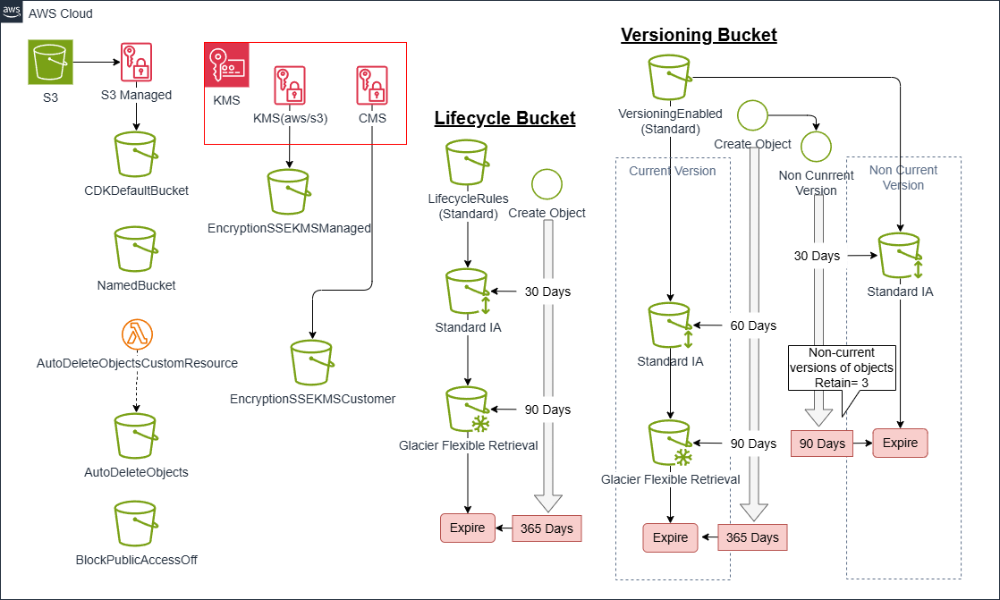

# S3-Basics -- S3バケットの基本

*他の言語で読む:* [](./README.ja.md) [](./README.md)


## はじめに

このアーキテクチャでは、以下の実装を確認することができます。

- CDKの最小構成コードがどのようなCloudFormationテンプレートになるか
- L2 Constructのデフォルト動作とカスタマイズ方法
- S3バケットのセキュリティ設定のベストプラクティス
- ライフサイクルルールによるコスト最適化
- バージョニングと非現行バージョンの管理

## 📑 目次

- [アーキテクチャ概要](#アーキテクチャ概要)
- [前提条件](#前提条件)
- [プロジェクトのディレクトリ構成](#プロジェクトのディレクトリ構成)
- [パターン1: CDKのデフォルト設定を理解する](#パターン1-cdkのデフォルト設定を理解する)
- [パターン2: バケット名を指定](#パターン2-バケット名を指定)
- [パターン3: 削除時の動作制御](#パターン3-削除時の動作制御)
- [パターン3: パブリックアクセス制御](#パターン3-パブリックアクセス制御)
- [パターン4: 暗号化設定](#パターン4-暗号化設定)
- [パターン5: ライフサイクルルール](#パターン5-ライフサイクルルール)
- [パターン6: バージョニングと包括的なライフサイクル管理](#パターン6-バージョニングと包括的なライフサイクル管理)
- [デプロイと確認](#デプロイと確認)
- [ベストプラクティス](#ベストプラクティス)
- [まとめ](#まとめ)
- [参考リンク](#参考リンク)

## アーキテクチャ概要

構築する内容は次のとおりです。



以下の7つのパターンを実装します。

1. CDKDefault: 完全にデフォルト設定
2. Named: バケット名を指定
3. AutoDeleteObjects: 削除時にオブジェクトも自動削除
4. BlockPublicAccessOff: パブリックアクセス設定の一部を無効化
5. EncryptionSSEKMSManaged: AWS管理のKMSキーで暗号化
6. EncryptionSSEKMSCustomer: カスタマー管理のKMSキーで暗号化
7. LifecycleRules: ライフサイクルルールによるコスト最適化
8. VersioningEnabled: バージョニングとライフサイクル管理

## 前提条件

- AWS CLI v2がインストール・設定済み
- Node.js 20以上
- AWS CDK CLI (`npm install -g aws-cdk`)
- TypeScriptの基礎知識
- AWSアカウント（Free Tierで実行可能）

## プロジェクトのディレクトリ構成

今回のプロジェクト構成は以下の通りです。

```text
s3-basics/
├── bin/
│   └── s3-basics.ts               # アプリケーションのエントリーポイント
├── lib/
│   ├── stacks/
│   │      └── s3-basics-stack.ts         # スタック定義
│   └── stages/
│          └── s3-basics-stage.ts         # ステージ定義
├── test/
│   ├── compliance
│   │      └── cdk-nag.test.ts     # テストコード（後の演習で解説）
│   ├── snapshot
│   │      └── shanpshot.test.ts   # テストコード（後の演習で解説）
│   └── unit
│          └── s3-basics.test.ts   # テストコード（後の演習で解説）
├── cdk.json
├── package.json
└── tsconfig.json
```

## パターン1: CDKのデフォルト設定を理解する

まずは、最もシンプルな実装から始めます。

```typescript
import * as cdk from 'aws-cdk-lib';
import { Construct } from 'constructs';
import * as s3 from 'aws-cdk-lib/aws-s3';

export class S3BasicStack extends cdk.Stack {
  public readonly bucket: s3.IBucket;

  constructor(scope: Construct, id: string, props?: cdk.StackProps) {
    super(scope, id, props);

    // 完全にデフォルト設定のS3バケット
    this.bucket = new s3.Bucket(this, 'CDKDefault', {});
  }
}
```

たったこれだけのコードで、S3バケットが作成されます。では、このコードが実際にどのようなCloudFormationテンプレートになるのか見てみましょう。

生成されるCloudFormation:

`cdk synth`を実行すると、以下のようなCloudFormationテンプレートが生成されます。

```json
{
  "Resources": {
    "CDKDefaultE8B73DAC": {
      "Type": "AWS::S3::Bucket",
      "UpdateReplacePolicy": "Retain",
      "DeletionPolicy": "Retain",
      "Metadata": {
        "aws:cdk:path": "Dev/SandboxS3Basic/CDKDefault/Resource"
      }
    }
  }
}
```

### デフォルト設定の詳細

CDKが自動的に設定する項目を確認していきます。

#### 1. 論理IDの生成

Construct IDの`CDKDefault`に、ハッシュ値`E8B73DAC`が付与されて`CDKDefaultE8B73DAC`という論理IDになっています。このハッシュ値は、スタック内での一意性を保証するために自動生成されます。

#### 2. UpdateReplacePolicyとDeletionPolicy

両方とも`Retain`に設定されています。これは、スタックを削除してもS3バケットは残る、という安全な設定です。

AWSドキュメント > [UpdateReplacePolicy](https://docs.aws.amazon.com/AWSCloudFormation/latest/TemplateReference/aws-attribute-updatereplacepolicy.html)と[DeletionPolicy](https://docs.aws.amazon.com/AWSCloudFormation/latest/TemplateReference/aws-attribute-deletionpolicy.html)

⚠️: 今回のコードをAWS環境にデプロイし、削除した場合は、`CDKDefault`のバケットを手動で削除する必要があります。

#### 3. 暗黙的に設定される項目

CloudFormationテンプレートには明示されていませんが、以下の設定が適用されます。

- 暗号化: SSE-S3（Amazon S3マネージド暗号化キー）
- パブリックアクセス: 完全ブロック（推奨設定）
- バージョニング: 無効
- バケット名: AWSが自動生成

これらは、AWSのデフォルト値として適用されます。CDKは、セキュアな設定をデフォルトにしているため、明示的に指定しなくても安全な構成になります。

## パターン2: バケット名を指定

この例では、バケット名を明示的に指定しています。
ただし、実際のプロジェクトでは、バケット名を指定しないことを推奨します。これは、[AWSドキュメント](https://docs.aws.amazon.com/cdk/api/v2/docs/aws-cdk-lib.aws_s3.Bucket.html#bucketname)でもCloudFormationによる自動生成を推奨しています。

自動生成を推奨する理由:

- リソース置き換え時に新しいバケットが作成できない
  - 置き換え時は、新規リソース作成 > 既存リソース削除という順序になるため、同じ名称だと作成に失敗します
- CDKが自動生成する名前で十分ユニークである
- デプロイの柔軟性が向上する

どうしてもバケット名を指定する必要がある場合のみとすることを推奨します。

```typescript
const accountId = cdk.Stack.of(this).account;
const region = cdk.Stack.of(this).region;
const regionNoHyphens = region.replace(/-/g, '');

const bucketName = [
  props.project,       // プロジェクト名
  props.environment,   // 環境識別子
  'namedbucket',       // 用途
  accountId,           // AWSアカウントID
  regionNoHyphens      // リージョン（ハイフン除去）
].join('-').toLowerCase();
new s3.Bucket(this, 'NamedBucket', {
  bucketName,
  autoDeleteObjects: props.isAutoDeleteObject,
  removalPolicy: cdk.RemovalPolicy.DESTROY,
});
// 結果例: myproject-dev-logs-123456789012-apnortheast1
```

バケット名の主なルール:

- グローバルで一意である必要がある
- 小文字、数字、ピリオド (`.`)、およびハイフン (`-`) のみ使用可能
- 3～63文字

詳細なルールについては、[公式ドキュメント](https://docs.aws.amazon.com/AmazonS3/latest/userguide/bucketnamingrules.html#general-purpose-bucket-names)を参照してください。

## パターン3: 削除時の動作制御

開発環境では、スタック削除時にバケットとそのオブジェクトも一緒に削除したい場合があります。

```typescript
new s3.Bucket(this, 'AutoDeleteObjects', {
  autoDeleteObjects: true,
  removalPolicy: cdk.RemovalPolicy.DESTROY,
});
```

生成されるCloudFormation:

この設定により、CloudFormationテンプレートには以下が追加されます。

1. S3バケット: `DeletionPolicy: Delete`に変更
2. バケットポリシー: カスタムリソース用の権限
3. カスタムリソース: オブジェクト削除を実行するLambda関数
4. IAMロール: Lambda実行用のロール

```json
{
  "AutoDeleteObjects9931B84E": {
    "Type": "AWS::S3::Bucket",
    "Properties": {
      "Tags": [
        {
          "Key": "aws-cdk:auto-delete-objects",
          "Value": "true"
        }
      ]
    },
    "UpdateReplacePolicy": "Delete",
    "DeletionPolicy": "Delete"
  },
  "AutoDeleteObjectsPolicy6BD2BF78": {
    "Type": "AWS::S3::BucketPolicy",
    // ... バケットポリシーの詳細
  },
  "AutoDeleteObjectsAutoDeleteObjectsCustomResourceF9A68CC5": {
    "Type": "Custom::S3AutoDeleteObjects",
    // ... カスタムリソースの詳細
  },
  "CustomS3AutoDeleteObjectsCustomResourceProviderRole3B1BD092": {
    "Type": "AWS::IAM::Role",
    // ... IAMロールの詳細
  },
  "CustomS3AutoDeleteObjectsCustomResourceProviderHandler9D90184F": {
    "Type": "AWS::Lambda::Function",
    "Properties": {
      "Runtime": "nodejs22.x",
      "Timeout": 900,
      // ... Lambda関数の詳細
    }
  }
}
```

### 重要な注意点

本番環境で`autoDeleteObjects: true`を使用する場合は慎重に検討してください。

- データの誤削除リスクが高まる
- 監査ログなど、保持が必要なデータが失われる可能性がある

開発・テスト環境専用の設定として使用し、本番環境では、明示的に`removalPolicy: cdk.RemovalPolicy.RETAIN`を設定し、データの保護を優先します。

## パターン3: パブリックアクセス制御

S3バケットのパブリックアクセス設定は、セキュリティ上非常に重要です。デフォルトでは、パブリックアクセスブロックが有効になっていますが、これを無効化する設定です。

CDKコード:

```typescript
// パブリックポリシーのみ許可（他は全てブロック）
new s3.Bucket(this, 'BlockPublicAccessOff', {
  blockPublicAccess: new s3.BlockPublicAccess({ 
    blockPublicPolicy: false 
  }),
  autoDeleteObjects: true,
  removalPolicy: cdk.RemovalPolicy.DESTROY,
});
```

生成されるCloudFormation:

```json
{
  "BlockPublicAccessOff9C2A29A0": {
    "Type": "AWS::S3::Bucket",
    "Properties": {
      "PublicAccessBlockConfiguration": {
        "BlockPublicAcls": true,
        "BlockPublicPolicy": false,
        "IgnorePublicAcls": true,
        "RestrictPublicBuckets": true
      }
    }
  }
}
```

### パブリックアクセスブロックの4つの設定

| 設定項目 | デフォルト | 説明 |
|---------|----------|------|
| BlockPublicAcls | true | パブリックACLの設定を拒否 |
| BlockPublicPolicy | true | パブリックなバケットポリシーを拒否 |
| IgnorePublicAcls | true | パブリックACLを無視 |
| RestrictPublicBuckets | true | パブリックアクセス可能なバケットを制限 |

### ベストプラクティス

通常は、全ての設定を`true`（完全ブロック）に保つべきです。パブリックアクセスが必要な場合は、以下を検討してください。

1. CloudFrontを使用: S3は非公開のまま、CloudFront経由で配信
2. 署名付きURL: 一時的なアクセス権限を付与
3. バケットポリシーの厳密な制御: IPアドレス制限など

## パターン4: 暗号化設定

S3の暗号化には3つの方式があります。

### 1. SSE-S3（デフォルト）

```typescript
// 明示的に指定する場合
new s3.Bucket(this, 'EncryptionSSES3', {
  encryption: s3.BucketEncryption.S3_MANAGED,
});
```

- AWSが管理する暗号化キー
- 追加コストなし
- キーのローテーションはAWSが自動で実施

### 2. SSE-KMS（AWS管理キー）

```typescript
new s3.Bucket(this, 'EncryptionSSEKMSManaged', {
  encryption: s3.BucketEncryption.KMS_MANAGED,
  autoDeleteObjects: true,
  removalPolicy: cdk.RemovalPolicy.DESTROY,
});
```

生成されるCloudFormation:

```json
{
  "EncryptionSSEKMSManagedBEDBF190": {
    "Type": "AWS::S3::Bucket",
    "Properties": {
      "BucketEncryption": {
        "ServerSideEncryptionConfiguration": [
          {
            "ServerSideEncryptionByDefault": {
              "SSEAlgorithm": "aws:kms"
            }
          }
        ]
      },
    }
  }
}
```

- AWS管理のKMSキーを使用
- CloudTrailでキー使用を監査可能
- KMSのAPI呼び出しに対して課金

### 3. SSE-KMS（カスタマー管理キー）

```typescript
new s3.Bucket(this, 'EncryptionSSEKMSCustomer', {
  encryption: s3.BucketEncryption.KMS,
  encryptionKey: new cdk.aws_kms.Key(this, 'CustomKmsKey', {
    enableKeyRotation: true,
  }),
  autoDeleteObjects: true,
  removalPolicy: cdk.RemovalPolicy.DESTROY,
});
```

- 完全なキー管理の制御
- キーのローテーション設定が可能
- きめ細かいアクセス制御

## パターン5: ライフサイクルルール

ライフサイクルルールは、コスト最適化の重要な手段です。

CDKコード:

```typescript
const lifecycleBucket = new s3.Bucket(this, 'LifecycleRules', {
  lifecycleRules: [
    {
      id: 'MoveToIAAfter30Days',
      enabled: true,
      transitions: [
        {
          storageClass: s3.StorageClass.INFREQUENT_ACCESS,
          transitionAfter: cdk.Duration.days(30),
        },
      ],
    },
  ],
  autoDeleteObjects: true,
  removalPolicy: cdk.RemovalPolicy.DESTROY,
});

// 後からルールを追加する方法
lifecycleBucket.addLifecycleRule({
  id: 'MoveToGlacierAfter90Days',
  enabled: true,
  transitions: [
    {
      storageClass: s3.StorageClass.GLACIER,
      transitionAfter: cdk.Duration.days(90),
    },
  ],
});

lifecycleBucket.addLifecycleRule({
  id: 'ExpireAfter365Days',
  enabled: true,
  expiration: cdk.Duration.days(365),
});
```

生成されるCloudFormation:

```json
{
  "LifecycleRules2799D541": {
    "Type": "AWS::S3::Bucket",
    "Properties": {
      "LifecycleConfiguration": {
        "Rules": [
          {
            "Id": "MoveToIAAfter30Days",
            "Status": "Enabled",
            "Transitions": [
              {
                "StorageClass": "STANDARD_IA",
                "TransitionInDays": 30
              }
            ]
          },
          {
            "Id": "MoveToGlacierAfter90Days",
            "Status": "Enabled",
            "Transitions": [
              {
                "StorageClass": "GLACIER",
                "TransitionInDays": 90
              }
            ]
          },
          {
            "ExpirationInDays": 365,
            "Id": "ExpireAfter365Days",
            "Status": "Enabled"
          }
        ]
      }
    }
  }
}
```

### ストレージクラスの選択

| ストレージクラス | 用途 | コスト |
|-----------------|------|--------|
| Standard | 頻繁にアクセス | 高 |
| Standard IA | 30日後（月1回程度のアクセス） | 中 |
| Glacier Instant Retrieval | 90日後（年数回のアクセス） | 低 |
| Glacier Flexible Retrieval | アーカイブ (90日後 (年数回のアクセス) ) | 低 |
| Glacier Deep Archive | アーカイブ（ほぼアクセスしない） | 最低 |

### コスト最適化のポイント

1. アクセスパターンの分析: S3 Storage Lens やアクセスログを活用
2. 段階的な移行: STANDARD → STANDARD_IA → GLACIER INSTANT RETRIEVAL
3. 有効期限の設定: 不要になったデータは自動削除

## パターン6: バージョニングと包括的なライフサイクル管理

最後に、バージョニングを有効にした設定例です。

CDKコード:

```typescript
new s3.Bucket(this, 'VersioningEnabled', {
  versioned: true,
  autoDeleteObjects: true,
  removalPolicy: cdk.RemovalPolicy.DESTROY,
  lifecycleRules: [
    {
      id: 'ExpireNonCurrentVersionsAfter90Days',
      enabled: true,
      noncurrentVersionExpiration: cdk.Duration.days(90),
      noncurrentVersionsToRetain: 3,
    },
    {
      id: 'NonCurrentVersionTransitionToIAAfter30Days',
      enabled: true,
      noncurrentVersionTransitions: [
        {
          storageClass: s3.StorageClass.INFREQUENT_ACCESS,
          transitionAfter: cdk.Duration.days(30),
        },
      ],
    },
    {
      id: 'CurrentVersionTransitionToIAAfter60Days',
      enabled: true,
      transitions: [
        {
          storageClass: s3.StorageClass.INFREQUENT_ACCESS,
          transitionAfter: cdk.Duration.days(60),
        },
      ],
    },
    {
      id: 'CurrentVersionTransitionToGlacierAfter90Days',
      enabled: true,
      transitions: [
        {
          storageClass: s3.StorageClass.GLACIER,
          transitionAfter: cdk.Duration.days(90),
        },
      ],
    },
    {
      id: 'ExpireCurrentVersionsAfter365Days',
      enabled: true,
      expiration: cdk.Duration.days(365),
    },
    {
      id: 'AbortIncompleteMultipartUploadsAfter7Days',
      enabled: true,
      abortIncompleteMultipartUploadAfter: cdk.Duration.days(7),
    }
  ],
});
```

### バージョニングとは

[バージョニング](https://docs.aws.amazon.com/AmazonS3/latest/userguide/Versioning.html)を有効にすると、オブジェクトの全ての変更履歴が保存されます。

- 現行バージョン: 最新の状態
- 非現行バージョン: 過去の状態

生成されるCloudFormation:

```json
{
  "VersioningEnabledC271D012": {
    "Type": "AWS::S3::Bucket",
    "Properties": {
      "VersioningConfiguration": {
        "Status": "Enabled"
      },
      "LifecycleConfiguration": {
        "Rules": [
          {
            "Id": "ExpireNonCurrentVersionsAfter90Days",
            "NoncurrentVersionExpiration": {
              "NewerNoncurrentVersions": 3,
              "NoncurrentDays": 90
            },
            "Status": "Enabled"
          },
          // ... 他のルール
        ]
      }
    }
  }
}
```

### ライフサイクルルールの詳細

#### 1. 非現行バージョンの有効期限

```typescript
noncurrentVersionExpiration: cdk.Duration.days(90),
noncurrentVersionsToRetain: 3,
```

- 90日経過した非現行バージョンを削除
- ただし、最新の3つは保持

#### 2. 非現行バージョンの移行

```typescript
noncurrentVersionTransitions: [
  {
    storageClass: s3.StorageClass.INFREQUENT_ACCESS,
    transitionAfter: cdk.Duration.days(30),
  },
]
```

- 30日経過した非現行バージョンをSTANDARD_IAに移行

#### 3. 現行バージョンの移行

```typescript
transitions: [
  {
    storageClass: s3.StorageClass.INFREQUENT_ACCESS,
    transitionAfter: cdk.Duration.days(60),
  },
  {
    storageClass: s3.StorageClass.GLACIER,
    transitionAfter: cdk.Duration.days(90),
  },
]
```

- 60日経過したらSTANDARD_IAに移行
- 90日経過したらGLACIERに移行

#### 4. 不完全なマルチパートアップロードの削除

```typescript
abortIncompleteMultipartUploadAfter: cdk.Duration.days(7),
```

マルチパートアップロードが中断された場合、7日後に自動削除します。これにより、不要なストレージコストを削減できます。

## デプロイと確認

### デプロイ

```bash
# 差分確認
cdk diff --project=sample --env=dev

# デプロイ
cdk deploy "**" --project=sample --env=dev
```

### 確認方法

1. AWSマネジメントコンソール
   - S3コンソールで作成されたバケットを確認
   - プロパティタブで暗号化設定を確認
   - 管理タブでライフサイクルルールを確認

2. AWS CLI

```bash
# バケット一覧
aws s3 ls

# バケットのバージョニング設定確認
aws s3api get-bucket-versioning --bucket <bucket-name>

# ライフサイクル設定確認
aws s3api get-bucket-lifecycle-configuration --bucket <bucket-name>

# 暗号化設定確認
aws s3api get-bucket-encryption --bucket <bucket-name>
```

### クリーンアップ

```bash
# スタック削除
cdk destroy "**" --project=sample --env=dev

# 確認プロンプトをスキップ
cdk destroy "**" --force --project=sample --env=dev
```

## ベストプラクティス

### セキュリティ

1. パブリックアクセスは完全ブロック: 特別な理由がない限り、デフォルトのまま
2. 暗号化は必須: 最低でもSSE-S3、推奨はSSE-KMS
3. バージョニングを有効化: データ保護とコンプライアンス要件
4. アクセスログの有効化: セキュリティ監査とトラブルシューティング

### コスト最適化

1. ライフサイクルルールの設定: アクセスパターンに応じたストレージクラスの選択
2. 不完全アップロードの削除: 7日程度で自動削除
3. 非現行バージョンの管理: 必要な世代数のみ保持
4. S3 Intelligent-Tieringの検討: アクセスパターンが不明な場合

### 運用

1. バケット名の命名規則: プロジェクト名、環境、用途を含める
2. タグ付け: コスト配分やリソース管理のために必須
3. CloudTrailとの連携: APIコールの監査
4. CloudWatchメトリクス: バケットサイズやリクエスト数の監視

## まとめ

このアーキテクチャでは、AWS CDKでのS3バケット実装の基本を示しました。

### 学んだこと

1. CDKのデフォルト設定: 最小限のコードでセキュアな構成が可能
2. CloudFormationとの対応: CDKコードがどのように変換されるか
3. 削除動作の制御: `autoDeleteObjects`と`removalPolicy`の使い分け
4. 暗号化の3つの方式: SSE-S3、SSE-KMS（AWS管理）、SSE-KMS（カスタマー管理）
5. ライフサイクルルール: コスト最適化のための段階的な移行
6. バージョニング: 現行・非現行バージョンの包括的な管理

## 参考リンク

- [AWS CDK公式ドキュメント](https://docs.aws.amazon.com/cdk/v2/guide/home.html)
- [S3バケットのベストプラクティス](https://docs.aws.amazon.com/AmazonS3/latest/userguide/security-best-practices.html)
- [S3ライフサイクル設定](https://docs.aws.amazon.com/AmazonS3/latest/userguide/object-lifecycle-mgmt.html)
