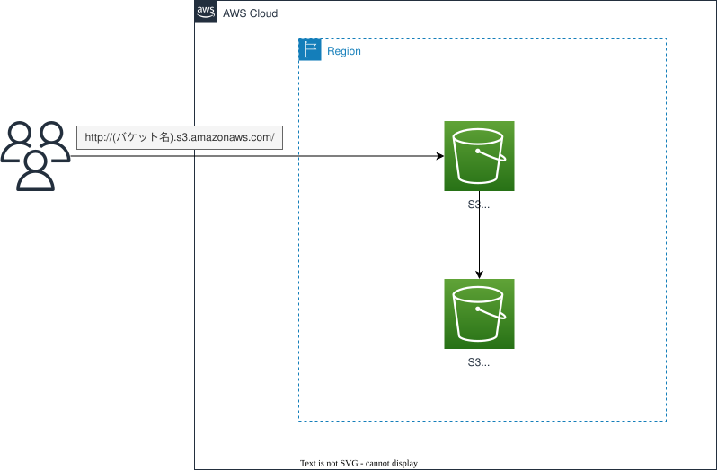

# S3 Static Web Site — IP制限付きバケットポリシーによるS3ウェブサイトホスティング

*他の言語で読む:* [](./README.ja.md) [](./README.md)


## はじめに

これは、AWS上で静的サイトを公開するもっともシンプルな方法——**S3静的ウェブサイトホスティング**を有効にしたS3バケットを、そのウェブサイトエンドポイントから直接配信する——のリファレンス実装です。CloudFrontもCDNもカスタムドメインも使いません。

このアーキテクチャは以下を示します:

- `websiteIndexDocument`/`websiteErrorDocument`によるS3静的ウェブサイトホスティングを、バケットの**S3 Block Public Accessを完全に有効にしたまま**実現
- ウェブサイトエンドポイントへの匿名アクセスを、`aws:SourceIp`でスコープしたバケットポリシーによりIPv4/IPv6の許可リストに限定 — S3はこの条件を「非公開」とみなすため、Block Public Accessと共存できる
- デプロイ操作者自身のグローバルIPを自動検出(検出できない場合は明示的な`ALLOWED_IPS`/`ALLOWED_IPV6S`環境変数にフォールバック)し、`cdk deploy`直後からデプロイ実行者本人がすぐにサイトを閲覧できるようにする
- サイトコンテンツ用バケットとは別の、専用のS3サーバーアクセスログバケット
- `BucketDeployment`による任意のコンテンツアップロード — 指定しなければ空のバケットとしてもデプロイ可能

### なぜこのパターンなのか?

| 特徴 | メリット |
| ---- | -------- |
| CloudFrontもWAFもACM証明書もなし | 静的サイトを最速・最安でオンラインにする方法。[`cloudfront-s3-static-website`](../cloudfront-s3-static-website/)に進む前のベースラインとして有用 |
| Block Public Accessと共存するIP許可リスト | バケットポリシーがS3にとって「公開」(=ブロック対象)とみなされるのは、決められた制限的な条件キーを一切含まない場合のみであることを示す。`aws:SourceIp`はそうした条件キーの1つであり、`BlockPublicAccess.BLOCK_ALL`とIPスコープの公開ポリシーが両立できる |
| 操作者IPの自動検出 | `bin/s3-static-web-site.ts`が`curl`でデプロイ実行マシン自身のIPを検出するため、デプロイ直後から手動でバケットポリシーを編集することなくサイトを閲覧できる |

## アーキテクチャ概要



### 主要コンポーネント

| コンポーネント | 設計のポイント |
| -------------- | -------------- |
| `WebsiteBucket` | `createAccountRegionalBucketWebSite` — `websiteIndexDocument: 'index.html'`、`websiteErrorDocument: 'error.html'`、`blockPublicAccess: BLOCK_ALL`、`enforceSSL: false`(S3ウェブサイトエンドポイントは平文HTTPしか提供しないため、このバケットでは`enforceSSL`を有効化できない) |
| `AccessLogBucket` | `WebsiteBucket`のS3サーバーアクセスログを受け取る(プレフィックス`website-bucket-logs/`)。`accessControl: LOG_DELIVERY_WRITE` + `objectOwnership: BUCKET_OWNER_PREFERRED`はいずれも、S3のログ配信サービスが書き込むために必須 |
| バケットポリシー(条件付き) | `allowedIps`/`allowedIpv6s`が空でない場合のみ追加: `Effect: Allow`、`Principal: *`、`Action: s3:GetObject`を、`Condition: { IpAddress: { aws:SourceIp: [...] } }`でスコープ |
| `BucketDeployment`(条件付き) | `contentsPath`が指定された場合のみ作成。`bin/s3-static-web-site.ts`では`frontend/static-web/`を指定 |

## データフロー

```text
ブラウザ
  │  HTTP(S3ウェブサイトエンドポイントはHTTPSに非対応)
  ▼
S3バケットウェブサイトエンドポイント (<bucket>.s3-website-<region>.amazonaws.com)
  │  バケットポリシーで評価: 送信元IPがallowedIps/allowedIpv6sに一致する必要あり
  ▼
index.html / error.html (WebsiteBucketから)
```

すべてのリクエストは匿名です——ウェブサイトエンドポイントはSigV4認証に対応していないため、この層で利用可能なアクセス制御は、バケットポリシーの`aws:SourceIp`条件だけです。ジオ制限やWAFルール、キャッシュを追加するエッジ/CDN層はここには存在しません。これはまさに、[`cloudfront-s3-static-website`](../cloudfront-s3-static-website/)が同じ発想の上に追加している要素です。

## 設計上の決定とベストプラクティス

### 1. `enforceSSL: false`は意図的な設定であり、見落としではない

**決定内容**: このリポジトリの他のすべてのバケットとは異なり、`WebsiteBucket`は`enforceSSL: false`で作成されている。

**根拠**:
- ✅ S3静的ウェブサイトホスティングエンドポイント(`*.s3-website-<region>.amazonaws.com`)は平文HTTPのみを提供し、SSLを強制すべきHTTPSリスナーが存在しない。ここで`enforceSSL: true`にすると、ウェブサイトエンドポイントが実際に受け取る(HTTPの)リクエストそのものをバケットポリシーが拒否してしまい、サイトが完全に壊れる。

**トレードオフ**:
- ❌ ブラウザとウェブサイトエンドポイント間の通信は暗号化されない。HTTPSが必要な場合は、S3の手前にCloudFrontを置く構成にする——[`cloudfront-s3-static-website`](../cloudfront-s3-static-website/)では非公開(非ウェブサイト)バケット、Origin Access Control、エッジでのTLS終端を使用している。

### 2. Block Public Accessを完全に有効にしたままのIP許可リスト

**決定内容**: `WebsiteBucket`のバケットポリシーは`Principal: *`に`s3:GetObject`を許可しているにもかかわらず、(共通ヘルパー`createAccountRegionalBucketWebSite`経由で)`blockPublicAccess: BlockPublicAccess.BLOCK_ALL`を維持している。

**根拠**:
- ✅ S3のBlock Public Access評価は、すべての`Principal: *`ステートメントを一律「公開」とはみなさない——`aws:SourceIp`を含む特定の条件キーで制限されたステートメントは、この分類から除外される。これが、`BlockPublicPolicy: true`とこのIPスコープのポリシーが両立できる理由。
- ✅ `allowedIps`/`allowedIpv6s`の両方が省略された場合、バケットポリシー自体が一切追加されず、サイトは全員に対して`403 Access Denied`を返す——このスタックには「全許可」のフォールバックが存在しない([`cloudfront-s3-static-website`](../cloudfront-s3-static-website/)のWAFスタックでは、IP未設定時にデフォルトで全許可になる点と対照的)。

**トレードオフ**:
- ❌ `bin/s3-static-web-site.ts`が呼び出す`getMyGlobalIp()`は、`checkip.amazonaws.com`に到達できない場合に**例外をスローする**——CloudFront WAFスタックのIPv6用ヘルパーのような「検出できなければ黙って全許可にスキップする」というフォールバックは、IPv4についてはここには存在しない。完全にオフラインのマシンからのデプロイは、`ALLOWED_IPS`を明示的に設定しない限り失敗する。

## コスト最適化

### 推定月額コスト(ap-northeast-1、低トラフィック)

```
S3ストレージ(数MBの静的コンテンツ)                     < $0.01
S3リクエスト(GET、低ボリューム)                         < $0.01
S3サーバーアクセスログのストレージ                       < $0.01
-------------------------------------------------------------------
合計                                                    < $0.05/月
```

> このスタックにはCloudFrontもWAFもコンピュートも存在しない——コストは実質的にS3のストレージとリクエスト料金のみ。

## セキュリティの考慮事項

- ✅ `blockPublicAccess: BLOCK_ALL`は常に有効なまま。アクセスは、明示的でIPスコープのバケットポリシーステートメントを通じてのみ可能
- ✅ IPv4(`/32`)とIPv6(`/128`)の両方の許可リストをサポートし、それぞれ独立したポリシーステートメントとして適用
- ⚠️ ウェブサイトエンドポイントへの通信は平文HTTP——許可リストに載ったIPとS3の間のネットワークトラフィックを観測できる者は、レスポンスを平文で読み取れる。ローカルやデモ用の静的サイト以外の用途には使用しないこと
- ⚠️ `aws:SourceIp`による制限は、セッション単位ではなくリクエスト単位で評価される——これはIP許可リストであって認証ではない。デモや個人利用には適するが、特定の個人へのアクセス制限には適さない

## 前提条件

- 適切な権限を持つAWSアカウント
- AWS CLI v2.x インストール済みおよび設定済み
- Node.js 20.x以降
- AWS CDK 2.x
- Git

### 必要なIAM権限

デプロイするユーザー/ロールには以下の作成・管理権限が必要です:
- S3(バケット、バケットポリシー)

## デプロイガイド

### 1. クローンとセットアップ

```bash
git clone <this-repository>
cd infrastructure
npm install
```

### 2. デプロイ

```bash
export PROJECT=your-project
export ENV=dev

npm run bootstrap   # 初回のみ
npm run diff
npm run stage:deploy:all
```

### 許可IP(v4/v6)

デフォルトでは、`cdk deploy`を実行したマシン自身のグローバルIPだけがバケットポリシーの許可リストに載ります(`bin/s3-static-web-site.ts`が`curl`で自動検出)。IPv6は`curl -6`で取得を試み、取得できない場合(IPv6接続のないdevcontainer/CI等)は自動的にスキップされます。一方、IPv4の検出に失敗した場合はデプロイ自体が**失敗します**——このスタックには「全許可」のフォールバックはありません。

自動検出ではなく任意のIP(例: 実際にブラウザを開いている端末のIP)を明示的に許可したい場合は、環境変数`ALLOWED_IPS`/`ALLOWED_IPV6S`で上書きできます(カンマ区切りで複数指定可)。指定した場合は自動検出の`curl`呼び出し自体がスキップされます。

```bash
ALLOWED_IPS=203.0.113.10,203.0.113.20 \
ALLOWED_IPV6S=2001:db8::1 \
npm run stage:deploy:all
```

### 3. デプロイの確認

```bash
aws cloudformation describe-stacks \
  --stack-name <ProjectName>S3StaticWebSite \
  --query 'Stacks[0].Outputs'
```

```bash
curl http://<出力されたWebsiteBucketUrl>/
```

## 使用方法

許可リストに載ったIPから、スタック出力の`WebsiteBucketUrl`をブラウザで開きます。それ以外のIPからのリクエストは`403 Forbidden`になります。

## テスト

```bash
npm test -w workspaces/s3-static-web-site              # すべてのテスト
npm run test:unit -w workspaces/s3-static-web-site      # ユニットテスト
npm run test:snapshot -w workspaces/s3-static-web-site  # スナップショットテスト
```

> このワークスペースの`test/compliance/cdk-nag.test.ts`は、プロジェクトテンプレートが未実装のまま残っており(存在しないプレースホルダー型`YoutStackName`を参照)、現状`S3StaticWebSiteStack`に対しては実行されません。同じテンプレートを実装済みの例として、[`cloudfront-s3-static-website`](../cloudfront-s3-static-website/)のコンプライアンステストを参照してください。

## カスタマイズ

### 独自コンテンツのアップロード

[`lib/stages/s3-static-web-site-stage.ts`](./lib/stages/s3-static-web-site-stage.ts)で設定されている`contentsPath`を別のローカルディレクトリに向けるか、`frontend/static-web/`配下のファイルを差し替えてください。`contentsPath`を省略した場合、バケットは空の状態でデプロイされます。

### IP制限の解除

`allowedIps`と`allowedIpv6s`の両方に空配列を渡すと、バケットポリシー自体がスキップされます——ただし`blockPublicAccess: BLOCK_ALL`は維持されたままのため、サイトは「一般公開」ではなく「誰からもアクセス不可」になります。サイトを本当に一般公開したい場合は、バケットのパブリックアクセスブロック設定自体を変更する必要があります(このリファレンス実装では非推奨——きちんと一般公開・HTTPS配信したい場合は[`cloudfront-s3-static-website`](../cloudfront-s3-static-website/)を使用してください)。

## クリーンアップ

```bash
export PROJECT=your-project
export ENV=dev
npm run stage:destroy:all
```

## トラブルシューティング

### 問題: `cdk deploy`が「Could not retrieve global IP address」で失敗する

**症状**: 合成前に、`getMyGlobalIp()`からスローされたエラーでデプロイが失敗する。

**解決策**:
1. デプロイ実行マシンが`http://checkip.amazonaws.com`に到達できるか確認する(アウトバウンドのインターネット接続がない、またはプロキシがブロックしているケースが典型的)
2. `ALLOWED_IPS`を明示的に設定し、自動検出自体をスキップする: `ALLOWED_IPS=203.0.113.10 npm run stage:deploy:all`

### 問題: デプロイ成功後、ブラウザで`403 Forbidden`が表示される

**症状**: スタックは問題なくデプロイされるが、`WebsiteBucketUrl`を開くとXML形式の`AccessDenied`エラーが返る。

**解決策**:
1. ブラウザの現在のグローバルIPが、デプロイ時に許可リストへ登録されたIPと一致しているか確認する(動的IPやVPNがミスマッチの典型的な原因) — スタックのCloudFormationイベントを確認するか、正しい値で`ALLOWED_IPS`を指定して再デプロイする
2. サイトはHTTPのみであることに注意——一部のブラウザ/拡張機能が自動的にHTTPSへアップグレードし、ウェブサイトエンドポイントに対して失敗することがある。スタック出力に表示された正確な`http://`のURLを試す

## 参考資料

### AWSドキュメント
- [Amazon S3を使用した静的ウェブサイトのホスティング](https://docs.aws.amazon.com/AmazonS3/latest/userguide/WebsiteHosting.html)
- [Amazon S3ストレージへのパブリックアクセスをブロックする](https://docs.aws.amazon.com/AmazonS3/latest/userguide/access-control-block-public-access.html)
- [バケットポリシーの例 — IPアドレス条件](https://docs.aws.amazon.com/AmazonS3/latest/userguide/example-bucket-policies.html#example-bucket-policies-use-case-3)

### AWS CDK
- [aws-s3-deployment モジュール](https://docs.aws.amazon.com/cdk/api/v2/docs/aws-cdk-lib.aws_s3_deployment-readme.html)

### 関連アーキテクチャ
- [`cloudfront-s3-static-website`](../cloudfront-s3-static-website/) — 同じ発想をHTTPS化し、CloudFront + WAFへと発展させたもの
- [`cicd-cloudfront-s3`](../cicd-cloudfront-s3/) — CloudFront/S3サイトへコンテンツをデプロイするCI/CDパイプライン

## 📄 ライセンス

このプロジェクトはMITライセンスの下でライセンスされています - 詳細は [LICENSE](../../../LICENSE) ファイルを参照してください。

## 👥 コントリビューション

コントリビューションを歓迎します! 詳細は [CONTRIBUTING.md](../../../docs/contribution/CONTRIBUTING.md) をご覧ください。

## 🏆 このリファレンスアーキテクチャについて

このリファレンスアーキテクチャは、AWS CDKで静的ウェブサイトを構築するもっともシンプルな方法と、IP制限付きの公開バケットポリシーを可能にするS3 Block Public Accessの挙動を示しています。

**対象レベル**: 100(初級)

---

**注意**: これはリファレンス実装です。本番環境にデプロイする前に、必ず特定の要件および組織のポリシーに従ってレビューおよびカスタマイズしてください。
