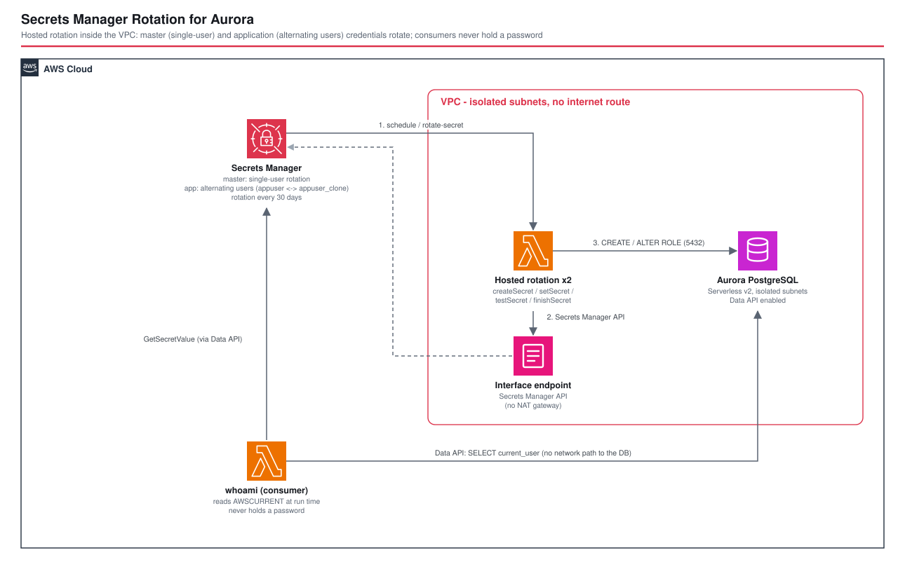

# Secrets Manager Rotation for Aurora - AWS CDK Reference Architecture

[](./README.ja.md)
[](./README.md)

> **Level: 300 (Intermediate)**

Automatic credential rotation for **Aurora PostgreSQL (Serverless v2)** with **AWS Secrets Manager hosted rotation**, using both strategies AWS offers:

| Secret | Strategy | Why |
|---|---|---|
| **master** (`dbadmin`) | **single-user** — the user changes its own password | the admin user cannot be cloned (cloning needs an admin) |
| **application** (`appuser`) | **alternating users** — `appuser` ↔ `appuser_clone` | one user is always valid, so consumers holding the previous credentials keep working |

Everything runs in **isolated subnets with no NAT gateway**: the hosted rotation functions reach the Secrets Manager API through a VPC interface endpoint. The sample consumer uses the **RDS Data API**, so it never holds a password and needs no network path to the database.

## 📑 Table of Contents

- [Architecture Overview](#-architecture-overview)
- [Design Decisions & Best Practices](#-design-decisions--best-practices)
- [Well-Architected Alignment](#-well-architected-alignment)
- [Cost Optimization](#-cost-optimization)
- [Security Considerations](#-security-considerations)
- [Prerequisites](#-prerequisites)
- [Deployment Guide](#-deployment-guide)
- [Operational Check Script](#-operational-check-script)
- [Testing Strategy](#-testing-strategy)
- [Customization](#-customization)
- [Troubleshooting](#-troubleshooting)
- [Clean-up](#-clean-up)
- [References](#-references)

## 🏗️ Architecture Overview



### Key Components

- **VPC** — 2 AZs, private isolated subnets only, no NAT gateway, REJECT flow logs; **Secrets Manager interface endpoint** (private DNS) for the rotation functions.
- **Aurora PostgreSQL 16 Serverless v2** — writer only, encrypted, IAM authentication on, **Data API enabled**, backup retention 1 day (7 outside dev), deletion protection outside dev.
- **Master secret** (`<project>-<env>-rot/master`) — generated for `dbadmin`, attached to the cluster, **single-user hosted rotation** every 30 days.
- **Application secret** (`<project>-<env>-rot/app`) — a `DatabaseSecret` for `appuser` whose JSON carries the master secret's ARN (`masterarn`); **multi-user (alternating) hosted rotation** every 30 days.
- **Hosted rotation** — Secrets Manager-managed rotation functions (`createSecret` / `setSecret` / `testSecret` / `finishSecret`); no code to write or patch. They run in the isolated subnets with a dedicated security group (443 to the endpoint, 5432 to the database — nothing else).
- **`whoami` Lambda** (Node.js 24 / ARM64, **not** in the VPC) — runs `SELECT current_user` through the Data API with the application secret; IAM: `rds-data:ExecuteStatement` on the cluster and `secretsmanager:GetSecretValue` on that one secret.

### Architecture Characteristics

| Characteristic | Value | Rationale |
|---|---|---|
| Rotation interval | 30 days (parameter), not rotated at deploy time | scheduled by Secrets Manager; the check script triggers rotations explicitly |
| Network | no internet route, no NAT | the only egress the rotation needs is the Secrets Manager endpoint |
| Consumer model | reads the secret at run time | rotation needs no redeploy, restart or cache-invalidation code in the consumer |
| Blast radius | rotation functions can only reach the endpoint and the DB port | dedicated security group, `allowAllOutbound: false` |

## 🎯 Design Decisions & Best Practices

### 1. Two strategies, chosen per credential

**Single-user** overwrites the user's own password, so there is a short window in which connections opened with the old password can fail after the change. Use it where you cannot clone a user — the master user. **Alternating users** keeps two database users (`appuser`, `appuser_clone`): a rotation sets a new password on the *idle* user and flips `AWSCURRENT` to it, while the other user keeps its previous, still-valid password. Use it for application credentials.

### 2. The application user has to exist before the first rotation

`DatabaseSecret` only creates a *secret*; CloudFormation does not create the database role. The check script's bootstrap step creates `appuser` (with the secret's initial password) using the master credentials through the Data API — in a real deployment this is part of your schema/migration step. **Until the role exists, an application rotation fails.** This is why rotation is not triggered at deploy time (`rotateImmediatelyOnUpdate: false`).

### 3. Multi-user rotation needs `masterarn` in the secret

The rotation function finds the admin credentials from the `masterarn` field of the application secret. `DatabaseSecret({ masterSecret })` writes it; `HostedRotation.postgreSqlMultiUser({ masterSecret })` grants the function access to that secret. A unit test asserts the field is present.

### 4. No NAT gateway: an interface endpoint for Secrets Manager

The hosted rotation functions run in the VPC and must call the Secrets Manager API. A NAT gateway would work (it bills hourly plus per GB) but opens an internet route for a function that needs exactly one destination. The interface endpoint keeps the subnets truly isolated and avoids the NAT charges. The rotation security group is allowed to reach it on 443.

### 5. Consumers must not cache credentials forever

The Data API resolves the secret's credentials for you — but it **caches them for a few minutes**. Measured here (three rotations): after `AWSCURRENT` flipped, the consumer kept connecting as the *old* user for about 2.4, 3.4 and 3.7 minutes before switching to the new one. Two consequences: (1) with alternating users the old credentials stay valid, so this window causes **zero failed queries** (asserted by the check script — every sample in the window is a successful query as the old or the new user); (2) with single-user rotation the same window would mean failures, which is exactly why alternating users exist. If your consumer opens its own connections, re-read the secret on authentication failure (or on a timer shorter than the rotation window) and retry once.

### 6. Aurora Serverless v2, writer only

`serverlessV2MinCapacity: 0.5` keeps the reference cheap and always-on for the checks. The Data API works on Serverless v2 with PostgreSQL 16.

### 7. Force-delete the secrets after `cdk destroy`

CloudFormation deletes a secret with a recovery window that **reserves its name**; redeploying the same stack fails until the window ends. `test-rotation.sh --destroy` force-deletes both secrets after the stack is gone. (Do not do this in production — the recovery window is a safety net.)

### 8. Environment-specific parameters

`minCapacity`, `maxCapacity`, `rotationDays`, `appUsername`, `databaseName` in `parameters/<env>-params.ts`.

## 🏛️ Well-Architected Alignment

| Pillar | Implementation |
|---|---|
| **Operational Excellence** | Rotation is a managed feature; `test-rotation.sh` runs real rotations and proves the credentials work; flow logs for rejected traffic |
| **Security** | No long-lived shared password; alternating-user rotation; isolated subnets, no internet route; encrypted storage; Data API consumer holds no secret; least-privilege consumer IAM; dedicated rotation security group |
| **Reliability** | Alternating users avoid a credential-change outage; Serverless v2 scales; backups |
| **Performance Efficiency** | Serverless v2 capacity follows load; rotation runs off the request path |
| **Cost Optimization** | No NAT gateway; hosted rotation (no code, pay per use); small ACU range |
| **Sustainability** | Elastic database capacity; nothing running for rotation between schedules |

## 💰 Cost Optimization

Estimates, ap-northeast-1 — **verify the rates on the pricing pages**:

```
Aurora Serverless v2:  0.5 ACU minimum x 730 h x (ACU-hour rate, ~$0.12-0.20)   ≈ $45-75 / month  (dominant cost)
                       + storage and I/O (small)
Interface endpoint:    2 AZs x 730 h x (~$0.014/h, verify) + data                  ≈ $20 / month
Secrets Manager:       2 secrets x $0.40 + API calls                               ≈ $1 / month
Hosted rotation:       2 functions, one invocation per rotation step (4)           ≈ pennies
Flow logs / CloudWatch Logs: small
------------------------------------------------------------------------------------------------
≈ $70-100 / month while running.  For the verification run (a few hours) ≈ a few dollars.
```

Levers: Aurora Serverless v2 supports scaling to 0 ACU with auto-pause (adds resume latency); a single-AZ endpoint saves half the endpoint cost in dev; **delete the stack after use** (`--destroy`) — the database and the endpoint bill by the hour.

## 🔒 Security Considerations

### Implemented
- ✅ Automatic rotation of both secrets; alternating users for the application credential
- ✅ Isolated subnets, no NAT/IGW; rotation SG limited to 443 (endpoint) and the DB port
- ✅ Storage encryption, IAM authentication enabled, deletion protection outside dev
- ✅ Consumer never holds a password; scoped IAM (`ExecuteStatement` on the cluster, `GetSecretValue` on one secret)
- ✅ REJECT flow logs

### CDK Nag suppressions (with reasons)

| Rule | Why |
|---|---|
| `AwsSolutions-RDS10` | deletion protection is environment-dependent (off in dev/test so the stack can be destroyed, on in production); a unit test asserts both |
| `CdkNagValidationFailure` (EC23) | the endpoint rule's source is the VPC CIDR, a CloudFormation token the rule cannot evaluate; only 443 from inside the VPC is allowed |
| `AwsSolutions-IAM4` / `IAM5` / `L1` | library-generated flow-log/log-retention roles and hosted rotation components are managed by CDK/AWS |
| `AwsSolutions-RDS6` | IAM authentication is on; the secrets-based path is the point of this pattern |

### Out of scope (add per environment)
- A customer-managed KMS key for the secrets and the cluster, cross-Region replication of the secret, rotation-failure alarms (e.g. an EventBridge rule on the CloudTrail `RotationFailed` event → SNS), a read replica, and least-privilege database grants for `appuser` beyond `CONNECT`/`USAGE`.

## 📋 Prerequisites

- AWS account bootstrapped for CDK; AWS CLI v2 with a profile named `${PROJECT}-${ENV}`; Node.js 20+; `jq` and `sha256sum` for the check script
- **Aurora PostgreSQL 16.13** and the **RDS Data API** available in the target Region (Serverless v2)
- Expect **~10 minutes** to create the cluster

## 🚀 Deployment Guide

```bash
cd infrastructure
npm install
export PROJECT=<project> ENV=dev

npm run bootstrap        -w workspaces/secrets-rotation-aurora   # first time only
npm run synth            -w workspaces/secrets-rotation-aurora
npm run stage:deploy:all -w workspaces/secrets-rotation-aurora
```

Then create the application role once (also done by the check script) and trigger a rotation:

```bash
CLUSTER=<ClusterArn output>; MASTER=<MasterSecretArn output>; APP=<AppSecretArn output>
PW=$(aws secretsmanager get-secret-value --secret-id $APP --query SecretString --output text | jq -r .password)
aws rds-data execute-statement --resource-arn $CLUSTER --secret-arn $MASTER --database appdb --sql "CREATE ROLE appuser LOGIN PASSWORD '$PW'"
aws secretsmanager rotate-secret --secret-id $APP
```

## 🧪 Operational Check Script

A rotation that cannot reach the database or the Secrets Manager API fails only when it runs — possibly weeks after deployment. [`test-rotation.sh`](./test-rotation.sh) runs the rotations for real:

```bash
./test-rotation.sh --project <project> --env dev            # verify
./test-rotation.sh --project <project> --env dev --destroy  # ... then delete the stack and force-delete its secrets
```

It (0) creates `appuser`; asserts rotation is enabled every 30 days on both secrets; (1) the consumer connects as the user in `AWSCURRENT`; (2) rotates the application secret and asserts a **new version**, the secret **names the other user**, a **new password** (compared by fingerprint, never printed), the previous credentials as `AWSPREVIOUS`, both database roles existing, the consumer **switching to the new user with no redeploy** (after a few minutes) and **zero failed queries** in between; (3) rotates again and asserts the users **alternate**; (4) rotates the master secret and asserts a new password that **still works** (`current_user = dbadmin`). Requires `aws`, `jq`, `sha256sum`; takes ~10–15 minutes.

## 🧪 Testing Strategy

```bash
npm test -w workspaces/secrets-rotation-aurora   # 18 tests
```

| Type | Covers |
|---|---|
| Snapshot (2) | template + resource counts (Lambda asset hashes normalised) |
| Unit (14) | no NAT/IGW, endpoint, flow logs, cluster settings (Serverless v2, Data API, encryption), deletion protection per environment, DB ingress only from the rotation SG, both rotation schedules (interval, no rotation at deploy), single-user vs multi-user + `masterarn`, secret names, consumer not in the VPC, consumer IAM |
| Compliance (2) | CDK Nag `AwsSolutions` |
| Operational | `test-rotation.sh` against a deployed stack |

## ⚙️ Customization

- **Other engines**: `HostedRotation.mysqlMultiUser` / `mysqlSingleUser`, `oracle…`, `sqlServer…`, `mariaDb…`, `mongoDb…`; the pattern is identical.
- **Rotation window**: `rotationDays`; use `rotationLambda`/`hostedRotation` `Duration`-based schedule with `automaticallyAfter`, or a cron `ScheduleExpression` for a maintenance window.
- **Your own rotation function**: `secret.addRotationSchedule('X', { rotationLambda })` for non-database secrets (API keys).
- **Consumers with connections**: re-read the secret on auth failure, or use the AWS Secrets Manager caching client (it has a configurable TTL — keep it shorter than your tolerance for stale credentials).
- **Multi-Region**: replicate the secret (`replicaRegions`) for a disaster-recovery cluster.

## 🔧 Troubleshooting

### The application rotation fails at `setSecret`
The database role does not exist (see Design Decision 2), or the master secret cannot be read (`masterarn` missing / no permission). Check the rotation function's log group (`/aws/lambda/<project>-<env>-rot-app-rotation`).

### The rotation times out
The function cannot reach the Secrets Manager API or the database: check the interface endpoint (private DNS on), the rotation security group's 443/5432 rules, and that the function runs in the isolated subnets.

### The consumer still uses the old user after rotation
The RDS Data API caches the secret for a few minutes (2–4 minutes measured). With alternating users the old credentials still work in that window; wait and retry.

### `cdk deploy` fails: "secret ... is scheduled for deletion"
A previous stack's secret is in its recovery window and reserves the name. Force-delete it: `aws secretsmanager delete-secret --secret-id <name> --force-delete-without-recovery` (dev only).

### `cdk deploy` fails with "no credentials" after a while
The bundled CDK cannot refresh an expired SSO token; export short-lived credentials (`aws configure export-credentials --format env`) or `aws sso login`.

## 🧹 Clean-up

```bash
./test-rotation.sh --project $PROJECT --env $ENV --destroy   # or: npm run stage:destroy:all, then force-delete the two secrets
```

Deleting the cluster takes several minutes; the two secrets are force-deleted so the names can be reused.

## 📚 References

### AWS Documentation
- [Rotate AWS Secrets Manager secrets](https://docs.aws.amazon.com/secretsmanager/latest/userguide/rotating-secrets.html)
- [Rotation strategies: single user vs alternating users](https://docs.aws.amazon.com/secretsmanager/latest/userguide/rotating-secrets_strategies.html)
- [Using the RDS Data API](https://docs.aws.amazon.com/AmazonRDS/latest/AuroraUserGuide/data-api.html)
- [Secrets Manager VPC endpoint](https://docs.aws.amazon.com/secretsmanager/latest/userguide/vpc-endpoint-overview.html)

### Related Architectures
- [alb-keycloak-auth](../alb-keycloak-auth/) — Aurora Serverless behind an application (credentials in a generated secret)
- [fis-arch-a-ecs-aurora](../fis-arch-a-ecs-aurora/) — ECS + Aurora
- [cognito-apigw-auth](../cognito-apigw-auth/) — managed identity for an API

## 📄 License

This project is licensed under the MIT License — see the [LICENSE](../../LICENSE) file for details.

## 👥 Contributing

Contributions are welcome! Please read [CONTRIBUTING.md](../../CONTRIBUTING.md) for details.

## 🏆 About This Reference Architecture

**Target Level**: 300 (Intermediate)

---

**Note**: This is a reference implementation. Add a customer-managed key, rotation-failure alerting and least-privilege database grants before production use, and remember the cluster and endpoint bill hourly.
