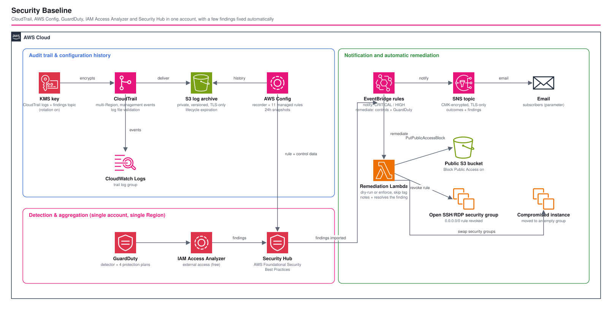

# Security Baseline: CloudTrail, Config, GuardDuty, Access Analyzer & Security Hub - AWS CDK Reference Architecture

[](./README.ja.md)
[](./README.md)


> ✅ **Deploy-verified** (2026-10-01). Every resource in this stack — CloudTrail, AWS Config (recorder, delivery channel, 11 managed rules), GuardDuty, IAM Access Analyzer and Security Hub — was deployed to a real AWS account, confirmed actually working via live AWS CLI checks, and destroyed cleanly. Two real deploy-time bugs were found and fixed in the process; see [Observed Results](#-observed-results) below.

A **single-account security baseline**: an audit trail (**CloudTrail**), configuration history and rules (**AWS Config**), threat detection (**GuardDuty**), external/unused-access analysis (**IAM Access Analyzer**), and one place to read all findings (**Security Hub**), all in one CDK stack. **Detection and notification, not prevention**: nothing here blocks an action or remediates a finding; new high-severity findings are emailed through EventBridge and SNS.

| Service | What this stack creates |
|---|---|
| **CloudTrail** | One multi-Region trail (management events, global service events, log file validation) → S3 (KMS-encrypted objects) and CloudWatch Logs |
| **AWS Config** | Recorder (all supported types, including global), delivery channel to the same bucket, 11 managed rules |
| **GuardDuty** | Detector with S3, EBS malware, RDS login and Lambda network protection plans (each a parameter) |
| **IAM Access Analyzer** | Account-scoped external-access analyzer; optional unused-access analyzer (paid, off in `dev`) |
| **Security Hub** | Hub subscribed to AWS Foundational Security Best Practices (extra standards via a parameter) |
| **Notification** | EventBridge rule on new, active `CRITICAL`/`HIGH` Security Hub findings → SNS topic (CMK-encrypted, TLS-only) → email; retries plus a DLQ |
| **Log archive** | One private, versioned, TLS-only S3 bucket with lifecycle expiration, and a CMK with rotation (also encrypts the findings topic) |

## 📑 Table of Contents

- [Architecture Overview](#️-architecture-overview)
- [Design Decisions & Best Practices](#-design-decisions--best-practices)
- [Well-Architected Alignment](#️-well-architected-alignment)
- [Cost Optimization](#-cost-optimization)
- [Security Considerations](#-security-considerations)
- [Observed Results](#-observed-results)
- [Prerequisites](#-prerequisites)
- [Deployment Guide](#-deployment-guide)
- [Testing Strategy](#-testing-strategy)
- [Customization](#-customization)
- [Clean-up](#-clean-up)
- [References](#-references)

## 🏗️ Architecture Overview



### Key Components

- **`LogArchiveConstruct`** — the shared S3 bucket (block public access, versioning, `enforceSSL`, bucket-owner-enforced ownership, expiration after `logArchiveExpirationDays`) and the KMS key.
- **`CloudTrailConstruct`** — `cloudtrail.Trail`, multi-Region, delivered under the `cloudtrail/` prefix, log files encrypted with the CMK, CloudWatch Logs group with a parameterized retention.
- **`ConfigConstruct`** — recorder role (AWS managed `AWS_ConfigRole`), bucket-policy statements for Config delivery, the recorder/delivery channel/start-recording call (as `AwsCustomResource` SDK calls, not native CFN resources — see [Observed Results](#-observed-results)) and the managed rules.
- **`GuardDutyConstruct`**, **`AccessAnalyzerConstruct`**, **`SecurityHubConstruct`** — one detector, up to two analyzers, one hub plus one `AWS::SecurityHub::Standard` per subscribed standard.
- **`NotificationConstruct`** — the rule on Security Hub findings, the SNS topic and its email subscriptions, and a DLQ for events that cannot be delivered. It also extends the CMK's key policy so EventBridge can publish to the encrypted topic.
- **`SecurityBaselineStack`** — wires the constructs together and orders them: Config before the hub, GuardDuty and Access Analyzer before the hub.

### Managed Config rules

`S3_BUCKET_LEVEL_PUBLIC_ACCESS_PROHIBITED`, `S3_BUCKET_PUBLIC_READ_PROHIBITED`, `S3_BUCKET_SSL_REQUESTS_ONLY`, `ROOT_ACCOUNT_MFA_ENABLED`, `IAM_ROOT_ACCESS_KEY_CHECK`, `IAM_USER_NO_POLICIES_CHECK`, `ACCESS_KEYS_ROTATED`, `CLOUD_TRAIL_ENABLED`, `EBS_ENCRYPTED_VOLUMES`, `RDS_STORAGE_ENCRYPTED`, `INCOMING_SSH_DISABLED`.

## 🎯 Design Decisions & Best Practices

### 1. Observe and tell a person; do not change anything

Every service here observes. Nothing blocks (no SCPs, no preventive controls) or remediates (no auto-remediation). A baseline that silently changes resources is a surprise in a shared account. The only outward action is an email about a new high-severity finding; everything else is read in Security Hub.

### 2. One bucket for CloudTrail and Config

One archive means one lifecycle, one bucket policy and one place to look. CloudTrail objects are encrypted with the CMK; Config objects use the bucket default (SSE-S3). Making Config use the CMK too would need key-policy or grant changes for the Config delivery path and is left as a hardening step.

### 3. The trail is multi-Region, the rest is one Region

A trail is cheap to make multi-Region and closes the "activity in a Region nobody looks at" gap. GuardDuty, Config, Security Hub and Access Analyzer are **per Region**: deploy the stack in each Region you use (or move to an organization-level design, see [Customization](#-customization)).

### 4. Security Hub after its producers

The hub depends on the Config recorder (Security Hub controls read Config data) and on GuardDuty and Access Analyzer, so the producers exist first. `enableDefaultStandards` is `false` on the hub so the standards subscribed are exactly the ones declared in the stack.

### 5. Paid options are parameters, and default to the cheaper choice

GuardDuty protection plans are individual booleans. The unused-access analyzer is billed per IAM role and user analyzed and is **off** in `dev`. Runtime Monitoring is not offered because it requires an agent rollout and is a separate decision.

### 6. Real managed-rule identifiers, checked by tests

Each managed rule is asserted by its `SourceIdentifier`, and every rule and the delivery channel is asserted to depend on the recorder. One identifier (`INCOMING_SSH_DISABLED`) has no CDK constant and is passed as a string.

### 7. One rule on Security Hub covers every source

GuardDuty, AWS Config and IAM Access Analyzer findings all reach Security Hub, so a single rule on Security Hub findings notifies for all of them. It matches only **new, active** findings at the configured severities (`CRITICAL` and `HIGH` by default), so a finding that is later resolved or suppressed does not page anyone again. The message is a short text (severity, title, account, Region, product, resource, finding ID) instead of the raw event.

### 8. The topic is encrypted, so the key policy must allow EventBridge

An SNS topic encrypted with a customer managed key only accepts events from EventBridge if the key policy allows `events.amazonaws.com`. The stack adds that statement, scoped to this account (`aws:SourceAccount`) rather than to the rule ARN, which would make the key depend on the rule that depends on the topic that depends on the key.

### 9. Bounded retries, then a DLQ

Delivery to the topic retries up to 3 times for at most 60 minutes; what still fails lands in a DLQ (SQS, SSE, TLS-only, 14-day retention). Without it, a delivery failure would silently drop the finding.

### 10. Environment-specific parameters

`logArchiveExpirationDays`, `trailLogGroupRetentionDays`, `guardDuty.*`, `additionalSecurityHubStandardArns`, `enableUnusedAccessAnalyzer`, `unusedAccessAgeDays`, `notification.severities`, `notification.emails` in `parameters/<env>-params.ts`.

## 🏛️ Well-Architected Alignment

| Pillar | Implementation |
|---|---|
| **Operational Excellence** | Everything as code; new high-severity findings are emailed; Config history answers "what changed"; snapshot and unit tests pin the shape |
| **Security** | Audit trail with integrity validation; CMK with rotation; private, TLS-only archive; threat detection; Foundational Security Best Practices |
| **Reliability** | Multi-Region trail; versioned archive; bounded retries and a DLQ for notifications; no compute to fail |
| **Performance Efficiency** | Managed services only; no compute |
| **Cost Optimization** | Paid options are opt-in parameters; lifecycle expiration bounds storage |
| **Sustainability** | No compute; retention bounded by parameter |

## 💰 Cost Optimization

**No monthly total is given.** Unit prices for these services differ by Region and by volume. What drives the cost:

| Service | Billed by | Lever |
|---|---|---|
| CloudTrail | Events delivered beyond the free copy of management events; CloudWatch Logs ingestion and storage for the log group | Management events only (no data events); `trailLogGroupRetentionDays` |
| AWS Config | Configuration items recorded and rule evaluations | Recording all resource types is the most expensive choice in a busy account; narrow the recording group or the rule set |
| GuardDuty | Analyzed log/event volume per protection plan | The four `guardDuty.*` booleans |
| Security Hub | Security checks and finding ingestion | Number of subscribed standards |
| Access Analyzer | External access is free; unused access is billed per IAM role/user analyzed | `enableUnusedAccessAnalyzer` |
| S3 | Storage, requests | `logArchiveExpirationDays` |
| EventBridge | Events from AWS services on the default bus are not billed by EventBridge | — |
| SNS / SQS | Email deliveries and requests (small at expected finding volumes) | Severity filter in `notification.severities` |
| KMS | Key and requests | — |

Check the current rates for your Region on the pricing pages: [CloudTrail](https://aws.amazon.com/cloudtrail/pricing/), [Config](https://aws.amazon.com/config/pricing/), [GuardDuty](https://aws.amazon.com/guardduty/pricing/), [Security Hub](https://aws.amazon.com/security-hub/pricing/), [IAM Access Analyzer](https://aws.amazon.com/iam/access-analyzer/pricing/).

## 🔒 Security Considerations

### Implemented
- ✅ CloudTrail log file validation, CMK encryption with rotation, multi-Region coverage
- ✅ Archive bucket: block public access, versioning, TLS-only, bucket-owner-enforced ownership
- ✅ Config delivery permitted to `config.amazonaws.com` only, for this account (`aws:SourceAccount`), `bucket-owner-full-control`, on the `config/` prefix only
- ✅ Findings from GuardDuty, Config and Access Analyzer aggregated in Security Hub
- ✅ Findings topic encrypted with the CMK, TLS-only; the key policy admits EventBridge for this account only

### CDK Nag suppressions (with reasons)

| Rule | Where | Why |
|---|---|---|
| `AwsSolutions-S1` | archive bucket | It is the terminal audit archive; server access logs would need a second bucket that itself needs logging |
| `AwsSolutions-SQS3` | findings DLQ | It is itself the dead-letter destination for undeliverable findings; a DLQ for the DLQ adds nothing |
| `AwsSolutions-IAM4` | Config recorder role | `AWS_ConfigRole` is the AWS managed policy documented for the recorder role and is maintained as new resource types appear |

### Out of scope (add per environment)
- **Chat integrations** (AWS Chatbot / Slack), paging, and **remediation**.
- **Organization-wide** enablement (delegated administrators, auto-enable for member accounts).
- **Preventive** controls (SCPs, permission boundaries) and CloudTrail **data events**.
- **Config with the CMK**, S3 **Object Lock** on the archive.

## ✅ Observed Results

Deploy-verified end-to-end on 2026-10-01: `cdk deploy '**'` reached `CREATE_COMPLETE`, every service was confirmed live via AWS CLI, and `cdk destroy '**'` tore everything down cleanly afterward. Two real bugs surfaced only at deploy time — neither was caught by `cdk synth`, unit tests, snapshot tests, or CDK Nag:

- **CloudTrail needs an explicit KMS key-policy grant.** Passing a customer managed key as `encryptionKey` to `cloudtrail.Trail` does **not** get CloudTrail permission to use it — the `Trail` construct only manages the *bucket* policy automatically, never the key policy. Deploy failed with `Insufficient permissions to access S3 bucket ... or KMS key ...` until `CloudTrailConstruct` added `kms:GenerateDataKey*` (scoped by `kms:EncryptionContext:aws:cloudtrail:arn`) and `kms:DescribeKey` statements for `cloudtrail.amazonaws.com`. Confirmed fixed via `aws cloudtrail get-trail-status` returning `IsLogging: true`.
- **`AWS::Config::ConfigurationRecorder` / `AWS::Config::DeliveryChannel` cannot be created as native CloudFormation resources at all.** CloudFormation's own handler for the recorder calls `StartConfigurationRecorder` as part of its create-time check, which needs the delivery channel to already exist — but the channel's own creation needs the recorder to already exist. Neither declaration order works; whichever resource is created second fails outright, and the other eventually fails with `did not stabilize`. This reproduced identically across two independent AWS accounts, ruling out an account-specific fluke. **Fix**: `ConfigConstruct` now creates the recorder, delivery channel, and start-recording call through three `AwsCustomResource` SDK calls, in the only order that actually works, instead of the `CfnConfigurationRecorder`/`CfnDeliveryChannel` L1 resources. See [`docs/knowledge/aws-service-gotchas.md`](../../../docs/knowledge/aws-service-gotchas.md) for the full root-cause writeup (the exact CloudTrail API sequence that proves it).
- A related, smaller bug found during the same deploy: the `ACCESS_KEYS_ROTATED` managed Config rule needs an explicit `inputParameters: { maxAccessKeyAge: '90' }` — without it, rule creation fails with `required parameter [maxAccessKeyAge] is not present`, a requirement the identifier name gives no hint of.

What was confirmed live, beyond "the stack reached `CREATE_COMPLETE`":

| Service | Confirmed via | Result |
|---|---|---|
| CloudTrail | `aws cloudtrail get-trail-status` | `IsLogging: true`, CloudWatch Logs delivery timestamp present |
| AWS Config | `aws configservice describe-configuration-recorder-status` | `"recording": true, "lastStatus": "SUCCESS"`; all 11 managed rules created |
| GuardDuty | `aws guardduty list-detectors` | One detector created |
| IAM Access Analyzer | `aws accessanalyzer list-analyzers` | `status: ACTIVE`, had already analyzed the log archive bucket |
| Security Hub | `aws securityhub describe-hub` / `get-enabled-standards` | Hub subscribed; AWS Foundational Security Best Practices standard in `PENDING` (normal right after enabling) |
| Teardown | `cdk destroy '**'` then re-running each `describe-*`/`list-*` above | Every resource gone, including the Config recorder/channel (stopped before the channel was deleted — see the gotcha above) |

### Still not covered by this verification

- **The notification event shape was not checked against a live Security Hub finding.** The EventBridge rule matches the documented `Security Hub Findings - Imported` shape, but no GuardDuty sample finding was generated during this verification to confirm an end-to-end email delivery.
- **Retained resources in production.** With `isAutoDeleteObject: false` (production), the bucket and key are retained on stack deletion — this was verified with `isAutoDeleteObject: true` (the `dev` default) only.
- **Only one Region, one account was exercised.** The services here are per-account-and-Region singletons (see [Prerequisites](#-prerequisites)); deploying into a Region or account with a pre-existing GuardDuty detector, Security Hub hub, or Config recorder/channel was not tested (expected to fail with an already-exists error, per AWS's documented singleton behavior).

## 📋 Prerequisites

- AWS account bootstrapped for CDK; AWS CLI v2 with a profile named `${PROJECT}-${ENV}`; Node.js 20+
- **No existing** GuardDuty detector, Security Hub hub, or Config recorder/delivery channel in the target Region — these are account-and-Region singletons

## 🚀 Deployment Guide

```bash
cd infrastructure
npm install
export PROJECT=<project> ENV=dev

npm run bootstrap        -w workspaces/security-baseline   # first time only
npm run synth            -w workspaces/security-baseline
npm run stage:deploy:all -w workspaces/security-baseline
```

After deployment, confirm the subscription email (if `notification.emails` is set) and read findings in the Security Hub console. Foundational GuardDuty detection has no configuration; the fastest way to see a finding is GuardDuty's sample-findings feature in the console.

## 🧪 Testing Strategy

```bash
npm test -w workspaces/security-baseline   # 36 tests
```

| Type | Covers |
|---|---|
| Snapshot (2) | Template and resource counts |
| Unit (32) | Archive hardening and removal policy per environment, trail properties and its KMS key-policy grant, Config recorder/channel/start-recording (`AwsCustomResource`) and their ordering, the `ACCESS_KEYS_ROTATED` input parameter, bucket policy/rules, GuardDuty features (including disabled ones), both analyzers, hub, standards and ordering, the findings rule pattern, severity parameter, topic encryption and TLS, key policy for EventBridge, retries and DLQ, message fields, subscriptions, outputs |
| Compliance (2) | CDK Nag `AwsSolutions` |

## 🔄 Customization

- **More Config rules**: add identifiers to `MANAGED_RULES` in `lib/constructs/config-construct.ts`.
- **More standards**: `additionalSecurityHubStandardArns` (copy the ARN from the Security Hub console for your Region).
- **Other Regions**: deploy the stack per Region.
- **Organization**: for many accounts, use delegated administrators and organization-level enablement instead of per-account stacks.
- **Notification**: set `notification.emails`, and widen or narrow `notification.severities`. To reach chat, subscribe AWS Chatbot to the topic.

## 🧹 Clean-up

```bash
npm run stage:destroy:all -w workspaces/security-baseline
```

The archive bucket and key are deleted in non-production (`isAutoDeleteObject: true`) and retained in production.

## 📚 References

### AWS Documentation
- [AWS CloudTrail User Guide](https://docs.aws.amazon.com/awscloudtrail/latest/userguide/cloudtrail-user-guide.html)
- [AWS Config Developer Guide](https://docs.aws.amazon.com/config/latest/developerguide/WhatIsConfig.html)
- [Amazon GuardDuty User Guide](https://docs.aws.amazon.com/guardduty/latest/ug/what-is-guardduty.html)
- [IAM Access Analyzer](https://docs.aws.amazon.com/IAM/latest/UserGuide/what-is-access-analyzer.html)
- [AWS Security Hub](https://docs.aws.amazon.com/securityhub/latest/userguide/what-is-securityhub.html)

### Related Architectures
- [iam-basics](../iam-basics/) — IAM roles, policies and users
- [s3-basics](../s3-basics/) — S3 bucket hardening options
- [eventbridge-custom-bus](../eventbridge-custom-bus/) — EventBridge rules, targets, retries and DLQs in depth

## 📄 License

This project is licensed under the MIT License — see the [LICENSE](../../LICENSE) file for details.

## 🏆 About This Reference Architecture

**Target Level**: 200 (Intermediate)

---

**Note**: Deploy-verified end-to-end (see [Observed Results](#-observed-results)). Add organization-level enablement and preventive controls before relying on it in production.
