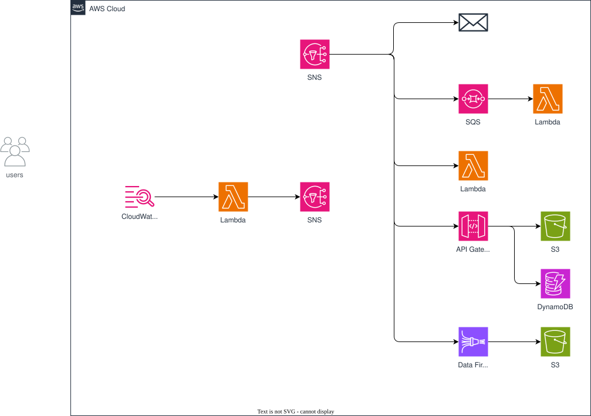

# SNS Basic - AWS CDK Reference Architecture

*Read this in other languages:* [](./README.ja.md) [](./README.md)

> **Level: 200 (Intermediate)**

A single Amazon SNS topic fanned out to every commonly-used subscription protocol (Email, SQS, Lambda, HTTPS via API Gateway, Amazon Data Firehose), plus a second "CloudWatch Logs → Lambda → SNS → Lambda" chain that shows SNS used as a lightweight internal alerting hop. All Lambda functions are Python with structured JSON logging at INFO level.

## 📑 Table of Contents

- [Architecture Overview](#-architecture-overview)
- [Design Decisions & Best Practices](#-design-decisions--best-practices)
- [Cost Optimization](#-cost-optimization)
- [Security Considerations](#-security-considerations)
- [Prerequisites](#-prerequisites)
- [Deployment Guide](#-deployment-guide)
- [Testing Strategy](#-testing-strategy)
- [Customization](#-customization)
- [Troubleshooting](#-troubleshooting)
- [References](#-references)

## 🏗️ Architecture Overview



```text
MainTopic (SNS)
  ├─ Email subscription
  ├─ SQS (MessageQueue, DLQ) ────────────► Lambda: sqs-message-logger
  ├─ Lambda (direct subscription) ───────► Lambda: sns-message-logger
  ├─ HTTPS (API Gateway) ─────────────────► Lambda: sns-http-endpoint ──► S3 (PayloadBucket)
  │                                                                   └─► DynamoDB (PayloadTable)
  └─ Amazon Data Firehose ────────────────► S3 (FirehoseArchiveBucket)   [no Lambda involved]

AppLogGroup (CloudWatch Logs, demo source)
  └─ Subscription Filter ─────────────────► Lambda: cwlogs-to-sns
                                                  └─► LogAlertTopic (SNS)
                                                        └─ Lambda (direct subscription) ─► Lambda: log-alert-notifier
```

### Key Components

- **MainTopic (SNS)** – single topic demonstrating four subscription protocols side by side
- **MessageQueue (SQS + DLQ)** – decouples a slow/unreliable consumer from the topic; failed deliveries land in a dead-letter queue after 3 attempts
- **API Gateway (REGIONAL) + Lambda** – confirms the SNS HTTPS subscription and persists notifications to S3 and DynamoDB
- **Amazon Data Firehose** – buffers and batches raw messages straight to S3 with no Lambda in the path
- **AppLogGroup + Subscription Filter** – a demo CloudWatch Logs source feeding a second, independent SNS topic used purely for alerting
- **5 Python Lambda functions** – `sqs-message-logger` / `sns-message-logger` / `log-alert-notifier` just log the event (INFO, JSON); `sns-http-endpoint` and `cwlogs-to-sns` contain the actual business logic

### Architecture Characteristics

| Characteristic | Value | Rationale |
|---|---|---|
| Availability | Fully managed, multi-AZ by default | SNS/SQS/Lambda/API Gateway/DynamoDB/Firehose are all regional managed services |
| Scalability | Automatic | No provisioned capacity anywhere (DynamoDB PAY_PER_REQUEST, Lambda, SNS, SQS, Firehose all scale automatically) |
| Security | Encrypted in transit and at rest everywhere | `enforceSSL` on SNS/SQS/S3, AWS-managed KMS key for SNS, `TableEncryption.AWS_MANAGED` for DynamoDB |
| Cost | Pay-per-use | No idle fixed costs; see [Cost Optimization](#-cost-optimization) |

## 🎯 Design Decisions & Best Practices

### 1. SNS → API Gateway as an HTTPS subscription

**Decision**: Model the "SNS → API Gateway → S3/DynamoDB" leg of the architecture as a native SNS **HTTPS subscription** (`UrlSubscription`) pointing at an API Gateway endpoint, rather than putting API Gateway in front of the topic.

**Rationale**:
- ✅ Matches how SNS actually integrates with arbitrary HTTP(S) endpoints in the real world (webhooks, third-party systems)
- ✅ Keeps API Gateway as a pure backend-for-a-subscriber, reusable for any other HTTPS-based fan-out
- ✅ Demonstrates the subscription confirmation handshake that most SNS webhook integrations must implement

**Trade-offs**:
- ❌ The Lambda must implement `SubscriptionConfirmation` handling (fetch `SubscribeURL`) — extra code compared to a plain Lambda subscription
- ❌ SNS cannot use IAM/Cognito authorization against HTTPS endpoints, so the endpoint is effectively public (mitigated — see [Security Considerations](#-security-considerations))

### 2. Firehose subscription for the "no Lambda" path

**Decision**: Subscribe an Amazon Data Firehose delivery stream directly to the topic (`FirehoseSubscription`) to land raw messages in S3.

**Rationale**:
- ✅ Shows that not every SNS fan-out leg needs a Lambda — Firehose batches and writes to S3 with zero custom code
- ✅ Lower cost per message at high volume than a Lambda-per-message pattern
- ✅ Firehose applies its own buffering (`bufferingInterval`/`bufferingSize`), reducing the number of S3 PUT requests

**Trade-offs**:
- ❌ Delivery latency is bounded by the buffering window (default: 60 seconds), not sub-second like Lambda
- ❌ No per-message transformation without adding a Firehose Lambda transform (out of scope for this "basic" pattern)

### 3. A second, dedicated SNS topic for the CloudWatch Logs chain

**Decision**: `AppLogGroup → cwlogs-to-sns → LogAlertTopic → log-alert-notifier` uses its **own** SNS topic instead of publishing into `MainTopic`.

**Rationale**:
- ✅ Publishing log alerts into `MainTopic` would also trigger the Email, SQS, API Gateway and Firehose subscriptions for every log line — not the intended behavior
- ✅ Keeps the two demonstrated use cases (multi-protocol fan-out vs. lightweight internal alerting) independently testable

### 4. SubscribeURL / TopicArn validation instead of full message-signature verification

**Decision**: `sns-http-endpoint` validates that the incoming `TopicArn` matches the expected topic and that `SubscribeURL` points at a genuine `sns.<region>.amazonaws.com` host before fetching it, rather than verifying the full SNS message signature.

**Rationale**:
- ✅ Prevents a Server-Side Request Forgery (SSRF) attack where a forged request tricks the Lambda into fetching an attacker-controlled URL
- ✅ Keeps the sample small and dependency-free (signature verification needs an X.509 certificate fetch + RSA verification)

**Trade-offs**:
- ❌ Does not fully prove the request came from SNS (see [Security Considerations](#-security-considerations) for the production recommendation)

### Well-Architected Framework Alignment

| Pillar | Implementation |
|---|---|
| **Operational Excellence** | CloudFormation outputs expose every key resource identifier (topic ARNs, API URL, bucket/table names, log group name) for quick post-deploy verification |
| **Security** | `enforceSSL` everywhere, SNS AWS-managed KMS key, S3 `BLOCK_ALL` public access, DynamoDB PITR, TopicArn/SubscribeURL validation on the public endpoint |
| **Reliability** | SQS DLQ with `maxReceiveCount: 3`; Lambda event source reports batch item failures instead of failing the whole batch |
| **Performance Efficiency** | Fully serverless; Firehose buffering reduces S3 request count at scale |
| **Cost Optimization** | DynamoDB `PAY_PER_REQUEST`, no NAT Gateway/VPC, no idle compute |
| **Sustainability** | No always-on resources; every component scales to zero when unused |

## 💰 Cost Optimization

### Estimated Monthly Costs (ap-northeast-1, light dev/test usage — a few thousand events/month)

```text
SNS (2 topics, <1,000 publishes):        Free tier
SQS (MessageQueue + DLQ):                Free tier
Lambda (5 functions, <1,000 invokes):    Free tier
API Gateway REST (<1,000 requests):      ~$0.01
DynamoDB (on-demand, <1,000 writes):     Free tier
S3 (2 buckets, <1 GB):                   ~$0.03
Amazon Data Firehose (<1 GB ingested):   ~$0.03
CloudWatch Logs (7 log groups, 1 week):  ~$0.05
-------------------------------------------
Total (Dev):                             < $1/month
```

### Estimated Monthly Costs (ap-northeast-1, ~1,000,000 events/month)

```text
SNS (1M publishes + 1M deliveries):      ~$1.00
SQS (1M requests):                       Free tier (first 1M free)
Lambda (5M invocations, 128–256 MB):     ~$1.00
API Gateway REST (1M requests):          ~$3.70
DynamoDB on-demand (1M WRU):             ~$1.43
S3 (storage + PUT requests):             ~$0.50
Amazon Data Firehose (1M records, ~1 GB): ~$0.03
-------------------------------------------
Total:                                    ~$8-9/month
```

*Prices are approximate, as of the region above; always confirm with the [AWS Pricing Calculator](https://calculator.aws/).*

### Cost Optimization Strategies

1. **DynamoDB `PAY_PER_REQUEST`** — no capacity to provision or forecast for a low, spiky demo workload
2. **Firehose buffering** — batches many small SNS messages into fewer, larger S3 objects, reducing S3 PUT request costs at scale
3. **Short CloudWatch Logs retention (`ONE_WEEK` in dev, `ONE_MONTH` in prod)** — avoids unbounded log storage growth
4. **No NAT Gateway / VPC** — every Lambda runs outside a VPC since none needs private network access, avoiding NAT Gateway hourly + data-processing charges entirely

## 🔒 Security Considerations

### Network Security

1. **Public HTTPS endpoint by necessity** – `sns-http-endpoint` must be reachable by SNS over the public internet (SNS cannot deliver into a VPC-only endpoint or use IAM auth for HTTP(S) subscriptions). Exposure is mitigated in application code: `TopicArn` must match the expected topic, and `SubscribeURL` must resolve to `sns.<region>.amazonaws.com` before the Lambda will fetch it — this closes the SSRF path where a forged request could make the Lambda call an arbitrary attacker-controlled URL.
2. **Encryption everywhere** – SNS topics use the AWS-managed `alias/aws/sns` KMS key; SQS queues use `SQS_MANAGED` encryption; S3 buckets use `S3_MANAGED` (SSE-S3); DynamoDB uses `TableEncryption.AWS_MANAGED`.
3. **`enforceSSL: true`** on both SNS topics, both SQS queues, and both S3 buckets — rejects any non-TLS request via resource policy.

### Security Best Practices Implemented

- ✅ S3 buckets block all public access (`BlockPublicAccess.BLOCK_ALL`)
- ✅ DynamoDB point-in-time recovery (PITR) enabled
- ✅ SQS dead-letter queue with bounded retries (`maxReceiveCount: 3`)
- ✅ API Gateway access logging to a dedicated CloudWatch Logs log group
- ✅ API Gateway request validator (`validateRequestBody` + `validateRequestParameters`)
- ✅ Least-privilege IAM: `grantWrite`/`grantWriteData`/`grantPublish` scoped to the specific bucket/table/topic, not wildcard resources
- ⚠️ **Production recommendation**: `sns-http-endpoint` validates `TopicArn` and the `SubscribeURL` host, but does **not** verify the full SNS message signature (`Signature`/`SigningCertURL`). For production use, add signature verification (see [SNS message signature verification](https://docs.aws.amazon.com/sns/latest/dg/sns-verify-signature-of-message.html)) or migrate the endpoint behind [SNS message data protection](https://docs.aws.amazon.com/sns/latest/dg/sns-message-data-protection.html).

### CDK Nag Compliance

This stack passes `cdk-nag`'s `AwsSolutionsChecks` with documented suppressions only (see `test/compliance/cdk-nag.test.ts` for the exact rule IDs and rationale — e.g. `AwsSolutions-APIG3`/`APIG4`/`COG4` for the public webhook endpoint, `AwsSolutions-S1` for demo buckets without access logging).

```bash
npm run test:compliance -w workspaces/sns-basic
```

## 📋 Prerequisites

- AWS Account with appropriate permissions
- AWS CLI v2.x installed and configured
- Node.js 20.x or later
- AWS CDK 2.x (`aws-cdk-lib` ^2.236, bundled in this workspace)
- Git

### Required IAM Permissions

The deploying user/role needs permissions to create/manage:
- SNS (topics, subscriptions)
- SQS (queues)
- Lambda (functions, event source mappings)
- API Gateway (REST APIs, deployments, stages)
- S3 (buckets)
- DynamoDB (tables)
- Kinesis Data Firehose (delivery streams)
- CloudWatch Logs (log groups, subscription filters)
- IAM (roles for Lambda/Firehose)

## 🚀 Deployment Guide

### 1. Clone and Setup

```bash
cd infrastructure
npm install
```

### 2. Configure Environment Parameters

Edit `parameters/dev-params.ts` (or set environment variables) before deploying — the email subscriber address defaults to a placeholder:

```bash
export NOTIFICATION_EMAIL="you@example.com"
```

`bin/sns-basic.ts` prints a warning at synth time if the placeholder address is still in use.

### 3. Deploy

```bash
export PROJECT_NAME=sns-basic
export ENV=dev
npm run bootstrap -w workspaces/sns-basic   # first time only, per account/region
npm run deploy:all -w workspaces/sns-basic
```

### 4. Verify Deployment

```bash
# Confirm the Email subscription (check your inbox and click the confirmation link)

# Publish a test message and confirm every subscriber actually processed it:
# sqs-message-logger/sns-message-logger's logs, sns-http-endpoint's logs plus
# the S3 object + DynamoDB item it wrote, and the Firehose archive bucket
./publish-sns-message.sh --project sns-basic --env dev

# Check the demo log group's subscription filter chain: writes test events,
# then polls cwlogs-to-sns's and log-alert-notifier's own CloudWatch Logs to
# confirm CloudWatch Logs -> Lambda -> SNS -> Lambda actually fired
./write-test-logs.sh --project sns-basic --env dev

# Inspect stored notifications
aws s3 ls s3://<PayloadBucketName output>/notifications/
aws dynamodb scan --table-name <PayloadTableName output>
```

## 🧪 Testing Strategy

### Test Structure

```text
test/
├── snapshot/          # Full CloudFormation template + resource-count snapshots
│   └── snapshot.test.ts
├── unit/               # Fine-grained resource/property/relationship assertions
│   └── sns-basic.test.ts
└── compliance/         # cdk-nag AwsSolutions checks
    └── cdk-nag.test.ts
```

### 1. Snapshot Tests

**Purpose**: Catch unintended CloudFormation template changes during refactoring.

```bash
npm run test:snapshot -w workspaces/sns-basic
npm run test:snapshot:update -w workspaces/sns-basic   # after an intentional change
```

### 2. Unit Tests

**Purpose**: Verify each branch of the architecture produces the expected resources, properties and relationships.

**Test Categories** (15 tests):
- ✅ SNS topics (encryption, SSL enforcement, all 5 subscription protocols)
- ✅ SQS branch (DLQ, SSL, event source mapping with partial batch failure reporting)
- ✅ Lambda functions (JSON/INFO logging config, Python 3.14 runtime)
- ✅ API Gateway → S3 + DynamoDB branch (regional endpoint, access logging, request validator, PITR, public access block)
- ✅ Firehose → S3 branch
- ✅ CloudWatch Logs → Lambda → SNS → Lambda chain

### 3. Compliance Tests

```bash
npm run test:compliance -w workspaces/sns-basic
```

### Run Everything

```bash
npm run build -w workspaces/sns-basic
npm test -w workspaces/sns-basic
npm run lint -w workspaces/sns-basic
```

## ⚙️ Customization

### Change Lambda sizing/timeout or log retention

```typescript
// parameters/dev-params.ts
snsBasic: {
    functionMemorySize: 256,
    functionTimeout: cdk.Duration.seconds(30),
    functionLogRetention: logs.RetentionDays.ONE_MONTH,
},
```

### Filter which CloudWatch Logs events trigger the alert chain

```typescript
// parameters/dev-params.ts
snsBasic: {
    cwLogsFilterPattern: '?ERROR ?WARN',
},
```

### Tune Firehose buffering (latency vs. S3 request cost)

```typescript
// parameters/dev-params.ts
snsBasic: {
    firehoseBufferingInterval: cdk.Duration.seconds(300),
    firehoseBufferingSize: cdk.Size.mebibytes(5),
},
```

## 🔧 Troubleshooting

### Issue: Email subscription never receives messages

**Symptoms**: `aws sns publish` succeeds but no email arrives.

**Solutions**:
1. Check your inbox (and spam folder) for the "AWS Notification - Subscription Confirmation" email and click the confirmation link — SNS Email subscriptions are not active until confirmed.
2. Verify the subscription status:
```bash
aws sns list-subscriptions-by-topic --topic-arn <MainTopicArn>
```

### Issue: HTTPS subscription stuck in "PendingConfirmation"

**Symptoms**: `aws sns list-subscriptions-by-topic` shows the HTTPS subscription's ARN as `PendingConfirmation`.

**Solutions**:
1. Check `sns-http-endpoint`'s CloudWatch Logs for errors fetching `SubscribeURL` (network egress from the Lambda must be allowed — it runs outside a VPC by default, so this should work out of the box).
2. Confirm the API Gateway deployment succeeded and the `/sns` resource is reachable:
```bash
curl -X POST <ApiUrl output> -d '{}'
```

### Issue: `cdk deploy` fails with "email address is a placeholder"-style validation

**Symptoms**: Deployment warning about `change-me@example.com`.

**Solutions**:
1. Set `NOTIFICATION_EMAIL` before deploying, or edit `parameters/dev-params.ts` / `parameters/prd-params.ts` directly.

## 📚 References

### AWS Documentation
- [Amazon SNS HTTP/HTTPS endpoints as subscribers](https://docs.aws.amazon.com/sns/latest/dg/sns-http-https-endpoint-as-subscriber.html)
- [Amazon SNS message signature verification](https://docs.aws.amazon.com/sns/latest/dg/sns-verify-signature-of-message.html)
- [Amazon Data Firehose as an SNS subscriber](https://docs.aws.amazon.com/sns/latest/dg/sns-firehose-as-subscriber.html)
- [CloudWatch Logs subscription filters](https://docs.aws.amazon.com/AmazonCloudWatch/latest/logs/Subscriptions.html)
- [Lambda Advanced Logging Controls (JSON structured logging)](https://docs.aws.amazon.com/lambda/latest/dg/monitoring-cloudwatchlogs.html#monitoring-cloudwatchlogs-advanced)

### AWS Well-Architected
- [AWS Well-Architected Framework](https://aws.amazon.com/architecture/well-architected/)

### AWS CDK
- [aws-cdk-lib.aws_sns_subscriptions module](https://docs.aws.amazon.com/cdk/api/v2/docs/aws-cdk-lib.aws_sns_subscriptions-readme.html)
- [CDK Best Practices](https://docs.aws.amazon.com/cdk/v2/guide/best-practices.html)

### Related Architectures
- [sqs-lambda-firehose](../sqs-lambda-firehose/) – a deeper look at the SQS → Lambda → Firehose → S3 leg used here
- [cloudwatch-logs-s3-archive](../cloudwatch-logs-s3-archive/) – more CloudWatch Logs archival patterns (Firehose, export tasks, direct Lambda write)

## 📄 License

This project is licensed under the MIT License - see the [LICENSE](../../LICENSE) file for details.

## 👥 Contributing

Contributions are welcome! Please read [CONTRIBUTING.md](../../CONTRIBUTING.md) for details.

## 🏆 About This Reference Architecture

This reference architecture demonstrates AWS CDK best practices for building production-ready infrastructure.

**Target Level**: 200 (Intermediate)

---

**Note**: This is a reference implementation. Always review and customize according to your specific requirements and organizational policies before deploying to production.
