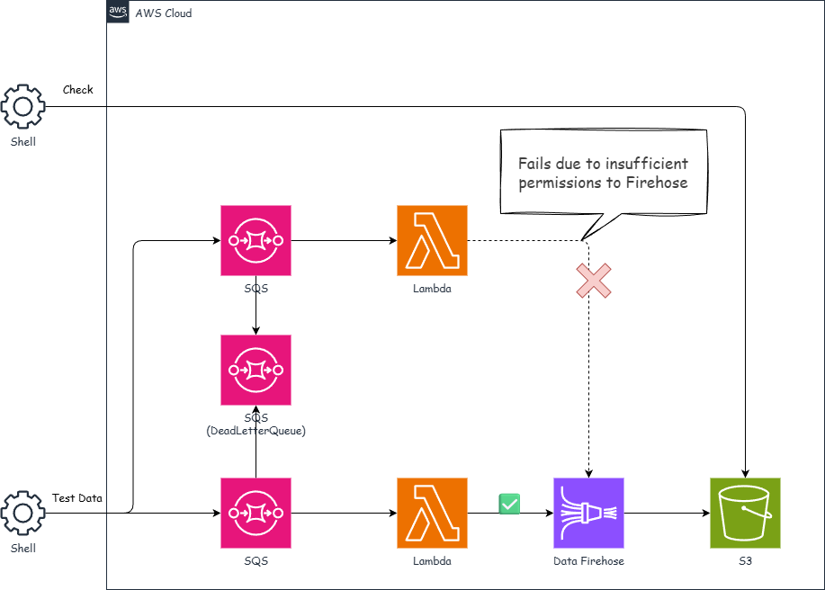

# SQS-Lambda-Firehose —— イベント駆動型データパイプラインの構築

*他の言語で読む:* [](./README.ja.md) [](./README.md)


## はじめに

このプロジェクトは、AWS CDKを使用してSQS、Lambda、Firehoseを組み合わせたイベント駆動型データパイプラインを構築するリファレンス実装です。

このアーキテクチャでは、以下の実装を確認することができます。

- SQS + Dead Letter Queueの設計
- Lambda **ReportBatchItemFailures**によるバッチ処理
- Firehose → S3へのストリーミング配信
- CloudWatch Alarmsによる本番監視

### なぜSQS-Lambda-Firehoseなのか?

| 特徴 | メリット |
| ------ | --------- |
| イベント駆動 | 疎結合でスケーラブル |
| 信頼性 | DLQとバッチ失敗レポートで堅牢なエラー処理 |
| コスト効率 | サーバーレスで使用分のみ課金 |
| 運用負荷軽減 | マネージドサービスでインフラ管理を最小化 |

## アーキテクチャ概要

構築する内容は次のとおりです。



### データフロー

```text
Producer → SQS Queue → Lambda → Firehose → S3
                ↓（失敗時）
           Dead Letter Queue
```

### 主要コンポーネントと設計ポイント

| コンポーネント | 設計ポイント |
| ------------- | ------------ |
| SQS Queue | Long Polling (20秒)、Visibility Timeout (30秒)、SSL強制 |
| Dead Letter Queue | 3回失敗でDLQへ、14日間保持 |
| Lambda | バッチサイズ5、**ReportBatchItemFailures有効**、X-Ray有効 |
| SQS Queue(for Failure Lambda) | Long Polling (20秒)、Visibility Timeout (30秒)、SSL強制 |
| Lambda(Failure) | Firehoseへの権限がないため処理が失敗するLambdaです。Dead Letter Queue動作確認用 |
| Firehose | 1分/1MBバッファリング、パーティション化プレフィックス |
| S3 | ライフサイクル管理（60日→IA、90日→Glacier、365日→削除） |
| CloudWatch | 8つのアラーム + SNS通知 |

---

## 前提条件

- AWS CLI v2のインストールと設定
- Node.js 20+
- AWS CDK CLI（`npm install -g aws-cdk`）
- TypeScriptの基礎知識
- AWSアカウント
- 各アカウントのAWS CLIプロファイル設定

## プロジェクトディレクトリ構造

```text
sqs-lambda-firehose/
├── bin/
│   └── sqs-lambda-firehose.ts              # アプリケーションエントリーポイント
├── lib/
│   ├── stacks/
│   │   └── sqs-lambda-firehose-stack.ts    # メインスタック定義
│   ├── stages/
│   │   └── sqs-lambda-firehose-stage.ts    # デプロイステージ
│   └── types/
│       ├── index.ts                        # 型定義エクスポート
│       ├── firehose-params.ts              # Firehoseパラメータ型
│       ├── lambda-params.ts                # Lambdaパラメータ型
│       └── sqs-params.ts                   # SQSパラメータ型
├── parameters/
│   └── environments.ts                     # 環境別パラメータ
├── src/
│   └── lambda/
│       └── sqs-firehose/
│           └── index.py                    # Lambda関数コード
└── test/
    ├── compliance/
    │   └── cdk-nag.test.ts                 # コンプライアンステスト
    ├── snapshot/
    │   └── snapshot.test.ts                # スナップショットテスト
    ├── unit/
    │   └── sqs-lambda-firehose.test.ts     # ユニットテスト
    └── parameters/
        └── test-params.ts                  # テスト用パラメータ
```

---

## 実装のポイント

### 1. SQS + Dead Letter Queue

処理失敗したメッセージを隔離し、調査・再処理を可能にするため、DLQの設定が重要です。

```typescript
// Dead Letter Queue
const deadLetterQueue = new sqs.Queue(this, 'DeadLetterQueue', {
  retentionPeriod: cdk.Duration.days(14),
  enforceSSL: true,
});

// Main Queue with DLQ
const queue = new sqs.Queue(this, 'MainQueue', {
  visibilityTimeout: cdk.Duration.seconds(30),
  receiveMessageWaitTime: cdk.Duration.seconds(20), // Long Polling
  deadLetterQueue: {
    maxReceiveCount: 3, // 3回失敗でDLQへ
    queue: deadLetterQueue,
  },
  enforceSSL: true,
});
```

> **ベストプラクティス**: Visibility Timeout は Lambda timeout の **6倍以上**に設定（[ドキュメント参照](https://docs.aws.amazon.com/AWSSimpleQueueService/latest/SQSDeveloperGuide/sqs-configure-lambda-function-trigger.html)）

### 2. Lambda - ReportBatchItemFailures

バッチ内の一部メッセージだけ失敗した場合、失敗分のみを再処理できます。

```typescript
lambdaFunction.addEventSource(
  new lambdaEventSources.SqsEventSource(queue, {
    batchSize: 5,
    reportBatchItemFailures: true, // 部分失敗をサポート
  })
);
```

#### Powertoolsを使わない場合 vs 使う場合

<details>
<summary>❌ Powertoolsを使わない場合（手動実装）</summary>

```python
def lambda_handler(event, context):
    records = event.get("Records", [])
    batch_item_failures = []

    for record in records:
        message_id = record.get("messageId")
        message_body = record.get("body", "")

        try:
            process_message(message_body)
        except Exception as e:
            # 失敗したレコードのIDを手動で追加
            batch_item_failures.append({"itemIdentifier": message_id})

    # レスポンス形式を手動で構築
    return {"batchItemFailures": batch_item_failures}
```

</details>

**問題点:**

- `itemIdentifier` をbatch_item_failuresに手動で追加する必要がある
- レスポンス形式を正確に構築する必要がある
- エラーハンドリングのボイラープレートが多い
- テストが複雑になる

<details open>
<summary>✅ Powertoolsを使う場合（推奨）</summary>

```python
from aws_lambda_powertools.utilities.batch import (
    BatchProcessor, EventType, process_partial_response
)

processor = BatchProcessor(event_type=EventType.SQS)

def record_handler(record):
    """各レコードの処理 - 失敗時は例外をraiseするだけでOK"""
    payload = record.json_body
    send_to_firehose(payload)

def lambda_handler(event, context):
    return process_partial_response(
        event=event,
        record_handler=record_handler,
        processor=processor,
        context=context
    )
```

</details>

**メリット:**

- `itemIdentifier` の取得と設定が自動化される
- レスポンス形式を意識する必要がない
- `record_handler` は処理ロジックだけに集中できる
- 失敗時は例外をraiseするだけでOK

| 項目 | 手動実装 | Powertools |
| ------ | --------- | ------------ |
| コード量 | 多い | 少ない |
| バグのリスク | 高い（itemIdentifier取得ミス等） | 低い |
| テスト容易性 | 複雑 | シンプル |
| メトリクス | 手動追加 | 自動収集可能 |

<details>
<summary>📝 Lambda関数の完全なコード (Python)</summary>

```python
import json
import os
import boto3
from aws_lambda_powertools import Logger, Tracer, Metrics
from aws_lambda_powertools.utilities.batch import (
    BatchProcessor, EventType, process_partial_response
)
from aws_lambda_powertools.utilities.data_classes.sqs_event import SQSRecord

logger = Logger()
tracer = Tracer()
metrics = Metrics()

processor = BatchProcessor(event_type=EventType.SQS)
firehose_client = boto3.client('firehose')
delivery_stream_name = os.environ['FIREHOSE_DELIVERY_STREAM_NAME']

@tracer.capture_method
def record_handler(record: SQSRecord):
    """個別レコードの処理"""
    payload = record.json_body
    logger.info("Processing message", extra={"message_id": record.message_id})

    response = firehose_client.put_record(
        DeliveryStreamName=delivery_stream_name,
        Record={'Data': json.dumps(payload) + '\n'}
    )

    logger.info("Sent to Firehose", extra={"record_id": response['RecordId']})
    metrics.add_metric(name="ProcessedMessages", unit="Count", value=1)

@logger.inject_lambda_context
@tracer.capture_lambda_handler
@metrics.log_metrics(capture_cold_start_metric=True)
def lambda_handler(event, context):
    return process_partial_response(
        event=event,
        record_handler=record_handler,
        processor=processor,
        context=context
    )
```

</details>

### 3. Firehose - パーティション化配信

S3のクエリ性能向上とAthena等での分析効率化できます。

```typescript
const deliveryStream = new firehose.DeliveryStream(this, 'DeliveryStream', {
  destination: new firehose.S3Bucket(bucket, {
    dataOutputPrefix: '!{timestamp:yyyy/MM/dd}/',      // 日付でパーティション
    errorOutputPrefix: '!{firehose:error-output-type}/!{timestamp:yyyy/MM/dd}/',
    bufferingInterval: cdk.Duration.minutes(1),
    bufferingSize: cdk.Size.mebibytes(1),
  }),
});
```

### 4. S3ライフサイクル管理

```typescript
bucket.addLifecycleRule({
  transitions: [
    { storageClass: s3.StorageClass.INFREQUENT_ACCESS, transitionAfter: cdk.Duration.days(60) },
    { storageClass: s3.StorageClass.GLACIER, transitionAfter: cdk.Duration.days(90) },
  ],
  expiration: cdk.Duration.days(365),
});
```

<details>
<summary>📝 完全なスタック実装コード</summary>

```typescript
import * as cdk from 'aws-cdk-lib/core';
import { Construct } from 'constructs';
import * as sqs from 'aws-cdk-lib/aws-sqs';
import * as lambda from 'aws-cdk-lib/aws-lambda';
import * as pythonLambda from '@aws-cdk/aws-lambda-python-alpha';
import * as lambdaEventSources from 'aws-cdk-lib/aws-lambda-event-sources';
import * as firehose from 'aws-cdk-lib/aws-kinesisfirehose';
import * as s3 from 'aws-cdk-lib/aws-s3';
import * as logs from 'aws-cdk-lib/aws-logs';

export class SqsLambdaFirehoseStack extends cdk.Stack {
  constructor(scope: Construct, id: string, props: SqsLambdaFirehoseStackProps) {
    super(scope, id, props);

    // 1. Dead Letter Queue
    const deadLetterQueue = new sqs.Queue(this, 'DeadLetterQueue', {
      retentionPeriod: cdk.Duration.days(14),
      enforceSSL: true,
      encryption: sqs.QueueEncryption.SQS_MANAGED,
    });

    // 2. Main Queue
    const queue = new sqs.Queue(this, 'MainQueue', {
      visibilityTimeout: cdk.Duration.seconds(30),
      retentionPeriod: cdk.Duration.days(4),
      receiveMessageWaitTime: cdk.Duration.seconds(20),
      deadLetterQueue: { maxReceiveCount: 3, queue: deadLetterQueue },
      enforceSSL: true,
    });

    // 3. S3 Bucket
    const bucket = new s3.Bucket(this, 'DataBucket', {
      removalPolicy: cdk.RemovalPolicy.DESTROY,
      autoDeleteObjects: true,
      enforceSSL: true,
      versioned: true,
      encryption: s3.BucketEncryption.S3_MANAGED,
    });

    bucket.addLifecycleRule({
      transitions: [
        { storageClass: s3.StorageClass.INFREQUENT_ACCESS, transitionAfter: cdk.Duration.days(60) },
        { storageClass: s3.StorageClass.GLACIER, transitionAfter: cdk.Duration.days(90) },
      ],
      expiration: cdk.Duration.days(365),
    });

    // 4. Firehose
    const deliveryStream = new firehose.DeliveryStream(this, 'DeliveryStream', {
      destination: new firehose.S3Bucket(bucket, {
        dataOutputPrefix: '!{timestamp:yyyy/MM/dd}/',
        errorOutputPrefix: '!{firehose:error-output-type}/!{timestamp:yyyy/MM/dd}/',
        bufferingInterval: cdk.Duration.minutes(1),
        bufferingSize: cdk.Size.mebibytes(1),
      }),
    });

    // 5. Lambda Function
    const lambdaFunction = new pythonLambda.PythonFunction(this, 'ProcessorFunction', {
      runtime: lambda.Runtime.PYTHON_3_14,
      handler: 'lambda_handler',
      entry: '../../common/src/python-lambda/sqs-firehose',
      timeout: cdk.Duration.seconds(5),
      memorySize: 256,
      environment: {
        FIREHOSE_DELIVERY_STREAM_NAME: deliveryStream.deliveryStreamName,
      },
      tracing: lambda.Tracing.ACTIVE,
      loggingFormat: lambda.LoggingFormat.JSON,
    });

    // 6. Permissions & Event Source
    queue.grantConsumeMessages(lambdaFunction);
    deliveryStream.grantPutRecords(lambdaFunction);

    lambdaFunction.addEventSource(
      new lambdaEventSources.SqsEventSource(queue, {
        batchSize: 5,
        reportBatchItemFailures: true,
      })
    );
  }
}
```

</details>

---

## CloudWatch監視

本番環境では**8つのアラーム**を設定し、SNSで通知します。

### アラーム一覧

| カテゴリ | アラーム | しきい値 | 目的 |
| -------- | -------- | --------- | ---- |
| **SQS** | ApproximateAgeOfOldestMessage | 300秒 | メッセージ滞留検知 |
| **SQS** | NumberOfEmptyReceives | 100回 | Long Polling問題検知 |
| **DLQ** | ApproximateNumberOfMessagesVisible | 1 | 処理失敗の即時検知 |
| **Firehose** | DeliveryToS3.DataFreshness | 900秒 | 配信遅延検知 |
| **Firehose** | ThrottledRecords | 1 | スロットリング検知 |
| **Firehose** | IncomingBytes Rate | 80% | クォータ使用率 |
| **Firehose** | IncomingRecords Rate | 80% | クォータ使用率 |
| **Firehose** | IncomingPutRequests Rate | 80% | クォータ使用率 |

### DLQアラーム（最重要）

```typescript
const dlqAlarm = deadLetterQueue
  .metricApproximateNumberOfMessagesVisible()
  .createAlarm(this, 'DlqAlarm', {
    threshold: 1,  // 1件でもあれば即アラート
    evaluationPeriods: 1,
  });
```

### Firehoseクォータ監視（Math Expression）

```typescript
const incomingBytesRateAlarm = new cw.Alarm(this, 'IncomingBytesRateAlarm', {
  threshold: 80, // 80%使用でアラート
  metric: new cw.MathExpression({
    expression: '100*(m1/300/m2)',  // 使用率を%で計算
    usingMetrics: {
      m1: firehose.metric('IncomingBytes', { statistic: 'Sum' }),
      m2: firehose.metric('BytesPerSecondLimit', { statistic: 'Minimum' }),
    },
  }),
});
```

<details>
<summary>📝 SNS通知統合コード</summary>

```typescript
const topic = new sns.Topic(this, 'AlertTopic', {
  displayName: 'SQS-Firehose Alerts',
});

[dlqAlarm, sqsAgeAlarm, firehoseFreshnessAlarm, ...otherAlarms].forEach(alarm => {
  alarm.addAlarmAction(new cw_actions.SnsAction(topic));
});
```

</details>

---

## デプロイ & 動作確認

```bash
npm run stage:deploy:all -w workspaces/sqs-lambda-firehose --project=myproject --env=dev

# テストメッセージ送信
./test-scripts/send-messages.sh --env dev --project myproject

# S3にデータが保存されたか確認
./test-scripts/check-s3.sh --env dev --project myproject
```

---

## ベストプラクティスまとめ

| コンポーネント | 推奨 | 避けるべき |
| --------------- | ------ | ------------ |
| SQS | Long Polling、DLQ設定、SSL強制 | Short Polling、DLQなし |
| Lambda | ReportBatchItemFailures、適切なバッチサイズ(5-10) | 大きすぎるバッチ、エラーハンドリングなし |
| Firehose | パーティション化、1-5MBバッファ | パーティションなし、長すぎるバッファ時間 |
| S3 | ライフサイクル管理、暗号化 | ライフサイクルなし、パブリックアクセス |

---

## 料金目安

<details>
<summary>💰 月額概算（東京リージョン、低〜中程度の使用量）</summary>

| サービス | 使用量 | 月額概算 |
| -------- | ------ | -------- |
| SQS | 100万リクエスト | $0.40 |
| Lambda | 100万リクエスト、256MB | $0.83 |
| Firehose | 1GB配信 | $0.03 |
| S3 | 10GB〜60GB | $0.50〜1.00 |
| CloudWatch | 5GB Logs | $0.27 |

合計: 約 $7〜10/月

</details>

---

## まとめ

このパターンで学んだこと:

1. SQS + DLQ: 信頼性の高いメッセージ処理
2. ReportBatchItemFailures: 部分失敗の効率的な処理
3. Firehoseパーティション: 分析しやすいデータ保存
4. CloudWatch Alarms: 本番運用に必要な監視

---

## 参考リンク

- [Amazon SQS Developer Guide](https://docs.aws.amazon.com/sqs/)
- [AWS Lambda Powertools](https://docs.powertools.aws.dev/lambda/python/)
- [Firehose Monitoring Best Practices](https://docs.aws.amazon.com/firehose/latest/dev/firehose-cloudwatch-metrics-best-practices.html)
