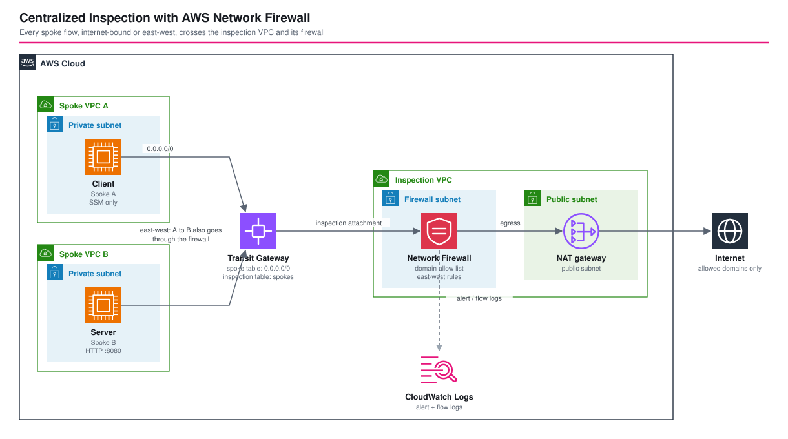

# Transit Gateway Centralized Inspection with AWS Network Firewall - AWS CDK Reference Architecture

[](./README.ja.md)
[](./README.md)


One **AWS Network Firewall** that inspects every flow of every spoke VPC: internet-bound traffic and traffic **between** the spokes. Two spoke VPCs with no internet route of their own send everything to a **Transit Gateway**; the Transit Gateway hands it to an **inspection VPC** where the firewall allows only listed domains and applies east-west rules, and a NAT gateway provides the internet exit. It is the direct next step of [`transit-gateway`](../transit-gateway/) (full mesh and shared egress), adding inspection.

## 📑 Table of Contents

- [Architecture Overview](#️-architecture-overview)
- [Design Decisions & Best Practices](#-design-decisions--best-practices)
- [Well-Architected Alignment](#️-well-architected-alignment)
- [Cost Optimization](#-cost-optimization)
- [Security Considerations](#-security-considerations)
- [Prerequisites](#-prerequisites)
- [Deployment Guide](#-deployment-guide)
- [Operational Check Script](#-operational-check-script)
- [Testing Strategy](#-testing-strategy)
- [Customization](#️-customization)
- [Troubleshooting](#-troubleshooting)
- [Clean-up](#-clean-up)
- [References](#-references)

## 🏗️ Architecture Overview



### Key Components

- **Spoke VPC A and B** — one private subnet each (plus a small subnet for the Transit Gateway attachment) and a default route to the Transit Gateway. No internet gateway, no NAT gateway. A hosts a client instance, B a tiny HTTP server (port 8080). Instances are reachable only through SSM Session Manager.
- **Transit Gateway** — default association and propagation **off**, two route tables: the *spoke* table sends `0.0.0.0/0` to the inspection attachment; the *inspection* table routes each spoke CIDR back to its attachment. The inspection attachment uses **appliance mode**.
- **Inspection VPC** — three subnets: `tgw` (attachment, default route to the firewall endpoint), `firewall` (the endpoint; default route to the NAT gateway, spoke CIDRs back to the Transit Gateway) and `public` (NAT gateway; spoke CIDRs back through the firewall endpoint).
- **AWS Network Firewall** — policy with two stateful rule groups: a **domain allow list** (HTTP host and TLS SNI, default `.amazonaws.com`) and **east-west rules** (pass TCP 8080 between the spokes, drop ICMP between them). Alert and flow logs go to CloudWatch Logs.
- **`test-inspection.sh`** — runs checks on the spoke instances through SSM and reads the firewall's alert log.

## 🎯 Design Decisions & Best Practices

### 1. Two Transit Gateway route tables force every flow through the firewall

With one shared route table the spokes would reach each other directly. Here the spoke table has only a default route to the inspection attachment, so even spoke-to-spoke traffic leaves the Transit Gateway, crosses the firewall and comes back. Default propagation is off so no attachment can add a shortcut by accident.

### 2. Appliance mode keeps both directions of a flow on the same firewall endpoint

Without appliance mode the Transit Gateway may send the return traffic of a flow through a different AZ's attachment, and a stateful firewall that sees only one direction drops it. With one AZ this cannot happen, but the setting costs nothing and a multi-AZ deployment depends on it.

### 3. The domain allow list applies to every HTTP and TLS flow, east-west included

A stateful domain list (`ALLOWLIST`) drops any HTTP or TLS flow whose host is not listed, **whatever its destination**. The first east-west test, `curl http://10.2.0.14:8080`, timed out, and the alert log said why: `not matching any HTTP allowlisted FQDNs` (the host name was the IP address). The fix is an explicit **`pass` rule for the east-west service**, which the engine evaluates before the allow list's drops:

```text
pass tcp 10.1.0.0/24 any <> 10.2.0.0/24 8080
```

Any service you run between spokes needs such a rule, or a domain-based design of its own.

### 4. ICMP drop is a protocol-level east-west control

The security groups allow ICMP between the spokes on purpose. Ping from A to B still fails with 100% loss and the alert log records `east-west ICMP blocked`, which shows the firewall, not a security group, made the decision.

### 5. Proving the egress path without an extra test

Both instances registered with SSM Session Manager with no VPC endpoints and no internet route in their own VPC. SSM needs `*.amazonaws.com`, so a successful registration already proves the whole path: spoke, Transit Gateway, firewall, NAT gateway, internet, and the allow list letting the AWS domains through.

### 6. One AZ is a cost choice, not a design

A single firewall endpoint and NAT gateway keep the reference cheap. Production needs an endpoint and a NAT gateway per AZ, one attachment subnet per AZ, and per-AZ route tables in the inspection VPC, so that losing an AZ does not stop inspection for the others.

### 7. Environment-specific parameters

`parameters/<env>-params.ts` sets the three CIDRs, the firewall's `HOME_NET`, the allowed domains, the east-west TCP ports, whether to drop east-west ICMP, and the log retention.

## 🏛️ Well-Architected Alignment

| Pillar | How this architecture addresses it |
|---|---|
| Operational Excellence | `test-inspection.sh` verifies policy against real traffic and the alert log; everything is CloudFormation-managed |
| Security | Default-deny egress by domain, inspected east-west traffic, no internet route or public IP in the spokes, SSM instead of SSH, encrypted EBS, IMDSv2 |
| Reliability | Appliance mode and explicit routing; one AZ here, per-AZ endpoints and NAT gateways for production |
| Performance Efficiency | One shared inspection path instead of a firewall per VPC |
| Cost Optimization | One firewall for all spokes; the cost is dominated by hourly endpoint charges (below) |
| Sustainability | Shared infrastructure, short-lived test instances (t4g.nano, ARM64) |

## 💰 Cost Optimization

Approximate cost in `ap-northeast-1` (verify against the pricing pages):

| Item | Approx. |
|---|---|
| Network Firewall endpoint (1 AZ) | about 0.4 USD per hour, plus a per-GB processing charge |
| Transit Gateway attachments (3) | about 0.15 USD per hour, plus a per-GB data charge |
| NAT gateway | about 0.06 USD per hour, plus a per-GB charge |
| Two t4g.nano instances | about 0.01 USD per hour |

That is roughly **0.6 USD per hour, or about 450 USD per month** if left running, almost all of it fixed hourly charges. A verification run of about 40 minutes cost under 1 USD; destroy the stack when you are done. Two AZs roughly double the firewall and NAT charges.

## 🔒 Security Considerations

### Implemented

- Spokes have no internet gateway, no NAT gateway and no public IP; every flow is inspected.
- Egress is limited to the listed domains (HTTP host and TLS SNI); everything else is dropped and logged.
- East-west traffic is inspected; only the declared TCP ports pass and ICMP is dropped.
- Instances are managed through SSM only (no key pair, no SSH), EBS volumes are encrypted, IMDSv2 is required.
- Firewall alert and flow logs are kept in CloudWatch Logs.

### CDK Nag suppressions (with reasons)

| Rule | Reason |
|---|---|
| AwsSolutions-IAM4 | AmazonSSMManagedInstanceCore is the AWS-recommended policy for Session Manager |
| AwsSolutions-EC28 | Detailed monitoring is a per-instance charge; short-lived test instances |
| AwsSolutions-EC29 | Disposable test instances; termination protection would block clean-up |
| AwsSolutions-VPC7 | The firewall alert and flow logs cover the traffic of interest; VPC flow logs would duplicate them |

### Out of scope (add per environment)

TLS inspection (decrypting traffic needs a certificate authority and changes the trust model), threat-intelligence managed rule groups, per-AZ endpoints, firewall policy change control.

## 📋 Prerequisites

- Node.js 24+, AWS CDK v2, an AWS account with CDK bootstrapped
- `aws` and `jq` for `test-inspection.sh`; the instances are reached through SSM, so no SSH setup is needed

## 🚀 Deployment Guide

```bash
export PROJECT=<project> ENV=dev
npm install
npm run stage:deploy:all -w workspaces/tgw-network-firewall-inspection   # about 9 minutes
```

## 🧪 Operational Check Script

`./test-inspection.sh --project <project> --env <env>` waits for both instances to register with SSM and then, from the instances:

1. an allowed domain (`https://checkip.amazonaws.com`) returns HTTP 200
2. a domain outside the allow list (`example.com`) is blocked
3. HTTP from spoke A to spoke B on port 8080 works
4. ICMP from spoke A to spoke B is dropped
5. the firewall's alert log records both the blocked domain and the blocked ICMP

Verified on 2026-10-04 in `ap-northeast-1`: all checks passed (after adding the east-west `pass` rule, see design decision 3).

## 🧪 Testing Strategy

```bash
npm test -w workspaces/tgw-network-firewall-inspection
```

- **Snapshot**: the full template and resource counts.
- **Unit**: Transit Gateway route tables, appliance mode on the inspection attachment only, the domain allow list, east-west pass and drop rules, forwarding to the stateful engine, logging, routing through the firewall endpoint, one internet gateway and one NAT gateway, instance hardening.
- **Compliance**: CDK Nag `AwsSolutionsChecks` with the reasons above.

## ⚙️ Customization

| Parameter | Meaning |
|---|---|
| `spokeACidr`, `spokeBCidr`, `inspectionCidr` | Address plan |
| `homeNet` | The firewall's `HOME_NET`, a supernet of the spokes |
| `allowedDomains` | Domains the spokes may reach (leading dot matches subdomains) |
| `eastWestAllowedTcpPorts` | TCP ports allowed between the spokes |
| `blockEastWestIcmp` | Drop ICMP between the spokes |

## 🔧 Troubleshooting

### East-west HTTP times out

The domain allow list drops it. Look in the alert log for `not matching any HTTP allowlisted FQDNs` and add the service's port to `eastWestAllowedTcpPorts`.

### Instances never show up in SSM

The egress path is broken: check the spoke default route to the Transit Gateway, the spoke and inspection Transit Gateway routes, the firewall subnet's route to the NAT gateway, the public subnet's return routes through the firewall endpoint, and that `.amazonaws.com` is in the allow list.

### Firewall endpoint takes minutes to appear

Creating a firewall endpoint takes several minutes; the deployment waits for it.

### Return traffic is dropped

With more than one AZ, the inspection attachment needs appliance mode so both directions use the same firewall endpoint.

## 🧹 Clean-up

```bash
npm run stage:destroy:all -w workspaces/tgw-network-firewall-inspection
```

## 📚 References

- [Centralized inspection architecture with AWS Gateway Load Balancer and AWS Transit Gateway](https://aws.amazon.com/blogs/networking-and-content-delivery/centralized-inspection-architecture-with-aws-gateway-load-balancer-and-aws-transit-gateway/)
- [Deployment models for AWS Network Firewall with VPC routing enhancements](https://aws.amazon.com/blogs/networking-and-content-delivery/deployment-models-for-aws-network-firewall-with-vpc-routing-enhancements/)
- [Stateful domain list rule groups in AWS Network Firewall](https://docs.aws.amazon.com/network-firewall/latest/developerguide/stateful-rule-groups-domain-names.html)
- [Appliance mode on Transit Gateway](https://docs.aws.amazon.com/vpc/latest/tgw/transit-gateway-appliance-scenario.html)
