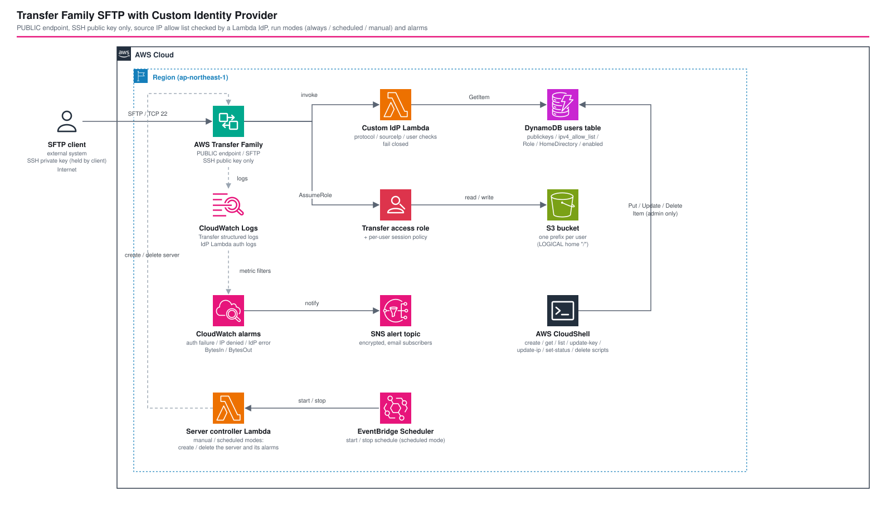

# Transfer Family SFTP with a Custom Identity Provider — SSH key auth with a source-IP allow list on a PUBLIC endpoint

*Read this in other languages:* [](./README.ja.md) [](./README.md)


## Introduction

An AWS Transfer Family SFTP server on a **PUBLIC endpoint** (no VPC, so no Security Group) whose users are authenticated by a **Lambda custom identity provider**. The Lambda looks the user up in DynamoDB, returns the registered SSH public keys, and rejects the login when the connecting IP is outside the user's allow list. Users are managed from AWS CloudShell with small shell scripts, so no admin API or UI exists.

This architecture demonstrates:

- Replacing Security Group IP restrictions (not available on PUBLIC endpoints) with an authentication-time `sourceIp` check, and being explicit about what that does and does not protect
- Key-only authentication (`SftpAuthenticationMethods: PUBLIC_KEY`) where Transfer Family verifies the signature and the Lambda never touches a private key
- A DynamoDB schema aligned with the AWS custom IdP solution, multi-key support for rotation without downtime, and conditional writes that separate create from update
- Per-user isolation with LOGICAL home directories plus a Lambda-generated session policy on a single shared IAM role
- Fail-closed behavior on every error path, verified against a real deployment
- Three run modes (always on, scheduled, manual start/stop) that delete the server when it is off, because a stopped Transfer Family server is still billed
- Alarms and an SNS topic for authentication failures, IP denials, IdP errors and transfer volume, kept in place across server re-creation

## 📑 Table of Contents

- [Architecture Overview](#architecture-overview)
- [Design Decisions & Best Practices](#design-decisions--best-practices)
- [Server Run Modes](#server-run-modes)
- [Monitoring](#monitoring)
- [Log masking](#log-masking)
- [Cost Optimization](#cost-optimization)
- [Security Considerations](#security-considerations)
- [Prerequisites](#prerequisites)
- [Deployment Guide](#deployment-guide)
- [User Management (CloudShell)](#user-management-cloudshell)
- [Testing Strategy](#testing-strategy)
- [Customization](#customization)
- [Troubleshooting](#troubleshooting)
- [References](#references)

## 🏗️ Architecture Overview



### Key Components

- **AWS Transfer Family server**: `EndpointType: PUBLIC`, protocol `SFTP`, identity provider `AWS_LAMBDA`, `SftpAuthenticationMethods: PUBLIC_KEY`, structured logs to CloudWatch Logs
- **Custom IdP Lambda** (`lambda/custom_idp/handler.py`, Python): validates protocol, user, `enabled`, source IP and returns `Role`, `PublicKeys`, session `Policy`, `HomeDirectoryType: LOGICAL`
- **DynamoDB user table**: PK `user`, SK `identity_provider_key` (AWS custom IdP solution layout), AWS managed key encryption, point-in-time recovery
- **S3 bucket**: `s3://<bucket>/<username>/`, TLS only, public access blocked, versioned
- **Shared Transfer access role**: assumed by Transfer Family, narrowed per user by the session policy
- **Server controller Lambda** (manual / scheduled modes): creates and deletes the server, and creates and deletes the server metric alarms
- **EventBridge Scheduler** (scheduled mode): calls the controller to start and stop on a schedule
- **Alarms + SNS topic**: log metric filters and CloudWatch alarms notifying an encrypted SNS topic
- **Admin managed policy**: DynamoDB item operations limited to the user table ARN, to attach to the CloudShell operator
- **Scripts** (`scripts/`): `create` / `get` / `list` / `update-transfer-user-key` / `update-transfer-user-ip` / `set-transfer-user-status` / `delete`, `control-transfer-server.sh` (start / stop / status), plus `e2e-test.sh`

### Authentication Flow

```text
sftp client ──TCP 22──> Transfer Family (PUBLIC)
                          │ Lambda invoke {username, protocol, serverId, sourceIp}
                          ▼
                    protocol == SFTP?            no  → {}
                    no password in the event?    no  → {}
                    username format valid?       no  → {}
                    DynamoDB GetItem (consistent) error → {}
                    user found / enabled == true?   no  → {}
                    sourceIp ∈ ipv4_allow_list?     no  → {}   (empty list → {})
                    keys / Role / HomeDirectory valid? no → {}
                          ▼
                    {Role, PublicKeys, Policy, HomeDirectoryType, HomeDirectoryDetails}
                          │
                    Transfer Family verifies the SSH signature with PublicKeys
```

An empty response (`{}`) has no `Role`, which Transfer Family treats as an authentication failure.

### Architecture Characteristics

| Characteristic | Value | Rationale |
|---------------|-------|-----------|
| Availability | Regional managed services (Transfer Family, Lambda, DynamoDB, S3) | No servers to patch; the PUBLIC endpoint is multi-AZ managed by the service |
| Scalability | Pay-per-request DynamoDB, Lambda concurrency | User count is small; the IdP does one `GetItem` per login |
| Security | Key-only auth, authentication-time IP check, per-user session policy, fail closed | See [Security Considerations](#security-considerations) |
| Cost | One Transfer Family server dominates the cost | Everything else is pay-per-use and near zero at this scale |

## Design Decisions & Best Practices

### 1. Source IP control happens at authentication, not at the network

**Decision**: Use the `sourceIp` supplied to the IdP Lambda and reject logins from IPs outside the user's `ipv4_allow_list`.

**Rationale**:
- ✅ Works on a PUBLIC endpoint, where Security Groups cannot be attached
- ✅ Per-user allow lists instead of one list per server
- ✅ Rejections are logged with user and IP

**Trade-offs**:
- ❌ TCP/22 is reachable from the internet. A client from a disallowed IP can still start an SSH handshake and is rejected only after Transfer Family calls the IdP. This is **not** network-level filtering and it does not stop scanning or connection-level DoS
- ❌ If network-level filtering is mandatory, use a VPC hosted endpoint with a Security Group instead

### 2. Align the data model with the AWS custom IdP solution, but not deploy the solution itself

**Decision**: Use the solution's `users` table layout (`user` / `identity_provider_key`, `config.{Role,HomeDirectory,PublicKeys}`, `ipv4_allow_list`, `server_id_allow_list`) and its `publickeys` provider name, with a small CDK-native Lambda.

**Rationale**:
- ✅ The official solution is a SAM template deployed through CodePipeline/CodeBuild, with a VPC option and modules for LDAP/Okta/Cognito/Entra that this use case does not need. Its deployment lifecycle is separate from the CDK stack that owns the server, S3 and IAM
- ✅ Keeping the table layout compatible means the data can move to the official solution later without a migration

**Differences from the official solution and from the requirements document**:

| Item | This implementation | Official solution | Reason |
|---|---|---|---|
| Deployment | CDK stack | SAM + CodePipeline | Single IaC lifecycle, no pipeline resources |
| Providers table | None (one fixed provider `publickeys`) | `identity_providers` table | Key-only; no provider switching needed |
| `enabled` attribute | Added (`BOOL`, missing = disabled) | Not defined | Requirement: disable a user without deleting it |
| Home directory | `HomeDirectoryType: LOGICAL`, `/` → `/bucket/prefix` | `HomeDirectoryDetails` in config | Hide bucket and prefix structure from clients |
| IP list attribute | `ipv4_allow_list` (IPv4 and IPv6 CIDRs are both evaluated; scripts accept IPv4) | `ipv4_allow_list` (IPv4) | Server is IPv4 only; dual-stack not enabled |
| IP list required | Yes (empty or missing = reject) | Optional | Requirement: mandatory allow list |
| Username | lower-case `[a-z0-9][a-z0-9_.-]{2,63}`, no `@@` | lower-case, `user@@provider` syntax | One provider only |

### 3. One shared access role, scoped per user by a session policy

**Decision**: A single IAM role (S3 access to the bucket) plus a session policy generated by the Lambda from the user's `HomeDirectory`. The `Role` is still stored per user, so a dedicated role can be assigned later.

**Rationale**:
- ✅ No IAM role per user to create and maintain from CloudShell (the admin policy does not need `iam:*`)
- ✅ Effective permissions are the intersection of role and session policy, so a user cannot leave their prefix even if a broad role is registered
- ✅ LOGICAL home mapping (`/` → `/bucket/prefix`) means the client cannot even see other users' prefixes

**Trade-offs**:
- ❌ The shared role has bucket-wide object permissions; correctness depends on the Lambda session policy. A per-user role (set `--role`) gives defense in depth for sensitive data

### 4. Key rotation is an add / remove sequence, never a replace

**Decision**: Public keys are a DynamoDB string set; `update-transfer-user-key.sh` supports `--add-key` and `--remove-fingerprint` and refuses to remove the last key.

**Rationale**:
- ✅ Old and new keys coexist while the client switches (verified: both worked; the removed key was rejected immediately)
- ✅ `ADD` / `DELETE` set updates are atomic and do not touch other attributes

### 5. Run mode: "off" means the server is deleted

**Decision**: `serverLifecycle.mode` selects `always`, `scheduled` or `manual` (details in [Server Run Modes](#server-run-modes)). In the last two the server is created and deleted by a Lambda.

**Rationale**:
- ✅ A server in the OFFLINE state (`StopServer`) is still billed; the documentation says to delete the server to stop charges
- ✅ Users, keys and data live in DynamoDB and S3, so they survive re-creation without re-registration (verified)

**Trade-offs**:
- ❌ Server ID and the default host name change on every start; DNS for the new name needs about a minute
- ❌ The host key changes unless a host key secret is configured (see below)
- ❌ A start takes about 2 to 3 minutes until the server is `ONLINE`

### 6. Monitoring is part of the architecture

**Decision**: Alarms notify one SNS topic ([Monitoring](#monitoring)). Alarms that need the server ID are created by the controller Lambda in the on-demand modes.

**Rationale**:
- ✅ A server ID that changes on every start would otherwise break the `AWS/Transfer` metric alarms
- ✅ A failed scheduled start or stop raises its own alarm

### 7. Well-Architected Framework Alignment

| Pillar | Implementation |
|--------|---------------|
| **Operational Excellence** | IaC for everything except user data; structured JSON auth logs; alarms and SNS notifications for auth failures, IdP errors and data volume; `scripts/e2e-test.sh` operational check; admin scripts with validation |
| **Security** | Key-only auth, IP allow list, fail closed, enabled flag, session policy, TLS-only bucket, KMS-encrypted logs, least-privilege Lambda (`GetItem` on one table), CDK Nag |
| **Reliability** | Managed services only; consistent reads on lookups; PITR on the user table; versioned bucket |
| **Performance Efficiency** | One `GetItem` per authentication; ARM64 Lambda; on-demand DynamoDB |
| **Cost Optimization** | Pay-per-request DynamoDB and Lambda; single shared role; scheduled or manual run modes remove the server hourly fee while it is off |
| **Sustainability** | Serverless pay-per-use components; ARM64 Lambda; log retention limits storage |

## Server Run Modes

`serverLifecycle` in the parameter file (overridable per deployment with `-c serverMode=always|scheduled|manual`):

| Mode | Server | Start / stop | Use |
|---|---|---|---|
| `always` | CloudFormation resource | none | production |
| `scheduled` | created and deleted by the controller Lambda | EventBridge Scheduler (`startExpression`, `stopExpression`, `timezone`) and manual | development environments used on working days |
| `manual` | created and deleted by the controller Lambda | `control-transfer-server.sh start|stop|status` (invokes the controller Lambda) | rarely used environments |

```typescript
serverLifecycle: {
  mode: 'scheduled',
  startExpression: 'cron(0 8 ? * MON-FRI *)',
  stopExpression: 'cron(0 20 ? * MON-FRI *)',
  timezone: 'Asia/Tokyo',
  hostKeySecretArn: 'arn:aws:secretsmanager:...',   // optional, see below
}
```

How it works:

- The controller finds its server by the tag `sftp-custom-idp-stack`, so it keeps no state. `start` is idempotent; if two overlapping calls create two servers, every caller keeps the lowest server ID and deletes the rest
- `start` also creates the `BytesIn` / `BytesOut` alarms for the new server ID; `stop` deletes them. Calling `start` on a running server restores missing alarms
- Deleting the stack deletes a server created by the controller (custom resource)
- The IdP permission and the access role trust cover the servers of this account (`server/*`, `user/*`) because the ID is unknown at deploy time; the role trust still requires `aws:SourceAccount`
- Commands from CloudShell: `./control-transfer-server.sh start --wait`, `stop`, `status` (set `SFTP_CONTROLLER_FUNCTION` in `~/.sftp-user-admin.conf`; the admin policy allows invoking the controller)

**Host key**: Without configuration, every new server generates a new host key and clients see a host key change warning. To keep the fingerprint, put an OpenSSH private host key (ed25519 or RSA) in a Secrets Manager secret as plain text and set `hostKeySecretArn`:

```bash
ssh-keygen -t ed25519 -N '' -f sftp-host-key
aws secretsmanager create-secret --name sftp-host-key --secret-string file://sftp-host-key
```

Verified: the fingerprint was identical across re-creations with a host key secret. The host name also changes on every start; clients that need a stable name should use a custom host name (Route 53 alias or CNAME to the new endpoint).

## Monitoring

All alarms notify the SNS topic `<project>-<env>-sftp-alerts` (customer managed KMS key; CloudWatch is allowed by the key and topic policies). Add recipients with `monitoring.alertEmails` (each address must confirm the subscription).

| Alarm | Source | Default | Meaning |
|---|---|---|---|
| `...-AuthFailure` | metric filter `"AUTH_FAILURE"` on the Transfer log group | 5 in 5 min | brute force or a misconfigured client |
| `...-IpDenied` | metric filter `"ip_not_allowed"` on the IdP log group | 1 in 5 min | a valid user connecting from an unexpected IP (possible key leak) |
| `...-IdpError` | metric filter on `dynamodb_error` / `unexpected_error` | 1 in 5 min | the IdP fails closed: every login is rejected |
| `...-BytesIn` / `...-BytesOut` | `AWS/Transfer` metrics of the server | 1024 MB in 5 min | unusual upload or download volume |
| `...-ServerControllerError` | Lambda `Errors` of the controller (on-demand modes) | 1 | a scheduled start or stop failed |

Thresholds and the period are parameters (`monitoring`). In `always` mode the server alarms are CloudFormation resources; in the other modes the controller owns them (they exist only while the server exists). The log metric filters stay on the fixed log group names, so they keep working across re-creation.

Alarm windows are fixed 5 minute buckets, so a burst that straddles two buckets can stay under the threshold (6 failures within 80 seconds were split 4 and 2 and did not alarm; 8 failures in one bucket did). Lower the threshold or the period if that matters.

Automatic disabling of a user after repeated failures is not implemented. The IP allow list is the first line of defense, failures from outside it are rejected anyway, and a successful unauthorized login leaves no failure to count. If it is added later, base it on the Transfer `AUTH_FAILURE` events (a wrong key is rejected by Transfer after the IdP has already returned the keys, so the IdP Lambda never sees it) and count only failures from IPs on the user's allow list, otherwise anyone who knows a user name can lock that user out.

Verified: the three log based alarms and the `BytesIn` alarm created by the controller reached `ALARM` and the SNS action was executed (alarm history).

## Log masking

The structured Transfer Family log has `ssh-public-key` (the public key body) in each `CONNECTED` event. There is no setting to leave it out, and a log transformer's `deleteKeys` does not help because the original event is stored as well. With `maskSshPublicKeyInLogs: true` the Transfer log group gets a data protection policy (custom data identifier `AAAA[A-Za-z0-9+/]{60,}={0,3}`, which every OpenSSH public key body matches; the fingerprint does not) with audit and mask operations. Set it to `false` to turn it off.

What a `CONNECTED` event looks like (some fields and values shortened).

Without masking:

```json
{
  "activity-type": "CONNECTED",
  "user": "demo-user",
  "source-ip": "203.0.113.10",
  "client": "SSH-2.0-OpenSSH_9.2p1 Debian-2+deb12u7",
  "home-dir": "LOGICAL",
  "role": "arn:aws:iam::123456789012:role/TransferSftp...-TransferAccessRole",
  "ssh-public-key-type": "ssh-ed25519",
  "ssh-public-key-fingerprint": "SHA256:CBJTS7P1fWdMklIPX5Nl2UEXOQdhYyxqTBVQWrO1Q0U",
  "ssh-public-key": "AAAAC3NzaC1lZDI1NTE5AAAAIJZ1bdSW9rO6X/UGht9VDZ6LCFwiJ4Bx//dVyAzMg11V",
  "session-id": "049695adf319f5e2cd4f"
}
```

With masking (the same event ingested while the policy is active; the fingerprint stays, the key body becomes asterisks of the same length):

```json
{
  "activity-type": "CONNECTED",
  "user": "demo-user",
  "source-ip": "203.0.113.10",
  "client": "SSH-2.0-OpenSSH_9.2p1 Debian-2+deb12u7",
  "home-dir": "LOGICAL",
  "role": "arn:aws:iam::123456789012:role/TransferSftp...-TransferAccessRole",
  "ssh-public-key-type": "ssh-ed25519",
  "ssh-public-key-fingerprint": "SHA256:CBJTS7P1fWdMklIPX5Nl2UEXOQdhYyxqTBVQWrO1Q0U",
  "ssh-public-key": "********************************************************************",
  "session-id": "049695adf319f5e2cd4f"
}
```

Events ingested before the policy was active stay in the first form.

Verified: `filter-log-events`, `tail` and Logs Insights show `****...` for new events, and `--unmask` returns the original for principals with `logs:Unmask`. For the console, Logs Insights and Live Tail, follow the official procedure: [Viewing unmasked sensitive data in CloudWatch Logs](https://docs.aws.amazon.com/AmazonCloudWatch/latest/logs/mask-sensitive-log-data-view.html) (not verified here; the CLI result above is).

Limits to know:

- Masking applies to events ingested after the policy is active. Events written before that, and during the first minute or so after a change, stay readable
- The stored event is not rewritten. Whoever holds `logs:Unmask` (administrators have it) can read the key. A public key is not a secret, so this is a defense in depth measure; restrict `logs:Unmask` and read access to the log group (KMS encrypted) as well
- The policy needs both an audit and a mask statement; the CDK `DataProtectionPolicy` creates both. Scanned log data is billed per GB, which is negligible at this log volume

## 💰 Cost Optimization

### Estimated Monthly Costs (ap-northeast-1)

#### Development Environment (one server, a handful of logins, < 1 GB transferred)
```
Transfer Family server (SFTP): $219.00  (730 h × $0.30/h)
Transfer Family data transfer:  ~$0.04  ($0.04/GB uploaded or downloaded, 1 GB)
Lambda / DynamoDB (on-demand):  < $0.01
KMS keys (logs, alert topic):     $2.00  ($1/key/month each)
Alarms and custom metrics:       ~$1.50  (6 alarms × $0.10, 3 metrics × $0.30)
S3 / CloudWatch Logs:            < $0.10
-------------------------------------------
Total (Dev, always on):         ~$224/month  (~$0.30/hour while the server exists)
```

The server hourly fee dominates. A stopped (OFFLINE) server is still billed, so the `scheduled` and `manual` modes delete the server:

```
scheduled, 12 h × 22 working days:  264 h × $0.30 = ~$79/month   (instead of $219)
manual, used 20 h/month:             20 h × $0.30 = ~$6/month
```

### Cost Optimization Strategies

1. **Run the server only when it is needed (`scheduled` / `manual`)**
   - Saves: ~$140/month for 12 hours on working days, almost all of $219 when rarely used
2. **Keep one server for all systems**
   - Saves: ~$219/month per avoided additional server
   - Users are separated by DynamoDB records, per-user prefixes and allow lists, not by servers
3. **Turn off log encryption (`enableLogEncryption: false`) in disposable environments**
   - Saves: $1/month per key
4. **Tune `logRetentionDays`**
   - Log volume is small; retention mostly affects audit horizon rather than cost

## 🔒 Security Considerations

### Network Security

1. **PUBLIC endpoint has no Security Group.** IP restriction is performed by the Lambda at authentication time. See Design Decision 1 for what this does not protect against.
2. **SFTP only.** FTP/FTPS are not enabled, and the Lambda also rejects any `protocol` other than `SFTP`.

### Security Best Practices Implemented

- ✅ Private keys are never generated, stored or transmitted by AWS or by the scripts; only `.pub` content is registered. The scripts reject files that are not OpenSSH public keys
- ✅ The IdP Lambda never logs public keys or passwords (verified: no key material in its logs). Transfer Family itself writes the public key body in every `CONNECTED` event and has no option to omit it; `maskSshPublicKeyInLogs` (default `true`) masks it with a CloudWatch Logs data protection policy (see [Log masking](#log-masking))
- ✅ Fail closed for unknown users, disabled users, empty allow list, malformed records, DynamoDB errors and unexpected exceptions
- ✅ `enabled` must be exactly `true`
- ✅ CIDR validation in the scripts (`0.0.0.0/0` is refused); malformed stored CIDRs never match in the Lambda
- ✅ Lambda role: `dynamodb:GetItem` on the user table only; no credentials in environment variables
- ✅ Transfer roles trust only `transfer.amazonaws.com` with `aws:SourceAccount` and `aws:SourceArn` (`user/<server-id>/*`)
- ✅ DynamoDB encrypted with the AWS managed key, PITR enabled; S3 TLS-only, public access blocked, versioned
- ✅ CloudWatch Logs encrypted with a customer managed key (parameterized)
- ✅ Admin changes are traceable in CloudTrail (`dynamodb:PutItem` / `UpdateItem` / `DeleteItem`)
- ✅ Admin policy limited to the user table ARN (and invoking the controller Lambda in the on-demand modes)
- ✅ The controller can delete or describe only servers tagged for its own stack; it creates only alarms with its stack prefix
- ✅ The alert topic is encrypted with a customer managed key and enforces TLS

### CDK Nag Compliance

`test/compliance/cdk-nag.test.ts` runs `AwsSolutionsChecks` against the stack. Suppressions: `S1` (no access-log bucket for this demo bucket), `IAM4` (AWSLambdaBasicExecutionRole), `IAM5` (object-level wildcard narrowed per user by the session policy, log stream names, table indexes, controller actions that cannot be restricted by resource: `CreateServer`, `ListServers` and the CloudWatch Logs delivery actions that Transfer Family requires), each with a reason. The test runs for all three run modes.

## 📋 Prerequisites

- AWS account and an AWS CLI profile
- Node.js 20+ and the repository dependencies (`npm ci` in `infrastructure/`)
- AWS CDK 2.x, bootstrapped in the target account/region
- For `scripts/e2e-test.sh`: `sftp`, `ssh-keygen`, `jq`, `curl`
- CloudShell for user management (it already provides AWS CLI, `jq`, `ssh-keygen`); no tools are needed on the Windows admin PC beyond a browser

### Required IAM Permissions

The deploying principal creates: Transfer Family servers, Lambda functions, DynamoDB tables, S3 buckets, IAM roles/policies, KMS keys, CloudWatch Logs log groups.

## 🚀 Deployment Guide

### 1. Setup

```bash
cd infrastructure
npm ci
```

### 2. Configure environment parameters

Edit `parameters/dev-params.ts` (`securityPolicyName`, `logRetentionDays`, `enableLogEncryption`, `lambdaLogLevel`, `retainData`).

### 3. Deploy

```bash
export PROJECT=<project> ENV=dev
npm run stage:deploy:all -w workspaces/transfer-sftp-custom-idp
```

### 4. Verify deployment

```bash
aws cloudformation describe-stacks --stack-name <stack> --query 'Stacks[0].Outputs'
```

Outputs: `ServerId` / `ServerEndpoint` (always mode) or `ControllerFunctionName` (other modes), `AlertTopicArn`, `UserTableName`, `BucketName`, `TransferAccessRoleArn`, `UserAdminPolicyArn`, `IdpFunctionName`, `TransferLogGroupName`.

### 5. Destroy

```bash
npm run stage:destroy:all -w workspaces/transfer-sftp-custom-idp
```

## User Management (CloudShell)

Upload `scripts/` to CloudShell (Actions → Upload file, or `git clone`), then:

```bash
cat > ~/.sftp-user-admin.conf <<'CONF'
SFTP_USER_TABLE=<UserTableName output>
SFTP_ACCESS_ROLE_ARN=<TransferAccessRoleArn output>
SFTP_CONTROLLER_FUNCTION=<ControllerFunctionName output, manual / scheduled modes only>
CONF
chmod +x scripts/*.sh
```

Attach the `UserAdminPolicyArn` managed policy to the IAM principal that opens CloudShell.

| Task | Command |
|---|---|
| Register a user | `./create-transfer-user.sh --user system01 --public-key ./system01.pub --allowed-ip 203.0.113.10/32 --allowed-ip 198.51.100.0/24 --home /<bucket>/system01` |
| Show a user | `./get-transfer-user.sh --user system01` (keys as fingerprints) |
| List users | `./list-transfer-users.sh` |
| Add a key (rotation step 1) | `./update-transfer-user-key.sh --user system01 --add-key ./new.pub` |
| Remove the old key (step 3) | `./update-transfer-user-key.sh --user system01 --remove-fingerprint SHA256:...` |
| Replace the IP allow list | `./update-transfer-user-ip.sh --user system01 --allowed-ip 203.0.113.20/32` |
| Disable / enable | `./set-transfer-user-status.sh --user system01 --disable` |
| Start / stop / status of the server (manual, scheduled modes) | `./control-transfer-server.sh start --wait` |
| Delete (confirmation required) | `./delete-transfer-user.sh --user system01` (`--force` skips the prompt) |

Key pairs are created by the connecting system: `ssh-keygen -t ed25519 -f transfer-user01`. Hand over only `transfer-user01.pub`.

Connect: `sftp -i transfer-user01 system01@<ServerEndpoint>`.

Detailed procedures: [docs/user-management.md](docs/user-management.md), [docs/key-rotation.md](docs/key-rotation.md), [docs/deployment.md](docs/deployment.md), [docs/architecture.md](docs/architecture.md), [docs/test-plan.md](docs/test-plan.md).

## 🧪 Testing Strategy

### Test Structure

```
test/
├── snapshot/      # full template + resource counts
├── unit/          # server/Lambda/IAM/DynamoDB/S3 properties
└── compliance/    # CDK Nag AwsSolutions
tests-python/      # IdP Lambda and controller Lambda logic (28 tests)
scripts/e2e-test.sh  # real SFTP checks against a deployed stack
```

```bash
npm test -w workspaces/transfer-sftp-custom-idp
python3 -m unittest discover -s tests-python   # needs boto3
./scripts/e2e-test.sh --stack <stack> --profile <profile> --region <region>
```

### Deploy verification result (ap-northeast-1)

`scripts/e2e-test.sh` passed 31/31 checks against a real deployment in `manual` mode with `--recycle` (the first 20 checks also passed in `always` mode), covering: valid user, multiple keys, CIDR range, key rotation (old key rejected after removal), unlisted IP, unregistered private key, unknown user, disabled user (and re-enable), DynamoDB failure (Lambda pointed at a missing table), invalid protocol (`test-identity-provider`), prefix isolation, uploads landing in the user's own prefix, the session policy on its own (a broad role narrowed by the Lambda session policy: own prefix allowed; another prefix and the bucket root denied; the role alone can read another prefix), and a stop / start cycle (new server ID, same users and data, same host key with a host key secret). The `scheduled` mode created the server and the alarms at the scheduled time.

## ⚙️ Customization

- **Dedicated role per user**: create the role (trust `transfer.amazonaws.com`, condition `aws:SourceArn` = `arn:aws:transfer:<region>:<account>:user/<server-id>/*`) and pass `--role`
- **Security policy**: `securityPolicyName` in the parameters
- **Log masking**: `maskSshPublicKeyInLogs` in the parameters
- **Alert recipients and thresholds**: `monitoring` in the parameters
- **Dual-stack**: not enabled. It requires a server address type change and IPv6 CIDRs in the allow list; the Lambda already evaluates IPv6 CIDRs
- **Custom domain**: attach a Route 53 record to `ServerEndpoint`

## 🔧 Troubleshooting

### Issue: login is rejected

1. Find the reason in the Lambda log (JSON, field `reason`):

```bash
aws logs tail <IdpLogGroup> --since 15m --filter-pattern '"FAILURE"'
```

Reasons: `protocol_not_allowed`, `password_not_allowed`, `invalid_username`, `user_not_found`, `user_disabled`, `ip_allow_list_empty`, `ip_not_allowed`, `server_not_allowed`, `no_public_keys`, `invalid_role`, `invalid_home_directory`, `dynamodb_error`, `unexpected_error`.

2. Transfer-side events (`AUTH_FAILURE`, `ERROR`) are in `/aws/transfer/<project>-<env>-sftp`.
3. Reproduce without a client: `aws transfer test-identity-provider --server-id <id> --user-name <user> --server-protocol SFTP --source-ip <ip>`.

### Issue: login succeeds but file operations fail with Permission denied

Transfer Family log shows `Unable to AssumeRole for user`. The role trust policy must use `aws:SourceArn` = `arn:aws:transfer:<region>:<account>:user/<server-id>/*` (the *user* ARN, not the server ARN). This was found during deploy verification.

### Issue: cannot connect in manual / scheduled mode

Check `./control-transfer-server.sh status`. `ABSENT` means the server is deleted (start it, or check the schedule). After `start` the server needs 2 to 3 minutes to become `ONLINE` and its new host name about a minute to resolve. A client that sees a host key change warning is talking to a re-created server without a configured host key secret.

### Issue: login succeeds but listing is empty or "file not found"

Check `config.HomeDirectory` includes the bucket (`/<bucket>/<prefix>`).

## 📚 References

- [Custom identity providers (Lambda)](https://docs.aws.amazon.com/transfer/latest/userguide/custom-lambda-idp.html)
- [Custom identity provider solution](https://docs.aws.amazon.com/transfer/latest/userguide/custom-idp-toolkit.html)
- [Logical directories](https://docs.aws.amazon.com/transfer/latest/userguide/logical-dir-mappings.html)
- [Transfer Family roles](https://docs.aws.amazon.com/transfer/latest/userguide/requirements-roles.html)
- [DynamoDB PutItem](https://docs.aws.amazon.com/amazondynamodb/latest/APIReference/API_PutItem.html)
