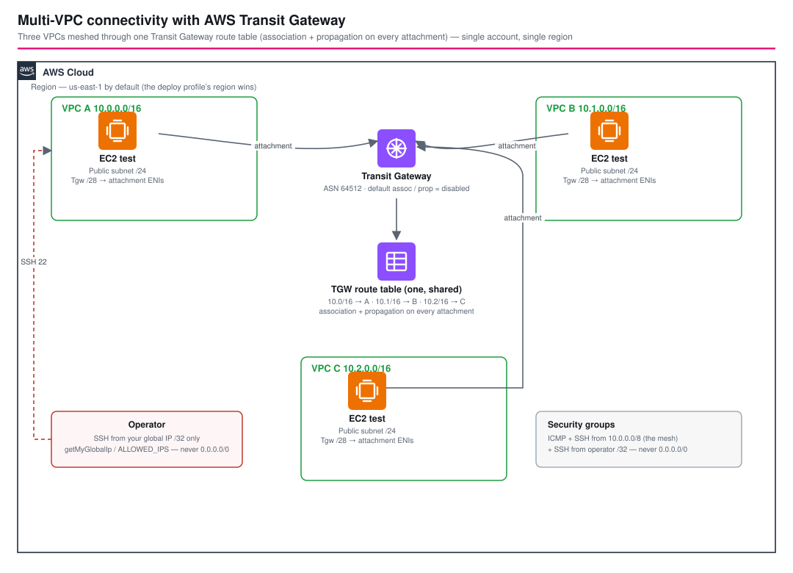

# Multi-VPC Transit Gateway - AWS CDK Reference Architecture

[](./README.ja.md)
[](./README.md)

> **Level: 300 (Advanced)**

Single-account, single-region take on the **AWS Networking Workshop** Transit Gateway lab
([Multi-VPC → Transit Gateway](https://catalog.workshops.aws/workshops/e4953d7d-f92f-4521-89a5-0002765de750/en-US/foundational/multivpc/transit-gw)).
Three VPCs (A / B / C) are joined into a full mesh by **one Transit Gateway**, and one SSM-managed test instance is
dropped into each VPC so connectivity can be verified end to end. It aligns with the AWS Well-Architected Framework
across all six pillars.

> **Where this diverges from the workshop.** The workshop keeps the Transit Gateway's *default* route table
> (automatic association + propagation) and adds a `10.0.0.0/8` aggregate route in VPC B and VPC C. This workspace
> instead creates **one explicitly managed TGW route table** and adds **specific `/16` routes** in every VPC. Both
> choices are deliberate and explained under [Design Decisions](#design-decisions--best-practices); the workshop's
> approach is the simpler baseline, this one is closer to what you would run in production.

## 📑 Table of Contents

- [Architecture Overview](#architecture-overview)
- [Design Decisions & Best Practices](#design-decisions--best-practices)
- [Cost Optimization](#cost-optimization)
- [Security Considerations](#security-considerations)
- [Prerequisites](#prerequisites)
- [Deployment Guide](#deployment-guide)
- [Testing Strategy](#testing-strategy)
- [Customization](#customization)
- [Troubleshooting](#troubleshooting)
- [References](#references)

## 🏗️ Architecture Overview



```text
AWS Region (us-east-1 by default; the deploy profile's region wins)

  VPC A 10.0.0.0/16        VPC B 10.1.0.0/16        VPC C 10.2.0.0/16
  ├─ Public /24  x2 AZ     ├─ Public /24  x2 AZ     ├─ Public /24  x2 AZ
  │   └─ EC2 test          │   └─ EC2 test          │   └─ EC2 test
  └─ Tgw /28    x2 AZ      └─ Tgw /28    x2 AZ      └─ Tgw /28    x2 AZ
       │  (attachment ENIs)    │                        │
       └───────────────┬───────┴────────────┬───────────┘
                       │                    │
              ┌────────┴────────────────────┴────────┐
              │           Transit Gateway            │  ASN 64512
              │  default assoc / prop = DISABLED     │
              ├──────────────────────────────────────┤
              │  TGW route table (one, shared)       │
              │   10.0.0.0/16 → VpcA attachment      │  ← association + propagation
              │   10.1.0.0/16 → VpcB attachment      │     on every attachment
              │   10.2.0.0/16 → VpcC attachment      │
              └──────────────────────────────────────┘

  VPC route tables (public + Tgw subnets) get: <each other VPC CIDR> → tgw-…
```

### Key Components

| Component | Role |
|-----------|------|
| **`TransitGatewayConstruct`** (`@common/constructs/vpc/transit-gateway`) | Creates the Transit Gateway, one shared TGW route table, and per-VPC attachment + association + propagation; adds `<peer CIDR> → TGW` routes to the chosen VPC route tables. Reusable across workspaces. |
| **`VpcConstruct`** (`@common/constructs/vpc/vpc`) | Creates each VPC with a `Public` subnet group (test instance) and a dedicated `/28` `Tgw` isolated subnet group (attachment ENIs), 2 AZs, no NAT Gateway. |
| **`TestInstance`** (`@common/constructs/ec2/ec2-testinstance`) | One `t4g.nano` Amazon Linux 2023 instance per VPC in the public subnet, IMDSv2-only, encrypted EBS, reachable through SSM Session Manager. |
| **Security groups** | Allow ICMP + SSH from `10.0.0.0/8` (the mesh supernet) **and** SSH from the operator's own global IP `/32` only. Never `0.0.0.0/0`. |

### Architecture Characteristics

| Characteristic | Value | Rationale |
|----------------|-------|-----------|
| Availability | Multi-AZ (2 AZ) attachments | A TGW VPC attachment terminates in one subnet per AZ; two AZs keeps the data path up if an AZ fails. |
| Scalability | Hub-and-spoke | Adding VPC #4…#N is one attachment + one association + one propagation, not `N(N-1)/2` peering connections. |
| Security | Least-privilege SGs, dedicated attachment subnets | Attachment ENIs never share a route table with workloads; SSH is pinned to your IP. |
| Cost | No NAT Gateway; `t4g.nano`; flow logs off by default | Keeps the teaching stack cheap; production toggles are called out below. |

## 🧭 Design Decisions & Best Practices

### 1. One explicitly managed TGW route table instead of the default

**Decision**: create the Transit Gateway with `DefaultRouteTableAssociation = disable` and
`DefaultRouteTablePropagation = disable`, then create **one** `AWS::EC2::TransitGatewayRouteTable` that every
attachment is *associated with* (its inbound traffic is evaluated against it) and *propagates into* (its VPC CIDR
is advertised to the others).

**Why**: the AWS Networking Workshop keeps the *default* route table (it says "keep the remaining settings at the
defaults"), which is fine for a lab. But the implicit default table is invisible in IaC and in the console's
"route tables" list — you cannot review, tag, or diff it. An owned route table makes the routing domain auditable
and is the starting point for later segmentation (e.g. splitting into "prod" and "shared-services" tables).
Associating + propagating all three attachments against a single table reproduces the workshop's full mesh with
the least moving parts while keeping every routing decision explicit in the template.

**Trade-off**: two extra CloudFormation resources per attachment. Negligible, and it is the pattern you want to
grow into.

### 2. Dedicated `/28` attachment subnets, isolated from workloads

**Decision**: each VPC has a `Tgw` subnet group of `PRIVATE_ISOLATED` `/28` subnets (one per AZ) used **only**
for the attachment ENIs. Workloads live in the `Public` subnets.

**Why**: the workshop attaches through the existing private subnets; AWS's [Transit Gateway best-practices
guidance](https://docs.aws.amazon.com/vpc/latest/tgw/tgw-best-design-practices.html) is to give each attachment
its own subnet so its route table is not entangled with workload routing. A `/28` (11 usable IPs) is ample for
the ENIs and leaves the address space for real subnets.

### 3. Specific peer-CIDR routes, not a summarized supernet

**Decision**: the construct adds one `<peer VPC CIDR> → TGW` route per remote VPC to each routable subnet's route
table, rather than a single `10.0.0.0/8 → TGW`.

**Why**: the workshop uses specific `/16` routes in VPC A but a `10.0.0.0/8` aggregate in VPC B and VPC C — the
aggregate is quicker to type in a console lab. A broad supernet route silently blackholes any future in-region
service you reach by private IP that happens to fall inside `10/8`, so this workspace uses specific `/16` routes
in *every* VPC: the blast radius of a mistake stays at exactly one VPC and `cdk diff` shows precisely which
reachability changed. The `10.0.0.0/8` value is still used, but only for the **security-group** rules that permit
intra-mesh ICMP/SSH, where over-broad is acceptable because the SG is the second gate, not the first.

### 4. Test instances in public subnets, no NAT Gateway

**Decision**: `natCount: 0`; the per-VPC test instance sits in a public subnet with a public IP.

**Why**: the instance needs outbound HTTPS to reach the SSM endpoints (for Session Manager) and the point of the
stack is to *watch packets cross the TGW*, not to model a production workload. A NAT Gateway per VPC would add
~$0.045/hr × 3 for no teaching value. Production workloads belong in private subnets behind NAT or with VPC
endpoints — see [Customization](#customization).

### 5. `TransitGatewayConstruct` lives in `@common`

It takes only `ec2.IVpc` + subnet lists and has no dependency on this workspace's parameters, so it sits next to
`vpc-peering.ts` under `infrastructure/common/constructs/vpc/` and can be reused by any future architecture.

## 💰 Cost Optimization

Approximate **us-east-1**, on-demand, running 24×7. Data processing is charged per GB in **and** out of the TGW.

| Resource | Qty | Unit | ~Monthly |
|----------|-----|------|----------|
| Transit Gateway attachment | 3 | $0.05 / attachment-hour | ~$108 |
| Transit Gateway data processing | — | $0.02 / GB | $0.02 × traffic GB |
| EC2 `t4g.nano` | 3 | $0.0042 / hr | ~$9 |
| EBS gp3 8 GiB | 3 | $0.08 / GB-month | ~$2 |
| Elastic IP (in use) | 0 | — | $0 |
| **Total (idle)** | | | **~$120 / month** |

Cost levers:

- **The attachment-hours dominate.** This is inherent to Transit Gateway — three attachments cost ~$108/mo before a
  single byte moves. VPC peering has no hourly charge; the [`vpc-peering`](../vpc-peering/) workspace is the
  cheaper choice for a small, static number of VPCs. TGW wins on operational simplicity as VPC count grows.
- `cdk destroy` as soon as you are done — this stack is meant to be short-lived.
- Keep `enableFlowLogsToCloudWatch: false` (the default here) for the demo; enable per-VPC in production and send
  logs to S3 with a lifecycle policy rather than CloudWatch Logs.
- `t4g.nano` on Graviton is already the floor; stop the instances between sessions if you keep the stack up.

## 🔒 Security Considerations

| Control | Implementation |
|---------|----------------|
| **SSH exposure** | Test-instance SGs allow TCP 22 from the operator's own global IP `/32` only (auto-detected via `checkip.amazonaws.com`, or set `ALLOWED_IPS`). No rule uses `0.0.0.0/0`; a unit test asserts this. |
| **Intra-mesh reachability** | ICMP + TCP 22 from `10.0.0.0/8` — deliberately scoped to RFC 1918 space that the three VPCs occupy, never the internet. |
| **Attachment isolation** | ENIs live in dedicated `PRIVATE_ISOLATED` `/28` subnets with no route to the internet. |
| **Instance hardening** | IMDSv2 required, EBS encrypted, SSM Session Manager instead of long-lived SSH keys (a key pair is still created for break-glass). |
| **Least-privilege IAM** | Instances get only `AmazonSSMManagedInstanceCore`. CDK Nag (`AwsSolutionsChecks`) runs in CI; every suppression is scoped to a path and carries a reason. |
| **Blast radius** | Specific `/16` routes (not `10/8`) in the VPC route tables — a misroute affects one VPC. |
| **Default SG** | `@aws-cdk/aws-ec2:restrictDefaultSecurityGroup` is on (repo-wide `cdk.json`), so each VPC's default SG denies all traffic. |

Production hardening: enable VPC Flow Logs on every VPC, move workloads to private subnets, and consider separate
TGW route tables per environment so that (for example) a dev VPC cannot route to a prod VPC.

## ✅ Prerequisites

- Node.js 20+ and the repo bootstrapped (`npm install` at `infrastructure/`)
- An AWS account and a named profile `${PROJECT}-${ENV}` (e.g. `transit-gateway-dev`)
- CDK bootstrapped in the target account/region: `npm run bootstrap -w workspaces/transit-gateway`
- Outbound `curl` to `checkip.amazonaws.com` from the machine running `cdk` (or pass `ALLOWED_IPS`)

## 🚀 Deployment Guide

```bash
export PROJECT=transit-gateway
export ENV=dev            # dev | stg | prd …

# 1. Synthesize (auto-detects your global IP for the SSH allowlist)
npm run synth -w workspaces/transit-gateway

#    …or pin the allowlist explicitly (comma-separated):
ALLOWED_IPS=203.0.113.10 npm run synth -w workspaces/transit-gateway

# 2. Deploy the single stack
npm run deploy:all -w workspaces/transit-gateway

# 3. Verify connectivity (see Testing Strategy) then tear down
npm run destroy:all -w workspaces/transit-gateway
```

Region: the workshop runs in `us-east-1`, but `CDK_DEFAULT_REGION` (from your profile) wins, matching every other
workspace in this repo. Override with an explicit `region` in `parameters/dev-params.ts` if needed.

## 🧪 Testing Strategy

| Layer | File | What it checks |
|-------|------|----------------|
| Snapshot | `test/snapshot/snapshot.test.ts` | Full template + resource-type/count snapshot for the stack. |
| Unit | `test/unit/transit-gateway-stack.test.ts` | 3 VPCs; 1 TGW with default assoc/prop disabled; 1 route table; 3 attachments / associations / propagations; 24 `<peer CIDR> → TGW` routes each depending on its own attachment; per-VPC test instance; SG rules (operator `/32`, `10/8` ICMP+SSH, no `0.0.0.0/0`); `TransitGatewayConstruct` validation (≥2 attachments, unique names). |
| Compliance | `test/compliance/cdk-nag.test.ts` | `AwsSolutionsChecks` with only scoped, documented suppressions (flow logs off, demo test instances). |

```bash
npm test -w workspaces/transit-gateway
npm run test:snapshot:update -w workspaces/transit-gateway   # after an intentional change
```

### Manual connectivity check

```bash
# Open a session on the VPC A instance (id from stack outputs)
aws ssm start-session --target <VpcA test instance id> --profile transit-gateway-dev

# From inside VPC A, ping the private IP of the VPC B / VPC C instances
ping <VpcB instance private IP>     # 10.1.x.x  → succeeds across the TGW
ping <VpcC instance private IP>     # 10.2.x.x  → succeeds across the TGW
```

Both pings succeed once the attachments are `available` and the route tables have converged (usually < 1 min after
`deploy` completes). If a ping hangs, jump to [Troubleshooting](#troubleshooting).

## 🔧 Customization

| Goal | Change |
|------|--------|
| Different CIDRs / more AZs | `vpc{A,B,C}Config.createConfig` in `parameters/dev-params.ts` (`cidr`, `maxAzs`). |
| Add a 4th VPC | Add `vpcDConfig`, extend the `TransitGatewayParams` type and the `definitions` array in the stack. The construct already handles N attachments. |
| Private workloads | Add a `PRIVATE_WITH_EGRESS` subnet group, set `natCount: 1`, and launch `TestInstance` with `targetSubnetType: PRIVATE_WITH_EGRESS`. |
| Segmented routing | Give the construct more than one route table and associate/propagate selectively (e.g. a shared-services table). |
| Custom ASN | `amazonSideAsn` in the params (64512–65534 for private use). |
| Restrict the mesh SG | Set `connectedNetworkCidr` to a tighter supernet, or replace the `10/8` rules with per-peer `/16` rules. |

## 🩺 Troubleshooting

| Symptom | Likely cause | Fix |
|---------|--------------|-----|
| `synth` fails with *Could not retrieve global IP address* | No outbound `curl` to `checkip.amazonaws.com` (CI, restricted network) | Pass `ALLOWED_IPS=<your.ip>` explicitly. |
| Cross-VPC ping times out | Attachment still `pending`, or SG missing the ICMP rule | `aws ec2 describe-transit-gateway-attachments`; confirm the target SG allows ICMP from `10.0.0.0/8`. |
| Ping works one direction only | Return route missing in the *other* VPC's subnet route table | Check that subnet's route table has `<origin CIDR> → tgw-…`; this stack adds it to public + `Tgw` subnets only. |
| SSM `start-session` fails | Instance has no outbound HTTPS (public IP not assigned, or IGW route missing) | Confirm the instance is in the `Public` subnet and has a public IP; check the `0.0.0.0/0 → igw` route. |
| `cdk destroy` leaves the TGW | Attachments deleted but manual routes elsewhere still reference it | Remove any out-of-band TGW routes/attachments, then retry. |
| CDK Nag test fails after an edit | New resource triggers a rule | Add a **scoped, documented** suppression in `test/compliance/cdk-nag.test.ts` — do not broaden existing ones. |

## 📚 References

- AWS Networking Workshop — Multi-VPC → Transit Gateway: <https://catalog.workshops.aws/workshops/e4953d7d-f92f-4521-89a5-0002765de750/en-US/foundational/multivpc/transit-gw> (workshop home: <https://catalog.workshops.aws/workshops/e4953d7d-f92f-4521-89a5-0002765de750/en-US>)
- [Amazon VPC attachments in AWS Transit Gateway](https://docs.aws.amazon.com/vpc/latest/tgw/tgw-vpc-attachments.html)
- [Transit gateway route tables](https://docs.aws.amazon.com/vpc/latest/tgw/tgw-route-tables.html)
- [How AWS Transit Gateway works](https://docs.aws.amazon.com/vpc/latest/tgw/how-transit-gateways-work.html)
- Related workspace: [`vpc-peering`](../vpc-peering/) — the same three VPCs joined with peering instead, and why that is cheaper but scales worse.
