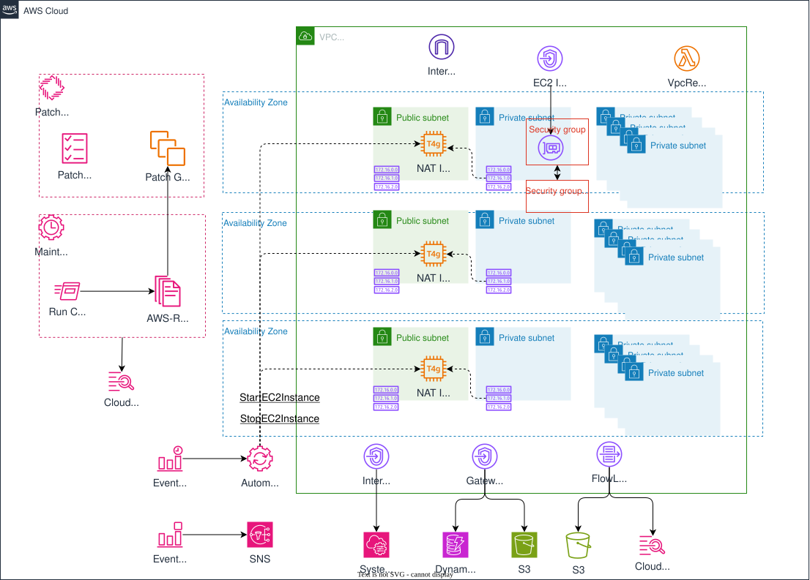

# VPC with NAT Instance v2<!-- omit in toc -->

*他の言語で読む:* [](./README.ja.md) [](./README.md)


## 目次<!-- omit in toc -->

- [はじめに](#はじめに)
- [アーキテクチャ概要](#アーキテクチャ概要)
  - [主な変更点](#主な変更点)
- [前提条件](#前提条件)
- [NAT Instance v2の実装](#nat-instance-v2の実装)
  - [1. NAT Provider の作成](#1-nat-provider-の作成)
    - [なぜt4g.nano?](#なぜt4gnano)
  - [2. VPCからNAT Instanceへのトラフィック許可](#2-vpcからnat-instanceへのトラフィック許可)
- [EventBridgeによる自動起動/停止](#eventbridgeによる自動起動停止)
  - [1. IAMロールの作成](#1-iamロールの作成)
  - [2. スケジュールルールの作成](#2-スケジュールルールの作成)
    - [Cron式の理解](#cron式の理解)
- [Elastic IPの静的割り当て](#elastic-ipの静的割り当て)
  - [なぜ静的IPが必要?](#なぜ静的ipが必要)
- [NAT Instance状態変化の監視](#nat-instance状態変化の監視)
  - [1. SNSトピックの作成](#1-snsトピックの作成)
  - [2. EventBridgeルールの作成](#2-eventbridgeルールの作成)
  - [3. メール通知の設定（オプション）](#3-メール通知の設定オプション)
    - [通知されるイベント](#通知されるイベント)
- [NAT Gateway vs NAT Instance: トレードオフ](#nat-gateway-vs-nat-instance-トレードオフ)
  - [機能比較表](#機能比較表)
  - [推奨される使用シーン](#推奨される使用シーン)
    - [NAT Gatewayを使うべきユースケース](#nat-gatewayを使うべきユースケース)
    - [NAT Instanceを使うユースケース](#nat-instanceを使うユースケース)
  - [パフォーマンス比較](#パフォーマンス比較)
- [コスト分析](#コスト分析)
  - [詳細コスト比較（東京リージョン）](#詳細コスト比較東京リージョン)
    - [1. NAT Gateway（従来）](#1-nat-gateway従来)
    - [2. NAT Instance (t4g.nano) - 24時間稼働](#2-nat-instance-t4gnano---24時間稼働)
    - [3. NAT Instance - 営業時間のみ（平日9時間）](#3-nat-instance---営業時間のみ平日9時間)
  - [環境別推奨構成とコスト](#環境別推奨構成とコスト)
- [パッチ適用の自動化](#パッチ適用の自動化)
  - [1. NAT InstanceへのSSM権限付与](#1-nat-instanceへのssm権限付与)
  - [2. パッチベースラインの作成](#2-パッチベースラインの作成)
  - [3. メンテナンスウィンドウの設定](#3-メンテナンスウィンドウの設定)
    - [3.1. メンテナンスウィンドウ用IAMロール](#31-メンテナンスウィンドウ用iamロール)
    - [3.2. メンテナンスウィンドウの作成](#32-メンテナンスウィンドウの作成)
    - [3.3. パッチタスクの設定](#33-パッチタスクの設定)
  - [5. パッチ適用状態の監視](#5-パッチ適用状態の監視)
  - [パッチ管理のポイント](#パッチ管理のポイント)
  - [パッチ適用の流れ](#パッチ適用の流れ)
- [ベストプラクティス](#ベストプラクティス)
  - [1. セキュリティ](#1-セキュリティ)
  - [2. 監視とアラート](#2-監視とアラート)
  - [3. 開発環境での最適な可用性](#3-開発環境での最適な可用性)
- [トラブルシューティング](#トラブルシューティング)
  - [よくある問題と解決策](#よくある問題と解決策)
    - [1. NAT Instance停止後、プライベートサブネットからインターネットにアクセスできない](#1-nat-instance停止後プライベートサブネットからインターネットにアクセスできない)
    - [2. Systems Managerにインスタンスが表示されない](#2-systems-managerにインスタンスが表示されない)
    - [3. パッチ適用が失敗する](#3-パッチ適用が失敗する)
    - [4. パフォーマンスが低い](#4-パフォーマンスが低い)
    - [5. 予期しない停止](#5-予期しない停止)
  - [トラブルシューティングのポイント](#トラブルシューティングのポイント)
- [デプロイとクリーンアップ](#デプロイとクリーンアップ)
  - [デプロイ](#デプロイ)
  - [クリーンアップ](#クリーンアップ)
- [まとめ](#まとめ)
  - [推奨事項](#推奨事項)
- [参考リンク](#参考リンク)

## はじめに

このアーキテクチャでは、以下の実装を確認することができます。

- NAT Instance v2の実装方法
- EventBridgeによる自動起動/停止スケジュール
- NAT Instanceへの静的Elastic IP割り当て
- NAT Instance状態変化の監視とSNS通知
- Systems Manager Patch Managerによる自動パッチ適用
- メンテナンスウィンドウの設定と運用
- NAT GatewayとNAT Instanceのトレードオフ

## アーキテクチャ概要



VPC内の基本構成は[vpc-basics](https://github.com/ishiharatma/aws-cdk-reference-architectures/tree/main/infrastructure/workspaces/vpc-basics)と同じですが、以下の点が異なります。

### 主な変更点

1. NAT Gateway → NAT Instance: マネージドNATサービスからEC2ベースのNATインスタンスへ変更
2. EventBridgeスケジュール: 自動起動/停止のスケジュール設定
3. Elastic IP割り当て: NAT Instanceに静的IPアドレスを割り当て
4. SNS通知: NAT Instanceの状態変化を監視
5. Patch Manager: Systems Managerによる自動パッチ適用

## 前提条件

[vpc-basics](https://github.com/ishiharatma/aws-cdk-reference-architectures/tree/main/infrastructure/workspaces/vpc-basics)の前提条件に加えて、以下が必要になります。

- EventBridgeとSNSの基本的な理解
- EC2インスタンスタイプの知識

## NAT Instance v2の実装

### 1. NAT Provider の作成

CDK v2では、`NatProvider.instanceV2()`を使用してNATインスタンスを簡単に作成できます。

```typescript
import * as ec2 from 'aws-cdk-lib/aws-ec2';

// NAT Instance Providerの作成
const natProvider = ec2.NatProvider.instanceV2({
  instanceType: ec2.InstanceType.of(
    ec2.InstanceClass.T4G,  // ARM-based Graviton2
    ec2.InstanceSize.NANO   // 最小サイズでコスト最適化
  ),
  machineImage: ec2.MachineImage.latestAmazonLinux2023({
    edition: ec2.AmazonLinuxEdition.STANDARD,
    cpuType: ec2.AmazonLinuxCpuType.ARM_64,  // Graviton2用
  }),
  defaultAllowedTraffic: ec2.NatTrafficDirection.OUTBOUND_ONLY,
});

// VPCにNAT Providerを適用
const vpc = new ec2.Vpc(this, 'VpcNatInstanceV2', {
  vpcName,
  ipAddresses: ec2.IpAddresses.cidr('10.1.0.0/16'),
  maxAzs: 3,
  natGateways: 3,  // 各AZに1つずつ
  natGatewayProvider: natProvider,  // NAT Instanceを使用
  subnetConfiguration: [
    // サブネット設定は前回と同じ
    // ...
  ],
});
```

#### なぜt4g.nano?

※ 東京リージョンの価格

| インスタンスタイプ | vCPU | メモリ | 料金/時 (東京) | 月額 | 用途 |
|-------------------|------|--------|----------------|------|------|
| t4g.nano | 2 | 0.5 GB | $0.0054 | ~$3.94 | 開発環境の小規模トラフィック |
| t4g.micro | 2 | 1 GB | $0.0108 | ~$7.88 | 中規模トラフィック |
| t3.nano | 2 | 0.5 GB | $0.0068 | ~$4.96 | x86が必要な場合 |

💡 Graviton2 (ARM)のメリット:

- 同等のx86インスタンスより約20%安価
- パフォーマンスあたりのコストパフォーマンスが優れている
- Amazon Linux 2023が完全対応

### 2. VPCからNAT Instanceへのトラフィック許可

NAT Instanceは、VPC内のすべてのトラフィックを受け入れる必要があります。

```typescript
// VPC CIDRからのすべてのトラフィックを許可
(natProvider as ec2.NatInstanceProviderV2).connections.allowFrom(
  ec2.Peer.ipv4(vpc.vpcCidrBlock),
  ec2.Port.allTraffic(),
  'Allow all traffic from VPC',
);
```

これにより、プライベートサブネット内のリソースがNAT Instanceを経由してインターネットにアクセスできます。

## EventBridgeによる自動起動/停止

営業時間外はNAT Instanceを停止することで、さらにコストを削減できます。

### 1. IAMロールの作成

```typescript
import * as iam from 'aws-cdk-lib/aws-iam';

const natInstanceScheduleRole = new iam.Role(this, 'NatInstanceScheduleRole', {
  roleName: [props.project, props.environment, 'NatInstanceSchedule'].join('-'),
  assumedBy: new iam.ServicePrincipal('events.amazonaws.com'),
  managedPolicies: [
    iam.ManagedPolicy.fromAwsManagedPolicyName(
      'service-role/AmazonSSMAutomationRole'
    ),
  ],
});
```

### 2. スケジュールルールの作成

```typescript
import * as events from 'aws-cdk-lib/aws-events';

const region = cdk.Stack.of(this).region;

// スケジュール設定（UTC時間）
const startCronSchedule = 'cron(0 0 ? * * *)'; // 00:00 UTC (JST 09:00)
const stopCronSchedule = 'cron(0 9 ? * * *)';  // 09:00 UTC (JST 18:00)

const natInstanceIds: string[] = [];

natProvider.configuredGateways.forEach((nat, index) => {
  natInstanceIds.push(nat.gatewayId);
  
  // 起動スケジュール
  new events.CfnRule(this, `EC2StartRule${index + 1}`, {
    name: [props.project, props.environment, 'NATStartRule', nat.gatewayId].join('-'),
    description: `${nat.gatewayId} ${startCronSchedule} Start`,
    scheduleExpression: startCronSchedule,
    targets: [{
      arn: `arn:aws:ssm:${region}::automation-definition/AWS-StartEC2Instance:$DEFAULT`,
      id: 'TargetEC2Instance1',
      input: `{"InstanceId": ["${nat.gatewayId}"]}`,
      roleArn: natInstanceScheduleRole.roleArn,
    }],
  });

  // 停止スケジュール
  new events.CfnRule(this, `EC2StopRule${index + 1}`, {
    name: [props.project, props.environment, 'NATStopRule', nat.gatewayId].join('-'),
    description: `${nat.gatewayId} ${stopCronSchedule} Stop`,
    scheduleExpression: stopCronSchedule,
    targets: [{
      arn: `arn:aws:ssm:${region}::automation-definition/AWS-StopEC2Instance:$DEFAULT`,
      id: 'TargetEC2Instance1',
      input: `{"InstanceId": ["${nat.gatewayId}"]}`,
      roleArn: natInstanceScheduleRole.roleArn,
    }],
  });
});
```

#### Cron式の理解

```text
cron(分 時 日 月 曜日 年)

例:
cron(0 0 ? * * *)     # 毎日00:00 UTC
cron(0 9 ? * * *)     # 毎日09:00 UTC
cron(0 0 ? * MON-FRI *) # 平日のみ00:00 UTC
cron(0 0 1 * ? *)     # 毎月1日00:00 UTC
```

💡 タイムゾーンの注意点:

- EventBridgeのcronはUTC時間
- JST = UTC + 9時間
- JST 09:00 = UTC 00:00
- JST 18:00 = UTC 09:00

環境ごとのスケジュール例:

| 環境 | 稼働時間 (JST) | 開始 (UTC) | 停止 (UTC) | 月額コスト |
|------|---------------|-----------|-----------|---------------------|
| 開発 | 平日 9:00-18:00 | `cron(0 0 ? * MON-FRI *)` | `cron(0 9 ? * MON-FRI *)` | ~$1.07 (t4g.nano) |
| テスト | 毎日 9:00-18:00 | `cron(0 0 ? * * *)` | `cron(0 9 ? * * *)` | ~$3.89 (t4g.nano) |
| ステージング | 24時間 | 本番同等でNAT Gatewayを推奨 | 本番同等でNAT Gatewayを推奨 | ~$44.64 |
| 本番 | 24時間 | NAT Gatewayを推奨 | NAT Gatewayを推奨 | ~$44.64 |

## Elastic IPの静的割り当て

NAT Instanceには、静的なElastic IPを割り当てることで、アウトバウンド通信の送信元IPアドレスを固定できます。

```typescript
const outboundEips: ec2.CfnEIP[] = [];

natProvider.configuredGateways.forEach((nat, index) => {
  // Elastic IPの作成
  const eip = new ec2.CfnEIP(this, `NatEip${index + 1}`, {
    tags: [{
      key: "Name",
      value: `${props.project}/${props.environment}/NatEIP${index + 1}`
    }],
  });
  eip.applyRemovalPolicy(cdk.RemovalPolicy.DESTROY);

  // NAT InstanceにElastic IPを関連付け
  new ec2.CfnEIPAssociation(this, `NatEipAssociation${index + 1}`, {
    allocationId: eip.attrAllocationId,
    instanceId: nat.gatewayId,
  });

  // CloudFormation Outputとして出力
  new cdk.CfnOutput(this, `NatInstance${index + 1}PublicIP`, {
    value: eip.ref,
    description: `Public IP address of NAT Instance ${index + 1}`,
  });

  outboundEips.push(eip);
});
```

### なぜ静的IPが必要?

1. ホワイトリスト登録: 外部APIやサービスがIPアドレスベースのアクセス制御を行っている場合
2. セキュリティグループ: 他のVPCやオンプレミスからのアクセス制御
3. 監査とログ: 固定IPアドレスにより、ログ分析が容易

⚠️ 注意: Elastic IPは、インスタンスに関連付けられていない場合、時間料金が発生します。必ずインスタンスに関連付けるか、不要な場合は削除してください。

## NAT Instance状態変化の監視

NAT Instanceの状態変化を監視し、問題発生時に通知を受け取る仕組みを実装します。

### 1. SNSトピックの作成

```typescript
import * as sns from 'aws-cdk-lib/aws-sns';

const snsTopic = new sns.Topic(this, 'NatInstanceStateChangeTopic', {
  displayName: `${props.project}-${props.environment}-NatInstanceStateChange`,
  topicName: `${props.project}-${props.environment}-NatInstanceStateChange`,
  enforceSSL: true,  // SSL/TLS必須
});
```

### 2. EventBridgeルールの作成

```typescript
import * as targets from 'aws-cdk-lib/aws-events-targets';

const ec2ChangeStateRule = new events.Rule(this, 'NatInstanceStateChangeRule', {
  eventPattern: {
    source: ['aws.ec2'],
    detailType: ['EC2 Instance State-change Notification'],
    detail: {
      'instance-id': natInstanceIds,  // 監視対象のNAT Instance ID
      state: ['stopped', 'terminated', 'shutting-down', 'pending', 'running'],
    },
  },
});

// SNSトピックにメッセージを送信
ec2ChangeStateRule.addTarget(new targets.SnsTopic(snsTopic, {
  message: events.RuleTargetInput.fromObject({
    default: events.EventField.fromPath('$.detail'),
    subject: `[${props.project.toUpperCase()}-${props.environment.toUpperCase()}] NAT Instance State Changed`,
    message: {
      summary: `NAT Instance state changed to ${events.EventField.fromPath('$.detail.state')}`,
      details: {
        instanceId: events.EventField.fromPath('$.detail.instance-id'),
        state: events.EventField.fromPath('$.detail.state'),
        time: events.EventField.fromPath('$.time'),
        region: events.EventField.fromPath('$.region'),
        account: events.EventField.fromPath('$.account'),
      },
      metadata: {
        project: props.project,
        environment: props.environment,
      },
    },
  }),
}));
```

### 3. メール通知の設定（オプション）

```typescript
import * as subscriptions from 'aws-cdk-lib/aws-sns-subscriptions';

// 管理者のメールアドレスに通知を送信
snsTopic.addSubscription(
  new subscriptions.EmailSubscription('admin@example.com')
);
```

デプロイ後、AWS SNSからの確認メールを承認する必要があります。

#### 通知されるイベント

| 状態 | 説明 | 対応 |
|------|------|------|
| `pending` | 起動中 | 正常 - スケジュール起動 |
| `running` | 実行中 | 正常 - インスタンス稼働中 |
| `stopping` | 停止中 | 正常 - スケジュール停止 |
| `stopped` | 停止済み | 正常 - コスト節約中 |
| `shutting-down` | シャットダウン中 | ⚠️ 確認必要 |
| `terminated` | 終了済み | ⚠️ 緊急対応必要 |

## NAT Gateway vs NAT Instance: トレードオフ

### 機能比較表

| 特性 | NAT Gateway | NAT Instance |
|------|------------|--------------|
| 可用性 | ✅フルマネージド | 自己管理 |
| スケーラビリティ | ✅自動 | インスタンスタイプに依存 |
| パフォーマンス | ✅高い（100 Gbpsまで） | インスタンスタイプに依存 |
| コスト | 高い（$44.64/月〜） | ✅低い（$3.94/月〜） |
| スケジュール停止 | なし※1 | ✅可能 |
| ソース/デスティネーションチェック | N/A | 無効化が必要 |
| セキュリティグループ | 使用不可 | ✅使用可能 |
| パッチ適用 | ✅自動 | 手動または自動化が必要 |
| モニタリング | CloudWatch標準メトリクス | CloudWatch + カスタムメトリクス |

※1: NAT Gatewayの停止はないが、作成と削除を行うことでスケジュール停止と同等の仕組みは構築可能です

### 推奨される使用シーン

#### NAT Gatewayを使うべきユースケース

- 本番環境
- 高可用性が必須
- 高トラフィック（> 5 Gbps）
- マネージドサービスを優先
- 運用コストを最小化したい

#### NAT Instanceを使うユースケース

- 開発/テスト環境
- 低トラフィック（< 1 Gbps）
- コスト最適化が最優先
- スケジュール起動/停止が可能
- 営業時間外の稼働不要
- 細かいトラフィック制御が必要

### パフォーマンス比較

実測ベースの目安（トラフィック処理能力）:

| リソース | 最大スループット | レイテンシー | 同時接続数 |
|---------|----------------|-------------|----------|
| NAT Gateway | 5 ~ 100 Gbps | 低い | 55,000 * IP数(最大8) |
| t4g.nano | ~ 5 Gbps | やや高い | (~50,000) |
| t4g.micro | ~ 5 Gbps | やや高い | (~50,000) |
| t4g.small | ~ 5 Gbps | やや高い | (~50,000) |

💡 開発環境のトラフィックは通常100 Mbps未満のため、t4g.nanoで十分です。

## コスト分析

### 詳細コスト比較（東京リージョン）

#### 1. NAT Gateway（従来）

```text
NAT Gateway 基本料金: $0.062/時間
= $0.062 × 24時間 × 30日 = $44.64/月

データ処理料金: $0.062/GB
想定: 100GB/月 = $6.20/月

合計: $50.84/月
年間: $610.08
```

#### 2. NAT Instance (t4g.nano) - 24時間稼働

```text
EC2 料金: $0.0054/時間
= $0.0054 × 24時間 × 30日 = $3.888/月

EBS (8GB gp3): $0.096/月 × 8GB
Elastic IP (関連付け済み): $0.005/時

合計: $4.656/月
年間: $55.872

削減額: $554.208/年 (90.8%削減)
```

#### 3. NAT Instance - 営業時間のみ（平日9時間）

```text
稼働時間: 9時間/日 × 22営業日 = 198時間/月

EC2 料金: $0.0054 × 198 = $1.0692/月
EBS: $0.768/月
Elastic IP: $0.005/月

合計: $1.8422/月
年間: $22.1064

削減額: $587.9736/年 (96.4%削減)
```

### 環境別推奨構成とコスト

| 環境 | 構成 | 稼働時間 | 月額コスト | 年間コスト |
|------|------|---------|----------|----------|
| 開発 | NAT Instance (t4g.nano) | 平日9時間 | $1.8422 | $22.1064 |
| テスト | NAT Instance (t4g.nano) | 平日9時間 | $1.8422 | $22.1064 |
| ステージング |NAT Gateway × 1 | 24時間 | $44.64 | $535.68 |
| 本番 | NAT Gateway × 3 (各AZ) | 24時間 | $152.52 | $1,830.24 |

💡 3つの環境全体での最適化:

- NAT Gateway使用: $2,365.92/年
- NAT Instance使用: $44.21/年（開発+テスト）

## パッチ適用の自動化

NAT InstanceはEC2ベースのため、セキュリティパッチの適用が必要です。Systems Manager Patch Managerを使用して自動化します。

### 1. NAT InstanceへのSSM権限付与

まず、NAT InstanceがSystems Managerに登録されるよう、IAMロールに必要な権限を追加します。

```typescript
// NAT Instanceにパッチグループタグを追加
natProvider.configuredGateways.forEach((nat, index) => {
  natInstanceIds.push(nat.gatewayId);

  const findNatInstance = this.vpc.node.findAll().find(
    (child) => child instanceof ec2.CfnInstance && 
               (child as ec2.CfnInstance).ref === nat.gatewayId
  ) as ec2.CfnInstance;

  if (findNatInstance) {
    // パッチ管理用のタグを追加
    cdk.Tags.of(findNatInstance).add('PatchGroup', 
      `/NatInstance/${props.project}/${props.environment}`);
    cdk.Tags.of(findNatInstance).add('AutoPatch', 'true');
    cdk.Tags.of(findNatInstance).add('Role', 'NAT Instance');

    // NAT InstanceのIAMロールにSSM権限を追加
    const natInstanceRole = this.vpc.node.findAll().find(
      (child) => child instanceof iam.Role && 
                 child.node.path.includes('InstanceRole') &&
                 child.node.path.includes(`ExternalSubnet${index + 1}`)
    ) as iam.Role;

    if (natInstanceRole) {
      // Systems Manager管理用のポリシーを追加
      natInstanceRole.addManagedPolicy(
        iam.ManagedPolicy.fromAwsManagedPolicyName('AmazonSSMManagedInstanceCore')
      );
    }
  }
});
```

💡 **重要**: `AmazonSSMManagedInstanceCore`ポリシーがないと、NAT InstanceはSystems Manager Fleet Managerに登録されず、パッチ管理が機能しません。

### 2. パッチベースラインの作成

```typescript
import * as ssm from 'aws-cdk-lib/aws-ssm';

const patchBaseline = new ssm.CfnPatchBaseline(this, 'NatInstancePatchBaseline', {
  name: `${props.project}-${props.environment}-NatInstancePatchBaseline`,
  operatingSystem: 'AMAZON_LINUX_2023',
  patchGroups: [`/NatInstance/${props.project}/${props.environment}`],
  approvalRules: {
    patchRules: [
      {
        approveAfterDays: 7, // 7日後に自動承認
        complianceLevel: 'CRITICAL',
        enableNonSecurity: false, // セキュリティパッチのみ
        patchFilterGroup: {
          patchFilters: [
            {
              key: 'CLASSIFICATION',
              values: ['Security'],
            },
            {
              key: 'SEVERITY',
              values: ['Critical', 'Important'], // 重要度の高いパッチのみ
            },
          ],
        },
      },
      {
        approveAfterDays: 7, // 7日後に自動承認
        enableNonSecurity: false, // セキュリティパッチのみ
        patchFilterGroup: {
          patchFilters: [
            {
              key: 'CLASSIFICATION',
              values: ['Bugfix'],
            },
          ],
        },
      }
    ],
  },
});
```

### 3. メンテナンスウィンドウの設定

#### 3.1. メンテナンスウィンドウ用IAMロール

```typescript
// メンテナンスウィンドウ用のIAMロール
const maintenanceWindowRole = new iam.Role(this, 'MaintenanceWindowRole', {
  roleName: `${props.project}-${props.environment}-MaintenanceWindowRole`,
  assumedBy: new iam.CompositePrincipal(
    new iam.ServicePrincipal('ssm.amazonaws.com'),
    new iam.ServicePrincipal('ec2.amazonaws.com')
  ),
  managedPolicies: [
    iam.ManagedPolicy.fromAwsManagedPolicyName(
      'service-role/AmazonSSMMaintenanceWindowRole'
    ),
    iam.ManagedPolicy.fromAwsManagedPolicyName('AmazonSSMManagedInstanceCore'),
  ],
});

// SSMがロールを渡せるようにiam:PassRole権限を追加
maintenanceWindowRole.addToPolicy(new iam.PolicyStatement({
  effect: iam.Effect.ALLOW,
  actions: ['iam:PassRole'],
  resources: [maintenanceWindowRole.roleArn],
  conditions: {
    StringEquals: {
      'iam:PassedToService': 'ssm.amazonaws.com',
    },
  },
}));
```

💡 ポイント:

- `CompositePrincipal`で複数のサービスプリンシパルを設定
- `iam:PassRole`に条件付きポリシーを適用してセキュリティを強化
- `StringEquals`条件でSSMサービスのみがロールを引き受けられるよう制限

#### 3.2. メンテナンスウィンドウの作成

```typescript
// メンテナンスウィンドウの作成（毎週日曜日 3:00 UTC = 12:00 JST）
const maintenanceWindow = new ssm.CfnMaintenanceWindow(this, 'NatInstanceMaintenanceWindow', {
  name: `${props.project}-${props.environment}-NatInstancePatch`,
  description: 'Maintenance window for NAT instance patching',
  allowUnassociatedTargets: false,
  cutoff: 1, // タスク実行停止時間（時間）
  duration: 4, // ウィンドウの長さ（時間）
  schedule: 'cron(0 3 ? * SUN *)', // 毎週日曜日 3:00 UTC
  scheduleTimezone: 'UTC',
});
```

#### 3.3. パッチタスクの設定

```typescript
// パッチ通知用のSNSトピック
const patchNotificationTopic = new sns.Topic(this, 'NatInstancePatchNotificationTopic', {
  displayName: `${props.project}-${props.environment}-NatInstancePatchNotification`,
  topicName: `${props.project}-${props.environment}-NatInstancePatchNotification`,
  enforceSSL: true,
});

// メンテナンスウィンドウのターゲット（NAT Instances）
const maintenanceWindowTarget = new ssm.CfnMaintenanceWindowTarget(
  this,
  'NatInstanceMaintenanceWindowTarget',
  {
    windowId: maintenanceWindow.ref,
    resourceType: 'INSTANCE',
    targets: [
        {
          key: 'tag:PatchGroup',
          values: [`/NatInstance/${props.project}/${props.environment}`],
        },
        {
          key: 'tag:AutoPatch',
          values: ['true'],
        }
    ],
    name: `${props.project}-${props.environment}-NatInstances`,
  }
);

// パッチタスクの作成
new ssm.CfnMaintenanceWindowTask(this, 'NatInstancePatchTask', {
  windowId: maintenanceWindow.ref,
  taskType: 'RUN_COMMAND',
  serviceRoleArn: maintenanceWindowRole.roleArn,
  taskArn: 'AWS-RunPatchBaseline', // AWS提供のパッチドキュメント
  priority: 1,
  maxConcurrency: '1', // 1台ずつ順次実行
  maxErrors: '1',
  targets: [
    {
      key: 'WindowTargetIds',
      values: [maintenanceWindowTarget.ref],
    },
  ],
  taskInvocationParameters: {
    maintenanceWindowRunCommandParameters: {
      comment: 'Apply security patches to NAT instances',
      documentVersion: '$DEFAULT',    
      serviceRoleArn: maintenanceWindowRole.roleArn,
      notificationConfig: {
        notificationArn: patchNotificationTopic.topicArn,
        notificationEvents: ['All'],
        notificationType: 'Command',
      },
      parameters: {
        Operation: ['Install'],
        RebootOption: ['RebootIfNeeded'], // 必要に応じて再起動
      },
      timeoutSeconds: 3600, // 1時間のタイムアウト
      cloudWatchOutputConfig: {
        cloudWatchLogGroupName: logGroupName,
        cloudWatchOutputEnabled: true,
      },
    },
  },
});
```

💡 ポイント:

- `serviceRoleArn`をRunCommandパラメータに明示的に設定（通知設定がある場合は必須）
- タグベースのターゲット選択で柔軟な管理を実現
- CloudWatch Logsへの出力でトラブルシューティングを容易化

### 5. パッチ適用状態の監視

```typescript
import * as cloudwatch from 'aws-cdk-lib/aws-cloudwatch';
import * as cloudwatchActions from 'aws-cdk-lib/aws-cloudwatch-actions';

// パッチ適用結果を通知するEventBridgeルール
const patchComplianceRule = new events.Rule(this, 'PatchComplianceRule', {
  ruleName: `${props.project}-${props.environment}-NatInstancePatchCompliance`,
  description: 'Notify patch compliance status changes',
  eventPattern: {
    source: ['aws.ssm'],
    detailType: ['EC2 Command Status-change Notification'],
    detail: {
      'status': ['Success', 'Failed', 'TimedOut'],
      'document-name': ['AWS-RunPatchBaseline'],
    },
  },
});

patchComplianceRule.addTarget(new targets.SnsTopic(patchNotificationTopic, {
  message: events.RuleTargetInput.fromObject({
    default: events.EventField.fromPath('$.detail'),
    subject: `[${props.project.toUpperCase()}-${props.environment.toUpperCase()}] NAT Instance Patch Status`,
    message: {
      summary: `Patch operation ${events.EventField.fromPath('$.detail.status')}`,
      details: {
        commandId: events.EventField.fromPath('$.detail.command-id'),
        instanceId: events.EventField.fromPath('$.detail.instance-id'),
        status: events.EventField.fromPath('$.detail.status'),
        documentName: events.EventField.fromPath('$.detail.document-name'),
      },
    },
  }),
}));

// コンプライアンス違反のアラーム
const complianceMetric = new cloudwatch.Metric({
  namespace: 'AWS/SSM',
  metricName: 'PatchComplianceNonCompliantCount',
  dimensionsMap: {
    PatchGroup: `/NatInstance/${props.project}/${props.environment}`,
  },
  statistic: 'Average',
  period: cdk.Duration.hours(1),
});

new cloudwatch.Alarm(this, 'PatchComplianceAlarm', {
  alarmName: `${props.project}-${props.environment}-NatInstancePatchNonCompliant`,
  metric: complianceMetric,
  threshold: 0,
  evaluationPeriods: 2,
  comparisonOperator: cloudwatch.ComparisonOperator.GREATER_THAN_THRESHOLD,
  treatMissingData: cloudwatch.TreatMissingData.NOT_BREACHING,
}).addAlarmAction(new cloudwatchActions.SnsAction(patchNotificationTopic));
```

### パッチ管理のポイント

| 項目 | 設定値 | 理由 |
|------|--------|------|
| 実行タイミング | 毎週日曜日 3:00 UTC (12:00 JST) | トラフィックが少ない時間帯 |
| ウィンドウ長 | 4時間 | 複数インスタンスへの順次適用に対応 |
| 同時実行数 | 1台 | 可用性を維持するため順次実行 |
| 再起動 | 必要に応じて | カーネルパッチ適用時など |
| 承認期間 | 7日 | テスト済みパッチのみを適用 |
| 対象パッチ | Critical/Important のセキュリティパッチ | 重要度の高いものを優先 |

### パッチ適用の流れ

```text
1. 毎週日曜日 12:00 JST
   ↓
2. メンテナンスウィンドウ開始
   ↓
3. NAT Instance 1台目にパッチ適用
   ↓ (必要に応じて再起動)
   ↓
4. NAT Instance 2台目にパッチ適用
   ↓ (必要に応じて再起動)
   ↓
5. NAT Instance 3台目にパッチ適用
   ↓ (必要に応じて再起動)
   ↓
6. 完了通知（SNS経由）
```

💡 開発環境の場合: 1台のNAT Instanceのみの構成では、パッチ適用中（特に再起動時）はインターネット接続が一時的に失われます。メンテナンスウィンドウは営業時間外に設定することを推奨します。

## ベストプラクティス

### 1. セキュリティ

```typescript
// ✅ NAT Instanceのソース/デスティネーションチェックを無効化
// （NatProvider.instanceV2()が自動的に設定）

// ✅ セキュリティグループでトラフィックを制限
(natProvider as ec2.NatInstanceProviderV2).connections.allowFrom(
  ec2.Peer.ipv4(vpc.vpcCidrBlock),
  ec2.Port.allTraffic(),
  'Allow all traffic from VPC',
);

// ✅ Systems Manager Session Managerでアクセス
// （パブリックSSHアクセスを無効化）
```

### 2. 監視とアラート

```typescript
// CloudWatchアラームの設定例
import * as cloudwatch from 'aws-cdk-lib/aws-cloudwatch';
import * as actions from 'aws-cdk-lib/aws-cloudwatch-actions';

const cpuAlarm = new cloudwatch.Alarm(this, 'NatInstanceCpuAlarm', {
  metric: new cloudwatch.Metric({
    namespace: 'AWS/EC2',
    metricName: 'CPUUtilization',
    dimensionsMap: {
      InstanceId: natInstanceId,
    },
    statistic: 'Average',
    period: cdk.Duration.minutes(5),
  }),
  threshold: 80,
  evaluationPeriods: 2,
  alarmDescription: 'NAT Instance CPU utilization is too high',
});

cpuAlarm.addAlarmAction(new actions.SnsAction(snsTopic));

// パッチコンプライアンスのアラーム
const complianceAlarm = new cloudwatch.Alarm(this, 'PatchComplianceAlarm', {
  metric: complianceMetric,
  threshold: 0,
  evaluationPeriods: 2,
  comparisonOperator: cloudwatch.ComparisonOperator.GREATER_THAN_THRESHOLD,
  alarmDescription: 'NAT Instance has missing security patches',
});

complianceAlarm.addAlarmAction(new actions.SnsAction(patchNotificationTopic));
```

### 3. 開発環境での最適な可用性

今回のアーキテクチャでは、高可用性例で3台のNATインスタンスを構成していますが、開発環境では単一のNATインスタンスで十分な場合が多いです。その場合は`natGateways`の数を調整します。

```typescript
// 複数AZにNAT Instanceを配置
const vpc = new ec2.Vpc(this, 'VpcNatInstanceV2', {
  natGateways: 1,  // 1台のみ
  natGatewayProvider: natProvider,
});
```

コストは次のようになります。

- 3台: $9.30/月
- 1台: $3.10/月

## トラブルシューティング

### よくある問題と解決策

#### 1. NAT Instance停止後、プライベートサブネットからインターネットにアクセスできない

**原因**: スケジュールで停止している、または手動停止された

**解決策**:

```bash
# NAT Instanceを手動で起動
aws ec2 start-instances --instance-ids i-xxxxx

# またはスケジュールを一時的に無効化
aws events disable-rule --name YourProject-dev-NATStopRule-i-xxxxx
```

#### 2. Systems Managerにインスタンスが表示されない

**原因**: IAMロールに`AmazonSSMManagedInstanceCore`ポリシーが不足

**解決策**:

```bash
# Fleet Managerで確認
aws ssm describe-instance-information \
  --query 'InstanceInformationList[].[InstanceId,PingStatus,PlatformName]' \
  --output table

# インスタンスが表示されない場合、IAMロールを確認
aws iam list-attached-role-policies --role-name <NAT-Instance-Role-Name>
```

💡 NAT InstanceのIAMロールには以下のポリシーが必要です。

- `AmazonSSMManagedInstanceCore` (Systems Manager管理用)

#### 3. パッチ適用が失敗する

**原因**: メンテナンスウィンドウのIAMロールに`iam:PassRole`権限がない

**解決策**:

CloudTrailログでエラーを確認します。

```bash
aws cloudtrail lookup-events \
  --lookup-attributes AttributeKey=EventName,AttributeValue=SendCommand \
  --max-results 5
```

エラーが`InvalidDocument: document hash and hash type must both be present or none`の場合には、`documentHashType`パラメータを削除します（AWSマネージドドキュメントでは不要）。

#### 4. パフォーマンスが低い

**原因**: インスタンスタイプが小さすぎる

**解決策**: より大きなインスタンスタイプに変更

```typescript
instanceType: ec2.InstanceType.of(
  ec2.InstanceClass.T4G,
  ec2.InstanceSize.MICRO,  // nano → micro
),
```

#### 5. 予期しない停止

**原因**: CloudWatch Logsで確認が必要

**解決策**:

```bash
# Systems Managerでログを確認
aws logs filter-log-events \
  --log-group-name /aws/ssm/automation \
  --filter-pattern "i-xxxxx"

# EC2インスタンスの状態履歴を確認
aws ec2 describe-instance-status \
  --instance-ids i-xxxxx \
  --include-all-instances
```

### トラブルシューティングのポイント

- CloudTrail活用: API呼び出しの失敗理由を詳細に分析
- IAM権限の検証: `iam:PassRole`の条件付きポリシーを正しく設定
- Systems Managerログ: パッチ適用の詳細な実行ログを確認
- EventBridgeメトリクス: スケジュールルールの実行状況を監視

## デプロイとクリーンアップ

### デプロイ

```bash
# 依存パッケージのインストール
cd infrastructure/workspaces/vpc-natinstance-v2
npm install

# CDKのブートストラップ（初回のみ）
cdk bootstrap

# デプロイ
cdk deploy "**" --project=YourProject --env=dev
```

### クリーンアップ

```bash
# スタックの削除
cdk destroy "**" --project=YourProject --env=dev

# 確認プロンプトをスキップする場合
cdk destroy "**" --project=YourProject --env=dev --force
```

⚠️ 注意:

- Elastic IPは自動的に解放されます
- S3バケット内のフローログは`autoDeleteObjects: true`により自動削除されます
- 本番環境では、`removalPolicy: cdk.RemovalPolicy.RETAIN`を使用してください

## まとめ

NAT InstanceはNAT Gatewayの優れた代替手段です。特に開発環境では、以下のメリットがあります。

メリット:

- 大幅なコスト削減: 年間$400以上の節約
- スケジュール管理: 営業時間外は自動停止
- 柔軟な制御: セキュリティグループとネットワークACL
- 監視とアラート: CloudWatchとEventBridgeの統合

デメリット（考慮点）:

- 単一障害点（1インスタンスの場合）
- パフォーマンス制限（インスタンスタイプに依存）
- 運用管理が必要（パッチ適用、監視）
- 高可用性構成には追加コスト

### 推奨事項

1. 開発/テスト環境: NAT Instanceを使用してコストを最適化
2. 本番環境: NAT Gatewayを使用して可用性を確保
3. ハイブリッド構成: 環境ごとに最適な構成を選択

## 参考リンク

- [前回の記事: VPC Basics](https://dev.to/aws-builders/aws-cdk-100-drill-exercises-003-vpc-basics-from-network-configuration-to-security-4a43)
- [AWS CDK VPC コンストラクト](https://docs.aws.amazon.com/cdk/api/v2/docs/aws-cdk-lib.aws_ec2.Vpc.html)
- [NAT Instance v2](https://docs.aws.amazon.com/cdk/api/v2/docs/aws-cdk-lib.aws_ec2.NatInstanceProviderV2.html)
- [EventBridge スケジュール式](https://docs.aws.amazon.com/eventbridge/latest/userguide/eb-create-rule-schedule.html)
- [EC2 インスタンスタイプ](https://aws.amazon.com/ec2/instance-types/)
- [AWS料金計算ツール](https://calculator.aws/)
