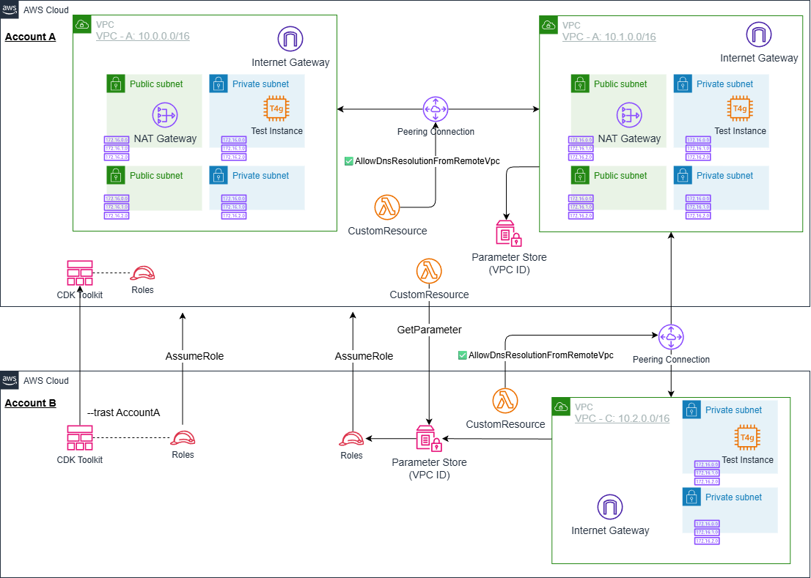
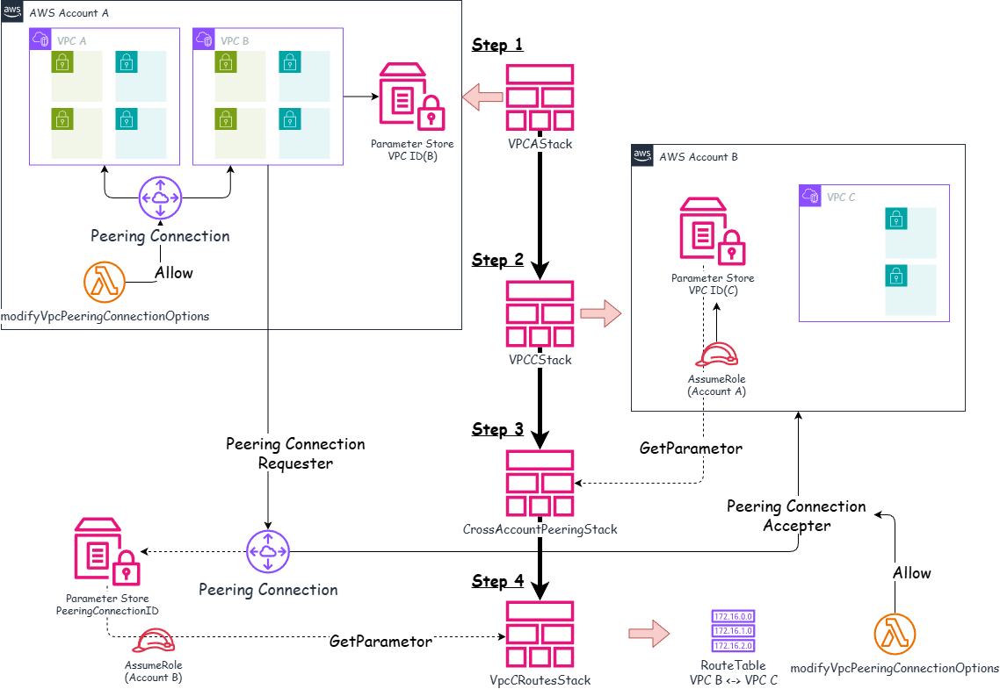
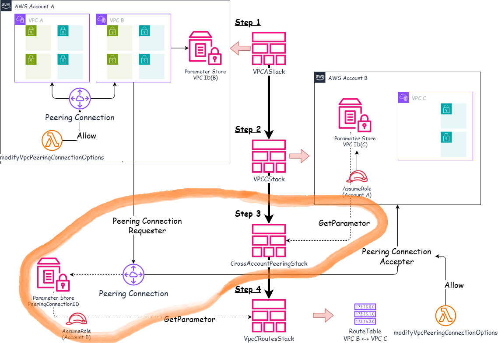
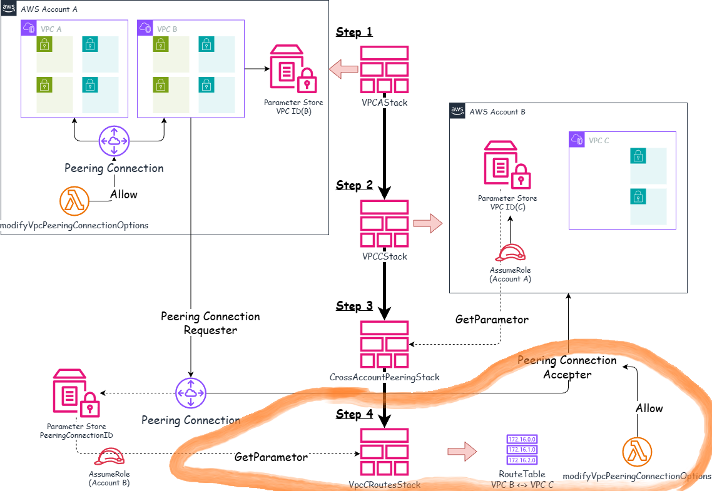
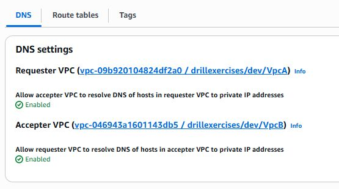
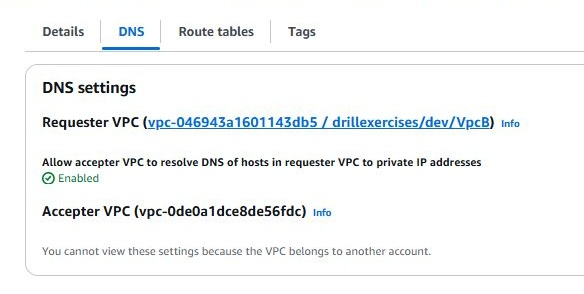
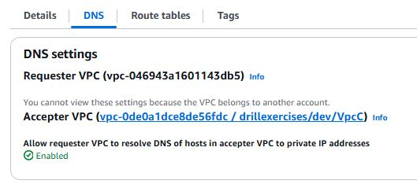

# VPCピアリング構成例

*他の言語で読む:* [](./README.ja.md) [](./README.md)


## アーキテクチャ概要

このプロジェクトは、AWS CDKを使用してVPCピアリング接続を構築するリファレンス実装です。

このアーキテクチャでは、以下の実装を確認することができます。

- VPC Peering接続の実装（同一アカウント・クロスアカウント）
- CDKにおけるクロスアカウントスタック参照の制限と対処法
- AWS Systems Manager Parameter Storeを使った値の共有
- Custom Resourceによるクロスアカウントパラメータ読み取り
- IAM Cross-Account Role の設計と実装
- VPC Peering接続の自動承認とルート設定
- クロスアカウントデプロイメントのベストプラクティス

### なぜVPC Peeringなのか?

1. マルチアカウント戦略: 組織では開発・ステージング・本番環境を別アカウントで管理することが推奨される
2. セキュアな通信: インターネットを経由せずにVPC間でプライベート通信が可能
3. コスト効率: Transit Gatewayと比較して低コストでシンプルなネットワーク構成が可能
4. CDKの複雑さ: クロスアカウントリソース参照におけるCDKの制限と回避策を学ぶ
5. 実務での必要性: エンタープライズ環境で必須のネットワーク構成パターン

## アーキテクチャ概要

構築する内容は次のとおりです。



### 構成パターン

```text
Account A (111111111111):
├─ VPC A (10.0.0.0/16)
│  └─ Test Instance (Private Subnet)
├─ VPC B (10.1.0.0/16)
│  └─ Test Instance (Private Subnet)
└─ VPC A ↔ VPC B Peering (同一アカウント)

Account B (222222222222):
└─ VPC C (10.2.0.0/16)
   └─ Test Instance (Private Isolated Subnet)

クロスアカウント Peering:
VPC B (Account A) ↔ VPC C (Account B)
```

### 主要コンポーネント

1. **VpcAStack (Account A)**
   - VPC A と VPC B の作成
   - 同一アカウント内でのVPC Peering接続
   - VPC B情報をParameter Storeに保存（Account B読み取り可能）

2. **VpcCStack (Account B)**
   - VPC C の作成
   - VPC C情報をParameter Storeに保存（Account A読み取り可能）
   - ParameterStoreReadRole の作成（Account Aからの読み取り用）

3. **CrossAccountPeeringStack (Account A)**
   - Custom ResourceでVPC C情報を取得
   - VPC B と VPC C 間のPeering接続作成
   - Peering接続ID をParameter Storeに保存
   - PeeringIdReadRole の作成（Account Bからの読み取り用）

4. **VpcCRoutesStack (Account B)**
   - Custom ResourceでPeering接続IDを取得
   - VPC C のルートテーブルにVPC B向けルートを追加



## 前提条件

- AWS CLI v2のインストールと設定
- Node.js 20+
- AWS CDK CLI（`npm install -g aws-cdk`）
- TypeScriptの基礎知識
- **2つのAWSアカウント**（開発用・本番用など）
- 各アカウントのAWS CLIプロファイル設定
- VPCの基本概念理解（[VPC Basics](https://github.com/ishiharatma/aws-cdk-reference-architectures/tree/main/infrastructure/workspaces/vpc-basics)を参照）

## プロジェクトディレクトリ構造

```text
vpc-peering/
├── bin/
│   └── vpc-peering.ts                     # アプリケーションエントリーポイント
├── lib/
│   ├── stacks/
│   │   ├── vpc-a-stack.ts                 # Step1. VPC A/B + 同一アカウントピアリング
│   │   ├── vpc-c-stack.ts                 # Step2. VPC C (Account B)
│   │   ├── cross-account-peering-stack.ts # Step3. クロスアカウントピアリング
│   │   └── vpc-c-routes-stack.ts          # Step4. VPC C ルート設定
│   ├── stages/
│   │   └── vpc-peering-stage.ts           # デプロイオーケストレーション
│   └── types/
│       └── vpc-peering-params.ts          # パラメータ型定義
├── parameters/
│   └── environments.ts                   # 環境別パラメータ
└── test/
    ├── compliance/
    │   └── cdk-nag.test.ts               # CDK Nagコンプライアンステスト
    ├── snapshot/
    │   └── snapshot.test.ts              # スナップショットテスト
    └── unit/
        ├── vpc-a.test.ts                 # VPC Peeringスタックテスト
        ├── vpc-c.test.ts                 # VPC Cスタックテスト
        ├── vpc-c-routes-stack.test.ts    # VPC Cルート設定スタックテスト
        └── cross-account-peering.test.ts # クロスアカウントピアリングテスト
```

## CDKにおけるクロスアカウント参照の課題

今回の実装では、クロスアカウントでの値参照が必要となります。このケースでは、以下のような問題があります。

### 問題: CloudFormationの実行時制限

CDKでクロスアカウントのリソースを参照する際、以下の制限により実行できません。

```typescript
// ❌ これは動作しない
const vpcCStack = new VpcCStack(this, 'VpcC', {
  env: { account: accountB }
});

const peeringStack = new CrossAccountPeeringStack(this, 'Peering', {
  env: { account: accountA },
  peerVpc: vpcCStack.vpc  // ❌ クロスアカウント参照不可
});
```

**エラーメッセージ:**

```text
Stack "CrossAccountPeering" cannot consume a cross reference from stack "VpcC". 
Cross stack references are only supported for stacks deployed to the same environment
```

### なぜ動作しないのか？

1. CloudFormation Export/Import の制限
   - CloudFormationのExport/Importは同一アカウント・同一リージョン内でのみ機能
   - 異なるアカウント間ではスタック出力を直接参照できない

2. CDK Stack間参照の仕組み
   - CDKは内部的にCloudFormationのExport/Importを使用
   - クロスアカウントでは、この仕組みが使えない

3. デプロイ時の評価タイミング
   - `vpcCStack.vpc.vpcId`はデプロイ時に評価される
   - Account Bにデプロイされたリソースの値を、Account Aのデプロイ時に取得できない

## 解決策

クロスアカウントでの参照を解決するためには、以下の方法が考えられます。
最終的には、2つめの方法を採用しました。

- 1. CDK Contextまたは環境変数ファイルによる静的なパラメータ受け渡し
- 2. Parameter StoreとAWS Custom Resourceによる受け渡し

### 1. CDK Context経由または環境変数ファイルでの手動パラメータ渡し

**実装:**

```typescript
// Account Bで作成したVPC C IDのパラメータを取得
const vpcCId = this.node.tryGetContext('vpcCId');

if (!vpcCId) {
  console.warn('vpcCId not provided. Run: cdk deploy --context vpcCId=vpc-xxx');
  return;
}

// VPC Peering作成
const peering = new ec2.CfnVPCPeeringConnection(this, 'Peering', {
  vpcId: localVpc.vpcId,
  peerVpcId: vpcCId,  // ✅ 動作する
  peerOwnerId: accountB,
});
```

**デプロイ手順:**

```bash
# 1. Account BでVPC C作成
cdk deploy --profile account-b VpcC

# 2. VPC C IDを手動で取得
VPC_C_ID=$(aws ec2 describe-vpcs --profile account-b \
  --filters "Name=tag:Name,Values=VpcC" \
  --query 'Vpcs[0].VpcId' --output text)

# 3. Account AでPeering作成（VPC IDを渡す）
cdk deploy --profile account-a --context vpcCId=$VPC_C_ID CrossAccountPeering
```

**問題点:**

- ⚠️ 手動でのパラメータ取得が必要
- CI/CDパイプラインでの自動化が困難
- ヒューマンエラーのリスク（コピー&ペーストミスなど）
- スケーラビリティの欠如（パラメータが増えると管理が煩雑）

### 2. Parameter StoreとAWS Custom Resource

**アーキテクチャ:**

```text
Account B:
├─ VPC C
├─ SSM Parameter (/project/env/vpc-c/id)
└─ ParameterStoreReadRole <- Account Aが引き受け可能

Account A:
├─ Custom Resource
│  ├─ assumeRole -> Account B の ParameterStoreReadRole
│  └─ getParameter -> VPC C IDを取得
└─ VPC Peering Connection (取得したVPC C IDを使用)
```





**実装:**

1. Account B: Parameter Store + Read Role作成

```typescript
// VpcCStack (Account B)
const vpcCIdParam = new ssm.StringParameter(this, 'VpcIdParam', {
  stringValue: this.vpcC.vpc.vpcId,
  parameterName: `/project/env/vpc-c/id`,
});

// Account Aからの読み取り用IAMロール
const readRole = new iam.Role(this, 'ParameterStoreReadRole', {
  assumedBy: new iam.AccountPrincipal(accountA),
  roleName: 'project-env-ParameterStoreReadRole',
});

vpcCIdParam.grantRead(readRole);
```

2. Account A: Custom Resourceでパラメータ読み取り

```typescript
// CrossAccountPeeringStack (Account A)
import * as cr from 'aws-cdk-lib/custom-resources';

const readRoleArn = `arn:aws:iam::${accountB}:role/project-env-ParameterStoreReadRole`;

// Custom Resourceで他アカウントのParameter Storeを読み取る
const getVpcCId = new cr.AwsCustomResource(this, 'GetVpcCId', {
  onUpdate: {
    service: 'SSM',
    action: 'getParameter',
    parameters: {
      Name: '/project/env/vpc-c/id',
    },
    region: 'ap-northeast-1',
    physicalResourceId: cr.PhysicalResourceId.of('VpcCIdLookup'),
    assumedRoleArn: readRoleArn,  // ✅ Account BのRoleを引き受ける
  },
  policy: cr.AwsCustomResourcePolicy.fromStatements([
    new iam.PolicyStatement({
      actions: ['sts:AssumeRole'],
      resources: [readRoleArn],
    }),
  ]),
});

const vpcCId = getVpcCId.getResponseField('Parameter.Value');

// VPC Peering作成
const peering = new ec2.CfnVPCPeeringConnection(this, 'Peering', {
  vpcId: localVpc.vpcId,
  peerVpcId: vpcCId,  // ✅ 自動取得した値を使用
  peerOwnerId: accountB,
});
```

**メリット:**

- 完全自動化: 手動でのパラメータ取得不要
- CI/CD対応: パイプラインに組み込み可能
- セキュア: IAMロールで厳密にアクセス制御
- スケーラブル: 複数パラメータにも対応可能
- エラー検出: デプロイ時に自動的にエラーが検出される

**デメリット:**

- Lambda関数が自動作成される（わずかなコスト増）
- 実装がやや複雑
- Custom Resourceのライフサイクル管理が必要

## 同一アカウント内でのVPC Peering

同一アカウント内でのVPC Peeringの実装は次のとおりです。

### VpcAStack の実装

```typescript
// lib/stacks/vpc-peering-stack.ts

export class VpcAStack extends cdk.Stack {
  public readonly vpcA: VpcConstruct;
  public readonly vpcB: VpcConstruct;

  constructor(scope: Construct, id: string, props: VpcAStackProps) {
    super(scope, id, props);

    // VPC A の作成
    this.vpcA = new VpcConstruct(this, 'VpcA', {
        // パラメータを指定
    });

    // VPC B の作成
    this.vpcB = new VpcConstruct(this, 'VpcB', {
        // パラメータを指定
    });

    // VPC Peering接続
    const peering = new VpcPeering(this, 'VpcABPeering', {
      vpc: this.vpcA.vpc,
      peerVpc: this.vpcB.vpc,
    });
  }
}
```

### VPC Peering Construct

```typescript
// common/constructs/vpc/vpc-peering.ts
export class VpcPeering extends Construct {
  public readonly vpcPeeringConnection: ec2.CfnVPCPeeringConnection;
  public readonly localSecurityGroup: ec2.ISecurityGroup;
  public readonly peeringSecurityGroup: ec2.ISecurityGroup;

  constructor(scope: Construct, id: string, props: VpcPeeringProps) {
    super(scope, id);

    // CIDR重複チェック
    if (props.vpc.vpcCidrBlock === props.peerVpc.vpcCidrBlock) {
      throw new Error(`VPC CIDR blocks overlap`);
    }

    // VPC Peering接続作成
    this.vpcPeeringConnection = new ec2.CfnVPCPeeringConnection(this, 'Connection', {
      vpcId: props.vpc.vpcId,
      peerVpcId: props.peerVpc.vpcId,
    });

    // ルート追加（Local VPC -> Peer VPC）
    props.vpc.privateSubnets.forEach((subnet, index) => {
      new ec2.CfnRoute(this, `RouteToPeer${index}`, {
        routeTableId: subnet.routeTable.routeTableId,
        destinationCidrBlock: props.peerVpc.vpcCidrBlock,
        vpcPeeringConnectionId: this.vpcPeeringConnection.ref,
      });
    });

    // ルート追加（Peer VPC -> Local VPC）
    props.peerVpc.privateSubnets.forEach((subnet, index) => {
      new ec2.CfnRoute(this, `RouteToLocal${index}`, {
        routeTableId: subnet.routeTable.routeTableId,
        destinationCidrBlock: props.vpc.vpcCidrBlock,
        vpcPeeringConnectionId: this.vpcPeeringConnection.ref,
      });
    });

    // セキュリティグループ（相互通信を許可）
    :

  }
}
```

## クロスアカウントVPC Peering

### 実装

```text
Step 3. Account Aにデプロイ: CrossAccountPeeringStack
   ├─ Custom ResourceでVPC C情報取得
   ├─ VPC B <-> VPC C Peering作成
   ├─ Peering ID をParameter Storeに保存
   └─ PeeringIdReadRole作成
```


```text
Step 4. Account Bにデプロイ: VpcCRoutesStack
   ├─ Custom ResourceでPeering ID取得
   └─ VPC C のルートテーブルを更新
```


### VpcCStack (Account B)

```typescript
// lib/stacks/vpc-c-stack.ts

export class VpcCStack extends cdk.Stack {
  public readonly vpcC: VpcConstruct;

  constructor(scope: Construct, id: string, props: VpcCStackProps) {
    super(scope, id, props);

    // VPC C作成
    this.vpcC = new VpcConstruct(this, 'VpcC', {
        // パラメータを指定
    });

    if (props.params.accountAId) {
      // VPC C情報をParameter Storeに保存
      const vpcCIdParam = new ssm.StringParameter(this, 'VpcIdParam', {
        stringValue: this.vpcC.vpc.vpcId,
        description: 'VPC C ID in Account B',
        parameterName: `/${props.project}/${props.environment}/vpc-c/id`,
      });

      const parameterReadRole = new iam.Role(this, 'ParameterStoreReadRole', {
        assumedBy: new iam.AccountPrincipal(props.params.accountAId),
        roleName: `${props.project}-${props.environment}-ParameterStoreReadRole`,
        description: `Role to allow Account ${props.params.accountAId} to read VPC C parameters from Parameter Store`,
      });
      // Grant read access to VPC C parameters
      vpcCIdParam.grantRead(parameterReadRole);

      // Peering承認用Role
      const peeringRole = new iam.Role(this, 'VpcPeeringRole', {
        assumedBy: new iam.AccountPrincipal(props.params.accountAId),
        roleName: props.peeringRoleName,
      });

      peeringRole.addToPolicy(new iam.PolicyStatement({
        actions: ['ec2:AcceptVpcPeeringConnection'],
        resources: ['*'],
      }));
    }
  }
}
```

### CrossAccountPeeringStack (Account A)

```typescript
// lib/stacks/cross-account-peering-stack.ts

export class CrossAccountPeeringStack extends cdk.Stack {
  public readonly peeringConnection: ec2.CfnVPCPeeringConnection;

  constructor(scope: Construct, id: string, props: CrossAccountPeeringStackProps) {
    super(scope, id, props);

    // Custom ResourceでVPC C IDを取得
    const getVpcCId = new cr.AwsCustomResource(this, 'GetVpcCId', {
      onUpdate: {
        service: 'SSM',
        action: 'getParameter',
        parameters: {
          Name: parameterName,
        },
        region: region,
        physicalResourceId: cr.PhysicalResourceId.of('VpcCIdLookup'),
        assumedRoleArn: parameterReadRoleArn,
      },
      policy: cr.AwsCustomResourcePolicy.fromStatements([
        new iam.PolicyStatement({
          actions: ['sts:AssumeRole'],
          resources: [parameterReadRoleArn],
        }),
      ]),
    });
    const vpcCId = getVpcCId.getResponseField('Parameter.Value');

    // VPC Peering作成
    this.peeringConnection = new ec2.CfnVPCPeeringConnection(this, 'VpcBCPeering', {
      vpcId: props.requestorVpc.vpcId,
      peerVpcId: vpcCId,
      peerOwnerId: props.params.accountBId,
      peerRegion: props.params.regionB,
      peerRoleArn: `arn:aws:iam::${props.params.accountBId}:role/${props.peeringRoleName}`,
    });

    // Peering ID をParameter Storeに保存
    const peeringIdParam = new ssm.StringParameter(this, 'PeeringConnectionIdParam', {
      stringValue: this.peeringConnectionId,
      description: 'VPC Peering Connection ID for VPC B <-> VPC C',
      parameterName: `/${props.project}/${props.environment}/peering/vpc-b-vpc-c/id`,
    });

    const peeringIdReadRole = new iam.Role(this, 'PeeringIdReadRole', {
      assumedBy: new iam.AccountPrincipal(props.params.accountBId),
      roleName: `${props.project}-${props.environment}-PeeringIdReadRole`,
      description: `Role to allow Account ${props.params.accountBId} to read Peering Connection ID from Parameter Store`,
    });
    peeringIdParam.grantRead(peeringIdReadRole);
  }
}
```

### VpcCRoutesStack (Account B)

```typescript
// lib/stacks/vpc-c-routes-stack.ts

export class VpcCRoutesStack extends cdk.Stack {
  constructor(scope: Construct, id: string, props: VpcCRoutesStackProps) {
    super(scope, id, props);

    // アカウントAのロール
    const parameterReadRoleArn = `arn:aws:iam::${props.params.accountAId}:role/${props.project}-${props.environment}-PeeringIdReadRole`;

    // Custom ResourceでPeering ID取得
    const getPeeringConnectionId = new cr.AwsCustomResource(this, 'GetPeeringConnectionId', {
      onUpdate: {
        service: 'SSM',
        action: 'getParameter',
        parameters: {
          Name: props.peeringIdParamName, // /${props.project}/${props.environment}/peering/vpc-b-vpc-c/id,
        },
        region: regionA,
        physicalResourceId: cr.PhysicalResourceId.of('PeeringConnectionIdLookup'),
        assumedRoleArn: parameterReadRoleArn,
      },
      policy: cr.AwsCustomResourcePolicy.fromStatements([
        new iam.PolicyStatement({
          actions: ['sts:AssumeRole'],
          resources: [parameterReadRoleArn],
        }),
      ]),
    });
    const peeringConnectionId = getPeeringConnectionId.getResponseField('Parameter.Value');

  }
}
```

## VPCピアリングのDNS解決オプション自動化（カスタムリソース実装例）

### なぜDNS解決オプションが必要か

VPCピアリング接続を作成しただけでは、ピア側VPCのプライベートDNS名を解決できません。例えば、VPC AからVPC BのEC2インスタンスに対して `ip-10-1-0-10.ap-northeast-1.compute.internal` のようなプライベートDNS名でアクセスしたい場合、DNS解決オプションを有効化する必要があります。

通常、このオプションはコンソールから手動で設定するか、AWS CLIで以下のように設定します。（ドキュメントは[こちら](https://docs.aws.amazon.com/vpc/latest/peering/vpc-peering-dns.html)）

```bash
aws ec2 modify-vpc-peering-connection-options \
  --vpc-peering-connection-id pcx-xxxxx \
  --requester-peering-connection-options AllowDnsResolutionFromRemoteVpc=true \
  --accepter-peering-connection-options AllowDnsResolutionFromRemoteVpc=true
```

本実装では、AWS CDKの`AwsCustomResource`を用いて、この設定を自動化しています。

### 同一アカウントの場合

同一アカウントの場合は、`RequesterPeeringConnectionOptions`と`AccepterPeeringConnectionOptions`の両方を指定します。



```typescript
    // Enable DNS resolution over VPC Peering
    const onCreate: cr.AwsSdkCall = {
        service: 'EC2',
        action: 'modifyVpcPeeringConnectionOptions',
        parameters: {
            VpcPeeringConnectionId: this.peeringConnection.ref,
                RequesterPeeringConnectionOptions: {
                    AllowDnsResolutionFromRemoteVpc: true
                },
                AccepterPeeringConnectionOptions: {
                    AllowDnsResolutionFromRemoteVpc: true,
                }
        },
        region: props.env?.region,
        physicalResourceId: cr.PhysicalResourceId.of(`EnableVpcPeeringDnsResolution:${this.peeringConnection.ref}`),
    }
    const onUpdate = onCreate;
    const onDelete: cr.AwsSdkCall = {
        service: "EC2",
        action: "modifyVpcPeeringConnectionOptions",
        parameters: {
            VpcPeeringConnectionId: this.peeringConnection.ref,
            RequesterPeeringConnectionOptions: {
                AllowDnsResolutionFromRemoteVpc: false
            },
            AccepterPeeringConnectionOptions: {
                AllowDnsResolutionFromRemoteVpc: false,
            }
        },
    }
    new cr.AwsCustomResource(this, 'EnableVpcPeeringDnsResolution', {
        onUpdate,
        onCreate,
        onDelete,
        policy: cr.AwsCustomResourcePolicy.fromSdkCalls({resources: cr.AwsCustomResourcePolicy.ANY_RESOURCE}),
    });
```

### クロスアカウントの場合

クロスアカウントでのVPCピアリングでは、Requester側とAccepter側で別々のスタックから設定します。

※同一アカウントの場合と重複する部分は省略して記載しています。

1. Requester側 (Account A): CrossAccountPeeringStack



```typescript
        parameters: {
            VpcPeeringConnectionId: this.peeringConnection.ref,
            RequesterPeeringConnectionOptions: {
                AllowDnsResolutionFromRemoteVpc: true
            },
        },
```

2. Accepter側 (Account B): VpcCRoutesStack



```typescript
        parameters: {
            VpcPeeringConnectionId: this.peeringConnection.ref,
            AccepterPeeringConnectionOptions: {
                AllowDnsResolutionFromRemoteVpc: true,
            }
        },
```

## デプロイとクリーンアップ

### 1. 環境パラメータ設定

```typescript
// parameters/environments.ts

export const params: Record<Environment, EnvParams> = {
  [Environment.DEVELOPMENT]: {
    accountAId: '111111111111',  // Account A
    accountBId: '222222222222',  // Account B
    regionA: 'ap-northeast-1',
    regionB: 'ap-northeast-1',
    vpcAConfig: {
      createConfig: {
        cidr: '10.0.0.0/16',
        maxAzs: 2,
        natGateways: 1,
      },
    },
    vpcBConfig: {
      createConfig: {
        cidr: '10.1.0.0/16',
        maxAzs: 2,
        natGateways: 1,
      },
    },
    vpcCConfig: {
      createConfig: {
        cidr: '10.2.0.0/16',
        maxAzs: 2,
        natGateways: 0,
      },
    },
  },
};
```

### 2. Bootstrap

#### 1. Account A (パイプラインアカウント) のブートストラップ

```bash
# Account Aでパイプラインをホストするための基本的なブートストラップ
npx cdk bootstrap \
    --profile account-a-admin \
    --cloudformation-execution-policies arn:aws:iam::aws:policy/AdministratorAccess \
    aws://111111111111/ap-northeast-1
```

#### 2. Account B (ターゲットアカウント) のブートストラップ

```bash
# Account Bをブートストラップし、Account Aを信頼する
npx cdk bootstrap \
    --profile account-b-admin \
    --cloudformation-execution-policies arn:aws:iam::aws:policy/AdministratorAccess \
    --trust 111111111111 \
    aws://222222222222/ap-northeast-1
```

**重要なポイント:**
- `--trust 111111111111`: Account A がAccount Bにデプロイできるようにします
- この設定により、Account AのブートストラップロールがAccount Bのリソースに対してAssumeRoleできるようになります

#### `--trust` オプションの動作原理

##### 1. IAM Roleの作成

`--trust` オプションを使用してブートストラップすると、以下のようなIAMロールが作成されます。

```json
{
  "Version": "2012-10-17",
  "Statement": [
    {
      "Effect": "Allow",
      "Principal": {
        "AWS": "arn:aws:iam::111111111111:root"
      },
      "Action": "sts:AssumeRole"
    }
  ]
}
```

このトラストポリシーにより、Account Aのプリンシパルが:
- **CDKDeployRole**: CloudFormationスタックのデプロイ
- **CDKFilePublishingRole**: S3へのファイルアセットのアップロード
- **CDKImagePublishingRole**: ECRへのDockerイメージのプッシュ

### 3. デプロイ

```bash
CDK_CROSS_ACCOUNT_ID=222222222222 npm run stage:deploy:all -w workspaces/vpc-peering --project=myproject --env=dev
```

### 4. 接続確認

VPC Aからの接続確認例です。下記例ではEC2に接続していますが、CloudShellを使用することもできます。

```bash
# VPC AのインスタンスからVPC BのインスタンスへPing
aws ssm start-session --profile account-a \
  --target i-0xxxxxxxxxxxxx  # VPC A Instance ID

# VPC Bへ疎通確認
ping 10.1.x.x  # VPC B Private IP

# VPC CへPing（クロスアカウント） -> VPC Aからは接続できない
ping 10.2.x.x  # VPC C Private IP
```

### 5. クリーンアップ

接続確認でCloudShellでVPCに接続する場合は、クリーンアップ前に環境を削除しておいてください。スタックの削除に失敗します。

```bash
# すべてのリソースを削除
CDK_CROSS_ACCOUNT_ID=222222222222 npm run stage:destroy:all -w workspaces/vpc-peering --project=myproject --env=dev
```

## まとめ

この記事では、AWS CDKを使用したVPC Peeringの実装を、クロスアカウントの課題と解決策を中心に解説しました。

### 学んだこと

1. CDKのクロスアカウント制限
   - CloudFormation Export/Importは同一アカウント内のみ
   - Stack間参照はクロスアカウントで動作しない

2. 実装パターン
   - Parameter Store: 値の保存と共有
   - IAM Cross-Account Role: セキュアなアクセス制御
   - Custom Resource: デプロイ時の動的な値取得

## 参考資料

- [AWS VPC Peering Guide](https://docs.aws.amazon.com/vpc/latest/peering/what-is-vpc-peering.html)
- [AWS CDK Custom Resources](https://docs.aws.amazon.com/cdk/api/v2/docs/aws-cdk-lib.custom_resources-readme.html)
- [AWS Systems Manager Parameter Store](https://docs.aws.amazon.com/systems-manager/latest/userguide/systems-manager-parameter-store.html)
- [IAM Cross-Account Access](https://docs.aws.amazon.com/IAM/latest/UserGuide/id_roles_common-scenarios_aws-accounts.html)
