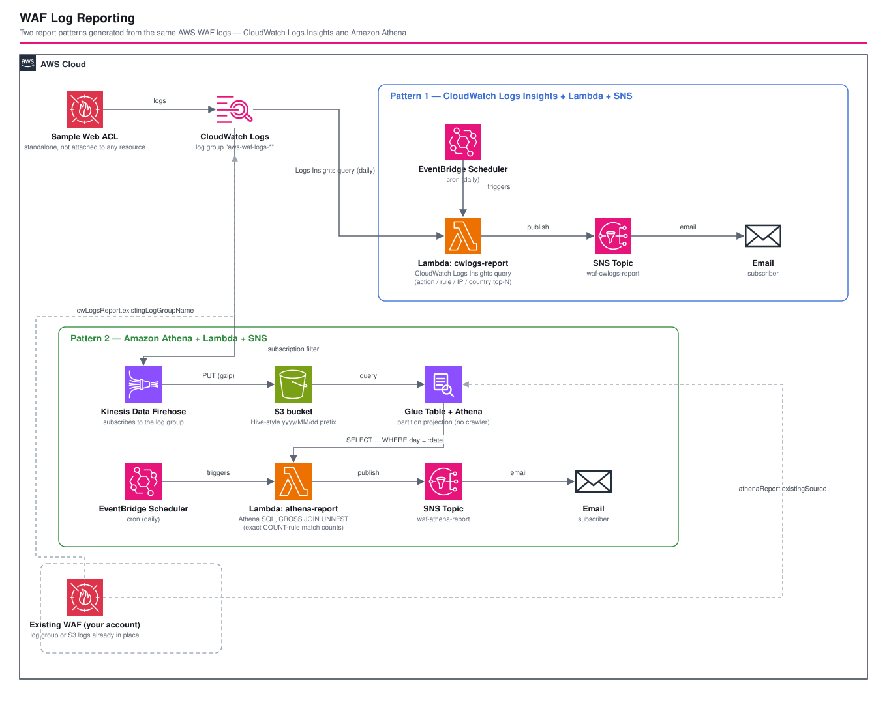

# WAF Log Reporting - AWS CDK Reference Architecture

*Read this in other languages:* [](./README.ja.md) [](./README.md)

> **Level: 300 (Advanced)**

Two independent, self-contained implementations of the same operational need — a daily digest of what a WAF Web ACL blocked (and, for rules still running in Count mode, would have blocked) — built two different ways: **CloudWatch Logs Insights** (Pattern 1) and **Amazon Athena** (Pattern 2). A standalone sample Web ACL generates realistic logs for both, but each report stack can instead be pointed at an existing WAF's logs already running in your account.

## 📑 Table of Contents

- [Architecture Overview](#-architecture-overview)
- [Design Decisions & Best Practices](#-design-decisions--best-practices)
- [Cost Optimization](#-cost-optimization)
- [Security Considerations](#-security-considerations)
- [Prerequisites](#-prerequisites)
- [Deployment Guide](#-deployment-guide)
- [Testing Strategy](#-testing-strategy)
- [Customization](#-customization)
- [Troubleshooting](#-troubleshooting)
- [References](#-references)

## 🏗️ Architecture Overview



```text
Sample Web ACL (standalone, not attached to any resource)
  └─► CloudWatch Logs log group "aws-waf-logs-*"
        │
        ├─ Pattern 1 ─────────────────────────────────────────────────────
        │  EventBridge Scheduler (cron, daily)
        │    └─► Lambda: cwlogs-report (CloudWatch Logs Insights queries)
        │          └─► SNS Topic ──► Email
        │
        └─ Pattern 2 ─────────────────────────────────────────────────────
           Subscription Filter ─► Kinesis Data Firehose ─► S3 (Hive prefix)
             └─► Glue Table (partition projection, no crawler) + Athena Workgroup
                   ▲
                   │ EventBridge Scheduler (cron, daily)
                   └─► Lambda: athena-report (Athena SQL, CROSS JOIN UNNEST)
                         └─► SNS Topic ──► Email

Either report stack can instead target an existing WAF's logs:
  cwLogsReport.existingLogGroupName  -> Pattern 1 reads that log group directly
  athenaReport.existingSource        -> Pattern 2 builds its Glue table over that S3 location
                                         (native AWS WAF S3 layout or your own Firehose/Hive layout)
```

### Key Components

- **Stack 1 — `WafLogReportingSampleWafStack`** – a REGIONAL WAFv2 Web ACL created purely to generate representative logs, never associated with an ALB/API Gateway/CloudFront distribution. It mixes an AWS managed rule group running in **Count** mode, an AWS managed rule group running in **Block** mode, and a **rate-based Block rule**, so both report stacks always have both COUNT and BLOCK activity to report on.
- **Stack 2 — `WafLogReportingCwLogsReportStack`** (Pattern 1) – a scheduled Lambda that runs several CloudWatch Logs Insights queries directly against the WAF log group and publishes a formatted digest to SNS. No extra infrastructure beyond the log group itself.
- **Stack 3 — `WafLogReportingAthenaReportStack`** (Pattern 2) – a scheduled Lambda that runs SQL against a Glue Data Catalog table (Athena partition projection, no crawler) built over the WAF logs in S3, and publishes the same kind of digest to SNS.
- **Report Lambdas** – Python, produce a bilingual (`en`/`ja`) text report: total requests, Action breakdown, Top-N blocked rules/IPs/countries/URIs, Top-N Count-mode rule matches (Block-promotion candidates), and a day-over-day anomaly flag.

### Architecture Characteristics

| Characteristic | Value | Rationale |
|---|---|---|
| Availability | Fully managed, no single point of failure in the reporting path | EventBridge Scheduler, Lambda, SNS, CloudWatch Logs, S3, Glue and Athena are all regional managed services |
| Scalability | Pattern 1 scales with log-group query cost; Pattern 2 scales with S3/Athena cost | See [Cost Optimization](#-cost-optimization) for the crossover point |
| Security | Least-privilege IAM per report; encrypted in transit and at rest | SNS AWS-managed KMS key + `enforceSSL`, S3 `BLOCK_ALL` public access, IAM scoped to specific log group / Glue table / workgroup ARNs |
| Cost | Pay-per-use, no idle fixed infrastructure | No NAT Gateway, no always-on compute; see [Cost Optimization](#-cost-optimization) |

## 🎯 Design Decisions & Best Practices

### 1. Two independent implementations of the same report, not one

**Decision**: Ship Pattern 1 (CloudWatch Logs Insights) and Pattern 2 (Athena) as two separate, independently deployable stacks that produce the same *shape* of report, rather than picking one "best" implementation.

**Rationale**:
- ✅ The two approaches have genuinely different cost/latency/accuracy trade-offs (see below) — which one is "right" depends on log volume and retention, not on either being objectively better
- ✅ Lets a reader deploy both against the same sample WAF and compare the actual reports side by side
- ✅ Demonstrates the same operational problem (WAF Count/Block reporting) solved with two very different AWS service combinations, useful as a reference for either

**Trade-offs**:
- ❌ Roughly twice the infrastructure of a single-pattern implementation if you only need one
- ❌ Report text formatting logic is duplicated between the two Lambda functions rather than shared, to keep each function's deployment package self-contained

### 2. A standalone sample Web ACL mixing Count and Block rules

**Decision**: `WafLogReportingSampleWafStack` creates one Web ACL with three rules — `AWSManagedRulesCommonRuleSet` in **Count** mode, `AWSManagedRulesKnownBadInputsRuleSet` in **Block** mode, and a rate-based rule in **Block** mode — and associates it with nothing.

**Rationale**:
- ✅ A Web ACL with only Block rules can't demonstrate the "Count-mode promotion candidate" section of the report; a Web ACL with only Count rules never produces a BLOCK entry. Mixing both means every deployment immediately has interesting data in both report sections.
- ✅ Not associating the Web ACL with a resource keeps this stack deployable in isolation — no ALB, API Gateway, or CloudFront distribution required just to see the reporting pattern work
- ✅ Matches a genuinely common real operational scenario: running a *new* managed rule group in Count mode alongside an already-trusted rule group in Block mode, while deciding whether to promote the new one

**Trade-offs**:
- ❌ Because nothing is associated with it, the sample Web ACL only sees traffic if you generate it yourself (see [Deployment Guide](#-deployment-guide) for how to exercise it)

### 3. Pluggable report target: sample Web ACL or an existing WAF

**Decision**: Both report stacks accept an optional "existing" parameter (`cwLogsReport.existingLogGroupName` / `athenaReport.existingSource`) that redirects the report at logs you already have, instead of the stacks' own sample Web ACL.

**Rationale**:
- ✅ The realistic use case for this pattern is adding a report on top of a WAF you already run in production — the sample Web ACL exists only so the pattern is deployable and demonstrable standalone
- ✅ Cross-stack references are resolved by **physical name**, not `Fn::ImportValue` (see `cdk-ts-dev-guide`'s cross-stack-reference guidance): `WafLogReportingSampleWafStack` gives its log group a deterministic literal name (`aws-waf-logs-<project>-<env>`), so the report stacks can consume that name as a plain string prop with no CloudFormation export/import coupling, and swapping in an existing log group name requires no stack changes
- ✅ `athenaReport.existingSource` supports **both** S3 layouts you're likely to already have: AWS WAF's native direct-to-S3 logging destination (`AWSLogs/<account>/WAFLogs/<region>/<web-acl>/yyyy/MM/dd/HH/...`) and a Hive-style layout from your own Firehose pipeline — see `lib/types/waf-log-reporting-params.ts`

**Trade-offs**:
- ❌ The "existing" mode still deploys the sample Web ACL stack (it's always created); if you only ever use "existing" mode in production, `WafLogReportingSampleWafStack` is dead weight you may want to remove

### 4. Daily scheduled query instead of a real-time subscription filter

**Decision**: Both patterns run on an **EventBridge Scheduler cron** (default: daily), pulling a window of log data at query time — not a CloudWatch Logs subscription filter reacting to every log event in real time (the pattern used by the `sns-basic` reference architecture's `cwlogs-to-sns` chain).

**Rationale**:
- ✅ A daily *digest* is an aggregate report, not a per-event alert — computing "Top 5 blocked IPs today" requires seeing the whole day's data at once, which a subscription filter (one Lambda invocation per log batch) cannot do without external state
- ✅ Batches the compute cost into one query per day instead of one Lambda invocation per WAF log batch (WAF logs *every* evaluated request by default, which can be a high-volume stream)

**Trade-offs**:
- ❌ Not real-time — a spike is visible only at the next scheduled run, not the moment it happens (pair this pattern with a separate CloudWatch Alarm on the Web ACL's `BlockedRequests` metric for immediate alerting)

### 5. Athena partition projection instead of a Glue crawler

**Decision**: Both Glue tables in `WafLogReportingAthenaReportStack` use [partition projection](https://docs.aws.amazon.com/athena/latest/ug/partition-projection.html) — computed from the known S3 key layout — instead of a Glue Crawler that discovers partitions by scanning S3.

**Rationale**:
- ✅ Both WAF's native S3 logging layout and this stack's own Firehose output use a fully predictable, date-based key structure, so projection can compute partition locations without ever listing S3
- ✅ No crawler to schedule, pay for, or wait on — new partitions (today's date) are queryable the instant data lands, with zero additional infrastructure
- ✅ Avoids the Glue Data Catalog partition-count growth (and `GetPartitions` cost/latency) that accumulates over years of daily crawler runs

**Trade-offs**:
- ❌ Requires the S3 key layout to be known and stable up front; an unpredictable or crawler-discovered layout would need a real crawler instead

### 6. `CROSS JOIN UNNEST` for exact Count-mode accounting

**Decision**: The Athena report's Count-mode query (`query_count_mode_rules` in `src/lambda/athena-report/index.py`) uses `CROSS JOIN UNNEST(nonterminatingmatchingrules)` to count **every** Count-mode rule match on every request; the CloudWatch Logs Insights equivalent can only inspect the *first* match per request (Logs Insights has no array-unnesting operator).

**Rationale**:
- ✅ A request can match more than one Count-mode rule simultaneously; undercounting matters exactly when you're trying to decide whether a specific rule is safe to promote to Block
- ✅ This is the single clearest, most concrete example of "Athena's SQL can do things Logs Insights' query language can't" in this reference architecture — see the code comments in both Lambda functions for the full explanation

**Trade-offs**:
- ❌ Requires understanding the WAF log JSON schema and Presto/Athena `UNNEST` syntax, versus Logs Insights' simpler `stats ... by` syntax

### Well-Architected Framework Alignment

| Pillar | Implementation |
|---|---|
| **Operational Excellence** | Every stack emits `CfnOutput`s for its key resource names/ARNs; report Lambdas log structured JSON at INFO level; report text always states which engine produced it |
| **Security** | IAM scoped to specific log group / Glue table / Athena workgroup ARNs (not `*`), SNS AWS-managed KMS key + `enforceSSL`, S3 `BLOCK_ALL` public access, WAF-to-CloudWatch-Logs resource policy scoped to the specific Web ACL ARN |
| **Reliability** | Both report Lambdas poll query status with a bounded timeout and raise on non-success states rather than silently reporting partial data |
| **Performance Efficiency** | Athena partition projection scans only the day(s) queried, not the whole log history; CloudWatch Logs Insights queries are bounded to the configured report period |
| **Cost Optimization** | No idle compute; Athena query-results lifecycle expiration; see [Cost Optimization](#-cost-optimization) for the Pattern 1 vs Pattern 2 volume trade-off |
| **Sustainability** | No provisioned/always-on capacity anywhere in either pattern — everything scales to zero between scheduled runs |

## 💰 Cost Optimization

### Estimated Monthly Costs (ap-northeast-1, sample Web ACL only, light demo traffic)

```text
Pattern 1 (CloudWatch Logs Insights)
  CloudWatch Logs ingestion+storage (<100 MB):  Free tier / ~$0.05
  Logs Insights queries (~5 GB scanned/month):  ~$0.03
  Lambda + EventBridge Scheduler + SNS:         Free tier
  -------------------------------------------
  Total (Pattern 1, Dev):                       < $1/month

Pattern 2 (Athena)
  Firehose (<1 GB ingested):                    ~$0.03
  S3 storage (<1 GB):                           ~$0.02
  Athena (~1 GB scanned/month):                 ~$0.005
  Glue Data Catalog (1 database, 1 table):      Free tier
  Lambda + EventBridge Scheduler + SNS:         Free tier
  -------------------------------------------
  Total (Pattern 2, Dev):                       < $1/month
```

### Estimated Monthly Costs at Production Scale (illustrative: ~10M requests/day, ~1.2 KB/log line ⇒ ~360 GB of WAF logs/month)

```text
Pattern 1 (CloudWatch Logs Insights)
  CloudWatch Logs ingestion (360 GB):     ~$270   (≈$0.76/GB ingested)
  CloudWatch Logs storage (360 GB):       ~$12    (≈$0.033/GB-month)
  Logs Insights queries (~12 GB/day scanned, 1 run/day): ~$2
  -------------------------------------------
  Total (Pattern 1, ~360 GB/month):       ~$280-290/month

Pattern 2 (Athena)
  Firehose ingestion (360 GB):            ~$10    (≈$0.029/GB)
  S3 storage (360 GB):                    ~$8     (≈$0.023/GB-month, Standard)
  Athena queries (~12 GB/day scanned × ~6 queries × 30 days): ~$13  (≈$5/TB scanned)
  Glue Data Catalog:                      Free tier
  -------------------------------------------
  Total (Pattern 2, ~360 GB/month):       ~$30-35/month
```

*Figures are approximate and illustrative only — CloudWatch Logs, S3, Firehose and Athena pricing vary by region and change over time. Always confirm current pricing with the [AWS Pricing Calculator](https://calculator.aws/). The takeaway that scales robustly across regions/prices is the **shape** of the trade-off: CloudWatch Logs ingestion cost is charged per GB regardless of whether you ever query it, while Pattern 2 only pays S3's much lower per-GB storage rate plus Athena's per-query-scanned cost — so the cost gap between the two patterns widens as log volume grows.*

### Cost Optimization Strategies

1. **Partition projection instead of a Glue Crawler** — zero ongoing crawler cost, and new data is queryable immediately (see [Design Decision 5](#5-athena-partition-projection-instead-of-a-glue-crawler))
2. **Athena query-results lifecycle expiration** (`athenaReport.queryResultsExpirationDays`, default 7 days dev / 30 days prod) — bounds the query-results S3 bucket's storage cost
3. **Short CloudWatch Logs retention on the report Lambdas' own log groups** (`ONE_MONTH` by default) — the WAF log group itself should be sized for your actual audit/retention requirement, since (in Pattern 1) it directly drives CloudWatch Logs storage cost
4. **If log volume is high and Pattern 1's CloudWatch Logs ingestion cost matters, prefer Pattern 2** — see the production-scale comparison above
5. **No NAT Gateway / VPC** — every Lambda runs outside a VPC, since none needs private network access

## 🔒 Security Considerations

### Network Security

This reference architecture has no VPC-resident resources — every component (Lambda, SNS, S3, Glue, Athena, CloudWatch Logs) is a regional managed service reached over the AWS API, not the public internet path. There is no inbound network surface to secure.

### Security Best Practices Implemented

- ✅ IAM least privilege: `logs:StartQuery` is scoped to the specific target log group ARN; `athena:*`/`glue:*` actions are scoped to the specific workgroup/database/table ARNs; `s3:GetObject`/`PutObject` grants are scoped to the specific buckets involved (no `*` resource in any policy this stack writes)
- ✅ The CloudWatch Logs resource policy that lets AWS WAF write logs is scoped to the specific Web ACL ARN via an `aws:SourceArn` condition, not to "any WAF in this account"
- ✅ SNS topics use `enforceSSL: true` and the AWS-managed `alias/aws/sns` KMS key
- ✅ S3 buckets block all public access (`BlockPublicAccess.BLOCK_ALL`), use SSE-S3, and enforce SSL
- ✅ Report Lambdas have no other AWS API access beyond what each report needs — no wildcard IAM actions

### CDK Nag Compliance

All three stacks pass `cdk-nag`'s `AwsSolutionsChecks` with documented suppressions only (see `test/compliance/cdk-nag.test.ts` for the exact rule IDs and rationale — e.g. `AwsSolutions-IAM5` for the two `logs:GetQueryResults`/`StopQuery` actions that CloudWatch Logs Insights does not support scoping to a log group ARN, and `AwsSolutions-S1` for demo S3 buckets without server access logging).

```bash
npm run test:compliance -w workspaces/waf-log-reporting
```

## 📋 Prerequisites

- AWS Account with appropriate permissions
- AWS CLI v2.x installed and configured
- Node.js 20.x or later
- AWS CDK 2.x (`aws-cdk-lib` ^2.236, bundled in this workspace)
- Git

### Required IAM Permissions

The deploying user/role needs permissions to create/manage:
- WAFv2 (Web ACLs, logging configurations)
- CloudWatch Logs (log groups, resource policies, subscription filters)
- Lambda (functions)
- EventBridge Scheduler (schedules)
- SNS (topics, subscriptions)
- Kinesis Data Firehose (delivery streams)
- S3 (buckets)
- Glue (databases, tables)
- Athena (workgroups)
- IAM (roles for Lambda/Firehose)

## 🚀 Deployment Guide

### 1. Clone and Setup

```bash
cd infrastructure
npm install
```

### 2. Configure Environment Parameters

Edit `parameters/dev-params.ts` (or set environment variables) before deploying — both report topics' email subscribers default to a placeholder:

```bash
export NOTIFICATION_EMAIL_CWLOGS="you@example.com"
export NOTIFICATION_EMAIL_ATHENA="you@example.com"
```

`bin/waf-log-reporting.ts` prints a warning at synth time if either placeholder address is still in use. To point either report at an existing WAF instead of the sample Web ACL, see [Customization](#-customization).

### 3. Deploy

```bash
export PROJECT_NAME=waf-log-reporting
export ENV=dev
npm run bootstrap -w workspaces/waf-log-reporting   # first time only, per account/region
npm run deploy:all -w workspaces/waf-log-reporting
```

### 4. Verify Deployment

```bash
# Confirm both Email subscriptions (check your inbox and click each confirmation link)

# Generate some traffic against the sample Web ACL so both reports have data.
# The Web ACL is not associated with a resource, so use GetSampledRequests-style
# testing via the AWS CLI, or temporarily associate it with a test ALB/API Gateway
# stage — see AWS WAF's "Testing your Web ACL" guidance in References below.

# Manually invoke a report before its scheduled time:
aws lambda invoke --function-name <cwlogs-report Lambda name output> /dev/stdout
aws lambda invoke --function-name <athena-report Lambda name output> /dev/stdout
```

## 🧪 Testing Strategy

### Test Structure

```text
test/
├── snapshot/          # Full CloudFormation template + resource-count snapshots (all 3 stacks)
│   └── snapshot.test.ts
├── unit/               # Fine-grained resource/property/relationship assertions, one file per stack
│   ├── sample-waf-stack.test.ts
│   ├── cwlogs-report-stack.test.ts
│   └── athena-report-stack.test.ts
└── compliance/         # cdk-nag AwsSolutions checks, one describe block per stack
    └── cdk-nag.test.ts
```

### 1. Snapshot Tests

**Purpose**: Catch unintended CloudFormation template changes during refactoring.

```bash
npm run test:snapshot -w workspaces/waf-log-reporting
npm run test:snapshot:update -w workspaces/waf-log-reporting   # after an intentional change
```

### 2. Unit Tests

**Purpose**: Verify each stack — and each of its "sample" vs "existing" target modes — produces the expected resources, properties and relationships.

**Test Categories** (21 tests):
- ✅ Sample Web ACL: REGIONAL scope, exactly the three Count/Block rules, log group naming, resource policy scoping, logging configuration
- ✅ CloudWatch Logs report: targets the sample log group by default, targets `existingLogGroupName` when set, SNS SSL/KMS, IAM scoping, EventBridge Scheduler
- ✅ Athena report: Firehose provisioning in sample mode (and its absence in existing mode), Hive-style vs native-date partition projection depending on `existingSource`, partition-scheme env var, S3 public-access blocking, validation error when native mode is requested without enough information

### 3. Compliance Tests

```bash
npm run test:compliance -w workspaces/waf-log-reporting
```

### Run Everything

```bash
npm run build -w workspaces/waf-log-reporting
npm test -w workspaces/waf-log-reporting
npm run lint -w workspaces/waf-log-reporting
```

## ⚙️ Customization

### Point Pattern 1 at an existing WAF's log group

```typescript
// parameters/dev-params.ts
cwLogsReport: {
    existingLogGroupName: 'aws-waf-logs-my-existing-webacl',
},
```

### Point Pattern 2 at an existing WAF's S3 logs

```typescript
// parameters/dev-params.ts
athenaReport: {
    existingSource: {
        bucketName: 'my-existing-waf-logs-bucket',
        webAclName: 'my-existing-webacl',        // native AWS WAF S3 layout
        // -- or, for your own Firehose/Hive-style pipeline instead --
        // keyPrefix: 'my-firehose-prefix/',
        // hiveStylePartitioning: true,
    },
},
```

### Tune report content and schedule

```typescript
// parameters/dev-params.ts
cwLogsReport: {
    topN: 10,                        // Top-10 instead of Top-5 per section
    anomalyThresholdPercent: 25,     // flag smaller volume spikes
    scheduleExpression: 'cron(0 21 * * ? *)',  // 21:00 instead of 00:00
    locale: 'en',                    // English report text instead of Japanese
},
```

### Change the sample Web ACL's rate limit

```typescript
// parameters/dev-params.ts
sampleWaf: {
    rateLimitPerIp: 500,   // lower threshold, easier to trigger BLOCK entries while testing
},
```

## 🔧 Troubleshooting

### Issue: Athena report Lambda fails with "table not found" or returns zero rows

**Symptoms**: `athena-report` Lambda errors, or `total` is always 0 even after generating traffic.

**Solutions**:
1. In sample mode, Firehose buffers before flushing to S3 (`firehoseBufferingInterval`, default 60s) — wait at least one buffering interval after generating traffic before invoking the report.
2. Confirm at least one object exists under the expected prefix: `aws s3 ls s3://<WafLogsBucket>/waf-logs/ --recursive`.
3. Partition projection computes partition locations from today's date — if no data exists yet for the queried day, the query succeeds but returns zero rows (this is expected, not an error).

### Issue: `cdk deploy` fails creating the CloudWatch Logs resource policy

**Symptoms**: `AWS::Logs::ResourcePolicy` creation fails with a limit-related error.

**Solutions**:
1. CloudWatch Logs resource policies are limited to 10 per account/region. List existing ones with `aws logs describe-resource-policies` and remove unused policies, or adapt `WafLogReportingSampleWafStack` to reuse an existing policy if you already have one for another WAF/service.

### Issue: Email subscription never receives the daily report

**Symptoms**: The Lambda runs successfully (check its CloudWatch Logs) but no email arrives.

**Solutions**:
1. Check your inbox (and spam folder) for the "AWS Notification - Subscription Confirmation" email and click the confirmation link — SNS Email subscriptions are not active until confirmed.
2. Verify the subscription status: `aws sns list-subscriptions-by-topic --topic-arn <ReportTopicArn output>`.

### Issue: `cdk deploy` warns about a placeholder notification email

**Symptoms**: Synth-time warning about `change-me@example.com`.

**Solutions**:
1. Set `NOTIFICATION_EMAIL_CWLOGS` / `NOTIFICATION_EMAIL_ATHENA` before deploying, or edit `parameters/dev-params.ts` / `parameters/prd-params.ts` directly.

## 📚 References

### AWS Documentation
- [AWS WAF logging destinations](https://docs.aws.amazon.com/waf/latest/developerguide/logging.html)
- [AWS WAF log fields](https://docs.aws.amazon.com/waf/latest/developerguide/logging-fields.html)
- [CloudWatch Logs Insights query syntax](https://docs.aws.amazon.com/AmazonCloudWatch/latest/logs/CWL_QuerySyntax.html)
- [Athena partition projection](https://docs.aws.amazon.com/athena/latest/ug/partition-projection.html)
- [Testing your AWS WAF Web ACL](https://docs.aws.amazon.com/waf/latest/developerguide/web-acl-testing.html)

### AWS Well-Architected
- [AWS Well-Architected Framework](https://aws.amazon.com/architecture/well-architected/)

### AWS CDK
- [aws-cdk-lib.aws_wafv2 module](https://docs.aws.amazon.com/cdk/api/v2/docs/aws-cdk-lib.aws_wafv2-readme.html)
- [aws-cdk-lib.aws_glue module](https://docs.aws.amazon.com/cdk/api/v2/docs/aws-cdk-lib.aws_glue-readme.html)
- [CDK Best Practices](https://docs.aws.amazon.com/cdk/v2/guide/best-practices.html)

### Related Open Source
- **Accompanist** — an open-source command-line tool for analyzing AWS WAF logs, a useful reference for what a richer, offline-CLI-based version of this report could look like (search for it directly; not linked here to avoid pointing at an unverified URL)

### Related Architectures
- [sns-basic](../sns-basic/) – the simpler "CloudWatch Logs → Lambda → SNS" chain this pattern's Pattern 1 builds on, and the direct-Lambda-write pattern this workspace's Firehose alternative can be compared against
- [cloudwatch-logs-s3-archive](../cloudwatch-logs-s3-archive/) – general CloudWatch Logs → S3 archival patterns (Firehose, export tasks, direct Lambda write), useful background for Pattern 2's Firehose leg
- [budgets-cost-anomaly-detection](../budgets-cost-anomaly-detection/) – another scheduled-digest-to-a-messaging-channel pattern (EventBridge Scheduler → compute → notify), for cost data instead of WAF logs

## 📄 License

This project is licensed under the MIT License - see the [LICENSE](../../LICENSE) file for details.

## 👥 Contributing

Contributions are welcome! Please read [CONTRIBUTING.md](../../CONTRIBUTING.md) for details.

## 🏆 About This Reference Architecture

This reference architecture demonstrates AWS CDK best practices for building production-ready infrastructure.

**Target Level**: 300 (Advanced)

---

**Note**: This is a reference implementation. Always review and customize according to your specific requirements and organizational policies before deploying to production.
